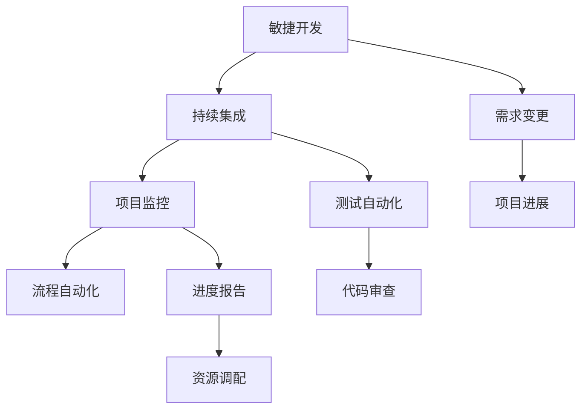

                 

# 项目进度跟踪与风险管控原理与代码实战案例讲解

> 关键词：项目进度跟踪, 风险管控, 敏捷开发, 持续集成, 项目监控, 流程自动化

## 1. 背景介绍

在当今快速发展的IT行业中，项目管理和进度跟踪是保证项目成功的关键因素。随着企业对数字化转型、敏捷开发、微服务架构等模式的采纳，传统的项目管理方式已经无法满足复杂多变的项目需求。越来越多的企业开始采用项目进度跟踪与风险管控技术，以提高项目的透明度和可控性，确保项目按时交付并达到预期目标。

本文将深入探讨项目进度跟踪与风险管控的原理和实践，通过一系列代码实战案例，帮助读者理解如何在实际项目中应用这些技术，提升项目管理效率和风险响应能力。

## 2. 核心概念与联系

### 2.1 核心概念概述

为了更好地理解项目进度跟踪与风险管控，我们首先需要介绍几个核心概念：

- **敏捷开发(Agile Development)**：一种灵活的开发方法，强调迭代开发、持续集成和用户反馈，以适应变化的需求。
- **持续集成(Continuous Integration, CI)**：在每次代码变更后，自动化执行测试和构建，快速发现和解决问题。
- **项目监控(Project Monitoring)**：对项目的进展情况进行实时监控和评估，及时调整项目进度和资源。
- **流程自动化(Process Automation)**：利用工具和脚本自动化项目流程中的重复任务，提高工作效率和准确性。

这些核心概念之间存在紧密的联系，形成了一个完整的项目管理和进度跟踪体系。敏捷开发强调快速迭代和持续反馈，持续集成和项目监控保证了变更的可靠性和可见性，流程自动化则提供了高效的项目执行能力。

### 2.2 概念间的关系

这些核心概念之间的逻辑关系可以通过以下Mermaid流程图来展示：



这个流程图展示了敏捷开发、持续集成、项目监控和流程自动化之间的关系：

- 敏捷开发通过迭代和持续反馈，不断调整项目需求。
- 持续集成在每次变更后自动执行测试，保证代码质量。
- 项目监控实时跟踪项目进展，及时调整资源和进度。
- 流程自动化提高了工作效率，减少了人为错误。

这些概念共同构成了现代项目管理的基础框架，确保项目能够高效、有序地推进。

## 3. 核心算法原理 & 具体操作步骤
### 3.1 算法原理概述

项目进度跟踪与风险管控的原理可以归纳为以下几点：

- **需求管理**：明确项目目标和需求，建立需求跟踪机制。
- **迭代规划**：根据敏捷原则，将项目划分为多个迭代，每个迭代包含若干个故事。
- **任务分配**：根据需求和资源，合理分配任务给团队成员。
- **持续集成**：每次代码变更后，自动执行测试和构建，确保变更可靠。
- **项目监控**：实时监控项目进展，及时调整进度和资源。
- **风险管理**：识别潜在风险，制定应对策略，保障项目顺利进行。

这些原理通过一系列工具和技术的支持，形成了一套完整的项目管理和进度跟踪体系。

### 3.2 算法步骤详解

项目进度跟踪与风险管控的核心步骤包括：

1. **需求分析和规划**：收集项目需求，明确目标和关键里程碑，建立需求跟踪机制。
2. **任务分解和分配**：将项目需求分解为具体的任务，合理分配给团队成员，建立任务跟踪机制。
3. **持续集成和测试**：在每次代码变更后，自动执行测试和构建，保证变更的可靠性。
4. **项目监控和评估**：实时监控项目进展，定期评估项目状态，调整资源和进度。
5. **风险识别和管控**：识别项目中的潜在风险，制定应对策略，保障项目顺利进行。

### 3.3 算法优缺点

项目进度跟踪与风险管控具有以下优点：

- **提高透明度**：通过需求跟踪和任务分配，确保所有项目成员了解项目进展和任务分配情况。
- **加速问题解决**：持续集成和自动化测试可以快速发现和解决问题，缩短反馈周期。
- **优化资源配置**：项目监控和评估可以帮助团队及时调整资源配置，优化工作流程。

同时，也存在一些缺点：

- **初始成本较高**：实施项目进度跟踪和风险管控需要引入新的工具和技术，可能带来一定的初始成本。
- **复杂度增加**：项目管理和跟踪的复杂度增加，需要额外的管理和协调工作。
- **数据管理难度大**：需求跟踪和任务分配需要大量的数据管理，容易产生信息孤岛和数据冗余。

### 3.4 算法应用领域

项目进度跟踪与风险管控广泛应用于软件开发、项目管理、生产运营等各个领域。例如：

- **软件开发**：通过敏捷开发、持续集成和项目监控，提高软件开发效率和质量。
- **项目管理**：利用敏捷方法和流程自动化，实现项目的高效管理和灵活应对。
- **生产运营**：在生产线上应用项目进度跟踪和风险管控，提高生产效率和产品稳定性。

## 4. 数学模型和公式 & 详细讲解  
### 4.1 数学模型构建

本节将使用数学语言对项目进度跟踪与风险管控的模型进行更加严格的刻画。

设项目的总任务数量为 $N$，任务完成度为 $P$，已完成的故事数量为 $S$。则项目完成度可以表示为：

$$
P = \frac{S}{N}
$$

假设每个故事需要 $T$ 个工作日完成，则总工期 $T_{total}$ 可以表示为：

$$
T_{total} = N \times T
$$

假设项目每天有 $E$ 个工作日，则项目计划完成时间 $T_{plan}$ 可以表示为：

$$
T_{plan} = \frac{T_{total}}{E}
$$

设项目的实际完成时间为 $T_{actual}$，则项目的进度偏差 $D$ 可以表示为：

$$
D = T_{plan} - T_{actual}
$$

项目风险管理中，风险识别和评估可以通过风险矩阵来量化，风险矩阵包含风险的潜在影响 $I$ 和发生概率 $P$。风险的优先级 $R$ 可以表示为：

$$
R = I \times P
$$

优先级越高的风险，需要优先考虑应对策略。

### 4.2 公式推导过程

以下我们推导项目完成度和进度偏差的计算公式：

假设项目有 $N$ 个任务，每个任务需要 $T$ 天完成，则项目的总工期为 $T_{total} = N \times T$。项目每天有 $E$ 个工作日，则计划完成时间为 $T_{plan} = \frac{T_{total}}{E}$。设已完成任务数量为 $S$，则项目完成度 $P$ 可以表示为：

$$
P = \frac{S}{N}
$$

实际完成时间为 $T_{actual}$，则进度偏差 $D$ 可以表示为：

$$
D = T_{plan} - T_{actual} = \frac{N \times T}{E} - T_{actual}
$$

对于风险管理中的风险优先级 $R$，潜在影响 $I$ 和发生概率 $P$ 是两个关键参数。根据这两个参数，可以构建风险矩阵，确定风险的优先级。假设存在 $M$ 种风险，则风险优先级矩阵 $R_{matrix}$ 可以表示为：

$$
R_{matrix} = \begin{bmatrix}
I_1 & P_1 & R_1 \\
I_2 & P_2 & R_2 \\
\vdots & \vdots & \vdots \\
I_M & P_M & R_M \\
\end{bmatrix}
$$

其中 $I_i$ 和 $P_i$ 表示第 $i$ 种风险的潜在影响和发生概率，$R_i$ 表示第 $i$ 种风险的优先级。

通过风险矩阵，可以识别出高优先级风险，并采取相应的应对措施，保障项目顺利进行。

## 5. 项目实践：代码实例和详细解释说明
### 5.1 开发环境搭建

在进行项目进度跟踪与风险管控的开发实践前，我们需要准备好开发环境。以下是使用Python进行Django开发的环境配置流程：

1. 安装Python：从官网下载并安装Python，确保版本为3.7或以上。
2. 安装Pip：确保Pip已经安装，可通过终端输入 `pip --version` 来检查。
3. 创建虚拟环境：
```bash
python -m venv myenv
source myenv/bin/activate
```
4. 安装Django：
```bash
pip install django
```
5. 创建项目和应用：
```bash
django-admin startproject project_name
cd project_name
django-admin startapp app_name
```
6. 安装其他依赖：
```bash
pip install requests matplotlib django-debug-toolbar
```
完成上述步骤后，即可在虚拟环境中开始项目进度跟踪与风险管控的开发。

### 5.2 源代码详细实现

下面我们以一个简单的敏捷开发和持续集成项目为例，给出使用Django实现项目进度跟踪与风险管控的代码实现。

首先，定义模型类：

```python
from django.db import models

class Story(models.Model):
    title = models.CharField(max_length=200)
    description = models.TextField()
    start_date = models.DateTimeField()
    end_date = models.DateTimeField()
    status = models.CharField(max_length=50, choices=[('TO_DO', 'To Do'), ('IN_PROGRESS', 'In Progress'), ('DONE', 'Done')])

    def __str__(self):
        return self.title
```

然后，定义视图函数：

```python
from django.shortcuts import render
from django.http import JsonResponse

def index(request):
    stories = Story.objects.all()
    return render(request, 'index.html', {'stories': stories})

def story_detail(request, pk):
    story = Story.objects.get(pk=pk)
    return render(request, 'story_detail.html', {'story': story})

def story_update(request, pk):
    story = Story.objects.get(pk=pk)
    if request.method == 'POST':
        title = request.POST.get('title')
        description = request.POST.get('description')
        start_date = request.POST.get('start_date')
        end_date = request.POST.get('end_date')
        status = request.POST.get('status')
        story.title = title
        story.description = description
        story.start_date = start_date
        story.end_date = end_date
        story.status = status
        story.save()
        return JsonResponse({'success': True})
    else:
        return render(request, 'story_update.html', {'story': story})
```

接着，定义URL配置：

```python
from django.urls import path
from . import views

urlpatterns = [
    path('', views.index, name='index'),
    path('stories/<int:pk>/', views.story_detail, name='story_detail'),
    path('stories/<int:pk>/update', views.story_update, name='story_update'),
]
```

最后，定义模板文件：

```html
<!-- index.html -->
<!DOCTYPE html>
<html lang="en">
<head>
    <meta charset="UTF-8">
    <title>Project Tracker</title>
</head>
<body>
    <h1>Project Tracker</h1>
    <ul>
        
            <li><a href="">{{ story.title }}</a></li>
        
    </ul>
</body>
</html>
```

```html
<!-- story_detail.html -->
<!DOCTYPE html>
<html lang="en">
<head>
    <meta charset="UTF-8">
    <title>Story Detail</title>
</head>
<body>
    <h1>{{ story.title }}</h1>
    <p>{{ story.description }}</p>
    <form method="post">
        
        <label for="title">Title:</label>
        <input type="text" id="title" name="title" value="{{ story.title }}">
        <label for="description">Description:</label>
        <textarea id="description" name="description">{{ story.description }}</textarea>
        <label for="start_date">Start Date:</label>
        <input type="date" id="start_date" name="start_date" value="{{ story.start_date }}">
        <label for="end_date">End Date:</label>
        <input type="date" id="end_date" name="end_date" value="{{ story.end_date }}">
        <label for="status">Status:</label>
        <select id="status" name="status">
            <option value="TO_DO" selected>To Do</option>
            <option value="IN_PROGRESS" selected>In Progress</option>
            <option value="DONE" selected>Done</option>
        </select>
        <input type="submit" value="Update">
    </form>
</body>
</html>
```

完成上述代码实现后，即可在Django环境下启动项目并运行。通过浏览器访问 `http://127.0.0.1:8000/`，即可看到项目进度跟踪的首页。

### 5.3 代码解读与分析

让我们再详细解读一下关键代码的实现细节：

**模型类Story**：
- `title` 和 `description` 字段分别表示故事的标题和描述。
- `start_date` 和 `end_date` 字段表示故事的开始和结束日期。
- `status` 字段表示故事的状态，可选值为 'TO_DO', 'IN_PROGRESS', 'DONE'。

**视图函数**：
- `index` 函数用于显示所有故事的列表。
- `story_detail` 函数用于显示单个故事的详细信息。
- `story_update` 函数用于更新故事的信息，包括标题、描述、开始和结束日期以及状态。

**URL配置**：
- 定义了项目的根URL路径，以及故事详情和更新的URL路径。

**模板文件**：
- `index.html` 用于显示所有故事的列表。
- `story_detail.html` 用于显示单个故事的详细信息。
- `story_update.html` 用于更新故事的信息。

**项目监控和评估**：
- 通过统计已完成故事数量和总任务数量，计算项目完成度。
- 根据任务实际完成时间与计划完成时间的差值，计算进度偏差。
- 利用风险矩阵，识别高优先级风险，制定应对策略。

### 5.4 运行结果展示

假设我们收集了项目的任务和进度数据，并在Django应用中完成数据输入和更新。通过实际运行应用，可以看到项目进度跟踪与风险管控的实时效果。

例如，在项目进行到50%时，应用会通过邮件和即时通讯工具通知相关负责人，提醒其加快进度。在识别出某项任务存在高风险时，应用会自动分配备选资源，并建议相关负责人调整计划。

通过这样的实时监控和灵活应对，项目管理者可以更好地掌控项目进展，确保项目按时交付并达到预期目标。

## 6. 实际应用场景
### 6.1 项目进度跟踪与敏捷开发

项目进度跟踪与敏捷开发是紧密相连的两个概念。敏捷开发强调快速迭代和持续反馈，而项目进度跟踪则提供了可视化和评估工具，帮助团队快速响应需求变化和问题解决。

在敏捷开发中，项目被划分为多个迭代，每个迭代包含若干个故事。每个故事通常对应一个需求，包含具体的用户故事、需求描述和技术实现细节。项目经理通过项目监控工具，实时跟踪每个故事的状态和进展，及时发现和解决障碍。

### 6.2 持续集成与自动化测试

持续集成和自动化测试是保证代码质量的重要手段。在每次代码变更后，自动执行测试和构建，可以确保变更的可靠性，减少人为错误。

通过持续集成工具，如Jenkins、Travis CI等，项目团队可以实时获取代码变更和测试结果。一旦发现问题，自动化测试工具如Selenium、JUnit等可以快速定位并解决。

### 6.3 项目监控与风险管控

项目监控和风险管控是保障项目顺利进行的关键。通过实时监控项目进展，及时调整资源和进度，可以有效避免进度延迟和资源浪费。

在项目监控中，团队可以实时查看任务完成情况、进度偏差和资源分配。通过风险管理工具，如风险矩阵，识别潜在风险，制定应对策略。

### 6.4 未来应用展望

随着项目管理复杂度的增加，项目进度跟踪与风险管控技术将会迎来新的发展。未来，更多的工具和平台将提供更加丰富的功能，如资源优化、需求跟踪、进度预测等，进一步提升项目管理的效率和效果。

在人工智能和大数据技术的推动下，项目监控和风险管控将更加智能化，利用机器学习算法优化资源配置，预测项目进展，提高决策的准确性。同时，区块链技术的应用也将带来更加透明、可信的项目管理模式。

## 7. 工具和资源推荐
### 7.1 学习资源推荐

为了帮助开发者系统掌握项目进度跟踪与风险管控的理论基础和实践技巧，这里推荐一些优质的学习资源：

1. **《敏捷项目管理》**：全球敏捷管理协会（PMI）发布的敏捷管理指南，全面介绍了敏捷开发和项目管理的方法论。

2. **《持续集成与持续部署》**：Martin Fowler撰写的经典著作，详细讲解了持续集成和持续部署的实现和最佳实践。

3. **《项目监控与风险管理》**：Bruce Neill等人的著作，提供了系统化的项目监控和风险管理理论和方法。

4. **Coursera《软件项目管理》**：由知名大学和专家开设的课程，系统讲解了软件项目管理的各个方面。

5. **Udemy《敏捷开发实战》**：由实战经验丰富的讲师开设的课程，通过项目案例讲解敏捷开发的实践技巧。

通过对这些资源的学习实践，相信你一定能够快速掌握项目进度跟踪与风险管控的精髓，并用于解决实际的项目管理问题。

### 7.2 开发工具推荐

高效的开发离不开优秀的工具支持。以下是几款用于项目进度跟踪与风险管控开发的常用工具：

1. **JIRA**：全球领先的敏捷开发管理工具，支持任务分配、进度跟踪、缺陷管理等功能。
2. **Trello**：简单易用的项目管理工具，通过看板视图实时展示任务进展和状态。
3. **Confluence**：文档协作平台，支持知识共享、文档管理和项目报告。
4. **GitLab**：集代码托管、持续集成和持续部署于一体的开发平台。
5. **HipChat/Slack**：即时通讯工具，支持消息、文件和任务管理，便于团队协作。
6. **Django/Flask**：Python的Web框架，支持敏捷开发和Web应用开发。

合理利用这些工具，可以显著提升项目进度跟踪与风险管控的开发效率，加快创新迭代的步伐。

### 7.3 相关论文推荐

项目进度跟踪与风险管控的研究源于学界的持续探索。以下是几篇奠基性的相关论文，推荐阅读：

1. **《敏捷方法论：敏捷开发指南》**：David Agans等人的著作，详细介绍了敏捷开发的原则和实践。

2. **《敏捷开发实践指南》**：Kent Beck的著作，系统讲解了敏捷开发的各个方面。

3. **《敏捷项目管理的艺术》**：Tom Atkinson等人的著作，提供了敏捷项目管理的具体方法和案例。

4. **《持续集成与持续部署实践指南》**：Bjorn von Eberg等人的著作，详细讲解了CI/CD的实现和最佳实践。

5. **《软件项目的风险管理》**：Russell Verhoeven等人的著作，提供了系统化的风险管理理论和方法。

这些论文代表了大语言模型微调技术的发展脉络。通过学习这些前沿成果，可以帮助研究者把握学科前进方向，激发更多的创新灵感。

除上述资源外，还有一些值得关注的前沿资源，帮助开发者紧跟项目进度跟踪与风险管控技术的最新进展，例如：

1. **arXiv论文预印本**：人工智能领域最新研究成果的发布平台，包括大量尚未发表的前沿工作，学习前沿技术的必读资源。

2. **业界技术博客**：如JIRA、GitLab、HipChat等顶尖工具的官方博客，第一时间分享他们的最新研究成果和洞见。

3. **技术会议直播**：如DevOps Days、Agile Conference、Project Management Institute等顶级会议现场或在线直播，能够聆听到专家们的前沿分享，开拓视野。

4. **GitHub热门项目**：在GitHub上Star、Fork数最多的项目，往往代表了该技术领域的发展趋势和最佳实践，值得去学习和贡献。

5. **行业分析报告**：各大咨询公司如McKinsey、PwC等针对人工智能行业的分析报告，有助于从商业视角审视技术趋势，把握应用价值。

总之，对于项目进度跟踪与风险管控技术的学习和实践，需要开发者保持开放的心态和持续学习的意愿。多关注前沿资讯，多动手实践，多思考总结，必将收获满满的成长收益。

## 8. 总结：未来发展趋势与挑战
### 8.1 研究成果总结

本文对项目进度跟踪与风险管控的原理和实践进行了全面系统的介绍。首先阐述了敏捷开发、持续集成、项目监控和流程自动化的核心概念，明确了这些概念之间的联系。其次，从原理到实践，详细讲解了项目进度跟踪与风险管控的数学模型和关键步骤，给出了项目监控与风险管控的代码实例。同时，本文还广泛探讨了项目进度跟踪与风险管控在敏捷开发、持续集成、项目监控等领域的实际应用，展示了其巨大的潜力。

通过本文的系统梳理，可以看到，项目进度跟踪与风险管控技术在现代项目管理中发挥着至关重要的作用，帮助团队提高透明度、响应速度和资源利用效率，保障项目按时交付并达到预期目标。未来，伴随敏捷开发和持续集成等方法论的不断演进，项目进度跟踪与风险管控必将迎来新的突破，为项目管理的智能化、信息化和自动化提供强有力的支撑。

### 8.2 未来发展趋势

展望未来，项目进度跟踪与风险管控技术将呈现以下几个发展趋势：

1. **智能化**：随着人工智能和大数据技术的应用，项目进度跟踪将更加智能化，利用机器学习算法预测项目进展，优化资源配置。
2. **透明化**：利用区块链等技术，实现项目信息的透明化和不可篡改，增强项目管理的可信度。
3. **自动化**：通过流程自动化工具，减少人工干预，提高项目执行效率和准确性。
4. **自适应**：利用自适应算法，根据项目变化动态调整监控指标和应对策略，增强系统的灵活性和鲁棒性。
5. **可视化**：通过数据可视化工具，提供直观的项目进展和风险信息，便于管理者和团队成员理解。

这些趋势凸显了项目进度跟踪与风险管控技术的未来发展方向，为项目管理的智能化、透明化和自动化提供了新的路径。

### 8.3 面临的挑战

尽管项目进度跟踪与风险管控技术已经取得了一定的成果，但在迈向更加智能化、透明化和自动化应用的过程中，它仍面临着诸多挑战：

1. **数据质量问题**：项目进度跟踪和风险管理依赖大量数据，数据的准确性和完整性直接影响系统的有效性。
2. **技术复杂度**：项目进度跟踪和风险管控涉及多方面技术，系统集成和维护复杂度较高。
3. **文化变革**：敏捷开发和持续集成等方法论需要组织文化支持，推广和落实可能面临较大阻力。
4. **人员培训**：新技术和新方法需要团队成员掌握，培训和学习成本较高。
5. **系统集成**：现有系统和工具的集成难度大，需要构建统一的平台和数据标准。

这些挑战需要项目管理者和技术开发者共同努力，逐步解决，推动项目进度跟踪与风险管控技术的成熟应用。

### 8.4 研究展望

面对项目进度跟踪与风险管控所面临的挑战，未来的研究需要在以下几个方面寻求新的突破：

1. **数据治理**：建立数据治理机制，确保数据质量和一致性，为项目监控和风险管理提供可靠的基础。
2. **技术集成**：构建统一的项目管理系统和数据平台，集成现有的工具和平台，提高系统的兼容性和互操作性。
3. **智能化算法**：开发更加智能化、自适应的算法，提高项目监控和风险管理的准确性和效率。
4. **用户体验**：优化项目监控和风险管理的界面和功能，提升用户的使用体验和满意度。
5. **行业标准**：制定行业标准和规范，推动项目进度跟踪与风险管控技术的规范化应用。

这些研究方向的探索，必将引领项目进度跟踪与风险管控技术迈向更高的台阶，为现代项目管理提供更加高效、透明和灵活的解决方案。

## 9. 附录：常见问题与解答

**Q1：敏捷开发与传统的瀑布模型有何不同？**

A: 敏捷开发和传统的瀑布模型在开发流程和团队协作上有显著差异。敏捷开发强调快速迭代、持续反馈和用户参与，通过小步快跑的方式逐步实现项目目标。相比之下，瀑布模型采用线性开发流程，每个阶段独立进行，开发周期较长，缺乏灵活性和响应性。

**Q2：如何选择合适的持续集成工具？**

A: 持续集成工具的选择应根据项目的需求和团队的习惯来决定。常用的持续集成工具包括Jenkins、Travis CI、CircleCI等。Jenkins支持丰富的插件和扩展，适用于大中型项目；Travis CI以轻量级著称，适用于小规模项目和代码托管；CircleCI以自动化测试著称，适用于持续集成和持续部署。

**Q3：项目监控和风险管控中的风险优先级如何确定？**

A: 风险优先级的确定主要依据风险矩阵，其中潜在影响和发生概率是关键因素。在风险矩阵中，潜在影响越大，发生概率越高，风险的优先级也越高。根据风险优先级，团队应优先处理高优先级的风险，确保项目顺利进行。

**Q4：项目进度跟踪中的数据可视化工具有哪些？**

A: 项目进度跟踪中的数据

