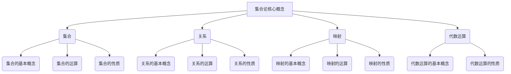

# 线性代数导引：集合论基础

## 1. 背景介绍

### 1.1 问题的由来

线性代数是数学的一个重要分支,它研究向量空间及其上的线性变换。线性代数不仅在纯数学领域有着广泛的应用,同时也是工程、物理、经济等诸多领域不可或缺的基础工具。然而,线性代数的学习往往让初学者感到困难,其中一个重要原因是缺乏对基础概念的透彻理解。集合论作为数学的基石,为线性代数奠定了坚实的理论基础。掌握集合论对于理解线性代数的核心概念至关重要。

### 1.2 研究现状

目前,市面上有大量线性代数教材,但大多数教材在介绍基础概念时,缺乏对集合论的系统阐述。一些教材虽然提及了集合论的相关内容,但往往过于简单,无法帮助读者建立起坚实的集合论基础。另一些教材则过于注重形式化和抽象,使得初学者难以理解和掌握。因此,如何以通俗易懂的方式系统地介绍集合论,为学习线性代数奠定基础,成为一个亟待解决的问题。

### 1.3 研究意义

集合论是数学的基石,是理解线性代数及其他数学分支的关键。通过对集合论的系统学习,读者可以掌握线性代数所需的基础概念,如集合、映射、关系等,从而更好地理解线性代数中的向量空间、线性变换等核心概念。此外,集合论本身也具有重要的理论价值和应用价值,在计算机科学、逻辑学等领域有着广泛的应用。因此,系统地学习集合论不仅有助于掌握线性代数,也能为读者打开通往其他学科的大门。

### 1.4 本文结构

本文将系统地介绍集合论的基础知识,为读者学习线性代数做好充分准备。全文共分为八个部分:

1. 背景介绍
2. 核心概念与联系
3. 核心算法原理与具体操作步骤
4. 数学模型和公式详细讲解与举例说明
5. 项目实践:代码实例和详细解释说明
6. 实际应用场景
7. 工具和资源推荐
8. 总结:未来发展趋势与挑战

## 2. 核心概念与联系

集合论的核心概念包括集合、关系、映射和代数运算。这些概念不仅是集合论自身的基础,也是线性代数及其他数学分支的基石。

1. **集合**是最基本的概念,包括集合的基本概念、运算和性质。掌握集合的概念对于理解线性代数中的向量空间至关重要。

2. **关系**描述了集合元素之间的联系,是理解线性代数中线性变换的基础。

3. **映射**是一种特殊的关系,在线性代数中扮演着重要角色,如线性变换就是一种映射。

4. **代数运算**为集合论提供了运算框架,为理解线性代数中的向量运算和矩阵运算奠定了基础。

这些概念相互关联、相互渗透,构成了集合论的理论体系。掌握了这些核心概念,就为学习线性代数打下了坚实的基础。

## 3. 核心算法原理与具体操作步骤

### 3.1 算法原理概述

在集合论中,虽然没有典型的算法,但是有一些基本的操作和推理方法,这些方法构成了集合论的核心算法原理。

1. **集合构造算法**:通过列举法、描述性定义法等方式构造集合。
2. **集合运算算法**:包括并集、交集、补集、笛卡尔积等集合运算。
3. **关系构造算法**:通过笛卡尔积等方式构造关系。
4. **关系运算算法**:包括关系的合成、逆运算等。
5. **映射构造算法**:通过定义映射规则构造映射。
6. **映射运算算法**:包括映射的合成、逆运算等。
7. **证明算法**:使用集合论的公理和推理规则进行证明。

这些算法原理为集合论的计算和推理奠定了基础,也为线性代数中的相关运算和推理提供了支持。

### 3.2 算法步骤详解

以下将详细介绍集合运算算法的步骤:

#### 3.2.1 并集算法

输入: 两个集合 A 和 B
输出: 集合 A 和 B 的并集 C

步骤:
1. 初始化一个空集 C
2. 遍历集合 A 中的每个元素 x
   - 如果 x 不在 C 中,将 x 加入 C
3. 遍历集合 B 中的每个元素 y
   - 如果 y 不在 C 中,将 y 加入 C
4. 返回 C

#### 3.2.2 交集算法

输入: 两个集合 A 和 B
输出: 集合 A 和 B 的交集 C

步骤:
1. 初始化一个空集 C
2. 遍历集合 A 中的每个元素 x
   - 如果 x 也在集合 B 中,将 x 加入 C
3. 返回 C

#### 3.2.3 补集算法

输入: 一个集合 A 和一个全集 U
输出: 集合 A 在 U 中的补集 C

步骤:
1. 初始化一个空集 C
2. 遍历全集 U 中的每个元素 x
   - 如果 x 不在集合 A 中,将 x 加入 C
3. 返回 C

#### 3.2.4 笛卡尔积算法

输入: 两个集合 A 和 B
输出: 集合 A 和 B 的笛卡尔积 C

步骤:
1. 初始化一个空集 C
2. 遍历集合 A 中的每个元素 x
   - 遍历集合 B 中的每个元素 y
     - 将有序对 (x, y) 加入 C
3. 返回 C

这些算法步骤清晰、易于实现,为集合运算提供了计算框架。掌握这些算法不仅有助于理解集合论,也为学习线性代数中的相关运算奠定了基础。

### 3.3 算法优缺点

#### 优点:

1. **简单直观**: 这些算法步骤清晰,易于理解和实现。
2. **高效可靠**: 算法时间复杂度较低,能够可靠地计算出正确结果。
3. **通用性强**: 这些算法适用于各种集合类型,具有良好的通用性。

#### 缺点:

1. **空间开销**: 对于大型集合,算法可能需要占用较大的内存空间。
2. **重复计算**: 某些情况下可能存在重复计算的问题,影响效率。
3. **缺乏优化**: 这些基本算法缺乏进一步的优化,在特殊情况下可能效率不高。

总的来说,这些算法虽然简单但有效,为集合论计算奠定了基础。在实际应用中,可以根据具体情况对算法进行优化和改进。

### 3.4 算法应用领域

集合论的基本算法在许多领域都有广泛的应用,包括但不限于:

1. **数据库系统**: 集合运算在关系代数中有着重要应用,是实现关系数据库查询的基础。
2. **编译原理**: 集合论在编译器的词法分析、语法分析等环节有着广泛应用。
3. **形式化方法**: 集合论是形式化规范说明和形式化验证的理论基础。
4. **计算机图形学**: 集合运算在计算机图形学中有着广泛应用,如图形裁剪、区域填充等。
5. **人工智能**: 集合论在知识表示、推理等人工智能领域有着重要应用。

总之,集合论的基本算法简单而有效,在许多领域都有着广泛的应用,是计算机科学及其他学科不可或缺的基础工具。

## 4. 数学模型和公式详细讲解与举例说明

### 4.1 数学模型构建

在集合论中,我们可以使用数学模型来形式化描述集合、关系和映射等概念。以下是一些常见的数学模型:

1. **集合模型**:
   - 一个集合可以用一个符号表示,如 $A$、$B$ 等。
   - 一个集合的元素可以用列举法或描述性定义来表示,如 $A = \{1, 2, 3\}$ 或 $B = \{x | x \text{ 是偶数}\}$。

2. **关系模型**:
   - 一个关系可以用一个符号表示,如 $R$、$S$ 等。
   - 一个关系可以用它的图形表示或笛卡尔积的子集来表示,如 $R = \{(x, y) | x^2 + y^2 = 1\}$。

3. **映射模型**:
   - 一个映射可以用一个符号表示,如 $f$、$g$ 等。
   - 一个映射可以用它的定义域、值域和映射规则来表示,如 $f: \mathbb{R} \rightarrow \mathbb{R}, f(x) = x^2$。

这些数学模型为集合论提供了形式化的描述框架,为后续的运算和推理奠定了基础。

### 4.2 公式推导过程

在集合论中,我们可以使用公理和推理规则来推导各种公式和定理。以下是一个推导过程的示例:

**定理**: 对于任意集合 $A$、$B$ 和 $C$,有 $(A \cup B) \cap C = (A \cap C) \cup (B \cap C)$。

**证明**:
1) 取 $x \in (A \cup B) \cap C$

   由集合运算的定义,我们知道 $x \in A \cup B$ 且 $x \in C$。

   根据 $x \in A \cup B$ 的定义,我们有 $x \in A$ 或 $x \in B$。

   如果 $x \in A$,那么由 $x \in C$,我们可以推出 $x \in A \cap C$,从而 $x \in (A \cap C) \cup (B \cap C)$。

   如果 $x \in B$,那么由 $x \in C$,我们可以推出 $x \in B \cap C$,从而 $x \in (A \cap C) \cup (B \cap C)$。

   因此,我们证明了 $(A \cup B) \cap C \subseteq (A \cap C) \cup (B \cap C)$。

2) 取 $x \in (A \cap C) \cup (B \cap C)$

   由集合运算的定义,我们知道 $x \in A \cap C$ 或 $x \in B \cap C$。

   如果 $x \in A \cap C$,那么 $x \in A$ 且 $x \in C$,从而 $x \in (A \cup B) \cap C$。

   如果 $x \in B \cap C$,那么 $x \in B$ 且 $x \in C$,从而 $x \in (A \cup B) \cap C$。

   因此,我们证明了 $(A \cap C) \cup (B \cap C) \subseteq (A \cup B) \cap C$。

3) 综上所述,我们有 $(A \cup B) \cap C = (A \cap C) \cup (B \cap C)$。

这个推导过程展示了如何使用集合运算的定义和推理规则来证明一个重要的集合恒等式。类似的推导过程也可以应用于其他公式和定理的证明。

### 4.3 案例分析与讲解

为了更好地理解集合论的概念和公式,我们将通过一些具体案例进行分析和讲解。

**案例 1**: 设 $A = \{1, 2, 3\}$、$B = \