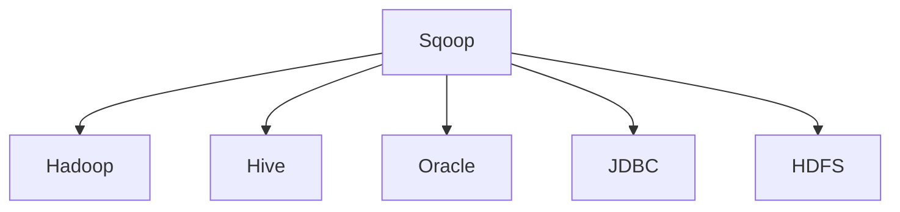
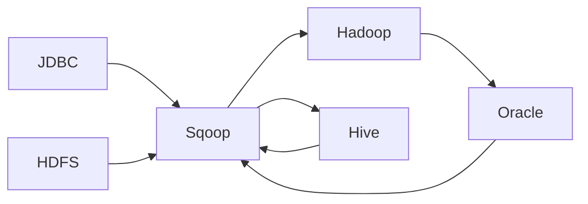
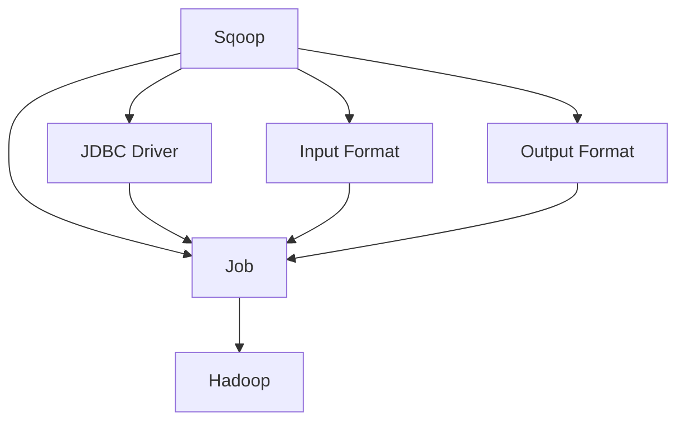

                 

# Sqoop原理与代码实例讲解

> 关键词：Sqoop, Hive, Oracle, HDFS, 数据同步, 代码实例, 批量数据迁移

## 1. 背景介绍

### 1.1 问题由来
Sqoop（Structured Query On Hadoop）是一款Hadoop生态系统中用于将结构化数据在Hadoop与传统数据库之间进行批量迁移的工具。Sqoop的核心功能是通过JDBC（Java Database Connectivity）协议，实现Hadoop与MySQL、Oracle、SQL Server等传统关系型数据库（RDBMS）之间的数据同步和迁移。

### 1.2 问题核心关键点
Sqoop的目标是简化在大规模分布式存储系统（如Hadoop）和传统关系型数据库之间进行数据迁移的过程。在数据驱动的互联网时代，企业需要存储和处理海量的数据，而这些数据往往分散在不同类型的数据库中。为了实现数据的整合和分析，企业需要一种高效、可扩展的数据迁移工具。Sqoop在这一背景下应运而生，解决了数据迁移中的痛点问题。

Sqoop的设计理念是：

1. 支持多种数据源：包括MySQL、Oracle、PostgreSQL、SQL Server等多种主流数据库。
2. 批量数据迁移：能够高效处理大规模数据，保证数据迁移的可靠性和完整性。
3. 支持多种数据格式：包括文本文件、Avro、JSON等。
4. 可配置性强：通过配置文件和命令行参数，灵活配置数据迁移的各个环节。

### 1.3 问题研究意义
Sqoop作为数据迁移工具，对于大数据环境下数据的高效整合和分析具有重要意义：

1. 降低迁移成本：通过自动化工具简化数据迁移过程，减少人工操作和出错率。
2. 提高数据一致性：确保数据在不同系统之间的一致性和准确性，避免数据冗余和丢失。
3. 支持大数据分析：通过数据迁移，将结构化数据整合到Hadoop生态系统中，支持分布式大数据分析。
4. 增强数据流动性：支持多种数据源和目标系统的无缝集成，提升数据利用效率。
5. 提供灵活性：支持多种数据格式和迁移方式，适应不同企业的数据需求。

## 2. 核心概念与联系

### 2.1 核心概念概述

为了更好地理解Sqoop的工作原理和架构，本节将介绍几个密切相关的核心概念：

- Sqoop：Hadoop生态系统中用于将结构化数据在Hadoop与传统数据库之间进行批量迁移的工具。
- Hadoop：基于MapReduce架构的分布式计算框架，支持大规模数据存储和处理。
- Hive：Hadoop生态系统中的数据仓库工具，提供SQL查询接口。
- JDBC：Java Database Connectivity，Java应用程序与数据库之间的接口。
- Oracle：常见的关系型数据库系统，支持复杂的数据查询和事务处理。
- HDFS：Hadoop分布式文件系统，支持大规模文件存储和访问。

这些核心概念之间的逻辑关系可以通过以下Mermaid流程图来展示：



这个流程图展示了Sqoop在大数据生态系统中的位置和作用，以及与其它组件的关系。

### 2.2 概念间的关系

这些核心概念之间存在着紧密的联系，形成了Sqoop数据迁移的整体架构。下面我们通过几个Mermaid流程图来展示这些概念之间的关系。

#### 2.2.1 Sqoop的数据迁移过程



这个流程图展示了Sqoop从传统数据库到Hadoop的数据迁移过程。Sqoop通过JDBC连接到Oracle等数据库，将数据抽取到Hadoop的HDFS中，并通过Hive对数据进行管理和分析。

#### 2.2.2 Sqoop的架构设计



这个流程图展示了Sqoop的架构设计。Sqoop的核心功能模块包括JDBC Driver、Input Format、Output Format和Job。其中，JDBC Driver负责与数据库建立连接，Input Format和Output Format负责数据格式转换，Job模块负责整个数据迁移过程的控制和管理。

## 3. 核心算法原理 & 具体操作步骤
### 3.1 算法原理概述

Sqoop的数据迁移过程主要分为数据抽取和数据加载两个阶段。数据抽取阶段通过JDBC Driver从数据库中读取数据，数据加载阶段将数据写入Hadoop的HDFS中，并通过Hive进行管理和分析。

#### 3.1.1 数据抽取

在数据抽取阶段，Sqoop通过JDBC Driver连接到数据库，将数据抽取出来。Sqoop支持多种数据库和数据格式，但核心原理都是通过JDBC协议读取数据。JDBC协议通过SQL语句与数据库进行交互，实现数据的读取和处理。

#### 3.1.2 数据加载

在数据加载阶段，Sqoop将从数据库抽取的数据写入Hadoop的HDFS中，并通过Hive进行管理和分析。Hadoop支持大规模数据存储和分布式计算，能够高效处理海量数据。通过Sqoop将数据加载到Hadoop中，可以与Hadoop生态系统中的各种组件无缝集成，支持大规模数据处理和分析。

### 3.2 算法步骤详解

Sqoop的数据迁移过程包括以下几个关键步骤：

**Step 1: 配置环境**

- 安装Hadoop、Hive、Sqoop等组件。
- 配置环境变量，包括JDBC连接信息、HDFS路径等。

**Step 2: 创建表**

- 在Hive中创建与数据库表结构一致的表，用于存储从数据库迁移的数据。

**Step 3: 数据抽取**

- 使用Sqoop命令，从数据库中抽取数据，生成Hadoop的分布式文件。
- 指定JDBC连接信息、数据源、目标路径等参数。
- 执行Sqoop命令，生成数据文件。

**Step 4: 数据加载**

- 使用Sqoop命令，将数据文件加载到HDFS中。
- 指定HDFS路径、数据文件路径等参数。
- 执行Sqoop命令，完成数据加载。

**Step 5: 数据处理**

- 使用Hive对加载到HDFS中的数据进行管理和分析。
- 编写HiveQL语句，对数据进行查询、过滤、聚合等操作。
- 使用Hadoop生态系统中的其他组件，如Pig、HiveUDF等，进一步处理数据。

### 3.3 算法优缺点

Sqoop的数据迁移方法具有以下优点：

1. 高效可靠：通过大规模分布式计算和存储，能够高效处理海量数据，保证数据迁移的可靠性和完整性。
2. 支持多种数据源：支持多种主流数据库，包括MySQL、Oracle、SQL Server等。
3. 灵活配置：通过配置文件和命令行参数，灵活配置数据迁移的各个环节，适应不同企业的需求。
4. 支持多种数据格式：支持文本文件、Avro、JSON等多种数据格式，适应不同数据源和目标系统。

Sqoop的数据迁移方法也存在以下缺点：

1. 依赖JDBC协议：依赖JDBC协议进行数据读取，可能存在性能瓶颈。
2. 数据格式限制：对于非结构化数据，如图片、视频等，需要额外的处理。
3. 配置复杂：配置文件和命令行参数较多，需要一定的配置经验。
4. 部署复杂：需要配置Hadoop、Hive、Sqoop等组件，部署过程较为复杂。

### 3.4 算法应用领域

Sqoop的数据迁移方法在多个领域得到了广泛应用，例如：

- 企业数据迁移：将企业内部的结构化数据从传统数据库迁移到Hadoop中，支持大规模数据处理和分析。
- 数据仓库构建：通过Sqoop将数据加载到Hive中，构建企业级数据仓库，支持BI报表和数据可视化。
- 大数据平台集成：将企业内部的数据整合到Hadoop生态系统中，支持数据共享和协同分析。
- 数据湖构建：通过Sqoop将异构数据源整合到数据湖中，支持数据的集中管理和分析。
- 数据治理：通过Sqoop的数据迁移和处理，实现数据治理和合规要求，提升数据质量和安全。

## 4. 数学模型和公式 & 详细讲解  
### 4.1 数学模型构建

Sqoop的数据迁移过程主要通过JDBC协议进行数据读取和处理。假设从数据库中抽取的数据为 $D$，通过JDBC协议读取的数据格式为 $F$，则数据迁移过程可以表示为：

$$
D \rightarrow F \rightarrow HDFS
$$

其中，$D$ 表示从数据库中抽取的数据，$F$ 表示通过JDBC协议读取的数据格式，$HDFS$ 表示加载到Hadoop的HDFS中的数据。

### 4.2 公式推导过程

假设从数据库中读取的数据为 $D=\{d_1, d_2, ..., d_n\}$，通过JDBC协议读取的数据格式为 $F=\{f_1, f_2, ..., f_m\}$。假设将数据 $D$ 加载到Hadoop的HDFS中，则数据迁移的过程可以表示为：

$$
D \rightarrow F \rightarrow HDFS
$$

其中，数据迁移的过程可以分解为两个步骤：

1. 数据转换：将从数据库中读取的数据 $D$ 转换为通过JDBC协议读取的数据格式 $F$。
2. 数据加载：将转换后的数据 $F$ 加载到Hadoop的HDFS中。

在数据转换过程中，Sqoop使用以下公式进行数据格式转换：

$$
F = f(D)
$$

其中，$f$ 表示数据转换函数，$F$ 表示转换后的数据格式。

在数据加载过程中，Sqoop使用以下公式将数据 $F$ 加载到Hadoop的HDFS中：

$$
HDFS = h(F)
$$

其中，$h$ 表示数据加载函数，$HDFS$ 表示加载后的数据文件。

### 4.3 案例分析与讲解

假设从MySQL数据库中抽取的数据 $D$ 存储在表中，通过JDBC协议读取的数据格式为Avro格式。使用Sqoop将数据从MySQL数据库加载到Hadoop的HDFS中，并将其转换为Hive表。具体步骤如下：

1. 从MySQL数据库中抽取数据 $D$，生成Avro文件 $F$。
2. 将Avro文件 $F$ 加载到Hadoop的HDFS中。
3. 使用Hive创建与MySQL表结构一致的Hive表，加载数据 $F$ 到Hive表中。

具体实现代码如下：

```java
// 从MySQL数据库中抽取数据，生成Avro文件
Sqoop import --connect jdbc:mysql://localhost:3306/test --table test_table --target-dir /user/hadoop/avro --map-column --from-sql --sql SELECT * FROM test_table

// 将Avro文件加载到Hadoop的HDFS中
Sqoop export --connect hdfs://localhost:9000/user/hadoop/avro --from-avro --to-table test_table --target-dir /user/hadoop/hive
```

## 5. 项目实践：代码实例和详细解释说明
### 5.1 开发环境搭建

在进行Sqoop数据迁移实践前，我们需要准备好开发环境。以下是使用Java进行Sqoop开发的环境配置流程：

1. 安装Java JDK：从官网下载并安装Java JDK，确保版本与Sqoop兼容。
2. 安装Hadoop、Hive、Sqoop等组件：从官网下载并安装Hadoop、Hive、Sqoop等组件，确保版本兼容。
3. 配置环境变量：设置JDBC连接信息、HDFS路径等环境变量。
4. 搭建开发环境：创建Java项目，引入Sqoop依赖包，配置项目依赖和构建工具。

### 5.2 源代码详细实现

下面我们以MySQL数据库到Hadoop的数据迁移为例，给出使用Java和Sqoop进行数据迁移的详细代码实现。

```java
// 导入Sqoop库
import org.apache.sqoop.Sqoop;

public class SqoopDemo {
    public static void main(String[] args) {
        try {
            // 创建Sqoop实例
            Sqoop sqoop = new Sqoop();
            
            // 从MySQL数据库中抽取数据，生成Avro文件
            sqoop.importData("-jdbc jdbc:mysql://localhost:3306/test", "--table test_table", "--target-dir /user/hadoop/avro", "--map-column", "--from-sql", "--sql SELECT * FROM test_table");
            
            // 将Avro文件加载到Hadoop的HDFS中
            sqoop.exportData("hdfs://localhost:9000/user/hadoop/avro", "--from-avro", "--to-table test_table", "--target-dir /user/hadoop/hive");
        } catch (Exception e) {
            e.printStackTrace();
        }
    }
}
```

### 5.3 代码解读与分析

让我们再详细解读一下关键代码的实现细节：

**SqoopDemo类**：
- 导入Sqoop库
- 创建Sqoop实例
- 从MySQL数据库中抽取数据，生成Avro文件
- 将Avro文件加载到Hadoop的HDFS中

**数据库连接信息**：
- 使用JDBC协议连接到MySQL数据库，指定连接信息。

**数据抽取和加载**：
- 使用Sqoop的importData方法从MySQL数据库中抽取数据，生成Avro文件。
- 使用Sqoop的exportData方法将Avro文件加载到Hadoop的HDFS中。

**参数设置**：
- 指定目标目录和数据库表信息。
- 使用map-column和from-sql选项进行数据格式转换。

**异常处理**：
- 使用try-catch块处理异常，确保程序的健壮性。

### 5.4 运行结果展示

假设在MySQL数据库中有一张名为test_table的表，包含以下数据：

```
id  name  age
1   Alice  25
2   Bob    30
3   Charlie  35
```

执行上述代码后，生成Avro文件并加载到Hadoop的HDFS中。在Hadoop中，可以创建一个名为test_table的Hive表，使用以下HiveQL语句进行查询：

```sql
SELECT * FROM test_table;
```

执行查询后，结果如下：

```
id  name  age
1   Alice  25
2   Bob    30
3   Charlie  35
```

可以看到，数据迁移过程成功完成，数据在Hadoop和Hive之间实现了高效、可靠的数据迁移。

## 6. 实际应用场景
### 6.1 智能客服系统

Sqoop在智能客服系统中具有广泛应用。传统客服系统需要配备大量人力，成本高、效率低。通过Sqoop将企业内部的客户信息、客服聊天记录等结构化数据加载到Hadoop中，可以构建智能客服系统，提高客户满意度和服务质量。

具体而言，可以收集企业内部的客户信息、聊天记录等数据，使用Sqoop将其加载到Hadoop中。然后，使用Hadoop生态系统中的其他组件，如Hive、Spark、Flink等，构建智能客服系统，提供自动回复、情感分析、用户画像等功能，提升客户体验。

### 6.2 金融数据分析

Sqoop在金融数据分析中具有重要应用。金融行业需要实时监测市场舆情和风险，及时做出决策。通过Sqoop将金融数据加载到Hadoop中，可以构建大数据分析平台，支持金融舆情监测、风险预警、交易分析等功能。

具体而言，可以收集金融市场的各种数据，包括股票行情、外汇汇率、金融新闻等。使用Sqoop将数据加载到Hadoop中，使用Hive和Spark等组件进行数据分析和处理，构建金融舆情监测和风险预警系统，实时监测市场动态，及时做出决策。

### 6.3 电商数据分析

Sqoop在电商数据分析中具有广泛应用。电商行业需要分析用户行为和交易数据，优化产品推荐和营销策略。通过Sqoop将电商数据加载到Hadoop中，可以构建大数据分析平台，支持用户行为分析、交易数据分析、推荐系统等功能。

具体而言，可以收集电商平台的用户行为数据、交易数据、商品信息等。使用Sqoop将数据加载到Hadoop中，使用Hive和Spark等组件进行数据分析和处理，构建推荐系统和营销策略优化平台，提升用户体验和销售额。

### 6.4 未来应用展望

随着Sqoop和大数据技术的不断发展，未来的数据迁移和分析将变得更加高效、可靠和灵活。

1. 支持更多数据源和目标系统：Sqoop将支持更多的数据源和目标系统，包括NoSQL数据库、时序数据库、图数据库等。
2. 提高数据转换效率：通过优化数据转换算法和并行处理，提高数据转换效率，降低数据迁移成本。
3. 增强数据一致性：通过分布式事务和容错机制，增强数据的一致性和可靠性。
4. 支持更多数据格式：Sqoop将支持更多的数据格式，包括JSON、CSV、Parquet等。
5. 增强可视化支持：通过与BI工具集成，提供更强大的数据可视化支持，帮助企业更好地理解数据。

总之，Sqoop在数据迁移和分析领域具有广阔的应用前景，必将在未来的数字化转型中发挥重要作用。

## 7. 工具和资源推荐
### 7.1 学习资源推荐

为了帮助开发者系统掌握Sqoop和大数据技术，这里推荐一些优质的学习资源：

1. Sqoop官方文档：Sqoop官方文档提供了详细的API文档、教程和示例代码，是学习Sqoop的重要资源。
2. Hadoop官方文档：Hadoop官方文档提供了Hadoop生态系统的详细介绍和使用方法，是学习大数据技术的重要资源。
3. Hive官方文档：Hive官方文档提供了Hive的使用方法和示例代码，是学习大数据分析和处理的重要资源。
4. Hadoop和Hive书籍：《Hadoop权威指南》、《Hive编程指南》等书籍，提供了详细的大数据技术和Sqoop的使用方法。
5. Sqoop在线课程：Coursera、edX等在线学习平台提供的大数据技术和Sqoop相关课程，可以帮助你系统学习Sqoop和大数据技术。

通过对这些资源的学习实践，相信你一定能够快速掌握Sqoop和大数据技术的精髓，并用于解决实际的业务问题。

### 7.2 开发工具推荐

高效的开发离不开优秀的工具支持。以下是几款用于Sqoop和大数据开发的工具：

1. Java IDE：如IntelliJ IDEA、Eclipse等，支持Java开发和调试，适合Sqoop和大数据项目开发。
2. Hadoop生态系统：如HDFS、Hive、Spark、Flink等，提供强大的分布式计算和数据处理能力，支持大规模数据迁移和分析。
3. BI工具：如Tableau、Power BI等，提供强大的数据可视化和报表功能，支持企业的数据分析和决策支持。
4. JDBC驱动程序：如Oracle JDBC驱动程序、MySQL JDBC驱动程序等，提供与数据库的JDBC连接功能，支持数据读取和处理。
5. 日志管理工具：如Log4j、SLF4J等，提供日志记录和打印功能，帮助调试和监控Sqoop和大数据项目。

合理利用这些工具，可以显著提升Sqoop和大数据项目的开发效率，加快创新迭代的步伐。

### 7.3 相关论文推荐

Sqoop和大数据技术的发展源于学界的持续研究。以下是几篇奠基性的相关论文，推荐阅读：

1. Hadoop：The Hadoop Distributed File System：介绍Hadoop分布式文件系统的设计理念和实现原理，是Hadoop生态系统的核心论文。
2. HiveQL：A Language to Hive Them All：介绍HiveQL语言的设计和使用，是Hive的核心论文。
3. Sqoop：Hadoop Data Ingestion with Sqoop：介绍Sqoop的数据迁移原理和实现方法，是Sqoop的核心论文。
4. Hadoop生态系统：A Survey of Hadoop-based Data Integration：综述Hadoop生态系统中的数据集成技术，总结了Hadoop、Hive、Sqoop等组件的使用方法和实践经验。
5. 大数据分析：A Survey of Hadoop-based Data Analysis：综述Hadoop生态系统中的数据分析技术，总结了Hive、Spark、Flink等组件的使用方法和实践经验。

这些论文代表了大数据技术和Sqoop的发展脉络。通过学习这些前沿成果，可以帮助研究者把握学科前进方向，激发更多的创新灵感。

除上述资源外，还有一些值得关注的前沿资源，帮助开发者紧跟大数据技术和Sqoop的最新进展，例如：

1. arXiv论文预印本：人工智能领域最新研究成果的发布平台，包括大量尚未发表的前沿工作，学习前沿技术的必读资源。
2. 业界技术博客：如Hadoop、Hive、Sqoop官方博客，第一时间分享他们的最新研究成果和洞见。
3. 技术会议直播：如HadoopCon、HiveConf、Sqoop大会现场或在线直播，能够聆听到大佬们的前沿分享，开拓视野。
4. GitHub热门项目：在GitHub上Star、Fork数最多的Hadoop、Hive、Sqoop相关项目，往往代表了该技术领域的发展趋势和最佳实践，值得去学习和贡献。
5. 行业分析报告：各大咨询公司如McKinsey、PwC等针对大数据行业的分析报告，有助于从商业视角审视技术趋势，把握应用价值。

总之，对于Sqoop和大数据技术的学习和实践，需要开发者保持开放的心态和持续学习的意愿。多关注前沿资讯，多动手实践，多思考总结，必将收获满满的成长收益。

## 8. 总结：未来发展趋势与挑战
### 8.1 总结

本文对Sqoop和大数据技术进行了全面系统的介绍。首先阐述了Sqoop和大数据技术的研究背景和意义，明确了数据迁移和分析的重要价值。其次，从原理到实践，详细讲解了Sqoop和大数据技术的数学原理和关键步骤，给出了数据迁移任务开发的完整代码实例。同时，本文还广泛探讨了Sqoop在大数据生态系统中的应用前景，展示了大数据技术的广阔前景。

通过本文的系统梳理，可以看到，Sqoop和大数据技术在数据迁移和分析领域具有重要意义。通过数据迁移，企业可以将分散在不同系统中的数据整合起来，支持大规模数据处理和分析。通过数据加载和处理，企业可以构建大数据平台，支持企业级的BI报表和数据可视化。未来，随着Sqoop和大数据技术的不断演进，必将进一步拓展其应用边界，提升企业的数字化转型速度和效率。

### 8.2 未来发展趋势

展望未来，Sqoop和大数据技术将呈现以下几个发展趋势：

1. 支持更多数据源和目标系统：Sqoop将支持更多的数据源和目标系统，包括NoSQL数据库、时序数据库、图数据库等。
2. 提高数据转换效率：通过优化数据转换算法和并行处理，提高数据转换效率，降低数据迁移成本。
3. 增强数据一致性：通过分布式事务和容错机制，增强数据的一致性和可靠性。
4. 支持更多数据格式：Sqoop将支持更多的数据格式，包括JSON、CSV、Parquet等。
5. 增强可视化支持：通过与BI工具集成，提供更强大的数据可视化支持，帮助企业更好地理解数据。
6. 支持分布式计算：通过与Spark、Flink等分布式计算平台集成，支持大规模数据处理和分析。

这些趋势凸显了Sqoop和大数据技术的广阔前景。这些方向的探索发展，必将进一步提升Sqoop和大数据生态系统的性能和应用范围，为大数据技术的应用提供新的技术路径。

### 8.3 面临的挑战

尽管Sqoop和大数据技术已经取得了瞩目成就，但在迈向更加智能化、普适化应用的过程中，它仍面临着诸多挑战：

1. 数据一致性问题：在大规模数据迁移过程中，如何保证数据的一致性和可靠性，避免数据丢失和冗余。
2. 数据迁移成本：在大规模数据迁移过程中，如何降低数据迁移的成本和时间，提高迁移效率。
3. 数据转换问题：对于非结构化数据，如图片、视频等，如何高效进行数据转换和处理。
4. 数据安全问题：在数据迁移和处理过程中，如何保证数据的安全性和隐私性，防止数据泄露和滥用。
5. 技术复杂性：Sqoop和大数据技术涉及多组件和多工具，技术复杂性较高，需要系统学习和实践。

正视Sqoop和大数据技术面临的这些挑战，积极应对并寻求突破，将是大数据技术不断完善和发展的必由之路。相信随着学界和产业界的共同努力，这些挑战终将一一被克服，Sqoop和大数据技术必将在构建数据驱动的未来中扮演越来越重要的角色。

### 8.4 研究展望

面对Sqoop和大数据技术所面临的种种挑战，未来的研究需要在以下几个方面寻求新的突破：

1. 优化数据转换算法：研究高效的数据转换算法，减少数据转换的时间和成本。
2. 支持多源数据同步：研究多源数据的同步技术，提高数据的一致性和可靠性。
3. 优化分布式计算框架：研究高效的分布式计算框架，提升数据处理和分析的效率。
4. 增强数据可视化：研究数据可视化的新方法和新技术，提升数据理解和管理能力。
5. 增强数据安全保护：研究数据安全和隐私

