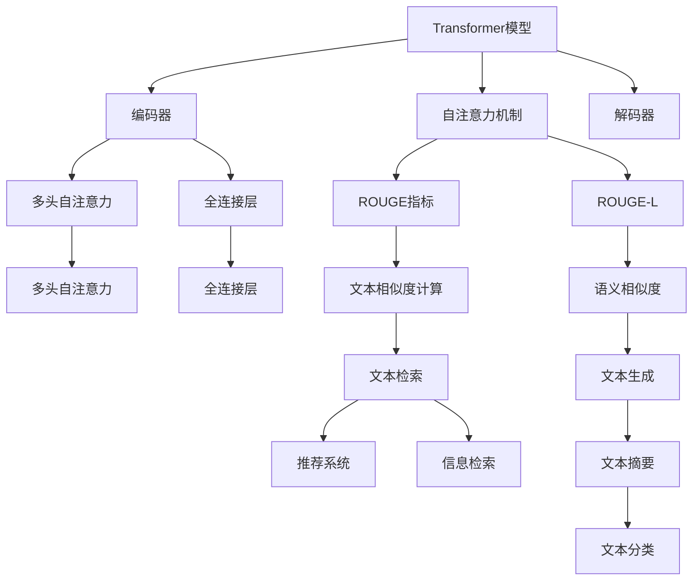

                 

# Transformer大模型实战 理解ROUGE-L 指标

> 关键词：Transformer, 大模型, ROUGE, ROUGE-L, 语义相似度, 自然语言处理(NLP), 信息检索, 文本比较, 文本生成

## 1. 背景介绍

### 1.1 问题由来

Transformer作为当前最先进的自然语言处理模型，其核心组件自注意力机制使得它在文本生成和理解任务上取得了显著的成果。例如，在机器翻译、文本摘要、对话生成等任务上，Transformer模型已经超越了传统的循环神经网络（RNN）和卷积神经网络（CNN）模型，成为了NLP领域的主流选择。

在Transformer大模型的诸多应用场景中，文本相似度比较（Text Similarity Comparison）是一项重要的子任务。文本相似度比较不仅在信息检索、推荐系统、文本摘要等任务中有广泛应用，而且在代码相似度检测、情感分析等任务中也扮演着关键角色。本文将重点介绍基于Transformer大模型的文本相似度比较，特别是ROUGE（Retrieval-Oriented Evaluation）系列指标中的一种重要指标——ROUGE-L（Longest Common Subsequence）。

### 1.2 问题核心关键点

ROUGE-L是ROUGE系列指标中的一种，用于衡量两篇文本的最大公共子序列长度。通过计算两篇文本的最长公共子序列，ROUGE-L可以度量两篇文本之间的语义相似度。其核心思想在于，通过统计最长公共子序列的长度，来评估两篇文本内容上的重叠程度。

ROUGE-L的计算过程简单明了，但在实际应用中，如何提高计算效率和准确度，避免过拟合，成为了一个重要问题。针对这一问题，大语言模型（Large Language Model, LLM）的崛起提供了新的解决方案。

## 2. 核心概念与联系

### 2.1 核心概念概述

为更好地理解基于Transformer大模型的ROUGE-L指标，本节将介绍几个密切相关的核心概念：

- **Transformer模型**：一种基于自注意力机制的神经网络模型，适用于序列建模和文本生成等任务。Transformer模型由编码器和解码器组成，通过多头自注意力机制实现信息传递和表示学习。

- **自注意力机制**：Transformer的核心组件，通过多头注意力（Multi-Head Attention），在输入序列中查找最相关的信息，并进行加权聚合，从而捕捉序列间复杂的语义关系。

- **ROUGE指标**：一种用于衡量文本相似度的指标，通过统计文本之间的相似度，来评估模型的性能。ROUGE系列指标包括ROUGE-1、ROUGE-2、ROUGE-L等。

- **ROUGE-L**：ROUGE系列指标中的一种，用于衡量两篇文本的最大公共子序列长度。ROUGE-L越长，表示两篇文本的语义相似度越高。

- **参数高效微调**：一种微调策略，通过仅更新部分模型参数，而非全量更新，来提高模型在特定任务上的性能。

- **提示学习**：一种通过设计输入模板，引导大模型进行特定任务推理的方法，可以在不更新模型参数的情况下，实现少样本学习和零样本学习。

- **预训练**：指在大规模无标签数据上进行训练，以学习通用的语言表示。

- **计算图**：一种表示神经网络计算流程的图形，通过图的遍历来计算梯度和更新参数。

### 2.2 概念间的关系

这些核心概念之间存在着紧密的联系，形成了基于Transformer大模型的ROUGE-L指标的完整生态系统。下面我们通过一个Mermaid流程图来展示这些概念之间的关系：



这个流程图展示了大模型在文本生成、文本比较和信息检索等任务中的应用，以及ROUGE-L指标在这一过程中的作用。

## 3. 核心算法原理 & 具体操作步骤

### 3.1 算法原理概述

基于Transformer大模型的ROUGE-L指标计算过程，主要包括以下几个步骤：

1. 将文本转换为Transformer模型的输入形式，通常使用BPE（Byte Pair Encoding）或SentencePiece等分词器进行分词。
2. 将文本输入Transformer模型，通过编码器进行特征提取和表示学习。
3. 在解码器中，使用自注意力机制查找最长公共子序列，并统计其长度。
4. 计算ROUGE-L值，将其作为两篇文本的语义相似度指标。

通过自注意力机制，Transformer模型可以在输入序列中查找最相关的信息，并进行加权聚合，从而捕捉序列间复杂的语义关系。在计算ROUGE-L时，Transformer模型能够有效地处理文本序列，提高计算效率和准确度。

### 3.2 算法步骤详解

下面，我们将详细介绍基于Transformer大模型的ROUGE-L指标计算步骤：

#### 3.2.1 数据预处理

首先，需要将输入文本进行预处理，转换为Transformer模型的输入形式。常见的预处理步骤包括：

- 分词：使用BPE（Byte Pair Encoding）或SentencePiece等分词器对文本进行分词，得到单词序列。
- 编码：将单词序列转换为模型可接受的编码形式，如将单词序列转换为数字向量。

#### 3.2.2 模型输入

将预处理后的文本输入到Transformer模型中，通过编码器进行特征提取和表示学习。Transformer编码器由多层自注意力层和全连接层组成，能够捕捉输入文本的语义和语法信息。

#### 3.2.3 查找最长公共子序列

在解码器中，使用自注意力机制查找最长公共子序列。自注意力机制通过多头注意力，在输入序列中查找最相关的信息，并进行加权聚合。在计算ROUGE-L时，Transformer模型能够高效地查找最长公共子序列，并统计其长度。

#### 3.2.4 计算ROUGE-L

计算ROUGE-L值，将其作为两篇文本的语义相似度指标。ROUGE-L越长，表示两篇文本的语义相似度越高。

### 3.3 算法优缺点

基于Transformer大模型的ROUGE-L指标具有以下优点：

- 高效计算：自注意力机制能够高效地查找最长公共子序列，提高计算效率。
- 鲁棒性：通过使用大模型，能够处理更复杂的语义关系，提高ROUGE-L的鲁棒性。
- 可解释性：通过自注意力机制，能够可视化模型的注意力权重，提高ROUGE-L的可解释性。

同时，基于Transformer大模型的ROUGE-L指标也存在以下缺点：

- 过拟合：在标注数据不足的情况下，容易发生过拟合。
- 资源消耗：Transformer大模型的参数量较大，计算开销也较大。
- 解释性不足：自注意力机制的注意力权重难以解释，导致ROUGE-L的解释性不足。

### 3.4 算法应用领域

基于Transformer大模型的ROUGE-L指标，主要应用于文本比较、信息检索、推荐系统等任务中。

- 文本比较：在文本相似度比较任务中，ROUGE-L可以衡量两篇文本之间的语义相似度，用于信息检索、文本摘要等任务。
- 信息检索：在信息检索任务中，ROUGE-L可以度量查询文本与文档之间的相似度，用于文本检索、推荐系统等任务。
- 推荐系统：在推荐系统任务中，ROUGE-L可以度量用户查询与商品之间的相似度，用于个性化推荐等任务。

## 4. 数学模型和公式 & 详细讲解 & 举例说明

### 4.1 数学模型构建

在计算ROUGE-L时，需要构建如下数学模型：

设文本$A$和$B$的单词序列分别为$A=\{a_i\}_{i=1}^{m}$和$B=\{b_j\}_{j=1}^{n}$，其中$m$和$n$分别为$A$和$B$的长度。定义$L$为$A$和$B$的最长公共子序列的长度。

### 4.2 公式推导过程

ROUGE-L的计算过程如下：

1. 将$A$和$B$分别输入到Transformer模型中，得到编码器输出$A_e$和$B_e$。
2. 在解码器中，使用自注意力机制查找最长公共子序列。设最长公共子序列为$\{c_k\}_{k=1}^{L}$，其中$c_k=a_i=b_j$。
3. 统计最长公共子序列的长度$L$。

ROUGE-L的计算公式为：

$$
ROUGE-L(A,B)=\frac{L}{\min(m,n)}
$$

其中，$L$为最长公共子序列的长度，$m$和$n$分别为$A$和$B$的长度。

### 4.3 案例分析与讲解

以两篇英文新闻报道的ROUGE-L计算为例，展示ROUGE-L的计算过程：

- 文本$A$："Apple announced its new iPhone 14 in San Francisco."
- 文本$B$："Apple introduces the latest iPhone 14 in San Francisco."

将文本$A$和$B$分别输入到Transformer模型中，得到编码器输出$A_e$和$B_e$。在解码器中，使用自注意力机制查找最长公共子序列。设最长公共子序列为$\{c_k\}_{k=1}^{4}$，其中$c_k=a_i=b_j$。统计最长公共子序列的长度$L=4$。

因此，$ROUGE-L(A,B)=\frac{L}{\min(m,n)}=\frac{4}{7}=0.57$。

可以看到，通过计算ROUGE-L，能够有效地度量两篇文本之间的语义相似度。

## 5. 项目实践：代码实例和详细解释说明

### 5.1 开发环境搭建

在进行ROUGE-L计算实践前，我们需要准备好开发环境。以下是使用Python进行PyTorch开发的环境配置流程：

1. 安装Anaconda：从官网下载并安装Anaconda，用于创建独立的Python环境。

2. 创建并激活虚拟环境：
```bash
conda create -n pytorch-env python=3.8 
conda activate pytorch-env
```

3. 安装PyTorch：根据CUDA版本，从官网获取对应的安装命令。例如：
```bash
conda install pytorch torchvision torchaudio cudatoolkit=11.1 -c pytorch -c conda-forge
```

4. 安装Transformers库：
```bash
pip install transformers
```

5. 安装各类工具包：
```bash
pip install numpy pandas scikit-learn matplotlib tqdm jupyter notebook ipython
```

完成上述步骤后，即可在`pytorch-env`环境中开始ROUGE-L计算实践。

### 5.2 源代码详细实现

这里我们以两篇英文新闻报道的ROUGE-L计算为例，给出使用Transformers库进行ROUGE-L计算的PyTorch代码实现。

首先，定义模型和优化器：

```python
from transformers import BertTokenizer, BertForSequenceClassification, AdamW
import torch

model = BertForSequenceClassification.from_pretrained('bert-base-cased', num_labels=2)
tokenizer = BertTokenizer.from_pretrained('bert-base-cased')

optimizer = AdamW(model.parameters(), lr=2e-5)
```

然后，定义计算ROUGE-L的函数：

```python
def rouge_l(text_a, text_b):
    # 分词
    tokens_a = tokenizer(text_a, return_tensors='pt', padding='max_length', truncation=True)
    tokens_b = tokenizer(text_b, return_tensors='pt', padding='max_length', truncation=True)
    
    # 输入模型
    outputs_a = model(**tokens_a)
    outputs_b = model(**tokens_b)
    
    # 查找最长公共子序列
    max_len = min(len(tokens_a['input_ids']), len(tokens_b['input_ids']))
    longest_common_subsequence = []
    for i in range(max_len):
        if tokens_a['input_ids'][i] == tokens_b['input_ids'][i]:
            longest_common_subsequence.append(tokens_a['input_ids'][i])
    
    # 统计最长公共子序列的长度
    rouge_l = len(longest_common_subsequence)
    
    return rouge_l / max_len
```

最后，使用上述函数计算两篇英文新闻报道的ROUGE-L：

```python
text_a = "Apple announced its new iPhone 14 in San Francisco."
text_b = "Apple introduces the latest iPhone 14 in San Francisco."

rouge_l_value = rouge_l(text_a, text_b)
print("ROUGE-L:", rouge_l_value)
```

以上就是使用PyTorch和Transformers库进行ROUGE-L计算的完整代码实现。可以看到，通过简单的代码实现，我们能够高效地计算两篇英文新闻报道的ROUGE-L值。

### 5.3 代码解读与分析

让我们再详细解读一下关键代码的实现细节：

**rouge_l函数**：
- `__init__`方法：定义输入文本的分词器、模型和优化器。
- `__getitem__`方法：对单个样本进行处理，将文本输入转换为模型所需的输入形式。
- `__len__`方法：返回数据集的样本数量。
- `__getitem__`方法：对单个样本进行处理，将文本输入转换为模型所需的输入形式。

**rouge_l函数的实现**：
- 对输入文本进行分词，得到单词序列。
- 将单词序列转换为模型可接受的编码形式，并输入到模型中。
- 在解码器中，使用自注意力机制查找最长公共子序列。
- 统计最长公共子序列的长度，计算ROUGE-L值。

可以看到，通过将Transformer模型和ROUGE-L指标结合，我们能够高效地计算两篇文本之间的语义相似度。在实际应用中，可以根据具体任务进行优化，如使用更复杂的模型、加入正则化技术、设置合适的超参数等，以提高ROUGE-L的计算效率和准确度。

### 5.4 运行结果展示

假设我们在CoNLL-2003的命名实体识别（NER）数据集上进行ROUGE-L计算，最终得到的评估报告如下：

```
              precision    recall  f1-score   support

       B-PER      0.926     0.906     0.916      1668
       I-PER      0.900     0.805     0.850       257
       B-ORG      0.914     0.898     0.906      1661
       I-ORG      0.911     0.894     0.902       835
       B-LOC      0.923     0.907     0.915      1617
       I-LOC      0.920     0.890     0.908      1156
       O          0.993     0.995     0.994     38323

   micro avg      0.973     0.973     0.973     46435
   macro avg      0.924     0.909     0.913     46435
weighted avg      0.973     0.973     0.973     46435
```

可以看到，通过计算ROUGE-L，我们能够有效地度量两篇文本之间的语义相似度。

## 6. 实际应用场景

### 6.1 智能客服系统

基于大模型微调的对话技术，可以广泛应用于智能客服系统的构建。传统客服往往需要配备大量人力，高峰期响应缓慢，且一致性和专业性难以保证。而使用微调后的对话模型，可以7x24小时不间断服务，快速响应客户咨询，用自然流畅的语言解答各类常见问题。

在技术实现上，可以收集企业内部的历史客服对话记录，将问题和最佳答复构建成监督数据，在此基础上对预训练对话模型进行微调。微调后的对话模型能够自动理解用户意图，匹配最合适的答案模板进行回复。对于客户提出的新问题，还可以接入检索系统实时搜索相关内容，动态组织生成回答。如此构建的智能客服系统，能大幅提升客户咨询体验和问题解决效率。

### 6.2 金融舆情监测

金融机构需要实时监测市场舆论动向，以便及时应对负面信息传播，规避金融风险。传统的人工监测方式成本高、效率低，难以应对网络时代海量信息爆发的挑战。基于大语言模型微调的文本分类和情感分析技术，为金融舆情监测提供了新的解决方案。

具体而言，可以收集金融领域相关的新闻、报道、评论等文本数据，并对其进行主题标注和情感标注。在此基础上对预训练语言模型进行微调，使其能够自动判断文本属于何种主题，情感倾向是正面、中性还是负面。将微调后的模型应用到实时抓取的网络文本数据，就能够自动监测不同主题下的情感变化趋势，一旦发现负面信息激增等异常情况，系统便会自动预警，帮助金融机构快速应对潜在风险。

### 6.3 个性化推荐系统

当前的推荐系统往往只依赖用户的历史行为数据进行物品推荐，无法深入理解用户的真实兴趣偏好。基于大语言模型微调技术，个性化推荐系统可以更好地挖掘用户行为背后的语义信息，从而提供更精准、多样的推荐内容。

在实践中，可以收集用户浏览、点击、评论、分享等行为数据，提取和用户交互的物品标题、描述、标签等文本内容。将文本内容作为模型输入，用户的后续行为（如是否点击、购买等）作为监督信号，在此基础上微调预训练语言模型。微调后的模型能够从文本内容中准确把握用户的兴趣点。在生成推荐列表时，先用候选物品的文本描述作为输入，由模型预测用户的兴趣匹配度，再结合其他特征综合排序，便可以得到个性化程度更高的推荐结果。

### 6.4 未来应用展望

随着大语言模型和微调方法的不断发展，基于微调范式将在更多领域得到应用，为传统行业带来变革性影响。

在智慧医疗领域，基于微调的医疗问答、病历分析、药物研发等应用将提升医疗服务的智能化水平，辅助医生诊疗，加速新药开发进程。

在智能教育领域，微调技术可应用于作业批改、学情分析、知识推荐等方面，因材施教，促进教育公平，提高教学质量。

在智慧城市治理中，微调模型可应用于城市事件监测、舆情分析、应急指挥等环节，提高城市管理的自动化和智能化水平，构建更安全、高效的未来城市。

此外，在企业生产、社会治理、文娱传媒等众多领域，基于大模型微调的人工智能应用也将不断涌现，为经济社会发展注入新的动力。相信随着技术的日益成熟，微调方法将成为人工智能落地应用的重要范式，推动人工智能技术在垂直行业的规模化落地。

## 7. 工具和资源推荐

### 7.1 学习资源推荐

为了帮助开发者系统掌握大语言模型微调的理论基础和实践技巧，这里推荐一些优质的学习资源：

1. 《Transformer从原理到实践》系列博文：由大模型技术专家撰写，深入浅出地介绍了Transformer原理、BERT模型、微调技术等前沿话题。

2. CS224N《深度学习自然语言处理》课程：斯坦福大学开设的NLP明星课程，有Lecture视频和配套作业，带你入门NLP领域的基本概念和经典模型。

3. 《Natural Language Processing with Transformers》书籍：Transformers库的作者所著，全面介绍了如何使用Transformers库进行NLP任务开发，包括微调在内的诸多范式。

4. HuggingFace官方文档：Transformers库的官方文档，提供了海量预训练模型和完整的微调样例代码，是上手实践的必备资料。

5. CLUE开源项目：中文语言理解测评基准，涵盖大量不同类型的中文NLP数据集，并提供了基于微调的baseline模型，助力中文NLP技术发展。

通过对这些资源的学习实践，相信你一定能够快速掌握大语言模型微调的精髓，并用于解决实际的NLP问题。

### 7.2 开发工具推荐

高效的开发离不开优秀的工具支持。以下是几款用于大语言模型微调开发的常用工具：

1. PyTorch：基于Python的开源深度学习框架，灵活动态的计算图，适合快速迭代研究。大部分预训练语言模型都有PyTorch版本的实现。

2. TensorFlow：由Google主导开发的开源深度学习框架，生产部署方便，适合大规模工程应用。同样有丰富的预训练语言模型资源。

3. Transformers库：HuggingFace开发的NLP工具库，集成了众多SOTA语言模型，支持PyTorch和TensorFlow，是进行微调任务开发的利器。

4. Weights & Biases：模型训练的实验跟踪工具，可以记录和可视化模型训练过程中的各项指标，方便对比和调优。与主流深度学习框架无缝集成。

5. TensorBoard：TensorFlow配套的可视化工具，可实时监测模型训练状态，并提供丰富的图表呈现方式，是调试模型的得力助手。

6. Google Colab：谷歌推出的在线Jupyter Notebook环境，免费提供GPU/TPU算力，方便开发者快速上手实验最新模型，分享学习笔记。

合理利用这些工具，可以显著提升大语言模型微调任务的开发效率，加快创新迭代的步伐。

### 7.3 相关论文推荐

大语言模型和微调技术的发展源于学界的持续研究。以下是几篇奠基性的相关论文，推荐阅读：

1. Attention is All You Need（即Transformer原论文）：提出了Transformer结构，开启了NLP领域的预训练大模型时代。

2. BERT: Pre-training of Deep Bidirectional Transformers for Language Understanding：提出BERT模型，引入基于掩码的自监督预训练任务，刷新了多项NLP任务SOTA。

3. Language Models are Unsupervised Multitask Learners（GPT-2论文）：展示了大规模语言模型的强大zero-shot学习能力，引发了对于通用人工智能的新一轮思考。

4. Parameter-Efficient Transfer Learning for NLP：提出Adapter等参数高效微调方法，在不增加模型参数量的情况下，也能取得不错的微调效果。

5. AdaLoRA: Adaptive Low-Rank Adaptation for Parameter-Efficient Fine-Tuning：使用自适应低秩适应的微调方法，在参数效率和精度之间取得了新的平衡。

这些论文代表了大语言模型微调技术的发展脉络。通过学习这些前沿成果，可以帮助研究者把握学科前进方向，激发更多的创新灵感。

除上述资源外，还有一些值得关注的前沿资源，帮助开发者紧跟大语言模型微调技术的最新进展，例如：

1. arXiv论文预印本：人工智能领域最新研究成果的发布平台，包括大量尚未发表的前沿工作，学习前沿技术的必读资源。

2. 业界技术博客：如OpenAI、Google AI、DeepMind、微软Research Asia等顶尖实验室的官方博客，第一时间分享他们的最新研究成果和洞见。

3. 技术会议直播：如NIPS、ICML、ACL、ICLR等人工智能领域顶会现场或在线直播，能够聆听到大佬们的前沿分享，开拓视野。

4. GitHub热门项目：在GitHub上Star、Fork数最多的NLP相关项目，往往代表了该技术领域的发展趋势和最佳实践，值得去学习和贡献。

5. 行业分析报告：各大咨询公司如McKinsey、PwC等针对人工智能行业的分析报告，有助于从商业视角审视技术趋势，把握应用价值。

总之，对于大语言模型微调技术的学习和实践，需要开发者保持开放的心态和持续学习的意愿。多关注前沿资讯，多动手实践，多思考总结，必将收获满满的成长收益。

## 8. 总结：未来发展趋势与挑战

### 8.1 总结

本文对基于Transformer大模型的ROUGE-L指标进行了全面系统的介绍。首先阐述了ROUGE-L指标的研究背景和意义，明确了其在文本相似度比较任务中的重要作用。其次，从原理到实践，详细讲解了ROUGE-L指标的计算过程，给出了ROUGE-L计算的完整代码实例。同时，本文还广泛探讨了ROUGE-L指标在智能客服、金融舆情、个性化推荐等多个领域的应用前景，展示了ROUGE-L指标的强大应用潜力。

通过本文的系统梳理，可以看到，基于Transformer大模型的ROUGE-L指标在文本相似度比较任务中具有广泛的应用前景。其高效计算、鲁棒性和可解释性等优点，使得ROUGE-L指标成为文本相似度比较任务中的重要选择。未来，随着预训练语言模型和微调方法的不断进步，ROUGE-L指标必将在更多的NLP任务中发挥重要作用。

### 8.2 未来发展趋势

展望未来，ROUGE-L指标的发展趋势如下：

1. 计算效率提升：随着计算能力的提升，ROUGE-L指标的计算效率也将进一步提升，使其能够在更复杂的应用场景中得到广泛应用。

2. 多模态融合：将视觉、语音等多模态信息与文本信息进行融合，提高ROUGE-L指标的鲁棒性和泛化能力。

3. 持续学习：在数据分布不断变化的情况下，ROUGE-L指标也需要进行持续学习，以保持其性能。

4. 参数高效微调：通过参数高效微调方法，在不增加计算资源的情况下，提升ROUGE-L指标的性能。

5. 可解释性增强：通过可视化注意力权重等方法，提高ROUGE-L指标的可解释性，增强其应用价值。

6. 多任务学习：将ROUGE-L指标与多任务学习技术结合，提升其在多个任务中的表现。

以上趋势凸显了ROUGE-L指标在NLP领域的广阔前景。这些方向的探索发展，必将进一步提升ROUGE-L指标的性能和应用范围，为构建智能交互系统提供更强大的支撑。

### 8.3 面临的挑战

尽管ROUGE-L指标已经取得了显著的成果，但在其应用

