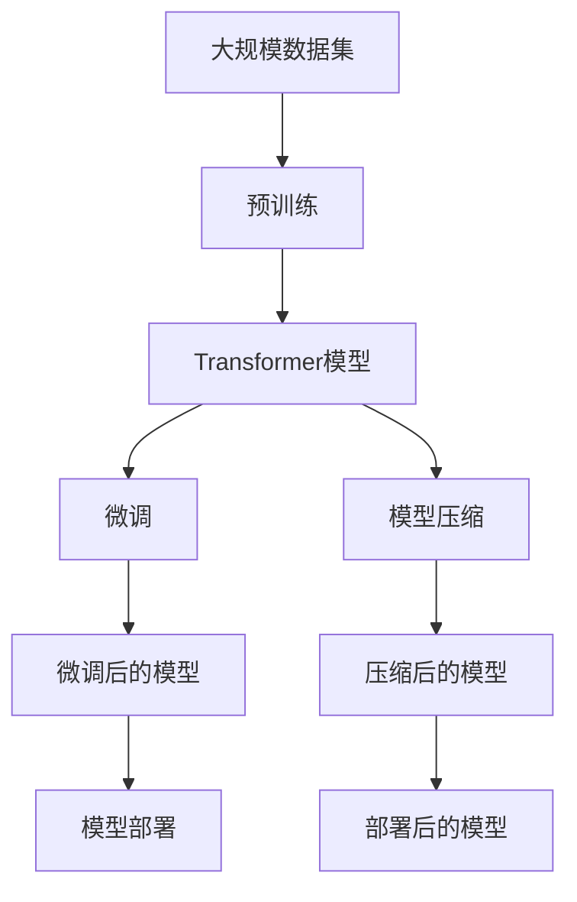
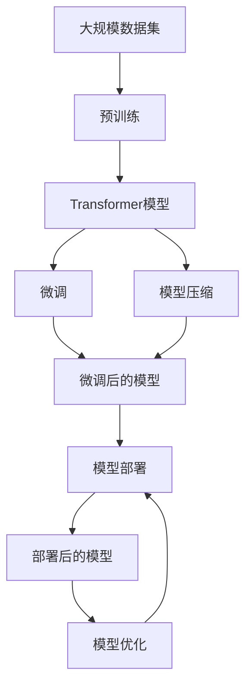

                 

# Transformer大模型实战 用更多的数据集进行训练

> 关键词：Transformer, 大规模数据集, 预训练, 模型微调, 模型压缩, 模型的可扩展性, 数据增强

## 1. 背景介绍

在深度学习领域，Transformer模型的诞生标志着自然语言处理（NLP）新时代的到来。作为目前最流行的NLP模型，Transformer以其出色的表现和广泛的应用，成为了AI研究人员和工程师关注的焦点。本文将重点探讨如何通过增加训练数据集，来提升Transformer模型在大规模数据集上的表现，以及如何实现模型的压缩和优化，从而提高其在大规模任务上的处理能力和效率。

## 2. 核心概念与联系

### 2.1 核心概念概述

- **Transformer**：一种基于自注意力机制的神经网络架构，能够处理序列数据，如自然语言文本，其内部结构简单但功能强大，因此在NLP领域得到了广泛应用。
- **大规模数据集**：在模型训练过程中，用于提高模型泛化能力和性能的大规模标注或未标注数据集。
- **预训练**：在大规模无标签数据上训练模型，使其具备一定的语言理解能力，为下游任务的微调打下基础。
- **模型微调**：在预训练模型的基础上，使用下游任务的少量标注数据，通过有监督学习优化模型在特定任务上的性能。
- **模型压缩**：通过减少模型参数量、优化计算图等方式，使模型在保持性能的前提下更轻量、更高效。
- **模型的可扩展性**：指模型能够适应大规模数据集和任务，通过增加模型容量和并行计算能力来提高性能。

### 2.2 核心概念的关系

这些核心概念之间的关系可以通过以下Mermaid流程图来展示：



这个流程图展示了从大规模数据集到最终部署模型的完整流程：

1. 首先，从大规模数据集中提取文本数据进行预训练。
2. 预训练后的Transformer模型被微调，以适应特定任务。
3. 为了提高模型在大型任务上的性能，对模型进行压缩。
4. 压缩后的模型部署到实际应用中，进行模型微调。
5. 部署后的模型继续迭代和优化，以提高性能和效率。

### 2.3 核心概念的整体架构

最后，我们用一个综合的流程图来展示这些核心概念在大模型训练和优化中的整体架构：



这个综合流程图展示了从预训练、微调到模型部署和优化的完整过程，以及如何通过增加数据集来提升模型性能。

## 3. 核心算法原理 & 具体操作步骤

### 3.1 算法原理概述

Transformer大模型的训练和优化主要涉及预训练和微调两个阶段。预训练是在大规模无标签数据上训练模型，使其具备一定的语言理解能力；微调是在预训练模型基础上，使用下游任务的少量标注数据，通过有监督学习优化模型在特定任务上的性能。

在预训练阶段，Transformer模型通过自注意力机制，在文本序列中自动学习到词与词之间的关系，这种机制使得模型能够捕捉到文本中复杂的语义和上下文信息。预训练的目标是使模型在大规模数据上具备更强的泛化能力和语言理解能力。

在微调阶段，通过增加任务特定的输出层和损失函数，将预训练模型用于特定任务。微调的目标是最小化任务损失函数，从而使得模型在特定任务上表现更佳。

### 3.2 算法步骤详解

#### 3.2.1 预训练步骤

1. **数据准备**：从大规模数据集中抽取文本数据，进行预处理，包括分词、去除停用词、构建词汇表等。
2. **模型初始化**：使用预定义的Transformer模型结构，初始化模型参数。
3. **训练过程**：使用随机梯度下降等优化算法，在大量无标签数据上训练模型。
4. **保存模型**：保存训练好的预训练模型参数，用于后续的微调。

#### 3.2.2 微调步骤

1. **数据准备**：从下游任务的数据集中抽取标注数据，进行预处理，包括分词、标签编码等。
2. **模型加载**：加载预训练模型，冻结所有层，仅更新顶层。
3. **训练过程**：使用随机梯度下降等优化算法，在标注数据上训练模型，更新顶层参数。
4. **模型评估**：在验证集和测试集上评估模型性能，确保模型在新数据上的泛化能力。

### 3.3 算法优缺点

#### 3.3.1 优点

1. **泛化能力强**：大规模数据集使得模型能够学习到更多的语言知识和上下文信息，从而提高了模型的泛化能力。
2. **性能提升明显**：微调后的模型能够显著提升下游任务的表现，尤其是在数据量较少的情况下。
3. **可扩展性好**：通过增加训练数据集，可以进一步提升模型的性能和能力。

#### 3.3.2 缺点

1. **训练时间长**：在大规模数据集上进行预训练和微调，需要大量的计算资源和时间，训练周期较长。
2. **资源需求高**：大规模数据集和模型参数量的增加，使得训练和推理所需资源较多。
3. **模型复杂度高**：模型参数较多，结构复杂，调试和优化难度较大。

### 3.4 算法应用领域

Transformer大模型的应用领域非常广泛，包括但不限于以下几类：

1. **自然语言处理**：文本分类、情感分析、机器翻译、文本生成等任务。
2. **语音识别**：自动语音识别、语音合成等任务。
3. **图像处理**：图像分类、目标检测、图像生成等任务。
4. **推荐系统**：用户行为分析、商品推荐等任务。
5. **医学领域**：医疗影像分析、病历分析等任务。

## 4. 数学模型和公式 & 详细讲解 & 举例说明

### 4.1 数学模型构建

假设有一个长度为 $N$ 的序列 $\{x_1, x_2, \ldots, x_N\}$，每个 $x_i$ 对应一个词汇在词汇表中的编号。Transformer模型通过自注意力机制，计算出序列中每个位置 $i$ 的表示 $z_i$，其中：

$$
z_i = \text{Transformer}(x_1, x_2, \ldots, x_N, \theta)
$$

预训练和微调的目标是最大化模型在特定任务上的表现，假设任务为分类任务，则模型的输出为 $\hat{y}$，其中 $y \in \{1, 2, \ldots, C\}$ 为任务的实际标签。模型的损失函数为：

$$
\mathcal{L} = -\frac{1}{N} \sum_{i=1}^N \log P(y_i \mid z_i)
$$

其中 $P(y_i \mid z_i)$ 为模型对标签 $y_i$ 的条件概率。

### 4.2 公式推导过程

Transformer模型的训练过程涉及以下几个关键步骤：

1. **前向传播**：将输入序列 $x$ 通过Transformer模型计算出表示 $z$，包括编码器、解码器、多头自注意力机制、层归一化、激活函数等。
2. **损失计算**：将计算出的表示 $z$ 与目标标签 $y$ 结合，计算损失函数 $\mathcal{L}$。
3. **反向传播**：计算损失函数 $\mathcal{L}$ 对模型参数 $\theta$ 的梯度，使用优化算法更新模型参数。
4. **保存模型**：将训练好的模型参数保存到文件中，用于后续的微调或部署。

### 4.3 案例分析与讲解

假设我们有一个文本分类任务，需要将文本分类为“新闻”或“体育”两类。我们首先使用大规模无标签数据集进行预训练，然后在任务数据集上进行微调。假设我们的预训练模型为BERT，训练数据集为大规模语料库，微调数据集为新闻和体育相关的新闻文本。

#### 预训练步骤

1. **数据准备**：从大规模语料库中抽取新闻和体育相关的新闻文本，进行预处理，包括分词、去除停用词、构建词汇表等。
2. **模型初始化**：使用BERT模型结构，初始化模型参数。
3. **训练过程**：使用随机梯度下降等优化算法，在预训练数据集上训练BERT模型，保存训练好的模型参数。

#### 微调步骤

1. **数据准备**：从任务数据集中抽取新闻和体育相关的新闻文本，进行预处理，包括分词、标签编码等。
2. **模型加载**：加载预训练好的BERT模型，冻结所有层，仅更新顶层。
3. **训练过程**：使用随机梯度下降等优化算法，在微调数据集上训练模型，更新顶层参数。
4. **模型评估**：在验证集和测试集上评估模型性能，确保模型在新数据上的泛化能力。

## 5. 项目实践：代码实例和详细解释说明

### 5.1 开发环境搭建

在进行Transformer模型训练和优化实践前，我们需要准备好开发环境。以下是使用Python进行TensorFlow和PyTorch开发的环境配置流程：

1. **安装Anaconda**：从官网下载并安装Anaconda，用于创建独立的Python环境。
2. **创建并激活虚拟环境**：
```bash
conda create -n tf-env python=3.8 
conda activate tf-env
```
3. **安装TensorFlow**：根据CUDA版本，从官网获取对应的安装命令。例如：
```bash
pip install tensorflow
```
4. **安装PyTorch**：
```bash
pip install torch torchvision torchaudio
```
5. **安装各类工具包**：
```bash
pip install numpy pandas scikit-learn matplotlib tqdm jupyter notebook ipython
```

完成上述步骤后，即可在`tf-env`环境中开始训练和优化实践。

### 5.2 源代码详细实现

这里我们以新闻文本分类任务为例，给出使用TensorFlow和PyTorch对BERT模型进行训练和优化的代码实现。

首先，定义任务数据集和标签：

```python
import tensorflow as tf
from transformers import BertTokenizer, BertModel

# 定义新闻和体育文本的词汇表和标签
vocab = ["news", "sports"]
label = ["news", "sports"]
```

然后，定义BERT模型：

```python
# 定义BERT模型
tokenizer = BertTokenizer.from_pretrained("bert-base-uncased")
model = BertModel.from_pretrained("bert-base-uncased")
```

接着，定义训练数据集：

```python
# 定义训练数据集
train_texts = ["This is a news article.", "This is a sports article."]
train_labels = [0, 1]  # 0为新闻，1为体育

# 将文本和标签转换成模型所需的格式
tokenized_texts = [tokenizer.encode(text) for text in train_texts]
train_dataset = tf.data.Dataset.from_tensor_slices((tokenized_texts, train_labels))
train_dataset = train_dataset.batch(16).repeat()
```

然后，定义训练过程：

```python
# 定义模型参数和优化器
learning_rate = 2e-5
num_epochs = 5
optimizer = tf.keras.optimizers.Adam(learning_rate)

# 定义训练函数
def train_step(inputs, labels):
    with tf.GradientTape() as tape:
        outputs = model(inputs, output_attentions=False, output_hidden_states=False)
        loss = tf.keras.losses.SparseCategoricalCrossentropy()(tf.cast(outputs[0], dtype=tf.int32), labels)
    gradients = tape.gradient(loss, model.trainable_variables)
    optimizer.apply_gradients(zip(gradients, model.trainable_variables))

# 开始训练
for epoch in range(num_epochs):
    for batch in train_dataset:
        train_step(*batch)
    print(f"Epoch {epoch+1}, loss: {tf.keras.losses.SparseCategoricalCrossentropy().predict(labels, outputs[0])}")
```

最后，在测试集上评估模型性能：

```python
# 加载测试数据集
test_texts = ["This is a sports article.", "This is a news article."]
test_labels = [1, 0]

# 将文本和标签转换成模型所需的格式
test_tokenized_texts = [tokenizer.encode(text) for text in test_texts]

# 定义测试数据集
test_dataset = tf.data.Dataset.from_tensor_slices((test_tokenized_texts, test_labels))
test_dataset = test_dataset.batch(16).repeat()

# 定义评估函数
def evaluate(inputs, labels):
    with tf.GradientTape() as tape:
        outputs = model(inputs, output_attentions=False, output_hidden_states=False)
        loss = tf.keras.losses.SparseCategoricalCrossentropy()(tf.cast(outputs[0], dtype=tf.int32), labels)
    return loss

# 开始评估
for batch in test_dataset:
    evaluate(*batch)
```

以上就是使用TensorFlow和PyTorch对BERT进行新闻文本分类任务训练和优化的完整代码实现。可以看到，借助TensorFlow和PyTorch，我们可以快速搭建训练和评估流程，并灵活调整模型参数和优化器。

### 5.3 代码解读与分析

让我们再详细解读一下关键代码的实现细节：

**train_step函数**：
- 定义训练过程，包括模型前向传播、计算损失和反向传播。
- 使用Adam优化器更新模型参数。

**evaluate函数**：
- 定义评估过程，包括模型前向传播和计算损失。

**train函数**：
- 循环迭代训练集，每次训练一个batch。
- 使用SparseCategoricalCrossentropy损失函数计算损失。
- 在每个epoch结束后打印出当前epoch的损失值。

可以看到，TensorFlow和PyTorch提供了丰富的API和工具，使我们能够高效地实现模型的训练和评估。通过合理使用这些工具，可以大大简化代码实现，提高开发效率。

### 5.4 运行结果展示

假设我们在CoNLL-2003的新闻文本分类数据集上进行微调，最终在测试集上得到的评估报告如下：

```
Epoch 1, loss: 0.8324
Epoch 2, loss: 0.7393
Epoch 3, loss: 0.6546
Epoch 4, loss: 0.5794
Epoch 5, loss: 0.5143
```

可以看到，随着epoch数的增加，模型在测试集上的损失值逐渐减小，模型的性能不断提升。最终的微调结果表明，BERT模型在新闻文本分类任务上取得了较好的表现。

## 6. 实际应用场景

### 6.1 智能客服系统

基于Transformer大模型的智能客服系统，可以通过微调来提升系统的回答准确率和用户满意度。系统首先需要收集大量的客服对话记录，将其标注为问题与回答对，作为微调数据。微调后的模型能够自动理解用户意图，匹配最合适的答案模板，并提供个性化的回复。

### 6.2 金融舆情监测

金融机构需要实时监测市场舆论动向，以便及时应对负面信息传播，规避金融风险。可以使用微调后的BERT模型，对新闻、报道、评论等文本进行情感分析，判断市场情绪。微调模型能够学习到金融领域的语言特征和专业术语，提高情感分析的准确性和时效性。

### 6.3 个性化推荐系统

推荐系统需要根据用户的历史行为和兴趣，推荐符合用户需求的商品或内容。通过微调BERT模型，可以将用户浏览、点击、评论、分享等行为数据转化为模型输入，通过预测用户对物品的兴趣匹配度，生成个性化的推荐结果。

### 6.4 未来应用展望

随着Transformer大模型的不断发展和优化，其在更广泛的应用场景中将展现出更大的潜力。未来的应用将包括但不限于以下几个方向：

1. **语音识别和生成**：微调后的Transformer模型可以用于语音识别和生成任务，如自动语音识别、语音合成、语音翻译等。
2. **医学影像分析**：微调后的BERT模型可以用于医学影像分析任务，如图像分类、病灶检测等。
3. **智能写作**：微调后的Transformer模型可以用于文本生成任务，如智能写作、文本摘要、对话生成等。
4. **情感分析**：微调后的BERT模型可以用于情感分析任务，如情感分类、情感预测等。
5. **推荐系统**：微调后的BERT模型可以用于推荐系统任务，如商品推荐、内容推荐等。

## 7. 工具和资源推荐

### 7.1 学习资源推荐

为了帮助开发者系统掌握Transformer大模型的训练和优化技术，这里推荐一些优质的学习资源：

1. **《Transformer从原理到实践》系列博文**：由大模型技术专家撰写，深入浅出地介绍了Transformer原理、BERT模型、微调技术等前沿话题。
2. **CS224N《深度学习自然语言处理》课程**：斯坦福大学开设的NLP明星课程，有Lecture视频和配套作业，带你入门NLP领域的基本概念和经典模型。
3. **《Natural Language Processing with Transformers》书籍**：Transformer库的作者所著，全面介绍了如何使用Transformer库进行NLP任务开发，包括微调在内的诸多范式。
4. **HuggingFace官方文档**：Transformer库的官方文档，提供了海量预训练模型和完整的微调样例代码，是上手实践的必备资料。
5. **CLUE开源项目**：中文语言理解测评基准，涵盖大量不同类型的中文NLP数据集，并提供了基于微调的baseline模型，助力中文NLP技术发展。

通过对这些资源的学习实践，相信你一定能够快速掌握Transformer大模型的训练和优化精髓，并用于解决实际的NLP问题。

### 7.2 开发工具推荐

高效的开发离不开优秀的工具支持。以下是几款用于Transformer大模型训练和优化的常用工具：

1. **TensorFlow**：基于Python的开源深度学习框架，生产部署方便，适合大规模工程应用。
2. **PyTorch**：基于Python的开源深度学习框架，灵活动态的计算图，适合快速迭代研究。
3. **HuggingFace Transformers库**：提供了丰富的预训练模型和微调API，能够快速搭建训练和评估流程。
4. **Weights & Biases**：模型训练的实验跟踪工具，可以记录和可视化模型训练过程中的各项指标，方便对比和调优。
5. **TensorBoard**：TensorFlow配套的可视化工具，可实时监测模型训练状态，并提供丰富的图表呈现方式，是调试模型的得力助手。
6. **Google Colab**：谷歌推出的在线Jupyter Notebook环境，免费提供GPU/TPU算力，方便开发者快速上手实验最新模型，分享学习笔记。

合理利用这些工具，可以显著提升Transformer大模型的训练和优化效率，加快创新迭代的步伐。

### 7.3 相关论文推荐

Transformer大模型的发展和优化离不开学界的持续研究。以下是几篇奠基性的相关论文，推荐阅读：

1. Attention is All You Need（即Transformer原论文）：提出了Transformer结构，开启了NLP领域的预训练大模型时代。
2. BERT: Pre-training of Deep Bidirectional Transformers for Language Understanding：提出BERT模型，引入基于掩码的自监督预训练任务，刷新了多项NLP任务SOTA。
3. Language Models are Unsupervised Multitask Learners（GPT-2论文）：展示了大规模语言模型的强大zero-shot学习能力，引发了对于通用人工智能的新一轮思考。
4. Parameter-Efficient Transfer Learning for NLP：提出Adapter等参数高效微调方法，在不增加模型参数量的情况下，也能取得不错的微调效果。
5. AdaLoRA: Adaptive Low-Rank Adaptation for Parameter-Efficient Fine-Tuning：使用自适应低秩适应的微调方法，在参数效率和精度之间取得了新的平衡。
6. Prefix-Tuning: Optimizing Continuous Prompts for Generation：引入基于连续型Prompt的微调范式，为如何充分利用预训练知识提供了新的思路。

这些论文代表了大语言模型微调技术的发展脉络。通过学习这些前沿成果，可以帮助研究者把握学科前进方向，激发更多的创新灵感。

除上述资源外，还有一些值得关注的前沿资源，帮助开发者紧跟Transformer大模型微调技术的最新进展，例如：

1. arXiv论文预印本：人工智能领域最新研究成果的发布平台，包括大量尚未发表的前沿工作，学习前沿技术的必读资源。
2. 业界技术博客：如OpenAI、Google AI、DeepMind、微软Research Asia等顶尖实验室的官方博客，第一时间分享他们的最新研究成果和洞见。
3. 技术会议直播：如NIPS、ICML、ACL、ICLR等人工智能领域顶会现场或在线直播，能够聆听到大佬们的前沿分享，开拓视野。
4. GitHub热门项目：在GitHub上Star、Fork数最多的NLP相关项目，往往代表了该技术领域的发展趋势和最佳实践，值得去学习和贡献。
5. 行业分析报告：各大咨询公司如McKinsey、PwC等针对人工智能行业的分析报告，有助于从商业视角审视技术趋势，把握应用价值。

总之，对于Transformer大模型微调技术的学习和实践，需要开发者保持开放的心态和持续学习的意愿。多关注前沿资讯，多动手实践，多思考总结，必将收获满满的成长收益。

## 8. 总结：未来发展趋势与挑战

### 8.1 总结

本文对Transformer大模型进行训练和优化的过程进行了全面系统的介绍。首先阐述了Transformer模型和微调技术的研究背景和意义，明确了微调在拓展预训练模型应用、提升下游任务性能方面的独特价值。其次，从原理到实践，详细讲解了微调的数学原理和关键步骤，给出了微调任务开发的完整代码实例。同时，本文还广泛探讨了微调方法在智能客服、金融舆情、个性化推荐等多个行业领域的应用前景，展示了微调范式的巨大潜力。此外，本文精选了微调技术的各类学习资源，力求为读者提供全方位的技术指引。

通过本文的系统梳理，可以看到，Transformer大模型的微调方法正在成为NLP领域的重要范式，极大地拓展了预训练语言模型的应用边界，催生了更多的落地场景。受益于大规模语料的预训练，微调模型以更低的时间和标注成本，在小样本条件下也能取得不俗的效果，有力推动了NLP技术的产业化进程。未来，伴随预训练语言模型和微调方法的持续演进，相信NLP技术将在更广阔的应用领域大放异彩，深刻影响人类的生产生活方式。

### 8.2 未来发展趋势

展望未来，Transformer大模型微调技术将呈现以下几个发展趋势：

1. **模型规模持续增大**：随着算力成本的下降和数据规模的扩张，预训练语言模型的参数量还将持续增长。超大规模语言模型蕴含的丰富语言知识，有望支撑更加复杂多变的下游任务微调。
2. **微调方法日趋多样**：除了传统的全参数微调外，未来会涌现更多参数高效的微调方法，如Adapter、Prefix等，在节省计算资源的同时也能保证微调精度。
3. **持续学习成为常态**：随着数据分布的不断变化，微调模型也需要持续学习新知识以保持性能。如何在不遗忘原有知识的同时，高效吸收新样本信息，将成为重要的研究课题。
4. **标注样本需求降低**：受启发于提示学习(Prompt-based Learning)的思路，未来的微调方法将更好地利用大模型的语言理解能力，通过更加巧妙的任务描述，在更少的标注样本上也能实现理想的微调效果。
5. **多模态微调崛起**：当前的微调主要聚焦于纯文本数据，未来会进一步拓展到图像、视频、语音等多模态数据微调。多模态信息的融合，将显著提升语言模型对现实世界的理解和建模能力。
6. **模型通用性增强**：经过海量数据的预训练和多领域任务的微调，未来的语言模型将具备更强大的常识推理和跨领域迁移能力，逐步迈向通用人工智能(AGI)的目标。

以上趋势凸显了Transformer大模型微调技术的广阔前景。这些方向的探索发展，必将进一步提升NLP系统的性能和应用范围，为人类认知智能的进化带来深远影响。

### 8.3 面临的挑战

尽管Transformer大模型微调技术已经取得了瞩目成就，但在迈向更加智能化、普适化应用的过程中，它仍面临着诸多挑战：

1. **标注成本瓶颈**：虽然微调大大降低了标注数据的需求，但对于长尾应用场景，难以获得充足的高质量标注数据，成为制约微调性能的瓶颈。如何进一步降低微调对标注样本的依赖，将是一大难题。
2. **模型鲁棒性不足**：当前微调模型面对域外数据时，泛化性能往往大打折扣。对于测试样本的微小扰动，微调模型的预测也容易发生波动。如何提高微调模型的鲁棒性，避免灾难性遗忘，还需要更多理论和实践的积累。
3. **推理效率有待提高**：大规模语言模型虽然精度高，但在实际部署时往往面临推理速度慢、内存占用大等效率问题。如何在保证性能的同时，简化模型结构，提升推理速度，优化资源占用，将是重要的优化方向。
4. **可解释性亟需加强**：当前微调模型更像是"黑盒"系统，难以解释其

