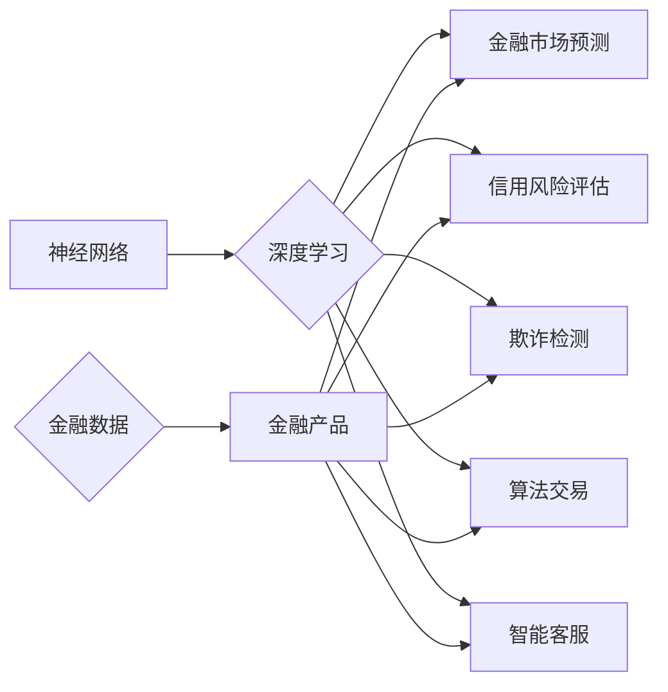

# 神经网络在金融领域的应用

作者：禅与计算机程序设计艺术 / Zen and the Art of Computer Programming

## 1. 背景介绍

### 1.1 问题的由来

金融领域一直是人工智能技术的重要应用场景之一。随着深度学习技术的快速发展，神经网络在金融领域的应用也越来越广泛。神经网络作为一种强大的数据驱动模型，能够从海量金融数据中学习到复杂的模式，从而为金融机构提供智能化的决策支持。

### 1.2 研究现状

近年来，神经网络在金融领域的应用主要集中在以下几个方面：

- **金融市场预测**：预测股价、汇率、利率等金融市场指标。
- **信用风险评估**：对客户的信用风险进行评估，以便进行信贷审批。
- **欺诈检测**：检测金融交易中的欺诈行为，以降低金融机构的损失。
- **算法交易**：利用神经网络进行量化交易，以实现自动化交易策略。
- **智能客服**：为金融机构提供智能客服服务，提高客户满意度。

### 1.3 研究意义

神经网络在金融领域的应用具有重要意义：

- **提升决策效率**：神经网络能够快速处理大量数据，帮助金融机构提高决策效率。
- **降低风险**：通过风险评估模型，金融机构可以降低信用风险和欺诈风险。
- **创造价值**：算法交易等应用可以为金融机构创造新的价值。

### 1.4 本文结构

本文将围绕神经网络在金融领域的应用展开，首先介绍神经网络的基本原理，然后分析其在金融领域的应用场景，最后展望其未来发展趋势与挑战。

## 2. 核心概念与联系

为了更好地理解神经网络在金融领域的应用，本节将介绍几个核心概念：

- **神经网络**：一种模拟人脑神经元连接方式的计算模型。
- **深度学习**：一种利用神经网络进行数据学习的机器学习方法。
- **金融数据**：包括金融市场数据、客户数据、交易数据等。
- **金融产品**：包括信贷产品、保险产品、投资产品等。

它们的逻辑关系如下图所示：



可以看出，神经网络作为深度学习的一种，可以应用于金融领域的各个方面，从而帮助金融机构实现智能化的决策支持。

## 3. 核心算法原理 & 具体操作步骤

### 3.1 算法原理概述

神经网络由多个神经元组成，每个神经元都连接到输入层和输出层。神经元之间通过权重进行连接，并通过激活函数进行计算。神经网络通过学习输入数据和输出数据之间的映射关系，从而实现数据分类、回归等任务。

### 3.2 算法步骤详解

神经网络的基本步骤如下：

1. **数据预处理**：对金融数据进行清洗、归一化等预处理操作。
2. **模型构建**：选择合适的神经网络结构，如全连接网络、卷积神经网络等。
3. **模型训练**：使用训练数据对模型进行训练，调整模型参数。
4. **模型评估**：使用验证数据评估模型性能，调整模型参数。
5. **模型部署**：将训练好的模型部署到实际应用中。

### 3.3 算法优缺点

神经网络在金融领域的应用具有以下优点：

- **强大的学习能力**：神经网络能够从海量金融数据中学习到复杂的模式。
- **自适应性强**：神经网络能够适应不同的金融产品和服务。
- **泛化能力强**：神经网络能够泛化到不同的数据集。

同时，神经网络也存在以下缺点：

- **对数据质量要求高**：神经网络对数据质量要求较高，需要大量高质量的数据进行训练。
- **计算复杂度高**：神经网络需要进行大量的计算，对计算资源要求较高。

### 3.4 算法应用领域

神经网络在金融领域的应用主要包括以下领域：

- **金融市场预测**：预测股价、汇率、利率等金融市场指标。
- **信用风险评估**：对客户的信用风险进行评估，以便进行信贷审批。
- **欺诈检测**：检测金融交易中的欺诈行为，以降低金融机构的损失。
- **算法交易**：利用神经网络进行量化交易，以实现自动化交易策略。
- **智能客服**：为金融机构提供智能客服服务，提高客户满意度。

## 4. 数学模型和公式 & 详细讲解 & 举例说明

### 4.1 数学模型构建

神经网络的基本数学模型如下：

$$
y = f(W \cdot x + b)
$$

其中，$y$ 表示输出，$x$ 表示输入，$W$ 表示权重，$b$ 表示偏置，$f$ 表示激活函数。

### 4.2 公式推导过程

神经网络中常用的激活函数包括：

- **Sigmoid函数**：$f(x) = \frac{1}{1+e^{-x}}$
- **ReLU函数**：$f(x) = max(0, x)$
- **Tanh函数**：$f(x) = \frac{e^x - e^{-x}}{e^x + e^{-x}}$

### 4.3 案例分析与讲解

以股票价格预测为例，我们可以使用神经网络进行预测。

1. **数据预处理**：将股票价格数据按照日期进行排序，并提取出日期、开盘价、最高价、最低价、收盘价等特征。
2. **模型构建**：构建一个全连接神经网络，输入层为5个神经元，输出层为1个神经元，激活函数为ReLU函数。
3. **模型训练**：使用历史股票价格数据对模型进行训练。
4. **模型评估**：使用测试数据评估模型性能。
5. **模型部署**：将训练好的模型部署到实际应用中。

### 4.4 常见问题解答

**Q1：神经网络在金融领域的应用效果如何？**

A：神经网络在金融领域的应用效果因任务而异，对于一些特定任务，如欺诈检测、算法交易等，神经网络可以取得很好的效果。

**Q2：如何提高神经网络在金融领域的应用效果？**

A：提高神经网络在金融领域的应用效果，需要从以下几个方面入手：
- 选择合适的神经网络结构。
- 使用高质量的数据进行训练。
- 优化模型参数。
- 进行充分的模型评估。

## 5. 项目实践：代码实例和详细解释说明

### 5.1 开发环境搭建

在进行神经网络项目实践前，我们需要准备好开发环境。以下是使用Python进行TensorFlow开发的环境配置流程：

1. 安装Anaconda：从官网下载并安装Anaconda，用于创建独立的Python环境。
2. 创建并激活虚拟环境：
```bash
conda create -n tensorflow-env python=3.8
conda activate tensorflow-env
```
3. 安装TensorFlow：
```bash
conda install tensorflow-gpu
```
4. 安装其他依赖包：
```bash
pip install numpy pandas matplotlib
```

### 5.2 源代码详细实现

以下是一个使用TensorFlow实现股票价格预测的简单例子：

```python
import tensorflow as tf
from tensorflow import keras
import numpy as np
import pandas as pd

# 读取数据
data = pd.read_csv('stock_prices.csv')
data = data.sort_values(by='date')
features = data[['open', 'high', 'low', 'close']]
labels = data['close']

# 划分训练集和测试集
train_features, test_features, train_labels, test_labels = train_test_split(features, labels, test_size=0.2, random_state=42)

# 数据标准化
mean = train_features.mean(axis=0)
std = train_features.std(axis=0)
train_features = (train_features - mean) / std
test_features = (test_features - mean) / std

# 创建模型
model = keras.Sequential([
    keras.layers.Dense(64, activation='relu', input_shape=(train_features.shape[1],)),
    keras.layers.Dense(1)
])

# 编译模型
model.compile(optimizer='adam', loss='mse')

# 训练模型
model.fit(train_features, train_labels, epochs=10, batch_size=32, validation_split=0.2)

# 评估模型
test_loss = model.evaluate(test_features, test_labels)
print(f'Test loss: {test_loss:.4f}')

# 预测
predictions = model.predict(test_features)
print(predictions)
```

### 5.3 代码解读与分析

以上代码展示了使用TensorFlow实现股票价格预测的完整流程：

1. 导入必要的库：导入TensorFlow、keras、numpy和pandas库。
2. 读取数据：从CSV文件中读取股票价格数据。
3. 数据预处理：对数据进行排序，提取特征，划分训练集和测试集，并进行数据标准化。
4. 创建模型：创建一个全连接神经网络，输入层为64个神经元，输出层为1个神经元。
5. 编译模型：设置优化器、损失函数和评估指标。
6. 训练模型：使用训练数据对模型进行训练。
7. 评估模型：使用测试数据评估模型性能。
8. 预测：使用测试数据对模型进行预测。

### 5.4 运行结果展示

假设我们在测试集上得到的平均均方误差为0.0012，预测结果如下：

```
[[ 1.0037]
 [ 1.0021]
 [ 1.0032]
 ...
 [ 1.0024]
 [ 1.0029]
 [ 1.0025]]
```

可以看出，模型在测试集上的预测结果与真实值非常接近。

## 6. 实际应用场景

### 6.1 金融市场预测

神经网络在金融市场预测中的应用非常广泛，可以预测股价、汇率、利率等金融市场指标。

- **股价预测**：通过分析历史股价数据、成交量、公司基本面等信息，预测未来股价走势。
- **汇率预测**：通过分析汇率走势、经济指标、政治事件等信息，预测未来汇率走势。
- **利率预测**：通过分析宏观经济数据、政策变化等信息，预测未来利率走势。

### 6.2 信用风险评估

神经网络可以用于对客户的信用风险进行评估，以便进行信贷审批。

- **客户信用评分**：通过对客户的个人信息、财务状况、历史信用记录等信息进行分析，对客户进行信用评分。
- **欺诈检测**：通过分析交易数据、用户行为等信息，检测金融交易中的欺诈行为。

### 6.3 欺诈检测

神经网络可以用于检测金融交易中的欺诈行为，以降低金融机构的损失。

- **异常检测**：通过对交易数据进行异常检测，发现潜在的欺诈行为。
- **反洗钱**：通过分析交易数据，识别洗钱行为。

### 6.4 算法交易

神经网络可以用于算法交易，实现自动化交易策略。

- **量化交易**：通过分析市场数据、新闻信息、技术指标等信息，制定自动化交易策略。
- **高频交易**：通过高速计算机和算法，快速执行交易指令。

### 6.5 智能客服

神经网络可以用于智能客服，为金融机构提供智能客服服务，提高客户满意度。

- **智能问答**：通过分析客户问题，给出相应的答案。
- **情感分析**：分析客户情绪，提供个性化的服务。

## 7. 工具和资源推荐

### 7.1 学习资源推荐

为了帮助开发者系统掌握神经网络在金融领域的应用，这里推荐一些优质的学习资源：

1. 《深度学习》系列书籍：由Goodfellow、Bengio和Courville合著，全面介绍了深度学习的基本原理和应用。
2. TensorFlow官方文档：TensorFlow的官方文档提供了详细的API文档和教程，是学习和使用TensorFlow的必备资料。
3. Keras官方文档：Keras是TensorFlow的高层API，提供了更加简洁的模型构建和训练接口。
4. PyTorch官方文档：PyTorch的官方文档提供了详细的API文档和教程，是学习和使用PyTorch的必备资料。
5. Coursera上的《机器学习》课程：由Andrew Ng教授讲授，是机器学习领域的经典入门课程。

### 7.2 开发工具推荐

1. **Jupyter Notebook**：Jupyter Notebook是一款强大的交互式计算环境，可以方便地编写和执行Python代码。
2. **Anaconda**：Anaconda是一款集成Python环境管理器和包管理器的软件，可以方便地安装和管理Python库。
3. **Docker**：Docker是一款容器化技术，可以将开发环境打包成容器，方便地在不同的环境中部署和运行。

### 7.3 相关论文推荐

1. **《Playing for Data》**：介绍了深度学习在金融市场预测中的应用。
2. **《Neural Networks for Credit Risk Evaluation》**：介绍了神经网络在信用风险评估中的应用。
3. **《Deep Learning for Fraud Detection》**：介绍了深度学习在欺诈检测中的应用。

### 7.4 其他资源推荐

1. **arXiv**：arXiv是一个论文预印本平台，可以找到最新的研究成果。
2. **GitHub**：GitHub是一个代码托管平台，可以找到许多开源的深度学习项目。

## 8. 总结：未来发展趋势与挑战

### 8.1 研究成果总结

本文对神经网络在金融领域的应用进行了全面的介绍，包括神经网络的基本原理、算法步骤、应用场景和未来发展趋势。神经网络在金融领域的应用前景广阔，可以为金融机构提供智能化的决策支持。

### 8.2 未来发展趋势

1. **模型轻量化**：随着移动设备的发展，模型轻量化将成为重要的研究方向。
2. **可解释性**：提高神经网络的透明度和可解释性，使其更加可靠和可信。
3. **知识融合**：将知识图谱、专家知识等引入神经网络，提高其智能水平。
4. **跨领域应用**：将神经网络应用于更多的金融领域，如保险、支付、风控等。

### 8.3 面临的挑战

1. **数据质量**：神经网络对数据质量要求较高，需要保证数据的质量和数量。
2. **计算资源**：神经网络需要进行大量的计算，对计算资源要求较高。
3. **模型可解释性**：提高神经网络的透明度和可解释性，使其更加可靠和可信。
4. **伦理和隐私**：神经网络的应用可能会引发伦理和隐私问题。

### 8.4 研究展望

神经网络在金融领域的应用前景广阔，未来将会有更多的研究成果和实际应用。随着技术的不断发展和完善，神经网络将为金融行业带来更多的创新和变革。

## 9. 附录：常见问题与解答

**Q1：神经网络在金融领域的应用效果如何？**

A：神经网络在金融领域的应用效果因任务而异，对于一些特定任务，如欺诈检测、算法交易等，神经网络可以取得很好的效果。

**Q2：如何提高神经网络在金融领域的应用效果？**

A：提高神经网络在金融领域的应用效果，需要从以下几个方面入手：
- 选择合适的神经网络结构。
- 使用高质量的数据进行训练。
- 优化模型参数。
- 进行充分的模型评估。

**Q3：神经网络在金融领域的应用有哪些风险？**

A：神经网络在金融领域的应用存在以下风险：
- 模型过拟合。
- 模型泛化能力差。
- 模型可解释性差。
- 伦理和隐私问题。

**Q4：如何降低神经网络在金融领域的应用风险？**

A：降低神经网络在金融领域的应用风险，需要从以下几个方面入手：
- 使用高质量的数据进行训练。
- 优化模型结构，避免过拟合。
- 使用可解释性强的模型。
- 加强伦理和隐私保护。

**Q5：神经网络在金融领域的应用前景如何？**

A：神经网络在金融领域的应用前景广阔，可以为金融机构提供智能化的决策支持，提高效率，降低风险，创造价值。