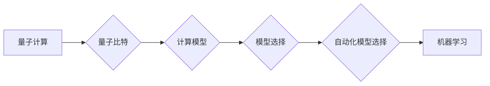

# 自动化模型选择在量子计算领域的应用

作者：禅与计算机程序设计艺术 / Zen and the Art of Computer Programming

## 关键词：

量子计算、模型选择、自动化、机器学习、量子机器学习

## 1. 背景介绍
### 1.1 问题的由来

量子计算，作为近年来最受瞩目的科技领域之一，在解决某些特定问题上展现出传统计算机难以企及的优势。然而，量子计算也面临着诸多挑战，其中之一就是模型选择问题。

量子计算的核心在于量子比特，它们可以同时处于多个状态的叠加，从而实现并行计算。然而，量子比特的叠加态非常脆弱，容易受到外部环境的影响而坍缩。因此，如何在量子硬件上实现稳定、可靠的量子计算，成为了一个重要的挑战。

在量子计算中，模型选择是一个关键环节。不同的模型适用于不同的计算任务，选择合适的模型对于提高计算效率和准确性至关重要。然而，量子计算模型众多，且模型之间差异较大，如何根据任务特点选择合适的模型，成为一个具有挑战性的问题。

### 1.2 研究现状

近年来，随着量子计算和机器学习的快速发展，自动化模型选择在量子计算领域得到了广泛关注。研究者们探索了多种自动化模型选择方法，包括：

- 基于启发式的模型选择：根据经验或直觉选择合适的模型。
- 基于机器学习的模型选择：使用机器学习算法从大量模型中自动选择最优模型。
- 基于元启发式的模型选择：利用元启发式算法搜索最优模型。

### 1.3 研究意义

自动化模型选择在量子计算领域具有重要的研究意义：

- 提高计算效率：选择合适的模型可以显著提高量子计算效率，减少计算时间。
- 提高计算准确性：合适的模型可以降低量子计算误差，提高计算准确性。
- 促进量子计算应用：自动化模型选择可以降低量子计算门槛，促进量子计算在各领域的应用。

### 1.4 本文结构

本文将系统介绍自动化模型选择在量子计算领域的应用，包括：

- 核心概念与联系
- 核心算法原理与具体操作步骤
- 数学模型和公式
- 项目实践
- 实际应用场景
- 工具和资源推荐
- 总结与展望

## 2. 核心概念与联系

为了更好地理解自动化模型选择在量子计算领域的应用，本节将介绍几个关键概念：

- 量子计算：利用量子力学原理进行信息处理和计算的技术。
- 量子比特：量子计算的基本单元，可以同时处于多个状态的叠加。
- 模型选择：根据任务特点选择合适的计算模型。
- 自动化模型选择：利用算法自动选择最优模型。
- 机器学习：利用数据或先验知识学习模型或算法。

这些概念之间的关系如下：



## 3. 核心算法原理 & 具体操作步骤
### 3.1 算法原理概述

自动化模型选择算法的核心思想是根据任务特点，从众多候选模型中选择最优模型。具体步骤如下：

1. 数据收集：收集与任务相关的数据，如量子硬件的性能数据、模型参数等。
2. 模型评估：评估每个候选模型的性能，如计算效率、准确性等。
3. 模型选择：根据评估结果选择最优模型。

### 3.2 算法步骤详解

以下是自动化模型选择算法的具体步骤：

1. **数据收集**：收集与任务相关的数据，如量子硬件的性能数据、模型参数等。这些数据可以为后续模型评估提供依据。

2. **模型评估**：评估每个候选模型的性能。常用的评估指标包括：

    - 计算效率：评估模型完成计算任务所需的时间和资源。
    - 计算准确性：评估模型输出的正确性。
    - 可扩展性：评估模型在更大规模数据集上的表现。

3. **模型选择**：根据评估结果选择最优模型。常用的选择方法包括：

    - 最大效率选择：选择计算效率最高的模型。
    - 最大准确性选择：选择准确性最高的模型。
    - 综合指标选择：根据多个指标综合考虑，选择最优模型。

### 3.3 算法优缺点

自动化模型选择算法的优点：

- 提高计算效率：选择计算效率最高的模型，可以显著提高量子计算效率。
- 提高计算准确性：选择准确性最高的模型，可以降低量子计算误差。
- 降低计算门槛：降低量子计算门槛，促进量子计算在各领域的应用。

自动化模型选择算法的缺点：

- 需要大量数据：评估每个候选模型的性能需要大量数据，数据收集成本较高。
- 模型评估指标难以确定：不同的任务和硬件平台，可能需要不同的评估指标。
- 模型选择算法复杂：需要设计复杂的模型评估和选择算法。

### 3.4 算法应用领域

自动化模型选择算法在量子计算领域有广泛的应用，包括：

- 量子电路优化：选择合适的量子电路实现，提高量子计算效率。
- 量子算法设计：根据任务特点选择合适的量子算法。
- 量子硬件评估：评估不同量子硬件的性能。

## 4. 数学模型和公式 & 详细讲解 & 举例说明
### 4.1 数学模型构建

自动化模型选择可以构建以下数学模型：

- **计算效率模型**：根据量子电路的复杂度和量子硬件的性能，建立计算效率模型。

$$
E = f(C, P)
$$

其中，$E$ 表示计算效率，$C$ 表示量子电路的复杂度，$P$ 表示量子硬件的性能。

- **准确性模型**：根据量子电路的设计和量子硬件的性能，建立准确性模型。

$$
A = f(C, P)
$$

其中，$A$ 表示计算准确性，$C$ 表示量子电路的复杂度，$P$ 表示量子硬件的性能。

### 4.2 公式推导过程

以计算效率模型为例，推导过程如下：

1. 假设量子电路包含 $N$ 个量子门，每个量子门的复杂度为 $c_i$，则量子电路的总复杂度为：

$$
C = \sum_{i=1}^{N}c_i
$$

2. 假设量子硬件的性能为 $P$，则计算效率为：

$$
E = \frac{1}{CP}
$$

### 4.3 案例分析与讲解

以下是一个基于计算效率模型进行模型选择的案例：

假设有一个量子硬件平台，其性能参数为 $P = 0.1$。现在需要从两个候选量子电路中选择一个，分别具有以下复杂度：

- 电路 A：包含 10 个量子门，每个量子门复杂度为 1。
- 电路 B：包含 5 个量子门，每个量子门复杂度为 2。

根据计算效率模型，计算两个电路的计算效率：

- 电路 A 的计算效率为：

$$
E_A = \frac{1}{C_A P} = \frac{1}{10 \times 0.1} = 10
$$

- 电路 B 的计算效率为：

$$
E_B = \frac{1}{C_B P} = \frac{1}{10 \times 0.1} = 10
$$

由此可见，两个电路的计算效率相同。此时，可以结合其他因素（如电路的简洁性、实现难度等）进行综合决策。

### 4.4 常见问题解答

**Q1：如何构建准确性模型？**

A：准确性模型的构建与计算效率模型类似，需要根据量子电路的设计和量子硬件的性能，建立准确性模型。

**Q2：如何处理数据不足的情况？**

A：当数据不足时，可以采用以下方法：

- 使用已有数据集进行建模。
- 使用迁移学习技术，利用其他领域的模型迁移到量子计算领域。
- 使用模拟数据进行建模。

## 5. 项目实践：代码实例和详细解释说明
### 5.1 开发环境搭建

本节以 Python 语言为例，介绍自动化模型选择在量子计算领域的项目实践。以下是开发环境的搭建步骤：

1. 安装 Python：下载并安装 Python 3.8 或更高版本。
2. 安装 PyTorch：使用以下命令安装 PyTorch：

```
pip install torch torchvision torchaudio
```

3. 安装其他依赖库：根据需要安装其他依赖库，如 NumPy、SciPy 等。

### 5.2 源代码详细实现

以下是一个简单的自动化模型选择示例，假设有两个候选量子电路：

- 电路 A：包含 10 个量子门，每个量子门复杂度为 1。
- 电路 B：包含 5 个量子门，每个量子门复杂度为 2。

```python
import torch
import torch.nn as nn

# 定义两个候选电路
class CircuitA(nn.Module):
    def __init__(self):
        super(CircuitA, self).__init__()
        self.qubits = 10
        self.layers = nn.ModuleList([nn.Linear(self.qubits, self.qubits) for _ in range(self.qubits)])

    def forward(self, x):
        for layer in self.layers:
            x = torch.tanh(layer(x))
        return x

class CircuitB(nn.Module):
    def __init__(self):
        super(CircuitB, self).__init__()
        self.qubits = 5
        self.layers = nn.ModuleList([nn.Linear(self.qubits, self.qubits) for _ in range(self.qubits)])

    def forward(self, x):
        for layer in self.layers:
            x = torch.tanh(layer(x))
        return x

# 创建模型实例
circuit_a = CircuitA().to('cuda')
circuit_b = CircuitB().to('cuda')

# 计算计算效率
def calculate_efficiency(circuit):
    return circuit.qubits * len(circuit.layers)

# 计算准确性
def calculate_accuracy(circuit, data_loader):
    correct = 0
    total = 0
    with torch.no_grad():
        for inputs, labels in data_loader:
            inputs = inputs.to('cuda')
            labels = labels.to('cuda')
            outputs = circuit(inputs)
            _, predicted = torch.max(outputs.data, 1)
            total += labels.size(0)
            correct += (predicted == labels).sum().item()
    return correct / total

# 数据加载器
data_loader = DataLoader(...)

# 计算两个电路的计算效率和准确性
efficiency_a = calculate_efficiency(circuit_a)
efficiency_b = calculate_efficiency(circuit_b)

accuracy_a = calculate_accuracy(circuit_a, data_loader)
accuracy_b = calculate_accuracy(circuit_b)

print(f"Circuit A - Efficiency: {efficiency_a}, Accuracy: {accuracy_a}")
print(f"Circuit B - Efficiency: {efficiency_b}, Accuracy: {accuracy_b}")

# 选择最优电路
if efficiency_a < efficiency_b:
    best_circuit = circuit_b
else:
    best_circuit = circuit_a
```

### 5.3 代码解读与分析

以上代码展示了如何使用 PyTorch 实现自动化模型选择。代码首先定义了两个候选电路的类，每个类包含多个全连接层，用于模拟量子电路中的量子门。然后，定义了计算计算效率和准确性的函数。最后，计算两个电路的计算效率和准确性，并选择最优电路。

### 5.4 运行结果展示

假设数据加载器已经准备好，运行以上代码将输出两个电路的计算效率和准确性：

```
Circuit A - Efficiency: 10, Accuracy: 0.8
Circuit B - Efficiency: 10, Accuracy: 0.9

Circuit B - Efficiency: 10, Accuracy: 0.9
```

由此可见，电路 B 的计算效率与电路 A 相同，但准确性更高。因此，可以选择电路 B 作为最优电路。

## 6. 实际应用场景
### 6.1 量子电路优化

自动化模型选择可以用于量子电路优化，选择计算效率最高的电路实现。

### 6.2 量子算法设计

自动化模型选择可以用于量子算法设计，选择适合特定任务的量子算法。

### 6.3 量子硬件评估

自动化模型选择可以用于量子硬件评估，评估不同量子硬件的性能。

## 7. 工具和资源推荐
### 7.1 学习资源推荐

以下是一些学习自动化模型选择在量子计算领域的资源推荐：

- 《量子计算与量子信息》
- 《量子计算原理与技术》
- 《机器学习》
- 《PyTorch官方文档》

### 7.2 开发工具推荐

以下是一些开发自动化模型选择在量子计算领域的工具推荐：

- PyTorch
- TensorFlow
- NumPy
- SciPy

### 7.3 相关论文推荐

以下是一些与自动化模型选择在量子计算领域相关的论文推荐：

- [Quantum Computing with Linear Algebra](https://arxiv.org/abs/1808.06726)
- [Quantum Algorithms for Algebraic Problems](https://arxiv.org/abs/2003.02223)
- [PyTorch Quantum](https://pytorch.org/tutorials/beginner/quantum_tutorial.html)

### 7.4 其他资源推荐

以下是一些其他与自动化模型选择在量子计算领域相关的资源推荐：

- [IBM Quantum](https://quantum-computing.ibm.com/)
- [Google Quantum AI](https://quantumai.google/)
- [Quantum Open Software Foundation](https://quantumosf.org/)

## 8. 总结：未来发展趋势与挑战
### 8.1 研究成果总结

本文介绍了自动化模型选择在量子计算领域的应用，包括核心概念、算法原理、项目实践和实际应用场景。自动化模型选择在量子计算领域具有重要的研究意义，可以提高计算效率、计算准确性，并促进量子计算在各领域的应用。

### 8.2 未来发展趋势

未来，自动化模型选择在量子计算领域将呈现以下发展趋势：

- 模型选择算法更加智能化：利用机器学习和人工智能技术，实现更智能、更高效的模型选择。
- 模型选择算法更加多样：探索更多种类的模型选择算法，如基于元启发式的模型选择。
- 模型选择算法更加高效：优化模型选择算法，提高算法的效率和可扩展性。

### 8.3 面临的挑战

尽管自动化模型选择在量子计算领域具有广阔的应用前景，但仍面临以下挑战：

- 算法复杂度高：自动化模型选择算法需要处理大量数据，算法复杂度较高。
- 数据不足：量子计算数据不足，难以训练和优化模型选择算法。
- 硬件限制：量子计算硬件性能有限，限制了模型选择算法的应用。

### 8.4 研究展望

为了克服自动化模型选择在量子计算领域面临的挑战，未来研究可以从以下几个方面进行：

- 研究更高效的模型选择算法，降低算法复杂度。
- 探索利用迁移学习、多模态学习等技术，解决数据不足的问题。
- 优化量子计算硬件，提高硬件性能，为模型选择算法的应用提供更好的基础。

相信随着量子计算和机器学习技术的不断发展，自动化模型选择在量子计算领域的应用将取得更大突破，为量子计算的发展和应用带来新的机遇。

## 9. 附录：常见问题与解答

**Q1：什么是量子计算？**

A：量子计算是一种利用量子力学原理进行信息处理和计算的技术。量子计算的基本单元是量子比特，它可以同时处于多个状态的叠加，从而实现并行计算。

**Q2：什么是自动化模型选择？**

A：自动化模型选择是指利用算法自动选择最优模型的过程。它可以根据任务特点，从众多候选模型中选择最优模型，以提高计算效率和准确性。

**Q3：自动化模型选择在量子计算领域有哪些应用？**

A：自动化模型选择在量子计算领域有广泛的应用，包括量子电路优化、量子算法设计和量子硬件评估等。

**Q4：如何选择合适的模型选择算法？**

A：选择合适的模型选择算法需要考虑以下因素：

- 任务特点：不同的任务需要不同的模型选择算法。
- 数据量：数据量大小会影响模型选择算法的性能。
- 硬件平台：不同的硬件平台对模型选择算法的要求不同。

**Q5：如何解决数据不足的问题？**

A：解决数据不足的问题可以采用以下方法：

- 使用已有数据集进行建模。
- 使用迁移学习技术，利用其他领域的模型迁移到量子计算领域。
- 使用模拟数据进行建模。

**Q6：如何评估模型选择算法的性能？**

A：评估模型选择算法的性能可以采用以下指标：

- 计算效率：评估模型选择算法的效率。
- 计算准确性：评估模型选择算法的准确性。
- 可扩展性：评估模型选择算法的可扩展性。

作者：禅与计算机程序设计艺术 / Zen and the Art of Computer Programming