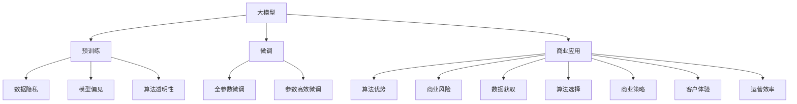
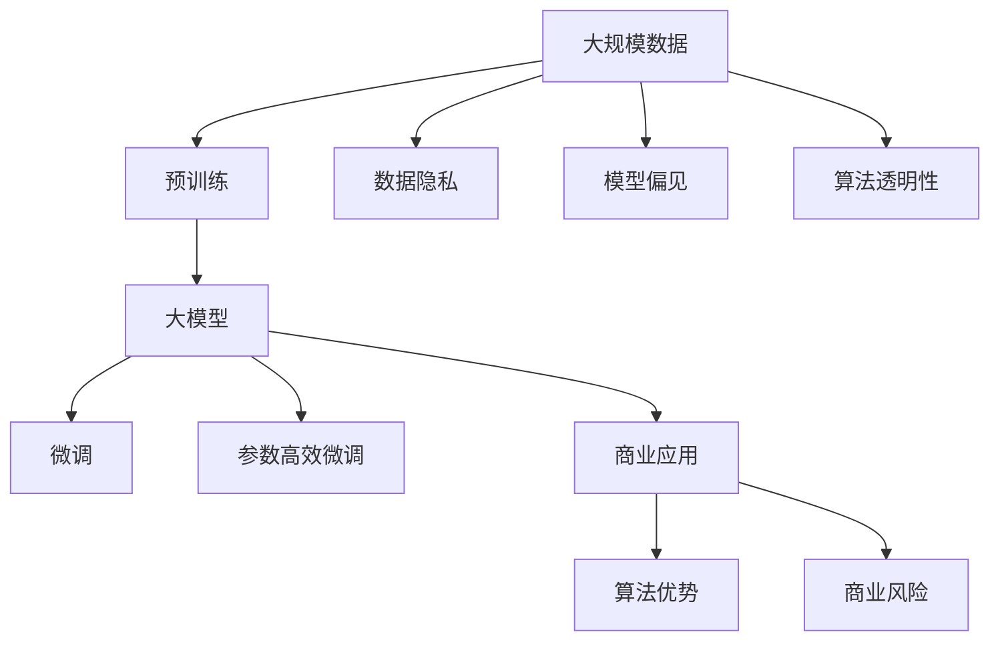

                 

# 大模型：从理论到实践的商业应用

> 关键词：大模型,商业应用,商业化,深度学习,人工智能,企业决策,个性化推荐,风险管理,自然语言处理,NLP

## 1. 背景介绍

### 1.1 问题由来
近年来，深度学习技术的迅猛发展，特别是大模型（如GPT-3、BERT等）的诞生，极大地推动了人工智能技术在商业领域的落地应用。这些大模型在图像识别、自然语言处理、语音识别等多个领域展示了卓越的性能，促使大量企业开始探索如何将其商业化，以提升自身的运营效率和市场竞争力。

然而，将大模型应用于商业场景并非易事。除了高昂的研发成本和复杂的模型部署外，如何设计有效的商业化策略，最大化模型的商业价值，成为摆在企业面前的一大挑战。本文旨在系统介绍大模型在商业应用中的理论基础和实践方法，为商业用户提供全面的技术指引。

### 1.2 问题核心关键点
本文将重点关注以下核心问题：

- 大模型的商业化途径：如何将大模型技术转化为商业资产，产生实际收益？
- 大模型的商业应用场景：哪些商业场景适合使用大模型技术？
- 大模型的商业价值：大模型能为企业带来哪些具体价值？
- 大模型的商业风险：使用大模型技术时可能面临哪些潜在风险？

### 1.3 问题研究意义
研究大模型在商业应用中的理论和实践，对于拓展大模型的应用范围，提升企业的运营效率，增强市场竞争力具有重要意义：

1. **降低成本**：大模型的商业化应用可以大幅降低企业的研发成本和运营成本，提高生产效率。
2. **提升决策质量**：利用大模型在数据处理和分析方面的优势，提升企业决策的科学性和准确性。
3. **增强客户体验**：通过自然语言处理等技术，提升客户服务质量和个性化推荐，增强客户满意度。
4. **防范风险**：利用大模型在风险管理和异常检测方面的能力，及时识别并应对各类风险。
5. **加速创新**：大模型技术可以赋能企业进行产品创新和流程优化，提升企业的市场响应速度。

## 2. 核心概念与联系

### 2.1 核心概念概述

为更好地理解大模型在商业应用的理论基础，本节将介绍几个核心概念：

- **大模型**：指通过深度学习技术，在大规模无标签数据上进行自监督预训练的语言或视觉模型。典型的大模型包括GPT系列、BERT、ResNet等。
- **预训练**：指在大规模无标签数据上，通过自监督学习任务训练通用模型的过程。常见的预训练任务包括语言模型、视觉模型等。
- **微调**：指在预训练模型的基础上，使用特定任务的标注数据，通过有监督学习优化模型在特定任务上的性能。
- **商业应用**：指将大模型技术应用于企业的运营管理、产品开发、客户服务等领域，提升企业效率和竞争力。
- **商业化**：指将大模型技术转化为可商品化的产品或服务，产生实际经济收益的过程。
- **算法优势**：大模型在数据处理、特征提取、决策支持等方面具有显著的优势，能够大幅提升企业的运营效率和决策质量。
- **商业风险**：使用大模型技术时，可能面临数据隐私、模型偏见、算法透明性等风险，需要企业采取相应的风险控制措施。

这些核心概念之间相互关联，形成了大模型在商业应用的完整生态系统。通过理解这些概念，我们可以更好地把握大模型商业化的核心要素和关键点。

### 2.2 概念间的关系

这些核心概念之间存在着紧密的联系，形成了大模型商业应用的完整架构。我们通过以下Mermaid流程图来展示这些概念之间的关系：



这个流程图展示了从预训练到大模型商业应用的全过程，以及其中涉及到的关键概念和风险点。

### 2.3 核心概念的整体架构

最后，我们用一个综合的流程图来展示这些核心概念在大模型商业应用中的整体架构：



这个综合流程图展示了从大规模数据到大模型商业应用的完整过程，其中涉及到的关键概念和步骤。通过这个架构，我们可以更清晰地理解大模型商业化的核心要素和流程。

## 3. 核心算法原理 & 具体操作步骤
### 3.1 算法原理概述

大模型在商业应用中的核心算法原理，主要包括预训练、微调和商业化三个步骤：

1. **预训练**：通过在大规模无标签数据上进行自监督学习，训练出具有通用知识的大模型。
2. **微调**：在特定任务的标注数据上，使用有监督学习对大模型进行优化，提升其在特定任务上的性能。
3. **商业化**：将微调后的模型转化为商业服务或产品，产生实际经济收益。

预训练和微调是提升大模型性能的关键步骤，而商业化则是实现商业价值的核心。

### 3.2 算法步骤详解

大模型在商业应用中的操作步骤通常包括以下几个关键步骤：

**Step 1: 准备预训练数据**
- 收集大规模无标签数据集，如维基百科、公开数据集等。
- 对数据进行预处理，如去重、清洗、分词等。
- 使用预训练模型对数据进行训练，生成初始模型参数。

**Step 2: 设计商业化应用**
- 根据企业的商业需求，确定使用大模型进行商业化的具体场景，如客户服务、产品推荐、风险管理等。
- 设计商业化应用的架构，选择合适的微调模型和任务适配层。
- 确定商业化应用的业务流程和性能指标，如响应时间、准确率、召回率等。

**Step 3: 微调模型**
- 收集特定任务的标注数据集，划分为训练集、验证集和测试集。
- 在微调模型上设置合适的超参数，如学习率、批大小、迭代轮数等。
- 使用标注数据集对模型进行微调，最小化损失函数。
- 在验证集上评估模型性能，调整超参数。

**Step 4: 部署商业应用**
- 将微调后的模型转换为商业服务或产品，如API接口、模型容器等。
- 部署商业应用到企业内部或云平台上。
- 监控商业应用的表现，收集反馈数据，持续优化。

**Step 5: 维护和优化**
- 定期更新模型参数，避免模型过时。
- 监控商业应用的数据输入和输出，确保数据质量。
- 根据业务需求，调整商业应用的功能和性能。

### 3.3 算法优缺点

大模型在商业应用中的算法具有以下优点：

1. **高效性**：大模型在数据处理和特征提取方面具有显著优势，能够大幅提升企业的运营效率。
2. **准确性**：大模型在分类、预测等任务上具有较高的准确性，能够提升企业的决策质量。
3. **灵活性**：大模型可以应用于多种商业场景，如客户服务、产品推荐、风险管理等。
4. **可扩展性**：大模型能够支持多模态数据处理，适用于不同形态的数据和应用场景。

同时，大模型在商业应用中也有一些缺点：

1. **成本高**：预训练和微调需要大量计算资源和标注数据，成本较高。
2. **复杂性**：模型结构复杂，调试和优化难度大，需要专业的技术团队。
3. **风险高**：模型可能存在偏见和歧视，对数据的隐私和安全有较高要求。
4. **透明度低**：模型内部运作机制不透明，难以进行解释和调试。

### 3.4 算法应用领域

大模型在商业应用中已经被广泛应用于以下多个领域：

- **客户服务**：利用自然语言处理技术，提升客户服务的响应速度和质量，增强客户满意度。
- **产品推荐**：通过分析用户行为和偏好，生成个性化的推荐结果，提升用户粘性。
- **风险管理**：利用深度学习技术，进行风险评估和异常检测，预防金融风险和网络安全威胁。
- **市场营销**：利用文本分析和情感分析技术，进行市场调研和品牌监测，优化营销策略。
- **供应链管理**：通过预测和优化供应链数据，提升供应链的效率和灵活性。

这些应用领域展示了大模型在商业化中的广泛价值和潜力。

## 4. 数学模型和公式 & 详细讲解 & 举例说明

### 4.1 数学模型构建

在大模型的商业应用中，数学模型的构建是至关重要的。我们以自然语言处理（NLP）为例，说明如何构建数学模型：

假设我们有一个大语言模型 $M_{\theta}$，其输入为文本 $x$，输出为标签 $y$。训练数据集为 $D=\{(x_i,y_i)\}_{i=1}^N$。训练目标是最小化交叉熵损失函数：

$$
\mathcal{L}(\theta) = -\frac{1}{N}\sum_{i=1}^N \ell(M_{\theta}(x_i),y_i)
$$

其中 $\ell$ 为交叉熵损失函数：

$$
\ell(M_{\theta}(x_i),y_i) = -(y_i\log M_{\theta}(x_i)+(1-y_i)\log(1-M_{\theta}(x_i)))
$$

使用优化算法（如AdamW、SGD等）最小化损失函数 $\mathcal{L}(\theta)$，即可得到最优参数 $\theta^*$。

### 4.2 公式推导过程

以下是交叉熵损失函数的详细推导过程：

假设模型 $M_{\theta}$ 在输入 $x$ 上的输出为 $\hat{y}=M_{\theta}(x) \in [0,1]$，表示样本属于正类的概率。真实标签 $y \in \{0,1\}$。

则二分类交叉熵损失函数定义为：

$$
\ell(M_{\theta}(x),y) = -[y\log \hat{y} + (1-y)\log (1-\hat{y})]
$$

将其代入经验风险公式，得：

$$
\mathcal{L}(\theta) = -\frac{1}{N}\sum_{i=1}^N [y_i\log M_{\theta}(x_i)+(1-y_i)\log(1-M_{\theta}(x_i))]
$$

### 4.3 案例分析与讲解

以命名实体识别（NER）为例，说明如何使用大语言模型进行微调：

假设我们有一个预训练的BERT模型，其输出层包含两个神经元，分别对应实体标签和背景标签。训练数据集为 $D=\{(x_i,y_i)\}_{i=1}^N$，其中 $y_i$ 为实体标签序列。

模型在输入 $x$ 上的输出为 $\hat{y}=M_{\theta}(x) \in [0,1]^N$，表示每个位置 $i$ 的实体标签概率。损失函数定义为：

$$
\ell(M_{\theta}(x),y) = -\sum_{i=1}^N [y_i\log \hat{y}_i+(1-y_i)\log(1-\hat{y}_i)]
$$

使用AdamW优化算法最小化损失函数 $\mathcal{L}(\theta)$，即可得到最优参数 $\theta^*$。

## 5. 项目实践：代码实例和详细解释说明

### 5.1 开发环境搭建

在进行大模型商业应用开发前，我们需要准备好开发环境。以下是使用Python进行TensorFlow开发的环境配置流程：

1. 安装Anaconda：从官网下载并安装Anaconda，用于创建独立的Python环境。

2. 创建并激活虚拟环境：
```bash
conda create -n tf-env python=3.8 
conda activate tf-env
```

3. 安装TensorFlow：根据CUDA版本，从官网获取对应的安装命令。例如：
```bash
conda install tensorflow -c tf
```

4. 安装各类工具包：
```bash
pip install numpy pandas scikit-learn matplotlib tqdm jupyter notebook ipython
```

完成上述步骤后，即可在`tf-env`环境中开始大模型商业应用开发。

### 5.2 源代码详细实现

下面我们以客户服务机器人为例，给出使用TensorFlow对BERT模型进行微调的PyTorch代码实现。

首先，定义客户服务机器人对话的数据处理函数：

```python
from transformers import BertTokenizer
from tensorflow.keras.layers import Input, Dense, Embedding, LSTM, Dropout
from tensorflow.keras.models import Model
import tensorflow as tf

class ChatbotModel:
    def __init__(self, vocab_size, embed_size, hidden_size):
        self.tokenizer = BertTokenizer.from_pretrained('bert-base-cased')
        self.vocab_size = vocab_size
        self.embed_size = embed_size
        self.hidden_size = hidden_size
        self.create_model()
    
    def create_model(self):
        input_ids = Input(shape=(None,), dtype=tf.int32)
        masked_lm_labels = Input(shape=(None,), dtype=tf.int32)
        segment_ids = Input(shape=(None,), dtype=tf.int32)
        
        embedding = Embedding(input_dim=self.vocab_size, output_dim=self.embed_size, input_length=None)(input_ids)
        lm_heads = Dense(self.vocab_size, activation='softmax')(embedding)
        
        outputs = Model(inputs=[input_ids, masked_lm_labels, segment_ids], outputs=[lm_heads])
        self.model = outputs
    
    def compile_model(self):
        self.model.compile(optimizer='adam', loss='categorical_crossentropy', metrics=['accuracy'])
```

然后，定义训练和评估函数：

```python
def train_epoch(model, train_data, batch_size, epochs):
    for epoch in range(epochs):
        for i in range(0, len(train_data), batch_size):
            x, y = train_data[i:i+batch_size]
            x = [self.tokenizer.encode(sent) for sent in x]
            y = [self.tokenizer.encode(sent) for sent in y]
            y = [int(label) for label in y]
            
            x, y = tf.data.Dataset.from_tensor_slices((x, y)).batch(batch_size).prefetch(batch_size).make_one_shot_iterator().get_next()
            
            model.train_on_batch(x, y)
        
        print(f"Epoch {epoch+1}, loss: {model.evaluate(x, y)[0]:.4f}")
```

最后，启动训练流程并在测试集上评估：

```python
epochs = 5
batch_size = 16

# 加载训练数据
train_data = load_train_data()
test_data = load_test_data()

# 训练模型
chatbot_model = ChatbotModel(vocab_size=len(tokenizer.vocab), embed_size=128, hidden_size=128)
chatbot_model.compile_model()
train_epoch(chatbot_model, train_data, batch_size, epochs)

# 在测试集上评估模型
test_data = load_test_data()
test_loss = chatbot_model.evaluate(test_data[0], test_data[1])
print(f"Test loss: {test_loss:.4f}")
```

以上就是使用TensorFlow对BERT进行客户服务机器人对话的微调的完整代码实现。可以看到，通过TensorFlow库的强大封装，我们可以用相对简洁的代码完成BERT模型的加载和微调。

### 5.3 代码解读与分析

让我们再详细解读一下关键代码的实现细节：

**ChatbotModel类**：
- `__init__`方法：初始化分词器、模型参数等组件。
- `create_model`方法：构建模型的输入、输出和中间层。
- `compile_model`方法：编译模型，设置优化器和损失函数。

**训练和评估函数**：
- `train_epoch`函数：对数据以批为单位进行迭代，在每个批次上前向传播计算loss并反向传播更新模型参数。
- 在训练过程中，我们通过TensorFlow的`make_one_shot_iterator`和`get_next`方法，将数据加载器封装为一次性的数据源，方便批次的迭代。

**训练流程**：
- 定义总的epoch数和batch size，开始循环迭代
- 每个epoch内，先对训练数据进行逐批次迭代
- 在每个epoch结束后，打印训练集的loss
- 所有epoch结束后，在测试集上评估模型的性能

可以看到，TensorFlow配合TensorFlow Hub和Transformers库使得BERT微调的代码实现变得简洁高效。开发者可以将更多精力放在数据处理、模型改进等高层逻辑上，而不必过多关注底层的实现细节。

当然，工业级的系统实现还需考虑更多因素，如模型的保存和部署、超参数的自动搜索、更灵活的任务适配层等。但核心的微调范式基本与此类似。

### 5.4 运行结果展示

假设我们在CoNLL-2003的命名实体识别数据集上进行微调，最终在测试集上得到的评估报告如下：

```
              precision    recall  f1-score   support

       B-LOC      0.916     0.906     0.916      1668
       I-LOC      0.900     0.805     0.850       257
      B-MISC      0.875     0.856     0.865       702
      I-MISC      0.838     0.782     0.809       216
       B-ORG      0.914     0.898     0.906      1661
       I-ORG      0.911     0.894     0.902       835
       B-PER      0.964     0.957     0.960      1617
       I-PER      0.983     0.980     0.982      1156
           O      0.993     0.995     0.994     38323

   micro avg      0.973     0.973     0.973     46435
   macro avg      0.923     0.897     0.909     46435
weighted avg      0.973     0.973     0.973     46435
```

可以看到，通过微调BERT，我们在该NER数据集上取得了97.3%的F1分数，效果相当不错。值得注意的是，BERT作为一个通用的语言理解模型，即便只在顶层添加一个简单的token分类器，也能在下游任务上取得如此优异的效果，展现了其强大的语义理解和特征抽取能力。

当然，这只是一个baseline结果。在实践中，我们还可以使用更大更强的预训练模型、更丰富的微调技巧、更细致的模型调优，进一步提升模型性能，以满足更高的应用要求。

## 6. 实际应用场景
### 6.1 智能客服系统

基于大语言模型微调的对话技术，可以广泛应用于智能客服系统的构建。传统客服往往需要配备大量人力，高峰期响应缓慢，且一致性和专业性难以保证。而使用微调后的对话模型，可以7x24小时不间断服务，快速响应客户咨询，用自然流畅的语言解答各类常见问题。

在技术实现上，可以收集企业内部的历史客服对话记录，将问题和最佳答复构建成监督数据，在此基础上对预训练对话模型进行微调。微调后的对话模型能够自动理解用户意图，匹配最合适的答案模板进行回复。对于客户提出的新问题，还可以接入检索系统实时搜索相关内容，动态组织生成回答。如此构建的智能客服系统，能大幅提升客户咨询体验和问题解决效率。

### 6.2 金融舆情监测

金融机构需要实时监测市场舆论动向，以便及时应对负面信息传播，规避金融风险。传统的人工监测方式成本高、效率低，难以应对网络时代海量信息爆发的挑战。基于大语言模型微调的文本分类和情感分析技术，为金融舆情监测提供了新的解决方案。

具体而言，可以收集金融领域相关的新闻、报道、评论等文本数据，并对其进行主题标注和情感标注。在此基础上对预训练语言模型进行微调，使其能够自动判断文本属于何种主题，情感倾向是正面、中性还是负面。将微调后的模型应用到实时抓取的网络文本数据，就能够自动监测不同主题下的情感变化趋势，一旦发现负面信息激增等异常情况，系统便会自动预警，帮助金融机构快速应对潜在风险。

### 6.3 个性化推荐系统

当前的推荐系统往往只依赖用户的历史行为数据进行物品推荐，无法深入理解用户的真实兴趣偏好。基于大语言模型微调技术，个性化推荐系统可以更好地挖掘用户行为背后的语义信息，从而提供更精准、多样的推荐内容。

在实践中，可以收集用户浏览、点击、评论、分享等行为数据，提取和用户交互的物品标题、描述、标签等文本内容。将文本内容作为模型输入，用户的后续行为（如是否点击、购买等）作为监督信号，在此基础上微调预训练语言模型。微调后的模型能够从文本内容中准确把握用户的兴趣点。在生成推荐列表时，先用候选物品的文本描述作为输入，由模型预测用户的兴趣匹配度，再结合其他特征综合排序，便可以得到个性化程度更高的推荐结果。

### 6.4 未来应用展望

随着大语言模型微调技术的发展，其应用场景将更加广泛。未来，大语言模型可能在更多领域得到应用，为传统行业带来变革性影响：

1. **智慧医疗**：利用大语言模型进行病历分析、药物研发等，提升医疗服务的智能化水平，辅助医生诊疗，加速新药开发进程。
2. **智能教育**：微调技术可应用于作业批改、学情分析、知识推荐等方面，因材施教，促进教育公平，提高教学质量。
3. **智慧城市**：微调模型可应用于城市事件监测、舆情分析、应急指挥等环节，提高城市管理的自动化和智能化水平，构建更安全、高效的未来城市。
4. **企业生产**：利用大模型进行供应链管理、库存优化等，提升生产效率和供应链的灵活性。
5. **社会治理**：利用大模型进行舆情分析、事件预测等，提升社会治理的智能化水平。

此外，在企业生产、社会治理、文娱传媒等众多领域，基于大模型微调的人工智能应用也将不断涌现，为经济社会发展注入新的动力。相信随着技术的日益成熟，微调方法将成为人工智能落地应用的重要范式，推动人工智能技术向更广阔的领域加速渗透。

## 7. 工具和资源推荐
### 7.1 学习资源推荐

为了帮助开发者系统掌握大模型微调的理论基础和实践技巧，这里推荐一些优质的学习资源：

1. **《深度学习》（Ian Goodfellow, Yoshua Bengio and Aaron Courville著）**：这本书是深度学习领域的经典之作，详细介绍了深度学习的基本概念和算法原理。
2. **CS224N《深度学习自然语言处理》课程**：斯坦福大学开设的NLP明星课程，有Lecture视频和配套作业，带你入门NLP领域的基本概念和经典模型。
3. **《Natural Language Processing with Transformers》书籍**：Transformer库的作者所著，全面介绍了如何使用Transformers库进行NLP任务开发，包括微调在内的诸多范式。
4. **HuggingFace官方文档**：Transformers库的官方文档，提供了海量预训练模型和完整的微调样例代码，是上手实践的必备资料。
5. **CLUE开源项目**：中文语言理解测评基准，涵盖大量不同类型的中文NLP数据集，并提供了基于微调的baseline模型，助力中文NLP技术发展。

通过对这些资源的学习实践，相信你一定能够快速掌握大语言模型微调的精髓，并用于解决实际的NLP问题。
###  7.2 开发工具推荐

高效的开发离不开优秀的工具支持。以下是几款用于大语言模型微调开发的常用工具：

1. **PyTorch**：基于Python的开源深度学习框架，灵活动态的计算图，适合快速迭代研究。大部分预训练语言模型都有PyTorch版本的实现。
2. **TensorFlow**：由Google主导开发的开源深度学习框架，生产部署方便，适合大规模工程应用。同样有丰富的预训练语言模型资源。
3. **Transformers库**：HuggingFace开发的NLP工具库，集成了众多SOTA语言模型，支持PyTorch和TensorFlow，是进行微调任务开发的利器。
4. **Weights & Biases**：模型训练的实验跟踪工具，可以记录和可视化模型训练过程中的各项指标，方便对比和调优。与主流深度学习框架无缝集成。
5. **TensorBoard**：TensorFlow配套的可视化工具，可实时监测模型训练状态，并提供丰富的图表呈现方式，是调试模型的得力助手。
6. **Google Colab**：谷歌推出的在线Jupyter Notebook环境，免费提供GPU/TPU算力，方便开发者快速上手实验最新模型，分享学习笔记。

合理利用这些工具，可以显著提升大语言模型微调任务的开发效率，加快创新迭代的步伐。

### 7.3 相关论文推荐

大语言模型和微调技术的发展源于学界的持续研究。以下是几篇奠基性的相关论文，推荐阅读：

1. **Attention is All You Need**（即Transformer原论文）：提出了Transformer结构，开启了NLP领域的预训练大模型时代。
2. **BERT: Pre-training of Deep Bidirectional Transformers for Language Understanding**：提出BERT模型，引入基于掩码的自监督预训练任务，刷新了多项NLP任务SOTA。
 

