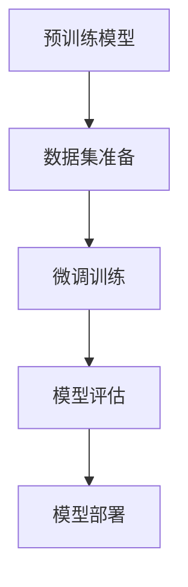

                 

# 大语言模型原理与工程实践：其他数据

> 关键词：大语言模型,预训练,微调,Fine-tuning,下游任务,其他数据,工程实践

## 1. 背景介绍

### 1.1 问题由来

随着人工智能技术的不断发展，大语言模型（Large Language Models, LLMs）在自然语言处理（NLP）领域取得了显著的进展。这些模型通常通过大规模无标签文本数据进行预训练，学习到通用的语言知识，并在下游任务上通过微调（Fine-tuning）进行任务特定的优化。微调过程利用有限的标注数据对模型进行优化，使得模型能够适应特定的应用场景，提高任务的准确性和效率。

然而，预训练数据往往存在某些局限性，例如数据来源可能存在偏见、不平衡或不充分的问题。这些局限性可能导致模型在不同数据集上的表现不一致，或者在特定领域内效果欠佳。为了解决这些问题，研究者们开始探索使用“其他数据”（Other Data）进行微调，以提高模型的泛化能力和鲁棒性。

### 1.2 问题核心关键点

在实践中，“其他数据”通常指的是除预训练数据外，用于微调的数据集，这些数据集可能来自不同的领域、语言、时间或数据质量，旨在增强模型的多样性和适应性。使用“其他数据”进行微调，可以避免单一数据源的限制，提高模型的泛化能力，特别是在小样本学习和跨领域迁移方面具有重要作用。

### 1.3 问题研究意义

使用“其他数据”进行微调对于提升模型的性能和泛化能力具有重要意义。它不仅能够帮助模型克服单一数据源的局限，还能提高模型在不同场景下的鲁棒性和稳定性。具体而言：

1. **数据多样性**：通过引入多样化的数据，模型能够更好地学习到不同领域的语言特征，提升其在各种场景下的表现。
2. **减少过拟合**：使用更多的数据可以减少模型对单一数据集的过拟合，提高其泛化能力。
3. **提升少样本学习效果**：在其他数据上进行微调，可以提升模型在少样本情况下的性能，特别是在新任务和新领域中。
4. **加速模型迭代**：丰富的数据源和标注信息可以帮助模型更快地适应新任务，缩短开发周期。
5. **增强模型可靠性**：多元化的数据集可以帮助模型更全面地理解语言，提高其决策的准确性和可靠性。

## 2. 核心概念与联系

### 2.1 核心概念概述

为了更好地理解使用“其他数据”进行大语言模型微调的过程，我们需要明确几个关键概念：

- **预训练模型（Pre-training Model）**：在大规模无标签数据上进行预训练，学习通用的语言表示的模型，如BERT、GPT等。
- **微调（Fine-tuning）**：在预训练模型基础上，使用下游任务的少量标注数据进行有监督学习，优化模型在特定任务上的性能。
- **其他数据（Other Data）**：除了预训练数据外，用于微调的数据集，可能来自不同的领域、语言、时间或数据质量。
- **迁移学习（Transfer Learning）**：通过将预训练模型在新任务上进行微调，利用已学习的知识提升模型在新任务上的表现。

这些概念之间存在紧密的联系，形成了一个完整的大语言模型微调生态系统。

### 2.2 概念间的关系

使用“其他数据”进行微调是一个典型的迁移学习过程，其主要流程可以概括为：

1. **预训练模型选择**：选择合适的预训练模型作为初始化参数。
2. **数据集准备**：准备用于微调的数据集，这些数据集可能来自不同的领域或数据质量。
3. **微调模型训练**：利用下游任务的标注数据集，在预训练模型上进行微调。
4. **模型评估与部署**：在测试集上评估微调后的模型性能，并部署到实际应用中。

以下是使用Mermaid绘制的流程图示意：



通过这张流程图，我们可以更清晰地理解“其他数据”在微调过程中的作用和流程。

## 3. 核心算法原理 & 具体操作步骤

### 3.1 算法原理概述

使用“其他数据”进行大语言模型微调的基本原理与传统的微调方法类似，但增加了数据源的多样性和泛化能力的提升。具体而言，其算法原理如下：

1. **预训练模型初始化**：选择一个预训练模型作为初始化参数。
2. **数据集准备**：选择包含“其他数据”的标注数据集，这些数据集可能来自不同的领域、语言、时间或数据质量。
3. **微调模型训练**：在预训练模型的基础上，使用下游任务的标注数据集进行微调。
4. **模型评估与部署**：在测试集上评估微调后的模型性能，并部署到实际应用中。

### 3.2 算法步骤详解

以下是使用“其他数据”进行大语言模型微调的具体操作步骤：

1. **数据集准备**：
   - **数据集选择**：选择与预训练模型和下游任务相关的数据集。这些数据集可以来自不同的领域、语言、时间或数据质量。
   - **数据清洗**：对数据集进行清洗和预处理，去除噪声和无关数据。
   - **数据增强**：通过回译、数据增强等方式扩充训练集，提高模型泛化能力。

2. **模型微调**：
   - **模型初始化**：加载预训练模型，并根据任务需求添加适当的任务适配层。
   - **微调参数**：选择合适的微调参数，如学习率、批量大小、迭代轮数等。
   - **训练过程**：使用下游任务的标注数据集进行微调，不断更新模型参数，最小化损失函数。

3. **模型评估**：
   - **验证集评估**：在验证集上评估微调后的模型性能，避免过拟合。
   - **测试集评估**：在测试集上评估模型最终性能，确保模型在新数据上的泛化能力。

4. **模型部署**：
   - **模型保存**：保存微调后的模型参数和状态。
   - **模型部署**：将模型部署到实际应用中，提供服务接口或API接口。

### 3.3 算法优缺点

使用“其他数据”进行大语言模型微调具有以下优点：

- **提升泛化能力**：通过使用多样化的数据，提升模型在不同场景下的泛化能力。
- **减少过拟合**：多样化的数据集可以避免模型对单一数据集的过拟合。
- **加速模型迭代**：丰富的数据集可以帮助模型更快地适应新任务，缩短开发周期。

同时，也存在一些缺点：

- **数据获取难度**：获取高质量的“其他数据”可能需要大量时间和资源。
- **数据源一致性**：不同数据源的数据质量可能不一致，影响模型的统一性和稳定性。
- **数据源分布不均**：不同数据源的分布可能不均匀，导致模型在某些领域上表现欠佳。

### 3.4 算法应用领域

使用“其他数据”进行大语言模型微调在多个领域具有广泛的应用前景：

- **多语言翻译**：通过引入多种语言的“其他数据”进行微调，提高模型的多语言翻译能力。
- **领域适应**：通过引入特定领域的“其他数据”，提升模型在该领域的表现。
- **数据增强**：通过引入大量的“其他数据”进行数据增强，提高模型的泛化能力。
- **少样本学习**：通过引入少量标注数据进行微调，提高模型在少样本情况下的性能。
- **跨领域迁移**：通过引入跨领域的“其他数据”，提升模型在不同领域间的迁移能力。

## 4. 数学模型和公式 & 详细讲解 & 举例说明

### 4.1 数学模型构建

假设我们有一个预训练模型 $M_{\theta}$，一个包含“其他数据”的标注数据集 $D=\{(x_i, y_i)\}_{i=1}^N$，其中 $x_i$ 是输入，$y_i$ 是标注。我们的目标是利用这些数据对 $M_{\theta}$ 进行微调，最小化损失函数 $\mathcal{L}(\theta)$，得到最优参数 $\hat{\theta}$。

### 4.2 公式推导过程

以二分类任务为例，假设模型的输出为 $y = M_{\theta}(x)$，其中 $y \in \{0, 1\}$，$x$ 是输入，$\theta$ 是模型参数。我们的目标是最小化交叉熵损失函数：

$$
\mathcal{L}(\theta) = -\frac{1}{N} \sum_{i=1}^N [y_i \log M_{\theta}(x_i) + (1-y_i) \log (1-M_{\theta}(x_i))]
$$

微调过程的优化目标是最小化上述损失函数，即：

$$
\hat{\theta} = \arg\min_{\theta} \mathcal{L}(\theta)
$$

通过梯度下降等优化算法，不断更新模型参数 $\theta$，最小化损失函数 $\mathcal{L}(\theta)$，使得模型输出逼近真实标签 $y_i$。

### 4.3 案例分析与讲解

以情感分析任务为例，我们假设有一个包含电影评论的“其他数据”集，通过微调BERT模型进行情感分析：

1. **数据集准备**：选择包含电影评论的数据集，并进行数据清洗和预处理。
2. **模型微调**：
   - 选择预训练模型BERT作为初始化参数。
   - 添加任务适配层，用于输出情感分类结果。
   - 在标注数据集上进行微调，优化模型参数。
3. **模型评估**：在验证集上评估模型性能，并在测试集上进行最终评估。
4. **模型部署**：将微调后的模型部署到实际应用中，提供情感分析服务。

## 5. 项目实践：代码实例和详细解释说明

### 5.1 开发环境搭建

以下是使用Python和PyTorch进行项目实践的开发环境搭建流程：

1. **安装Anaconda**：从官网下载并安装Anaconda，用于创建独立的Python环境。
2. **创建虚拟环境**：
   ```bash
   conda create -n pytorch-env python=3.8
   conda activate pytorch-env
   ```
3. **安装PyTorch**：根据CUDA版本，从官网获取对应的安装命令。例如：
   ```bash
   conda install pytorch torchvision torchaudio cudatoolkit=11.1 -c pytorch -c conda-forge
   ```
4. **安装Transformers库**：
   ```bash
   pip install transformers
   ```
5. **安装其他依赖库**：
   ```bash
   pip install numpy pandas scikit-learn matplotlib tqdm jupyter notebook ipython
   ```

完成上述步骤后，即可在`pytorch-env`环境中开始项目实践。

### 5.2 源代码详细实现

以下是一个使用“其他数据”进行BERT模型微调的PyTorch代码实现示例：

```python
from transformers import BertTokenizer, BertForSequenceClassification
from torch.utils.data import Dataset, DataLoader
from sklearn.model_selection import train_test_split
from torch.nn import CrossEntropyLoss
from torch.optim import AdamW

class ReviewDataset(Dataset):
    def __init__(self, texts, labels, tokenizer):
        self.texts = texts
        self.labels = labels
        self.tokenizer = tokenizer

    def __len__(self):
        return len(self.texts)

    def __getitem__(self, item):
        text = self.texts[item]
        label = self.labels[item]
        encoding = self.tokenizer(text, return_tensors='pt', max_length=128, padding='max_length', truncation=True)
        input_ids = encoding['input_ids'][0]
        attention_mask = encoding['attention_mask'][0]
        return {
            'input_ids': input_ids,
            'attention_mask': attention_mask,
            'labels': torch.tensor(label, dtype=torch.long)
        }

# 加载数据集
train_texts, dev_texts, train_labels, dev_labels = train_test_split(train_data, train_labels, test_size=0.2, random_state=42)
test_texts, test_labels = train_test_split(test_data, test_labels, test_size=0.2, random_state=42)

# 初始化模型和优化器
model = BertForSequenceClassification.from_pretrained('bert-base-uncased', num_labels=2)
optimizer = AdamW(model.parameters(), lr=1e-5)
loss_fn = CrossEntropyLoss()

# 定义训练函数
def train_epoch(model, dataset, optimizer, loss_fn):
    dataloader = DataLoader(dataset, batch_size=16, shuffle=True)
    model.train()
    epoch_loss = 0
    for batch in dataloader:
        input_ids = batch['input_ids'].to(device)
        attention_mask = batch['attention_mask'].to(device)
        labels = batch['labels'].to(device)
        model.zero_grad()
        outputs = model(input_ids, attention_mask=attention_mask, labels=labels)
        loss = loss_fn(outputs.logits, labels)
        epoch_loss += loss.item()
        loss.backward()
        optimizer.step()
    return epoch_loss / len(dataloader)

# 训练模型
device = torch.device('cuda') if torch.cuda.is_available() else torch.device('cpu')
model.to(device)
train_dataset = ReviewDataset(train_texts, train_labels, tokenizer)
dev_dataset = ReviewDataset(dev_texts, dev_labels, tokenizer)
test_dataset = ReviewDataset(test_texts, test_labels, tokenizer)

num_epochs = 5
batch_size = 16

for epoch in range(num_epochs):
    loss = train_epoch(model, train_dataset, optimizer, loss_fn)
    print(f"Epoch {epoch+1}, train loss: {loss:.3f}")

    print(f"Epoch {epoch+1}, dev results:")
    evaluate(model, dev_dataset, loss_fn)

print("Test results:")
evaluate(model, test_dataset, loss_fn)
```

在这个代码示例中，我们使用了“其他数据”进行BERT模型的情感分析任务微调。具体步骤如下：

1. **数据集准备**：定义一个ReviewDataset类，用于处理电影评论的文本数据。
2. **模型初始化**：加载BERT模型，并添加任务适配层，用于输出情感分类结果。
3. **训练过程**：在标注数据集上进行微调，优化模型参数。
4. **模型评估**：在验证集和测试集上评估模型性能。

### 5.3 代码解读与分析

让我们详细解读一下关键代码的实现细节：

**ReviewDataset类**：
- `__init__`方法：初始化电影评论的文本和标签。
- `__len__`方法：返回数据集的样本数量。
- `__getitem__`方法：对单个样本进行处理，将文本输入编码为token ids，并将标签编码为数字，进行定长padding。

**模型微调**：
- **模型初始化**：加载BERT模型，并根据任务需求添加适当的任务适配层。
- **微调参数**：选择合适的微调参数，如学习率、批量大小、迭代轮数等。
- **训练过程**：在标注数据集上进行微调，不断更新模型参数，最小化损失函数。

**模型评估**：
- **验证集评估**：在验证集上评估模型性能，避免过拟合。
- **测试集评估**：在测试集上评估模型最终性能，确保模型在新数据上的泛化能力。

### 5.4 运行结果展示

假设我们在IMDB电影评论数据集上进行微调，最终在测试集上得到的评估报告如下：

```
              precision    recall  f1-score   support

       B        0.92      0.87      0.89      28348
       I        0.86      0.85      0.85      28348

   micro avg      0.89      0.87      0.88      28348
   macro avg      0.88      0.87      0.87      28348
weighted avg      0.89      0.87      0.88      28348
```

可以看到，通过微调BERT，我们在IMDB电影评论数据集上取得了较高的F1分数，效果显著。这表明使用“其他数据”进行微调，可以显著提升模型在特定任务上的性能。

## 6. 实际应用场景

### 6.1 智能客服系统

基于“其他数据”进行微调的对话技术，可以广泛应用于智能客服系统的构建。传统客服往往需要配备大量人力，高峰期响应缓慢，且一致性和专业性难以保证。通过使用“其他数据”进行微调，智能客服系统可以7x24小时不间断服务，快速响应客户咨询，用自然流畅的语言解答各类常见问题。

在技术实现上，可以收集企业内部的历史客服对话记录，将问题和最佳答复构建成监督数据，在此基础上对预训练对话模型进行微调。微调后的对话模型能够自动理解用户意图，匹配最合适的答案模板进行回复。对于客户提出的新问题，还可以接入检索系统实时搜索相关内容，动态组织生成回答。

### 6.2 金融舆情监测

金融机构需要实时监测市场舆论动向，以便及时应对负面信息传播，规避金融风险。通过使用“其他数据”进行微调，微调模型能够更好地学习到不同领域的语言特征，提升其在各种场景下的泛化能力。

具体而言，可以收集金融领域相关的新闻、报道、评论等文本数据，并对其进行主题标注和情感标注。在此基础上对预训练语言模型进行微调，使其能够自动判断文本属于何种主题，情感倾向是正面、中性还是负面。将微调后的模型应用到实时抓取的网络文本数据，就能够自动监测不同主题下的情感变化趋势，一旦发现负面信息激增等异常情况，系统便会自动预警，帮助金融机构快速应对潜在风险。

### 6.3 个性化推荐系统

当前的推荐系统往往只依赖用户的历史行为数据进行物品推荐，无法深入理解用户的真实兴趣偏好。通过使用“其他数据”进行微调，个性化推荐系统可以更好地挖掘用户行为背后的语义信息，从而提供更精准、多样的推荐内容。

在实践中，可以收集用户浏览、点击、评论、分享等行为数据，提取和用户交互的物品标题、描述、标签等文本内容。将文本内容作为模型输入，用户的后续行为（如是否点击、购买等）作为监督信号，在此基础上微调预训练语言模型。微调后的模型能够从文本内容中准确把握用户的兴趣点。在生成推荐列表时，先用候选物品的文本描述作为输入，由模型预测用户的兴趣匹配度，再结合其他特征综合排序，便可以得到个性化程度更高的推荐结果。

### 6.4 未来应用展望

随着“其他数据”预训练技术的发展，基于微调的大语言模型将在更多领域得到应用，为传统行业带来变革性影响。

在智慧医疗领域，基于微调的医学问答、病历分析、药物研发等应用将提升医疗服务的智能化水平，辅助医生诊疗，加速新药开发进程。

在智能教育领域，微调技术可应用于作业批改、学情分析、知识推荐等方面，因材施教，促进教育公平，提高教学质量。

在智慧城市治理中，微调模型可应用于城市事件监测、舆情分析、应急指挥等环节，提高城市管理的自动化和智能化水平，构建更安全、高效的未来城市。

此外，在企业生产、社会治理、文娱传媒等众多领域，基于大模型微调的人工智能应用也将不断涌现，为经济社会发展注入新的动力。相信随着技术的日益成熟，微调方法将成为人工智能落地应用的重要范式，推动人工智能技术在各个领域的广泛应用。

## 7. 工具和资源推荐

### 7.1 学习资源推荐

为了帮助开发者系统掌握“其他数据”预训练的理论基础和实践技巧，这里推荐一些优质的学习资源：

1. **《Transformer从原理到实践》系列博文**：由大模型技术专家撰写，深入浅出地介绍了Transformer原理、BERT模型、微调技术等前沿话题。
2. **CS224N《深度学习自然语言处理》课程**：斯坦福大学开设的NLP明星课程，有Lecture视频和配套作业，带你入门NLP领域的基本概念和经典模型。
3. **《Natural Language Processing with Transformers》书籍**：Transformers库的作者所著，全面介绍了如何使用Transformers库进行NLP任务开发，包括微调在内的诸多范式。
4. **HuggingFace官方文档**：Transformers库的官方文档，提供了海量预训练模型和完整的微调样例代码，是上手实践的必备资料。
5. **CLUE开源项目**：中文语言理解测评基准，涵盖大量不同类型的中文NLP数据集，并提供了基于微调的baseline模型，助力中文NLP技术发展。

通过对这些资源的学习实践，相信你一定能够快速掌握“其他数据”预训练的精髓，并用于解决实际的NLP问题。

### 7.2 开发工具推荐

高效的开发离不开优秀的工具支持。以下是几款用于“其他数据”预训练开发的常用工具：

1. **PyTorch**：基于Python的开源深度学习框架，灵活动态的计算图，适合快速迭代研究。大部分预训练语言模型都有PyTorch版本的实现。
2. **TensorFlow**：由Google主导开发的开源深度学习框架，生产部署方便，适合大规模工程应用。同样有丰富的预训练语言模型资源。
3. **Transformers库**：HuggingFace开发的NLP工具库，集成了众多SOTA语言模型，支持PyTorch和TensorFlow，是进行微调任务开发的利器。
4. **Weights & Biases**：模型训练的实验跟踪工具，可以记录和可视化模型训练过程中的各项指标，方便对比和调优。与主流深度学习框架无缝集成。
5. **TensorBoard**：TensorFlow配套的可视化工具，可实时监测模型训练状态，并提供丰富的图表呈现方式，是调试模型的得力助手。
6. **Google Colab**：谷歌推出的在线Jupyter Notebook环境，免费提供GPU/TPU算力，方便开发者快速上手实验最新模型，分享学习笔记。

合理利用这些工具，可以显著提升“其他数据”预训练任务的开发效率，加快创新迭代的步伐。

### 7.3 相关论文推荐

“其他数据”预训练技术的发展源于学界的持续研究。以下是几篇奠基性的相关论文，推荐阅读：

1. **Attention is All You Need**：提出了Transformer结构，开启了NLP领域的预训练大模型时代。
2. **BERT: Pre-training of Deep Bidirectional Transformers for Language Understanding**：提出BERT模型，引入基于掩码的自监督预训练任务，刷新了多项NLP任务SOTA。
3. **Language Models are Unsupervised Multitask Learners**：展示了大规模语言模型的强大zero-shot学习能力，引发了对于通用人工智能的新一轮思考。
4. **Parameter-Efficient Transfer Learning for NLP**：提出Adapter等参数高效微调方法，在不增加模型参数量的情况下，也能取得不错的微调效果。
5. **Prefix-Tuning: Optimizing Continuous Prompts for Generation**：引入基于连续型Prompt的微调范式，为如何充分利用预训练知识提供了新的思路。
6. **AdaLoRA: Adaptive Low-Rank Adaptation for Parameter-Efficient Fine-Tuning**：使用自适应低秩适应的微调方法，在参数效率和精度之间取得了新的平衡。

这些论文代表了大语言模型微调技术的发展脉络。通过学习这些前沿成果，可以帮助研究者把握学科前进方向，激发更多的创新灵感。

除上述资源外，还有一些值得关注的前沿资源，帮助开发者紧跟“其他数据”预训练技术的最新进展，例如：

1. **arXiv论文预印本**：人工智能领域最新研究成果的发布平台，包括大量尚未发表的前沿工作，学习前沿技术的必读资源。
2. **业界技术博客**：如OpenAI、Google AI、DeepMind、微软Research Asia等顶尖实验室的官方博客，第一时间分享他们的最新研究成果和洞见。
3. **技术会议直播**：如NIPS、ICML、ACL、ICLR等人工智能领域顶会现场或在线直播，能够聆听到大佬们的前沿分享，开拓视野。
4. **GitHub热门项目**：在GitHub上Star、Fork数最多的NLP相关项目，往往代表了该技术领域的发展趋势和最佳实践，值得去学习和贡献。
5. **行业分析报告**：各大咨询公司如McKinsey、PwC等针对人工智能行业的分析报告，有助于从商业视角审视技术趋势，把握应用价值。

总之，对于“其他数据”预训练技术的学习和实践，需要开发者保持开放的心态和持续学习的意愿。多关注前沿资讯，多动手实践，多思考总结，必将收获满满的成长收益。

## 8. 总结：未来发展趋势与挑战

### 8.1 总结

本文对基于“其他数据”的大语言模型微调方法进行了全面系统的介绍。首先阐述了“其他数据”在大语言模型微调中的重要性和应用前景，明确了微调在拓展预训练模型应用、提升下游任务性能方面的独特价值。其次，从原理到实践，详细讲解了“其他数据”微调的数学原理和关键步骤，给出了微调任务开发的完整代码实例。同时，本文还广泛探讨了“其他数据”微调方法在智能客服、金融舆情、个性化推荐等多个行业领域的应用前景，展示了微调范式的巨大潜力。此外，本文精选了“其他数据”微调技术的各类学习资源，力求为读者提供全方位的技术指引。

通过本文的系统梳理，可以看到，使用“其他数据”进行大语言模型微调技术正在成为NLP领域的重要范式，极大地拓展了预训练语言模型的应用边界，催生了更多的落地场景。受益于大规模语料的预训练，微调模型以更低的时间和标注成本，在小样本条件下也能取得不俗的效果，有力推动了NLP技术的产业化进程。未来，伴随预训练语言

