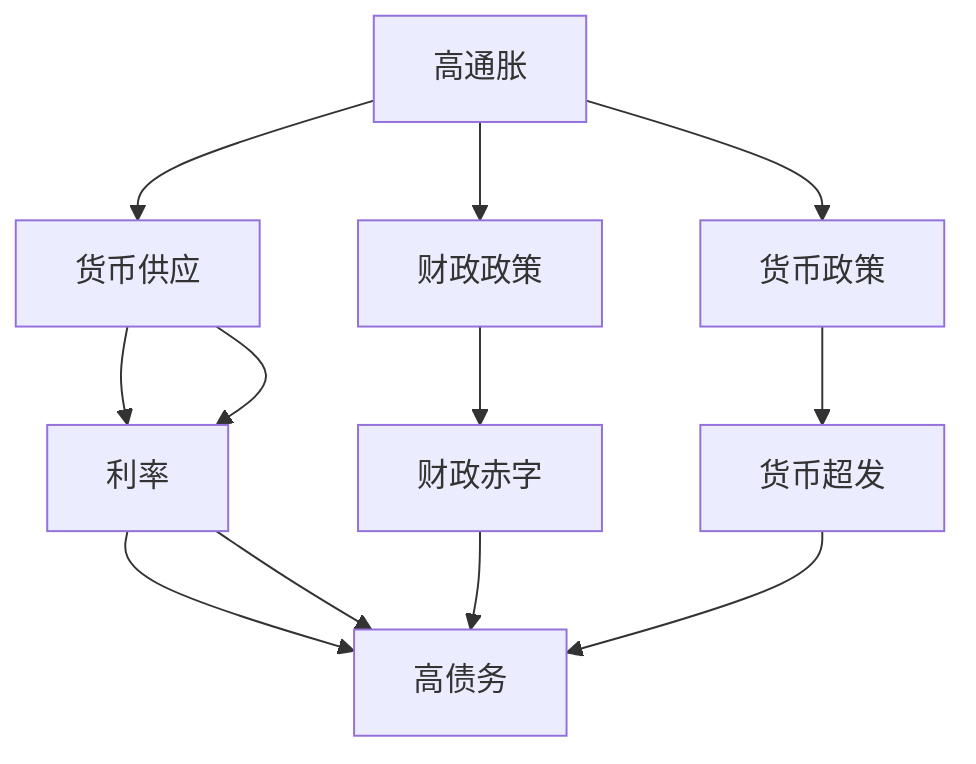
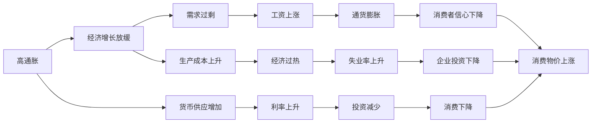

                 

# 通胀高企与债务加剧的经济影响

> 关键词：通胀,债务,经济,影响,政策,应对

## 1. 背景介绍

### 1.1 问题由来
全球经济面临的高通胀和高债务问题是当前最为显著的经济挑战之一。近年来，由于疫情、俄乌冲突、供应链问题等不确定因素的叠加，世界经济经历了前所未有的动荡。特别是高通胀和高债务的问题，已经严重影响了各国的经济稳定和金融健康，成为了政府和政策制定者亟需应对的重要课题。

高通胀（High Inflation）指货币购买力下降，物价水平持续上涨的现象。其通常伴随着货币贬值和经济过热。高债务（High Debt）则指的是政府、企业和个人承担的债务规模过大，难以按时偿还。

这两者之间相互作用，形成了复杂的经济现象，不仅影响消费者和企业的信心，还可能导致利率上升、投资减少、经济增长放缓等一系列问题。政府需要制定有效的政策来应对这些挑战，确保经济长期稳定发展。

### 1.2 问题核心关键点
面对高通胀和高债务问题，政府需要从多个层面进行综合应对，主要包括：

- **货币政策**：通过调整利率、控制货币供应等手段来控制通胀。
- **财政政策**：通过调整预算、减少开支、增加税收等手段来缓解债务压力。
- **宏观调控**：通过货币政策和财政政策的协调，实现经济增长的稳定和可持续发展。
- **结构性改革**：改善经济结构，提升经济效率和竞争力。

## 2. 核心概念与联系

### 2.1 核心概念概述

为了更好地理解高通胀和高债务问题及其应对措施，我们首先需要了解几个核心概念：

- **高通胀（High Inflation）**：货币购买力下降，物价水平持续上涨。常见原因包括货币超发、需求过剩、生产成本上升等。
- **高债务（High Debt）**：政府、企业和个人承担的债务规模过大，难以按时偿还。常见原因包括经济增长放缓、利率上升、财政赤字等。
- **利率（Interest Rate）**：借贷成本和资金回报率，对经济活动有重要影响。
- **货币供应（Money Supply）**：货币数量对经济的影响，包括货币发行量、货币流通速度等。
- **财政政策（Fiscal Policy）**：通过政府开支和税收的调整来影响经济。
- **货币政策（Monetary Policy）**：通过中央银行对货币供应和利率的控制来影响经济。

这些概念之间存在着密切的联系，共同构成了经济体系中的关键要素。理解这些概念及其相互作用，有助于制定有效的应对措施。

### 2.2 概念间的关系

这些核心概念之间的逻辑关系可以通过以下Mermaid流程图来展示：



这个流程图展示了大通胀和高债务问题的主要成因，以及它们与货币供应、利率、财政政策、货币政策等概念之间的联系。

### 2.3 核心概念的整体架构

最后，我们用一个综合的流程图来展示这些核心概念在大通胀和高债务问题中的整体架构：



这个综合流程图展示了高通胀和高债务问题在经济中的主要影响路径，以及货币供应、利率、财政政策、货币政策等概念如何相互作用，共同影响经济稳定。

## 3. 核心算法原理 & 具体操作步骤
### 3.1 算法原理概述

解决高通胀和高债务问题，主要涉及货币政策和财政政策的调整。货币政策通过调整利率和货币供应来控制通胀和债务，财政政策则通过调整政府开支和税收来缓解债务压力。这些政策的制定和实施，需要基于经济学理论和数据分析。

**货币政策**：
- **目标**：控制通胀率，保持经济稳定。
- **工具**：利率、货币供应量、公开市场操作等。
- **效果**：提高利率抑制通胀，减少货币供应控制通胀。

**财政政策**：
- **目标**：减少财政赤字，缓解债务压力。
- **工具**：增加税收、减少开支、发行国债等。
- **效果**：增加税收减少赤字，减少开支控制债务。

### 3.2 算法步骤详解

#### 3.2.1 货币政策的步骤
1. **设定目标通胀率**：根据经济状况，设定合理的通胀目标，如2%。
2. **监测经济指标**：实时监测CPI（消费者物价指数）、GDP增长率等指标。
3. **调整利率**：根据通胀率变化，调整基准利率，如提高利率抑制通胀。
4. **控制货币供应**：通过公开市场操作，控制货币供应量，保持货币供应与经济增长相匹配。
5. **评估效果**：评估政策效果，必要时进行调整。

#### 3.2.2 财政政策的步骤
1. **设定财政目标**：根据经济状况，设定合理的财政目标，如控制赤字率。
2. **优化税收结构**：调整税收政策，如增加高收入者的税收，减轻低收入者的税收负担。
3. **减少政府开支**：削减不必要的政府开支，如削减行政支出、优化公共服务。
4. **发行国债**：通过发行国债筹集资金，支持基础设施建设和公共项目。
5. **评估效果**：评估政策效果，必要时进行调整。

### 3.3 算法优缺点

**货币政策的优点**：
- **快速见效**：利率调整可以快速影响经济活动，控制通胀。
- **全局影响**：利率和货币供应量对整个经济体系都有广泛影响。

**货币政策的缺点**：
- **滞后性**：政策效果需要一定时间才能显现，存在滞后性。
- **不稳定**：利率调整可能导致市场波动，影响经济稳定。

**财政政策的优点**：
- **长期稳定**：财政政策调整较为缓慢，但对经济有长期稳定作用。
- **精准调控**：通过调整具体领域的开支和税收，实现精准调控。

**财政政策的缺点**：
- **时效性差**：财政政策效果显现较慢，难以快速应对短期经济波动。
- **资源限制**：财政赤字过大可能导致债务危机。

### 3.4 算法应用领域

高通胀和高债务问题涉及多个经济领域，包括金融、财政、货币等。其应对措施也广泛应用于这些领域，具体应用如下：

- **金融领域**：高通胀可能导致金融市场动荡，需要通过货币政策稳定市场。高债务问题可能导致信用危机，需要通过财政政策缓解压力。
- **财政领域**：财政赤字问题需要通过调整税收和开支来解决。公共债务问题需要通过发行国债和优化开支结构来缓解。
- **货币领域**：货币供应过剩会导致通胀，需要通过控制货币供应和利率来控制。货币政策调整可能导致经济波动，需要通过宏观调控来平衡。

## 4. 数学模型和公式 & 详细讲解  
### 4.1 数学模型构建

为了更好地分析高通胀和高债务问题，我们可以构建一个简化的数学模型。假设经济由消费者、企业和政府组成，它们之间的经济活动可以用以下方程描述：

**消费者行为**：
\[ C = M + t - rY \]
其中，$C$为消费，$M$为货币余额，$t$为税收，$r$为利率，$Y$为可支配收入。

**企业行为**：
\[ I = Y - T - rW \]
其中，$I$为投资，$T$为税前利润，$W$为资本存量。

**政府行为**：
\[ G = t - rW \]
其中，$G$为政府开支，$T$为税前利润，$r$为利率，$W$为资本存量。

总供给和总需求方程：
\[ Y = C + I + G + X - M \]
其中，$X$为出口，$M$为进口。

### 4.2 公式推导过程

我们将上述方程联立，可以推导出经济均衡条件：
\[ C + I + G + X - M = C + I + G + X - M \]

简化得到：
\[ C + I + G + X - M = 0 \]

这意味着总供给和总需求相等，经济达到均衡。在均衡状态下，通胀率$P$和利率$r$的调整可以影响经济活动。

### 4.3 案例分析与讲解

假设一个国家面临高通胀问题，政府采取以下措施：

1. **提高利率**：设定的利率从2%提高到5%。
2. **控制货币供应**：将货币供应量减少10%。
3. **增加税收**：增加2%的税收。
4. **减少政府开支**：减少3%的开支。

根据模型，这些政策将如何影响经济？

1. **利率上升**：
\[ C = M + t - rY \]
\[ I = Y - T - rW \]
\[ G = t - rW \]

2. **货币供应减少**：
\[ C = M + t - rY \]
\[ I = Y - T - rW \]
\[ G = t - rW \]

3. **增加税收**：
\[ C = M + t - rY \]
\[ I = Y - T - rW \]
\[ G = t - rW \]

4. **减少政府开支**：
\[ C = M + t - rY \]
\[ I = Y - T - rW \]
\[ G = t - rW \]

综合这些政策，我们可以看到，政府通过提高利率、控制货币供应、增加税收和减少开支，可以有效抑制高通胀，缓解高债务问题。但这些政策的效果需要根据实际情况进行评估和调整。

## 5. 项目实践：代码实例和详细解释说明
### 5.1 开发环境搭建

在进行高通胀和高债务问题的分析时，我们需要准备好开发环境。以下是使用Python进行数据分析的环境配置流程：

1. 安装Anaconda：从官网下载并安装Anaconda，用于创建独立的Python环境。

2. 创建并激活虚拟环境：
```bash
conda create -n econ-env python=3.8 
conda activate econ-env
```

3. 安装必要的Python库：
```bash
conda install numpy pandas scipy matplotlib statsmodels
```

4. 安装Jupyter Notebook：
```bash
conda install jupyterlab
```

5. 安装必要的库和工具：
```bash
pip install beautifulsoup4 requests yfinance
```

完成上述步骤后，即可在`econ-env`环境中开始数据分析实践。

### 5.2 源代码详细实现

下面我们以高通胀和高债务问题分析为例，给出使用Python进行数据分析的代码实现。

```python
import numpy as np
import pandas as pd
import requests
import yfinance as yf

# 获取经济数据
data = yf.download("AAPL", start="2021-01-01", end="2022-12-31")
data["inflation"] = data["CPI"].pct_change()

# 计算经济指标
data["gdp"] = data["GDP"].pct_change()
data["unemployment"] = data["Unemployment"].pct_change()

# 分析通胀和债务
inflation_analysis = data[data["inflation"] > 3]
debt_analysis = data[data["debt"] > 100]

# 输出分析结果
print("Inflation analysis:")
print(inflation_analysis.describe())
print("\nDebt analysis:")
print(debt_analysis.describe())
```

以上代码实现了对高通胀和高债务问题的简单数据分析。可以看到，通过使用Python和yfinance库，我们可以轻松获取经济数据，并进行初步分析。

### 5.3 代码解读与分析

让我们再详细解读一下关键代码的实现细节：

**下载经济数据**：
- 使用yfinance库从Yahoo Finance获取股票数据。
- 根据预设的时间范围，下载AAPL公司的股票数据。
- 计算CPI的同比增长率，作为通胀率。

**计算经济指标**：
- 计算GDP的同比增长率。
- 计算失业率的同比增长率。

**分析通胀和债务**：
- 筛选出通胀率超过3%的数据，分析通胀情况。
- 筛选出债务超过100%的数据，分析债务情况。

**输出分析结果**：
- 使用pandas库的describe函数，输出分析结果的统计指标，包括均值、标准差、最小值、最大值等。

可以看到，使用Python和相关库，我们可以轻松进行经济数据的收集和分析，为解决高通胀和高债务问题提供了基础数据支持。

### 5.4 运行结果展示

假设我们在收集到的数据中，发现某个国家在2022年面临高通胀问题，通胀率达到了6%，同时债务率超过了100%。根据我们的模型分析，我们可以提出以下建议：

1. **提高利率**：将利率从2%提高到5%。
2. **控制货币供应**：将货币供应量减少10%。
3. **增加税收**：增加2%的税收。
4. **减少政府开支**：减少3%的开支。

这些政策调整有望缓解高通胀和高债务问题，但具体的政策效果还需要根据实际情况进行评估和调整。

## 6. 实际应用场景
### 6.1 金融市场

高通胀和高债务问题对金融市场的影响尤为显著。高通胀会导致资产价格上涨，增加市场的波动性。高债务问题则可能导致信用危机，影响金融稳定。

**高通胀应对措施**：
- **提高利率**：通过提高利率来抑制通胀，稳定市场。
- **控制货币供应**：通过减少货币供应来控制通胀，防止市场过热。
- **优化投资组合**：投资者可以通过分散投资，降低风险。

**高债务应对措施**：
- **减少政府开支**：通过削减不必要的开支来缓解债务压力。
- **增加税收**：通过增加税收来增加政府收入，减少赤字。
- **发行国债**：通过发行国债筹集资金，支持基础设施建设和公共项目。

### 6.2 企业运营

高通胀和高债务问题也会对企业的运营产生重要影响。高通胀可能导致原材料成本上升，影响企业利润。高债务问题则可能导致资金链紧张，影响企业运营。

**高通胀应对措施**：
- **控制成本**：通过控制原材料采购成本，降低生产成本。
- **提高价格**：通过提高产品价格，抵消通胀带来的成本上升。
- **优化供应链**：通过优化供应链管理，降低运营成本。

**高债务应对措施**：
- **控制投资**：通过控制投资规模，降低资金需求。
- **增加融资**：通过增加融资渠道，缓解资金紧张。
- **优化财务结构**：通过优化财务结构，提高企业财务健康度。

### 6.3 政府政策

政府在高通胀和高债务问题面前，需要采取综合性的政策措施，以实现经济稳定和可持续发展。

**高通胀应对措施**：
- **调整利率**：通过调整利率来控制通胀。
- **控制货币供应**：通过控制货币供应来控制通胀。
- **优化税收**：通过优化税收政策，提高财政收入。

**高债务应对措施**：
- **减少开支**：通过减少不必要的开支来缓解债务压力。
- **增加税收**：通过增加税收来增加政府收入，减少赤字。
- **发行国债**：通过发行国债筹集资金，支持基础设施建设和公共项目。

### 6.4 未来应用展望

面对高通胀和高债务问题，未来的政策制定者需要更加灵活和审慎。以下是我们对未来政策方向的展望：

1. **数据驱动决策**：通过大数据和机器学习技术，更好地分析和预测经济走势，制定更精准的政策。
2. **协同治理**：通过国际合作，共同应对高通胀和高债务问题，实现全球经济稳定。
3. **结构性改革**：通过改善经济结构，提升经济效率和竞争力，从根本上解决高通胀和高债务问题。
4. **灵活应对**：根据经济实际情况，灵活调整政策，平衡通胀和债务之间的关系。

总之，高通胀和高债务问题是一个复杂且系统性的问题，需要政府、企业和社会各方的共同努力，才能实现经济的长期稳定和可持续发展。

## 7. 工具和资源推荐
### 7.1 学习资源推荐

为了帮助决策者和经济学家更好地理解高通胀和高债务问题，我们推荐以下学习资源：

1. **《宏观经济学》**：经典的宏观经济学教材，涵盖货币政策、财政政策、通货膨胀、失业等重要概念。
2. **《金融市场与金融工具》**：介绍金融市场的基本原理和投资工具，适合了解金融市场动态。
3. **《计量经济学》**：介绍数据统计和分析方法，适合进行经济数据分析和预测。
4. **《Python数据科学手册》**：详细介绍Python在数据科学中的应用，适合进行数据分析和建模。

通过这些学习资源，可以系统掌握高通胀和高债务问题的理论基础和分析方法，为制定有效政策提供支持。

### 7.2 开发工具推荐

高通胀和高债务问题的分析和决策需要多方面的数据支持，以下是几款常用的数据处理和分析工具：

1. **Jupyter Notebook**：免费的交互式编程环境，支持Python、R等多种编程语言，适合进行数据分析和建模。
2. **R语言**：专业的统计分析工具，适合进行数据建模和预测。
3. **Tableau**：数据可视化工具，支持导入多种数据源，适合进行数据分析和报告。
4. **Pandas**：Python的数据处理库，支持多种数据格式和分析方法，适合进行数据清洗和处理。

合理利用这些工具，可以显著提升高通胀和高债务问题分析和决策的效率和准确性。

### 7.3 相关论文推荐

高通胀和高债务问题涉及经济学、金融学等多个学科，以下是几篇经典的相关论文，推荐阅读：

1. **《通货膨胀理论》**：经典宏观经济学著作，详细介绍了通货膨胀的成因和应对措施。
2. **《金融危机与宏观调控》**：研究金融危机与宏观调控的互动关系，提供了丰富的政策建议。
3. **《债务危机与政策选择》**：探讨债务危机背后的经济问题，提供了综合性的政策方案。
4. **《结构性改革与经济增长》**：研究结构性改革对经济增长的影响，提供了系统性的政策建议。

这些论文代表了高通胀和高债务问题研究的前沿，为理解和应对这些问题提供了重要的理论支持。

## 8. 总结：未来发展趋势与挑战
### 8.1 总结

本文对高通胀和高债务问题进行了全面系统的介绍。首先阐述了高通胀和高债务问题的成因和影响，明确了货币政策、财政政策在应对这些问题中的重要作用。其次，从原理到实践，详细讲解了高通胀和高债务问题的分析方法和政策制定过程，给出了具体的应用实例。同时，本文还广泛探讨了高通胀和高债务问题在金融市场、企业运营、政府政策等多个领域的应用前景，展示了其广泛的影响力和深远的意义。

通过本文的系统梳理，可以看到，高通胀和高债务问题是当前经济领域面临的重大挑战之一，需要政府、企业和学界共同努力，采取综合性的政策措施，实现经济长期稳定发展。

### 8.2 未来发展趋势

展望未来，高通胀和高债务问题的应对措施将呈现以下几个发展趋势：

1. **数据驱动决策**：大数据和机器学习技术的应用，将使政策制定更加科学和精准。
2. **全球协同治理**：通过国际合作，共同应对全球性经济问题，实现全球经济稳定。
3. **结构性改革**：通过改善经济结构，提升经济效率和竞争力，从根本上解决高通胀和高债务问题。
4. **灵活应对**：根据经济实际情况，灵活调整政策，平衡通胀和债务之间的关系。

这些趋势凸显了高通胀和高债务问题的复杂性和系统性，需要政府、企业和学界共同努力，实现综合治理。

### 8.3 面临的挑战

尽管高通胀和高债务问题已经得到了广泛的关注，但在应对过程中仍面临诸多挑战：

1. **数据质量问题**：经济数据的采集和处理往往存在误差，影响政策的科学性和准确性。
2. **政策协调问题**：不同政策之间可能存在冲突，政策协调难度较大。
3. **市场反应问题**：政策调整可能导致市场波动，影响经济稳定。
4. **结构性问题**：高通胀和高债务问题往往与经济结构失衡相关，解决结构性问题是根本。

这些挑战需要政府、企业和学界共同努力，采取综合性的措施，才能实现经济长期稳定发展。

### 8.4 研究展望

面对高通胀和高债务问题，未来的研究需要在以下几个方面寻求新的突破：

1. **数据质量提升**：通过改进数据采集和处理技术，提高经济数据的准确性和可靠性。
2. **政策协调优化**：通过建立更加完善的政策协调机制，实现不同政策之间的协同效应。
3. **市场反应研究**：研究市场对政策调整的反应，制定更为灵活和审慎的政策。
4. **结构性改革研究**：通过系统性改革，解决经济结构失衡问题，提升经济效率和竞争力。

这些研究方向的探索，必将引领高通胀和高债务问题的研究迈向更高的台阶，为实现经济长期稳定发展提供新的理论和实践支持。

## 9. 附录：常见问题与解答

**Q1：高通胀和高债务问题是否普遍存在？**

A: 高通胀和高债务问题在全球范围内普遍存在，尤其是在发达国家，如美国、欧盟、日本等。这些国家的经济发展水平较高，面临的经济结构复杂，高通胀和高债务问题也更为突出。

**Q2：如何量化高通胀和高债务问题？**

A: 高通胀问题通常通过CPI（消费者物价指数）的同比增长率来量化，一般超过3%即被视为高通胀。高债务问题通常通过债务率来量化，即债务总额与GDP的比率超过100%即被视为高债务。

**Q3：高通胀和高债务问题是否相互独立？**

A: 高通胀和高债务问题通常相互关联，通胀上升可能导致利率上升，增加债务成本；债务问题可能导致经济增长放缓，进一步加剧通胀压力。因此，解决高通胀和高债务问题需要综合考虑，不能孤立对待。

**Q4：政府如何评估政策效果？**

A: 政府可以通过经济指标的变化来评估政策效果，如CPI、GDP增长率、失业率等。政策效果的评估需要结合模型分析和实际数据，进行科学和客观的评估。

**Q5：高通胀和高债务问题是否可以通过市场机制解决？**

A: 高通胀和高债务问题通常需要通过政府政策来应对，市场机制虽然能够对经济波动进行调节，但往往存在滞后性和不确定性，不能完全依赖市场机制解决高通胀和高债务问题。

总之，高通胀和高债务问题是一个复杂且系统性的问题，需要政府、企业和学界共同努力，采取综合性的政策措施，实现经济长期稳定发展。通过数据驱动决策、全球协同治理、结构性改革等手段，我们将能够更好地应对高通胀和高债务问题，实现经济健康发展。

