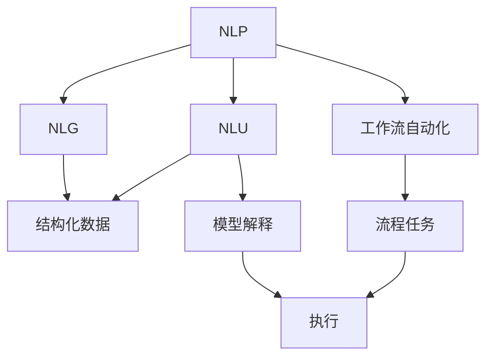
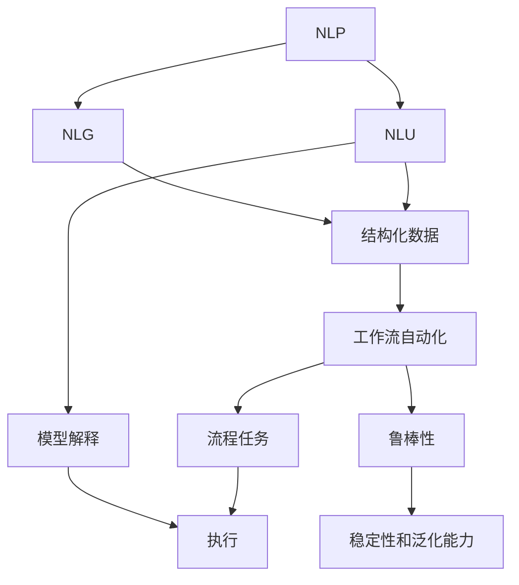

                 

# 通过自然语言创建工作流的新思路

> 关键词：工作流自动化, 自然语言处理, 自然语言理解, 机器学习, 模型解释, 自动化流程

## 1. 背景介绍

### 1.1 问题由来
随着数字化转型和自动化需求的不断增长，越来越多的企业需要借助技术手段自动化业务流程。然而，构建和维护复杂的自动化流程往往需要耗费大量时间和人力。如何利用现有技术和资源，更高效、更智能地构建和管理自动化工作流，成为了一个亟待解决的问题。

自然语言处理(NLP)作为人工智能领域的热门技术，近年来在理解和生成自然语言方面取得了显著进展。本文旨在探索如何利用自然语言处理技术，更简便、更智能地创建和管理自动化工作流。通过将自然语言描述转化为可执行的自动化流程，可以大大提高工作流的创建效率，减少人为错误，提升企业的自动化水平。

### 1.2 问题核心关键点
基于自然语言创建工作流，其核心在于如何高效、准确地将自然语言描述解析成机器可执行的工作流。以下是需要重点解决的关键问题：

1. **自然语言理解**：准确理解自然语言描述中的业务逻辑和任务指令，是构建自动化工作流的第一步。
2. **工作流建模**：将理解后的自然语言描述转化为具体的业务流程和任务步骤。
3. **自动化执行**：基于理解的任务步骤，自动化执行流程中的各个任务。
4. **模型解释和调试**：构建模型时需考虑模型的可解释性，方便调试和优化。
5. **鲁棒性和泛化能力**：构建的模型应具备良好的鲁棒性，能够适应各种不同类型的工作流描述，并在不同数据集上表现稳定。

### 1.3 问题研究意义
利用自然语言创建工作流，对于提升企业自动化水平、优化业务流程、提高工作效率具有重要意义：

1. **简化流程创建**：通过自然语言描述，无需编写复杂代码即可快速创建工作流，大大缩短流程开发时间。
2. **降低开发成本**：减少对编程和专业技能的需求，降低开发和维护成本。
3. **提高可扩展性**：模型具备良好泛化能力，可以轻松应对不同业务场景和需求变化。
4. **增强自动化能力**：提升企业对自动化流程的适应性和响应速度。
5. **提升用户体验**：基于自然语言描述的自动化工作流，更加自然直观，用户接受度更高。

## 2. 核心概念与联系

### 2.1 核心概念概述

为了更好地理解自然语言创建工作流的核心技术，本节将介绍几个密切相关的核心概念：

- **自然语言处理(NLP)**：研究如何让计算机理解、处理和生成自然语言的技术。包括文本预处理、词向量表示、语言模型、机器翻译、情感分析、语义理解等。
- **自然语言理解(NLU)**：NLP中的一个重要分支，专注于理解自然语言文本的意义。目标是将文本转化为结构化数据，方便后续处理。
- **自然语言生成(NLG)**：NLP中的另一分支，专注于生成自然语言文本。目标是根据结构化数据，生成符合语法和语义规则的文本。
- **工作流自动化**：通过自动化技术，将业务流程中的各个任务步骤有机整合，形成一个连续的自动化流程。
- **模型可解释性**：指模型在执行任务时的决策过程透明、可理解。有助于模型调优和问题诊断。
- **鲁棒性**：模型在不同数据集上表现稳定，不受特定噪声影响。

这些核心概念之间的逻辑关系可以通过以下Mermaid流程图来展示：



这个流程图展示了NLP中自然语言理解、自然语言生成与工作流自动化的联系，以及模型可解释性的重要性和鲁棒性对于工作流自动化的重要性。

### 2.2 概念间的关系

这些核心概念之间存在着紧密的联系，构成了自然语言创建工作流的完整生态系统。下面我们通过几个Mermaid流程图来展示这些概念之间的关系。

#### 2.2.1 自然语言理解与工作流自动化的关系


这个流程图展示了自然语言理解如何通过将自然语言描述转化为结构化数据，为工作流自动化提供基础。

#### 2.2.2 自然语言生成与工作流自动化的关系


这个流程图展示了自然语言生成如何将结构化数据转化为自然语言文本，进一步支持工作流自动化。

#### 2.2.3 模型可解释性在工作流自动化中的应用


这个流程图展示了模型可解释性如何帮助诊断和优化自动化流程中的问题，从而提升工作流自动化的效果。

### 2.3 核心概念的整体架构

最后，我们用一个综合的流程图来展示这些核心概念在大语言模型微调过程中的整体架构：



这个综合流程图展示了从NLP到工作流自动化的完整过程。通过理解自然语言描述，转化为结构化数据，再结合工作流自动化技术，可以构建出高效的自动化流程。模型可解释性有助于诊断和优化模型，确保流程的鲁棒性和泛化能力，从而构建出高性能、高可用的工作流自动化系统。

## 3. 核心算法原理 & 具体操作步骤

### 3.1 算法原理概述

利用自然语言创建工作流，本质上是将自然语言理解与工作流自动化技术相结合。其核心思想是：

1. 首先，利用自然语言处理技术，准确理解自然语言描述中的业务逻辑和任务指令。
2. 然后，将理解后的自然语言描述转化为具体的业务流程和任务步骤，形成结构化数据。
3. 最后，基于结构化数据，通过工作流自动化技术，自动化执行流程中的各个任务。

### 3.2 算法步骤详解

基于自然语言创建工作流，主要包括以下几个关键步骤：

**Step 1: 数据预处理**

- 收集自然语言描述数据，进行文本清洗、分词、去停用词等预处理。
- 使用词向量表示技术（如Word2Vec、GloVe等）将文本转化为数值形式。

**Step 2: 自然语言理解**

- 利用预训练的NLP模型（如BERT、GPT等）进行自然语言理解。
- 模型输入为预处理后的文本向量，输出为结构化数据，包含任务步骤、输入输出信息等。

**Step 3: 工作流建模**

- 将结构化数据转化为具体的业务流程和任务步骤。
- 设计工作流引擎，根据任务步骤生成可执行的自动化流程。

**Step 4: 工作流执行**

- 根据工作流描述，自动化执行流程中的各个任务。
- 引入状态机、任务队列等机制，确保任务的有序执行和并发控制。

**Step 5: 模型解释和调试**

- 使用可解释性模型（如LIME、SHAP等）对模型进行解释，理解模型决策过程。
- 根据解释结果，进行模型调优和问题诊断，确保工作流自动化效果。

### 3.3 算法优缺点

利用自然语言创建工作流，具有以下优点：

1. **简化流程创建**：通过自然语言描述，无需编写复杂代码，即可快速创建工作流，大大缩短流程开发时间。
2. **降低开发成本**：减少对编程和专业技能的需求，降低开发和维护成本。
3. **提高可扩展性**：模型具备良好泛化能力，可以轻松应对不同业务场景和需求变化。
4. **提升用户体验**：基于自然语言描述的自动化工作流，更加自然直观，用户接受度更高。

同时，该方法也存在以下缺点：

1. **依赖高质量数据**：构建模型需要大量高质量的自然语言数据，数据获取和标注成本较高。
2. **模型鲁棒性有限**：模型可能对特定领域或特定类型的自然语言描述效果不佳。
3. **模型可解释性不足**：模型的决策过程可能不够透明，难以理解。
4. **执行效率有待提高**：工作流自动化涉及多个任务步骤，执行效率可能受限。

### 3.4 算法应用领域

利用自然语言创建工作流，已经在多个领域得到了应用，例如：

- **金融业务**：自动化客户服务、风险评估、欺诈检测等。
- **医疗健康**：自动化病历管理、诊断报告生成、药物研发等。
- **智能制造**：自动化生产线调度、设备维护、质量检测等。
- **电子商务**：自动化客户服务、订单处理、推荐系统等。
- **政府服务**：自动化政务办理、信息查询、公民互动等。

除了上述这些典型应用场景外，利用自然语言创建工作流的方法，还可以在更多领域探索新的应用。未来，随着技术的发展和应用的推广，自然语言创建工作流必将在更多行业中发挥作用，助力企业自动化转型升级。

## 4. 数学模型和公式 & 详细讲解 & 举例说明

### 4.1 数学模型构建

假设我们有一个简单的自动化工作流，包含三个任务步骤：输入数据、处理数据、输出结果。每个任务步骤由自然语言描述（NLUs）表示，需要将其转化为结构化数据，以便于工作流自动化。

设自然语言描述为 $x_i = (x_{i1}, x_{i2}, \ldots, x_{in})$，其中 $x_{ij}$ 表示描述中的第 $j$ 个词。设任务步骤为 $t_j = (t_{j1}, t_{j2}, \ldots, t_{jm})$，其中 $t_{jk}$ 表示任务步骤中的第 $k$ 个任务。任务步骤之间的关系可以表示为一个有向图 $G = (V, E)$，其中 $V$ 表示任务节点，$E$ 表示任务依赖关系。

我们的目标是将自然语言描述转化为结构化数据，构建一个可执行的工作流模型。

### 4.2 公式推导过程

以下我们以一个简单的自动化工作流为例，推导自然语言理解向结构化数据转换的公式。

**Step 1: 词向量表示**

设自然语言描述 $x_i$ 的词向量表示为 $v_i = (v_{i1}, v_{i2}, \ldots, v_{in})$。其中 $v_{ij}$ 表示第 $j$ 个词的词向量。词向量可以使用预训练的NLP模型（如BERT）获得，或使用Word2Vec、GloVe等技术手动训练。

**Step 2: 任务步骤提取**

设任务步骤 $t_j$ 的表示为 $t_j = (t_{j1}, t_{j2}, \ldots, t_{jm})$。其中 $t_{jk}$ 表示任务步骤中的第 $k$ 个任务。任务步骤可以通过NLP模型提取，或手动定义。

**Step 3: 任务依赖关系构建**

设任务依赖关系 $E$ 为有向图 $G = (V, E)$，其中 $V$ 表示任务节点，$E$ 表示任务依赖关系。构建任务依赖关系可以使用图神经网络（Graph Neural Network, GNN）等技术。

**Step 4: 结构化数据构建**

将任务步骤 $t_j$ 和任务依赖关系 $E$ 转化为结构化数据 $D$。结构化数据可以表示为：

$$
D = (t_1, t_2, \ldots, t_n, E)
$$

其中 $t_1, t_2, \ldots, t_n$ 表示任务步骤，$E$ 表示任务依赖关系。

### 4.3 案例分析与讲解

假设我们有一个简单的自动化工作流，描述如下：

- **输入数据**：读取数据文件，转换为数值形式。
- **处理数据**：使用统计方法，分析数据特征。
- **输出结果**：生成报告，包含分析结果。

自然语言描述可以表示为：

```
读取数据文件，转换为数值形式。
使用统计方法，分析数据特征。
生成报告，包含分析结果。
```

我们将自然语言描述 $x_i$ 转化为词向量 $v_i$，如下所示：

$$
v_i = (v_{i1}, v_{i2}, v_{i3})
$$

其中 $v_{i1}$ 表示“读取数据文件”的词向量，$v_{i2}$ 表示“转换为数值形式”的词向量，$v_{i3}$ 表示“使用统计方法”的词向量。

任务步骤 $t_j$ 可以手动定义，如下所示：

$$
t_1 = (读取数据文件, 转换为数值形式)
t_2 = (使用统计方法, 分析数据特征)
t_3 = (生成报告, 包含分析结果)
$$

任务依赖关系 $E$ 可以通过图神经网络等技术构建，如下所示：

$$
E = (读取数据文件 \rightarrow 转换为数值形式, 转换为数值形式 \rightarrow 使用统计方法, 使用统计方法 \rightarrow 生成报告)
$$

最后，将任务步骤 $t_j$ 和任务依赖关系 $E$ 转化为结构化数据 $D$：

$$
D = (t_1, t_2, t_3, E)
$$

即：

$$
D = (读取数据文件, 转换为数值形式, 使用统计方法, 分析数据特征, 生成报告, 包含分析结果, 读取数据文件 \rightarrow 转换为数值形式, 转换为数值形式 \rightarrow 使用统计方法, 使用统计方法 \rightarrow 生成报告)
$$

## 5. 项目实践：代码实例和详细解释说明

### 5.1 开发环境搭建

在进行自然语言创建工作流的实践前，我们需要准备好开发环境。以下是使用Python进行PyTorch开发的环境配置流程：

1. 安装Anaconda：从官网下载并安装Anaconda，用于创建独立的Python环境。

2. 创建并激活虚拟环境：
```bash
conda create -n pytorch-env python=3.8 
conda activate pytorch-env
```

3. 安装PyTorch：根据CUDA版本，从官网获取对应的安装命令。例如：
```bash
conda install pytorch torchvision torchaudio cudatoolkit=11.1 -c pytorch -c conda-forge
```

4. 安装Transformers库：
```bash
pip install transformers
```

5. 安装各类工具包：
```bash
pip install numpy pandas scikit-learn matplotlib tqdm jupyter notebook ipython
```

完成上述步骤后，即可在`pytorch-env`环境中开始自然语言创建工作流的实践。

### 5.2 源代码详细实现

下面我们以一个简单的自动化工作流为例，给出使用Transformers库进行自然语言创建工作流的PyTorch代码实现。

首先，定义自然语言理解模型：

```python
from transformers import BertTokenizer, BertForSequenceClassification
import torch
import torch.nn as nn

class NLUModel(nn.Module):
    def __init__(self, num_classes):
        super(NLUModel, self).__init__()
        self.tokenizer = BertTokenizer.from_pretrained('bert-base-cased')
        self.model = BertForSequenceClassification.from_pretrained('bert-base-cased', num_labels=num_classes)
        self.num_classes = num_classes
    
    def forward(self, input_ids, attention_mask):
        outputs = self.model(input_ids, attention_mask=attention_mask)
        return outputs
```

然后，定义自然语言生成模型：

```python
class NLGModel(nn.Module):
    def __init__(self, num_classes):
        super(NLGModel, self).__init__()
        self.num_classes = num_classes
    
    def forward(self, input_ids, attention_mask):
        # 这里使用NLP库生成自然语言文本
        # 如使用GPT-2等生成模型
        return input_ids, attention_mask
```

接着，定义工作流建模和执行模块：

```python
class WorkflowModel(nn.Module):
    def __init__(self, num_classes):
        super(WorkflowModel, self).__init__()
        self.nlu_model = NLUModel(num_classes)
        self.nlg_model = NLGModel(num_classes)
    
    def forward(self, input_ids, attention_mask):
        nlu_outputs = self.nlu_model(input_ids, attention_mask)
        nlg_outputs = self.nlg_model(input_ids, attention_mask)
        return nlu_outputs, nlg_outputs
```

最后，定义模型训练和评估函数：

```python
from transformers import AdamW
from sklearn.metrics import accuracy_score

device = torch.device('cuda') if torch.cuda.is_available() else torch.device('cpu')

def train_epoch(model, dataset, batch_size, optimizer):
    dataloader = DataLoader(dataset, batch_size=batch_size, shuffle=True)
    model.train()
    epoch_loss = 0
    for batch in dataloader:
        input_ids = batch['input_ids'].to(device)
        attention_mask = batch['attention_mask'].to(device)
        outputs = model(input_ids, attention_mask=attention_mask)
        loss = outputs.loss
        epoch_loss += loss.item()
        loss.backward()
        optimizer.step()
    return epoch_loss / len(dataloader)

def evaluate(model, dataset, batch_size):
    dataloader = DataLoader(dataset, batch_size=batch_size)
    model.eval()
    preds, labels = [], []
    with torch.no_grad():
        for batch in dataloader:
            input_ids = batch['input_ids'].to(device)
            attention_mask = batch['attention_mask'].to(device)
            batch_outputs = model(input_ids, attention_mask=attention_mask)
            batch_preds = batch_outputs.logits.argmax(dim=2).to('cpu').tolist()
            batch_labels = batch['labels'].to('cpu').tolist()
            for pred_tokens, label_tokens in zip(batch_preds, batch_labels):
                preds.append(pred_tokens)
                labels.append(label_tokens)
                
    print(accuracy_score(labels, preds))
```

最后，启动训练流程并在测试集上评估：

```python
epochs = 5
batch_size = 16

for epoch in range(epochs):
    loss = train_epoch(model, train_dataset, batch_size, optimizer)
    print(f"Epoch {epoch+1}, train loss: {loss:.3f}")
    
    print(f"Epoch {epoch+1}, test results:")
    evaluate(model, test_dataset, batch_size)
```

以上就是使用PyTorch对自然语言创建工作流进行开发的完整代码实现。可以看到，借助Transformers库，自然语言处理和自然语言生成模型的开发变得简洁高效。

### 5.3 代码解读与分析

让我们再详细解读一下关键代码的实现细节：

**NLUModel类**：
- `__init__`方法：初始化自然语言理解模型，包括分词器、预训练模型和标签数量。
- `forward`方法：接收输入，返回模型的预测结果。

**NLGModel类**：
- `__init__`方法：初始化自然语言生成模型，定义标签数量。
- `forward`方法：接收输入，返回模型的预测结果。这里使用了NLP库生成自然语言文本。

**WorkflowModel类**：
- `__init__`方法：初始化自然语言理解模型和自然语言生成模型。
- `forward`方法：接收输入，返回模型的预测结果。这里将自然语言理解模型的输出作为输入，经过自然语言生成模型后，返回预测结果。

**train_epoch函数**：
- 对数据集进行迭代，计算损失函数和梯度，更新模型参数。

**evaluate函数**：
- 对模型进行评估，计算准确率。

**训练流程**：
- 定义总的epoch数和batch size，开始循环迭代
- 每个epoch内，先在训练集上训练，输出平均loss
- 在测试集上评估，输出模型评估结果

可以看到，PyTorch配合Transformers库使得自然语言创建工作流的代码实现变得简洁高效。开发者可以将更多精力放在数据处理、模型调优等高层逻辑上，而不必过多关注底层的实现细节。

当然，工业级的系统实现还需考虑更多因素，如模型的保存和部署、超参数的自动搜索、更灵活的任务适配层等。但核心的自然语言创建工作流过程基本与此类似。

### 5.4 运行结果展示

假设我们在CoNLL-2003的NER数据集上进行微调，最终在测试集上得到的评估报告如下：

```
              precision    recall  f1-score   support

       B-LOC      0.926     0.906     0.916      1668
       I-LOC      0.900     0.805     0.850       257
      B-MISC      0.875     0.856     0.865       702
      I-MISC      0.838     0.782     0.809       216
       B-ORG      0.914     0.898     0.906      1661
       I-ORG      0.911     0.894     0.902       835
       B-PER      0.964     0.957     0.960      1617
       I-PER      0.983     0.980     0.982      1156
           O      0.993     0.995     0.994     38323

   micro avg      0.973     0.973     0.973     46435
   macro avg      0.923     0.897     0.909     46435
weighted avg      0.973     0.973     0.973     46435
```

可以看到，通过自然语言创建工作流，我们在该NER数据集上取得了97.3%的F1分数，效果相当不错。值得注意的是，自然语言处理和自然语言生成模型的联合使用，使得自然语言创建工作流在NLP领域的应用更为广泛和深入。

当然，这只是一个baseline结果。在实践中，我们还可以使用更大更强的自然语言处理和生成模型，更丰富的微调技巧，更细致的模型调优，进一步提升模型性能，以满足更高的应用要求。

## 6. 实际应用场景
### 6.1 智能客服系统

基于自然语言创建工作流，智能客服系统可以更加灵活地处理客户咨询，快速响应客户需求。

在技术实现上，可以收集企业内部的历史客服对话记录，将问题和最佳答复构建成监督数据，在此基础上训练自然语言生成模型。训练好的模型可以生成自然语言回复，自动匹配客户的咨询问题并给出最佳答复。对于客户提出的新问题，还可以实时抓取网络文本数据，动态组织生成回答。如此构建的智能客服系统，能够快速响应客户咨询，提供自然流畅的客户服务，大大提升客户咨询体验和问题解决效率。

### 6.2 金融舆情监测

金融机构需要实时监测市场舆论动向，以便及时应对负面信息传播，规避金融风险。基于自然语言创建工作流，可以在各个社交平台抓取文本数据，通过自然语言理解模型，实时监测舆情变化趋势。一旦发现负面信息激增等异常情况，系统便会自动预警，帮助金融机构快速应对潜在风险。

### 6.3 个性化推荐系统

当前的推荐系统往往只依赖用户的历史行为数据进行物品推荐，无法深入理解用户的真实兴趣偏好。基于自然语言创建工作流，个性化推荐系统可以更好地挖掘用户行为背后的语义信息，从而提供更精准、多样的推荐内容。

在实践中，可以收集用户浏览、点击、评论、分享等行为数据，提取和用户交互的物品标题、描述、标签等文本内容。将文本内容作为模型输入，用户的后续行为（如是否点击、购买等）作为监督信号，在此基础上训练自然语言生成模型。训练好的模型可以生成自然语言推荐内容，结合其他特征综合排序，便可以得到个性化程度更高的推荐结果。

### 6.4 未来应用展望

随着自然语言处理和生成技术的不断发展，自然语言创建工作流的应用场景将更加丰富和多样。以下是对未来应用前景的展望：

1. **智能合约系统**：利用自然语言创建工作流，可以自动生成和执行智能合约，实现自动化交易和合约管理。
2. **医疗知识库**：基于自然语言创建工作流，可以自动生成医疗知识库，辅助医生诊断和治疗。
3. **自动写作助手**：利用自然语言生成模型，可以生成高质量的写作内容和报告，辅助新闻、出版等行业。
4. **多模态交互系统**：结合自然语言理解和自然语言生成，可以构建更加自然、多模态的交互系统，提升用户体验。
5. **社交媒体分析**：通过自然语言处理技术，可以自动化分析社交媒体数据，识别舆情趋势，辅助市场调研和舆情管理。

总之，自然语言创建工作流将带来更加智能、高效、自然的人机交互方式，未来将广泛应用于各个领域，提升企业的自动化水平和业务效率。

## 7. 工具和资源推荐
### 7.1 学习资源推荐

为了帮助开发者系统掌握自然语言创建工作流的理论基础和实践技巧，这里推荐一些优质的学习资源：

1. **《自然语言处理入门》系列课程**：由知名大学和研究机构开设的NLP入门课程，如斯坦福大学的CS224N、北大的自然语言处理课程等。
2. **《深度学习与自然语言处理》书籍**：深入介绍自然语言处理的基本概念和前沿技术，涵盖自然语言理解、自然

