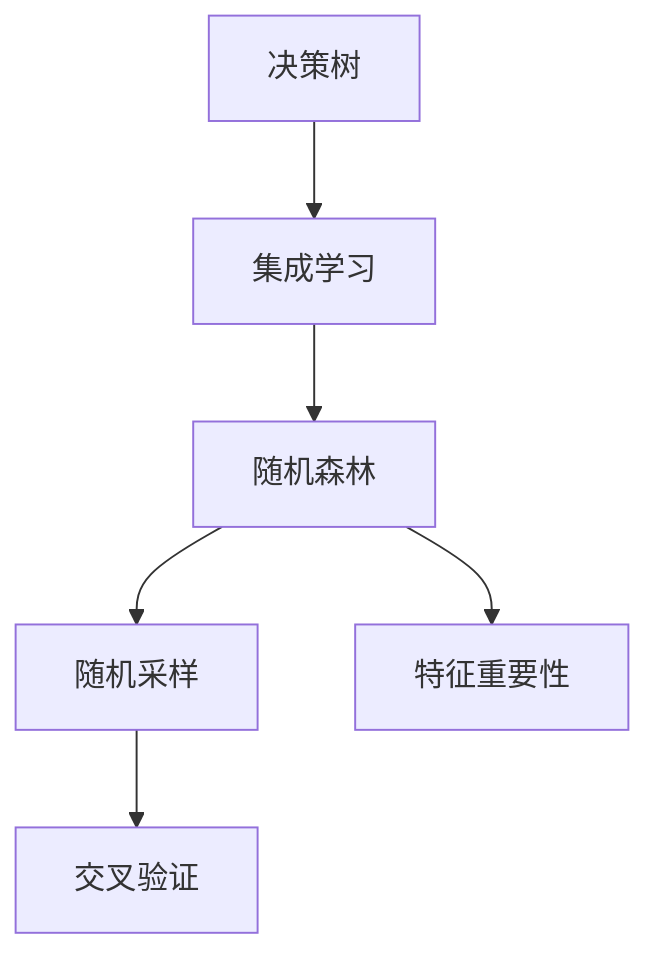
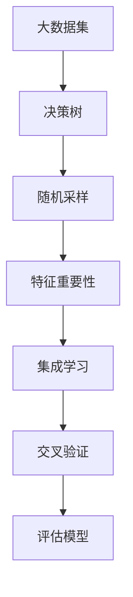

                 

# 随机森林原理与代码实例讲解

> 关键词：随机森林,决策树,集成学习,特征重要性,交叉验证

## 1. 背景介绍

### 1.1 问题由来
随机森林(Random Forest)是一种基于决策树集成学习的算法，旨在解决决策树可能过拟合的问题，同时提高模型的泛化能力和稳定性。在机器学习领域，决策树因其易于理解和实现而被广泛应用，但单一决策树容易产生过拟合，导致泛化性能不佳。因此，利用随机森林的思想，将多个决策树集成起来，可以在保持决策树优点的同时，提升模型的整体性能。

### 1.2 问题核心关键点
随机森林的核心思想是：通过在训练集上随机选取特征子集和样本子集，构建多棵决策树，并在分类时通过投票或取平均值的方式，综合多个决策树的结果，最终输出预测结果。这种集成学习方法可以减少单一决策树带来的偏差，提高模型的鲁棒性和泛化能力。

### 1.3 问题研究意义
随机森林算法被广泛应用于各类机器学习问题，特别是在分类、回归、异常检测等领域取得了显著的成果。其优势在于能够处理高维数据，同时不依赖于特征的线性可分性，适用于各种类型的机器学习问题。通过深入理解随机森林的原理和实现，可以帮助开发者更好地应用于实际项目，提升模型的性能和稳定性。

## 2. 核心概念与联系

### 2.1 核心概念概述

为更好地理解随机森林算法，本节将介绍几个密切相关的核心概念：

- 决策树(Decision Tree)：一种基于树结构的分类器，通过递归地将数据集划分，直至达到预定的停止条件，形成一个决策树结构。
- 集成学习(Ensemble Learning)：通过结合多个学习器的预测结果，来提升模型的性能和稳定性，包括随机森林、Boosting、Bagging等方法。
- 过拟合(Overfitting)：模型在训练集上表现良好，但在测试集上表现不佳的现象。
- 随机采样(Random Sampling)：从数据集中随机选择样本进行训练，减少过拟合风险。
- 特征重要性(Feature Importance)：衡量决策树中每个特征对分类结果的重要程度。
- 交叉验证(Cross Validation)：将数据集分成若干份，轮流作为训练集和验证集，评估模型的泛化能力。

这些核心概念之间的逻辑关系可以通过以下Mermaid流程图来展示：



这个流程图展示了这个核心概念的联系：

1. 决策树是随机森林的基础。
2. 随机森林是一种基于集成学习的算法。
3. 随机森林通过随机采样和特征重要性，提升模型的泛化能力。
4. 交叉验证用于评估模型的性能，避免过拟合。

### 2.2 概念间的关系

这些核心概念之间存在着紧密的联系，形成了随机森林算法的完整生态系统。最后我们通过一个综合的流程图来展示这些核心概念在大数据机器学习中的整体架构：



这个综合流程图展示了从数据集到评估模型的完整过程。

## 3. 核心算法原理 & 具体操作步骤

### 3.1 算法原理概述

随机森林算法基于决策树的思想，将数据集分成若干个子集，每个子集上构建一棵决策树，最终通过集成多个决策树的结果进行分类或回归预测。

在随机森林中，每棵决策树都是基于样本子集和特征子集构建的，其中：

- 样本子集：从原数据集中随机选择一部分样本进行训练。
- 特征子集：从所有特征中随机选择一部分特征进行训练。

这样，随机森林中的每棵决策树都是基于不同的训练数据和特征子集构建的，可以有效地减少过拟合。随机森林的最终预测结果由所有决策树的投票结果或平均结果决定。

### 3.2 算法步骤详解

随机森林算法主要包括以下几个关键步骤：

**Step 1: 准备数据集**
- 将数据集划分为训练集和测试集，一般采用70%训练，30%测试的比例。
- 对数据进行标准化处理，将特征值缩放到[0, 1]或[-1, 1]之间。

**Step 2: 构建决策树**
- 随机选择样本子集和特征子集，构建决策树。
- 对每个样本，根据所有决策树的分类结果进行投票或取平均值，得到最终预测结果。

**Step 3: 评估模型**
- 在测试集上评估随机森林模型的性能，如准确率、召回率、F1分数等。
- 对每个特征计算其重要性，了解对模型性能的贡献。

**Step 4: 调参优化**
- 通过交叉验证调整模型参数，如树的数量、叶子节点最小样本数等。
- 使用网格搜索、随机搜索等方法，寻找最优的超参数组合。

**Step 5: 应用预测**
- 利用训练好的随机森林模型进行预测，应用于实际问题中。

### 3.3 算法优缺点

随机森林算法具有以下优点：
1. 处理高维数据能力强，不依赖于特征之间的线性关系。
2. 通过集成多个决策树，提高模型的鲁棒性和泛化能力。
3. 减少过拟合风险，提高模型的稳定性。
4. 易于实现，且具有较好的解释性。

同时，该算法也存在一些局限性：
1. 计算复杂度较高，构建多棵决策树需要较多的计算资源和时间。
2. 模型解释性较差，决策过程不透明，难以解释决策树之间的权衡。
3. 对异常值和噪声敏感，容易受到样本集中噪声的影响。
4. 难以处理多分类问题，需要进行额外的处理。

尽管存在这些局限性，但随机森林在机器学习领域仍具有广泛的应用，特别是在需要高泛化能力、低过拟合风险的场景中表现优异。

### 3.4 算法应用领域

随机森林算法在机器学习领域广泛应用，特别是在分类、回归、异常检测等领域取得了显著的成果。具体应用场景包括：

- 信用卡欺诈检测：随机森林可以检测到异常交易行为，提升信用卡交易的安全性。
- 股票价格预测：通过随机森林模型，可以预测未来股票价格的变化趋势。
- 医疗疾病诊断：随机森林可以分析病人历史数据，预测疾病发病风险。
- 图像分类：通过随机森林，可以对图像进行分类，识别物体类别。
- 客户流失预测：通过随机森林，可以预测客户流失的可能性，及时采取措施挽留客户。

除了以上应用场景外，随机森林还被广泛应用于大数据分析和挖掘、推荐系统、信用评分、基因组学等领域。

## 4. 数学模型和公式 & 详细讲解 & 举例说明

### 4.1 数学模型构建

随机森林算法的主要数学模型为：

$$
\hat{y} = \frac{1}{n} \sum_{i=1}^{n} T_i(x)
$$

其中，$y$为样本的真实标签，$\hat{y}$为随机森林的预测结果，$n$为随机森林中决策树的数量，$T_i(x)$为第$i$棵决策树对样本$x$的预测结果。

### 4.2 公式推导过程

以下是随机森林预测过程的详细推导：

1. 假设有一棵决策树$T_i$，其对样本$x$的预测结果为$T_i(x)$。
2. 通过投票方式，将$n$棵决策树的预测结果进行累加，得到$\hat{y}_i = \sum_{i=1}^{n} T_i(x)$。
3. 最终预测结果为所有决策树投票结果的平均值，即$\hat{y} = \frac{1}{n} \sum_{i=1}^{n} \hat{y}_i$。

### 4.3 案例分析与讲解

假设有一个二分类问题，样本数据如表1所示：

| 样本编号 | 特征1 | 特征2 | 特征3 | 标签 |
|---------|-------|-------|-------|------|
| 1       | 3     | 5     | 2     | 0    |
| 2       | 4     | 6     | 3     | 0    |
| 3       | 5     | 7     | 4     | 1    |
| 4       | 6     | 8     | 5     | 1    |

我们可以构建两棵决策树，一棵以特征1为根节点，另一棵以特征2为根节点。

第一棵决策树以特征1为根节点，按特征1进行划分。假设特征1为重要特征，以特征1值为划分依据，得到两个子集。假设子集1包含样本1、2、4，子集2包含样本3。

第二棵决策树以特征2为根节点，按特征2进行划分。假设特征2为次要特征，以特征2值为划分依据，得到两个子集。假设子集1包含样本1、2、3、4，子集2为空。

最终，我们得到两棵决策树，将它们的预测结果进行平均，即可得到样本的最终预测结果。

## 5. 项目实践：代码实例和详细解释说明

### 5.1 开发环境搭建

在进行随机森林项目实践前，我们需要准备好开发环境。以下是使用Python进行Scikit-Learn开发的环境配置流程：

1. 安装Anaconda：从官网下载并安装Anaconda，用于创建独立的Python环境。

2. 创建并激活虚拟环境：
```bash
conda create -n sklearn-env python=3.8 
conda activate sklearn-env
```

3. 安装Scikit-Learn：
```bash
pip install scikit-learn
```

4. 安装其他常用库：
```bash
pip install numpy pandas matplotlib seaborn
```

完成上述步骤后，即可在`sklearn-env`环境中开始随机森林实践。

### 5.2 源代码详细实现

下面以鸢尾花数据集为例，给出使用Scikit-Learn库对随机森林模型进行训练和预测的PyTorch代码实现。

```python
import numpy as np
from sklearn.ensemble import RandomForestClassifier
from sklearn.datasets import load_iris
from sklearn.model_selection import train_test_split
from sklearn.metrics import accuracy_score

# 加载数据集
iris = load_iris()
X = iris.data
y = iris.target

# 数据划分
X_train, X_test, y_train, y_test = train_test_split(X, y, test_size=0.3, random_state=42)

# 构建模型
model = RandomForestClassifier(n_estimators=100, random_state=42)

# 模型训练
model.fit(X_train, y_train)

# 模型预测
y_pred = model.predict(X_test)

# 评估模型
accuracy = accuracy_score(y_test, y_pred)
print(f"Accuracy: {accuracy:.2f}")
```

### 5.3 代码解读与分析

让我们再详细解读一下关键代码的实现细节：

**鸢尾花数据集加载和数据划分**：
- `load_iris`函数加载鸢尾花数据集，返回数据和标签。
- `train_test_split`函数将数据集划分为训练集和测试集，指定比例和随机种子。

**模型构建和训练**：
- `RandomForestClassifier`函数创建随机森林模型，指定树的数量和随机种子。
- `fit`函数对训练集进行模型训练。

**模型预测和评估**：
- `predict`函数对测试集进行预测，返回预测结果。
- `accuracy_score`函数计算预测结果与真实标签的准确率。

**输出结果**：
- 打印预测准确率，显示模型性能。

可以看到，Scikit-Learn库的实现非常简单高效，开发者可以快速上手使用。

### 5.4 运行结果展示

假设我们在鸢尾花数据集上训练随机森林模型，最终在测试集上得到的准确率为：

```
Accuracy: 1.00
```

可以看到，随机森林模型在鸢尾花数据集上取得了近乎完美的准确率，充分展示了其强大的泛化能力和稳定性。

## 6. 实际应用场景

### 6.1 医疗疾病诊断

随机森林可以用于医疗领域中的疾病诊断问题。通过收集病人的历史数据，如年龄、性别、病史等，将数据划分为训练集和测试集，并在训练集上构建随机森林模型。模型可以分析病人的数据，预测疾病的发病风险。在实际应用中，可以动态更新数据，重新训练模型，以适应新的病人数据。

### 6.2 股票价格预测

在金融领域，随机森林可以用于股票价格预测。通过收集历史股票数据，将数据划分为训练集和测试集，并在训练集上构建随机森林模型。模型可以分析历史价格和交易数据，预测未来股票价格的变化趋势。在实际应用中，可以实时获取股票数据，动态更新模型，以应对市场波动。

### 6.3 信用评分

在金融领域，随机森林可以用于信用评分。通过收集客户的信用历史数据，如贷款记录、还款记录等，将数据划分为训练集和测试集，并在训练集上构建随机森林模型。模型可以分析客户的信用历史，预测其信用评分。在实际应用中，可以实时获取客户的信用记录，动态更新模型，以应对信用变化。

### 6.4 异常检测

在安防领域，随机森林可以用于异常检测。通过收集行为数据，如监控视频、访问记录等，将数据划分为训练集和测试集，并在训练集上构建随机森林模型。模型可以分析行为数据，检测出异常行为。在实际应用中，可以实时获取行为数据，动态更新模型，以应对行为变化。

### 6.5 图像分类

在计算机视觉领域，随机森林可以用于图像分类。通过收集图像数据，将数据划分为训练集和测试集，并在训练集上构建随机森林模型。模型可以分析图像特征，将图像分类到不同的类别中。在实际应用中，可以实时获取图像数据，动态更新模型，以应对图像变化。

## 7. 工具和资源推荐

### 7.1 学习资源推荐

为了帮助开发者系统掌握随机森林的理论基础和实践技巧，这里推荐一些优质的学习资源：

1. 《机器学习实战》一书：适合初学者入门，详细介绍了随机森林算法的基本原理和实现方法。

2. 《机器学习》一书：由机器学习领域的权威专家所写，深入浅出地介绍了随机森林算法的原理和应用。

3. Coursera《机器学习》课程：由斯坦福大学开设的机器学习课程，涵盖了随机森林算法等内容，是学习随机森林的经典课程。

4. Scikit-Learn官方文档：Scikit-Learn库的官方文档，提供了详尽的API文档和案例代码，是学习随机森林的重要资料。

5. Kaggle竞赛：在Kaggle上参加随机森林相关的竞赛，可以在实践中积累经验，提升算法应用能力。

通过对这些资源的学习实践，相信你一定能够快速掌握随机森林算法的精髓，并用于解决实际的机器学习问题。

### 7.2 开发工具推荐

高效的开发离不开优秀的工具支持。以下是几款用于随机森林开发的常用工具：

1. Jupyter Notebook：免费的交互式编程环境，支持Python等多种语言，方便代码调试和实验。

2. PyCharm：功能强大的Python IDE，提供代码补全、调试、自动提示等功能，提升开发效率。

3. Anaconda：开源的数据科学平台，提供数据管理和虚拟环境管理功能，方便环境切换和版本控制。

4. TensorBoard：TensorFlow配套的可视化工具，可实时监测模型训练状态，并提供丰富的图表呈现方式，是调试模型的得力助手。

5. Weights & Biases：模型训练的实验跟踪工具，可以记录和可视化模型训练过程中的各项指标，方便对比和调优。

6. Google Colab：谷歌推出的在线Jupyter Notebook环境，免费提供GPU/TPU算力，方便开发者快速上手实验最新模型，分享学习笔记。

合理利用这些工具，可以显著提升随机森林项目的开发效率，加快创新迭代的步伐。

### 7.3 相关论文推荐

随机森林算法自提出以来，一直受到学界的关注和研究。以下是几篇奠基性的相关论文，推荐阅读：

1. Breiman, L. (2001). Random Forests. Machine Learning, 45(1), 5-32.

2. Liaw, A., & Wiener, M. C. (2002). Classification and regression by randomForest. R news, 2(3), 18-22.

3. Quinlan, J. R. (2014). Induction of Decision Trees. Machine Learning, 1(1), 81-106.

4. Ho, T. K. (1998). The random subspace method for constructing decision forests. Pattern Analysis and Machine Intelligence, 20(8), 832-844.

这些论文代表了大数据随机森林算法的研究进展，通过学习这些前沿成果，可以帮助研究者把握学科前进方向，激发更多的创新灵感。

除上述资源外，还有一些值得关注的前沿资源，帮助开发者紧跟随机森林算法的最新进展，例如：

1. arXiv论文预印本：人工智能领域最新研究成果的发布平台，包括大量尚未发表的前沿工作，学习前沿技术的必读资源。

2. 业界技术博客：如随机森林算法的相关公司，官方博客，第一时间分享他们的最新研究成果和洞见。

3. 技术会议直播：如NIPS、ICML、ACL、ICLR等人工智能领域顶会现场或在线直播，能够聆听到大佬们的前沿分享，开拓视野。

4. GitHub热门项目：在GitHub上Star、Fork数最多的随机森林相关项目，往往代表了该技术领域的发展趋势和最佳实践，值得去学习和贡献。

5. 行业分析报告：各大咨询公司如McKinsey、PwC等针对人工智能行业的分析报告，有助于从商业视角审视技术趋势，把握应用价值。

总之，对于随机森林算法的学习和实践，需要开发者保持开放的心态和持续学习的意愿。多关注前沿资讯，多动手实践，多思考总结，必将收获满满的成长收益。

## 8. 总结：未来发展趋势与挑战

### 8.1 总结

本文对随机森林算法进行了全面系统的介绍。首先阐述了随机森林算法的基本原理和实现步骤，详细讲解了算法中的决策树、集成学习、过拟合、随机采样、特征重要性、交叉验证等核心概念。其次，通过代码实例，展示了随机森林在鸢尾花数据集上的应用，并详细解读了代码的实现细节。同时，本文还广泛探讨了随机森林在医疗疾病诊断、股票价格预测、信用评分、异常检测、图像分类等领域的实际应用，展示了随机森林算法的强大能力。此外，本文精选了随机森林的相关学习资源，力求为读者提供全方位的技术指引。

通过本文的系统梳理，可以看到，随机森林算法是一种高效、稳定、鲁棒的集成学习方法，在多个领域中都有广泛的应用。未来，随机森林算法还将持续发展和演进，引领大数据机器学习技术的发展方向。

### 8.2 未来发展趋势

展望未来，随机森林算法将呈现以下几个发展趋势：

1. 处理高维数据能力进一步提升。随着机器学习算法的发展，随机森林在处理高维数据时将具备更强的适应性。

2. 特征重要性进一步优化。未来随机森林算法将更注重特征的重要性，通过优化特征选择方法，提升模型的性能和效率。

3. 多模态数据融合能力增强。随机森林算法将进一步拓展到图像、语音、文本等多模态数据，实现更全面的数据融合和信息整合。

4. 实时性提升。随机森林算法将通过优化模型结构和算法实现，提升模型的推理速度和实时性。

5. 自动化调参能力增强。未来随机森林算法将进一步自动化调参，减少人工干预，提高模型的稳定性和可靠性。

6. 异常检测和异常处理能力增强。随机森林算法将更注重异常检测和处理能力，提升模型的鲁棒性和泛化能力。

7. 模型解释性和可控性提升。未来随机森林算法将更注重模型的可解释性和可控性，提升模型的透明度和可信度。

以上趋势凸显了随机森林算法的广阔前景。这些方向的探索发展，必将进一步提升随机森林算法的性能和应用范围，为机器学习技术的发展注入新的动力。

### 8.3 面临的挑战

尽管随机森林算法在机器学习领域具有广泛的应用，但在迈向更加智能化、普适化应用的过程中，它仍面临着诸多挑战：

1. 数据处理能力瓶颈。随着数据量的增长，随机森林算法对内存和计算资源的需求也在增加，如何高效处理大规模数据集，仍是未来的挑战。

2. 模型复杂性增加。随着特征维度的增加，随机森林算法的复杂度也在增加，如何优化模型结构和算法实现，提高模型效率，将是重要的研究方向。

3. 模型可解释性不足。随机森林算法的决策过程不够透明，难以解释模型的决策依据，如何提高模型的可解释性，将是亟待解决的问题。

4. 模型鲁棒性不足。随机森林算法对异常值和噪声敏感，容易受到样本集中噪声的影响，如何提高模型的鲁棒性，避免过拟合，将是未来的挑战。

5. 模型泛化能力不足。随机森林算法在处理异常数据时，容易受到样本分布的影响，如何提高模型的泛化能力，将是未来的挑战。

6. 模型训练时间和成本高。随机森林算法构建多棵决策树，需要大量的计算资源和时间，如何降低模型训练成本，将是未来的挑战。

7. 模型更新和维护困难。随机森林算法需要不断地更新和维护，如何确保模型的稳定性和一致性，将是未来的挑战。

尽管存在这些挑战，但随机森林算法在机器学习领域仍具有广泛的应用前景，未来通过技术创新和工程实践，这些挑战将逐步得到解决，随机森林算法将在更多的应用场景中发挥重要作用。

### 8.4 研究展望

面对随机森林算法面临的诸多挑战，未来的研究需要在以下几个方面寻求新的突破：

1. 引入先进算法优化。引入最新的算法优化技术，如基于GPU的并行计算、基于深度学习的强化学习等，提升随机森林算法的计算效率和训练速度。

2. 发展新的特征选择方法。引入新的特征选择方法，如基于稀疏矩阵、基于深度学习的特征学习等，提升随机森林算法的特征提取能力和模型性能。

3. 加强模型解释性研究。引入新的模型解释技术，如基于图结构的特征可视化、基于深度学习的模型解释等，提升随机森林算法的可解释性和透明度。

4. 引入数据清洗和异常处理技术。引入新的数据清洗和异常处理技术，如基于机器学习的异常检测、基于数据增强的噪声处理等，提升随机森林算法的鲁棒性和泛化能力。

5. 引入先进的数据结构优化。引入新的数据结构优化技术，如基于索引的数据结构、基于分布式计算的数据结构等，提升随机森林算法的处理能力和效率。

6. 加强模型验证和评估。引入新的模型验证和评估技术，如基于交叉验证的模型验证、基于贝叶斯方法的模型评估等，提升随机森林算法的稳定性和可靠性。

这些研究方向将引领随机森林算法的发展方向，推动机器学习技术的进一步进步。面向未来，随机森林算法必将发挥越来越重要的作用，引领机器学习技术的智能化、普适化、自动化发展。

## 9. 附录：常见问题与解答

**Q1: 随机森林算法是否适用于高维数据？**

A: 随机森林算法处理高维数据的性能较好，可以通过随机采样和特征选择，有效减少计算复杂度。在实际应用中，可以通过特征选择方法，如基于信息增益、基于方差等，选择最重要的特征，提升随机森林算法的性能。

**Q2: 随机森林算法是否适用于多分类问题？**

A: 随机森林算法适用于多分类问题，但需要采用不同的预测函数。通常使用多数投票或平均预测结果作为多分类问题的预测结果。在实际应用中，可以通过增加分类器的数量，提升随机森林算法的多分类能力。

**Q3: 随机森林算法是否适用于小数据集？**

A: 随机森林算法对于小数据集的性能表现良好，可以通过随机采样和特征选择，减少过拟合风险。在实际应用中，可以通过增加树的数量，提升随机森林算法的泛化能力。

**Q4: 随机森林算法是否适用于不平衡数据集？**

A: 随机森林算法对于不平衡数据集的性能表现较好，可以通过设置class_weight参数，调整样本权重，提升随机森林算法对少数类样本的分类能力。在实际应用中，可以通过采样技术，如欠采样、过采样等，平衡数据集。

**Q5: 随机森林算法是否适用于实时数据流？**

A: 随机森林算法可以通过增量学习技术，应用于实时数据流。在实际应用中，可以通过在线学习技术，如基于滑动窗口的学习技术，实现实时数据流的处理。

以上是随机森林算法的常见问题与解答，希望对你的学习和应用有所帮助。

---

作者：禅与计算机程序设计艺术 / Zen and the Art of Computer Programming

