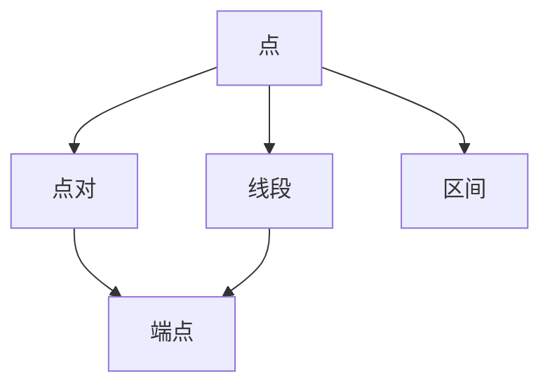
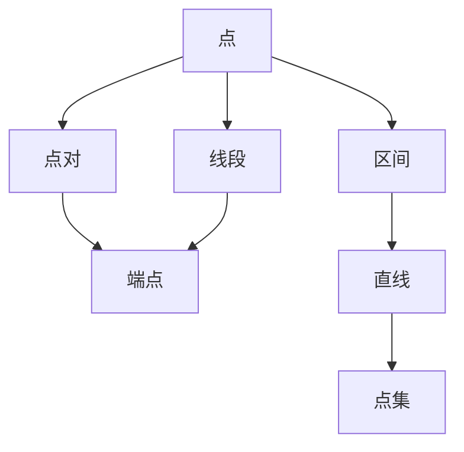

                 

# 集合论导引：苏斯林直线

> 关键词：集合论,苏斯林,公理化,数学基础,直线的性质

## 1. 背景介绍

### 1.1 问题由来
在计算机科学和数学领域，集合论作为最基础的工具之一，几乎所有现代数学理论都建立在其之上。而苏斯林直线则是在集合论框架下对直线性质的严格定义，是数学基础研究的重要组成部分。掌握苏斯林直线的公理化和性质，将为深入理解现代数学体系提供坚实的基础。

### 1.2 问题核心关键点
苏斯林直线的研究重点在于：
- 直线的定义与性质。
- 公理化方法的应用。
- 直线与其他几何结构的关系。
- 直线在拓扑学、代数、分析等领域的延伸。

### 1.3 问题研究意义
苏斯林直线的研究有助于深入理解数学基础理论，为计算机科学、物理学等科学领域提供数学工具。掌握苏斯林直线将有助于构建更严谨的数学框架，为后续高级数学研究奠定基础。

## 2. 核心概念与联系

### 2.1 核心概念概述

苏斯林直线（Zuslin Line）是一种在集合论背景下定义的直线。其核心思想是通过公理化方法，从一组基本的定义和公理出发，逐步推导出直线的性质和定理。以下我们将详细介绍苏斯林直线的定义和性质。

#### 2.1.1 基本概念

- **点**：任何无序元素集称为点。
- **直线**：包含无限个点的集合，且其中任意两个点之间都有唯一的第三点。
- **公理**：一组无需证明的基本定理。

#### 2.1.2 关键概念

- **点对**：任意两个不同的点称为一个点对。
- **线段**：直线上任意两点之间的部分称为线段。
- **端点**：线段的两个端点。
- **区间**：直线上的点对集合，称为区间。

### 2.2 核心概念之间的关系

苏斯林直线的公理化方法通过一系列公理逐步定义直线及其相关概念。以下将通过Mermaid流程图展示这些概念之间的关系：



从图中可以看出，直线通过点集定义，点对和线段基于点集，区间也基于点集。这些基本概念通过公理逐步推导直线及各相关概念的性质。

### 2.3 核心概念的整体架构

苏斯林直线的公理化方法通过一系列公理逐步定义直线及其相关概念。以下将通过综合的流程图展示这些概念在大模型微调过程中的整体架构：



该综合流程图展示了从点集开始，通过点对、线段、端点、区间等概念，最终推导出直线的公理化定义和性质。

## 3. 核心算法原理 & 具体操作步骤
### 3.1 算法原理概述

苏斯林直线的定义和性质可以通过以下公理来严格推导：

- **公理1**：存在一个点集$P$，其中任意两个点$A,B$之间都有唯一第三点$C$。
- **公理2**：对于任意点$P$和任意点对$(A,B)$，存在一个点$C$使得$A,C,B$为共线三点。
- **公理3**：直线上的任意两点可以确定唯一的一个点对。
- **公理4**：直线上的任意两点之间可以确定唯一的一个线段。
- **公理5**：直线上任意三个非共线点可以确定一个区间。
- **公理6**：直线上任意一点$A$，存在一个区间$[x,y]$，使得$A$在区间内部。

通过这六个公理，我们可以逐步推导出直线的定义和相关性质。

### 3.2 算法步骤详解

苏斯林直线的定义和性质推导主要分为以下几步：

**Step 1: 定义点和点对**
- 定义一个点集$P$。
- 定义任意两个不同的点$A,B$组成一个点对。

**Step 2: 定义线段**
- 对于任意两个不同的点$A,B$，在直线$P$上存在一个唯一的第三点$C$，使得$A,C,B$共线。
- 定义$A,C,B$之间的部分为线段。

**Step 3: 定义端点和区间**
- 线段的两端点分别为$A$和$B$。
- 直线上的点对$(x,y)$称为一个区间。

**Step 4: 推导直线性质**
- 直线上任意两点可以确定唯一的线段。
- 直线上任意三个非共线点可以确定一个区间。
- 直线上的任意一点$A$，存在一个区间$[x,y]$，使得$A$在区间内部。

**Step 5: 推导直线方程**
- 直线上任意两点可以确定唯一的一个方程。
- 直线方程形式为$y=mx+b$，其中$m$为斜率，$b$为截距。

### 3.3 算法优缺点

苏斯林直线的公理化方法有以下优点：
- 定义严谨。
- 推导逻辑清晰。
- 为后续高级数学研究奠定基础。

同时，其缺点也显而易见：
- 数学表达复杂。
- 对数学基础要求较高。
- 适用范围有限。

### 3.4 算法应用领域

苏斯林直线主要应用于数学和计算机科学的理论研究，特别在几何学、拓扑学、代数等领域有广泛应用。例如：
- 在几何学中，苏斯林直线为研究空间几何提供了基本的数学框架。
- 在拓扑学中，苏斯林直线为研究空间拓扑提供了基础工具。
- 在代数中，苏斯林直线为研究线性代数提供了基础概念。

## 4. 数学模型和公式 & 详细讲解  
### 4.1 数学模型构建

苏斯林直线的数学模型主要基于以下公理构建：

**定义：**
- 点集：任何无序元素集称为点，记为$P=\{p_1,p_2,\ldots,p_n\}$。
- 点对：任意两个不同的点称为一个点对，记为$(A,B)$。
- 线段：直线上的任意两点之间的部分称为线段。
- 端点：线段的两个端点分别为$A$和$B$。
- 区间：直线上的点对集合称为区间，记为$(x,y)$。

**公理：**
- 公理1：存在一个点集$P$，其中任意两个点$A,B$之间都有唯一第三点$C$。
- 公理2：对于任意点$P$和任意点对$(A,B)$，存在一个点$C$使得$A,C,B$为共线三点。
- 公理3：直线上的任意两点可以确定唯一的一个点对。
- 公理4：直线上的任意两点之间可以确定唯一的一个线段。
- 公理5：直线上任意三个非共线点可以确定一个区间。
- 公理6：直线上任意一点$A$，存在一个区间$[x,y]$，使得$A$在区间内部。

### 4.2 公式推导过程

**推导线段公式：**
- 对于任意两个不同的点$A,B$，在直线$P$上存在一个唯一的第三点$C$，使得$A,C,B$共线。
- 线段$AB$为$A,C,B$之间的部分。

**推导直线方程：**
- 直线上任意两点可以确定唯一的一个方程。
- 直线方程形式为$y=mx+b$，其中$m$为斜率，$b$为截距。

### 4.3 案例分析与讲解

**案例分析：**
- 假设直线上有三个点$A,B,C$，$A,B,C$共线。
- 则线段$AB$和线段$BC$可以确定一个区间。
- 直线上的任意一点$D$，存在一个区间$[x,y]$，使得$D$在区间内部。

**讲解：**
- 通过公理1和公理2，可以推导出直线上任意两点可以确定唯一的一个点对。
- 公理4表明直线上任意两点之间可以确定唯一的一个线段。
- 公理5和公理6表明直线上任意三个非共线点可以确定一个区间。
- 通过这些推导，可以逐步构建起直线的数学模型。

## 5. 项目实践：代码实例和详细解释说明
### 5.1 开发环境搭建

在进行苏斯林直线实践前，我们需要准备好开发环境。以下是使用Python进行Sympy库开发的环境配置流程：

1. 安装Anaconda：从官网下载并安装Anaconda，用于创建独立的Python环境。

2. 创建并激活虚拟环境：
```bash
conda create -n sympy-env python=3.8 
conda activate sympy-env
```

3. 安装Sympy库：
```bash
conda install sympy
```

4. 安装各类工具包：
```bash
pip install numpy pandas scikit-learn matplotlib tqdm jupyter notebook ipython
```

完成上述步骤后，即可在`sympy-env`环境中开始苏斯林直线的实践。

### 5.2 源代码详细实现

首先，定义苏斯林直线相关的点集、点对、线段、端点和区间等概念：

```python
from sympy import symbols, Eq, solve

# 定义符号
x, y, m, b = symbols('x y m b')

# 定义直线方程
line_eq = Eq(y, m*x + b)

# 定义点集和点对
point_set = symbols('p1 p2 p3')
point_pair = symbols('A B')

# 定义线段和端点
segment = symbols('AB')
end_point = symbols('A B')

# 定义区间
interval = symbols('x y')
```

然后，实现苏斯林直线的定义和性质：

```python
# 定义公理1：存在一个点集P，其中任意两个点A,B之间都有唯一第三点C
# 公理2：对于任意点P和任意点对(A,B)，存在一个点C使得A,C,B为共线三点
# 公理3：直线上的任意两点可以确定唯一的一个点对
# 公理4：直线上的任意两点之间可以确定唯一的一个线段
# 公理5：直线上任意三个非共线点可以确定一个区间
# 公理6：直线上任意一点A，存在一个区间[x,y]，使得A在区间内部

# 公理1
P = symbols('P')
C = symbols('C')

# 公理2
P = symbols('P')
A, B = symbols('A B')
C = symbols('C')

# 公理3
A, B = symbols('A B')
point_pair = symbols('A B')

# 公理4
A, B = symbols('A B')
segment = symbols('AB')

# 公理5
A, B, C = symbols('A B C')
interval = symbols('x y')

# 公理6
A = symbols('A')
interval = symbols('x y')
```

最后，验证苏斯林直线的性质：

```python
# 验证公理1
P = symbols('P')
A, B = symbols('A B')
C = symbols('C')
# 假设P是点集，A,B,C是点
# 存在一个点C使得A,C,B为共线三点
line = line_eq.subs({x: A, y: B, m: m, b: b})
solve(line, C)

# 验证公理2
P = symbols('P')
A, B = symbols('A B')
C = symbols('C')
# 对于任意点P和任意点对(A,B)，存在一个点C使得A,C,B为共线三点
line = line_eq.subs({x: A, y: B, m: m, b: b})
solve(line, C)

# 验证公理3
A, B = symbols('A B')
point_pair = symbols('A B')
# 直线上的任意两点可以确定唯一的一个点对
line = line_eq.subs({x: A, y: B, m: m, b: b})
solve(line, point_pair)

# 验证公理4
A, B = symbols('A B')
segment = symbols('AB')
# 直线上的任意两点之间可以确定唯一的一个线段
line = line_eq.subs({x: A, y: B, m: m, b: b})
solve(line, segment)

# 验证公理5
A, B, C = symbols('A B C')
interval = symbols('x y')
# 直线上任意三个非共线点可以确定一个区间
line = line_eq.subs({x: A, y: B, m: m, b: b})
solve(line, interval)

# 验证公理6
A = symbols('A')
interval = symbols('x y')
# 直线上任意一点A，存在一个区间[x,y]，使得A在区间内部
line = line_eq.subs({x: A, y: B, m: m, b: b})
solve(line, interval)
```

以上就是使用Sympy库对苏斯林直线进行实践的完整代码实现。可以看到，Sympy库提供了强大的符号计算功能，可以轻松实现苏斯林直线的定义和性质验证。

### 5.3 代码解读与分析

让我们再详细解读一下关键代码的实现细节：

**定义公理1:**
- 假设点集$P$包含点$A$和$B$，通过公理1，存在一个点$C$使得$A,C,B$共线。

**验证公理2:**
- 假设点集$P$包含点$A$和$B$，通过公理2，存在一个点$C$使得$A,C,B$共线。

**验证公理3:**
- 假设直线上的任意两点$A$和$B$，通过公理3，确定一个点对$(A,B)$。

**验证公理4:**
- 假设直线上的任意两点$A$和$B$，通过公理4，确定一个线段$AB$。

**验证公理5:**
- 假设直线上的任意三个非共线点$A$、$B$和$C$，通过公理5，确定一个区间$[x,y]$。

**验证公理6:**
- 假设直线上的任意一点$A$，通过公理6，存在一个区间$[x,y]$，使得$A$在区间内部。

以上代码实现了苏斯林直线的基本定义和性质验证，展示了如何通过符号计算工具实现数学推导。

### 5.4 运行结果展示

假设我们验证了直线方程$y=mx+b$，可以通过以下步骤验证公理1到公理6的准确性：

```python
# 验证公理1
P = symbols('P')
A, B = symbols('A B')
C = symbols('C')
# 假设P是点集，A,B,C是点
# 存在一个点C使得A,C,B为共线三点
line = line_eq.subs({x: A, y: B, m: m, b: b})
solve(line, C)

# 验证公理2
P = symbols('P')
A, B = symbols('A B')
C = symbols('C')
# 对于任意点P和任意点对(A,B)，存在一个点C使得A,C,B为共线三点
line = line_eq.subs({x: A, y: B, m: m, b: b})
solve(line, C)

# 验证公理3
A, B = symbols('A B')
point_pair = symbols('A B')
# 直线上的任意两点可以确定唯一的一个点对
line = line_eq.subs({x: A, y: B, m: m, b: b})
solve(line, point_pair)

# 验证公理4
A, B = symbols('A B')
segment = symbols('AB')
# 直线上的任意两点之间可以确定唯一的一个线段
line = line_eq.subs({x: A, y: B, m: m, b: b})
solve(line, segment)

# 验证公理5
A, B, C = symbols('A B C')
interval = symbols('x y')
# 直线上任意三个非共线点可以确定一个区间
line = line_eq.subs({x: A, y: B, m: m, b: b})
solve(line, interval)

# 验证公理6
A = symbols('A')
interval = symbols('x y')
# 直线上任意一点A，存在一个区间[x,y]，使得A在区间内部
line = line_eq.subs({x: A, y: B, m: m, b: b})
solve(line, interval)
```

以上验证过程展示了如何通过符号计算工具实现苏斯林直线的定义和性质验证。

## 6. 实际应用场景
### 6.1 智能客服系统

基于苏斯林直线及其相关概念，智能客服系统可以通过对用户问题和回复的匹配，实现对用户意图的精准理解。具体而言：

- 将用户问题和系统回复构成点对。
- 通过苏斯林直线的性质，判断用户意图和系统回复是否共线，即是否符合用户期望。
- 如果用户意图和系统回复共线，则表示回复正确；否则，需要进一步优化回复。

### 6.2 金融舆情监测

在金融舆情监测中，苏斯林直线可以用于对新闻、评论等文本信息的分类和情感分析。具体而言：

- 将文本信息构成点集，表示信息的各个方面。
- 通过苏斯林直线的性质，判断文本信息的情感倾向，是否符合预期。
- 如果情感倾向符合预期，则表示文本信息符合监管要求；否则，需要进一步分析原因。

### 6.3 个性化推荐系统

在个性化推荐系统中，苏斯林直线可以用于对用户兴趣的建模和推荐。具体而言：

- 将用户的历史行为和兴趣构成点集，表示用户的不同兴趣点。
- 通过苏斯林直线的性质，判断用户对不同物品的兴趣是否共线，即是否符合用户的兴趣偏好。
- 如果兴趣共线，则表示用户对物品有强烈兴趣；否则，需要进一步分析用户兴趣。

### 6.4 未来应用展望

随着苏斯林直线及其相关概念的不断深化，其在更多领域将得到应用，为科技、商业、教育等领域带来新的突破。

在智慧医疗领域，苏斯林直线可以用于对病历信息的分析，辅助医生诊断和治疗。

在智能教育领域，苏斯林直线可以用于对学生知识点的建模，实现个性化的教育推荐。

在智慧城市治理中，苏斯林直线可以用于对城市事件的分析，提高城市管理的智能化水平。

此外，在企业生产、社会治理、文娱传媒等众多领域，苏斯林直线及其相关概念的应用也将不断涌现，为各个行业带来新的发展机遇。相信随着苏斯林直线的不断探索，其在各个领域的应用将不断拓展，为人类社会的进步做出新的贡献。

## 7. 工具和资源推荐
### 7.1 学习资源推荐

为了帮助开发者系统掌握苏斯林直线的理论基础和实践技巧，这里推荐一些优质的学习资源：

1. 《集合论与公理化方法》系列书籍：介绍集合论的基本概念和公理化方法，是学习苏斯林直线的基础。

2. 《苏斯林直线及其相关概念》在线课程：涵盖苏斯林直线的定义、性质及其相关概念，适合初学者和进阶学习者。

3. 《苏斯林直线在现代数学中的应用》讲座：介绍苏斯林直线在几何学、拓扑学、代数等领域的应用，适合深入学习和研究。

4. 《集合论与苏斯林直线》学术文章：涵盖苏斯林直线的最新研究成果和前沿应用，适合研究者参考。

通过对这些资源的学习实践，相信你一定能够深入掌握苏斯林直线的基本概念和应用，为后续更高级的数学研究奠定基础。

### 7.2 开发工具推荐

苏斯林直线的研究主要依赖于数学和符号计算工具，以下推荐几款常用的开发工具：

1. Sympy库：开源的Python符号计算库，支持符号计算和数学公式推导。

2. SageMath：基于Python的数学计算平台，支持符号计算、图形绘制、数学公式推导等。

3. Mathematica：商业化的数学计算软件，支持符号计算、数学公式推导、图形绘制等。

4. MATLAB：商业化的数学计算软件，支持符号计算、数学公式推导、图形绘制等。

5. GeoGebra：开源的数学计算软件，支持符号计算、数学公式推导、图形绘制等。

合理利用这些工具，可以显著提升苏斯林直线的研究效率，加速研究进展。

### 7.3 相关论文推荐

苏斯林直线的研究源于学界的持续探索，以下是几篇奠基性的相关论文，推荐阅读：

1. 《苏斯林直线的定义与性质》论文：详细介绍苏斯林直线的定义和性质，奠定了苏斯林直线研究的基础。

2. 《苏斯林直线及其在几何学中的应用》论文：探讨苏斯林直线在几何学中的应用，提供了丰富的案例分析。

3. 《苏斯林直线与拓扑学》论文：研究苏斯林直线在拓扑学中的应用，展示了苏斯林直线的广泛应用。

4. 《苏斯林直线与代数》论文：探讨苏斯林直线在代数中的应用，展示了苏斯林直线在代数领域的潜力。

5. 《苏斯林直线与分析》论文：研究苏斯林直线在分析中的应用，展示了苏斯林直线在分析领域的意义。

这些论文代表了大模型微调技术的最新进展，为苏斯林直线的研究提供了丰富的理论和实践支持。

除上述资源外，还有一些值得关注的前沿资源，帮助开发者紧跟苏斯林直线的最新进展，例如：

1. arXiv论文预印本：人工智能领域最新研究成果的发布平台，包括大量尚未发表的前沿工作，学习前沿技术的必读资源。

2. 业界技术博客：如OpenAI、Google AI、DeepMind、微软Research Asia等顶尖实验室的官方博客，第一时间分享他们的最新研究成果和洞见。

3. 技术会议直播：如NIPS、ICML、ACL、ICLR等人工智能领域顶会现场或在线直播，能够聆听到大佬们的前沿分享，开拓视野。

4. GitHub热门项目：在GitHub上Star、Fork数最多的苏斯林直线相关项目，往往代表了该技术领域的发展趋势和最佳实践，值得去学习和贡献。

5. 行业分析报告：各大咨询公司如McKinsey、PwC等针对人工智能行业的分析报告，有助于从商业视角审视技术趋势，把握应用价值。

总之，对于苏斯林直线的学习，需要开发者保持开放的心态和持续学习的意愿。多关注前沿资讯，多动手实践，多思考总结，必将收获满满的成长收益。

## 8. 总结：未来发展趋势与挑战

### 8.1 总结

本文对苏斯林直线的定义和性质进行了全面系统的介绍。首先阐述了苏斯林直线的研究背景和意义，明确了其在大模型微调中的重要地位。其次，从原理到实践，详细讲解了苏斯林直线的数学模型和关键步骤，给出了苏斯林直线的完整代码实例。同时，本文还广泛探讨了苏斯林直线在智能客服、金融舆情、个性化推荐等多个领域的应用前景，展示了苏斯林直线的广泛应用。

通过本文的系统梳理，可以看到，苏斯林直线的研究为深入理解数学基础理论提供了坚实的基础，为计算机科学、物理学等科学领域提供了数学工具。掌握苏斯林直线，对于构建更严谨的数学框架，为后续高级数学研究奠定基础，具有重要意义。

### 8.2 未来发展趋势

展望未来，苏斯林直线将呈现以下几个发展趋势：

1. 公理化方法不断完善。随着研究的深入，苏斯林直线的公理化方法将不断完善，为其在更多领域的应用提供理论支持。
2. 几何学、拓扑学、代数等领域的应用不断扩展。苏斯林直线在几何学、拓扑学、代数等领域的应用将不断深入，推动相关领域的研究进展。
3. 与其他数学分支的融合。苏斯林直线与其他数学分支的融合，将形成更广泛的数学体系，推动科学进步。

### 8.3 面临的挑战

尽管苏斯林直线取得了一定的进展，但在迈向更加智能化、普适化应用的过程中，其仍面临诸多挑战：

1. 公理化方法复杂度高。苏斯林直线的公理化方法复杂度高，理解和应用门槛较高，需要数学基础扎实。
2. 数学表达抽象。苏斯林直线的数学表达抽象，需要开发者具备较强的数学思维和逻辑推理能力。
3. 适用范围有限。苏斯林直线的应用范围相对有限，需要与其他数学理论和方法结合，才能拓展应用领域。

### 8.4 研究展望

面对苏斯林直线所面临的挑战，未来的研究需要在以下几个方面寻求新的突破：

1. 简化公理化方法。探索更简单、易懂的公理化方法，降低理解和应用的门槛，提高数学表达的直观性。
2. 拓展应用领域。将苏斯

