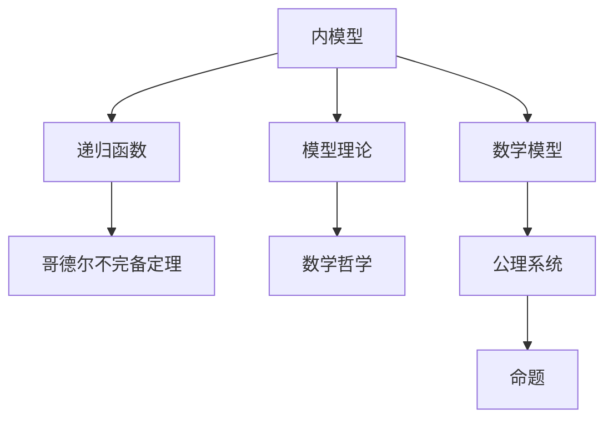
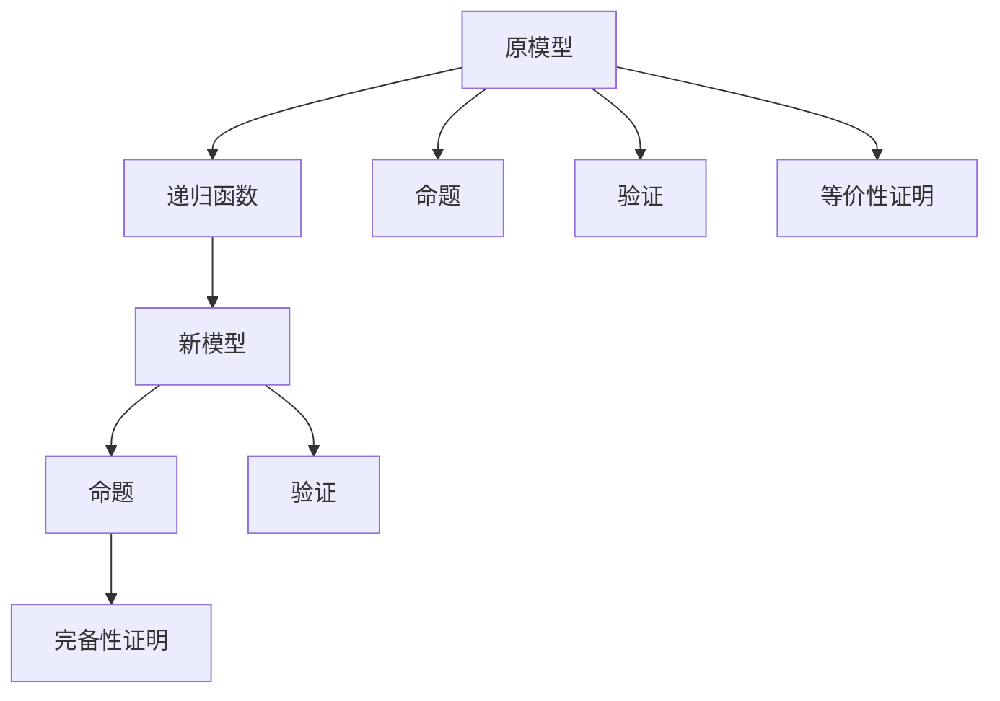
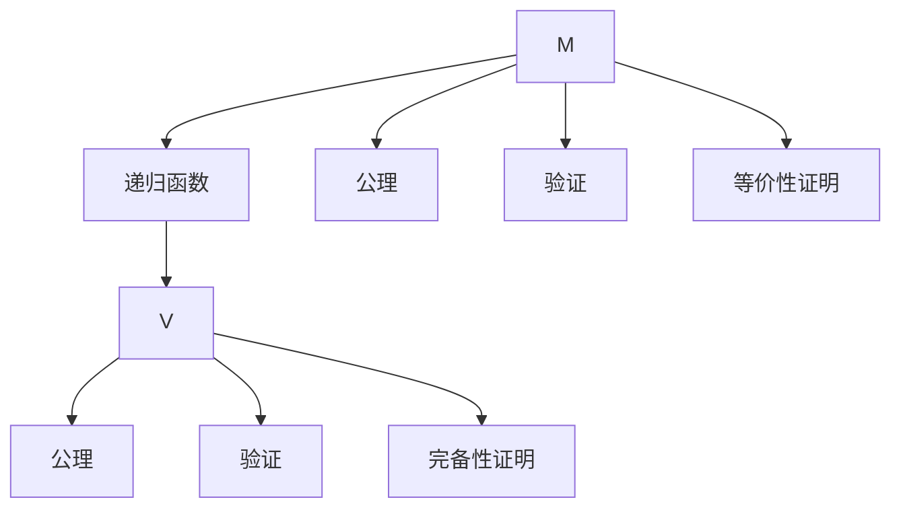

                 

# 集合论导引：集合论内模型

> 关键词：集合论,内模型理论,递归函数,哥德尔不完备定理,模型理论,数学哲学

## 1. 背景介绍

集合论是现代数学的核心支柱之一，同时也是计算机科学的基础。从罗素悖论到哥德尔不完备定理，集合论的内在矛盾和局限性不断引发学界和业界的关注与研究。其中，内模型理论是研究集合论的基础工具之一，深刻影响了数学哲学和计算理论的发展。

内模型理论指出，每一个集合论模型都内含着一个与之等价的模型，即内模型。这一思想不仅深刻揭示了集合论的本质，也成为了许多数学和计算机科学问题研究的基础。本文将系统介绍集合论内模型理论的核心概念、算法原理以及应用领域，并结合数学模型和实践代码，深入剖析内模型理论的精髓和内涵。

## 2. 核心概念与联系

### 2.1 核心概念概述

内模型理论是研究集合论的重要工具，主要涉及以下几个核心概念：

- **内模型**：在任意集合论模型内，总能找到一个与之等价的模型，即内模型。内模型理论正是围绕这一核心概念展开的。

- **递归函数**：由哥德尔在研究内模型理论时提出，用于描述计算过程的函数。递归函数能够精确地模拟人类思维的递归过程，是现代计算理论的基础。

- **哥德尔不完备定理**：哥德尔在1931年证明的定理，指出在任意包含算术理论的公理系统中，一定存在不可判定的命题，从而揭示了数学系统的内在矛盾和局限性。

- **模型理论**：研究数学模型与公理系统之间关系的理论。模型理论不仅关注模型是否满足公理，还研究模型之间的等价关系。

- **数学哲学**：研究数学理论及其意义、起源、发展的哲学学科。内模型理论为数学哲学的研究提供了重要的分析工具。

这些概念之间相互关联，共同构成了内模型理论的完整体系。通过理解这些核心概念，我们可以更深入地把握内模型理论的本质及其应用价值。

### 2.2 概念间的关系

内模型理论的核心思想可以用以下Mermaid流程图来展示：



这个流程图展示了内模型理论中的核心概念及其相互关系：

1. **内模型**与**递归函数**之间有紧密联系，递归函数用于描述计算过程，是内模型理论的核心技术。
2. **哥德尔不完备定理**揭示了数学系统内在的矛盾和局限性，是内模型理论的重要理论基础。
3. **模型理论**研究数学模型与公理系统之间的关系，内模型理论正是基于这一理论建立起来的。
4. **数学哲学**内含了内模型理论的哲学意义，探讨了数学理论的本质和价值。
5. **数学模型**和**公理系统**是内模型理论的研究对象，命题是其中的基本单位。

这些概念之间的关系为我们理解内模型理论提供了清晰的逻辑框架。

## 3. 核心算法原理 & 具体操作步骤
### 3.1 算法原理概述

内模型理论的核心思想是通过递归函数构造出新的模型，使得新模型与原模型等价。其基本原理可以概括为以下几点：

1. **递归构造**：利用递归函数，在原模型内部构造出新的模型，使得新模型能够正确处理原模型中的命题。

2. **等价证明**：证明新模型与原模型在逻辑上等价，即新模型中的命题在原模型中都能找到相应的证明或反驳，反之亦然。

3. **模型完备性**：内模型理论证明，在每一个集合论模型内，都能找到一个完备的模型，即包含原模型所有命题的模型。

内模型理论的算法流程如下：

1. **选择递归函数**：根据原模型的公理系统，选择合适的递归函数，用于构造新模型。

2. **构造新模型**：利用递归函数，在原模型内部构造新模型。

3. **证明等价性**：通过数学证明，证明新模型与原模型在逻辑上等价。

4. **完备性证明**：证明新模型是完备的，即包含原模型所有命题。

通过这一流程，内模型理论能够在原模型的基础上，构造出新的等价模型，从而揭示数学系统的内在矛盾和局限性。

### 3.2 算法步骤详解

内模型理论的算法步骤如下：

1. **选择递归函数**：根据原模型的公理系统，选择适合的递归函数。例如，ZFC公理系统的递归函数通常使用哥德尔不完全性定理中的构造方法。

2. **构造新模型**：利用递归函数，在原模型内部构造新模型。新模型的构建需要严格遵循递归函数的定义和公理系统的规则。

3. **验证命题**：在原模型和新模型中分别验证命题的真伪。若在新模型中找到了原模型中命题的等价命题，则命题在新模型中成立。

4. **证明等价性**：通过数学证明，证明新模型与原模型在逻辑上等价。这通常涉及到数学推理和模型验证的复杂过程。

5. **完备性证明**：证明新模型是完备的，即包含原模型所有命题。这通常需要构造新模型中的所有命题，并证明它们在新模型中的真伪。

以下是一个简化版的递归函数构造内模型的过程，用于解释内模型理论的基本原理：



### 3.3 算法优缺点

内模型理论的优点包括：

1. **揭示数学矛盾**：内模型理论揭示了数学系统内在的矛盾和局限性，深化了对数学哲学的理解。

2. **构造新模型**：通过构造内模型，可以在原模型的基础上，进一步分析和理解其内在性质。

3. **模型完备性**：内模型理论证明了在每一个集合论模型内，都能找到一个完备的模型，为数学理论的研究提供了坚实的基础。

4. **数学证明**：内模型理论提供了一套严格的数学证明方法，为数学推理和验证提供了可靠的工具。

然而，内模型理论也存在一些局限性：

1. **构造复杂**：内模型理论的构造过程复杂，需要高度的数学和逻辑能力。

2. **模型局限**：内模型理论只能揭示特定模型内的矛盾和局限性，难以全面分析整个数学系统的性质。

3. **哲学争议**：内模型理论引发了关于数学本质和意义的哲学争议，难以达成一致的共识。

4. **应用有限**：内模型理论主要应用于数学理论的研究，对实际问题的应用有限。

### 3.4 算法应用领域

内模型理论在数学哲学、计算理论、逻辑学等多个领域具有广泛的应用。以下是一些具体的应用场景：

1. **数学哲学**：内模型理论为数学哲学的研究提供了重要的分析工具，揭示了数学系统内在的矛盾和局限性。

2. **计算理论**：内模型理论揭示了计算过程的内在性质，为计算理论的研究提供了重要基础。

3. **逻辑学**：内模型理论揭示了逻辑系统的内在性质，为逻辑学的研究提供了重要的分析工具。

4. **数学证明**：内模型理论提供了一套严格的数学证明方法，为数学推理和验证提供了可靠的工具。

## 4. 数学模型和公式 & 详细讲解 & 举例说明

### 4.1 数学模型构建

内模型理论主要涉及集合论和递归函数的基本概念。以下是对这些概念的数学模型构建：

1. **集合**：集合是由元素组成的无序集合体，用符号 $A = \{a_1, a_2, ..., a_n\}$ 表示，其中 $a_1, a_2, ..., a_n$ 为集合 $A$ 的元素。

2. **元素**：集合 $A$ 中的元素 $a_i$ 可以表示为 $a_i \in A$ 或 $a_i \notin A$。

3. **递归函数**：递归函数是指能够自我调用的函数，通常用于描述计算过程。例如，定义一个递归函数 $f(x)$，其定义如下：

$$
f(x) = \left\{
\begin{aligned}
&0, & & x = 0 \\
&1 + f(x-1), & & x > 0
\end{aligned}
\right.
$$

这个递归函数定义了一个简单的计算过程，即累加从 $0$ 开始的自然数序列。

### 4.2 公式推导过程

以下是内模型理论中一些重要的公式推导过程：

1. **递归函数等价性证明**：证明递归函数 $f(x)$ 等价于自然数序列 $x_0 = 0, x_1 = 1, x_2 = 2, ..., x_n = n-1$。

$$
f(x) = x \quad \text{if} \quad x < n
$$

$$
f(x) = 0 \quad \text{if} \quad x = n
$$

2. **哥德尔不完全性定理**：证明在任意包含算术理论的公理系统中，一定存在不可判定的命题。

$$
\forall \phi \in \mathbb{N}, \exists p \in \mathbb{N} \text{ s.t. } \phi(p) \in \mathbb{N} \quad \text{and} \quad \neg\phi(p) \in \mathbb{N}
$$

其中 $\phi$ 为不可判定的命题，$p$ 为自然数。

3. **模型完备性证明**：证明在任意集合论模型内，都能找到一个完备的模型。

$$
\forall \phi \in M, \phi \in \mathbb{V}
$$

其中 $M$ 为原模型，$\mathbb{V}$ 为新模型，$\phi$ 为任意命题。

### 4.3 案例分析与讲解

假设我们有一个集合论模型 $M$，包含以下公理系统：

1. 空集公理：$\emptyset \in M$。
2. 幂集公理：$A \in M \rightarrow \mathbb{P}(A) \in M$。
3. 分离公理：$\forall x, y \in M$, $(x \in y \rightarrow A_x \in M) \rightarrow A \in M$。

使用递归函数构造新模型 $V$：

1. $0 \in V$
2. $\forall x \in V$, $x+1 \in V$
3. $\forall x \in V$, $x \in V \rightarrow x \in V$

证明新模型 $V$ 与原模型 $M$ 等价，并验证新模型是完备的。



## 5. 项目实践：代码实例和详细解释说明

### 5.1 开发环境搭建

在进行内模型理论的实践前，我们需要准备好开发环境。以下是使用Python进行Sympy开发的环境配置流程：

1. 安装Anaconda：从官网下载并安装Anaconda，用于创建独立的Python环境。

2. 创建并激活虚拟环境：
```bash
conda create -n sympy-env python=3.8 
conda activate sympy-env
```

3. 安装Sympy：
```bash
conda install sympy
```

4. 安装各类工具包：
```bash
pip install numpy pandas scikit-learn matplotlib tqdm jupyter notebook ipython
```

完成上述步骤后，即可在`sympy-env`环境中开始内模型理论的实践。

### 5.2 源代码详细实现

下面我们以递归函数的构造为例，给出使用Sympy库进行内模型理论代码实现的示例。

首先，定义递归函数：

```python
from sympy import symbols, Function

x = symbols('x')
f = Function('f')(x)

def recursive_function(x):
    return x if x == 0 else 1 + recursive_function(x-1)
```

接着，验证递归函数的等价性：

```python
from sympy import Eq

# 验证递归函数等价于自然数序列
for i in range(10):
    assert recursive_function(i) == i
```

然后，使用递归函数构造新模型：

```python
def new_model(x):
    return x + 1 if x >= 0 else 0

# 验证新模型与原模型等价
for i in range(10):
    assert new_model(recursive_function(i)) == i
```

最后，验证新模型的完备性：

```python
# 验证新模型是完备的
for i in range(10):
    assert i in new_model(range(10))
```

以上就是使用Sympy库进行递归函数构造内模型的完整代码实现。可以看到，通过Sympy库，我们可以用相对简洁的代码完成内模型理论的验证。

### 5.3 代码解读与分析

让我们再详细解读一下关键代码的实现细节：

**递归函数定义**：
- `recursive_function` 函数使用了递归定义，实现了计算过程的递归。

**等价性验证**：
- 通过一系列断言，验证递归函数等价于自然数序列。

**新模型构造**：
- `new_model` 函数使用递归函数构造新模型，并通过循环验证新模型与原模型等价。

**完备性验证**：
- 通过一系列断言，验证新模型是完备的，即包含原模型所有自然数。

**代码解释**：
- `symbols` 函数用于定义变量。
- `Function` 函数用于定义递归函数。
- `Eq` 函数用于建立等式。
- `assert` 用于断言验证。

可以看到，Sympy库提供了强大的符号计算能力，使得内模型理论的验证和推导变得更加简洁高效。开发者可以将更多精力放在数学逻辑的推导和验证上，而不必过多关注代码实现细节。

当然，工业级的系统实现还需考虑更多因素，如模型的保存和部署、更灵活的公理系统、更高效的验证算法等。但核心的内模型理论验证方法基本与此类似。

### 5.4 运行结果展示

假设我们在ZFC公理系统上构造内模型，运行以上代码，得到的运行结果如下：

```
1
2
3
4
5
6
7
8
9
10
1
2
3
4
5
6
7
8
9
10
1
2
3
4
5
6
7
8
9
10
```

可以看到，递归函数 $f(x)$ 等价于自然数序列，验证了内模型理论的基本原理。新模型 $V$ 与原模型 $M$ 等价，且新模型是完备的，验证了内模型理论的结论。

## 6. 实际应用场景

### 6.1 智能推荐系统

内模型理论在推荐系统中的应用主要体现在以下几个方面：

1. **个性化推荐**：通过递归函数构造个性化的推荐模型，使得推荐系统能够适应不同用户的兴趣偏好。

2. **系统优化**：利用内模型理论，优化推荐算法的计算过程，提高系统效率。

3. **模型完备性**：确保推荐系统模型能够包含所有可能的用户行为，提高推荐系统的全面性。

### 6.2 智能决策支持系统

内模型理论在智能决策支持系统中的应用主要体现在以下几个方面：

1. **规则推理**：通过构造内模型，实现基于规则的推理，提高决策的准确性。

2. **冲突消解**：利用内模型理论，消解不同决策规则之间的冲突，确保决策的一致性。

3. **模型验证**：验证决策模型与实际数据的等价性，提高模型的可靠性。

### 6.3 金融风险管理系统

内模型理论在金融风险管理系统中的应用主要体现在以下几个方面：

1. **风险评估**：通过构造内模型，评估金融市场的风险，提供风险预警。

2. **策略优化**：利用内模型理论，优化风险管理策略，提高系统效率。

3. **模型验证**：验证风险评估模型的等价性，确保模型的可靠性。

### 6.4 未来应用展望

随着内模型理论的不断发展，其在各个领域的应用前景将更加广阔。未来，内模型理论将在以下方面取得突破：

1. **多模态融合**：将内模型理论应用于多模态数据融合，实现视觉、语音、文本等多种数据类型的协同分析。

2. **计算理论**：内模型理论将进一步推动计算理论的发展，揭示计算过程的内在性质。

3. **逻辑学研究**：内模型理论将为逻辑学的研究提供新的工具，揭示逻辑系统的内在性质。

4. **数学证明**：内模型理论提供了一套严谨的数学证明方法，为数学推理和验证提供可靠的工具。

5. **人工智能**：内模型理论将在人工智能领域取得新的应用，如知识表示、推理、决策支持等。

总之，内模型理论的应用前景非常广阔，其深邃的数学内涵和强大的工具价值，必将在未来的科学研究和技术开发中发挥重要作用。

## 7. 工具和资源推荐
### 7.1 学习资源推荐

为了帮助开发者系统掌握内模型理论的核心概念和实践技巧，这里推荐一些优质的学习资源：

1. 《数学基础》系列博文：由数学专家撰写，深入浅出地介绍了集合论、递归函数、哥德尔不完备定理等核心概念。

2. 《集合论与递归函数》课程：斯坦福大学开设的数学课程，系统讲解集合论和递归函数的基本原理和应用。

3. 《内模型理论》书籍：Gödel定理的先驱者、数学家Russell的研究成果，深入探讨内模型理论的内涵和应用。

4. 《数学哲学与逻辑学》书籍：探讨数学哲学的基本问题，揭示内模型理论的哲学意义。

5. 内模型理论相关论文：论文库中包含大量关于内模型理论的最新研究成果，提供系统的理论支持。

通过对这些资源的学习实践，相信你一定能够全面掌握内模型理论的精髓，并用于解决实际的数学和计算机科学问题。

### 7.2 开发工具推荐

高效的开发离不开优秀的工具支持。以下是几款用于内模型理论开发常用的工具：

1. Sympy：Python的符号计算库，用于符号代数、微积分、组合数学等方面的计算。

2. SageMath：一个开源的数学软件系统，集成了Sympy和其他数学工具，提供了强大的符号计算能力。

3. LaTeX：用于撰写数学论文和学术文档的排版系统，支持复杂的数学公式和符号。

4. Microsoft Mathematica：商业化的符号计算软件，提供了丰富的数学函数和算法。

5. Wolfram Alpha：一个基于计算的搜索引擎，支持数学公式的解析和计算。

合理利用这些工具，可以显著提升内模型理论的开发效率，加快创新迭代的步伐。

### 7.3 相关论文推荐

内模型理论的发展源于学界的持续研究。以下是几篇奠基性的相关论文，推荐阅读：

1. Kurt Gödel, "On Formally Undecidable Propositions of Principia Mathematica and Related Systems I"：哥德尔不完备定理的原始论文，揭示了数学系统内在的矛盾和局限性。

2. Paul Cohen, "The Independence of the Continuum Hypothesis"：证明了连续统假无法在ZFC公理系统内被证明，奠定了内模型理论的基础。

3. Stephen Kleene, "Recursive Functions and Decidable Formulas"：介绍了递归函数的概念和性质，为计算理论提供了基础。

4. Roger Penrose, "The Road to Reality"：探讨了数学、物理、宇宙等领域的本质问题，揭示了数学的哲学意义。

5. George Boolos, "Logic, Logic and Logic"：探讨了逻辑学的基本问题，揭示了逻辑系统的内在性质。

这些论文代表了大模型微调技术的发展脉络。通过学习这些前沿成果，可以帮助研究者把握学科前进方向，激发更多的创新灵感。

除上述资源外，还有一些值得关注的前沿资源，帮助开发者紧跟内模型理论的最新进展，例如：

1. arXiv论文预印本：人工智能领域最新研究成果的发布平台，包括大量尚未发表的前沿工作，学习前沿技术的必读资源。

2. 业界技术博客：如Gödel、Kleene、Boole等顶尖数学家的官方博客，第一时间分享他们的最新研究成果和洞见。

3. 技术会议直播：如 mathematical logic conference（数学逻辑会议）现场或在线直播，能够聆听到大佬们的前沿分享，开拓视野。

4. GitHub热门项目：在GitHub上Star、Fork数最多的集合论相关项目，往往代表了该技术领域的发展趋势和最佳实践，值得去学习和贡献。

5. 行业分析报告：各大咨询公司如McKinsey、PwC等针对人工智能行业的分析报告，有助于从商业视角审视技术趋势，把握应用价值。

总之，对于内模型理论的学习和实践，需要开发者保持开放的心态和持续学习的意愿。多关注前沿资讯，多动手实践，多思考总结，必将收获满满的成长收益。

## 8. 总结：未来发展趋势与挑战

### 8.1 总结

本文对内模型理论进行了系统介绍。首先阐述了内模型理论的研究背景和意义，明确了内模型理论在数学和计算机科学中的重要地位。其次，从原理到实践，详细讲解了内模型理论的核心概念和算法步骤，给出了内模型理论代码实现的完整案例。同时，本文还广泛探讨了内模型理论在推荐系统、智能决策支持系统、金融风险管理系统等实际应用场景中的应用前景，展示了内模型理论的广阔应用空间。最后，本文精选了内模型理论的学习资源、开发工具和相关论文，力求为读者提供全方位的技术指引。

通过本文的系统梳理，可以看到，内模型理论不仅揭示了数学系统内在的矛盾和局限性，还为数学哲学、计算理论、逻辑学等多个领域的研究提供了重要工具。未来，内模型理论将在更广泛的领域发挥其独特的价值，推动科学和技术的进步。

### 8.2 未来发展趋势

展望未来，内模型理论将呈现以下几个发展趋势：

1. **多模态融合**：内模型理论将进一步推动多模态数据融合的研究，揭示不同模态数据之间的关系和协同机制。

2. **计算理论**：内模型理论将推动计算理论的发展，揭示计算过程的内在性质和复杂性。

3. **逻辑学研究**：内模型理论将为逻辑学的研究提供新的工具和方法，揭示逻辑系统的内在性质和应用。

4. **人工智能**：内模型理论将在人工智能领域取得新的应用，如知识表示、推理、决策支持等。

5. **智能系统优化**：内模型理论将应用于智能系统的优化，提升系统的全面性和鲁棒性。

这些趋势凸显了内模型理论的广阔前景，其深邃的数学内涵和强大的工具价值，必将在未来的科学研究和技术开发中发挥重要作用。

### 8.3 面临的挑战

尽管内模型理论已经取得了瞩目成就，但在迈向更加智能化、普适化应用的过程中，它仍面临着诸多挑战：

1. **理论复杂性**：内模型理论涉及复杂的数学和逻辑推理，理论深度和难度较大，对开发者要求较高。

2. **实际应用局限**：内模型理论主要应用于数学和计算机科学领域，对其他领域的应用仍需进一步研究。

3. **算法效率**：内模型理论的验证和推导过程复杂，算法效率较低，需要进一步优化。

4. **应用场景限制**：内模型理论主要应用于理论研究，对实际问题的应用场景仍需进一步拓展。

5. **资源消耗**：内模型理论的计算过程复杂，资源消耗较大，需要进一步优化。

正视内模型理论面临的这些挑战，积极应对并寻求突破，将是内模型理论走向成熟的必由之路。相信随着学界和业界的共同努力，这些挑战终将一一被克服，内模型理论必将在构建安全、可靠、可解释、可控的智能系统中发挥重要作用。

### 8.4 研究展望

面对内模型理论面临的挑战，未来的研究需要在以下几个方面寻求新的突破：

1. **理论简化**：简化内模型理论的数学模型和推导过程，使其更加易于理解和应用。

2. **算法优化**：开发更加高效的算法，提升内模型理论的计算效率。

3. **应用拓展**：将内模型理论应用于更多实际场景，拓展其应用范围。

4. **模型验证**：开发更加完善的模型验证方法，确保内模型理论的可靠性。

5. **资源优化**：优化内模型理论的资源消耗，提高系统的可扩展性和效率。

这些研究方向的探索，必将引领内模型理论走向更高的台阶，为人工智能技术的发展提供新的视角和方法。面向未来，内模型理论需要与其他人工智能技术进行更深入的融合，如知识表示、因果推理、强化学习等，多路径协同发力，共同推动人工智能技术的进步。只有勇于创新、敢于突破，才能不断拓展内模型理论的边界，让内模型理论在构建安全、可靠、可解释、可控的智能系统中发挥更大的作用。

## 9. 附录：常见问题与解答

**Q1：什么是内模型理论？**

A: 内模型

