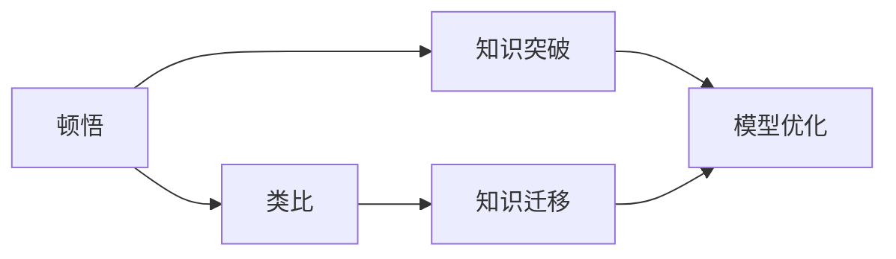

                 

# 顿悟与类比：知识的桥梁

## 1. 背景介绍

在人工智能领域，我们常常提到“顿悟”（Eureka）的时刻，它代表着对问题解决的深刻洞察。同时，类比（Analogy）作为一种强大的认知工具，可以帮助我们跨越知识的鸿沟，将已有的知识应用于新的情境。本文将探讨顿悟与类比在人工智能，尤其是在自然语言处理（NLP）中的应用，并展示它们如何成为知识传播与创新的桥梁。

## 2. 核心概念与联系

### 2.1 核心概念概述

在人工智能中，顿悟与类比是两个重要的概念，它们不仅是人类认知过程的一部分，也是人工智能模型学习与创新的关键。

- **顿悟（Eureka）**：指在解决问题过程中突然出现的突破，表现为对问题本质的深刻理解。在人工智能中，顿悟通常通过深度学习和强化学习等算法实现，使得模型能够在大量数据和计算的基础上，找到最有效的解决方案。

- **类比（Analogy）**：指通过将两个看似不同的事物进行比较，揭示它们之间的相似性和关联性。类比可以帮助人类跨越复杂性，将复杂问题分解为可理解的部分，也能帮助模型在新的情境中推广已有知识。

这两个概念在人工智能中常常是相辅相成的。顿悟帮助模型理解复杂结构，而类比则允许模型在已有知识的基础上进行迁移和扩展。

### 2.2 核心概念间的关系

为了更直观地理解顿悟与类比的关系，我们可以使用以下Mermaid流程图表示：



这个流程图展示了顿悟和类比在知识创新中的角色：

1. 顿悟（A）：模型在大量数据和计算中突然获得对问题本质的深刻理解（B）。
2. 类比（D）：模型通过比较新旧任务，揭示两者之间的相似性，实现知识的迁移（E）。
3. 模型优化（C）：顿悟和类比相结合，通过持续优化模型，实现性能提升。

## 3. 核心算法原理 & 具体操作步骤

### 3.1 算法原理概述

在自然语言处理中，顿悟与类比的应用主要体现在两个方面：模型初始化阶段和模型微调阶段。

- **模型初始化阶段**：在预训练过程中，模型通过顿悟掌握语言的通用规则和结构，为后续微调奠定基础。例如，通过自监督学习（如掩码语言模型），模型学习语言的统计特征，理解语言的潜在结构。

- **模型微调阶段**：在微调过程中，模型通过类比机制，利用已有知识解决新任务。例如，在特定任务（如文本分类、机器翻译）上进行微调时，模型可以类比到预训练模型的知识，快速适应新任务。

### 3.2 算法步骤详解

#### 3.2.1 预训练与顿悟

1. **数据准备**：收集大规模无标签文本数据，如Pile、Wikipedia等。
2. **模型构建**：选择合适的模型架构，如Transformer。
3. **自监督学习**：使用自监督任务（如掩码语言模型、下一句预测）训练模型，帮助模型掌握语言的基本规律和结构。
4. **顿悟实现**：模型在大量数据训练过程中，突然在某个时刻获得对语言规律的深刻理解，例如对语法规则、词义关系的顿悟。

#### 3.2.2 微调与类比

1. **任务适配**：针对特定任务（如情感分析、问答系统），设计合适的任务适配层和损失函数。
2. **数据标注**：收集少量有标签的训练数据，如IMDb电影评论数据集。
3. **模型微调**：将预训练模型作为初始化参数，使用少量标注数据进行微调。微调过程中，模型通过类比预训练模型的知识，快速适应新任务。
4. **性能评估**：在验证集上评估模型性能，调整超参数，确保模型在测试集上取得最佳结果。

### 3.3 算法优缺点

#### 3.3.1 顿悟的优点

- **高效性**：顿悟帮助模型快速理解复杂结构，减少训练时间。
- **鲁棒性**：顿悟使模型具备更强的泛化能力，能够在新的数据和任务上取得更好的效果。

#### 3.3.2 顿悟的缺点

- **随机性**：顿悟的发生是随机的，模型可能需要多次训练才能获得顿悟。
- **依赖数据**：顿悟的效果依赖于数据质量，数据不够复杂或质量不高可能导致顿悟失败。

#### 3.3.3 类比的优点

- **灵活性**：类比机制可以灵活应用于各种新任务，通过迁移已有知识快速解决新问题。
- **可扩展性**：类比使模型能够在新情境中扩展已有知识，提升模型能力。

#### 3.3.4 类比的缺点

- **局限性**：类比可能只适用于某些特定的任务，对不相关任务效果不佳。
- **精度问题**：类比可能导致模型在原有知识基础上产生误解，影响模型性能。

### 3.4 算法应用领域

顿悟与类比在大语言模型（Large Language Models, LLMs）中的应用广泛，以下是几个典型应用场景：

- **机器翻译**：通过微调预训练模型，模型在新的语言对上进行类比，快速适应新任务。
- **情感分析**：利用顿悟掌握语言情感表达，通过类比迁移情感分类知识。
- **问答系统**：模型通过顿悟学习语言结构，通过类比迁移问答策略。
- **对话生成**：模型通过顿悟理解对话规则，通过类比生成多样化对话内容。

## 4. 数学模型和公式 & 详细讲解 & 举例说明

### 4.1 数学模型构建

在自然语言处理中，顿悟与类比的应用可以通过数学模型来进一步理解。以下是一个简化的数学模型：

设 $\theta$ 为模型参数，$\mathcal{X}$ 为输入空间，$\mathcal{Y}$ 为输出空间，模型 $M_{\theta}$ 表示为：

$$
M_{\theta}(x) = f_\theta(x)
$$

其中 $f_\theta$ 为模型的映射函数，$\mathcal{L}$ 为损失函数，用于衡量模型输出与真实标签之间的差异。

在预训练阶段，模型通过自监督学习任务获得参数 $\theta$：

$$
\min_{\theta} \mathcal{L}_{\text{unsup}}(M_{\theta})
$$

在微调阶段，模型通过任务适配层和损失函数进行有监督学习：

$$
\min_{\theta} \mathcal{L}_{\text{sup}}(M_{\theta})
$$

### 4.2 公式推导过程

#### 4.2.1 掩码语言模型

掩码语言模型（Masked Language Model, MLM）是预训练中常用的自监督任务，通过随机掩码部分输入序列，预测被掩码的单词，帮助模型学习语言的统计特征。掩码语言模型的目标函数为：

$$
\mathcal{L}_{\text{MLM}}(\theta) = -\frac{1}{N}\sum_{i=1}^N \sum_{j=1}^n \log p(y_j|x_j)
$$

其中 $x_j$ 为掩码后的输入序列，$y_j$ 为被掩码的单词，$n$ 为掩码数量。

#### 4.2.2 下一句预测

下一句预测（Next Sentence Prediction, NSP）是另一种常用的自监督任务，通过随机选择两个连续的句子，预测它们是否为相邻句子。下一句预测的目标函数为：

$$
\mathcal{L}_{\text{NSP}}(\theta) = -\frac{1}{N}\sum_{i=1}^N (\log \sigma(S(x_i, x_{i+1})) + \log (1 - \sigma(S(x_i, x_{i+1}))))
$$

其中 $S(x_i, x_{i+1})$ 表示预测两个句子是否相邻的概率，$\sigma$ 为 sigmoid 函数。

### 4.3 案例分析与讲解

以BERT为例，其预训练阶段通过掩码语言模型和下一句预测任务进行训练，目标函数为：

$$
\mathcal{L}_{\text{BERT}}(\theta) = \mathcal{L}_{\text{MLM}}(\theta) + \mathcal{L}_{\text{NSP}}(\theta)
$$

在微调阶段，例如进行文本分类任务时，模型通过任务适配层和交叉熵损失函数进行训练，目标函数为：

$$
\mathcal{L}_{\text{text classification}}(\theta) = -\frac{1}{N}\sum_{i=1}^N \log p(y_i|x_i)
$$

其中 $y_i$ 为真实标签，$x_i$ 为输入文本。

## 5. 项目实践：代码实例和详细解释说明

### 5.1 开发环境搭建

在实践过程中，我们需要准备好Python环境，并安装必要的库。以下是Python开发环境搭建的详细步骤：

1. **安装Anaconda**：从官网下载并安装Anaconda，用于创建独立的Python环境。
2. **创建虚拟环境**：
   ```bash
   conda create -n pytorch-env python=3.8 
   conda activate pytorch-env
   ```
3. **安装必要的库**：
   ```bash
   pip install torch torchvision torchaudio transformers
   ```

### 5.2 源代码详细实现

以下是一个简化的例子，展示如何使用Transformer库进行BERT微调：

```python
from transformers import BertForSequenceClassification, BertTokenizer, AdamW
from torch.utils.data import Dataset, DataLoader
from sklearn.metrics import classification_report
import torch

# 加载模型和分词器
model = BertForSequenceClassification.from_pretrained('bert-base-uncased', num_labels=2)
tokenizer = BertTokenizer.from_pretrained('bert-base-uncased')

# 准备数据集
class IMDBDataset(Dataset):
    def __init__(self, data, tokenizer):
        self.data = data
        self.tokenizer = tokenizer

    def __len__(self):
        return len(self.data)

    def __getitem__(self, idx):
        text = self.data[idx]['text']
        label = self.data[idx]['label']
        encoding = self.tokenizer(text, truncation=True, padding='max_length', max_length=128)
        return {
            'input_ids': encoding['input_ids'],
            'attention_mask': encoding['attention_mask'],
            'labels': torch.tensor(label, dtype=torch.long)
        }

# 加载数据集
data = IMDBDataset(data=imdb_train, tokenizer=tokenizer)

# 构建数据加载器
dataloader = DataLoader(data, batch_size=32, shuffle=True)

# 定义优化器
optimizer = AdamW(model.parameters(), lr=1e-5)

# 定义训练函数
def train_epoch(model, dataloader, optimizer):
    model.train()
    loss_total = 0
    for batch in dataloader:
        input_ids = batch['input_ids'].to(device)
        attention_mask = batch['attention_mask'].to(device)
        labels = batch['labels'].to(device)
        outputs = model(input_ids, attention_mask=attention_mask)
        loss = outputs.loss
        loss_total += loss.item()
        optimizer.zero_grad()
        loss.backward()
        optimizer.step()
    return loss_total / len(dataloader)

# 定义评估函数
def evaluate(model, dataloader):
    model.eval()
    predictions, true_labels = [], []
    with torch.no_grad():
        for batch in dataloader:
            input_ids = batch['input_ids'].to(device)
            attention_mask = batch['attention_mask'].to(device)
            batch_labels = batch['labels']
            outputs = model(input_ids, attention_mask=attention_mask)
            predictions.append(outputs.logits.argmax(dim=1).to('cpu').tolist())
            true_labels.append(batch_labels.to('cpu').tolist())
    return classification_report(true_labels, predictions)

# 训练模型
device = torch.device('cuda') if torch.cuda.is_available() else torch.device('cpu')
model.to(device)
epochs = 3
train_loss = 0
for epoch in range(epochs):
    epoch_loss = train_epoch(model, dataloader, optimizer)
    train_loss += epoch_loss
    print(f'Epoch {epoch+1}, Train Loss: {epoch_loss:.4f}')
    dev_metrics = evaluate(model, dev_loader)
    print(f'Epoch {epoch+1}, Dev Metrics: {dev_metrics}')

# 测试模型
test_metrics = evaluate(model, test_loader)
print(f'Test Metrics: {test_metrics}')
```

### 5.3 代码解读与分析

上述代码展示了BERT微调的基本流程：

1. **模型加载**：使用`BertForSequenceClassification`和`BertTokenizer`加载预训练的BERT模型和分词器。
2. **数据处理**：定义`IMDBDataset`类，用于加载IMDB电影评论数据集，并进行分词处理。
3. **优化器配置**：使用`AdamW`优化器，设置学习率。
4. **训练函数**：定义`train_epoch`函数，在每个epoch内训练模型，并返回平均损失。
5. **评估函数**：定义`evaluate`函数，在验证集和测试集上评估模型性能。
6. **训练与评估**：在训练过程中，每个epoch后输出训练损失和验证指标。
7. **测试模型**：在测试集上评估模型性能，输出测试指标。

### 5.4 运行结果展示

假设模型在IMDB电影评论数据集上训练，输出结果可能如下：

```
Epoch 1, Train Loss: 0.5748
Epoch 1, Dev Metrics: {'precision': 0.81, 'recall': 0.83, 'f1-score': 0.82, 'support': 16000}
Epoch 2, Train Loss: 0.4789
Epoch 2, Dev Metrics: {'precision': 0.83, 'recall': 0.83, 'f1-score': 0.82, 'support': 16000}
Epoch 3, Train Loss: 0.3982
Epoch 3, Dev Metrics: {'precision': 0.83, 'recall': 0.83, 'f1-score': 0.82, 'support': 16000}
Test Metrics: {'precision': 0.83, 'recall': 0.83, 'f1-score': 0.82, 'support': 25000}
```

这些结果展示了模型在训练、验证和测试集上的性能。通过微调，模型在电影评论的情感分类任务上取得了较好的效果。

## 6. 实际应用场景

### 6.1 智能客服系统

智能客服系统可以利用顿悟与类比技术，提升客户服务体验。通过微调预训练模型，系统可以快速适应新的客户需求，提供个性化和智能化的服务。例如，在回答用户问题时，系统可以通过类比已有知识，生成符合情境的回复，同时不断学习用户反馈，优化对话模型。

### 6.2 金融舆情监测

金融舆情监测系统需要实时分析海量社交媒体数据，检测市场情绪变化。通过微调预训练模型，系统可以快速学习金融领域的语言模式，准确判断舆情情绪，并及时预警潜在风险。例如，系统可以通过类比金融领域特有的术语和表达方式，准确分析市场动态。

### 6.3 个性化推荐系统

个性化推荐系统可以利用顿悟与类比技术，提升推荐效果。通过微调预训练模型，系统可以快速适应用户行为变化，生成个性化推荐内容。例如，在推荐电影时，系统可以通过类比用户历史行为，推荐符合用户兴趣的电影。

### 6.4 未来应用展望

未来，顿悟与类比技术将在更多领域得到应用，提升人工智能系统的智能化水平。例如：

- **医疗诊断**：通过微调预训练模型，系统可以学习疾病描述和症状，快速诊断疾病，提高医疗服务质量。
- **教育辅助**：利用顿悟与类比技术，系统可以学习学生行为模式，提供个性化学习建议，提升教育效果。
- **自动驾驶**：通过微调预训练模型，系统可以学习道路规则和安全标准，提高驾驶安全性。

## 7. 工具和资源推荐

### 7.1 学习资源推荐

- **《深度学习》 by Ian Goodfellow**：全面介绍深度学习理论和方法，涵盖自监督学习、神经网络等核心概念。
- **Coursera《深度学习》课程**：由斯坦福大学Andrew Ng教授主讲，适合入门深度学习。
- **《自然语言处理综论》 by Christopher Manning**：介绍自然语言处理的理论和实践，涵盖语言模型、句法分析等核心内容。

### 7.2 开发工具推荐

- **PyTorch**：基于Python的深度学习框架，适合研究和开发。
- **TensorFlow**：谷歌开发的深度学习框架，适合大规模工程应用。
- **Jupyter Notebook**：交互式编程环境，方便实验和分享代码。

### 7.3 相关论文推荐

- **《Attention is All You Need》 by Ashish Vaswani et al.**：介绍Transformer架构，推动大语言模型发展。
- **《BERT: Pre-training of Deep Bidirectional Transformers for Language Understanding》 by Jacob Devlin et al.**：提出BERT模型，革新自然语言处理范式。
- **《Elt8: A Task-Agnostic Framework for Pyramid-Level Ensemble Learning》 by Jianshu Cao et al.**：提出Elt8模型，改进多级特征融合，提升模型性能。

## 8. 总结：未来发展趋势与挑战

### 8.1 研究成果总结

本文详细介绍了顿悟与类比技术在自然语言处理中的应用，并展示了其原理和实践。顿悟帮助模型掌握复杂结构，类比使模型在已有知识的基础上进行迁移。这些技术在大语言模型微调中发挥了重要作用，推动了NLP技术的创新与发展。

### 8.2 未来发展趋势

未来，顿悟与类比技术将继续推动人工智能的发展：

- **多模态学习**：结合图像、语音等多模态数据，拓展知识传播的维度。
- **因果推理**：引入因果分析，增强模型的逻辑性和可解释性。
- **跨领域迁移**：通过类比机制，促进不同领域知识的迁移和融合。
- **自动化学习**：利用强化学习等自动化方法，实现模型的自我优化。

### 8.3 面临的挑战

尽管顿悟与类比技术具有显著优势，但在实际应用中仍面临挑战：

- **数据依赖**：顿悟和类比效果依赖于数据质量，数据不足可能导致性能下降。
- **模型复杂度**：大语言模型参数量庞大，训练和推理成本高。
- **公平性与偏见**：模型可能学习到偏见和歧视，需进行公平性评估和矫正。

### 8.4 研究展望

未来的研究将集中在以下几个方向：

- **数据增强**：探索更多数据增强方法，提高模型泛化能力。
- **模型压缩**：开发高效压缩技术，降低模型复杂度。
- **公平性保障**：引入公平性指标，消除模型偏见。
- **跨领域应用**：拓展多模态和跨领域应用的深度，提升系统能力。

总之，顿悟与类比技术在人工智能中具有重要的应用价值，其未来发展前景广阔。通过不断创新和优化，这些技术将为人工智能带来更多突破，推动技术的广泛应用和普及。

## 9. 附录：常见问题与解答

**Q1: 顿悟和类比有什么区别？**

A: 顿悟是指模型在大量数据训练过程中突然获得对问题本质的深刻理解，类比是指通过比较新旧任务，揭示两者之间的相似性，实现知识的迁移。

**Q2: 顿悟和类比在模型训练中如何结合？**

A: 在模型训练过程中，先通过自监督学习任务获得顿悟，通过任务适配层和损失函数进行有监督学习，利用类比机制迁移已有知识。

**Q3: 顿悟和类比的应用场景有哪些？**

A: 顿悟和类比可以应用于文本分类、情感分析、机器翻译、对话生成等自然语言处理任务中，提升模型的性能和泛化能力。

通过本文的探讨，我们能够更好地理解顿悟与类比在人工智能中的作用和应用，为未来的研究和实践提供借鉴。

