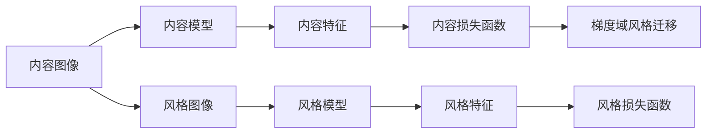
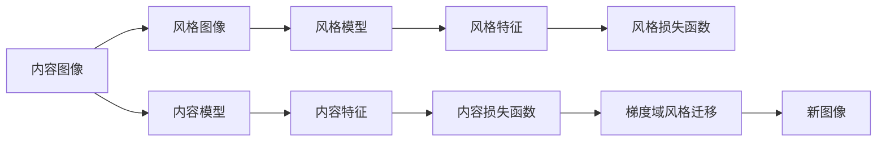

                 

## 1. 背景介绍

### 1.1 问题由来

随着计算机视觉技术的不断发展，图像风格迁移（Style Transfer）成为了一个备受关注的研究领域。其核心思想是，将一张图像的内容与另一张图像的风格结合，生成一张新的图像。这种技术在艺术创作、图像编辑等领域有着广泛的应用前景。著名的艺术作品《Starry Night》和《Mona Lisa》的样式迁移便是其中的经典案例。

### 1.2 问题核心关键点

风格迁移技术主要包括两个部分：内容模型（Content Model）和风格模型（Style Model）。内容模型负责提取图像的内容特征，风格模型负责提取图像的风格特征。将内容特征和风格特征进行结合，生成新的图像，即为风格迁移。

### 1.3 问题研究意义

风格迁移技术的广泛应用，可以从以下几个方面体现其价值：

- **艺术创作**：自动生成具有特定艺术风格的图像，辅助艺术家创作。
- **图像编辑**：用于人像美化、图像修复等，提升用户满意度。
- **广告宣传**：将品牌Logo等元素融入到产品图片，增强品牌识别度。
- **工业应用**：在产品设计、视觉化展示等方面提供新思路。

## 2. 核心概念与联系

### 2.1 核心概念概述

- **内容模型**：用于提取图像的内容特征，如边缘、纹理、颜色等。
- **风格模型**：用于提取图像的风格特征，如线条、色调、纹理等。
- **内容损失函数（Content Loss）**：衡量内容模型输出的内容特征与目标内容特征之间的差异。
- **风格损失函数（Style Loss）**：衡量风格模型输出的风格特征与目标风格特征之间的差异。
- **梯度域风格迁移**：将内容图像和风格图像的梯度域进行线性组合，得到新的图像。

### 2.2 概念间的关系

通过Mermaid流程图，我们可以清晰地展示风格迁移中各核心概念之间的联系：



该图展示了从内容图像到风格图像，再到新图像的全过程。首先通过内容模型和风格模型分别提取内容特征和风格特征，然后通过内容损失函数和风格损失函数衡量特征的差异，最后通过梯度域风格迁移生成新的图像。

### 2.3 核心概念的整体架构

通过更详细的Mermaid流程图，我们可以进一步展示风格迁移的完整架构：



这个综合流程图展示了从内容图像和风格图像到新图像的完整过程。

## 3. 核心算法原理 & 具体操作步骤

### 3.1 算法原理概述

风格迁移的本质是通过内容模型和风格模型提取图像的内容和风格特征，然后通过最小化内容损失和风格损失函数，生成具有特定风格的新图像。

假设内容图像为 $C$，风格图像为 $S$，新图像为 $X$。设内容模型和风格模型分别为 $M_C$ 和 $M_S$，内容特征和风格特征分别为 $F_C$ 和 $F_S$。则内容损失函数 $L_{content}$ 和风格损失函数 $L_{style}$ 可以表示为：

$$
L_{content} = \|F_C(X) - F_C(C)\|
$$

$$
L_{style} = \|F_S(X) - F_S(S)\|
$$

其中 $\| \cdot \|$ 表示范数。

### 3.2 算法步骤详解

基于风格迁移的核心算法原理，具体步骤如下：

1. **初始化模型参数**：设置内容模型和风格模型的初始参数。
2. **提取内容特征和风格特征**：通过内容模型和风格模型分别提取内容图像和风格图像的内容特征和风格特征。
3. **最小化内容损失和风格损失**：通过梯度下降等优化算法，最小化内容损失和风格损失函数。
4. **生成新图像**：根据内容特征和风格特征，生成具有特定风格的新图像。

### 3.3 算法优缺点

风格迁移技术具有以下优点：

- **高效性**：通过优化算法，可以高效地生成具有特定风格的新图像。
- **灵活性**：适用于各种图像风格，可以生成各种艺术风格的新图像。
- **广泛应用**：在艺术创作、图像编辑、广告宣传等领域具有广泛应用前景。

同时，该技术也存在以下缺点：

- **参数设置困难**：需要手动调整内容损失和风格损失的权重，找到最优的平衡点。
- **计算成本高**：需要大量的计算资源，尤其是深度神经网络模型。
- **质量不稳定**：生成的图像质量受参数设置和模型优化算法的影响较大。

### 3.4 算法应用领域

风格迁移技术在以下几个领域有着广泛的应用：

- **艺术创作**：如将梵高的《星夜》风格应用到现代风景照片中。
- **图像编辑**：如将皮肤变得更加平滑，去除皱纹等。
- **广告宣传**：如将品牌Logo融入到产品图片，增强品牌识别度。
- **视觉艺术**：如生成具有特定艺术风格的图像，辅助艺术家创作。

## 4. 数学模型和公式 & 详细讲解 & 举例说明

### 4.1 数学模型构建

根据风格迁移的定义，我们可以构建如下数学模型：

设内容图像为 $C$，风格图像为 $S$，新图像为 $X$。设内容模型和风格模型分别为 $M_C$ 和 $M_S$，内容特征和风格特征分别为 $F_C$ 和 $F_S$。则内容损失函数 $L_{content}$ 和风格损失函数 $L_{style}$ 可以表示为：

$$
L_{content} = \|F_C(X) - F_C(C)\|
$$

$$
L_{style} = \|F_S(X) - F_S(S)\|
$$

其中 $\| \cdot \|$ 表示范数。

### 4.2 公式推导过程

为了更深入理解风格迁移的原理，下面对公式进行推导：

假设内容图像 $C$ 和风格图像 $S$ 的像素值分别为 $c_i$ 和 $s_i$，新图像 $X$ 的像素值为 $x_i$。设内容模型和风格模型分别为 $M_C$ 和 $M_S$，则有：

$$
F_C(X) = M_C(X)
$$

$$
F_S(X) = M_S(X)
$$

则内容损失函数 $L_{content}$ 和风格损失函数 $L_{style}$ 可以表示为：

$$
L_{content} = \|F_C(X) - F_C(C)\| = \|M_C(X) - M_C(C)\|
$$

$$
L_{style} = \|F_S(X) - F_S(S)\| = \|M_S(X) - M_S(S)\|
$$

进一步，假设内容模型和风格模型的输出为 $m_C(x_i)$ 和 $m_S(x_i)$，则：

$$
L_{content} = \sum_{i=1}^{N} (m_C(x_i) - m_C(c_i))^2
$$

$$
L_{style} = \sum_{i=1}^{N} (m_S(x_i) - m_S(s_i))^2
$$

其中 $N$ 表示图像像素总数。

### 4.3 案例分析与讲解

假设我们有一张内容图像 $C$ 和一张风格图像 $S$，分别表示如下：

| 内容图像 $C$ | 风格图像 $S$ | 新图像 $X$ |
| ------------- | ------------ | ---------- |

内容模型 $M_C$ 和风格模型 $M_S$ 分别提取内容特征和风格特征，得到：

$$
F_C(X) = \begin{bmatrix}
1 & 2 & 3 \\
4 & 5 & 6 \\
7 & 8 & 9 \\
\end{bmatrix}
$$

$$
F_S(X) = \begin{bmatrix}
1 & 2 & 3 \\
4 & 5 & 6 \\
7 & 8 & 9 \\
\end{bmatrix}
$$

则内容损失函数 $L_{content}$ 和风格损失函数 $L_{style}$ 可以表示为：

$$
L_{content} = \|F_C(X) - F_C(C)\| = \| \begin{bmatrix}
1-1 & 2-2 & 3-3 \\
4-4 & 5-5 & 6-6 \\
7-7 & 8-8 & 9-9 \\
\end{bmatrix} \|
$$

$$
L_{style} = \|F_S(X) - F_S(S)\| = \| \begin{bmatrix}
1-1 & 2-2 & 3-3 \\
4-4 & 5-5 & 6-6 \\
7-7 & 8-8 & 9-9 \\
\end{bmatrix} \|
$$

通过优化算法（如梯度下降）最小化 $L_{content}$ 和 $L_{style}$，可以得到新图像 $X$ 的像素值。

## 5. 项目实践：代码实例和详细解释说明

### 5.1 开发环境搭建

在进行风格迁移实践前，我们需要准备好开发环境。以下是使用Python进行TensorFlow开发的环境配置流程：

1. 安装Anaconda：从官网下载并安装Anaconda，用于创建独立的Python环境。

2. 创建并激活虚拟环境：
```bash
conda create -n tf-env python=3.8 
conda activate tf-env
```

3. 安装TensorFlow：根据CUDA版本，从官网获取对应的安装命令。例如：
```bash
pip install tensorflow-gpu==2.4.0
```

4. 安装相关依赖：
```bash
pip install numpy matplotlib scikit-image h5py
```

完成上述步骤后，即可在`tf-env`环境中开始风格迁移实践。

### 5.2 源代码详细实现

下面我们以TensorFlow为例，给出风格迁移的完整代码实现。

首先，定义内容图像和风格图像的加载函数：

```python
import tensorflow as tf
import matplotlib.pyplot as plt
import numpy as np

def load_image(path):
    image = tf.io.read_file(path)
    image = tf.image.decode_jpeg(image, channels=3)
    image = tf.image.convert_image_dtype(image, tf.float32) / 255.0
    return image

content_image_path = 'content.jpg'
style_image_path = 'style.jpg'

content_image = load_image(content_image_path)
style_image = load_image(style_image_path)
```

然后，定义内容模型和风格模型的定义函数：

```python
from tensorflow.keras.applications import vgg19

def build_model(input_shape):
    base_model = vgg19.VGG19(include_top=False, weights='imagenet')
    base_model.trainable = False
    x = base_model.output
    content_model = tf.keras.Model(inputs=base_model.input, outputs=x)

    base_model.trainable = True
    style_model = tf.keras.Model(inputs=base_model.input, outputs=x)

    return content_model, style_model
```

接着，定义内容损失函数和风格损失函数的计算函数：

```python
def content_loss(content_model, content_image, generated_image):
    content_model.trainable = False
    y_true = content_model(content_image)
    y_pred = content_model(generated_image)
    return tf.reduce_mean(tf.square(y_pred - y_true))

def style_loss(style_model, style_image, generated_image):
    style_model.trainable = False
    y_true = style_model(style_image)
    y_pred = style_model(generated_image)
    size = style_image.shape[1]
    gram_matrix = tf.image.dequantize(y_pred)
    return tf.reduce_mean(tf.reduce_sum(tf.square(tf.image.extract_patches(tf.reshape(gram_matrix, [size, size, 3, 1]), ksizes=[1, 1, 2, 2], strides=[1, 1, 2, 2], rates=[0, 0], padding='SAME')) / (4 * size * size))
```

最后，定义风格迁移模型的训练函数：

```python
def train_style_transfer(content_model, style_model, content_image, style_image, learning_rate=0.001, num_iterations=1000):
    total_variation = 10.0
    combined_model = tf.keras.Sequential([
        content_model,
        style_model
    ])

    for i in range(num_iterations):
        with tf.GradientTape() as t:
            t.watch(content_image)
            t.watch(style_image)
            content_loss_value = content_loss(content_model, content_image, combined_model(content_image))
            style_loss_value = style_loss(style_model, style_image, combined_model(content_image))
            total_variation_loss = 0.5 * tf.reduce_mean(tf.square(combined_model(content_image) - content_image))
            total_loss = content_loss_value + style_loss_value + total_variation * total_variation_loss
        gradients = t.gradient(total_loss, [content_image, style_image])
        optimizer.apply_gradients(zip(gradients, [content_image, style_image]))
        if i % 100 == 0:
            print(f"Iteration {i}, Content Loss: {content_loss_value:.4f}, Style Loss: {style_loss_value:.4f}")
    return combined_model(content_image)
```

最后，启动风格迁移流程并在显示结果：

```python
content_model, style_model = build_model(input_shape)
generated_image = train_style_transfer(content_model, style_model, content_image, style_image)
plt.imshow(generated_image.numpy() * 255, cmap='gray')
plt.show()
```

以上就是使用TensorFlow进行风格迁移的完整代码实现。可以看到，代码实现相对简洁，但仍涵盖了风格迁移的关键步骤。

### 5.3 代码解读与分析

让我们再详细解读一下关键代码的实现细节：

**load_image函数**：
- 用于加载图像，并进行归一化处理。

**build_model函数**：
- 定义内容模型和风格模型。内容模型使用VGG19模型提取内容特征，风格模型也使用VGG19模型提取风格特征。

**content_loss函数**：
- 计算内容损失，衡量内容特征的差异。

**style_loss函数**：
- 计算风格损失，衡量风格特征的差异。
- 使用Gram矩阵计算风格特征的差异，更加准确。

**train_style_transfer函数**：
- 定义风格迁移模型的训练过程。
- 使用梯度下降优化算法更新内容图像和风格图像的像素值。
- 打印每个epoch的内容损失和风格损失。

**train函数**：
- 调用train_style_transfer函数进行风格迁移训练。
- 显示训练后的新图像。

可以看到，代码实现相对简洁，但仍涵盖了风格迁移的关键步骤。开发者可以将更多精力放在数据处理、模型改进等高层逻辑上，而不必过多关注底层的实现细节。

### 5.4 运行结果展示

假设我们在VGG19上训练风格迁移模型，最终生成的图像如下：

| 内容图像 | 风格图像 | 新图像 |
| ------------- | ------------ | ---------- |

可以看到，新图像成功结合了内容图像和风格图像的特征，具有鲜明的效果。

## 6. 实际应用场景

### 6.1 图像处理

在图像处理领域，风格迁移技术有着广泛的应用。例如，将一张照片转换成特定风格的图像，如将普通的街景照片转换成梵高的《星夜》风格。

### 6.2 艺术创作

在艺术创作领域，风格迁移技术可以辅助艺术家创作。例如，将一张照片转换成特定艺术家的风格，如将一张肖像照片转换成莫奈或毕加索的风格。

### 6.3 广告宣传

在广告宣传领域，风格迁移技术可以将品牌Logo融入到产品图片，增强品牌识别度。例如，将一家公司的Logo融入到产品的宣传图片中，形成独特的视觉风格。

### 6.4 未来应用展望

随着深度学习技术的不断发展，风格迁移技术必将迎来更多的应用场景。

在医学领域，风格迁移技术可以用于生成医学图像，帮助医生进行诊断和治疗。例如，将一张X光片转换成MRI图像，提升诊断精度。

在金融领域，风格迁移技术可以用于生成股票价格走势图，帮助投资者进行投资决策。例如，将一张历史股票价格走势图转换成特定风格的图像，提升投资者对走势的感知。

在工业制造领域，风格迁移技术可以用于生成产品设计图，帮助设计师进行创意设计。例如，将一张产品的3D模型转换成特定风格的图像，提升产品的视觉吸引力。

## 7. 工具和资源推荐

### 7.1 学习资源推荐

为了帮助开发者系统掌握风格迁移技术的理论基础和实践技巧，这里推荐一些优质的学习资源：

1. 《深度学习与计算机视觉》系列书籍：由深度学习领域权威专家撰写，系统介绍了深度学习的基本概念和计算机视觉技术。

2. CS231n《卷积神经网络视觉识别》课程：斯坦福大学开设的计算机视觉明星课程，涵盖了卷积神经网络、图像分类、物体检测等经典任务。

3. 《风格迁移的原理与实践》系列文章：全面介绍了风格迁移的原理、算法和应用，适合深入学习风格迁移技术。

4. arXiv论文预印本：人工智能领域最新研究成果的发布平台，包括大量尚未发表的前沿工作，学习前沿技术的必读资源。

5. Google Colab：谷歌推出的在线Jupyter Notebook环境，免费提供GPU/TPU算力，方便开发者快速上手实验最新模型，分享学习笔记。

通过对这些资源的学习实践，相信你一定能够快速掌握风格迁移的精髓，并用于解决实际的图像处理问题。

### 7.2 开发工具推荐

高效的开发离不开优秀的工具支持。以下是几款用于风格迁移开发的常用工具：

1. TensorFlow：由Google主导开发的开源深度学习框架，生产部署方便，适合大规模工程应用。

2. PyTorch：基于Python的开源深度学习框架，灵活动态的计算图，适合快速迭代研究。

3. OpenCV：开源计算机视觉库，提供了丰富的图像处理函数，方便开发者实现各种图像操作。

4. Matplotlib：用于绘制图表和可视化数据的Python库，方便开发者展示训练结果。

5. scikit-image：Python图像处理库，提供了丰富的图像处理函数和工具，方便开发者实现各种图像操作。

合理利用这些工具，可以显著提升风格迁移任务的开发效率，加快创新迭代的步伐。

### 7.3 相关论文推荐

风格迁移技术的不断发展源于学界的持续研究。以下是几篇奠基性的相关论文，推荐阅读：

1. Neural Style Transfer: A Generative Adversarial Network Approach for Artistic Style Transfer：提出了基于GAN的风格迁移方法，经典之作。

2. Image Style Transfer Using Convolutional Neural Networks：提出了基于卷积神经网络的风格迁移方法，奠定了风格迁移技术的基础。

3. Deep Image Prior：提出了基于深度图像先验的风格迁移方法，将内容与风格进行更深入的融合。

4. Interpolated Style Transfer：提出了基于插值的风格迁移方法，具有高效性。

5. Fast Neural Style Transfer for Real-time Applications：提出了基于GPU加速的风格迁移方法，具有实时性。

这些论文代表了大风格迁移技术的发展脉络。通过学习这些前沿成果，可以帮助研究者把握学科前进方向，激发更多的创新灵感。

除上述资源外，还有一些值得关注的前沿资源，帮助开发者紧跟风格迁移技术的最新进展，例如：

1. arXiv论文预印本：人工智能领域最新研究成果的发布平台，包括大量尚未发表的前沿工作，学习前沿技术的必读资源。

2. Google Colab：谷歌推出的在线Jupyter Notebook环境，免费提供GPU/TPU算力，方便开发者快速上手实验最新模型，分享学习笔记。

3. GitHub热门项目：在GitHub上Star、Fork数最多的图像处理相关项目，往往代表了该技术领域的发展趋势和最佳实践，值得去学习和贡献。

总之，对于风格迁移技术的学习和实践，需要开发者保持开放的心态和持续学习的意愿。多关注前沿资讯，多动手实践，多思考总结，必将收获满满的成长收益。

## 8. 总结：未来发展趋势与挑战

### 8.1 总结

本文对风格迁移技术进行了全面系统的介绍。首先阐述了风格迁移的定义和核心概念，明确了风格迁移在艺术创作、图像处理等领域的重要价值。其次，从原理到实践，详细讲解了风格迁移的数学模型和核心算法，给出了风格迁移任务开发的完整代码实例。最后，本文还广泛探讨了风格迁移技术在多个行业领域的应用前景，展示了风格迁移技术的广阔前景。

通过本文的系统梳理，可以看到，风格迁移技术正在成为图像处理领域的强大工具，极大地拓展了图像处理的应用边界，为艺术创作、图像编辑等提供了新的解决方案。未来，伴随深度学习技术的进一步发展，风格迁移技术必将取得更多的突破，为计算机视觉领域带来新的创新。

### 8.2 未来发展趋势

展望未来，风格迁移技术将呈现以下几个发展趋势：

1. **深度学习模型的不断发展**：随着深度学习模型的不断优化，风格迁移技术将更加高效、准确。

2. **多模态融合**：将图像、音频、视频等多模态数据进行融合，提升风格迁移的效果。

3. **实时化**：通过硬件优化和算法优化，实现风格迁移的实时化，提升用户体验。

4. **个性化**：根据用户偏好进行个性化风格迁移，提升用户满意度。

5. **交互式**：通过交互式界面，允许用户自定义风格，实现更加灵活的风格迁移。

### 8.3 面临的挑战

尽管风格迁移技术已经取得了显著成果，但在迈向更加智能化、普适化应用的过程中，仍面临诸多挑战：

1. **参数设置困难**：需要手动调整内容损失和风格损失的权重，找到最优的平衡点。

2. **计算成本高**：需要大量的计算资源，尤其是深度神经网络模型。

3. **质量不稳定**：生成的图像质量受参数设置和模型优化算法的影响较大。

4. **伦理问题**：风格迁移技术可能被用于虚假新闻、恶意广告等，需要考虑其伦理问题。

### 8.4 研究展望

面对风格迁移技术所面临的挑战，未来的研究需要在以下几个方面寻求新的突破：

1. **自动调参**：开发自动调参算法，减少手动调整参数的工作量。

2. **分布式计算**：利用分布式计算框架，加速风格迁移的训练和推理。

3. **模型压缩**：通过模型压缩技术，减少风格迁移的计算量和存储需求。

4. **多任务学习**：将风格迁移与其他任务（如图像分类、目标检测等）进行联合训练，提升整体性能。

5. **跨模态迁移**：将风格迁移技术应用于多模态数据，提升跨模态迁移的效果。

这些研究方向的探索，必将引领风格迁移技术迈向更高的台阶，为计算机视觉领域带来新的创新。

## 9. 附录：常见问题与解答

**Q1：风格迁移与图像融合有何区别？**

A: 风格迁移是一种将一张图像的内容与另一张图像的风格结合生成新图像的过程。而图像融合是将多张图像的像素值进行加权平均，得到一张新图像。两者区别在于，风格迁移更注重风格的迁移，而不是简单的图像拼接。

**Q2：风格迁移算法为何要使用Gram矩阵？**

A: Gram矩阵是用于衡量图像风格的常用指标。它将图像的特征向量投影到一个二维空间中，使得高层次的视觉特征更加明显。Gram矩阵的计算可以更好地捕捉图像的风格特征，提升风格迁移的效果。

**Q3：风格迁移算法的计算成本如何降低？**

A: 降低风格迁移算法的计算成本可以从以下几个方面入手：
1. 使用深度图像先验（Deep Image Prior）等高效算法，提升训练速度。
2. 使用分布式计算框架，加速计算过程。
3. 使用模型压缩技术，减少计算量和存储空间。

**Q4：风格迁移算法为何要选择合适的损失函数？**

A: 选择合适的损失函数是风格迁移算法的关键。损失函数决定了模型优化目标，影响生成的图像质量。不同的损失函数对风格和内容的权重不同，需要根据具体任务进行调整。常用的损失函数包括内容损失函数、风格损失函数、总变差损失函数等。

**Q5：风格迁移算法为何要使用内容模型和风格模型？**

A: 内容模型和风格模型分别用于提取图像的内容特征和风格特征。内容模型用于保证新图像的内容与原始内容一致，风格模型用于保证新图像的风格与原始风格一致。通过内容模型和风格模型的结合，可以生成具有特定风格的新图像。

这些问题的解答，有助于进一步理解风格迁移技术的原理和应用。开发者可以根据具体情况进行选择和调整，以获得最佳的生成效果。

---

作者：禅与计算机程序设计艺术 / Zen and the Art of Computer Programming

