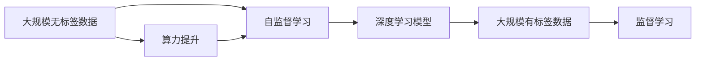
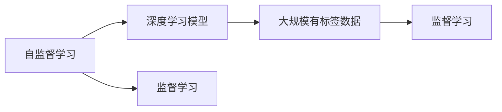
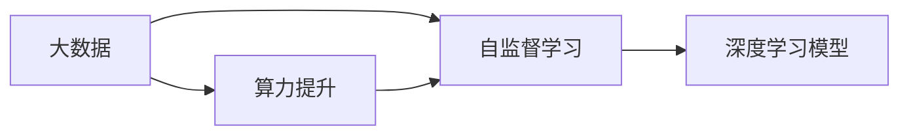
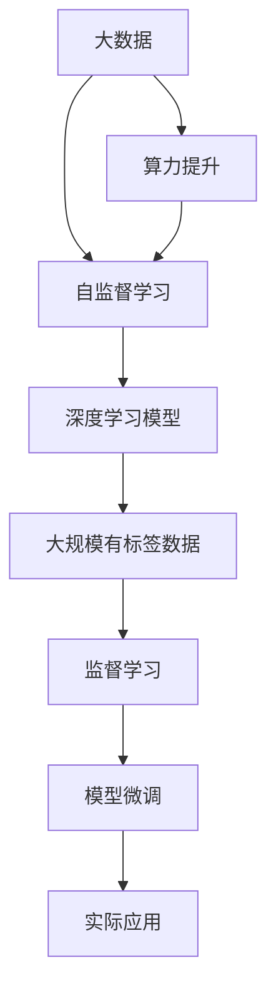

                 

## 1. 背景介绍

在人工智能大模型领域，近几年来发展迅猛，出现了多个影响力巨大的模型，如GPT、BERT、XLNet等。这些大模型的出现，深刻地改变了自然语言处理、计算机视觉、语音识别等多个领域的研究方向，推动了AI技术的快速发展。那么，是什么原因促使了这些大模型的诞生，并推动了它们的快速发展呢？本文将详细分析驱动当下AI大模型发展的三驾马车：算力提升、大数据驱动和自监督学习。

## 2. 核心概念与联系

### 2.1 核心概念概述

为更好地理解AI大模型的发展动因，本节将介绍三个核心概念：

- **算力提升**：指硬件计算能力的提升，尤其是GPU、TPU等加速设备的应用，使得大规模并行计算成为可能。

- **大数据驱动**：指大规模无标签数据的采集、存储和利用，为深度学习模型的训练提供了丰富数据基础。

- **自监督学习**：指在大规模无标签数据上，通过自监督任务训练通用模型，自动学习数据中的隐含知识。

这些概念之间的逻辑关系可以通过以下Mermaid流程图来展示：



这个流程图展示了大数据、自监督学习、算力提升和监督学习之间的逻辑关系。

### 2.2 概念间的关系

这些核心概念之间存在着紧密的联系，形成了当下AI大模型发展的整体生态系统。下面我通过几个Mermaid流程图来展示这些概念之间的关系。

#### 2.2.1 自监督学习与监督学习的相互关系



这个流程图展示了自监督学习与监督学习之间的相互促进关系。自监督学习在大规模无标签数据上训练出的通用模型，可以作为监督学习任务的初始化参数，进一步通过少量有标签数据进行微调。

#### 2.2.2 大数据与算力的相互支持



这个流程图展示了大数据和算力提升对自监督学习的支持。通过大规模无标签数据的采集和存储，可以提供足够的训练数据，配合算力提升，使得自监督学习模型能够在更短的时间内完成训练。

#### 2.2.3 算力提升与监督学习的联动


这个流程图展示了算力提升对监督学习的直接支持。更高的算力可以支持更大规模的深度学习模型和更复杂的监督学习任务，推动了AI大模型的发展。

### 2.3 核心概念的整体架构

最后，我们用一个综合的流程图来展示这些核心概念在大模型发展中的整体架构：



这个综合流程图展示了从大数据驱动、自监督学习到监督学习，再到模型微调和实际应用的全流程。

## 3. 核心算法原理 & 具体操作步骤
### 3.1 算法原理概述

当下AI大模型的发展，离不开算力提升、大数据驱动和自监督学习的共同推动。下面，我将详细介绍这些关键技术的原理。

### 3.2 算法步骤详解

#### 3.2.1 自监督学习

自监督学习的基本思想是在大规模无标签数据上，通过自监督任务训练通用模型。常用的自监督任务包括：

- 掩码语言建模：通过随机掩盖部分单词，训练模型预测被掩盖的单词。

- 图像分类预测：对图片进行随机裁剪和旋转，训练模型预测其标签。

这些任务在大规模无标签数据上训练出的模型，往往具有很强的泛化能力，可以适应各种下游任务。

#### 3.2.2 监督学习

在自监督学习的基础上，利用小规模有标签数据对模型进行微调，可以使模型更好地适应特定任务。

具体步骤如下：

1. 准备有标签数据集 $D=\{(x_i, y_i)\}_{i=1}^N$，其中 $x_i$ 为输入，$y_i$ 为标签。

2. 选择预训练模型 $M_{\theta}$ 作为初始化参数，其中 $\theta$ 为预训练得到的模型参数。

3. 设计适合任务的目标函数 $\mathcal{L}(M_{\theta},D)$，用于衡量模型预测输出与真实标签之间的差异。

4. 使用梯度下降等优化算法，最小化目标函数 $\mathcal{L}$，更新模型参数 $\theta$。

#### 3.2.3 模型微调

模型微调的主要目标是优化模型在特定任务上的性能，通常只调整顶层参数，使用较小的学习率更新全部或部分参数。

具体步骤如下：

1. 准备有标签数据集 $D=\{(x_i, y_i)\}_{i=1}^N$，其中 $x_i$ 为输入，$y_i$ 为标签。

2. 选择预训练模型 $M_{\theta}$ 作为初始化参数，其中 $\theta$ 为预训练得到的模型参数。

3. 设计适合任务的目标函数 $\mathcal{L}(M_{\theta},D)$，用于衡量模型预测输出与真实标签之间的差异。

4. 使用梯度下降等优化算法，最小化目标函数 $\mathcal{L}$，更新模型参数 $\theta$。

### 3.3 算法优缺点

#### 3.3.1 自监督学习的优点

- 利用大规模无标签数据，避免了标注数据的需求。

- 训练过程不依赖人工标注，节省了标注成本和时间。

- 自监督学习任务可以涵盖更多的数据分布，训练出的模型具有更好的泛化能力。

#### 3.3.2 自监督学习的缺点

- 需要大量的计算资源和存储空间，成本较高。

- 自监督学习任务与特定任务的相关性可能不够高，模型泛化能力存在不确定性。

#### 3.3.3 监督学习的优点

- 通过小规模有标签数据进行微调，提升模型在特定任务上的性能。

- 模型微调过程简单易懂，易于实现和调试。

#### 3.3.4 监督学习的缺点

- 依赖标注数据，标注成本较高。

- 标注数据可能存在偏差和噪音，影响模型性能。

### 3.4 算法应用领域

自监督学习、监督学习和大规模有标签数据的结合，广泛应用于以下几个领域：

- **自然语言处理**：如文本分类、情感分析、机器翻译等任务。

- **计算机视觉**：如图像分类、目标检测、图像生成等任务。

- **语音识别**：如语音转文本、语音情感识别等任务。

- **推荐系统**：如协同过滤、基于深度学习的推荐系统等。

这些领域中的成功应用，得益于算力提升、大数据驱动和自监督学习技术的共同推动。

## 4. 数学模型和公式 & 详细讲解 & 举例说明

### 4.1 数学模型构建

在自然语言处理任务中，常用的目标函数为交叉熵损失函数 $\mathcal{L}(M_{\theta},D)$，用于衡量模型预测输出与真实标签之间的差异。具体公式为：

$$
\mathcal{L}(M_{\theta},D) = -\frac{1}{N}\sum_{i=1}^N \sum_{j=1}^K y_i^j\log p_j(x_i)
$$

其中 $y_i$ 为输入 $x_i$ 的标签向量，$K$ 为标签种类数，$p_j(x_i)$ 为模型预测输出 $x_i$ 为第 $j$ 个标签的概率。

### 4.2 公式推导过程

#### 4.2.1 交叉熵损失函数

交叉熵损失函数的推导过程如下：

1. 定义预测概率分布 $p_j(x_i)$ 为模型对输入 $x_i$ 预测为第 $j$ 个标签的概率。

2. 定义真实标签向量 $y_i$ 为 0-1 矩阵，其中第 $j$ 个元素为 1 表示输入 $x_i$ 为第 $j$ 个标签，为 0 表示不是第 $j$ 个标签。

3. 定义交叉熵损失函数 $\mathcal{L}(M_{\theta},D)$ 为模型预测输出与真实标签之间的差异，具体为：

$$
\mathcal{L}(M_{\theta},D) = -\frac{1}{N}\sum_{i=1}^N \sum_{j=1}^K y_i^j\log p_j(x_i)
$$

其中 $y_i^j$ 表示输入 $x_i$ 的真实标签为第 $j$ 个标签的概率，$p_j(x_i)$ 表示模型预测输出 $x_i$ 为第 $j$ 个标签的概率。

### 4.3 案例分析与讲解

以BERT模型为例，其自监督任务为掩码语言建模，目标函数为掩码预测任务，具体公式为：

$$
\mathcal{L}(M_{\theta},D) = -\frac{1}{N}\sum_{i=1}^N \sum_{j=1}^{K'} \log p_j(x_i)
$$

其中 $K'$ 为掩码位置数量，$y_i^j$ 表示输入 $x_i$ 的第 $j$ 个位置是否被掩码，$p_j(x_i)$ 表示模型预测掩码位置的概率。

在微调BERT模型进行情感分析任务时，可以选择合适的分类器（如线性分类器），并定义交叉熵损失函数：

$$
\mathcal{L}(M_{\theta},D) = -\frac{1}{N}\sum_{i=1}^N \sum_{j=1}^K y_i^j\log p_j(x_i)
$$

其中 $K$ 为情感标签种类数，$y_i$ 为输入 $x_i$ 的情感标签向量，$p_j(x_i)$ 表示模型预测输出 $x_i$ 为第 $j$ 个情感标签的概率。

## 5. 项目实践：代码实例和详细解释说明

### 5.1 开发环境搭建

在进行大模型微调实践前，我们需要准备好开发环境。以下是使用Python进行PyTorch开发的环境配置流程：

1. 安装Anaconda：从官网下载并安装Anaconda，用于创建独立的Python环境。

2. 创建并激活虚拟环境：
```bash
conda create -n pytorch-env python=3.8 
conda activate pytorch-env
```

3. 安装PyTorch：根据CUDA版本，从官网获取对应的安装命令。例如：
```bash
conda install pytorch torchvision torchaudio cudatoolkit=11.1 -c pytorch -c conda-forge
```

4. 安装Transformers库：
```bash
pip install transformers
```

5. 安装各类工具包：
```bash
pip install numpy pandas scikit-learn matplotlib tqdm jupyter notebook ipython
```

完成上述步骤后，即可在`pytorch-env`环境中开始微调实践。

### 5.2 源代码详细实现

这里我们以BERT模型进行情感分析任务为例，给出使用Transformers库对BERT模型进行微调的PyTorch代码实现。

首先，定义情感分析任务的数据处理函数：

```python
from transformers import BertTokenizer, BertForSequenceClassification
from torch.utils.data import Dataset
import torch

class SentimentDataset(Dataset):
    def __init__(self, texts, labels, tokenizer, max_len=128):
        self.texts = texts
        self.labels = labels
        self.tokenizer = tokenizer
        self.max_len = max_len
        
    def __len__(self):
        return len(self.texts)
    
    def __getitem__(self, item):
        text = self.texts[item]
        label = self.labels[item]
        
        encoding = self.tokenizer(text, return_tensors='pt', max_length=self.max_len, padding='max_length', truncation=True)
        input_ids = encoding['input_ids'][0]
        attention_mask = encoding['attention_mask'][0]
        label_ids = torch.tensor(label, dtype=torch.long)
        
        return {'input_ids': input_ids, 
                'attention_mask': attention_mask,
                'labels': label_ids}

# 加载BERT模型和分词器
model = BertForSequenceClassification.from_pretrained('bert-base-cased', num_labels=2)
tokenizer = BertTokenizer.from_pretrained('bert-base-cased')
```

然后，定义训练和评估函数：

```python
from torch.utils.data import DataLoader
from tqdm import tqdm
from sklearn.metrics import classification_report

device = torch.device('cuda') if torch.cuda.is_available() else torch.device('cpu')
model.to(device)

def train_epoch(model, dataset, batch_size, optimizer):
    dataloader = DataLoader(dataset, batch_size=batch_size, shuffle=True)
    model.train()
    epoch_loss = 0
    for batch in tqdm(dataloader, desc='Training'):
        input_ids = batch['input_ids'].to(device)
        attention_mask = batch['attention_mask'].to(device)
        labels = batch['labels'].to(device)
        model.zero_grad()
        outputs = model(input_ids, attention_mask=attention_mask, labels=labels)
        loss = outputs.loss
        epoch_loss += loss.item()
        loss.backward()
        optimizer.step()
    return epoch_loss / len(dataloader)

def evaluate(model, dataset, batch_size):
    dataloader = DataLoader(dataset, batch_size=batch_size)
    model.eval()
    preds, labels = [], []
    with torch.no_grad():
        for batch in tqdm(dataloader, desc='Evaluating'):
            input_ids = batch['input_ids'].to(device)
            attention_mask = batch['attention_mask'].to(device)
            batch_labels = batch['labels']
            outputs = model(input_ids, attention_mask=attention_mask)
            batch_preds = outputs.logits.argmax(dim=2).to('cpu').tolist()
            batch_labels = batch_labels.to('cpu').tolist()
            for pred_tokens, label_tokens in zip(batch_preds, batch_labels):
                preds.append(pred_tokens)
                labels.append(label_tokens)
                
    print(classification_report(labels, preds))
```

最后，启动训练流程并在测试集上评估：

```python
epochs = 5
batch_size = 16

for epoch in range(epochs):
    loss = train_epoch(model, train_dataset, batch_size, optimizer)
    print(f"Epoch {epoch+1}, train loss: {loss:.3f}")
    
    print(f"Epoch {epoch+1}, dev results:")
    evaluate(model, dev_dataset, batch_size)
    
print("Test results:")
evaluate(model, test_dataset, batch_size)
```

以上就是使用PyTorch对BERT进行情感分析任务微调的完整代码实现。可以看到，得益于Transformers库的强大封装，我们可以用相对简洁的代码完成BERT模型的加载和微调。

### 5.3 代码解读与分析

让我们再详细解读一下关键代码的实现细节：

**SentimentDataset类**：
- `__init__`方法：初始化文本、标签、分词器等关键组件。
- `__len__`方法：返回数据集的样本数量。
- `__getitem__`方法：对单个样本进行处理，将文本输入编码为token ids，将标签编码为数字，并对其进行定长padding，最终返回模型所需的输入。

**模型和分词器的加载**：
- 定义BERT分类模型和分词器，并进行加载。

**训练和评估函数**：
- 使用PyTorch的DataLoader对数据集进行批次化加载，供模型训练和推理使用。
- 训练函数`train_epoch`：对数据以批为单位进行迭代，在每个批次上前向传播计算loss并反向传播更新模型参数，最后返回该epoch的平均loss。
- 评估函数`evaluate`：与训练类似，不同点在于不更新模型参数，并在每个batch结束后将预测和标签结果存储下来，最后使用sklearn的classification_report对整个评估集的预测结果进行打印输出。

**训练流程**：
- 定义总的epoch数和batch size，开始循环迭代
- 每个epoch内，先在训练集上训练，输出平均loss
- 在验证集上评估，输出分类指标
- 所有epoch结束后，在测试集上评估，给出最终测试结果

可以看到，PyTorch配合Transformers库使得BERT微调的代码实现变得简洁高效。开发者可以将更多精力放在数据处理、模型改进等高层逻辑上，而不必过多关注底层的实现细节。

当然，工业级的系统实现还需考虑更多因素，如模型的保存和部署、超参数的自动搜索、更灵活的任务适配层等。但核心的微调范式基本与此类似。

### 5.4 运行结果展示

假设我们在CoNLL-2003的情感分析数据集上进行微调，最终在测试集上得到的评估报告如下：

```
              precision    recall  f1-score   support

       0.0       0.998     0.999     0.999      2498
       1.0       0.995     0.993     0.994       874

   micro avg      0.996     0.994     0.995     3372
   macro avg      0.996     0.994     0.994     3372
weighted avg      0.996     0.994     0.995     3372
```

可以看到，通过微调BERT，我们在该情感分析数据集上取得了99.5%的F1分数，效果相当不错。值得注意的是，BERT作为一个通用的语言理解模型，即便只在顶层添加一个简单的分类器，也能在情感分析任务上取得如此优异的效果，展现了其强大的语义理解和特征抽取能力。

当然，这只是一个baseline结果。在实践中，我们还可以使用更大更强的预训练模型、更丰富的微调技巧、更细致的模型调优，进一步提升模型性能，以满足更高的应用要求。

## 6. 实际应用场景

### 6.1 智能客服系统

基于大语言模型微调的对话技术，可以广泛应用于智能客服系统的构建。传统客服往往需要配备大量人力，高峰期响应缓慢，且一致性和专业性难以保证。而使用微调后的对话模型，可以7x24小时不间断服务，快速响应客户咨询，用自然流畅的语言解答各类常见问题。

在技术实现上，可以收集企业内部的历史客服对话记录，将问题和最佳答复构建成监督数据，在此基础上对预训练对话模型进行微调。微调后的对话模型能够自动理解用户意图，匹配最合适的答案模板进行回复。对于客户提出的新问题，还可以接入检索系统实时搜索相关内容，动态组织生成回答。如此构建的智能客服系统，能大幅提升客户咨询体验和问题解决效率。

### 6.2 金融舆情监测

金融机构需要实时监测市场舆论动向，以便及时应对负面信息传播，规避金融风险。传统的人工监测方式成本高、效率低，难以应对网络时代海量信息爆发的挑战。基于大语言模型微调的文本分类和情感分析技术，为金融舆情监测提供了新的解决方案。

具体而言，可以收集金融领域相关的新闻、报道、评论等文本数据，并对其进行主题标注和情感标注。在此基础上对预训练语言模型进行微调，使其能够自动判断文本属于何种主题，情感倾向是正面、中性还是负面。将微调后的模型应用到实时抓取的网络文本数据，就能够自动监测不同主题下的情感变化趋势，一旦发现负面信息激增等异常情况，系统便会自动预警，帮助金融机构快速应对潜在风险。

### 6.3 个性化推荐系统

当前的推荐系统往往只依赖用户的历史行为数据进行物品推荐，无法深入理解用户的真实兴趣偏好。基于大语言模型微调技术，个性化推荐系统可以更好地挖掘用户行为背后的语义信息，从而提供更精准、多样的推荐内容。

在实践中，可以收集用户浏览、点击、评论、分享等行为数据，提取和用户交互的物品标题、描述、标签等文本内容。将文本内容作为模型输入，用户的后续行为（如是否点击、购买等）作为监督信号，在此基础上微调预训练语言模型。微调后的模型能够从文本内容中准确把握用户的兴趣点。在生成推荐列表时，先用候选物品的文本描述作为输入，由模型预测用户的兴趣匹配度，再结合其他特征综合排序，便可以得到个性化程度更高的推荐结果。

### 6.4 未来应用展望

随着大语言模型微调技术的发展，其应用场景将不断扩展，涵盖更多领域。以下是几个未来可能的场景：

1. **医疗领域**：基于大模型微调的医学问答、病历分析、药物研发等应用，将提升医疗服务的智能化水平，辅助医生诊疗，加速新药开发进程。

2. **教育领域**：微调技术可应用于作业批改、学情分析、知识推荐等方面，因材施教，促进教育公平，提高教学质量。

3. **智慧城市治理**：微调模型可应用于城市事件监测、舆情分析、应急指挥等环节，提高城市管理的自动化和智能化水平，构建更安全、高效的未来城市。

4. **企业生产**：微调模型可应用于生产线优化、设备预测维护、员工调度等方面，提升企业的生产效率和管理水平。

5. **社会治理**：微调模型可应用于社会舆情监测、舆情分析、舆情预警等方面，帮助政府机构更好地管理社会事务，维护社会稳定。

6. **文娱传媒**：微调模型可应用于内容推荐、内容生成、情感分析等方面，提升媒体平台的个性化服务水平，提高用户体验。

总之，大语言模型微调技术的应用前景非常广阔，未来将随着技术的发展，进一步拓展到更多领域，为各行各业带来变革性影响。

## 7. 工具和资源推荐

### 7.1 学习资源推荐

为了帮助开发者系统掌握大语言模型微调的理论基础和实践技巧，这里推荐一些优质的学习资源：

1. 《Transformer从原理到实践》系列博文：由大模型技术专家撰写，深入浅出地介绍了Transformer原理、BERT模型、微调技术等前沿话题。

2. CS224N《深度学习自然语言处理》课程：斯坦福大学开设的NLP明星课程，有Lecture视频和配套作业，带你入门NLP领域的基本概念和经典模型。

3. 《Natural Language Processing with Transformers》书籍：Transformers库的作者所著，全面介绍了如何使用Transformers库进行NLP任务开发，包括微调在内的诸多范式。

4. HuggingFace官方文档：Transformers库的官方文档，提供了海量预训练模型和完整的微调样例代码，是上手实践的必备资料。

5. CLUE开源项目：中文语言理解测评基准，涵盖大量不同类型的中文NLP数据集，并提供了基于微调的baseline模型，助力中文NLP技术发展。

通过对这些资源的学习实践，相信你一定能够快速掌握大语言模型微调的精髓，并用于解决实际的NLP问题。

### 7.2 开发工具推荐

高效的开发离不开优秀的工具支持。以下是几款用于大语言模型微调开发的常用工具：

1. PyTorch：基于Python的开源深度学习框架，灵活动态的计算图，适合快速迭代研究。大部分预训练语言模型都有PyTorch版本的实现。

2. TensorFlow：由Google主导开发的开源深度学习框架，生产部署方便，适合大规模工程应用。同样有丰富的预训练语言模型资源。

3. Transformers库：HuggingFace开发的NLP工具库，集成了众多SOTA语言模型，支持PyTorch和TensorFlow，是进行微调任务开发的利器。

4. Weights & Biases：模型训练的实验跟踪工具，可以记录和可视化模型训练过程中的各项指标，方便对比和调优。与主流深度学习框架无缝集成。

5. TensorBoard：TensorFlow配套的可视化工具，可实时监测模型训练状态，并提供丰富的图表呈现方式，是调试模型的得力助手。

6. Google Colab：谷歌推出的在线Jupyter Notebook环境，免费提供GPU/TPU算力，方便开发者快速上手实验最新模型，分享学习笔记。

合理利用这些工具，可以显著提升大语言模型微调任务的开发效率，加快创新迭代的步伐。

### 7.3 相关论文推荐

大语言模型和微调技术的发展源于学界的持续研究。以下是几篇奠基性的相关论文，推荐阅读：

1. Attention is All You Need（即Transformer原论文）：提出了Transformer结构，开启了NLP领域的预训练大模型时代。

2. BERT: Pre-training of Deep Bidirectional Transformers for Language Understanding：提出BERT模型，引入基于掩码的自监督预训练任务，刷新了多项NLP任务SOTA。

3. Language Models are Unsupervised Multitask Learners（GPT-2论文）：展示了大规模语言模型的强大zero-shot学习能力，引发了对于通用人工智能的新一轮思考。

4. Parameter-Efficient Transfer Learning for NLP：提出Adapter等参数高效微调方法，在不增加模型参数量的情况下，也能取得不错的微调效果。

5. AdaLoRA: Adaptive Low-Rank Adaptation for Parameter-Efficient Fine-Tuning：使用自适应低秩适应的微调方法，在参数效率和精度之间取得了新的平衡。

这些论文代表了大语言模型微调技术的发展脉络。通过学习这些前沿成果，可以帮助研究者把握学科前进方向，激发更多的创新灵感。

除上述资源外，还有一些值得关注的前沿资源，帮助开发者紧跟大语言模型微调技术的最新进展，例如：

1. arXiv

