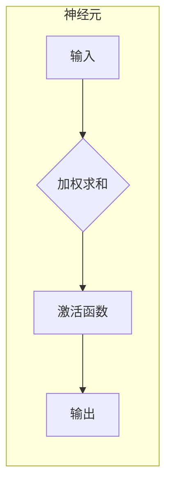

# 神经网络(Neural Networks) - 原理与代码实例讲解

## 1. 背景介绍

### 1.1 问题的由来

神经网络（Neural Networks，简称NNs）是一种模拟生物神经网络结构和功能的计算模型，它由大量相互连接的神经元组成，每个神经元接收来自其他神经元的输入信号，并根据一定的激活函数产生输出信号，并将输出信号传递给其他神经元。神经网络能够学习和识别复杂模式，并进行预测和分类等任务。

在现实世界中，我们经常遇到一些难以用传统算法解决的问题，例如图像识别、语音识别、自然语言处理等。这些问题往往涉及到大量的复杂数据，并且需要处理非线性关系。传统算法在处理这些问题时往往效率低下，甚至无法解决问题。而神经网络则可以利用其强大的学习能力，从大量数据中学习复杂的模式，并进行有效的预测和分类。

### 1.2 研究现状

神经网络的研究始于20世纪50年代，经过几十年的发展，神经网络已经取得了巨大的进步，并广泛应用于各个领域，例如图像识别、语音识别、自然语言处理、机器翻译、自动驾驶等。近年来，随着深度学习技术的兴起，神经网络的研究和应用得到了进一步的推动，出现了许多新的模型和算法，例如卷积神经网络（CNN）、循环神经网络（RNN）、生成对抗网络（GAN）等。

### 1.3 研究意义

神经网络的研究具有重要的理论意义和实践价值。从理论上来说，神经网络的研究可以帮助我们更好地理解生物神经网络的工作机制，并为人工智能的发展提供新的思路和方法。从实践上来说，神经网络的应用可以解决许多传统算法难以解决的问题，并为我们带来巨大的经济效益和社会效益。

### 1.4 本文结构

本文将从以下几个方面对神经网络进行介绍：

* **核心概念与联系**：介绍神经网络的基本概念和与其他机器学习算法的联系。
* **核心算法原理 & 具体操作步骤**：详细讲解神经网络的核心算法原理和具体操作步骤。
* **数学模型和公式 & 详细讲解 & 举例说明**：介绍神经网络的数学模型和公式，并通过案例进行详细讲解和举例说明。
* **项目实践：代码实例和详细解释说明**：使用Python语言编写神经网络代码，并进行详细的解释说明。
* **实际应用场景**：介绍神经网络在各个领域的应用场景，并展望未来应用趋势。
* **工具和资源推荐**：推荐一些学习神经网络的工具和资源。
* **总结：未来发展趋势与挑战**：总结神经网络的研究成果，展望未来发展趋势和面临的挑战。
* **附录：常见问题与解答**：解答一些关于神经网络的常见问题。

## 2. 核心概念与联系

### 2.1 神经元

神经元是神经网络的基本组成单元，它接收来自其他神经元的输入信号，并根据一定的激活函数产生输出信号。神经元的结构如下图所示：



* **输入**：神经元接收来自其他神经元的输入信号，每个输入信号都对应一个权重。
* **加权求和**：神经元将所有输入信号乘以相应的权重，然后将所有结果相加，得到加权求和结果。
* **激活函数**：激活函数是一个非线性函数，它将加权求和结果映射到一个特定的输出值。常用的激活函数包括 sigmoid 函数、ReLU 函数、tanh 函数等。
* **输出**：神经元将激活函数的输出值作为输出信号，传递给其他神经元。

### 2.2 神经网络结构

神经网络由多个神经元层组成，这些神经元层按照一定的结构连接在一起。常用的神经网络结构包括：

* **前馈神经网络**：信息从输入层流向输出层，没有反馈回路。
* **卷积神经网络**：专门用于处理图像数据的网络，它利用卷积操作提取图像特征。
* **循环神经网络**：能够处理序列数据，例如文本、语音等，它具有记忆功能，可以记住之前的信息。

### 2.3 学习过程

神经网络的学习过程就是调整神经元之间的权重，使其能够更好地拟合训练数据。常用的学习算法包括：

* **梯度下降法**：通过计算损失函数的梯度，并沿着梯度下降的方向调整权重。
* **反向传播算法**：将误差信息从输出层反向传播到输入层，并根据误差信息更新权重。

### 2.4 联系

神经网络与其他机器学习算法存在着密切的联系，例如：

* **支持向量机**：可以看作是神经网络的一种特例，它使用线性模型进行分类。
* **决策树**：可以看作是神经网络的一种简化版本，它使用树结构进行分类。
* **贝叶斯网络**：可以看作是神经网络的一种概率模型，它使用概率图模型进行推理。

## 3. 核心算法原理 & 具体操作步骤

### 3.1 算法原理概述

神经网络的核心算法原理是利用反向传播算法来调整神经元之间的权重，使其能够更好地拟合训练数据。反向传播算法的基本思想是：

1. 将训练数据输入神经网络，并计算输出结果。
2. 计算输出结果与真实结果之间的误差。
3. 将误差信息从输出层反向传播到输入层，并根据误差信息更新权重。

### 3.2 算法步骤详解

反向传播算法的具体步骤如下：

1. **前向传播**：将训练数据输入神经网络，并计算输出结果。
2. **计算误差**：计算输出结果与真实结果之间的误差。
3. **反向传播**：将误差信息从输出层反向传播到输入层，并计算每个神经元的误差梯度。
4. **更新权重**：根据误差梯度更新每个神经元的权重。

### 3.3 算法优缺点

反向传播算法的优点是：

* 能够有效地训练复杂的神经网络。
* 能够处理非线性关系。
* 能够从大量数据中学习复杂的模式。

反向传播算法的缺点是：

* 训练时间较长。
* 可能陷入局部最优解。
* 对数据质量要求较高。

### 3.4 算法应用领域

反向传播算法广泛应用于各个领域，例如：

* **图像识别**：识别图像中的物体、场景、人脸等。
* **语音识别**：识别语音中的单词、句子、情绪等。
* **自然语言处理**：理解文本、翻译语言、生成文本等。
* **机器翻译**：将一种语言翻译成另一种语言。
* **自动驾驶**：识别道路、交通信号、行人等。

## 4. 数学模型和公式 & 详细讲解 & 举例说明

### 4.1 数学模型构建

神经网络的数学模型可以用以下公式表示：

$$
y = f(W^T x + b)
$$

其中：

* $y$：神经网络的输出结果。
* $x$：神经网络的输入数据。
* $W$：神经元之间的权重矩阵。
* $b$：神经元的偏置向量。
* $f$：激活函数。

### 4.2 公式推导过程

神经网络的数学模型可以根据其结构和激活函数进行推导。例如，对于一个简单的两层神经网络，其数学模型可以表示为：

$$
y = f_2(W_2^T f_1(W_1^T x + b_1) + b_2)
$$

其中：

* $f_1$：第一层神经元的激活函数。
* $f_2$：第二层神经元的激活函数。
* $W_1$：第一层神经元的权重矩阵。
* $W_2$：第二层神经元的权重矩阵。
* $b_1$：第一层神经元的偏置向量。
* $b_2$：第二层神经元的偏置向量。

### 4.3 案例分析与讲解

以下是一个简单的案例，用于说明神经网络的数学模型和公式：

假设我们有一个简单的两层神经网络，它用于识别手写数字。该网络的输入层有 784 个神经元，对应于手写数字图像的像素值。隐藏层有 100 个神经元，输出层有 10 个神经元，对应于 10 个数字。

神经网络的数学模型可以表示为：

$$
y = f_2(W_2^T f_1(W_1^T x + b_1) + b_2)
$$

其中：

* $x$：手写数字图像的像素值，是一个 784 维的向量。
* $W_1$：第一层神经元的权重矩阵，是一个 100x784 的矩阵。
* $b_1$：第一层神经元的偏置向量，是一个 100 维的向量。
* $f_1$：第一层神经元的激活函数，例如 ReLU 函数。
* $W_2$：第二层神经元的权重矩阵，是一个 10x100 的矩阵。
* $b_2$：第二层神经元的偏置向量，是一个 10 维的向量。
* $f_2$：第二层神经元的激活函数，例如 softmax 函数。

### 4.4 常见问题解答

**问：神经网络如何处理非线性关系？**

**答：** 神经网络通过使用非线性激活函数来处理非线性关系。常用的激活函数包括 sigmoid 函数、ReLU 函数、tanh 函数等。这些函数可以将线性输入映射到非线性输出，从而使神经网络能够学习复杂的非线性模式。

**问：神经网络如何避免陷入局部最优解？**

**答：** 神经网络可以通过使用随机梯度下降法、动量法、Adam 法等优化算法来避免陷入局部最优解。这些算法可以帮助神经网络跳出局部最优解，并找到全局最优解。

**问：神经网络如何选择合适的激活函数？**

**答：** 选择合适的激活函数需要根据具体的问题和数据进行选择。例如，对于图像识别任务，ReLU 函数通常比 sigmoid 函数效果更好，因为 ReLU 函数可以避免梯度消失问题。

## 5. 项目实践：代码实例和详细解释说明

### 5.1 开发环境搭建

本项目使用 Python 语言和 TensorFlow 库进行开发。

**安装 TensorFlow 库：**

```bash
pip install tensorflow
```

**导入必要的库：**

```python
import tensorflow as tf
```

### 5.2 源代码详细实现

以下是一个简单的两层神经网络的代码实现：

```python
# 导入必要的库
import tensorflow as tf

# 定义模型
model = tf.keras.models.Sequential([
  tf.keras.layers.Flatten(input_shape=(28, 28)),
  tf.keras.layers.Dense(128, activation='relu'),
  tf.keras.layers.Dense(10, activation='softmax')
])

# 编译模型
model.compile(optimizer='adam',
              loss='sparse_categorical_crossentropy',
              metrics=['accuracy'])

# 训练模型
model.fit(x_train, y_train, epochs=10)

# 评估模型
loss, acc = model.evaluate(x_test, y_test, verbose=0)
print('Loss:', loss)
print('Accuracy:', acc)
```

### 5.3 代码解读与分析

* **定义模型**：使用 `tf.keras.models.Sequential` 类定义一个顺序模型，并添加两个层：
    * `tf.keras.layers.Flatten`：将输入数据展平成一维向量。
    * `tf.keras.layers.Dense`：全连接层，使用 ReLU 激活函数。
* **编译模型**：使用 `model.compile` 方法编译模型，并指定优化器、损失函数和评估指标：
    * `optimizer='adam'`：使用 Adam 优化器。
    * `loss='sparse_categorical_crossentropy'`：使用稀疏分类交叉熵损失函数。
    * `metrics=['accuracy']`：使用准确率作为评估指标。
* **训练模型**：使用 `model.fit` 方法训练模型，并指定训练数据、标签和训练轮数：
    * `x_train`：训练数据。
    * `y_train`：训练数据的标签。
    * `epochs=10`：训练 10 轮。
* **评估模型**：使用 `model.evaluate` 方法评估模型，并指定测试数据和标签：
    * `x_test`：测试数据。
    * `y_test`：测试数据的标签。

### 5.4 运行结果展示

运行代码后，会输出训练过程中的损失值和准确率，以及测试集上的损失值和准确率。

## 6. 实际应用场景

### 6.1 图像识别

神经网络在图像识别领域取得了巨大的成功，例如：

* **人脸识别**：识别图像中的人脸。
* **物体识别**：识别图像中的物体，例如汽车、行人、动物等。
* **场景识别**：识别图像中的场景，例如街道、森林、办公室等。

### 6.2 语音识别

神经网络在语音识别领域也取得了显著的进步，例如：

* **语音转文字**：将语音转换成文字。
* **语音识别**：识别语音中的单词、句子、情绪等。
* **语音合成**：根据文字生成语音。

### 6.3 自然语言处理

神经网络在自然语言处理领域也得到了广泛应用，例如：

* **机器翻译**：将一种语言翻译成另一种语言。
* **文本分类**：将文本分类到不同的类别，例如新闻、体育、娱乐等。
* **情感分析**：分析文本的情感，例如正面、负面、中性等。

### 6.4 未来应用展望

神经网络的应用领域不断扩展，未来将会有更多新的应用场景出现，例如：

* **医疗诊断**：利用神经网络进行疾病诊断。
* **金融预测**：利用神经网络预测股票价格、汇率等。
* **机器人控制**：利用神经网络控制机器人的运动。

## 7. 工具和资源推荐

### 7.1 学习资源推荐

* **TensorFlow 官方网站**：https://www.tensorflow.org/
* **PyTorch 官方网站**：https://pytorch.org/
* **Keras 官方网站**：https://keras.io/
* **Deep Learning Book**：https://www.deeplearningbook.org/

### 7.2 开发工具推荐

* **TensorFlow**：一个开源的机器学习库，提供了丰富的工具和 API，方便用户进行神经网络的开发和训练。
* **PyTorch**：另一个开源的机器学习库，其灵活性和易用性受到许多用户的青睐。
* **Keras**：一个高层神经网络 API，可以简化神经网络的开发过程。

### 7.3 相关论文推荐

* **AlexNet**：https://papers.nips.cc/paper/2012/file/c399862d3b9d6b76c8436e924a68c055-Paper.pdf
* **VGGNet**：https://arxiv.org/abs/1409.1556
* **ResNet**：https://arxiv.org/abs/1512.03385
* **Transformer**：https://arxiv.org/abs/1706.03762

### 7.4 其他资源推荐

* **GitHub**：https://github.com/
* **Kaggle**：https://www.kaggle.com/
* **Stack Overflow**：https://stackoverflow.com/

## 8. 总结：未来发展趋势与挑战

### 8.1 研究成果总结

神经网络的研究取得了巨大的成功，并广泛应用于各个领域。神经网络能够学习和识别复杂模式，并进行预测和分类等任务，为我们带来了巨大的经济效益和社会效益。

### 8.2 未来发展趋势

神经网络的未来发展趋势包括：

* **更强大的模型**：开发更强大的神经网络模型，例如更深层的网络、更复杂的网络结构等。
* **更有效的算法**：开发更有效的训练算法，例如更快的优化算法、更有效的正则化方法等。
* **更广泛的应用**：将神经网络应用到更多领域，例如医疗诊断、金融预测、机器人控制等。

### 8.3 面临的挑战

神经网络的研究也面临着一些挑战，例如：

* **可解释性**：神经网络的决策过程难以解释，这限制了其在一些关键领域的应用。
* **数据依赖**：神经网络的性能高度依赖于数据的质量和数量，这限制了其在数据缺乏的领域的应用。
* **安全性和隐私**：神经网络可能会被攻击和滥用，这需要我们加强安全性和隐私保护。

### 8.4 研究展望

神经网络的研究具有重要的理论意义和实践价值，未来将会有更多新的突破和应用。我们相信，神经网络将继续推动人工智能的发展，并为我们带来更多便利和福祉。

## 9. 附录：常见问题与解答

**问：神经网络的训练时间为什么很长？**

**答：** 神经网络的训练时间很长，主要是因为神经网络的模型参数很多，需要大量的计算才能找到最佳参数。

**问：神经网络如何处理不同类型的数据？**

**答：** 神经网络可以处理不同类型的数据，例如图像、文本、语音等。对于不同的数据类型，可以使用不同的神经网络模型和训练方法。

**问：神经网络如何进行超参数调优？**

**答：** 神经网络的超参数调优是一个复杂的过程，需要根据具体的问题和数据进行调整。常用的超参数调优方法包括网格搜索、随机搜索、贝叶斯优化等。

**问：神经网络如何进行模型评估？**

**答：** 神经网络的模型评估可以使用不同的指标，例如准确率、精确率、召回率、F1 分数等。评估指标的选择需要根据具体的问题和目标进行选择。

**问：神经网络如何进行模型部署？**

**答：** 神经网络的模型部署可以将训练好的模型保存到磁盘，并在需要时加载到内存中进行预测。

作者：禅与计算机程序设计艺术 / Zen and the Art of Computer Programming
