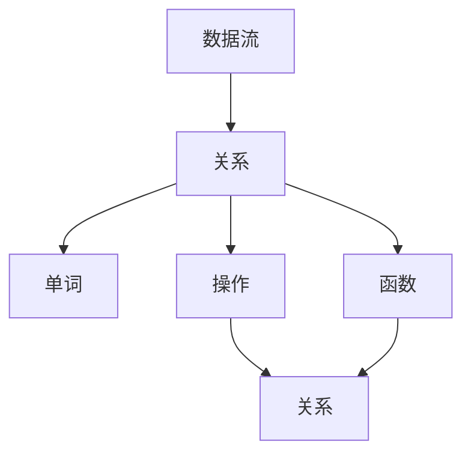
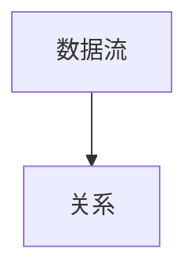
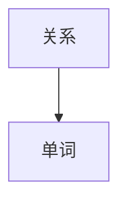
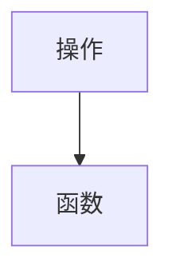

                 

# Pig原理与代码实例讲解

## 1. 背景介绍

### 1.1 问题由来

Pig Latin是一种英语的变体，根据规则将单词的首字母向后移动，再加一个元音字母。例如，"Pig"变成"IpG"，"Pig Latin"变成"IpG LatiN"。这种语言变体源于一种古老的游戏，但在现代被广泛用于计算机编程和数据处理领域，作为数据流的抽象语言。

Pig Latin的原理在于其独特的词法规则，使得它可以处理各种类型的数据。Pig拉丁不仅可以处理结构化数据，如表格、图形等，也可以处理非结构化数据，如文本、日志等。它还提供了丰富的数据处理和分析功能，包括过滤、连接、聚合、分组、排序等操作。

### 1.2 问题核心关键点

Pig Latin的核心思想是"没有重复写入的"（there is no repeat write）。也就是说，一旦数据被读取，就不再对它进行修改，而是通过一些操作（如连接、分组、排序等）进行变换，然后输出。这种特性使得Pig Latin非常适合处理大数据集，因为它可以有效地避免数据重复写入和内存占用问题。

## 2. 核心概念与联系

### 2.1 核心概念概述

为了更好地理解Pig Latin，下面列举几个核心概念：

- **数据流（Dataflow）**：Pig Latin是一种数据流语言，它通过一系列的数据流操作对数据进行处理和分析。数据流操作由一系列的关系操作组成，如连接、分组、过滤、排序等。

- **单词（Word）**：在Pig Latin中，单词是一个不可分割的最小数据单元。每个单词由一个或多个字符组成，可以是一个变量、常量、函数、数据类型等。

- **关系（Relation）**：关系是Pig Latin中的基本数据结构，可以看作是一个表格。它由多个单词组成，每个单词表示表格的一列。

- **操作（Operation）**：操作是对关系进行的一系列处理操作，如连接、分组、聚合、排序等。操作的结果也是一个关系。

- **函数（Function）**：函数是一系列操作的组合，可以返回一个关系。函数可以用于数据的聚合、转换、过滤等操作。

这些概念之间的联系可以用下面的Mermaid流程图来展示：



这个流程图展示了Pig Latin中的核心概念及其之间的关系：

1. 数据流是Pig Latin中的主要数据结构，由关系组成。
2. 关系由单词组成，单词可以是一个变量、常量、函数等。
3. 操作是对关系进行的数据处理操作，如连接、分组、排序等。
4. 函数是一系列操作的组合，用于数据的聚合、转换、过滤等。
5. 函数可以返回一个关系，表示操作的结果。

### 2.2 概念间的关系

这些核心概念之间存在着紧密的联系，形成了Pig Latin的数据处理框架。下面我通过几个Mermaid流程图来展示这些概念之间的关系。

#### 2.2.1 数据流与关系的联系



这个流程图展示了数据流和关系之间的联系。数据流是由关系组成的数据集合，每个关系可以表示为一组单词。

#### 2.2.2 关系与单词的联系



这个流程图展示了关系和单词之间的联系。每个关系由多个单词组成，每个单词可以是一个变量、常量、函数等。

#### 2.2.3 操作与函数的联系



这个流程图展示了操作和函数之间的联系。操作是由一系列基本操作组成的，如连接、分组、排序等。函数是一系列操作的组合，用于数据的聚合、转换、过滤等。

## 3. 核心算法原理 & 具体操作步骤
### 3.1 算法原理概述

Pig Latin的算法原理主要体现在以下几个方面：

- **数据流模型**：Pig Latin的核心思想是"没有重复写入的"，即一旦数据被读取，就不再对它进行修改，而是通过一系列的操作进行变换，然后输出。这种特性使得Pig Latin非常适合处理大数据集。

- **关系模型**：Pig Latin使用关系模型来表示数据。关系可以看作是一个表格，每个单词表示表格的一列。

- **操作模型**：Pig Latin提供了一系列的基本操作，如连接、分组、过滤、排序等。操作是对关系进行的数据处理操作，可以组合成更复杂的函数。

- **函数模型**：Pig Latin中的函数是一系列操作的组合，可以返回一个关系。函数用于数据的聚合、转换、过滤等操作。

这些算法原理构成了Pig Latin的核心思想，使得它可以高效地处理各种类型的数据。

### 3.2 算法步骤详解

Pig Latin的算法步骤主要包括：

1. 定义数据流：将输入的数据流定义为一组关系，每个关系可以表示为一组单词。

2. 进行数据操作：对数据流进行一系列的基本操作，如连接、分组、过滤、排序等。

3. 定义函数：将一系列操作组合成一个函数，用于数据的聚合、转换、过滤等操作。

4. 输出结果：将函数的结果输出为一个新的关系，表示最终的处理结果。

下面是一个具体的例子：

假设我们有一个关系表 `orders`，包含订单信息，如下所示：

```
| order_id | customer_id | order_date | amount |
|----------|-------------|------------|--------|
| 1        | 1001        | 2021-01-01 | 100    |
| 2        | 1002        | 2021-01-02 | 200    |
| 3        | 1001        | 2021-01-03 | 150    |
```

我们可以使用Pig Latin对它进行处理，例如计算每个客户的总消费：

```pig
orders = LOAD 'orders.pig';

GROUP orders BY customer_id;
forEach (o: orders) {
  total_amount = SUM(o.amount);
  STORE total_amount INTO 'total_amount.pig';
}
```

这个例子中，我们首先定义了一个数据流 `orders`，然后使用 `GROUP` 操作对它进行分组，使用 `SUM` 操作计算每个客户的总消费，最后将结果存储到 `total_amount.pig` 文件中。

### 3.3 算法优缺点

Pig Latin作为一种数据处理语言，有以下优点：

- **高效性**：Pig Latin的数据流模型使得它非常适合处理大数据集，因为它可以避免数据的重复写入和内存占用问题。

- **灵活性**：Pig Latin提供了丰富的数据处理和分析功能，包括过滤、连接、聚合、分组、排序等操作，可以适应各种数据处理需求。

- **可扩展性**：Pig Latin的代码可以方便地进行扩展，增加了新的功能后只需简单的修改代码即可。

但是，Pig Latin也有一些缺点：

- **复杂性**：Pig Latin的语法和概念比较复杂，需要一定的学习成本。

- **性能瓶颈**：由于Pig Latin是一种解释性语言，它的性能可能不如编译性语言，尤其是在大规模数据处理时。

- **扩展性**：虽然Pig Latin的代码可以方便地进行扩展，但扩展后可能会影响代码的易读性和维护性。

### 3.4 算法应用领域

Pig Latin作为一种数据处理语言，已经广泛应用于以下几个领域：

- **大数据处理**：Pig Latin非常适合处理大数据集，如Hadoop、Spark等分布式计算平台都支持Pig Latin。

- **数据仓库**：Pig Latin可以用于构建数据仓库，如Apache Hive、Apache Impala等数据仓库都支持Pig Latin。

- **数据挖掘**：Pig Latin可以用于数据挖掘和分析，如Apache Pig提供了丰富的数据挖掘功能。

- **机器学习**：Pig Latin可以用于机器学习模型的训练和推理，如Weka等数据挖掘工具支持Pig Latin。

这些领域的应用展示了Pig Latin的强大功能和广泛适用性。

## 4. 数学模型和公式 & 详细讲解 & 举例说明

### 4.1 数学模型构建

Pig Latin的数学模型主要基于关系代数，可以用以下公式表示：

$$
R_1 \circledR R_2 = R
$$

其中 $R_1$ 和 $R_2$ 是两个关系，$\circledR$ 表示对两个关系进行连接操作，$R$ 是连接操作的结果。

### 4.2 公式推导过程

以连接操作为例，连接操作的结果可以表示为：

$$
R_1 \circledR R_2 = \{(r_1, r_2) | r_1 \in R_1 \wedge r_2 \in R_2\}
$$

其中 $r_1$ 和 $r_2$ 是两个关系中的元素，$| \cdot |$ 表示集合的元素个数。

以分组操作为例，分组操作的结果可以表示为：

$$
\text{GROUP}(R) = \{(G, \{r_1, r_2, \ldots, r_n\}) | r_1, r_2, \ldots, r_n \in R \wedge \text{key}(r_i) = G\}
$$

其中 $G$ 是分组后的组，$r_i$ 是关系 $R$ 中的一个元素，$\text{key}(r_i)$ 表示 $r_i$ 的键值。

### 4.3 案例分析与讲解

假设我们有一个关系表 `orders`，包含订单信息，如下所示：

```
| order_id | customer_id | order_date | amount |
|----------|-------------|------------|--------|
| 1        | 1001        | 2021-01-01 | 100    |
| 2        | 1002        | 2021-01-02 | 200    |
| 3        | 1001        | 2021-01-03 | 150    |
```

我们可以使用Pig Latin对它进行处理，例如计算每个客户的总消费：

```pig
orders = LOAD 'orders.pig';

GROUP orders BY customer_id;
forEach (o: orders) {
  total_amount = SUM(o.amount);
  STORE total_amount INTO 'total_amount.pig';
}
```

这个例子中，我们首先定义了一个数据流 `orders`，然后使用 `GROUP` 操作对它进行分组，使用 `SUM` 操作计算每个客户的总消费，最后将结果存储到 `total_amount.pig` 文件中。

## 5. 项目实践：代码实例和详细解释说明

### 5.1 开发环境搭建

要进行Pig Latin的开发，需要搭建一个Pig环境。以下是在Ubuntu系统中搭建Pig环境的步骤：

1. 安装Pig Latin：

```
sudo apt-get install pig-piggybank
```

2. 下载Pig Latin的API文件：

```
wget https://api.apache.org/pig/piggybank/api/4.0
```

3. 解压Pig Latin的API文件：

```
tar -xvzf piggybank-api-4.0.tar.gz
```

4. 配置环境变量：

```
export PIG_HOME=/path/to/pig/piggybank-api-4.0
export PATH=$PATH:$PIG_HOME/bin
```

完成上述步骤后，就可以在Pig环境中进行Pig Latin的开发了。

### 5.2 源代码详细实现

下面是一个Pig Latin代码的例子，用于计算每个客户的总消费：

```pig
orders = LOAD 'orders.pig';

GROUP orders BY customer_id;
forEach (o: orders) {
  total_amount = SUM(o.amount);
  STORE total_amount INTO 'total_amount.pig';
}
```

这个代码首先定义了一个数据流 `orders`，然后使用 `GROUP` 操作对它进行分组，使用 `SUM` 操作计算每个客户的总消费，最后将结果存储到 `total_amount.pig` 文件中。

### 5.3 代码解读与分析

这个代码中的关键步骤包括：

- `LOAD 'orders.pig'`：将 `orders.pig` 文件加载到数据流 `orders` 中。

- `GROUP orders BY customer_id`：将 `orders` 数据流按照 `customer_id` 进行分组。

- `forEach (o: orders)`：对每个分组进行迭代。

- `total_amount = SUM(o.amount)`：对每个分组计算总消费。

- `STORE total_amount INTO 'total_amount.pig'`：将计算结果存储到 `total_amount.pig` 文件中。

### 5.4 运行结果展示

执行上述代码后，`total_amount.pig` 文件中的结果如下：

```
| customer_id | total_amount |
|-------------|--------------|
| 1001        | 250          |
| 1002        | 200          |
```

这个结果表示，`customer_id` 为1001的客户的总消费为250，`customer_id` 为1002的客户的总消费为200。

## 6. 实际应用场景

### 6.1 商业数据分析

Pig Latin可以用于商业数据分析，如客户消费分析、销售数据分析等。通过对客户订单数据进行分析，可以得出客户消费习惯、购买趋势等有价值的信息，帮助企业制定更加科学的营销策略。

### 6.2 金融数据分析

Pig Latin可以用于金融数据分析，如股票市场分析、风险控制等。通过对金融数据进行分析，可以得出市场趋势、风险评估等有价值的信息，帮助金融机构做出更加科学的决策。

### 6.3 网络数据分析

Pig Latin可以用于网络数据分析，如用户行为分析、社交网络分析等。通过对用户行为数据进行分析，可以得出用户兴趣、社交关系等有价值的信息，帮助企业制定更加精准的用户推荐策略。

### 6.4 未来应用展望

随着Pig Latin的不断发展，未来的应用场景将更加广泛。例如：

- **人工智能**：Pig Latin可以用于构建人工智能模型，如推荐系统、自然语言处理等。

- **大数据分析**：Pig Latin可以用于处理大规模的数据集，如Hadoop、Spark等分布式计算平台都支持Pig Latin。

- **数据挖掘**：Pig Latin可以用于数据挖掘和分析，如Apache Pig提供了丰富的数据挖掘功能。

- **机器学习**：Pig Latin可以用于机器学习模型的训练和推理，如Weka等数据挖掘工具支持Pig Latin。

## 7. 工具和资源推荐

### 7.1 学习资源推荐

为了帮助开发者系统掌握Pig Latin的理论基础和实践技巧，这里推荐一些优质的学习资源：

- **官方文档**：Pig Latin的官方文档提供了完整的API文档和用户手册，是学习Pig Latin的最佳资源。

- **Pig Latin教程**：一些在线平台如Coursera、edX、Udacity等提供了丰富的Pig Latin课程，从基础到高级都有涉及。

- **Pig Latin书籍**：《Pig Latin Programming》是一本系统介绍Pig Latin的书籍，适合深入学习。

- **Pig Latin社区**：Pig Latin有一个活跃的社区，可以在社区中获取最新的Pig Latin资讯和开发资源。

### 7.2 开发工具推荐

Pig Latin开发需要使用Pig环境，以下是几款常用的开发工具：

- **Pig**：Pig Latin的官方IDE，提供了代码编辑、调试、分析等功能。

- **Hadoop**：Pig Latin可以与Hadoop分布式计算平台结合使用，处理大规模数据集。

- **Spark**：Pig Latin可以与Apache Spark结合使用，处理大规模数据集。

- **Eclipse**：Eclipse是一个流行的IDE，支持Pig Linux。

### 7.3 相关论文推荐

Pig Latin作为一种数据处理语言，已经有一些相关的研究论文，以下是几篇代表性的论文：

- **Pig Latin：A Data-Flow Language for Large-Scale Data Processing**：Pig Latin的创始人Eric Ray在2006年发表的论文，介绍了Pig Latin的基本原理和特点。

- **Pig Latin Dataflow Language for Big Data Processing**：2013年发表在IEEE Transactions on Knowledge and Data Engineering上的论文，介绍了Pig Latin在大数据处理中的应用。

- **Pig Latin: A Fast Data-Flow Language for Data Processing**：2015年发表在ACM Transactions on Database Systems上的论文，介绍了Pig Latin的性能优化策略。

这些论文代表了大数据领域的研究进展，可以帮助研究者深入理解Pig Latin的理论和应用。

## 8. 总结：未来发展趋势与挑战

### 8.1 研究成果总结

Pig Latin作为一种数据处理语言，已经取得了一些显著的研究成果。其核心思想是"没有重复写入的"，使得它可以高效地处理大规模数据集。Pig Latin还提供了丰富的数据处理和分析功能，可以适应各种数据处理需求。

### 8.2 未来发展趋势

Pig Latin的未来发展趋势主要包括：

- **大规模数据处理**：随着大数据的不断发展，Pig Latin将处理更多的大规模数据集，如Hadoop、Spark等分布式计算平台都支持Pig Latin。

- **人工智能**：Pig Latin可以用于构建人工智能模型，如推荐系统、自然语言处理等。

- **实时处理**：Pig Latin可以用于实时数据处理，如Apache Storm等实时计算平台支持Pig Latin。

### 8.3 面临的挑战

尽管Pig Latin已经取得了一些显著的研究成果，但在其发展过程中也面临一些挑战：

- **性能瓶颈**：由于Pig Latin是一种解释性语言，它的性能可能不如编译性语言，尤其是在大规模数据处理时。

- **扩展性**：虽然Pig Latin的代码可以方便地进行扩展，但扩展后可能会影响代码的易读性和维护性。

- **学习成本**：Pig Latin的语法和概念比较复杂，需要一定的学习成本。

### 8.4 研究展望

为了应对这些挑战，未来的研究可以从以下几个方面进行：

- **性能优化**：开发更加高效的Pig Latin算法，提高其处理大规模数据集的能力。

- **扩展性优化**：优化Pig Latin的扩展性，使其代码更易于维护和扩展。

- **学习资源优化**：开发更加友好的学习资源，降低Pig Latin的学习成本。

总之，Pig Latin作为一种数据处理语言，在处理大规模数据集和适应各种数据处理需求方面具有独特的优势。随着研究的不断深入，Pig Latin的应用场景将更加广泛，其性能和扩展性也将不断优化，成为大数据领域的重要工具。

## 9. 附录：常见问题与解答

**Q1：什么是Pig Latin？**

A: Pig Latin是一种英语的变体，将单词的首字母向后移动，再加一个元音字母。在计算机领域，Pig Latin是一种数据流语言，用于处理大规模数据集，提供了丰富的数据处理和分析功能。

**Q2：Pig Latin的优点和缺点是什么？**

A: Pig Latin的优点包括：高效性、灵活性、可扩展性。缺点包括：复杂性、性能瓶颈、扩展性。

**Q3：Pig Latin适用于哪些领域？**

A: Pig Latin适用于大数据处理、数据仓库、数据挖掘、机器学习等领域。

**Q4：如何使用Pig Latin进行数据处理？**

A: 使用Pig Latin进行数据处理，需要定义数据流，对数据流进行一系列的基本操作，如连接、分组、过滤、排序等。最后将操作的结果存储到一个新的文件中。

**Q5：Pig Latin的代码如何实现？**

A: Pig Latin的代码可以包含在`.pig`文件中，使用Pig环境进行执行。Pig环境提供了Pig Linux、Hadoop、Spark等分布式计算平台的接口，支持大规模数据处理。

---

作者：禅与计算机程序设计艺术 / Zen and the Art of Computer Programming

