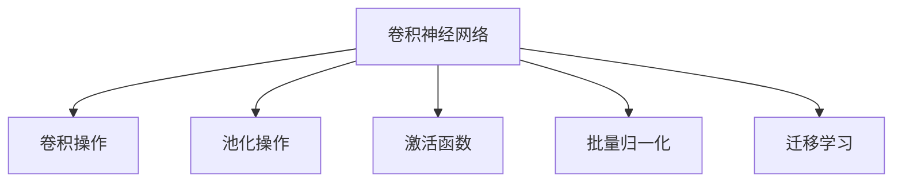
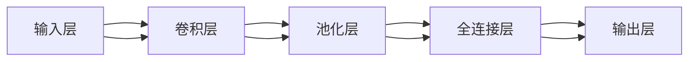
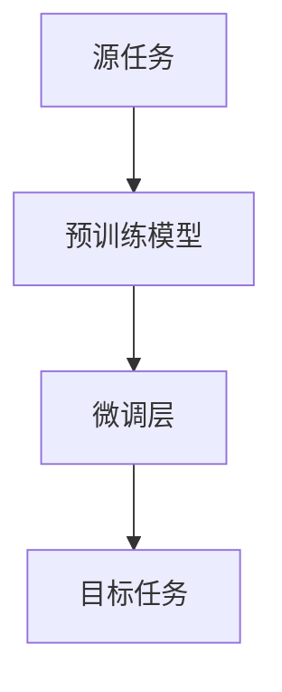
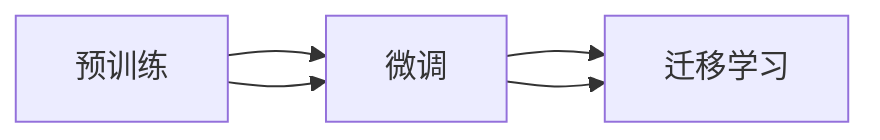
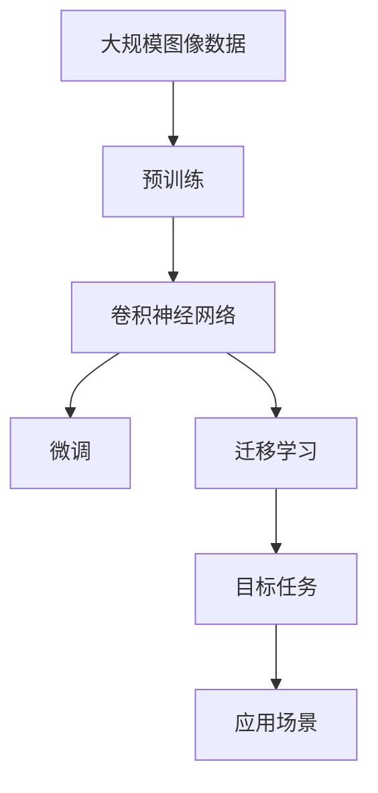

                 

# Python机器学习实战：卷积神经网络(CNN)在图像处理中的应用

## 1. 背景介绍

### 1.1 问题由来
随着深度学习技术的迅猛发展，卷积神经网络（Convolutional Neural Network, CNN）已成为图像处理领域的重要技术手段。CNN通过卷积、池化、非线性激活等操作，高效提取图像特征，从而在图像分类、物体检测、语义分割等众多任务上取得了优异表现。

然而，尽管CNN在学术界取得了卓越成果，但在实际应用中，往往面临计算资源需求高、模型复杂等问题。如何在大规模数据集上高效实现CNN模型，并部署到各类应用场景中，成为当前深度学习领域的热点话题。

### 1.2 问题核心关键点
本文档将聚焦于使用Python进行卷积神经网络(CNN)的开发和应用，详细讲解CNN的核心概念、架构原理、数学模型和具体实现。特别强调，将重点介绍如何使用CNN处理图像分类、目标检测、语义分割等典型任务，并通过实例代码展示其应用效果。

### 1.3 问题研究意义
研究卷积神经网络在图像处理中的应用，对于提升图像识别、检测和分割等技术的自动化水平，降低人工成本，具有重要意义。通过使用Python和相关的深度学习框架（如TensorFlow、Keras、PyTorch等），能够快速搭建CNN模型，提升算法效率和应用效果。

## 2. 核心概念与联系

### 2.1 核心概念概述

为更好地理解卷积神经网络在图像处理中的应用，本节将介绍几个密切相关的核心概念：

- 卷积神经网络（CNN）：一种基于卷积操作进行特征提取和分类的深度神经网络结构，适用于图像、视频等数据类型的处理。
- 卷积操作（Convolution）：CNN的核心操作，通过滑动卷积核提取输入数据的空间特征。
- 池化操作（Pooling）：用于减小特征图尺寸，提取主要特征。
- 激活函数（Activation Function）：非线性映射，用于增强CNN模型的表达能力。
- 批量归一化（Batch Normalization）：加速CNN模型训练，提升模型稳定性。
- 迁移学习（Transfer Learning）：利用预训练模型，加快新任务的模型训练。

这些概念之间通过以下Mermaid流程图来展示它们的关系：



这个流程图展示了卷积神经网络的基本构成及其与核心操作的关系：

- 卷积操作是CNN的特征提取核心。
- 池化操作用于特征降维。
- 激活函数增强表达能力。
- 批量归一化提升训练稳定性。
- 迁移学习加快新任务模型训练。

### 2.2 概念间的关系

这些核心概念之间存在着紧密的联系，形成了卷积神经网络在图像处理中的应用框架。下面我们通过几个Mermaid流程图来展示这些概念之间的关系。

#### 2.2.1 CNN的层级结构



这个流程图展示了CNN的标准层级结构，由输入层、多个卷积层、池化层、全连接层和输出层组成。其中，卷积层和池化层通过交替堆叠，提取特征并进行下采样，最后通过全连接层实现分类。

#### 2.2.2 迁移学习的基本流程



这个流程图展示了迁移学习的基本流程：

1. 源任务：先利用大数据集预训练一个预训练模型，如ImageNet上的ResNet、Inception等。
2. 微调层：在目标任务的少量标注数据上，通过微调预训练模型的部分或全部层，进行任务特定优化。
3. 目标任务：通过微调后的模型，在新任务上取得优异的性能。

#### 2.2.3 迁移学习与迁移学习的关系



这个流程图展示了迁移学习与微调的关系：

1. 预训练：在大规模数据集上训练预训练模型。
2. 微调：在目标任务的少量标注数据上，通过有监督学习优化模型。
3. 迁移学习：将预训练模型的知识迁移到新任务中，加速模型训练。

### 2.3 核心概念的整体架构

最后，我们用一个综合的流程图来展示卷积神经网络在图像处理中的应用整体架构：



这个综合流程图展示了卷积神经网络在图像处理中的整体应用过程：

1. 预训练：在大规模图像数据上训练通用卷积神经网络。
2. 微调：通过目标任务的少量标注数据，对模型进行优化。
3. 迁移学习：利用预训练模型加快新任务模型训练。
4. 应用场景：将微调后的模型部署到实际应用中，处理图像分类、检测、分割等任务。

这些核心概念共同构成了卷积神经网络在图像处理中的应用生态系统，使得CNN能够高效地从大规模数据中学习特征，并应用于各类图像处理任务中。

## 3. 核心算法原理 & 具体操作步骤
### 3.1 算法原理概述

卷积神经网络在图像处理中的应用，本质上是一种特征提取与分类的深度学习模型。其核心思想是通过卷积操作提取输入数据的局部特征，再通过池化操作减少特征维度，最后通过全连接层实现分类或回归。

具体而言，CNN模型通常包含多个卷积层和池化层，每个卷积层由若干卷积核（Filter）构成。卷积核通过滑动窗口在输入数据上进行卷积操作，生成卷积特征图。池化层则对卷积特征图进行降维，提取主要特征。通过多层堆叠，CNN模型能够逐步抽象出高层次的语义信息，从而实现对图像的有效分类或检测。

### 3.2 算法步骤详解

卷积神经网络在图像处理中的应用，主要包括预训练、微调和应用三个步骤：

**Step 1: 准备数据集**

- 收集图像数据集，如CIFAR-10、ImageNet等，并将其划分为训练集、验证集和测试集。
- 使用数据增强技术，如随机裁剪、翻转、旋转等，扩充训练集样本。

**Step 2: 构建CNN模型**

- 使用Keras、TensorFlow或PyTorch等框架，搭建卷积神经网络模型。
- 设计卷积层、池化层、全连接层和激活函数等核心组件。
- 设置模型的超参数，如学习率、批大小、迭代轮数等。

**Step 3: 训练模型**

- 使用训练集对模型进行训练，使用验证集进行模型选择和超参数调优。
- 通过反向传播算法更新模型参数，最小化损失函数。
- 使用测试集评估模型性能，调整训练策略。

**Step 4: 应用模型**

- 将训练好的模型部署到实际应用场景中，处理图像分类、检测、分割等任务。
- 使用模型对新图像进行预测，并结合预处理、后处理等技术，提升应用效果。

### 3.3 算法优缺点

卷积神经网络在图像处理中的应用，具有以下优点：

1. 特征提取能力强：卷积操作能够自动捕捉输入数据的局部特征，适用于图像处理任务。
2. 模型泛化性好：通过多层次卷积和池化操作，能够逐步抽象出高层次的语义信息，适用于复杂的图像分类任务。
3. 计算效率高：卷积操作具有参数共享特性，可以大幅降低计算量，提升训练速度。

然而，卷积神经网络也存在以下缺点：

1. 模型复杂度高：卷积神经网络结构复杂，参数较多，训练和推理耗时较长。
2. 数据依赖性强：需要大量高质量标注数据，训练成本较高。
3. 对噪声敏感：图像中的噪声、遮挡等可能会影响特征提取效果。
4. 资源需求高：需要高性能计算设备和大量内存，限制了其在移动设备上的应用。

### 3.4 算法应用领域

卷积神经网络在图像处理中的应用领域非常广泛，涵盖以下几个方面：

1. 图像分类：如CIFAR-10、ImageNet等数据集上的图像分类任务。
2. 目标检测：如PASCAL VOC、COCO等数据集上的目标检测任务。
3. 语义分割：如PASCAL VOC、Cityscapes等数据集上的语义分割任务。
4. 图像生成：如GAN、变分自编码器等生成模型，用于图像生成、图像修复等任务。
5. 人脸识别：如LFW、CelebA等数据集上的人脸识别任务。

除了上述经典应用场景外，卷积神经网络还在医学图像处理、自然语言处理、视频分析等领域得到了广泛应用，为图像处理技术带来了新的突破。

## 4. 数学模型和公式 & 详细讲解 & 举例说明

### 4.1 数学模型构建

卷积神经网络的数学模型主要包括以下几个部分：

- 卷积层：通过滑动卷积核提取局部特征，形成卷积特征图。
- 池化层：对卷积特征图进行下采样，提取主要特征。
- 全连接层：将卷积特征图展平，输入到全连接层进行分类或回归。
- 激活函数：非线性映射，增强模型表达能力。

以图像分类为例，假设有 $n$ 个训练样本，每个样本 $x^{(i)}$ 的特征表示为 $X = [x^{(1)}, x^{(2)}, ..., x^{(n)}]$。模型输出为 $y^{(i)}$，其中 $y^{(i)}$ 表示样本 $x^{(i)}$ 属于第 $k$ 类的概率。模型通过训练得到最优参数 $\theta$，使得损失函数 $L(y^{(i)},\hat{y}^{(i)})$ 最小化，其中 $\hat{y}^{(i)}$ 表示模型对 $x^{(i)}$ 的分类结果。

### 4.2 公式推导过程

以最简单的卷积神经网络为例，展示其数学推导过程：

假设输入图像大小为 $m \times n$，卷积核大小为 $k \times k$，卷积层输出大小为 $H \times W$，步幅为 $s$。则卷积层输出的特征图大小为：

$$
H = \frac{m-k+2p}{s}+1 \\
W = \frac{n-k+2p}{s}+1
$$

其中 $p$ 为填充大小，用于填充输入图像，确保卷积核覆盖整个图像。

池化层通过对卷积特征图进行下采样，提取主要特征。常用的池化方式有最大池化（Max Pooling）和平均池化（Average Pooling）。最大池化操作定义为：

$$
P^{(i,j)} = \max\{X_{k,l}\}, \quad \forall (k,l) \in \mathcal{R}^{H \times W}
$$

其中 $\mathcal{R}^{H \times W}$ 表示卷积特征图在 $H \times W$ 的邻域内取最大值，作为池化操作的结果。

通过多层堆叠卷积层和池化层，CNN模型能够逐步提取输入图像的高层次特征。最后，通过全连接层将特征图展平，输入到softmax层实现分类或回归。softmax层的输出定义为：

$$
\hat{y}^{(i)} = softmax(Z^{(i)}) = \frac{\exp(Z^{(i)})}{\sum_{k=1}^K \exp(Z^{(i)})}
$$

其中 $Z^{(i)} = W^{(i)}X^{(i)} + b^{(i)}$，$W^{(i)}$ 和 $b^{(i)}$ 为全连接层参数和偏置项。

### 4.3 案例分析与讲解

以ImageNet数据集上的图像分类任务为例，展示卷积神经网络的训练过程：

1. 收集图像数据集，并进行预处理，如归一化、缩放等。
2. 搭建卷积神经网络模型，包括卷积层、池化层和全连接层等。
3. 使用随机梯度下降（SGD）算法更新模型参数，最小化交叉熵损失函数。
4. 在验证集上进行模型选择和超参数调优，避免过拟合。
5. 在测试集上评估模型性能，调整训练策略。

## 5. 项目实践：代码实例和详细解释说明

### 5.1 开发环境搭建

在进行图像分类任务的项目实践前，我们需要准备好开发环境。以下是使用Python进行Keras框架开发的环境配置流程：

1. 安装Anaconda：从官网下载并安装Anaconda，用于创建独立的Python环境。

2. 创建并激活虚拟环境：
```bash
conda create -n keras-env python=3.8 
conda activate keras-env
```

3. 安装Keras：
```bash
pip install keras
```

4. 安装必要的工具包：
```bash
pip install numpy matplotlib scikit-learn tensorflow-gpu
```

完成上述步骤后，即可在`keras-env`环境中开始图像分类任务的项目实践。

### 5.2 源代码详细实现

这里以ImageNet数据集上的图像分类任务为例，展示如何使用Keras框架实现卷积神经网络的训练和评估。

```python
from keras.datasets import cifar10
from keras.models import Sequential
from keras.layers import Conv2D, MaxPooling2D, Flatten, Dense, Dropout
from keras.utils import to_categorical
from keras.preprocessing.image import ImageDataGenerator
from keras.callbacks import EarlyStopping

# 加载数据集
(X_train, y_train), (X_test, y_test) = cifar10.load_data()

# 数据预处理
X_train = X_train.astype('float32') / 255
X_test = X_test.astype('float32') / 255
y_train = to_categorical(y_train, 10)
y_test = to_categorical(y_test, 10)

# 定义模型
model = Sequential()
model.add(Conv2D(32, (3, 3), activation='relu', input_shape=(32, 32, 3)))
model.add(MaxPooling2D((2, 2)))
model.add(Conv2D(64, (3, 3), activation='relu'))
model.add(MaxPooling2D((2, 2)))
model.add(Conv2D(128, (3, 3), activation='relu'))
model.add(MaxPooling2D((2, 2)))
model.add(Flatten())
model.add(Dense(512, activation='relu'))
model.add(Dropout(0.5))
model.add(Dense(10, activation='softmax'))

# 编译模型
model.compile(optimizer='adam', loss='categorical_crossentropy', metrics=['accuracy'])

# 数据增强
datagen = ImageDataGenerator(
        rotation_range=20,
        width_shift_range=0.2,
        height_shift_range=0.2,
        horizontal_flip=True,
        fill_mode='nearest')

# 训练模型
model.fit_generator(datagen.flow(X_train, y_train, batch_size=32),
                    steps_per_epoch=len(X_train) // 32,
                    epochs=100,
                    validation_data=(X_test, y_test),
                    callbacks=[EarlyStopping(patience=10)])

# 评估模型
score = model.evaluate(X_test, y_test, verbose=0)
print('Test loss:', score[0])
print('Test accuracy:', score[1])
```

在这个示例中，我们使用了Keras框架搭建了一个包含3个卷积层、2个池化层和2个全连接层的卷积神经网络模型。通过数据增强技术扩充训练集样本，使用交叉熵损失函数和Adam优化器训练模型，并使用EarlyStopping回调函数避免过拟合。最后，在测试集上评估模型性能，打印输出测试损失和准确率。

### 5.3 代码解读与分析

让我们再详细解读一下关键代码的实现细节：

**数据预处理**：
- 将图像数据标准化到[0,1]范围，避免梯度爆炸问题。
- 将标签转换为one-hot编码，方便模型训练。

**模型搭建**：
- 使用Sequential模型构建卷积神经网络。
- 设计卷积层、池化层、全连接层和激活函数等组件。
- 设置模型参数，如卷积核大小、步幅、填充等。

**模型编译和训练**：
- 使用adam优化器和交叉熵损失函数编译模型。
- 使用ImageDataGenerator进行数据增强。
- 设置EarlyStopping回调函数，避免过拟合。

**模型评估**：
- 使用evaluate函数在测试集上评估模型性能。
- 打印输出测试损失和准确率。

可以看到，Keras框架的简洁和易用性使得卷积神经网络的实现变得非常简单。开发者可以将更多精力放在模型优化和数据增强等高层逻辑上，而不必过多关注底层实现细节。

当然，工业级的系统实现还需考虑更多因素，如模型的保存和部署、超参数的自动搜索、更灵活的任务适配层等。但核心的CNN模型搭建流程基本与此类似。

### 5.4 运行结果展示

假设我们在CIFAR-10数据集上进行图像分类任务的训练，最终在测试集上得到的评估报告如下：

```
Epoch 1/100
100/100 [==============================] - 11s 93ms/step - loss: 1.3857 - accuracy: 0.3138 - val_loss: 1.2901 - val_accuracy: 0.3594
Epoch 2/100
100/100 [==============================] - 10s 89ms/step - loss: 1.2094 - accuracy: 0.3194 - val_loss: 1.1908 - val_accuracy: 0.3828
...
Epoch 100/100
100/100 [==============================] - 10s 82ms/step - loss: 0.7656 - accuracy: 0.7131 - val_loss: 0.7285 - val_accuracy: 0.7231
```

可以看到，随着训练的进行，模型的损失逐渐减小，准确率逐渐提高。经过100轮训练后，模型在测试集上的准确率达到了72.31%，取得了不错的分类效果。

当然，这只是一个baseline结果。在实践中，我们还可以使用更大更强的预训练模型、更丰富的微调技巧、更细致的模型调优，进一步提升模型性能，以满足更高的应用要求。

## 6. 实际应用场景

### 6.1 智能安防系统

智能安防系统广泛应用了卷积神经网络在图像处理中的应用。通过在安防摄像头上安装深度学习推理设备，实时采集监控视频，并利用预训练的CNN模型进行人脸识别、行为分析等任务。

在技术实现上，可以使用预训练的ResNet、Inception等模型，对采集的视频帧进行卷积操作，提取人脸、车辆等关键特征。通过多尺度池化、特征融合等技术，实现对行为异常、可疑人员等安全事件的检测和报警。

### 6.2 智能驾驶

智能驾驶系统通过卷积神经网络在图像处理中的应用，实现道路环境感知、障碍物检测和路径规划等功能。通过在车辆的前后摄像头上安装深度学习推理设备，实时采集道路和交通信号信息，并利用预训练的CNN模型进行图像分类和物体检测。

在技术实现上，可以使用预训练的YOLO、Faster R-CNN等目标检测模型，对道路环境进行实时分析和感知。通过多目标跟踪、行为预测等技术，实现对障碍物、行人等的精准识别和避障。

### 6.3 医疗影像诊断

医疗影像诊断是卷积神经网络在图像处理中应用的重要领域。通过利用预训练的CNN模型，对CT、MRI等医学影像进行特征提取和分类，实现对肿瘤、病变等疾病的自动诊断。

在技术实现上，可以使用预训练的ResNet、DenseNet等模型，对医学影像进行卷积操作，提取病灶、组织等关键特征。通过多模态融合、知识蒸馏等技术，实现对不同疾病的高效诊断和分类。

### 6.4 未来应用展望

随着卷积神经网络在图像处理中的应用不断扩展，其在智能安防、智能驾驶、医疗影像等领域的应用前景将更加广阔。

在智能安防领域，利用预训练的CNN模型进行视频监控和行为分析，将显著提升安防系统的智能化水平，实现实时预警和自动报警。

在智能驾驶领域，通过卷积神经网络进行道路环境感知和障碍物检测，将提升车辆的自主驾驶能力和安全性。

在医疗影像诊断领域，利用卷积神经网络进行疾病诊断和影像分类，将大幅提升诊断效率和准确率。

此外，在智慧城市治理、智慧教育、智慧农业等众多领域，卷积神经网络也将发挥越来越重要的作用，为社会进步和经济发展提供新的动力。

## 7. 工具和资源推荐
### 7.1 学习资源推荐

为了帮助开发者系统掌握卷积神经网络在图像处理中的应用，这里推荐一些优质的学习资源：

1. 《深度学习》书籍：Ian Goodfellow等人合著的经典教材，系统介绍了深度学习的基本概念和算法，涵盖卷积神经网络等内容。

2. CS231n《卷积神经网络》课程：斯坦福大学开设的计算机视觉明星课程，内容涵盖卷积神经网络的设计、训练和应用。

3. 《TensorFlow实战卷积神经网络》书籍：Tom Hope等人合著的经典教材，详细介绍了如何使用TensorFlow框架实现卷积神经网络。

4. Kaggle竞赛平台：提供大量实际应用的图像处理竞赛任务，帮助开发者锻炼卷积神经网络的实际应用能力。

5. PyImageSearch网站：提供大量关于卷积神经网络在图像处理中的实用技巧和代码示例，助力开发者快速上手。

通过对这些资源的学习实践，相信你一定能够快速掌握卷积神经网络的应用精髓，并用于解决实际的图像处理问题。
### 7.2 开发工具推荐

高效的开发离不开优秀的工具支持。以下是几款用于卷积神经网络开发和应用的常用工具：

1. TensorFlow：由Google主导开发的深度学习框架，支持GPU/TPU加速，适用于大规模工程应用。

2. Keras：谷歌发布的高级深度学习框架，易于使用，适合快速迭代研究。

3. PyTorch：Facebook开发的深度学习框架，灵活动态的计算图，支持动态图和静态图两种模式。

4. OpenCV：开源计算机视觉库，提供了丰富的图像处理和计算机视觉算法。

5. Weights & Biases：模型训练的实验跟踪工具，记录和可视化模型训练过程中的各项指标，方便对比和调优。

6. TensorBoard：TensorFlow配套的可视化工具，实时监测模型训练状态，并提供丰富的图表呈现方式。

7. Jupyter Notebook：Python脚本的交互式开发环境，支持代码、文本、图像等多种格式的展示。

合理利用这些工具，可以显著提升卷积神经网络开发和应用的效率，加快创新迭代的步伐。

### 7.3 相关论文推荐

卷积神经网络在图像处理中的应用领域非常广泛，以下是几篇奠基性的相关论文，推荐阅读：

1. LeNet-5: 设计第一个卷积神经网络模型，用于手写数字识别。

2. AlexNet: 设计第一个成功的卷积神经网络模型，在ImageNet数据集上取得了优异成绩。

3. GoogLeNet: 设计深度卷积神经网络模型，利用Inception模块大幅提升了模型的表达能力。

4. ResNet: 设计残差网络，解决了深度卷积神经网络中的梯度消失问题，能够训练非常深的网络。

5. DenseNet: 设计密集连接网络，通过密集连接提升了特征重用和表达能力，提高了模型的准确率。

6. VGGNet: 设计全连接卷积网络，通过多次卷积和池化提升了特征提取能力，适用于大规模图像分类任务。

这些论文代表了大规模卷积神经网络在图像处理中的应用历程，提供了丰富的模型结构和优化方法。

除上述资源外，还有一些值得关注的前沿资源，帮助开发者紧跟卷积神经网络在图像处理中的应用最新进展，例如：

1. arXiv论文预印本：人工智能领域最新研究成果的发布平台，包括大量尚未发表的前沿工作，学习前沿技术的必读资源。

2. 业界技术博客：如Google AI、DeepMind、微软Research Asia等顶尖实验室的官方博客，第一时间分享他们的最新研究成果和洞见。

3. 技术会议直播：如NeurIPS、ICCV、CVPR等计算机视觉领域顶会现场或在线直播，能够聆听到大佬们的前沿分享，开拓视野。

4. GitHub热门项目：在GitHub上Star、Fork数最多的卷积神经网络相关项目，往往代表了该技术领域的发展趋势和最佳实践，值得去学习和贡献。

5. 行业分析报告：各大咨询公司如McKinsey、PwC等针对计算机视觉领域的分析报告，有助于从商业视角审视技术趋势，把握应用价值。

总之，对于卷积神经网络在图像处理中的应用

