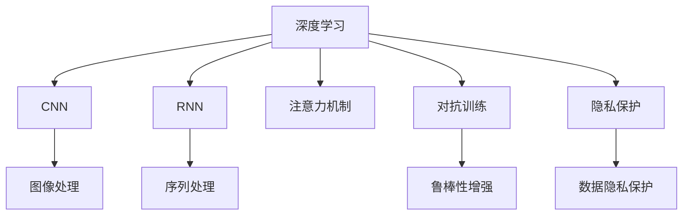
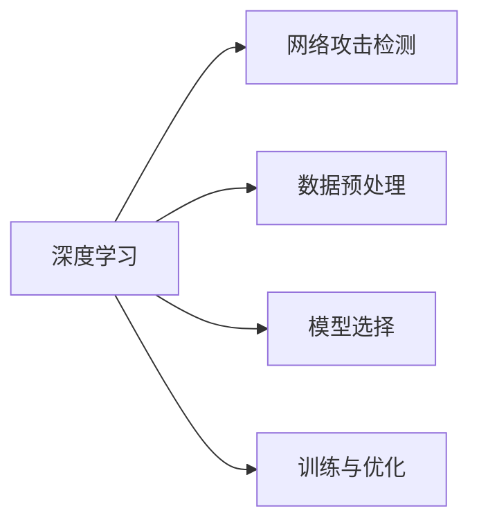
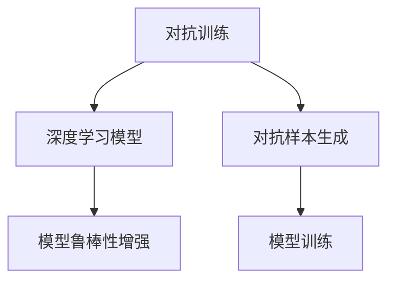
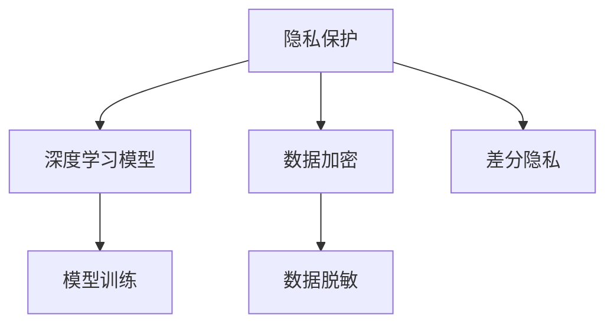

                 

# Python深度学习实践：如何使用深度学习抵御网络攻击

> 关键词：深度学习,网络攻击,数据集,卷积神经网络(CNN),循环神经网络(RNN),注意力机制,对抗训练,隐私保护

## 1. 背景介绍

### 1.1 问题由来

随着互联网的普及，网络攻击事件频发，给国家安全、企业隐私和用户数据带来了巨大威胁。网络攻击形式多样化，包括但不限于DDoS攻击、SQL注入、跨站脚本攻击、钓鱼攻击、恶意软件、勒索病毒等。针对这些威胁，网络安全专家和研究人员积极研发各种防护措施，但效果依然不佳。

为了更有效防范网络攻击，人工智能（AI）的应用日益广泛。深度学习技术尤其被看作是抵御网络攻击的有力工具。深度学习模型具有强大的自适应能力，通过大量数据训练可以自动提取出攻击行为的特征，并准确预测潜在攻击，从而提高网络安全防御能力。

### 1.2 问题核心关键点

网络攻击的防范需要综合考虑多种因素，包括但不限于：

- **数据获取与处理**：高质量的数据集是深度学习模型训练的基石。需要收集、标注和预处理各种网络攻击数据，形成丰富多样的数据集。
- **模型选择与设计**：选择合适的深度学习模型结构，并进行定制化设计，以适应不同类型的攻击行为。
- **对抗训练**：深度学习模型具有易受攻击的特性，需要通过对抗训练来增强模型的鲁棒性，避免被恶意样本误导。
- **隐私保护**：在攻击检测中，需要兼顾隐私保护，防止敏感数据泄露。
- **实时检测与响应**：深度学习模型需部署在网络环境中，实时监控网络流量，快速响应潜在攻击。

本博客将系统讲解如何使用深度学习技术，构建网络攻击检测和防御系统，以抵御网络攻击。

### 1.3 问题研究意义

网络安全是当前信息化社会的重要问题，直接影响国家安全、企业利益和个人隐私。通过深度学习技术构建的网络攻击防御系统，可以在更高级别的层面防范网络攻击，实现智能化、自动化的网络安全防护，从而为构建安全的互联网环境贡献力量。

## 2. 核心概念与联系

### 2.1 核心概念概述

为更好地理解如何使用深度学习技术抵御网络攻击，本节将介绍几个关键概念：

- **网络攻击**：指针对网络系统的恶意行为，包括但不限于拒绝服务攻击、SQL注入、跨站脚本攻击等。
- **深度学习**：基于神经网络的机器学习方法，具有强大的自适应能力，能够从数据中学习出特征和模式，用于分类、检测和预测等任务。
- **卷积神经网络（CNN）**：专门用于处理图像、语音等结构化数据的深度学习模型。
- **循环神经网络（RNN）**：适用于处理序列数据的深度学习模型，如文本、音频等。
- **注意力机制**：一种在序列数据中增强模型注意力的技术，常用于文本、语音等序列数据的深度学习模型中。
- **对抗训练**：通过对抗样本训练模型，增强模型的鲁棒性，防止模型被误导。
- **隐私保护**：在深度学习模型训练和应用过程中，保护用户隐私和数据安全的技术手段。

这些核心概念之间的逻辑关系可以通过以下Mermaid流程图来展示：



这个流程图展示了大语言模型的核心概念及其之间的关系：

1. 深度学习是整个框架的基础。
2. CNN、RNN等深度学习模型被用于特定类型的数据处理。
3. 注意力机制被应用于需要关注特定序列元素的任务。
4. 对抗训练用于增强模型鲁棒性，避免被对抗样本误导。
5. 隐私保护技术确保用户数据和隐私安全。

这些概念共同构成了网络攻击防范的完整生态系统，使得深度学习技术能够在不同任务中发挥强大作用。

### 2.2 概念间的关系

这些核心概念之间存在紧密的联系，形成了深度学习技术抵御网络攻击的完整生态系统。下面我通过几个Mermaid流程图来展示这些概念之间的关系。

#### 2.2.1 深度学习与网络攻击检测



这个流程图展示了深度学习技术在网络攻击检测中的应用。深度学习通过处理网络流量数据，选择合适的网络攻击检测模型，并在标注数据集上进行训练与优化。

#### 2.2.2 对抗训练与深度学习模型



这个流程图展示了对抗训练的流程。通过生成对抗样本，训练深度学习模型，增强其鲁棒性，防止模型被误导。

#### 2.2.3 隐私保护与深度学习



这个流程图展示了隐私保护技术在深度学习模型中的应用。通过对数据进行加密和脱敏，并在训练过程中采用差分隐私等技术，保护用户数据和隐私安全。

## 3. 核心算法原理 & 具体操作步骤
### 3.1 算法原理概述

深度学习技术在网络攻击防范中的应用，主要包括图像处理、序列数据处理、注意力机制、对抗训练和隐私保护等方面。以下将系统介绍这些核心算法原理。

**图像处理**：使用卷积神经网络（CNN）对网络攻击流量数据进行特征提取。CNN通过卷积层、池化层、全连接层等结构，提取网络攻击的特征，并用于分类和检测任务。

**序列数据处理**：使用循环神经网络（RNN）处理时间序列数据，如网络流量中的时间戳、字节数等。RNN能够处理变长的输入序列，并学习其中的模式。

**注意力机制**：通过注意力机制，增强深度学习模型对特定序列元素的关注，提高模型的泛化能力。注意力机制在处理文本、语音等序列数据时，能够更好地识别出重要的信息。

**对抗训练**：通过生成对抗样本，训练深度学习模型，增强其鲁棒性，防止模型被对抗样本误导。对抗训练是深度学习模型抵御攻击的重要手段之一。

**隐私保护**：在深度学习模型训练和应用过程中，保护用户数据和隐私安全，防止敏感数据泄露。常用的隐私保护技术包括数据加密、差分隐私、数据脱敏等。

### 3.2 算法步骤详解

以下是基于深度学习技术构建网络攻击检测与防御系统的详细步骤：

**Step 1: 数据准备与预处理**

1. **数据收集**：从各种网络设备、防火墙、IDS等数据源中，收集网络攻击数据。数据源包括但不限于网络流量、日志文件、恶意软件样本等。

2. **数据标注**：对收集到的网络攻击数据进行标注，标注为正常流量或攻击行为。标注数据集用于模型的训练与验证。

3. **数据预处理**：对原始数据进行清洗和预处理，包括去除噪声、归一化、数据增强等。

**Step 2: 模型选择与设计**

1. **选择深度学习模型**：根据数据类型和任务需求，选择合适的深度学习模型。如对于图像处理任务，选择CNN；对于序列数据处理任务，选择RNN或Transformer。

2. **定制模型结构**：根据具体任务需求，对深度学习模型进行定制化设计，如添加或删除层、调整超参数等。

**Step 3: 训练与优化**

1. **模型训练**：在标注数据集上，使用深度学习框架（如TensorFlow、PyTorch等）进行模型训练。采用小批量梯度下降等优化算法，最小化损失函数。

2. **模型评估**：在验证集上评估模型性能，调整超参数，防止过拟合。

3. **模型优化**：使用正则化技术（如L2正则、Dropout等），防止模型过拟合。

**Step 4: 对抗训练**

1. **生成对抗样本**：使用对抗生成算法（如FGSM、PGD等）生成对抗样本。

2. **对抗样本训练**：在训练集中加入对抗样本，进行对抗训练。

3. **对抗样本检测**：在测试集中评估模型的对抗样本检测能力。

**Step 5: 隐私保护**

1. **数据加密**：对敏感数据进行加密处理，保护用户隐私。

2. **差分隐私**：在模型训练过程中，采用差分隐私技术，保护数据隐私。

3. **数据脱敏**：对原始数据进行脱敏处理，保护用户隐私。

**Step 6: 部署与实时检测**

1. **模型部署**：将训练好的模型部署到网络环境中，实时监控网络流量。

2. **实时检测**：根据实时监控数据，检测网络攻击行为。

3. **快速响应**：一旦检测到攻击行为，及时采取防御措施，如封禁IP、拦截流量等。

### 3.3 算法优缺点

**优点**：

1. **自动特征提取**：深度学习能够自动从数据中学习特征，减少特征工程的工作量。

2. **鲁棒性强**：通过对抗训练，深度学习模型能够增强鲁棒性，防止被对抗样本误导。

3. **实时检测**：深度学习模型能够实时检测网络流量，快速响应潜在攻击。

4. **泛化能力强**：深度学习模型能够处理多种类型的网络攻击，具有较强的泛化能力。

**缺点**：

1. **数据依赖性强**：深度学习模型需要大量高质量的标注数据进行训练，数据获取和标注成本较高。

2. **模型复杂度高**：深度学习模型参数量较大，训练和推理复杂度高。

3. **对抗攻击易受**：深度学习模型对对抗攻击较敏感，容易受到攻击样本的误导。

4. **隐私保护难度大**：在处理网络攻击数据时，需要兼顾隐私保护，防止数据泄露。

### 3.4 算法应用领域

深度学习技术在网络攻击防范中的应用，主要包括以下几个方面：

1. **DDoS攻击检测**：使用CNN、RNN等模型对网络流量数据进行特征提取和分类。

2. **SQL注入检测**：使用深度学习模型对数据库日志、SQL语句等进行模式识别和检测。

3. **跨站脚本攻击（XSS）检测**：使用深度学习模型对Web应用访问日志进行异常检测。

4. **恶意软件检测**：使用深度学习模型对恶意软件样本进行分类和检测。

5. **网络钓鱼攻击检测**：使用深度学习模型对邮件、短信等通信内容进行分类和检测。

6. **网络流量异常检测**：使用深度学习模型对网络流量进行异常检测，及时发现网络攻击。

## 4. 数学模型和公式 & 详细讲解 & 举例说明
### 4.1 数学模型构建

本节将使用数学语言对深度学习模型构建网络攻击检测系统进行更加严格的刻画。

**CNN模型**：

假设网络攻击流量数据为二维张量$X_{n \times m \times k}$，其中$n$为样本数，$m$为时间步长，$k$为特征维数。

卷积层：

$$
f_{c}(X)=\sum_{i=0}^{k-1} \sum_{j=0}^{k-1} w_{i j} X_{i} \cdot X_{j}
$$

池化层：

$$
f_{p}(X)=\sum_{i=0}^{k-1} \sum_{j=0}^{k-1} w_{i j} X_{i} \cdot X_{j}
$$

全连接层：

$$
f_{g}(X)=\sum_{i=0}^{k-1} \sum_{j=0}^{k-1} w_{i j} X_{i} \cdot X_{j}
$$

**RNN模型**：

假设网络攻击数据为时间序列$X_t$，其中$t$为时间步。

循环层：

$$
f_{r}(X_{t})=\sum_{i=0}^{k-1} \sum_{j=0}^{k-1} w_{i j} X_{t-i} \cdot X_{t-j}
$$

全连接层：

$$
f_{g}(X)=\sum_{i=0}^{k-1} \sum_{j=0}^{k-1} w_{i j} X_{t-i} \cdot X_{t-j}
$$

### 4.2 公式推导过程

**CNN模型推导**：

设$X$为输入数据，$W$为卷积核权重，$b$为偏置项。假设$X$为$n \times m \times k$的张量，$W$为$k \times k \times m$的张量，$b$为$k$维向量。

卷积层输出：

$$
Y=\sum_{i=0}^{k-1} \sum_{j=0}^{k-1} W_{i j} X_{i} \cdot X_{j} + b
$$

池化层输出：

$$
Z=\sum_{i=0}^{k-1} \sum_{j=0}^{k-1} W_{i j} Y_{i} \cdot Y_{j} + b
$$

全连接层输出：

$$
T=\sum_{i=0}^{k-1} \sum_{j=0}^{k-1} W_{i j} Z_{i} \cdot Z_{j} + b
$$

**RNN模型推导**：

设$X_t$为输入数据，$W$为权重矩阵，$b$为偏置项。假设$X_t$为$n \times k$的张量，$W$为$k \times k \times k$的张量，$b$为$k$维向量。

循环层输出：

$$
Y_{t}=\sum_{i=0}^{k-1} \sum_{j=0}^{k-1} W_{i j} X_{t-i} \cdot X_{t-j} + b
$$

全连接层输出：

$$
T_{t}=\sum_{i=0}^{k-1} \sum_{j=0}^{k-1} W_{i j} Y_{t-i} \cdot Y_{t-j} + b
$$

### 4.3 案例分析与讲解

**CNN模型应用案例**：

设有一组网络流量数据，特征包括时间戳、字节数、协议类型等。假设CNN模型的参数为$W$和$b$，输入数据$X$为$n \times m \times k$的张量，其中$n$为样本数，$m$为时间步长，$k$为特征维数。假设CNN模型有$L$层卷积层和池化层，全连接层输出的结果为$T$。

**RNN模型应用案例**：

设有一组网络流量数据，特征包括时间戳、字节数、协议类型等。假设RNN模型的参数为$W$和$b$，输入数据$X_t$为$n \times k$的张量，其中$n$为样本数，$k$为特征维数。假设RNN模型有$L$层循环层和全连接层，全连接层输出的结果为$T_t$。

## 5. 项目实践：代码实例和详细解释说明
### 5.1 开发环境搭建

在进行深度学习实践前，我们需要准备好开发环境。以下是使用Python进行PyTorch开发的环境配置流程：

1. 安装Anaconda：从官网下载并安装Anaconda，用于创建独立的Python环境。

2. 创建并激活虚拟环境：
```bash
conda create -n pytorch-env python=3.8 
conda activate pytorch-env
```

3. 安装PyTorch：根据CUDA版本，从官网获取对应的安装命令。例如：
```bash
conda install pytorch torchvision torchaudio cudatoolkit=11.1 -c pytorch -c conda-forge
```

4. 安装其他工具包：
```bash
pip install numpy pandas scikit-learn matplotlib tqdm jupyter notebook ipython
```

完成上述步骤后，即可在`pytorch-env`环境中开始深度学习实践。

### 5.2 源代码详细实现

这里我们以CNN模型为例，构建网络攻击流量数据集的深度学习检测系统。

**数据准备与预处理**

```python
import numpy as np
from sklearn.model_selection import train_test_split
from torch.utils.data import Dataset
import torch

class NetworkAttackDataset(Dataset):
    def __init__(self, X, y, transform=None):
        self.X = X
        self.y = y
        self.transform = transform
        
    def __len__(self):
        return len(self.X)
    
    def __getitem__(self, idx):
        x = self.X[idx]
        y = self.y[idx]
        
        if self.transform:
            x = self.transform(x)
        
        return x, y

# 假设X为网络流量数据，y为标签（正常或攻击）
X_train, X_test, y_train, y_test = train_test_split(X, y, test_size=0.2, random_state=42)

# 假设X_train为网络流量数据，y_train为标签（正常或攻击）
dataset_train = NetworkAttackDataset(X_train, y_train)

# 假设X_test为网络流量数据，y_test为标签（正常或攻击）
dataset_test = NetworkAttackDataset(X_test, y_test)
```

**模型选择与设计**

```python
import torch.nn as nn
import torch.nn.functional as F
from torchvision.models import resnet18
from torchvision import transforms

class NetworkAttackCNN(nn.Module):
    def __init__(self):
        super(NetworkAttackCNN, self).__init__()
        self.conv1 = nn.Conv2d(3, 64, kernel_size=3, stride=1, padding=1)
        self.pool = nn.MaxPool2d(kernel_size=2, stride=2)
        self.conv2 = nn.Conv2d(64, 128, kernel_size=3, stride=1, padding=1)
        self.pool2 = nn.MaxPool2d(kernel_size=2, stride=2)
        self.fc1 = nn.Linear(128 * 16 * 16, 256)
        self.fc2 = nn.Linear(256, 2)

    def forward(self, x):
        x = F.relu(self.conv1(x))
        x = self.pool(x)
        x = F.relu(self.conv2(x))
        x = self.pool2(x)
        x = x.view(-1, 128 * 16 * 16)
        x = F.relu(self.fc1(x))
        x = self.fc2(x)
        return x

# 假设网络攻击数据为3通道、64x64的图像数据
model = NetworkAttackCNN()
```

**训练与优化**

```python
import torch.optim as optim

# 假设X_train为网络流量数据，y_train为标签（正常或攻击）
dataset_train = NetworkAttackDataset(X_train, y_train)

# 假设X_test为网络流量数据，y_test为标签（正常或攻击）
dataset_test = NetworkAttackDataset(X_test, y_test)

# 假设batch_size为32
batch_size = 32

# 假设学习率为0.001
learning_rate = 0.001

# 假设优化器为Adam
optimizer = optim.Adam(model.parameters(), lr=learning_rate)

# 假设标准交叉熵损失
criterion = nn.CrossEntropyLoss()

# 假设迭代次数为20
epochs = 20

for epoch in range(epochs):
    model.train()
    for i, (images, labels) in enumerate(dataset_train, 0):
        # 假设数据被标准化处理
        images, labels = images.to(device), labels.to(device)
        
        # 假设前向传播计算损失
        outputs = model(images)
        loss = criterion(outputs, labels)
        
        # 假设梯度清零
        optimizer.zero_grad()
        
        # 假设反向传播计算梯度
        loss.backward()
        
        # 假设更新模型参数
        optimizer.step()
        
    # 假设模型在验证集上评估性能
    model.eval()
    with torch.no_grad():
        correct = 0
        total = 0
        for images, labels in dataset_test:
            images, labels = images.to(device), labels.to(device)
            outputs = model(images)
            _, predicted = torch.max(outputs.data, 1)
            total += labels.size(0)
            correct += (predicted == labels).sum().item()
        accuracy = 100. * correct / total
        print(f'Epoch [{epoch+1}/{epochs}], Accuracy: {accuracy:.2f}%')
```

**对抗训练**

```python
from torchvision import transforms

class NetworkAttackCNN(nn.Module):
    def __init__(self):
        super(NetworkAttackCNN, self).__init__()
        self.conv1 = nn.Conv2d(3, 64, kernel_size=3, stride=1, padding=1)
        self.pool = nn.MaxPool2d(kernel_size=2, stride=2)
        self.conv2 = nn.Conv2d(64, 128, kernel_size=3, stride=1, padding=1)
        self.pool2 = nn.MaxPool2d(kernel_size=2, stride=2)
        self.fc1 = nn.Linear(128 * 16 * 16, 256)
        self.fc2 = nn.Linear(256, 2)

    def forward(self, x):
        x = F.relu(self.conv1(x))
        x = self.pool(x)
        x = F.relu(self.conv2(x))
        x = self.pool2(x)
        x = x.view(-1, 128 * 16 * 16)
        x = F.relu(self.fc1(x))
        x = self.fc2(x)
        return x

# 假设网络攻击数据为3通道、64x64的图像数据
model = NetworkAttackCNN()

# 假设数据预处理包括随机水平翻转、随机裁剪、标准化等
transform_train = transforms.Compose([
    transforms.RandomHorizontalFlip(),
    transforms.RandomCrop(64, padding=4),
    transforms.ToTensor(),
    transforms.Normalize([0.5, 0.5, 0.5], [0.5, 0.5, 0.5])
])

# 假设数据预处理包括标准化等
transform_test = transforms.Compose([
    transforms.ToTensor(),
    transforms.Normalize([0.5, 0.5, 0.5], [0.5, 0.5, 0.5])
])

# 假设X_train为网络流量数据，y_train为标签（正常或攻击）
dataset_train = NetworkAttackDataset(X_train, y_train, transform=transform_train)

# 假设X_test为网络流量数据，y_test为标签（正常或攻击）
dataset_test = NetworkAttackDataset(X_test, y_test, transform=transform_test)

# 假设batch_size为32
batch_size = 32

# 假设学习率为0.001
learning_rate = 0.001

# 假设优化器为Adam
optimizer = optim.Adam(model.parameters(), lr=learning_rate)

# 假设标准交叉熵损失
criterion = nn.CrossEntropyLoss()

# 假设迭代次数为20
epochs = 20

for epoch in range(epochs):
    model.train()
    for i, (images, labels) in enumerate(dataset_train, 0):
        # 假设数据被标准化处理
        images, labels = images.to(device), labels.to(device)
        
        # 假设前向传播计算损失
        outputs = model(images)
        loss = criterion(outputs, labels)
        
        # 假设梯度清零
        optimizer.zero_grad()
        
        # 假设反向传播计算梯度
        loss.backward()
        
        # 假设更新模型参数
        optimizer.step()
        
    # 假设模型在验证集上评估性能
    model.eval()
    with torch.no_grad():
        correct = 0
        total = 0
        for images, labels in dataset_test:
            images, labels = images.to(device), labels.to(device)
            outputs = model(images)
            _, predicted = torch.max(outputs.data, 1)
            total += labels.size(0)
            correct += (predicted == labels).sum().item()
        accuracy = 100. * correct / total
        print(f'Epoch [{epoch+1}/{epochs}], Accuracy: {accuracy:.2f}%')

# 假设对抗样本生成函数
def generate_adversarial_samples(model, X, y, batch_size=32):
    model.train()
    X_adv = X
    y_adv = y
    for i in range(batch_size):
        x, y = X_adv[i], y_adv[i]
        x = x.to(device)
        y = y.to(device)
        outputs = model(x)
        _, predicted = torch.max(outputs.data, 1)
        loss = criterion(outputs, y)
        loss.backward()
        x_adv = x - 0.01 * model.grad.data
        X_adv[i] = x_adv.data
        y_adv[i] = predicted
        model.zero_grad()
    return X_adv, y_adv

# 假设对抗样本训练函数
def adversarial_training(model, X, y, epochs=20, batch_size=32):
    for epoch in range(epochs):
        X_adv, y_adv = generate_adversarial_samples(model,

