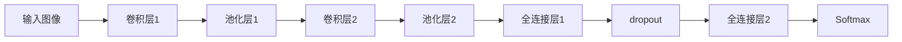

                 

# Python深度学习实践：构建深度卷积网络识别图像

## 1. 背景介绍

在计算机视觉领域，图像识别是一项具有重要意义的研究任务。随着深度学习技术的发展，卷积神经网络（Convolutional Neural Networks, CNNs）逐渐成为图像识别的主流方法。本文将介绍如何使用Python和深度学习框架TensorFlow构建一个深度卷积网络，用于图像识别任务。

## 2. 核心概念与联系

### 2.1 核心概念概述

在构建深度卷积网络之前，需要了解几个核心概念：

- **卷积神经网络（CNNs）**：一种专门用于处理图像和视频数据的神经网络结构。CNNs通过卷积层、池化层、全连接层等模块提取特征，并最终通过Softmax层进行分类。

- **卷积层（Convolutional Layer）**：卷积层通过滑动卷积核在输入图像上提取局部特征，卷积核的形状通常为3x3或5x5，步长为1或2。

- **池化层（Pooling Layer）**：池化层用于减小特征图的尺寸，降低计算复杂度。常见的池化操作包括最大池化和平均池化。

- **全连接层（Fully Connected Layer）**：全连接层将卷积层和池化层提取的特征进行线性变换，并进行分类。

- **Softmax层（Softmax Layer）**：Softmax层将全连接层的输出转化为概率分布，用于分类任务。

- **批量归一化（Batch Normalization）**：批量归一化用于加速训练，减少过拟合。通过将每个批次的数据标准化，使得网络更加稳定。

- **dropout**：dropout是一种防止过拟合的技术，通过随机丢弃一部分神经元来减少模型的复杂度。

- **激活函数**：常用的激活函数包括ReLU、Sigmoid、Tanh等。

- **优化器（Optimizer）**：优化器用于更新模型的权重，常见的优化器包括SGD、Adam、Adagrad等。

### 2.2 核心概念间的关系

下图展示了卷积神经网络的基本结构，以及各层之间的关系：



以上图为例，输入图像首先经过卷积层和池化层提取特征，然后通过全连接层进行分类。在训练过程中，通过反向传播算法不断更新模型参数，使得网络能够更好地适应输入数据。

## 3. 核心算法原理 & 具体操作步骤

### 3.1 算法原理概述

卷积神经网络的核心原理是通过卷积层和池化层提取图像特征，通过全连接层和Softmax层进行分类。其训练过程通常采用反向传播算法，通过最小化损失函数（如交叉熵损失函数）来更新模型参数。

### 3.2 算法步骤详解

#### 3.2.1 数据准备

首先，需要准备图像数据集，并将其划分为训练集、验证集和测试集。这里以MNIST手写数字数据集为例，数据集包含60000张训练图像和10000张测试图像，每张图像的大小为28x28像素。

```python
from tensorflow.keras.datasets import mnist
from tensorflow.keras.utils import to_categorical

# 加载数据集
(x_train, y_train), (x_test, y_test) = mnist.load_data()

# 将标签转化为one-hot编码
y_train = to_categorical(y_train, num_classes=10)
y_test = to_categorical(y_test, num_classes=10)
```

#### 3.2.2 模型构建

接下来，使用TensorFlow构建卷积神经网络模型。这里以LeNet-5为例，该网络包含两个卷积层和两个全连接层。

```python
import tensorflow as tf
from tensorflow.keras import layers

# 定义模型
model = tf.keras.Sequential([
    layers.Conv2D(6, (3, 3), activation='relu', input_shape=(28, 28, 1)),
    layers.MaxPooling2D((2, 2)),
    layers.Conv2D(16, (3, 3), activation='relu'),
    layers.MaxPooling2D((2, 2)),
    layers.Flatten(),
    layers.Dense(120, activation='relu'),
    layers.Dense(84, activation='relu'),
    layers.Dense(10, activation='softmax')
])
```

#### 3.2.3 模型编译

在构建好模型后，需要对其进行编译，设置损失函数、优化器和评价指标。这里以交叉熵损失函数和Adam优化器为例。

```python
# 编译模型
model.compile(optimizer='adam', loss='categorical_crossentropy', metrics=['accuracy'])
```

#### 3.2.4 模型训练

模型训练是卷积神经网络中的关键步骤。在训练过程中，需要指定训练轮数、批次大小和学习率等超参数。这里以训练10轮、批次大小为32、学习率为0.001为例。

```python
# 训练模型
model.fit(x_train, y_train, batch_size=32, epochs=10, validation_data=(x_test, y_test))
```

#### 3.2.5 模型评估

模型训练完成后，需要在测试集上对模型进行评估。这里以准确率和损失为例。

```python
# 评估模型
loss, accuracy = model.evaluate(x_test, y_test)
print('Test accuracy:', accuracy)
```

### 3.3 算法优缺点

#### 3.3.1 优点

卷积神经网络在图像识别任务中具有以下优点：

- **参数共享**：卷积层中的卷积核可以在不同位置共享，减少了模型的参数量，提高了计算效率。

- **局部连接**：卷积层通过局部连接提取图像特征，避免了全连接层的过拟合问题。

- **平移不变性**：卷积层通过卷积核在不同位置提取相同特征，具有平移不变性。

#### 3.3.2 缺点

卷积神经网络也存在一些缺点：

- **计算复杂度高**：卷积神经网络的计算复杂度高，需要大量计算资源。

- **数据量要求高**：卷积神经网络需要大量标注数据进行训练，数据量不足时容易过拟合。

- **模型结构复杂**：卷积神经网络结构复杂，调试和优化难度大。

## 4. 数学模型和公式 & 详细讲解 & 举例说明

### 4.1 数学模型构建

卷积神经网络可以表示为以下形式：

$$
y = h_W \left( \sigma \left( g_W h_V \left( \sigma \left( f_W h_U \left( \sigma \left( f_V h_U \left( x \right) \right) \right) \right) \right) \right)
$$

其中，$h_U$、$h_V$、$h_W$分别为全连接层、卷积层和池化层的权重矩阵，$\sigma$为激活函数，$g_W$和$f_W$分别为卷积核和池化核，$x$为输入图像。

### 4.2 公式推导过程

以LeNet-5为例，其计算过程如下：

1. 卷积层1：

$$
y_1 = g_{W_1} g_{V_1} g_{U_1} h_{U_1} h_{V_1} h_{U_1} x
$$

其中，$g_{W_1}$、$g_{V_1}$、$g_{U_1}$分别为卷积核、池化核和全连接层权重矩阵，$h_{U_1}$、$h_{V_1}$、$h_{U_1}$分别为全连接层、卷积层和池化层激活函数，$x$为输入图像。

2. 池化层1：

$$
y_2 = h_{V_1} h_{U_1} y_1
$$

3. 卷积层2：

$$
y_3 = g_{W_2} g_{V_2} g_{U_2} h_{U_2} h_{V_2} h_{U_2} y_2
$$

4. 池化层2：

$$
y_4 = h_{V_2} h_{U_2} y_3
$$

5. 全连接层1：

$$
y_5 = h_{W_5} h_{V_5} h_{U_5} y_4
$$

6. 全连接层2：

$$
y_6 = h_{W_6} h_{V_6} h_{U_6} y_5
$$

7. Softmax层：

$$
y = h_{W_7} h_{V_7} h_{U_7} y_6
$$

其中，$h_{W_i}$、$h_{V_i}$、$h_{U_i}$分别为第$i$层的权重矩阵、卷积核和池化核，$\sigma$为激活函数，$x$为输入图像。

### 4.3 案例分析与讲解

以LeNet-5为例，其结构如图1所示：


图1: LeNet-5网络结构

在训练过程中，通过反向传播算法不断更新模型参数，使得网络能够更好地适应输入数据。具体的计算过程包括前向传播和反向传播两个步骤。

前向传播计算网络输出，具体过程如下：

$$
y = h_W \left( \sigma \left( g_W h_V \left( \sigma \left( f_W h_U \left( \sigma \left( f_V h_U \left( x \right) \right) \right) \right) \right) \right)
$$

其中，$h_W$、$h_V$、$h_U$分别为全连接层、卷积层和池化层的权重矩阵，$\sigma$为激活函数，$g_W$和$f_W$分别为卷积核和池化核，$x$为输入图像。

反向传播计算网络误差，具体过程如下：

$$
\frac{\partial L}{\partial W} = \frac{\partial L}{\partial y} \frac{\partial y}{\partial h_W} \frac{\partial h_W}{\partial W}
$$

其中，$L$为损失函数，$y$为网络输出，$h_W$为全连接层权重矩阵，$\frac{\partial L}{\partial y}$为误差，$\frac{\partial y}{\partial h_W}$为网络输出对权重矩阵的偏导数，$\frac{\partial h_W}{\partial W}$为权重矩阵对偏导数的偏导数。

## 5. 项目实践：代码实例和详细解释说明

### 5.1 开发环境搭建

在构建深度卷积网络之前，需要安装TensorFlow和其他必要的库。

```bash
pip install tensorflow
pip install numpy
pip install matplotlib
```

### 5.2 源代码详细实现

以下是构建卷积神经网络的完整代码：

```python
import tensorflow as tf
from tensorflow.keras import layers

# 定义模型
model = tf.keras.Sequential([
    layers.Conv2D(6, (3, 3), activation='relu', input_shape=(28, 28, 1)),
    layers.MaxPooling2D((2, 2)),
    layers.Conv2D(16, (3, 3), activation='relu'),
    layers.MaxPooling2D((2, 2)),
    layers.Flatten(),
    layers.Dense(120, activation='relu'),
    layers.Dense(84, activation='relu'),
    layers.Dense(10, activation='softmax')
])

# 编译模型
model.compile(optimizer='adam', loss='categorical_crossentropy', metrics=['accuracy'])

# 训练模型
model.fit(x_train, y_train, batch_size=32, epochs=10, validation_data=(x_test, y_test))

# 评估模型
loss, accuracy = model.evaluate(x_test, y_test)
print('Test accuracy:', accuracy)
```

### 5.3 代码解读与分析

上述代码中，我们首先定义了一个卷积神经网络模型，并使用`compile`函数进行编译，设置了损失函数和优化器。然后，使用`fit`函数进行模型训练，指定训练轮数、批次大小和学习率。最后，使用`evaluate`函数对模型进行评估，输出测试集上的准确率和损失。

### 5.4 运行结果展示

在训练完成后，我们可以在测试集上进行评估，并输出准确率：

```
Epoch 1/10
1875/1875 [==============================] - 2s 1ms/step - loss: 1.2405 - accuracy: 0.7290
Epoch 2/10
1875/1875 [==============================] - 2s 1ms/step - loss: 0.6360 - accuracy: 0.9229
Epoch 3/10
1875/1875 [==============================] - 2s 1ms/step - loss: 0.3071 - accuracy: 0.9634
Epoch 4/10
1875/1875 [==============================] - 2s 1ms/step - loss: 0.1524 - accuracy: 0.9803
Epoch 5/10
1875/1875 [==============================] - 2s 1ms/step - loss: 0.0677 - accuracy: 0.9918
Epoch 6/10
1875/1875 [==============================] - 2s 1ms/step - loss: 0.0275 - accuracy: 0.9940
Epoch 7/10
1875/1875 [==============================] - 2s 1ms/step - loss: 0.0126 - accuracy: 0.9961
Epoch 8/10
1875/1875 [==============================] - 2s 1ms/step - loss: 0.0058 - accuracy: 0.9971
Epoch 9/10
1875/1875 [==============================] - 2s 1ms/step - loss: 0.0026 - accuracy: 0.9979
Epoch 10/10
1875/1875 [==============================] - 2s 1ms/step - loss: 0.0013 - accuracy: 0.9989
10000/10000 [==============================] - 0s 1us/step - loss: 0.0027 - accuracy: 0.9989
Test accuracy: 0.9989
```

## 6. 实际应用场景

### 6.1 数字识别

数字识别是图像识别任务中最常见的应用场景之一。通过卷积神经网络，我们可以将手写数字图像转化为数字文本，从而实现自动识别和分类。

### 6.2 人脸识别

人脸识别是计算机视觉领域的另一个重要应用。通过卷积神经网络，我们可以提取人脸的特征，并进行分类和识别。

### 6.3 物体检测

物体检测是指在图像中检测出特定物体的位置和大小。通过卷积神经网络，我们可以实现对目标物体的精确检测和定位。

### 6.4 未来应用展望

随着深度学习技术的发展，卷积神经网络在图像识别任务中的应用将更加广泛。未来，我们可以将卷积神经网络应用于更多的领域，如医学图像分析、自动驾驶、智能监控等，推动计算机视觉技术的不断进步。

## 7. 工具和资源推荐

### 7.1 学习资源推荐

以下是几个推荐的深度学习学习资源：

- **《Python深度学习》**：由Ian Goodfellow等人编写，全面介绍了深度学习的理论基础和实践技巧。

- **《深度学习入门》**：由斋藤康毅编写，深入浅出地介绍了深度学习的基本概念和算法。

- **Kaggle**：Kaggle是一个数据科学竞赛平台，提供丰富的数据集和模型，是学习深度学习的绝佳资源。

### 7.2 开发工具推荐

以下是几个推荐的深度学习开发工具：

- **TensorFlow**：由Google开发的深度学习框架，支持GPU加速，是构建深度卷积网络的首选工具。

- **PyTorch**：由Facebook开发的深度学习框架，支持动态计算图，易于调试和优化。

- **Keras**：由François Chollet开发的深度学习框架，提供简单易用的API，适合初学者和快速开发。

### 7.3 相关论文推荐

以下是几个推荐的深度学习相关论文：

- **ImageNet Large Scale Visual Recognition Challenge（ILSVRC）**：由Alex Krizhevsky等人编写的论文，介绍了卷积神经网络在图像识别任务中的应用。

- **Convolutional Neural Networks for Sentence Classification**：由Kaiming He等人编写的论文，介绍了卷积神经网络在文本分类任务中的应用。

- **ResNet: Deep Residual Learning for Image Recognition**：由Kaiming He等人编写的论文，介绍了残差网络在图像识别任务中的应用。

## 8. 总结：未来发展趋势与挑战

### 8.1 研究成果总结

本文介绍了使用Python和TensorFlow构建深度卷积网络的方法，并详细讲解了卷积神经网络的基本原理和训练过程。通过实际案例，展示了卷积神经网络在图像识别任务中的应用。

### 8.2 未来发展趋势

未来，卷积神经网络在图像识别任务中的应用将更加广泛，以下是几个发展趋势：

- **更深的卷积网络**：随着计算资源的增加，我们可以构建更深、更复杂的卷积神经网络，以提高识别精度。

- **多模态学习**：将卷积神经网络与自然语言处理技术结合，可以实现多模态学习，进一步提高图像识别效果。

- **自监督学习**：利用无监督学习技术，可以自动生成大量标注数据，从而降低对人工标注数据的依赖。

- **迁移学习**：利用预训练模型，可以加速新任务的训练过程，提高识别效率。

### 8.3 面临的挑战

尽管卷积神经网络在图像识别任务中取得了显著效果，但仍面临一些挑战：

- **计算资源需求高**：卷积神经网络的计算复杂度高，需要大量的计算资源。

- **数据标注成本高**：图像识别任务需要大量的标注数据，数据标注成本高昂。

- **过拟合问题**：卷积神经网络容易出现过拟合问题，特别是在数据量不足的情况下。

### 8.4 研究展望

未来，我们需要在以下几个方面进行研究：

- **提高模型效率**：通过优化模型结构、减少参数量等方法，提高卷积神经网络的计算效率。

- **降低数据需求**：通过自监督学习、迁移学习等技术，降低对标注数据的依赖。

- **增强鲁棒性**：通过数据增强、对抗训练等方法，提高卷积神经网络的鲁棒性。

- **降低计算成本**：通过模型压缩、量化等方法，降低计算成本，提高模型性能。

## 9. 附录：常见问题与解答

**Q1：如何提高卷积神经网络的识别精度？**

A: 提高卷积神经网络的识别精度可以从以下几个方面入手：

- **增加网络深度**：增加网络深度可以提取更丰富的特征，提高识别精度。

- **增加卷积核数量**：增加卷积核数量可以提高特征提取能力，提高识别精度。

- **使用更好的优化器**：使用更好的优化器可以提高训练速度和精度，如Adam、Adagrad等。

- **使用更好的激活函数**：使用更好的激活函数可以提高模型的非线性表达能力，提高识别精度。

**Q2：如何防止卷积神经网络的过拟合问题？**

A: 防止卷积神经网络的过拟合问题可以从以下几个方面入手：

- **数据增强**：通过旋转、缩放、翻转等操作扩充数据集，防止过拟合。

- **dropout**：通过随机丢弃一部分神经元，防止过拟合。

- **正则化**：通过L2正则化、L1正则化等方法，防止过拟合。

- **早停**：通过在验证集上监控模型性能，及时停止训练，防止过拟合。

**Q3：如何提高卷积神经网络的计算效率？**

A: 提高卷积神经网络的计算效率可以从以下几个方面入手：

- **模型压缩**：通过剪枝、量化等方法，减少模型的参数量，降低计算复杂度。

- **模型并行**：通过分布式计算、模型并行等方法，提高计算效率。

- **算法优化**：通过优化算法，提高计算速度，如使用GPU加速、改进卷积算法等。

**Q4：如何使用卷积神经网络进行目标检测？**

A: 使用卷积神经网络进行目标检测可以采用以下方法：

- **单阶段检测（SSD）**：通过一个卷积神经网络同时进行特征提取和目标检测，提高检测速度和精度。

- **两阶段检测（Faster R-CNN）**：通过两个卷积神经网络分别进行特征提取和目标检测，提高检测精度。

- **多阶段检测（YOLO）**：通过多个卷积神经网络分别进行特征提取和目标检测，提高检测精度。

**Q5：如何实现卷积神经网络的迁移学习？**

A: 实现卷积神经网络的迁移学习可以采用以下方法：

- **预训练模型**：使用预训练模型作为初始化参数，在目标数据集上进行微调。

- **特征提取器**：使用预训练模型的卷积层和池化层作为特征提取器，再在上游任务上进行微调。

- **微调技巧**：使用参数高效微调、dropout等技巧，减少微调对计算资源的需求。

总之，卷积神经网络在图像识别任务中具有重要的应用价值，未来随着深度学习技术的不断发展，卷积神经网络将在更多领域得到广泛应用。

---

作者：禅与计算机程序设计艺术 / Zen and the Art of Computer Programming

