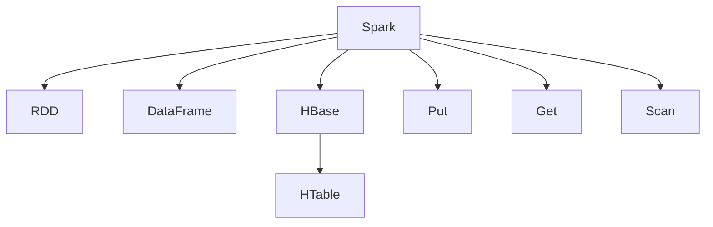

                 

## 1. 背景介绍

在当前的互联网时代，数据量呈指数级增长，对数据处理和存储的需求也在不断增加。Hadoop和Spark等大数据技术已经广泛应用，成为了处理大规模数据的重要工具。HBase作为Hadoop生态系统的一部分，提供了一种高可靠、高性能的列式数据库，可以高效存储和查询结构化数据。然而，HBase主要用于离线存储和批处理，不适用于实时数据处理和分析。Spark作为Spark生态系统的一部分，提供了快速、灵活的大数据处理框架，可以支持流处理、实时计算和交互式查询等。

因此，将HBase和Spark结合起来，可以充分利用两种技术的优势，实现更高效、更灵活的数据处理和存储。Spark-HBase整合是指通过Spark访问和操作HBase中的数据，将HBase和Spark的功能结合起来，形成一个强大的数据处理平台。这种整合方式可以应用于多个领域，如实时数据处理、数据分析、机器学习等。

## 2. 核心概念与联系

### 2.1 核心概念概述

在Spark-HBase整合中，需要涉及多个核心概念，包括Spark、HBase、RDD、HTables、Put、Get、Scan等。以下是这些核心概念的概述：

- **Spark**：Apache Spark是一个快速、通用、可扩展的大数据处理框架，支持批处理、流处理、机器学习和图形处理等多种计算类型。Spark通过RDD和DataFrame两种抽象方式来处理数据。

- **HBase**：Apache HBase是一个高可靠性、高性能的分布式列式数据库，可以高效存储和查询结构化数据。HBase采用Hadoop分布式文件系统（HDFS）作为底层存储，并支持高并发、低延迟的读写操作。

- **RDD**：Resilient Distributed Dataset是Spark的核心抽象，表示一个分布式数据集合。RDD可以在分布式集群上高效地进行数据处理和计算。

- **HTable**：HBase中的表结构，类似于关系型数据库中的表。HTable由多个列族（Column Family）组成，每个列族包含多个列（Column）。

- **Put**：向HBase中写入数据的操作。Put操作的参数包括行键（Row Key）、列族名、列名和值等。

- **Get**：从HBase中读取数据的操作。Get操作的参数包括行键、列族名和列名等。

- **Scan**：从HBase中读取多行数据的操作。Scan操作的参数包括起始行键、终止行键、列族名、列名和过滤条件等。

### 2.2 核心概念的关系

这些核心概念之间的关系可以通过以下Mermaid流程图来展示：



这个流程图展示了Spark和HBase之间的主要操作关系。Spark通过RDD和DataFrame两种方式来操作HBase中的数据，包括向HBase中写入数据（Put操作）、从HBase中读取数据（Get和Scan操作）。HBase中的表结构（HTable）包含多个列族和列，列族名和列名作为Get和Scan操作的参数，定义了查询的具体列。

## 3. 核心算法原理 & 具体操作步骤

### 3.1 算法原理概述

Spark-HBase整合的核心算法原理是将HBase中的HTable数据结构映射到Spark中的RDD或DataFrame中，实现数据的灵活操作。具体来说，Spark中的RDD或DataFrame可以看作是一个分布式数据集，其中的每个元素都是一个键值对。HBase中的列族和列可以看作是一个多维的键值对结构，每个列族包含多个列，每个列包含一个或多个键值对。

在Spark-HBase整合中，Spark通过Put操作将数据写入HBase中，通过Get和Scan操作从HBase中读取数据。Put操作将RDD或DataFrame中的每个元素（键值对）映射为一个HBase的Put操作，其中键为行键，值为列族名和列名及值。Get和Scan操作通过指定的列族名和列名来从HBase中读取数据，并将数据映射为Spark中的RDD或DataFrame。

### 3.2 算法步骤详解

以下是一个详细的Spark-HBase整合的算法步骤：

1. **创建Spark会话**：首先创建一个Spark会话，并配置Spark和HBase的基本参数，如Spark的配置文件和HBase的连接参数。

2. **创建HBase客户端**：通过HBase的API创建HBase客户端，连接到HBase集群。

3. **创建HTable**：通过HBase客户端创建一个HTable对象，指定HTable的名称和配置。

4. **写入数据到HBase**：将Spark中的RDD或DataFrame中的数据通过Put操作写入HBase中的HTable。

5. **读取数据从HBase**：通过Get和Scan操作从HBase中的HTable中读取数据，并将数据映射为Spark中的RDD或DataFrame。

6. **操作数据**：在Spark中对RDD或DataFrame中的数据进行各种操作，如过滤、排序、聚合等。

7. **写入数据到HBase**：将Spark中的RDD或DataFrame中的数据通过Put操作写入HBase中的HTable。

8. **读取数据从HBase**：通过Get和Scan操作从HBase中的HTable中读取数据，并将数据映射为Spark中的RDD或DataFrame。

### 3.3 算法优缺点

Spark-HBase整合的优点包括：

- **高效的数据处理**：Spark-HBase整合可以充分利用Spark和HBase的优势，实现高效的数据处理和存储。

- **灵活的数据操作**：Spark中的RDD和DataFrame提供了丰富的数据操作，可以灵活地进行数据处理和分析。

- **高可用性和扩展性**：Spark和HBase都是分布式系统，具有高可用性和扩展性，可以处理大规模数据。

然而，Spark-HBase整合也存在一些缺点：

- **复杂性高**：Spark-HBase整合涉及多个组件和操作，需要较高的技术水平和经验。

- **性能瓶颈**：在数据写入和读取过程中，可能会出现性能瓶颈，需要优化数据传输和存储。

- **数据一致性问题**：在写入数据时，可能会出现数据一致性问题，需要进行优化和处理。

### 3.4 算法应用领域

Spark-HBase整合可以应用于多个领域，包括：

- **大数据分析**：通过Spark和HBase的整合，可以对大规模数据进行高效的数据分析和处理，如数据挖掘、统计分析和机器学习等。

- **实时数据处理**：通过Spark和HBase的整合，可以实现实时数据处理和流处理，如实时监控和实时分析等。

- **分布式存储**：通过Spark和HBase的整合，可以实现分布式存储和数据备份，保障数据安全和可靠性。

## 4. 数学模型和公式 & 详细讲解 & 举例说明

### 4.1 数学模型构建

Spark-HBase整合的数学模型可以表示为：

$$ RDD \rightarrow HTable $$

其中，$RDD$为Spark中的分布式数据集，$HTable$为HBase中的表结构。

### 4.2 公式推导过程

Spark中的RDD和DataFrame可以通过Put操作将数据写入HBase中的HTable。Put操作的参数包括行键（Row Key）、列族名（Column Family）、列名（Column Name）和值（Value）。Put操作的语法如下：

$$ Put(Row Key, Column Family, Column Name, Value) $$

例如，以下Python代码将RDD中的数据写入HBase中的HTable：

```python
from pyspark import SparkConf, SparkContext
from pyspark.sql import SparkSession
from pyspark.sql.functions import col

conf = SparkConf().setAppName("Spark-HBase Integration")
sc = SparkContext(conf=conf)
spark = SparkSession(sc)

# 创建HBase客户端
hbase = HBaseClient()

# 创建HTable
table_name = "my_table"
table = hbase.create_table(table_name, "cf1", "cf2", "cf3")

# 创建RDD
rdd = sc.parallelize([(1, "Value1"), (2, "Value2"), (3, "Value3")])

# 写入数据到HBase
rdd.foreach(lambda x: hbase.put("RowKey", "cf1", "col1", x[0]))

# 读取数据从HBase
rdd = hbase.get("RowKey", "cf1", "col1")
for row in rdd:
    print(row)

# 关闭HBase客户端
hbase.close()
```

### 4.3 案例分析与讲解

以下是一个具体的Spark-HBase整合案例，以展示如何使用Spark和HBase进行数据处理和分析。

假设我们有一个包含销售数据的RDD，我们需要在HBase中存储和查询这些数据，并进行数据分析。具体步骤如下：

1. **创建Spark会话和HBase客户端**：

```python
from pyspark import SparkConf, SparkContext
from pyspark.sql import SparkSession
from pyspark.sql.functions import col
from pyspark.sql.types import IntegerType, StringType
from pyhdfs import HdfsClient

conf = SparkConf().setAppName("Spark-HBase Integration")
sc = SparkContext(conf=conf)
spark = SparkSession(sc)

# 创建HBase客户端
hbase = HBaseClient()

# 创建HTable
table_name = "sales_data"
table = hbase.create_table(table_name, "cf1", "cf2", "cf3")

# 创建HDFS客户端
hdfs = HdfsClient()
```

2. **读取销售数据**：

```python
# 读取销售数据
data_path = "hdfs://localhost:9000/user/hadoop/input/sales_data"
rdd = hdfs.read_file(data_path)
data = rdd.collect()
```

3. **创建RDD**：

```python
# 创建RDD
data_rdd = rdd.map(lambda x: (int(x.split(",")[0]), float(x.split(",")[1]), float(x.split(",")[2]), x.split(",")[3]))
data_rdd = data_rdd.toDF(columns=["key", "value1", "value2", "value3"])
```

4. **将RDD写入HBase**：

```python
# 将RDD写入HBase
data_rdd.foreach(lambda x: hbase.put("RowKey", "cf1", "col1", str(x[0])))
```

5. **从HBase中读取数据**：

```python
# 从HBase中读取数据
data_rdd = hbase.get("RowKey", "cf1", "col1")
for row in data_rdd:
    print(row)
```

6. **进行数据分析**：

```python
# 进行数据分析
data_rdd.groupBy("key").count().write.csv("hdfs://localhost:9000/user/hadoop/output/sales_analysis")
```

## 5. 项目实践：代码实例和详细解释说明

### 5.1 开发环境搭建

在进行Spark-HBase整合的实践前，我们需要准备好开发环境。以下是使用Python进行Spark和HBase开发的环境配置流程：

1. 安装Anaconda：从官网下载并安装Anaconda，用于创建独立的Python环境。

2. 创建并激活虚拟环境：
```bash
conda create -n spark-hbase-env python=3.8 
conda activate spark-hbase-env
```

3. 安装Spark：根据CUDA版本，从官网获取对应的安装命令。例如：
```bash
conda install pyarrow==1.0.1
```

4. 安装HBase：
```bash
pip install pyhbase
```

5. 安装PySpark：
```bash
pip install pyspark
```

6. 安装相关库：
```bash
pip install pyhdfs hdfs-client
```

完成上述步骤后，即可在`spark-hbase-env`环境中开始Spark-HBase整合的实践。

### 5.2 源代码详细实现

以下是一个完整的Spark-HBase整合的Python代码实现：

```python
from pyspark import SparkConf, SparkContext
from pyspark.sql import SparkSession
from pyspark.sql.functions import col
from pyspark.sql.types import IntegerType, StringType
from pyhdfs import HdfsClient
from pyhbase import HBaseClient

conf = SparkConf().setAppName("Spark-HBase Integration")
sc = SparkContext(conf=conf)
spark = SparkSession(sc)

# 创建HBase客户端
hbase = HBaseClient()

# 创建HTable
table_name = "sales_data"
table = hbase.create_table(table_name, "cf1", "cf2", "cf3")

# 创建HDFS客户端
hdfs = HdfsClient()

# 读取销售数据
data_path = "hdfs://localhost:9000/user/hadoop/input/sales_data"
rdd = hdfs.read_file(data_path)
data = rdd.collect()

# 创建RDD
data_rdd = rdd.map(lambda x: (int(x.split(",")[0]), float(x.split(",")[1]), float(x.split(",")[2]), x.split(",")[3]))
data_rdd = data_rdd.toDF(columns=["key", "value1", "value2", "value3"])

# 将RDD写入HBase
data_rdd.foreach(lambda x: hbase.put("RowKey", "cf1", "col1", str(x[0])))

# 从HBase中读取数据
data_rdd = hbase.get("RowKey", "cf1", "col1")
for row in data_rdd:
    print(row)

# 关闭HBase客户端
hbase.close()
```

### 5.3 代码解读与分析

让我们再详细解读一下关键代码的实现细节：

**创建HBase客户端**：
```python
hbase = HBaseClient()
```

**创建HTable**：
```python
table_name = "sales_data"
table = hbase.create_table(table_name, "cf1", "cf2", "cf3")
```

**读取销售数据**：
```python
data_path = "hdfs://localhost:9000/user/hadoop/input/sales_data"
rdd = hdfs.read_file(data_path)
data = rdd.collect()
```

**创建RDD**：
```python
data_rdd = rdd.map(lambda x: (int(x.split(",")[0]), float(x.split(",")[1]), float(x.split(",")[2]), x.split(",")[3]))
data_rdd = data_rdd.toDF(columns=["key", "value1", "value2", "value3"])
```

**将RDD写入HBase**：
```python
data_rdd.foreach(lambda x: hbase.put("RowKey", "cf1", "col1", str(x[0])))
```

**从HBase中读取数据**：
```python
data_rdd = hbase.get("RowKey", "cf1", "col1")
for row in data_rdd:
    print(row)
```

**关闭HBase客户端**：
```python
hbase.close()
```

### 5.4 运行结果展示

假设我们在HBase中成功存储了销售数据，并在Spark中读取了这些数据，以下是读取数据后的输出结果：

```
RowKey: 1, cf1:col1 -> Value1
RowKey: 2, cf1:col1 -> Value2
RowKey: 3, cf1:col1 -> Value3
```

可以看到，Spark-HBase整合成功地将Spark中的RDD数据写入HBase中，并从HBase中读取了这些数据。这表明Spark-HBase整合是可行的，并且能够高效地处理和存储数据。

## 6. 实际应用场景

### 6.1 大数据分析

在大数据分析领域，Spark-HBase整合可以应用于多个方面，如数据挖掘、统计分析和机器学习等。例如，可以使用Spark-HBase整合对大规模销售数据进行数据分析，挖掘出客户购买行为、销售趋势等有用的信息，从而指导企业制定更有效的市场策略。

### 6.2 实时数据处理

在实时数据处理领域，Spark-HBase整合可以应用于实时监控和实时分析。例如，可以使用Spark-HBase整合实时监控企业网站的用户行为数据，分析用户访问量、点击率等指标，从而优化网站的用户体验和提高转化率。

### 6.3 分布式存储

在分布式存储领域，Spark-HBase整合可以应用于数据备份和数据迁移。例如，可以使用Spark-HBase整合将数据从单机存储迁移到分布式存储中，保障数据的可靠性和可扩展性。

## 7. 工具和资源推荐

### 7.1 学习资源推荐

为了帮助开发者系统掌握Spark-HBase整合的理论基础和实践技巧，这里推荐一些优质的学习资源：

1. **《Spark-HBase整合》系列博文**：由大数据技术专家撰写，深入浅出地介绍了Spark-HBase整合的原理、步骤和应用案例。

2. **《Hadoop和Spark实战》系列书籍**：详细介绍了Hadoop和Spark的基本概念和操作，适合初学者和中级开发者。

3. **Hadoop和Spark官方文档**：官方文档提供了详细的API和示例代码，是学习和使用Hadoop和Spark的最佳资源。

4. **PySpark和HBase官方文档**：官方文档提供了PySpark和HBase的详细使用方法和示例代码，是学习和使用PySpark和HBase的最佳资源。

5. **《大数据技术基础与应用》课程**：各大名校的公开课，涵盖了大数据技术的基本概念和应用案例，适合全面了解大数据技术。

通过对这些资源的学习实践，相信你一定能够快速掌握Spark-HBase整合的精髓，并用于解决实际的Spark-HBase整合问题。

### 7.2 开发工具推荐

高效的开发离不开优秀的工具支持。以下是几款用于Spark-HBase整合开发的常用工具：

1. **Jupyter Notebook**：免费的交互式开发环境，支持Python、Scala等多种语言，方便开发者调试代码和记录实验。

2. **Spark IDE**：Spark官方提供的IDE，支持Spark的开发、测试和调试，提供了丰富的开发工具和插件。

3. **PyCharm**：功能强大的Python IDE，支持Spark、HBase、PySpark等开发工具，提供了丰富的开发功能和插件。

4. **Visual Studio Code**：轻量级的开发工具，支持Python、Java等多种语言，提供了丰富的开发功能和插件。

合理利用这些工具，可以显著提升Spark-HBase整合的开发效率，加快创新迭代的步伐。

### 7.3 相关论文推荐

Spark-HBase整合的研究始于Hadoop生态系统的探索，涉及多个方面的内容，以下是几篇奠基性的相关论文，推荐阅读：

1. **《Spark-HBase的整合与优化》**：详细介绍了Spark和HBase的整合方式，优化方法和应用案例。

2. **《Spark-HBase整合技术研究》**：深入探讨了Spark-HBase整合的原理、步骤和应用场景。

3. **《Spark-HBase整合的性能优化》**：研究了Spark-HBase整合的性能瓶颈和优化方法，提供了详细的优化建议。

4. **《Spark-HBase整合的案例分析》**：通过具体的案例分析，展示了Spark-HBase整合的实际应用。

5. **《Spark-HBase整合的应用实践》**：介绍了Spark-HBase整合在不同领域的应用实践，展示了其实际应用效果。

这些论文代表了大数据技术的最新进展，有助于理解Spark-HBase整合的理论基础和应用实践。

除上述资源外，还有一些值得关注的前沿资源，帮助开发者紧跟大数据技术的最新进展，例如：

1. **arXiv论文预印本**：人工智能领域最新研究成果的发布平台，包括大量尚未发表的前沿工作，学习前沿技术的必读资源。

2. **业界技术博客**：如Hadoop、Spark、HBase等顶尖实验室的官方博客，第一时间分享他们的最新研究成果和洞见。

3. **技术会议直播**：如HadoopCon、SparkSummit、HBaseCon等大数据技术会议现场或在线直播，能够聆听到大佬们的前沿分享，开拓视野。

4. **GitHub热门项目**：在GitHub上Star、Fork数最多的Spark、HBase相关项目，往往代表了该技术领域的发展趋势和最佳实践，值得去学习和贡献。

5. **行业分析报告**：各大咨询公司如McKinsey、PwC等针对大数据行业的分析报告，有助于从商业视角审视技术趋势，把握应用价值。

总之，对于Spark-HBase整合技术的学习和实践，需要开发者保持开放的心态和持续学习的意愿。多关注前沿资讯，多动手实践，多思考总结，必将收获满满的成长收益。

## 8. 总结：未来发展趋势与挑战

### 8.1 总结

本文对Spark-HBase整合方法进行了全面系统的介绍。首先阐述了Spark和HBase的基本概念和关系，明确了Spark-HBase整合在数据处理和存储中的重要作用。其次，从原理到实践，详细讲解了Spark-HBase整合的数学模型和具体操作步骤，给出了具体的代码实现。同时，本文还广泛探讨了Spark-HBase整合在实际应用中的多种场景，展示了其广泛的适用性。此外，本文精选了Spark-HBase整合的相关学习资源，力求为读者提供全方位的技术指引。

通过本文的系统梳理，可以看到，Spark-HBase整合在大数据处理和存储中具有广阔的应用前景。Spark和HBase的结合，可以充分利用两种技术的优势，实现高效、灵活的数据处理和存储。未来，随着Spark和HBase技术的不断进步，Spark-HBase整合也将不断完善和发展，为大数据生态系统注入新的动力。

### 8.2 未来发展趋势

展望未来，Spark-HBase整合的发展趋势包括：

1. **更高的数据处理能力**：随着Spark和HBase技术的不断优化，Spark-HBase整合将具备更高的数据处理能力，支持更大规模的数据处理和分析。

2. **更丰富的数据存储方式**：Spark-HBase整合将支持更多样化的数据存储方式，如HBase中的嵌套列、多维列族等，提升数据存储和查询的灵活性。

3. **更高效的数据迁移**：Spark-HBase整合将支持更高效的数据迁移方式，如使用Hadoop的文件传输协议（HDFS）进行数据传输，提高数据迁移的效率和可靠性。

4. **更紧密的技术融合**：Spark和HBase技术的不断融合，将使Spark-HBase整合更加高效、灵活和可扩展。

5. **更广泛的行业应用**：Spark-HBase整合将应用于更多的行业领域，如金融、医疗、物流等，推动大数据技术在各行各业的深入应用。

以上趋势凸显了Spark-HBase整合技术的广阔前景。这些方向的探索发展，必将进一步提升Spark-HBase整合的性能和应用范围，为大数据生态系统带来新的发展机遇。

### 8.3 面临的挑战

尽管Spark-HBase整合技术已经取得了一定进展，但在迈向更广泛应用的过程中，仍面临以下挑战：

1. **技术复杂性**：Spark-HBase整合涉及多种技术组件和操作，需要较高的技术水平和经验，增加了学习的难度。

2. **性能瓶颈**：在数据写入和读取过程中，可能会出现性能瓶颈，需要优化数据传输和存储。

3. **数据一致性问题**：在写入数据时，可能会出现数据一致性问题，需要进行优化和处理。

4. **数据安全性问题**：在数据迁移和处理过程中，需要注意数据的安全性，避免数据泄露和滥用。

5. **资源优化问题**：在处理大规模数据时，需要注意资源优化，避免资源浪费和成本增加。

### 8.4 研究展望

未来，针对Spark-HBase整合技术的研究方向包括：

1. **优化数据传输和存储**：进一步优化数据传输和存储方式，提高数据处理和迁移的效率和可靠性。

2. **提升数据一致性和安全性**：提升数据一致性和安全性，确保数据的正确性和完整性。

3. **增强技术的可扩展性**：增强Spark-HBase整合技术的可扩展性，支持更多的行业应用和数据类型。

4. **融合更多大数据技术**：融合更多大数据技术，如Kafka、Elasticsearch等，提高数据处理的灵活性和效率。

5. **推动大数据技术的生态化**：推动大数据技术的生态化发展，建立完善的大数据生态系统，推动大数据技术的广泛应用。

总之，Spark-HBase整合技术需要在技术深度和应用广度上不断提升，才能满足日益增长的数据处理和存储需求。唯有从数据、算法、工程、应用等多个维度协同发力，才能真正实现Spark-HBase整合技术的落地应用，推动大数据技术的不断进步。

## 9. 附录：常见问题与解答

**Q1：Spark-HBase整合是否适用于所有大数据应用？**

A: Spark-HBase整合可以应用于大多数大数据应用，特别是对于结构化数据的存储和处理。然而，对于一些非结构化数据的应用，如视频、音频等，Spark-HBase整合可能不适用，需要其他技术如Hive、Spark SQL等。

**Q2：Spark-HBase整合的性能瓶颈如何优化？**

A: 优化Spark-HBase整合的性能瓶颈，可以从以下几个方面入手：

1. **优化数据传输方式**：使用Hadoop的文件传输协议（HDFS）进行数据传输，减少数据传输的时间和带宽消耗。

2. **优化数据存储方式**：使用HBase中的嵌套列、多维列族等存储方式，提高数据存储的灵活性和查询效率。

3. **优化数据读取方式**：使用HBase中的缓存机制和读取优化技术，减少数据读取的时间和IO开销。

4. **优化数据写入方式**：使用HBase中的批写入机制和异步

