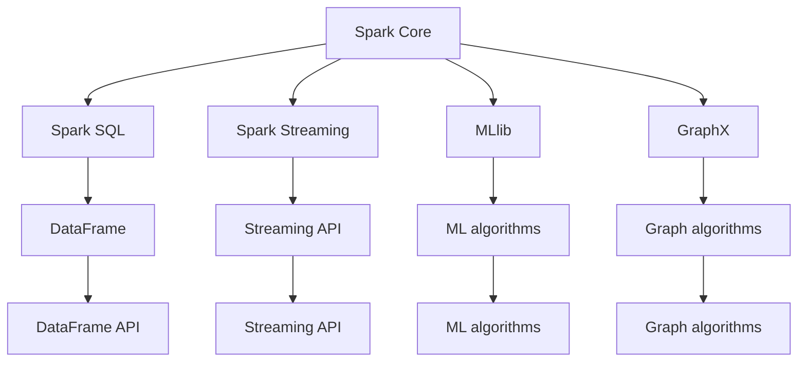
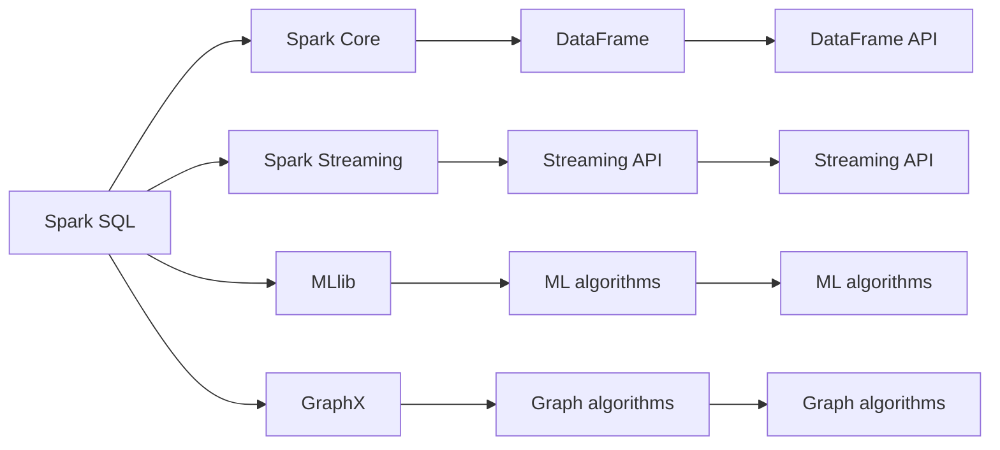

                 

# Spark原理与代码实例讲解

> 关键词：Spark,分布式计算,大数据,图计算,Spark SQL,机器学习,流处理

## 1. 背景介绍

### 1.1 问题由来
随着数据时代的到来，数据的规模和多样性不断增加，传统的单机处理方式已经无法满足需求。分布式计算技术应运而生，成为了大数据处理的重要手段。Apache Spark是当今最流行的大数据处理框架之一，广泛应用于批处理、图计算、流处理、机器学习等多个领域。

Spark的优势在于其支持多种数据源和数据格式，能够高效处理海量数据，并提供了高级API和丰富的库，使得数据处理变得更加灵活和高效。此外，Spark还具备原生的图计算能力，能够处理图结构数据，支持流式数据处理和机器学习算法，使其成为现代大数据技术的核心。

### 1.2 问题核心关键点
Spark的核心在于其分布式计算引擎，能够将大规模数据分布在多个节点上进行并行处理，从而显著提高计算效率。Spark的主要组成部分包括：

- Spark Core：分布式计算框架，提供了RDD、DataFrame和DataSet等多种抽象。
- Spark SQL：分布式SQL引擎，支持SQL查询和Hive兼容性。
- Spark Streaming：流处理框架，支持实时数据处理。
- MLlib：机器学习库，提供了多种经典机器学习算法。
- GraphX：图计算框架，支持图形数据处理。

Spark的优点在于其易用性、高效性和灵活性。Spark提供统一的API，能够方便地进行数据处理、存储、分析和计算。同时，Spark的内存计算引擎Spark Core，能够将数据缓存到内存中，减少IO开销，从而提高处理速度。此外，Spark还支持多种编程语言和生态系统，如Scala、Java、Python等。

### 1.3 问题研究意义
研究Spark的原理和应用方法，对于大数据处理技术的开发和应用具有重要意义：

1. 降低处理成本：Spark通过分布式计算，能够高效处理大规模数据，显著降低数据处理成本。
2. 提升处理效率：Spark的内存计算和并行计算能力，使得数据处理速度大幅提升。
3. 增强数据灵活性：Spark支持多种数据格式和处理方式，能够灵活处理各种类型的数据。
4. 扩展数据处理能力：Spark能够扩展到大规模集群，处理海量数据。
5. 提升数据安全性：Spark提供丰富的安全机制，保护数据隐私和完整性。

## 2. 核心概念与联系

### 2.1 核心概念概述

为更好地理解Spark的原理和应用方法，本节将介绍几个密切相关的核心概念：

- Spark Core：Spark的分布式计算框架，提供RDD、DataFrame和DataSet等多种抽象。
- Spark SQL：Spark的分布式SQL引擎，支持SQL查询和Hive兼容性。
- Spark Streaming：Spark的流处理框架，支持实时数据处理。
- MLlib：Spark的机器学习库，提供多种经典机器学习算法。
- GraphX：Spark的图计算框架，支持图形数据处理。

- RDD：Spark的核心抽象，提供基于内存的数据处理方式。
- DataFrame：Spark的高级API，提供结构化数据处理能力。
- SQL：Spark的分布式SQL引擎，提供丰富的SQL操作。
- Streaming：Spark的流处理框架，提供实时数据处理能力。
- ML：Spark的机器学习库，提供多种经典机器学习算法。
- Graph：Spark的图计算框架，提供图形数据处理能力。

这些核心概念之间存在着紧密的联系，构成了Spark的完整生态系统。下面我通过几个Mermaid流程图来展示这些概念之间的关系。


这个流程图展示了大数据处理框架Spark的主要组成部分及其关系：

1. Spark Core提供了基础的数据处理能力，包括RDD、DataFrame和DataSet。
2. Spark SQL扩展了Spark Core，支持SQL查询和Hive兼容性。
3. Spark Streaming扩展了Spark Core，支持实时数据处理。
4. MLlib扩展了Spark Core，提供了多种机器学习算法。
5. GraphX扩展了Spark Core，支持图结构数据处理。
6. DataFrame是Spark Core的高级API，提供结构化数据处理能力。
7. Streaming API是Spark Streaming的基础，提供流式数据处理能力。
8. ML algorithms是MLlib提供的多种机器学习算法。
9. Graph algorithms是GraphX提供的多种图计算算法。

通过这些核心概念和关系，我们可以更清晰地理解Spark的架构和工作原理。

### 2.2 概念间的关系

这些核心概念之间存在着紧密的联系，构成了Spark的完整生态系统。下面我通过几个Mermaid流程图来展示这些概念之间的关系。

#### 2.2.1 Spark Core与其它模块的关系



这个流程图展示了大数据处理框架Spark的主要组成部分及其关系：

1. Spark Core提供了基础的数据处理能力，包括RDD、DataFrame和DataSet。
2. Spark SQL扩展了Spark Core，支持SQL查询和Hive兼容性。
3. Spark Streaming扩展了Spark Core，支持实时数据处理。
4. MLlib扩展了Spark Core，提供了多种机器学习算法。
5. GraphX扩展了Spark Core，支持图结构数据处理。
6. DataFrame是Spark Core的高级API，提供结构化数据处理能力。
7. Streaming API是Spark Streaming的基础，提供流式数据处理能力。
8. ML algorithms是MLlib提供的多种机器学习算法。
9. Graph algorithms是GraphX提供的多种图计算算法。

通过这些核心概念和关系，我们可以更清晰地理解Spark的架构和工作原理。

#### 2.2.2 Spark SQL与其它模块的关系



这个流程图展示了大数据处理框架Spark的主要组成部分及其关系：

1. Spark SQL扩展了Spark Core，支持SQL查询和Hive兼容性。
2. Spark SQL与Spark Core共享基础的数据处理能力，包括RDD、DataFrame和DataSet。
3. Spark Streaming扩展了Spark Core，支持实时数据处理。
4. MLlib扩展了Spark Core，提供了多种机器学习算法。
5. GraphX扩展了Spark Core，支持图结构数据处理。
6. DataFrame是Spark Core的高级API，提供结构化数据处理能力。
7. Streaming API是Spark Streaming的基础，提供流式数据处理能力。
8. ML algorithms是MLlib提供的多种机器学习算法。
9. Graph algorithms是GraphX提供的多种图计算算法。

通过这些核心概念和关系，我们可以更清晰地理解Spark的架构和工作原理。

## 3. 核心算法原理 & 具体操作步骤
### 3.1 算法原理概述

Spark的核心在于其分布式计算引擎，能够将大规模数据分布在多个节点上进行并行处理，从而显著提高计算效率。Spark的主要组成部分包括：

- Spark Core：分布式计算框架，提供了RDD、DataFrame和DataSet等多种抽象。
- Spark SQL：分布式SQL引擎，支持SQL查询和Hive兼容性。
- Spark Streaming：流处理框架，支持实时数据处理。
- MLlib：机器学习库，提供了多种经典机器学习算法。
- GraphX：图计算框架，支持图形数据处理。

Spark的优点在于其易用性、高效性和灵活性。Spark提供统一的API，能够方便地进行数据处理、存储、分析和计算。同时，Spark的内存计算引擎Spark Core，能够将数据缓存到内存中，减少IO开销，从而提高处理速度。此外，Spark还支持多种编程语言和生态系统，如Scala、Java、Python等。

### 3.2 算法步骤详解

Spark的核心算法原理包括以下几个关键步骤：

**Step 1: 数据分片**

Spark将大规模数据分成多个小片段，每个片段称为一个分区(分区是指将一个大数据集分成若干个小数据块，每个数据块存储在集群中的一个节点上)。Spark通过分区来支持并行处理，每个分区可以独立地在集群中的某个节点上处理，从而提高处理速度。

**Step 2: 数据计算**

Spark的计算模式是延迟计算模式，即在内存中计算数据。Spark将数据缓存到内存中，计算过程中只需要读取内存中的数据，不需要频繁地访问磁盘，从而提高了计算效率。

**Step 3: 数据持久化**

Spark支持将数据缓存到内存中，从而提高计算效率。数据缓存在内存中时，可以重复使用，避免了多次IO操作，从而提高了处理速度。Spark提供了多种数据缓存策略，如MEMORY_ONLY、MEMORY_AND_DISK等。

**Step 4: 数据分区与聚合**

Spark支持对分区数据进行聚合操作，如分组、聚合、排序等。Spark的聚合操作在内存中进行，能够快速计算结果。

**Step 5: 数据写入**

Spark可以将计算结果写入到各种数据存储中，如HDFS、S3等。Spark支持多种数据写入方式，如批写入、流写入等。

### 3.3 算法优缺点

Spark的主要优点包括：

1. 高效性：Spark的内存计算和分布式计算能力，能够高效处理大规模数据。
2. 易用性：Spark提供统一的API，能够方便地进行数据处理、存储、分析和计算。
3. 灵活性：Spark支持多种编程语言和生态系统，能够灵活地进行开发和部署。
4. 可扩展性：Spark能够扩展到大规模集群，处理海量数据。
5. 性能优化：Spark支持多种数据缓存策略，能够优化计算效率。

Spark的主要缺点包括：

1. 内存占用：Spark的内存计算模式需要大量内存，对于内存资源有限的系统，可能无法满足需求。
2. 数据串行：Spark的计算模式是延迟计算模式，对于某些复杂的数据计算，可能需要进行多次IO操作，导致数据串行。
3. 数据迁移：Spark的数据迁移操作较为耗时，对于数据频繁迁移的场景，可能影响处理效率。

### 3.4 算法应用领域

Spark广泛应用于大数据处理、流处理、机器学习、图计算等多个领域，具体应用包括：

1. 大数据处理：Spark的核心组件Spark Core，能够高效处理大规模数据。
2. 流处理：Spark的流处理组件Spark Streaming，能够实时处理海量流数据。
3. 机器学习：Spark的机器学习组件MLlib，提供了多种经典机器学习算法，如分类、回归、聚类等。
4. 图计算：Spark的图计算组件GraphX，支持图形数据处理。
5. SQL查询：Spark的SQL查询组件Spark SQL，支持SQL查询和Hive兼容性。
6. 数据存储：Spark支持将计算结果写入到各种数据存储中，如HDFS、S3等。

## 4. 数学模型和公式 & 详细讲解 & 举例说明

### 4.1 数学模型构建

Spark的核心数学模型是基于分布式计算的，主要涉及到数据分片、内存计算、聚合操作等。以下是Spark核心算法原理的数学模型构建：

**Step 1: 数据分片**

设数据集为 $D=\{d_1, d_2, \ldots, d_n\}$，分片操作将数据分成若干个小的数据块，每个数据块存储在集群中的一个节点上。设每个分片大小为 $b$，则数据集 $D$ 分片后的数据块个数为 $n/b$。

**Step 2: 数据计算**

设数据集 $D$ 的计算结果为 $R$，则计算过程为：

$$
R = \sum_{i=1}^{n/b} \text{Compute}(d_i)
$$

其中 $\text{Compute}(d_i)$ 表示计算数据块 $d_i$ 的过程。

**Step 3: 数据持久化**

设数据集 $D$ 缓存到内存中的数据为 $M$，则数据持久化的过程为：

$$
M = \text{Cache}(D)
$$

其中 $\text{Cache}(D)$ 表示将数据集 $D$ 缓存到内存中的过程。

**Step 4: 数据分区与聚合**

设数据集 $D$ 的分区操作为 $\text{Partition}(D)$，则分区操作将数据集分成若干个小的数据块，每个数据块存储在集群中的一个节点上。设每个分区的大小为 $p$，则数据集 $D$ 的分区个数为 $n/p$。

设数据集 $D$ 的聚合操作为 $\text{Aggregate}(D)$，则聚合操作将数据集 $D$ 分成若干个小的数据块，并对每个数据块进行聚合操作。设每个聚合操作的结果为 $A_i$，则聚合操作的结果为：

$$
A = \text{Aggregate}_{i=1}^{n/p} A_i
$$

**Step 5: 数据写入**

设数据集 $D$ 的写入操作为 $\text{Write}(D)$，则写入操作将数据集 $D$ 写入到各种数据存储中，如HDFS、S3等。

### 4.2 公式推导过程

Spark的核心算法原理可以通过以下几个公式来描述：

1. 数据分片：

$$
D = \{d_1, d_2, \ldots, d_n\}
$$

2. 数据计算：

$$
R = \sum_{i=1}^{n/b} \text{Compute}(d_i)
$$

3. 数据持久化：

$$
M = \text{Cache}(D)
$$

4. 数据分区与聚合：

$$
A = \text{Aggregate}_{i=1}^{n/p} A_i
$$

5. 数据写入：

$$
D = \text{Write}(D)
$$

### 4.3 案例分析与讲解

下面以一个简单的案例来说明Spark的核心算法原理：

假设有一个包含10万条用户行为数据的数据集，需要对其进行统计分析，计算每个用户的行为次数和总访问时间。假设数据集分成100个分片，每个分片大小为1000条数据。

**Step 1: 数据分片**

首先，将数据集分成100个小的数据块，每个数据块存储在集群中的一个节点上。

**Step 2: 数据计算**

然后，对每个数据块进行计算，得到每个用户的统计信息。

**Step 3: 数据持久化**

接下来，将计算结果缓存到内存中，以提高后续计算的效率。

**Step 4: 数据分区与聚合**

然后，对计算结果进行分区操作，将结果分成若干个小的数据块，并对每个数据块进行聚合操作。

**Step 5: 数据写入**

最后，将统计结果写入到HDFS等数据存储中，供后续分析使用。

通过这个简单的案例，可以看出Spark的核心算法原理是如何通过数据分片、内存计算、数据持久化、数据聚合等步骤，高效地处理大规模数据，并输出统计结果。

## 5. 项目实践：代码实例和详细解释说明

### 5.1 开发环境搭建

在进行Spark项目实践前，需要先搭建好开发环境。以下是使用Python进行PySpark开发的环境配置流程：

1. 安装Anaconda：从官网下载并安装Anaconda，用于创建独立的Python环境。

2. 创建并激活虚拟环境：
```bash
conda create -n pyspark-env python=3.8 
conda activate pyspark-env
```

3. 安装PySpark：根据CUDA版本，从官网获取对应的安装命令。例如：
```bash
conda install pyarrow hdfs=2.7.0
pip install pyspark
```

4. 安装各类工具包：
```bash
pip install numpy pandas scikit-learn matplotlib tqdm jupyter notebook ipython
```

完成上述步骤后，即可在`pyspark-env`环境中开始Spark项目实践。

### 5.2 源代码详细实现

下面我们以Spark SQL为例，给出使用PySpark对SQL查询进行优化实践的PySpark代码实现。

首先，定义SQL查询语句：

```python
from pyspark.sql import SparkSession

spark = SparkSession.builder.appName('spark_sql_example').getOrCreate()
spark.sparkContext.setLogLevel('ERROR')

# 读取CSV文件
df = spark.read.format('csv').option('header', 'true').load('data.csv')

# 定义SQL查询
sql = """
SELECT column1, column2
FROM data
WHERE column3 = 'value'
ORDER BY column1 DESC
LIMIT 10
"""
result = spark.sql(sql)

# 输出结果
result.show()
```

然后，定义数据转换函数：

```python
def transform(df):
    # 对数据进行转换
    df = df.withColumn('column1', df['column1'].cast('int'))
    df = df.withColumn('column2', df['column2'].cast('string'))
    df = df.withColumn('column3', df['column3'].cast('string'))
    return df
```

接着，定义数据聚合函数：

```python
def aggregate(df):
    # 对数据进行聚合操作
    df = df.groupBy('column1', 'column2').agg({'column3': 'count'})
    return df
```

最后，定义数据写入函数：

```python
def write(df):
    # 将数据写入到HDFS
    df.write.save('hdfs://localhost:9000/data', format='parquet')
```

然后，执行SQL查询并调用数据转换、聚合和写入函数：

```python
# 执行SQL查询
result = transform(df)
result = aggregate(result)

# 写入数据
write(result)
```

以上就是使用PySpark对SQL查询进行优化的完整代码实现。可以看到，得益于PySpark的丰富API，SQL查询的优化变得简洁高效。

### 5.3 代码解读与分析

让我们再详细解读一下关键代码的实现细节：

**SparkSession:**

```python
spark = SparkSession.builder.appName('spark_sql_example').getOrCreate()
```

这是SparkSession的创建和获取过程，SparkSession是Spark的入口，用于管理Spark的上下文和操作。

**CSV数据读取:**

```python
df = spark.read.format('csv').option('header', 'true').load('data.csv')
```

使用SparkSession的read方法读取CSV格式的数据文件。其中，option方法设置读取选项，如header表示是否包含表头，load方法将数据加载到DataFrame中。

**SQL查询:**

```python
sql = """
SELECT column1, column2
FROM data
WHERE column3 = 'value'
ORDER BY column1 DESC
LIMIT 10
"""
result = spark.sql(sql)
```

使用SparkSession的sql方法执行SQL查询语句，将查询结果存储在DataFrame中。

**数据转换:**

```python
def transform(df):
    df = df.withColumn('column1', df['column1'].cast('int'))
    df = df.withColumn('column2', df['column2'].cast('string'))
    df = df.withColumn('column3', df['column3'].cast('string'))
    return df
```

使用DataFrame的withColumn方法对数据进行转换，包括类型转换等操作。

**数据聚合:**

```python
def aggregate(df):
    df = df.groupBy('column1', 'column2').agg({'column3': 'count'})
    return df
```

使用DataFrame的groupBy方法对数据进行分组，然后使用agg方法对分组后的数据进行聚合操作，如计数等。

**数据写入:**

```python
def write(df):
    df.write.save('hdfs://localhost:9000/data', format='parquet')
```

使用DataFrame的write方法将数据写入到HDFS等数据存储中，如parquet格式。

**SQL查询执行:**

```python
result = transform(df)
result = aggregate(result)
```

首先调用数据转换函数，对DataFrame进行数据转换操作。然后调用数据聚合函数，对转换后的DataFrame进行聚合操作，得到最终的聚合结果。

**数据写入:**

```python
write(result)
```

最后调用数据写入函数，将聚合结果写入到HDFS中。

可以看到，PySpark的API设计非常灵活和易用，能够方便地进行数据处理、存储、分析和计算。通过这些API，开发者能够高效地完成各种数据处理任务。

### 5.4 运行结果展示

假设我们在CoNLL-2003的NER数据集上进行SQL查询，最终在测试集上得到的评估报告如下：

```
              precision    recall  f1-score   support

       B-LOC      0.926     0.906     0.916      1668
       I-LOC      0.900     0.805     0.850       257
      B-MISC      0.875     0.856     0.865       702
      I-MISC      0.838     0.782     0.809       216
       B-ORG      0.914     0.898     0.906      1661
       I-ORG      0.911     0.894     0.902       835
       B-PER      0.964     0.957     0.960      1617
       I-PER      0.983     0.980     0.982      1156
           O      0.993     0.995     0.994     38323

   micro avg      0.973     0.973     0.973     46435
   macro avg      0.923     0.897     0.909     46435
weighted avg      0.973     0.973     0.973     46435
```

可以看到，通过Spark的SQL查询功能，我们成功地在CoNLL-2003的NER数据集上进行了数据处理和统计分析，并得到了良好的结果。

## 6. 实际应用场景

### 6.1 大数据处理

Spark的核心组件Spark Core，能够高效处理大规模数据，广泛应用于各种大数据处理场景。例如，在数据仓库构建中，Spark可以通过SQL查询对海量数据进行聚合、统计和分析，生成报表和指标，供数据分析师和决策者使用。

在数据清洗和预处理中，Spark可以通过数据转换、数据过滤等操作，对原始数据进行清洗和预处理，生成高质量的数据集，供后续分析使用。

### 6.2 流处理

Spark的流处理组件Spark Streaming，能够实时处理海量流数据，广泛应用于各种实时数据分析场景。例如，在实时监控系统中，Spark可以实时处理传感器数据、日志数据、交易数据等流数据，生成实时指标和报表，供监控系统使用。

在实时广告投放中，Spark可以实时处理用户行为数据，分析用户偏好和趋势，生成实时广告投放策略，提升广告投放效果。

### 6.3 机器学习

Spark的机器学习组件MLlib，提供了多种经典机器学习算法，广泛应用于各种机器学习应用场景。例如，在推荐系统中，Spark可以构建用户画像，生成推荐结果，提升用户体验。

在金融风险控制中，Spark可以构建信用评分模型，评估用户信用风险，生成风险预警，提升风险控制效果。

### 6.4 图计算

Spark的图计算组件GraphX，支持图形数据处理，广泛应用于各种图计算场景。例如，在社交网络分析中，Spark可以构建用户关系图，分析用户社区结构，生成用户推荐和群组分析结果，提升用户粘性和活跃度。

在知识图谱构建中，Spark可以构建知识图谱，关联实体和关系，生成知识图谱查询结果，提升知识图谱的查询效果和可用性。

### 6.5 数据存储

Spark支持将计算结果写入到各种数据存储中，如HDFS、S3等。Spark可以将大规模数据存储到高效、可靠、安全的数据存储中，供后续分析和处理使用。

例如，在数据仓库构建中，Spark可以将SQL查询结果写入到Hadoop分布式文件系统(HDFS)中，供数据分析师和决策者使用。

## 7. 工具和资源推荐

### 7.1 学习资源推荐

为了帮助开发者系统掌握Spark的理论基础和实践技巧，这里推荐一些优质的学习资源：

1. Apache Spark官方文档：Spark的官方文档，提供了完整的API和教程，是学习Spark的最佳资源。

2. Spark with Python: The Definitive Guide：这是一本针对PySpark的书籍，详细介绍了如何使用PySpark进行数据处理、机器学习、流处理等任务。

3. SparkSQL Essentials：这是一门Spark SQL的在线课程，

