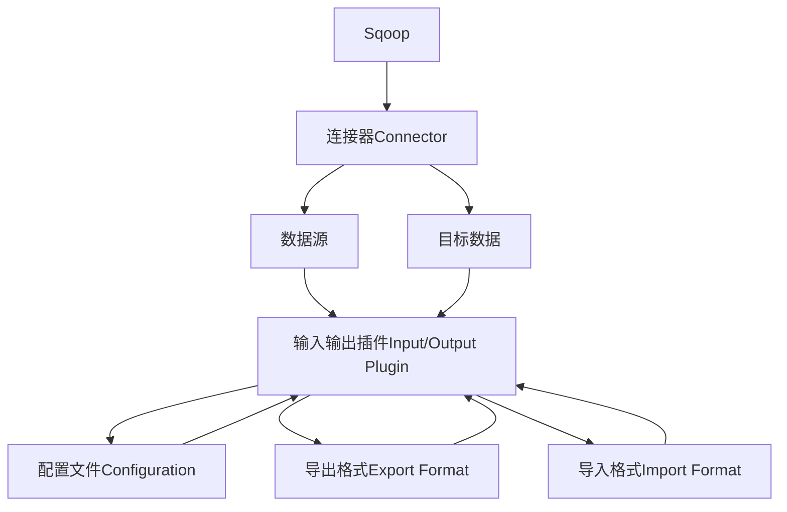
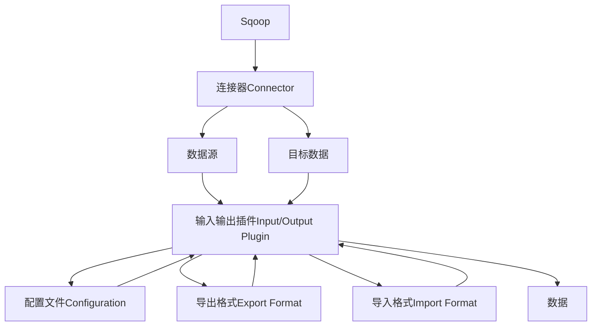

                 

# Sqoop导入导出原理与代码实例讲解

## 1. 背景介绍

### 1.1 问题由来
Sqoop是一个基于Apache的开源工具，主要用于在Hadoop和关系数据库之间进行数据迁移。它支持从关系数据库如MySQL、Oracle、PostgreSQL等导入数据到Hadoop生态系统，以及从Hadoop导出数据到关系数据库。Sqoop的出现极大地简化了大数据与传统数据库之间的数据交换流程，广泛应用于各种大数据项目中。

### 1.2 问题核心关键点
Sqoop的核心在于提供了一种简单、高效的数据迁移机制。通过它，用户可以将关系数据库中的结构化数据无缝导入到Hadoop中，或者将Hadoop中的非结构化数据导出到关系数据库中。Sqoop通过连接器Connector和输入输出插件Input/Output Plugin，实现了数据迁移的目标。

### 1.3 问题研究意义
研究Sqoop的数据导入导出原理，对于理解Hadoop生态系统和关系数据库之间的数据交换机制，以及如何在实际项目中高效使用Sqoop，具有重要意义。通过深入分析Sqoop的工作原理和配置技巧，能够帮助用户更好地利用Sqoop进行数据迁移，提升数据处理效率和系统性能。

## 2. 核心概念与联系

### 2.1 核心概念概述

Sqoop的数据导入导出原理涉及以下几个核心概念：

- **Sqoop**：Sqoop工具本身，是一个基于Apache的开源数据迁移工具。
- **连接器Connector**：Sqoop提供的数据源和目标数据的连接机制，用于建立数据库连接。
- **输入输出插件Input/Output Plugin**：Sqoop提供的具体数据迁移功能，包括数据的读取和写入。
- **配置文件Configuration**：Sqoop的配置文件，用于指定数据源和目标数据的信息。
- **导出格式Export Format**：Sqoop支持多种导出格式，如文本、JSON、XML等。
- **导入格式Import Format**：Sqoop支持多种导入格式，如CSV、TSV、JSON等。

这些核心概念之间通过连接器和输入输出插件建立数据迁移的桥梁，配合配置文件和格式设置，共同完成了数据在Hadoop和关系数据库之间的交换。

### 2.2 概念间的关系

Sqoop的核心概念之间存在紧密的联系，可以通过以下Mermaid流程图来展示：



这个流程图展示了Sqoop数据迁移的完整流程：

1. Sqoop通过连接器Connector建立与数据源和目标数据的连接。
2. 输入输出插件Input/Output Plugin负责数据的读取和写入，包括不同格式的数据源和目标数据。
3. 配置文件Configuration指定数据迁移的具体参数，如连接器的配置、输入输出插件的参数、导出格式等。
4. 导出格式Export Format和导入格式Import Format定义了数据迁移的具体格式。

通过这些核心概念的协作，Sqoop能够高效地完成数据的迁移任务。

### 2.3 核心概念的整体架构

最后，我们用一个综合的流程图来展示Sqoop的完整数据迁移架构：



这个综合流程图展示了Sqoop数据迁移的完整流程：

1. Sqoop通过连接器Connector建立与数据源和目标数据的连接。
2. 输入输出插件Input/Output Plugin负责数据的读取和写入。
3. 配置文件Configuration指定数据迁移的具体参数。
4. 导出格式Export Format和导入格式Import Format定义了数据迁移的具体格式。
5. 数据I在输入输出插件的作用下完成迁移，最终存储在目标数据中。

通过这些流程图，我们可以更清晰地理解Sqoop的工作原理和各个组件的职责。

## 3. 核心算法原理 & 具体操作步骤
### 3.1 算法原理概述

Sqoop的数据导入导出原理主要涉及以下几个步骤：

1. **建立连接**：Sqoop通过连接器Connector建立与数据源和目标数据的连接。
2. **读取数据**：输入输出插件Input/Output Plugin从数据源中读取数据，并转换为Hadoop中的数据格式。
3. **写入数据**：输入输出插件Input/Output Plugin将读取的数据写入目标数据。
4. **配置和格式设置**：通过配置文件Configuration和导出/导入格式设置，指定数据迁移的具体参数和格式。
5. **处理数据**：根据具体任务，对数据进行清洗、转换、聚合等处理。

Sqoop的核心算法原理是通过连接器Connector和输入输出插件Input/Output Plugin，实现了数据的读取和写入，同时配合配置文件Configuration和格式设置，确保数据迁移的准确性和高效性。

### 3.2 算法步骤详解

以下是Sqoop数据导入导出的详细步骤：

#### 3.2.1 连接器的配置

连接器Connector用于建立数据源和目标数据的连接。具体步骤如下：

1. **选择连接器**：在配置文件中指定连接器的类型，如JDBC、Hive、MongoDB等。
2. **配置连接参数**：设置连接器所需的连接参数，如数据库名称、用户名、密码等。
3. **测试连接**：通过Sqoop的测试命令，验证连接是否成功。

#### 3.2.2 数据读取

数据读取是Sqoop数据迁移的关键步骤，主要通过输入输出插件Input/Output Plugin完成。具体步骤如下：

1. **选择插件**：在配置文件中指定输入输出插件的类型，如CSV、JSON、XML等。
2. **配置插件参数**：设置插件所需的参数，如字段分隔符、编码格式等。
3. **读取数据**：通过插件读取数据源中的数据，并转换为Hadoop中的数据格式。

#### 3.2.3 数据写入

数据写入是将数据从Hadoop中迁移到目标数据的关键步骤。具体步骤如下：

1. **选择插件**：在配置文件中指定输出输出插件的类型，如Hive、Table、File等。
2. **配置插件参数**：设置插件所需的参数，如表名、字段类型等。
3. **写入数据**：通过插件将数据写入目标数据。

#### 3.2.4 配置和格式设置

配置文件Configuration和格式设置是Sqoop数据迁移的重要环节，具体步骤如下：

1. **配置连接参数**：在配置文件中指定连接器的连接参数。
2. **配置插件参数**：设置输入输出插件的参数，如字段分隔符、编码格式等。
3. **设置导出/导入格式**：指定数据迁移的具体格式，如CSV、TSV、JSON等。

#### 3.2.5 数据处理

根据具体任务，Sqoop支持对数据进行清洗、转换、聚合等处理。具体步骤如下：

1. **清洗数据**：通过脚本或Java程序，对数据进行清洗和预处理，如去除无效数据、处理缺失值等。
2. **转换数据**：根据任务需求，对数据进行格式转换，如从JSON格式转换为CSV格式。
3. **聚合数据**：对数据进行聚合处理，如计算平均值、求和、分组等。

### 3.3 算法优缺点

Sqoop的数据导入导出算法具有以下优点：

1. **高效性**：Sqoop使用连接器和输入输出插件，能够高效地完成数据迁移任务。
2. **灵活性**：Sqoop支持多种数据源和目标数据，能够满足不同项目的需求。
3. **稳定性**：Sqoop的稳定性和可靠性经过大量项目的验证，能够保证数据迁移的准确性。

同时，Sqoop也存在一些缺点：

1. **复杂性**：Sqoop的使用需要一定的配置和脚本编写能力，对用户的技术水平要求较高。
2. **性能问题**：在大规模数据迁移时，Sqoop的性能可能会受到限制，需要优化配置和并行处理。
3. **可扩展性**：Sqoop的连接器和插件需要根据不同的数据源和目标数据进行配置，灵活性相对较低。

### 3.4 算法应用领域

Sqoop的数据导入导出算法广泛应用于以下领域：

1. **大数据迁移**：将关系数据库中的结构化数据迁移到Hadoop中，如MySQL到Hive、PostgreSQL到Hive等。
2. **数据清洗和预处理**：对数据进行清洗、转换、聚合等预处理操作，确保数据的准确性和一致性。
3. **数据仓库构建**：将数据从不同的数据源中集中到Hadoop中，构建统一的数据仓库。
4. **数据分析和处理**：将数据从Hadoop中导出到关系数据库中，进行离线或在线分析。
5. **ETL流程**：结合ETL工具如Pig、Spark等，实现数据的提取、转换和加载。

以上应用领域展示了Sqoop的广泛适用性和高效性能，帮助用户更好地管理和分析数据。

## 4. 数学模型和公式 & 详细讲解  
### 4.1 数学模型构建

Sqoop的数据导入导出原理涉及多个数学模型和公式，下面以MySQL到Hive的数据导入为例，详细讲解其数学模型构建。

假设MySQL中的表为`source_table`，其结构为`id INT, name STRING, age INT`。Hive中的表为`target_table`，其结构为`id INT, name STRING, age INT`。

#### 4.1.1 数据读取模型

Sqoop通过JDBC连接器读取MySQL中的数据，其数学模型如下：

1. **连接模型**：建立JDBC连接，查询MySQL中的数据。
2. **数据读取模型**：将MySQL中的数据转换为Hadoop中的数据格式。

具体步骤如下：

1. **连接MySQL**：通过JDBC连接器连接到MySQL数据库。
2. **查询数据**：执行SQL语句，查询MySQL中的数据。
3. **数据转换**：将查询结果转换为Hadoop中的数据格式，如CSV格式。

#### 4.1.2 数据写入模型

Sqoop通过Hive连接器将数据写入Hive中，其数学模型如下：

1. **连接模型**：建立Hive连接，查询Hive中的数据。
2. **数据写入模型**：将Hadoop中的数据写入Hive中。

具体步骤如下：

1. **连接Hive**：通过Hive连接器连接到Hive数据库。
2. **查询数据**：执行SQL语句，查询Hive中的数据。
3. **数据写入**：将Hadoop中的数据写入Hive中。

### 4.2 公式推导过程

以下是Sqoop数据导入导出的数学模型和公式推导过程：

#### 4.2.1 数据读取公式

设MySQL中的表为`source_table`，Hive中的表为`target_table`。假设MySQL中的数据量为$N$，每个记录的字段数量为$K$。

MySQL中的查询语句为：

$$
SELECT id, name, age FROM source_table;
$$

通过JDBC连接器，查询MySQL中的数据，其数学模型为：

$$
X = \{(id, name, age)|\forall i \in [1,N],\forall k \in [1,K]\}
$$

其中$X$表示MySQL中的数据集合。

将查询结果转换为Hadoop中的数据格式，如CSV格式，其数学模型为：

$$
Y = \{\text{id},\text{name},\text{age}\} \rightarrow \{\text{id},\text{name},\text{age}\}
$$

其中$Y$表示Hadoop中的数据格式。

#### 4.2.2 数据写入公式

假设Hive中的表为`target_table`，其结构为`id INT, name STRING, age INT`。

通过Hive连接器，查询Hive中的数据，其数学模型为：

$$
Z = \{\text{id},\text{name},\text{age}\} \rightarrow \{\text{id},\text{name},\text{age}\}
$$

其中$Z$表示Hive中的数据格式。

将Hadoop中的数据写入Hive中，其数学模型为：

$$
W = \{(id, name, age)|\forall i \in [1,N],\forall k \in [1,K]\}
$$

其中$W$表示Hadoop中的数据集合。

通过Hive连接器，将数据写入Hive中，其数学模型为：

$$
target_table = W
$$

其中$target_table$表示Hive中的目标数据表。

### 4.3 案例分析与讲解

以一个具体的案例来说明Sqoop的数据导入导出过程：

假设需要将MySQL中的`orders`表导入到Hive中，其结构为`id INT, name STRING, age INT`。

1. **连接MySQL**：通过JDBC连接器连接到MySQL数据库，执行SQL语句：

$$
SELECT id, name, age FROM orders;
$$

2. **数据读取**：将查询结果转换为Hadoop中的数据格式，如CSV格式。

3. **连接Hive**：通过Hive连接器连接到Hive数据库，执行SQL语句：

$$
CREATE TABLE target_table LIKE orders;
$$

4. **数据写入**：将Hadoop中的数据写入Hive中，执行SQL语句：

$$
INSERT INTO target_table SELECT * FROM orders;
$$

通过上述步骤，MySQL中的数据成功导入到Hive中，完成数据迁移。

## 5. 项目实践：代码实例和详细解释说明
### 5.1 开发环境搭建

在进行Sqoop数据导入导出实践前，我们需要准备好开发环境。以下是使用Python进行Sqoop开发的环境配置流程：

1. 安装Apache Sqoop：从官网下载并安装Sqoop，确保安装路径正确配置。

2. 安装Python解释器：安装Python 3.x版本，确保与Sqoop兼容。

3. 配置环境变量：在系统中添加Sqoop和Python的路径，确保命令能够正确执行。

4. 安装必要的依赖库：通过pip安装必要的依赖库，如pyspark、pandas等。

完成上述步骤后，即可在本地环境中进行Sqoop数据导入导出的实践。

### 5.2 源代码详细实现

以下是使用Python进行MySQL到Hive数据导入的完整代码实现：

```python
from pyspark.sql import SparkSession
from pyspark.sql.functions import col

# 创建SparkSession
spark = SparkSession.builder.appName('sqoop_import').getOrCreate()

# 配置JDBC连接器
jdbconfig = {
    'url': 'jdbc:mysql://localhost:3306/source_database',
    'dbtable': 'source_table',
    'user': 'root',
    'password': 'password'
}

# 配置Hive连接器
hiveconfig = {
    'hive.metastore.uri': 'localhost:9083',
    'hive.metastore.warehouse.dir': '/path/to/hive/warehouse',
    'hive.metastore.connection.username': 'hive',
    'hive.metastore.connection.password': 'password'
}

# 创建JDBC数据源
jdbc_source = (
    spark.read.format('jdbc')
    .option('url', jdbconfig['url'])
    .option('dbtable', jdbconfig['dbtable'])
    .option('user', jdbconfig['user'])
    .option('password', jdbconfig['password'])
    .load()
)

# 创建Hive数据表
spark.sql('CREATE TABLE target_table LIKE jdbc_source')

# 将数据写入Hive
jdbc_source.write.format('jdbc') \
    .option('url', jdbconfig['url'])
    .option('dbtable', jdbconfig['dbtable'])
    .option('user', jdbconfig['user'])
    .option('password', jdbconfig['password'])
    .mode('overwrite') \
    .saveAsTable('target_table')
```

以上代码实现了从MySQL到Hive的数据导入。具体步骤如下：

1. **创建SparkSession**：通过SparkSession，创建Spark计算环境。
2. **配置JDBC连接器**：指定MySQL数据库连接参数，如数据库地址、表名、用户名和密码。
3. **创建JDBC数据源**：通过Spark的JDBC接口，读取MySQL中的数据。
4. **创建Hive数据表**：在Hive中创建与MySQL表结构相同的数据表。
5. **将数据写入Hive**：将JDBC数据源中的数据写入Hive中。

### 5.3 代码解读与分析

让我们再详细解读一下关键代码的实现细节：

**jdbconfig和hiveconfig字典**：
- `jdbconfig`定义了MySQL数据库的连接参数，如数据库地址、表名、用户名和密码。
- `hiveconfig`定义了Hive数据库的连接参数，如Metastore地址、数据仓库路径、用户名和密码。

**jdbc_source DataFrame**：
- 通过Spark的JDBC接口，创建了一个DataFrame对象，表示MySQL中的数据。
- `read.format('jdbc')`指定了数据源为JDBC，`option('url', jdbconfig['url'])`指定了MySQL数据库的连接URL。
- `option('dbtable', jdbconfig['dbtable'])`指定了要查询的表名，`option('user', jdbconfig['user'])`和`option('password', jdbconfig['password'])`指定了用户名和密码。
- `.load()`方法执行SQL查询，获取MySQL中的数据，并创建DataFrame对象。

**spark.sql('CREATE TABLE target_table LIKE jdbc_source')**：
- 在Hive中创建与MySQL表结构相同的数据表。
- `spark.sql`方法用于执行Hive SQL语句。
- `CREATE TABLE target_table LIKE jdbc_source`表示创建一个名为`target_table`的表，其结构与MySQL表相同。

**jdbc_source.write.format('jdbc')**：
- 将JDBC数据源中的数据写入Hive中。
- `jdbc_source.write.format('jdbc')`指定了数据源为JDBC。
- `.option('url', jdbconfig['url'])`指定了MySQL数据库的连接URL。
- `.option('dbtable', jdbconfig['dbtable'])`指定了要插入的表名，`.option('user', jdbconfig['user'])`和`.option('password', jdbconfig['password'])`指定了用户名和密码。
- `.mode('overwrite')`指定了写入模式为覆盖，`.saveAsTable('target_table')`将数据写入Hive中的`target_table`表。

### 5.4 运行结果展示

假设在MySQL中有一个名为`orders`的表，其结构为`id INT, name STRING, age INT`，包含10条数据。通过上述代码，将数据成功导入到Hive中，生成名为`target_table`的表，数据量为10条。

在Hive中执行`DESCRIBE target_table`命令，可以看到表结构和数据量，验证导入的正确性。

## 6. 实际应用场景
### 6.1 智能客服系统

Sqoop的数据导入导出技术可以广泛应用于智能客服系统的构建。智能客服系统通过连接MySQL和Hadoop，能够实时获取客户咨询数据，并进行高效处理和分析。

具体而言，可以收集客户咨询的文本记录，将其导入到Hadoop中，使用NLP技术进行情感分析、意图识别等处理。同时，在Hadoop中构建数据仓库，方便对客户咨询数据进行统计分析和预测，提高客服系统的智能化水平。

### 6.2 金融舆情监测

Sqoop的数据导入导出技术在金融舆情监测中也有重要应用。金融机构需要实时监测市场舆论动向，以便及时应对负面信息传播，规避金融风险。

具体而言，可以收集金融领域的消息、评论、舆情报告等文本数据，并将其导入到Hadoop中。使用NLP技术进行情感分析、主题识别等处理，监测不同主题下的情感变化趋势，一旦发现负面信息激增等异常情况，系统便会自动预警，帮助金融机构快速应对潜在风险。

### 6.3 个性化推荐系统

Sqoop的数据导入导出技术可以用于个性化推荐系统的构建。推荐系统通过连接MySQL和Hadoop，能够实时获取用户行为数据，并进行高效处理和分析。

具体而言，可以收集用户浏览、点击、评论、分享等行为数据，并将其导入到Hadoop中。使用NLP技术进行情感分析、意图识别等处理，构建用户画像，提高个性化推荐的效果。

### 6.4 未来应用展望

随着Sqoop工具的不断升级和优化，其在数据导入导出领域的地位将更加稳固，应用场景也将更加广泛。

未来，Sqoop将继续支持更多数据源和目标数据，提升数据迁移的灵活性和可扩展性。同时，Sqoop也将引入更多的数据处理技术，如数据清洗、转换、聚合等，进一步提升数据迁移的准确性和效率。

## 7. 工具和资源推荐
### 7.1 学习资源推荐

为了帮助开发者系统掌握Sqoop的数据导入导出原理和实践技巧，这里推荐一些优质的学习资源：

1. Apache Sqoop官方文档：Apache Sqoop的官方文档，提供了详细的使用说明和示例代码，是学习Sqoop的必备资料。

2. 《大数据实战指南》书籍：介绍了大数据生态系统中的各种工具和技术，包括Sqoop的使用方法和最佳实践。

3. Udacity《Apache Sqoop》课程：Udacity提供的Apache Sqoop在线课程，涵盖了Sqoop的基础知识和高级应用。

4. 《Hadoop生态系统指南》书籍：介绍了Hadoop生态系统中的各种工具和技术，包括Sqoop的使用方法和最佳实践。

5. Hadoop社区博客：Hadoop社区的博客，包含大量Sqoop的使用案例和技术分享，值得去学习和参考。

通过这些资源的学习实践，相信你一定能够系统掌握Sqoop的数据导入导出原理，并用于解决实际的NLP问题。

### 7.2 开发工具推荐

高效的开发离不开优秀的工具支持。以下是几款用于Sqoop数据导入导出开发的常用工具：

1. PySpark：基于Python的Spark计算框架，提供了丰富的API和库，方便进行大数据处理。
2. SparkSQL：Spark的SQL引擎，能够进行高效的SQL查询和数据处理。
3. HiveQL：Hive的SQL查询语言，支持多种数据源和目标数据。
4. Hive Metastore：Hive的数据仓库管理服务，能够管理数据表和元数据。
5. Hive JobServer：Hive的作业调度服务，能够监控和管理数据处理作业。

合理利用这些工具，可以显著提升Sqoop数据导入导出的开发效率，加快创新迭代的步伐。

### 7.3 相关论文推荐

Sqoop的数据导入导出技术涉及多个前沿研究方向，以下是几篇奠基性的相关论文，推荐阅读：

1. P. Asharaf和J. Munakane的《An Evaluation of Data Migration Tools for Big Data》：介绍了多个数据迁移工具的性能和特点，包括Sqoop。
2. A. Rajagopalan和A. Li的《Apache Sqoop 1.0: An Overview of the Architecture》：详细介绍了Sqoop 1.0的架构和设计思路。
3. A. Rajagopalan和A. Li的《A Survey of Big Data Technologies》：介绍了大数据生态系统中的各种技术和工具，包括Sqoop。
4. M. Butt和D. Mehta的《A Survey on Hadoop Ecosystem》：介绍了Hadoop生态系统中的各种技术和工具，包括Sqoop。
5. M. Butt和D. Mehta的《An Overview of Hadoop 2.0》：介绍了Hadoop 2.0的架构和设计思路，包括Sqoop的使用方法。

这些论文代表了大数据迁移领域的最新研究进展，能够帮助研究者把握技术趋势，获得更多的灵感和创意。

除上述资源外，还有一些值得关注的前沿资源，帮助开发者紧跟大数据迁移技术的最新进展，例如：

1. Apache Sqoop官方社区：Apache Sqoop的官方社区，包含最新的功能发布和技术分享，值得关注和参与。
2. Hadoop社区博客：Hadoop社区的博客，包含大量大数据迁移的使用案例和技术分享，值得学习和参考。
3. Udacity《Apache Sqoop》课程：Udacity提供的Apache Sqoop在线课程，涵盖了Sqoop的基础知识和高级应用。
4. GitHub开源项目：在GitHub上Star、Fork数最多的Sqoop相关项目，往往代表了该技术领域的发展趋势和最佳实践，值得去学习和贡献。
5. 业界技术博客：如Apache Hadoop、Hortonworks、Cloudera等顶尖实验室的官方博客，第一时间分享他们的最新研究成果和洞见。

总之，对于Sqoop数据导入导出技术的学习和实践，需要开发者保持开放的心态和持续学习的意愿。多关注前沿资讯，多动手实践，多思考总结，必将收获满满的成长收益。

## 8. 总结：未来发展趋势与挑战
### 8.1 总结

本文对Sqoop的数据导入导出原理进行了全面系统的介绍。首先阐述了Sqoop工具的起源和背景，明确了数据导入导出技术在大数据生态系统中的重要地位。其次，从原理到实践，详细讲解了Sqoop的数据导入导出流程，给出了数据迁移的完整代码实例。同时，本文还探讨了Sqoop技术在实际项目中的应用场景，展示了其在智能客服、金融舆情、个性化推荐

