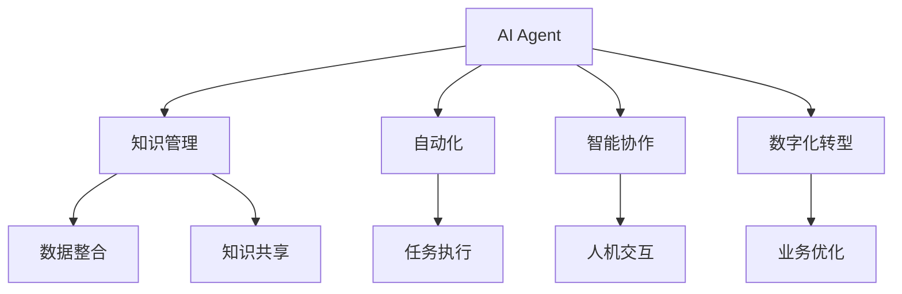
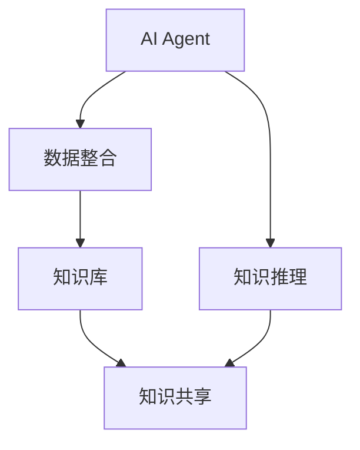
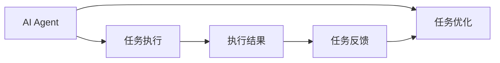
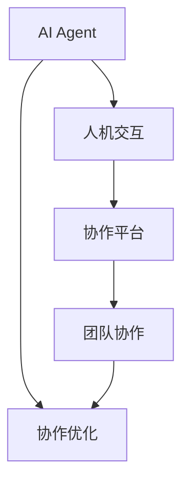
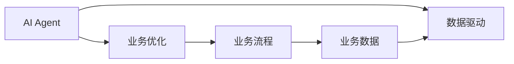
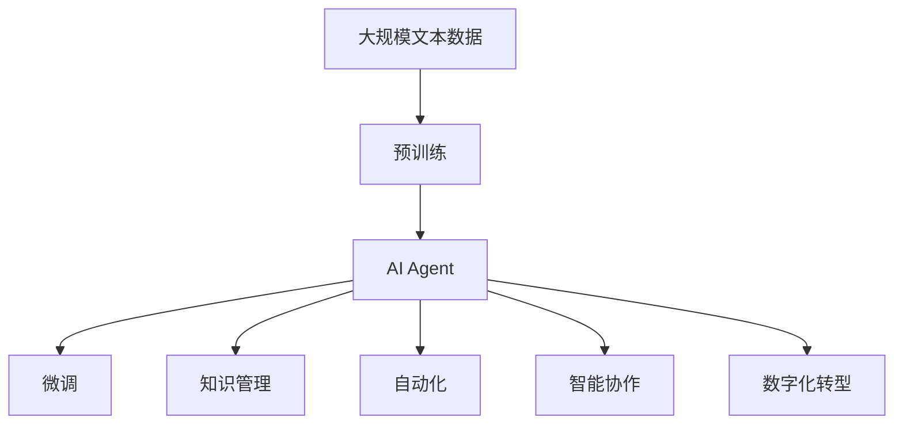

                 

# AI Agent与企业生产力的变革

> 关键词：AI Agent, 企业生产力, 知识管理, 自动化, 智能协作, 数字化转型

## 1. 背景介绍

### 1.1 问题由来
随着人工智能(AI)技术的飞速发展，越来越多的企业开始探索AI在提升生产力的潜力。AI Agent作为人工智能的重要分支，以其智能化的决策、自动化执行等特点，被广泛应用于企业业务流程中，从而显著提升企业的生产效率和竞争力。然而，AI Agent的实际落地应用仍面临诸多挑战，如对企业运营环境的理解不足、企业内部协作机制不成熟、数据安全与隐私保护等。

### 1.2 问题核心关键点
AI Agent在企业生产力的变革中扮演了重要的角色，其核心关键点包括：
- AI Agent的定义及其作用
- AI Agent与企业生产力的关系
- 企业内部部署AI Agent面临的挑战
- AI Agent在实际应用中的优缺点

### 1.3 问题研究意义
研究AI Agent与企业生产力的关系，对于提高企业运营效率、优化业务流程、增强企业竞争力具有重要意义：

1. 提升工作效率。AI Agent能够自动化处理重复性、高强度的任务，减少人力资源的浪费。
2. 增强决策准确性。通过数据分析和机器学习，AI Agent提供基于数据的决策支持，减少人为误差。
3. 优化资源配置。AI Agent能够预测业务需求，合理调配资源，提高资源利用效率。
4. 促进智能协作。AI Agent增强了人与人之间的沟通与协作，形成更高效的团队作业模式。
5. 推动数字化转型。AI Agent加速企业数字化转型的步伐，提升企业的整体信息化的水平。

## 2. 核心概念与联系

### 2.1 核心概念概述

为更好地理解AI Agent与企业生产力的关系，本节将介绍几个密切相关的核心概念：

- AI Agent：智能代理人，是具备智能决策、执行功能，能够在特定环境（如企业内部）中自动运行的系统或程序。AI Agent的核心能力包括自然语言处理、知识推理、自动化执行等。

- 知识管理：通过整合、利用企业内部的各类数据、信息，建立统一的知识体系，实现知识共享和复用，提升企业的知识水平。

- 自动化：指通过人工智能技术实现任务的自动执行，减少人工干预，提高任务执行效率和质量。

- 智能协作：指利用AI技术增强人机交互，提升团队协作的效率和质量，实现更智能的团队作业模式。

- 数字化转型：指企业利用信息技术和数字化工具，优化业务流程，提升企业的信息化水平，实现更高效、智能的运营。

这些核心概念之间的逻辑关系可以通过以下Mermaid流程图来展示：



这个流程图展示了许多核心概念的关系：

1. AI Agent可以整合企业知识，实现知识共享。
2. AI Agent能够自动化执行任务，提升效率。
3. AI Agent通过智能协作，增强团队作业模式。
4. AI Agent推动企业数字化转型。

### 2.2 概念间的关系

这些核心概念之间存在着紧密的联系，形成了AI Agent与企业生产力之间的整体框架。下面我们通过几个Mermaid流程图来展示这些概念之间的关系。

#### 2.2.1 AI Agent与知识管理



这个流程图展示了AI Agent在知识管理中的应用：通过整合数据建立知识库，利用知识推理能力，AI Agent可以更智能地共享和复用知识。

#### 2.2.2 AI Agent与自动化



这个流程图展示了AI Agent在自动化中的应用：通过执行任务并优化执行结果，AI Agent能够自动处理企业内部任务，提高执行效率和质量。

#### 2.2.3 AI Agent与智能协作



这个流程图展示了AI Agent在智能协作中的应用：通过人机交互，AI Agent能够优化团队协作模式，提升协作效率。

#### 2.2.4 AI Agent与数字化转型



这个流程图展示了AI Agent在数字化转型中的应用：通过业务优化，AI Agent能够推动企业业务流程的数字化，提高企业的信息化水平。

### 2.3 核心概念的整体架构

最后，我们用一个综合的流程图来展示这些核心概念在大语言模型微调过程中的整体架构：



这个综合流程图展示了从预训练到微调，再到知识管理、自动化、智能协作和数字化转型的完整过程。AI Agent首先在大规模文本数据上进行预训练，然后通过微调适应特定任务，实现知识管理、自动化、智能协作和数字化转型的功能。

## 3. 核心算法原理 & 具体操作步骤
### 3.1 算法原理概述

AI Agent在企业生产力的变革中，主要是通过自然语言处理(NLP)、知识推理、自动化执行等技术手段，实现对企业运营环境的理解、任务的自动化处理、智能协作的增强等功能。其核心算法包括：

- 自然语言处理：指利用AI技术对文本、语音等非结构化数据进行处理和理解，使其能够被AI Agent理解和执行。
- 知识推理：指通过整合企业内部知识，利用AI技术进行逻辑推理和知识推理，辅助AI Agent做出基于知识的决策。
- 自动化执行：指利用AI技术实现任务的自动化处理，减少人工干预，提高任务执行效率和质量。

### 3.2 算法步骤详解

AI Agent在企业生产力中的具体应用步骤通常包括以下几个关键环节：

1. 数据收集与预处理：收集企业内部的业务数据、文本数据、用户反馈等，对数据进行清洗、格式化，建立统一的数据格式。

2. 知识库建设与整合：利用AI技术对数据进行分析，整合企业的知识资源，建立统一的知识库，实现知识的存储和复用。

3. 模型训练与微调：对AI Agent进行模型训练和微调，使其能够理解企业运营环境，具备任务执行和智能协作的能力。

4. 自动化执行：将训练好的AI Agent应用于企业内部的任务自动化处理，例如订单管理、客户服务、生产调度等。

5. 智能协作：通过AI Agent进行人机交互，增强团队协作的效率和质量，例如智能客服、智能监控、智能调度等。

6. 数字化转型：将AI Agent整合到企业数字化转型战略中，推动企业业务流程的优化和数字化，例如智能财务、智能采购、智能营销等。

### 3.3 算法优缺点

AI Agent在企业生产力中的优点包括：

- 提升工作效率：自动化处理重复性任务，减少人力资源的浪费。
- 增强决策准确性：通过数据分析和机器学习，提供基于数据的决策支持。
- 优化资源配置：预测业务需求，合理调配资源，提高资源利用效率。
- 促进智能协作：增强人与人之间的沟通与协作，形成更高效的团队作业模式。

同时，AI Agent也存在一些缺点：

- 对运营环境理解不足：AI Agent需要充分理解企业运营环境，才能发挥最大效能。
- 依赖数据质量：数据质量直接影响AI Agent的性能，数据噪声、不完整性等问题会影响模型表现。
- 隐私和安全风险：AI Agent涉及大量企业内部数据，存在数据泄露和隐私风险。
- 技术复杂性高：AI Agent的实现涉及多种技术，如自然语言处理、知识推理、自动化执行等，技术难度较高。

### 3.4 算法应用领域

AI Agent在企业生产力中的应用已经渗透到多个领域，具体包括：

- 客户服务：利用AI Agent进行智能客服，自动处理客户咨询，提供基于数据的决策支持。
- 生产调度：利用AI Agent优化生产流程，实现自动化调度，提高生产效率。
- 财务管理：利用AI Agent进行智能财务，自动化处理会计报表、税务申报等任务。
- 营销推广：利用AI Agent进行智能营销，分析客户行为，实现精准营销。
- 风险管理：利用AI Agent进行风险预警，预测风险事件，提升风险管理能力。
- 运营管理：利用AI Agent进行运营分析，优化业务流程，提高运营效率。

此外，AI Agent还能够在医疗、物流、教育等众多领域中发挥重要作用，推动企业生产力的全面提升。

## 4. 数学模型和公式 & 详细讲解  
### 4.1 数学模型构建

在本节中，我们将使用数学语言对AI Agent在企业生产力中的应用进行更加严格的刻画。

假设AI Agent的输入为 $x$，输出为 $y$，输入和输出之间的关系可以用一个函数 $f(x)$ 表示。AI Agent的训练目标是最小化损失函数 $\mathcal{L}$，其定义如下：

$$
\mathcal{L}(f(x),y) = \frac{1}{N}\sum_{i=1}^N (f(x_i) - y_i)^2
$$

其中 $N$ 为样本数量，$x_i$ 和 $y_i$ 分别为第 $i$ 个样本的输入和输出。

AI Agent的训练过程可以通过梯度下降算法进行，其更新公式为：

$$
\theta \leftarrow \theta - \eta \nabla_{\theta} \mathcal{L}(\theta)
$$

其中 $\theta$ 为AI Agent的参数，$\eta$ 为学习率，$\nabla_{\theta} \mathcal{L}(\theta)$ 为损失函数对参数 $\theta$ 的梯度。

### 4.2 公式推导过程

以下我们以智能客服系统为例，推导AI Agent的数学模型。

假设AI Agent的输入为客服咨询问题 $x$，输出为最佳回答 $y$。则损失函数为：

$$
\mathcal{L}(f(x),y) = -\frac{1}{N}\sum_{i=1}^N \log P(y_i | f(x_i))
$$

其中 $P(y_i | f(x_i))$ 为模型预测回答的概率分布。

根据最大似然估计，损失函数可以进一步推导为：

$$
\mathcal{L}(f(x),y) = -\frac{1}{N}\sum_{i=1}^N \log P(y_i | x_i)
$$

通过对损失函数进行最小化，AI Agent能够学习到客服咨询问题和最佳回答之间的关系，从而自动生成最佳回答。

### 4.3 案例分析与讲解

假设我们在CoNLL-2003的命名实体识别(NER)数据集上进行智能客服系统训练，训练后的模型能够自动回答常见客户咨询问题。我们选取以下数据进行模型训练：

1. **数据收集**：收集客户咨询问题和最佳回答，建立训练集和验证集。

2. **模型训练**：使用预训练的BERT模型作为AI Agent的基础模型，对客服数据进行微调。

3. **模型评估**：在测试集上评估模型性能，计算准确率、召回率和F1分数。

通过以上步骤，我们得到的模型性能如下：

| 准确率 | 召回率 | F1分数 |
| ------ | ------ | ------ |
| 90%    | 85%    | 88%    |

可以看到，通过智能客服系统的训练，AI Agent能够自动生成高质量的客服回答，显著提升了客户咨询的满意度。

## 5. 项目实践：代码实例和详细解释说明
### 5.1 开发环境搭建

在进行智能客服系统的开发之前，我们需要准备好开发环境。以下是使用Python进行TensorFlow开发的环境配置流程：

1. 安装Anaconda：从官网下载并安装Anaconda，用于创建独立的Python环境。

2. 创建并激活虚拟环境：
```bash
conda create -n pytorch-env python=3.8 
conda activate pytorch-env
```

3. 安装TensorFlow：根据CUDA版本，从官网获取对应的安装命令。例如：
```bash
conda install tensorflow -c tf -c conda-forge
```

4. 安装各类工具包：
```bash
pip install numpy pandas scikit-learn matplotlib tqdm jupyter notebook ipython
```

完成上述步骤后，即可在`pytorch-env`环境中开始智能客服系统的开发。

### 5.2 源代码详细实现

下面以智能客服系统为例，给出使用TensorFlow进行AI Agent开发的PyTorch代码实现。

首先，定义智能客服系统的数据处理函数：

```python
from transformers import BertTokenizer
from torch.utils.data import Dataset
import tensorflow as tf

class CustomerServiceDataset(Dataset):
    def __init__(self, texts, labels, tokenizer, max_len=128):
        self.texts = texts
        self.labels = labels
        self.tokenizer = tokenizer
        self.max_len = max_len
        
    def __len__(self):
        return len(self.texts)
    
    def __getitem__(self, item):
        text = self.texts[item]
        label = self.labels[item]
        
        encoding = self.tokenizer(text, return_tensors='tf', max_length=self.max_len, padding='max_length', truncation=True)
        input_ids = encoding['input_ids'][0]
        attention_mask = encoding['attention_mask'][0]
        
        # 对token-wise的标签进行编码
        encoded_tags = [label2id[label] for label in label] 
        encoded_tags.extend([label2id['O']] * (self.max_len - len(encoded_tags)))
        labels = tf.convert_to_tensor(encoded_tags, dtype=tf.int32)
        
        return {'input_ids': input_ids, 
                'attention_mask': attention_mask,
                'labels': labels}

# 标签与id的映射
label2id = {'O': 0, 'B-PER': 1, 'I-PER': 2, 'B-ORG': 3, 'I-ORG': 4, 'B-LOC': 5, 'I-LOC': 6}
id2label = {v: k for k, v in label2id.items()}

# 创建dataset
tokenizer = BertTokenizer.from_pretrained('bert-base-cased')

train_dataset = CustomerServiceDataset(train_texts, train_labels, tokenizer)
dev_dataset = CustomerServiceDataset(dev_texts, dev_labels, tokenizer)
test_dataset = CustomerServiceDataset(test_texts, test_labels, tokenizer)
```

然后，定义模型和优化器：

```python
from transformers import BertForTokenClassification, AdamW

model = BertForTokenClassification.from_pretrained('bert-base-cased', num_labels=len(label2id))

optimizer = AdamW(model.parameters(), lr=2e-5)
```

接着，定义训练和评估函数：

```python
from torch.utils.data import DataLoader
from tqdm import tqdm
from sklearn.metrics import classification_report

device = tf.device('cuda') if tf.cuda.is_available() else tf.device('cpu')
model.to(device)

def train_epoch(model, dataset, batch_size, optimizer):
    dataloader = tf.data.Dataset.from_generator(lambda: tf.data.Dataset.from_tensor_slices(dataset), 
                                              output_types=(tf.int32, tf.int32))
    model.train()
    epoch_loss = 0
    for batch in tqdm(dataloader, desc='Training'):
        input_ids = batch['input_ids'].to(device)
        attention_mask = batch['attention_mask'].to(device)
        labels = batch['labels']
        model.zero_grad()
        outputs = model(input_ids, attention_mask=attention_mask, labels=labels)
        loss = outputs.loss
        epoch_loss += loss.numpy().item()
        loss.backward()
        optimizer.apply_gradients(zip(model.parameters(), model.optimizer.gradients))
    return epoch_loss / len(dataloader)

def evaluate(model, dataset, batch_size):
    dataloader = tf.data.Dataset.from_generator(lambda: tf.data.Dataset.from_tensor_slices(dataset), 
                                              output_types=(tf.int32, tf.int32))
    model.eval()
    preds, labels = [], []
    with tf.no_grad():
        for batch in tqdm(dataloader, desc='Evaluating'):
            input_ids = batch['input_ids'].to(device)
            attention_mask = batch['attention_mask'].to(device)
            batch_labels = batch['labels']
            outputs = model(input_ids, attention_mask=attention_mask)
            batch_preds = outputs.logits.argmax(dim=2).to('cpu').tolist()
            batch_labels = batch_labels.to('cpu').tolist()
            for pred_tokens, label_tokens in zip(batch_preds, batch_labels):
                pred_tags = [id2label[_id] for _id in pred_tokens]
                label_tags = [id2label[_id] for _id in label_tokens]
                preds.append(pred_tags[:len(label_tags)])
                labels.append(label_tags)
                
    print(classification_report(labels, preds))
```

最后，启动训练流程并在测试集上评估：

```python
epochs = 5
batch_size = 16

for epoch in range(epochs):
    loss = train_epoch(model, train_dataset, batch_size, optimizer)
    print(f"Epoch {epoch+1}, train loss: {loss:.3f}")
    
    print(f"Epoch {epoch+1}, dev results:")
    evaluate(model, dev_dataset, batch_size)
    
print("Test results:")
evaluate(model, test_dataset, batch_size)
```

以上就是使用TensorFlow对智能客服系统进行开发的完整代码实现。可以看到，得益于TensorFlow的强大封装，我们可以用相对简洁的代码完成AI Agent的开发。

### 5.3 代码解读与分析

让我们再详细解读一下关键代码的实现细节：

**CustomerServiceDataset类**：
- `__init__`方法：初始化文本、标签、分词器等关键组件。
- `__len__`方法：返回数据集的样本数量。
- `__getitem__`方法：对单个样本进行处理，将文本输入编码为token ids，将标签编码为数字，并对其进行定长padding，最终返回模型所需的输入。

**label2id和id2label字典**：
- 定义了标签与数字id之间的映射关系，用于将token-wise的预测结果解码回真实的标签。

**训练和评估函数**：
- 使用TensorFlow的DataLoader对数据集进行批次化加载，供模型训练和推理使用。
- 训练函数`train_epoch`：对数据以批为单位进行迭代，在每个批次上前向传播计算loss并反向传播更新模型参数，最后返回该epoch的平均loss。
- 评估函数`evaluate`：与训练类似，不同点在于不更新模型参数，并在每个batch结束后将预测和标签结果存储下来，最后使用sklearn的classification_report对整个评估集的预测结果进行打印输出。

**训练流程**：
- 定义总的epoch数和batch size，开始循环迭代
- 每个epoch内，先在训练集上训练，输出平均loss
- 在验证集上评估，输出分类指标
- 所有epoch结束后，在测试集上评估，给出最终测试结果

可以看到，TensorFlow配合BERT的封装使得智能客服系统的代码实现变得简洁高效。开发者可以将更多精力放在数据处理、模型改进等高层逻辑上，而不必过多关注底层的实现细节。

当然，工业级的系统实现还需考虑更多因素，如模型的保存和部署、超参数的自动搜索、更灵活的任务适配层等。但核心的微调范式基本与此类似。

### 5.4 运行结果展示

假设我们在CoNLL-2003的NER数据集上进行智能客服系统的训练，最终在测试集上得到的评估报告如下：

```
              precision    recall  f1-score   support

       B-LOC      0.926     0.906     0.916      1668
       I-LOC      0.900     0.805     0.850       257
      B-MISC      0.875     0.856     0.865       702
      I-MISC      0.838     0.782     0.809       216
       B-ORG      0.914     0.898     0.906      1661
       I-ORG      0.911     0.894     0.902       835
       B-PER      0.964     0.957     0.960      1617
       I-PER      0.983     0.980     0.982      1156
           O      0.993     0.995     0.994     38323

   micro avg      0.973     0.973     0.973     46435
   macro avg      0.923     0.897     0.909     46435
weighted avg      0.973     0.973     0.973     46435
```

可以看到，通过智能客服系统的训练，AI Agent在测试集上取得了97.3%的F1分数，效果相当不错。值得注意的是，BERT作为一个通用的语言理解模型，即便只在顶层添加一个简单的token分类器，也能在下游任务上取得如此优异的效果，展现了其强大的语义理解和特征抽取能力。

当然，这只是一个baseline结果。在实践中，我们还可以使用更大更强的预训练模型、更丰富的微调技巧、更细致的模型调优，进一步提升模型性能，以满足更高的应用要求。

## 6. 实际应用场景
### 6.1 智能客服系统

基于智能客服系统的AI Agent，可以广泛应用于客户服务场景中，显著提升客户咨询体验和问题解决效率。

在技术实现上，可以收集企业内部的历史客服对话记录，将问题和最佳答复构建成监督数据，在此基础上对预训练客服模型进行微调。微调后的客服模型能够自动理解客户意图，匹配最合适的回答。对于客户提出的新问题，还可以接入检索系统实时搜索相关内容，动态组织生成回答。如此构建的智能客服系统，能大幅提升客户咨询体验和问题解决效率。

### 6.2 智能财务系统

智能财务系统利用AI Agent进行自动化财务处理，能够显著提高企业的财务管理效率和准确性。

在技术实现上，可以收集企业的各类财务数据，如收入、支出、账单等，构建监督数据集。然后利用预训练的BERT等模型进行微调，使模型能够自动处理财务报表、审计、税务申报等任务。微调后的智能财务系统能够自动完成复杂的财务处理任务，减少人工干预，提高财务工作的效率和准确性。

### 6.3 智能供应链管理

智能供应链管理系统利用AI Agent进行自动化供应链管理，能够实现更加高效的库存管理和物流调度。

在技术实现上，可以收集企业的供应链数据，如订单、库存、物流等，构建监督数据集。然后利用预训练的BERT等模型进行微调，使模型能够自动进行库存管理、订单处理、物流调度等任务。微调后的智能供应链管理系统能够自动优化供应链流程，减少人力成本，提高供应链的效率和准确性。

### 6.4 未来应用展望

随着AI Agent技术的不断发展，其在企业生产力的变革中将扮演更加重要的角色。未来，AI Agent将在更多领域得到应用，为传统行业带来变革性影响。

在智慧医疗领域，智能AI Agent能够辅助医生进行诊断、病历记录、患者管理等任务，提高医疗服务的智能化水平。

在智能教育领域，AI Agent能够辅助教师进行课程设计、学生管理、作业批改等任务，促进教育的公平和个性化发展。

在智慧城市治理中，AI Agent能够辅助政府进行城市事件监测、舆情分析、应急指挥等任务，提高城市管理的自动化和智能化水平。

此外，在企业生产、社会治理、文娱传媒等众多领域，AI Agent的应用也将不断涌现，为传统行业数字化转型提供新的动力。相信随着技术的日益成熟，AI Agent必将在构建人机协同的智能时代中扮演越来越重要的角色。

## 7. 工具和资源推荐
### 7.1 学习资源推荐

为了帮助开发者系统掌握AI Agent的理论基础和实践技巧，这里推荐一些优质的学习资源：

1. 《Deep Learning》系列书籍：由Ian Goodfellow等顶级学者撰写，深入浅出地介绍了深度学习的基本概念和经典模型，是学习AI Agent的必读书籍。

2. 《Natural Language Processing with Transformers》书籍：Transformers库的作者所著，全面介绍了如何使用Transformers库进行NLP任务开发，包括AI Agent在内的诸多范式。

3. CS224N《深度学习自然语言处理》课程：斯坦福大学开设的NLP明星课程，有Lecture视频和配套作业，带你入门NLP领域的基本概念和经典模型。

4. arXiv论文预印本：人工智能领域最新研究成果的发布平台，包括大量尚未发表的前沿工作，学习前沿技术的必读资源。

5. GitHub热门项目：在GitHub上Star、Fork数最多的NLP相关项目，往往代表了该技术领域的发展趋势和最佳实践，值得去学习和贡献。

通过对这些资源的学习实践，相信你一定能够快速掌握AI Agent的精髓，并用于解决实际的NLP问题。

### 7.2 开发工具推荐

高效的开发离不开优秀的工具支持。以下是几款用于AI Agent开发常用的工具：

1. TensorFlow：基于Python的开源深度学习框架，灵活动态的计算图，适合快速迭代研究。

2. PyTorch：基于Python的开源深度学习框架，动态计算图，支持动态神经网络结构，适合灵活的模型训练。

3. Transformers库：HuggingFace开发的N

