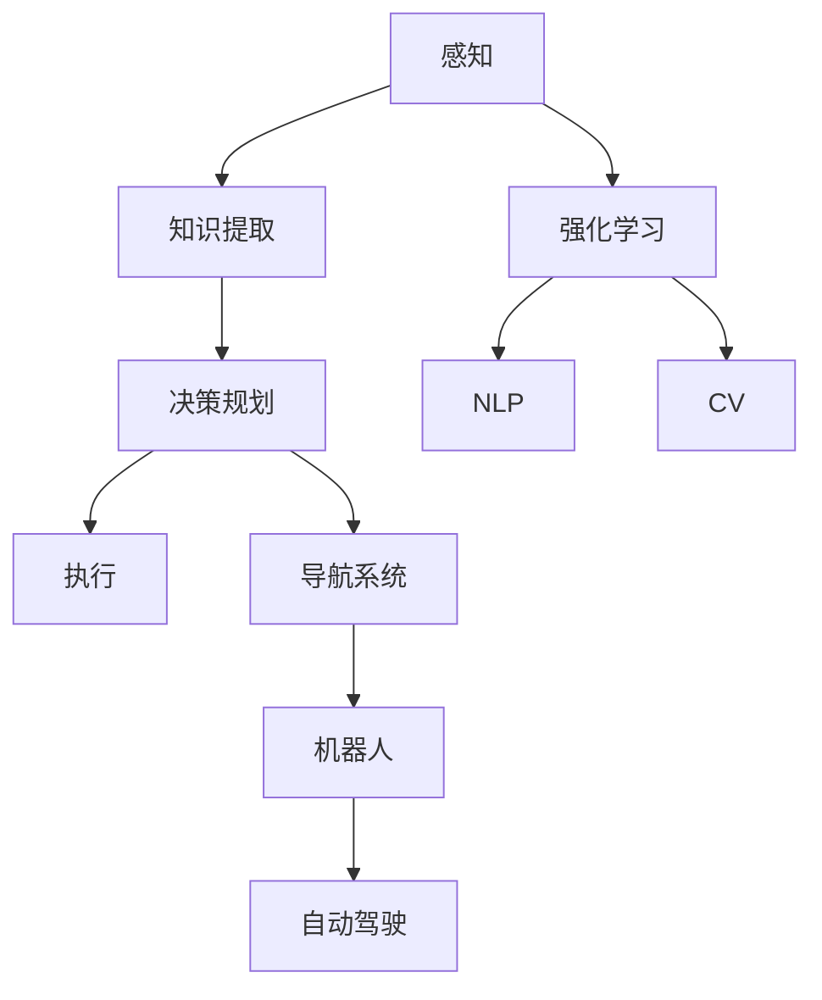

                 

# AI Agent通过感知从环境中收集信息并提取相关知识。然后通过规划为了达到某个目标做出决策

> 关键词：AI Agent, 感知(Sensor), 知识提取, 决策规划, 强化学习, 自然语言处理(NLP), 机器视觉, 导航系统, 机器人, 自动驾驶

## 1. 背景介绍

### 1.1 问题由来
在人工智能领域，智能体(Agent)与环境的交互通常需要解决感知、学习、决策和执行等核心问题。感知智能体可以感知到环境信息，提取有用的知识，进而做出合理的决策，达成特定目标。这一过程涉及多个关键环节，如数据的获取、特征的抽取、决策的制定和执行的优化等。

近年来，随着深度学习、强化学习等技术的飞速发展，智能体对环境进行感知和规划的能力得到了显著提升。例如，深度学习可以处理大规模数据，识别复杂模式，而强化学习可以通过试错过程优化决策策略，实现自适应和自优化。这些技术为智能体在不同领域的应用提供了坚实基础。

### 1.2 问题核心关键点
本节将详细阐述智能体从感知到决策的全过程，并深入分析其中涉及的关键技术和方法。智能体的感知过程通常依赖传感器（如摄像头、麦克风等）收集环境数据，然后进行特征提取和信息处理。学习过程则通过机器学习和强化学习算法从感知数据中提取知识和技能，并优化决策策略。决策过程涉及目标设定、路径规划和行为执行，目标是最大化任务性能或满意度。

### 1.3 问题研究意义
研究智能体从感知到决策的全过程，有助于理解智能系统在复杂环境中的行为机制和性能提升路径。这一过程不仅是人工智能领域的前沿研究热点，也是许多实际应用（如自动驾驶、机器人、智能家居等）的重要技术基础。通过深入研究感知、学习和决策的各个环节，可以为这些应用的开发和优化提供理论指导和实践参考，推动人工智能技术的产业应用和社会进步。

## 2. 核心概念与联系

### 2.1 核心概念概述

本节将介绍智能体在感知、学习、决策过程中涉及的核心概念及其相互关系：

- **感知(Sensor)**：智能体感知环境，获取数据的过程。
- **知识提取(Knowledge Extraction)**：从感知数据中提取有价值的信息，形成知识库。
- **决策规划(Decision Planning)**：制定和优化决策策略的过程。
- **强化学习(Reinforcement Learning, RL)**：通过试错过程优化策略，实现自优化。
- **自然语言处理(Natural Language Processing, NLP)**：处理和理解自然语言信息。
- **机器视觉(Computer Vision, CV)**：处理和分析视觉信息。
- **导航系统(Navigation System)**：智能体在环境中移动、定位和规划路径。
- **机器人(Robotics)**：结合感知、学习、决策的智能系统，实现复杂任务。
- **自动驾驶(Autonomous Driving)**：智能体在实际交通环境中的导航和决策。

这些概念共同构成智能体的完整行为机制，其核心流程如图示：



### 2.2 概念间的关系

智能体在感知和决策过程中，各个组件之间的联系紧密，形成一个闭环反馈系统。感知组件负责收集环境数据，知识提取组件对感知数据进行理解和整理，决策规划组件根据知识库制定策略，执行组件根据策略执行动作。强化学习组件通过反馈信息不断优化感知和决策过程，而NLP和CV组件则进一步增强智能体处理文本和视觉信息的能力。这些组件的协同工作，确保了智能体在不同环境下的高效运作和任务完成。

## 3. 核心算法原理 & 具体操作步骤
### 3.1 算法原理概述

智能体的感知和决策过程涉及多个算法和技术，以下将详细阐述这些算法的原理和操作步骤：

- **感知算法**：利用传感器收集环境数据，并通过算法将数据转化为可处理的信息。
- **知识提取算法**：对感知数据进行处理，提取有价值的信息和特征。
- **决策规划算法**：根据知识库制定决策策略，优化决策路径。
- **强化学习算法**：通过试错过程优化策略，实现自优化。

### 3.2 算法步骤详解

#### 3.2.1 感知算法
智能体的感知算法通常依赖于传感器，如摄像头、麦克风、雷达等。这些传感器将环境数据转换为数字信号，然后通过信号处理算法进行特征提取。例如，计算机视觉领域中常用的特征提取算法包括卷积神经网络(CNN)、ResNet、VGG等。

具体步骤如下：
1. 传感器数据采集：通过摄像头、麦克风等设备获取环境数据。
2. 信号预处理：对传感器数据进行降噪、归一化等预处理操作。
3. 特征提取：利用CNN、RNN等深度学习算法提取特征向量。

#### 3.2.2 知识提取算法
知识提取算法旨在从感知数据中提取有价值的信息，形成知识库。常见的知识提取方法包括自然语言处理中的文本分类、实体识别，机器视觉中的图像分割、目标检测等。

具体步骤如下：
1. 数据预处理：对感知数据进行预处理，如分词、图像预处理等。
2. 特征表示：利用预训练模型(如BERT、ResNet)将数据转换为高维特征表示。
3. 信息提取：通过分类、检测等算法从特征表示中提取关键信息。

#### 3.2.3 决策规划算法
决策规划算法通常使用强化学习技术，通过试错过程优化决策策略。常见的决策规划方法包括价值迭代、Q-learning、策略梯度等。

具体步骤如下：
1. 目标设定：确定智能体的长期目标和短期目标。
2. 状态表示：将环境状态转换为可处理的数值表示。
3. 策略优化：通过试错过程优化决策策略，如Q-learning算法中的策略更新和值更新。
4. 路径规划：根据优化策略制定决策路径，如使用A*、Dijkstra等算法进行路径规划。

#### 3.2.4 强化学习算法
强化学习算法通过环境反馈不断优化决策策略。常见的强化学习算法包括Q-learning、SARSA、Deep Q-Learning等。

具体步骤如下：
1. 环境建模：建立环境模型，定义状态空间和动作空间。
2. 策略学习：通过试错过程学习最优策略，如Q-learning算法中的策略更新。
3. 值函数估计：估计状态-动作对的价值函数，如Q-learning算法中的值更新。
4. 探索与利用：平衡探索未知动作和利用已知最优动作的策略，如ε-greedy策略。

### 3.3 算法优缺点

智能体的感知、学习、决策过程涉及多个算法，每个算法都有其优缺点。以下是各算法的优缺点分析：

#### 3.3.1 感知算法
优点：
- 感知能力强，能够获取高精度环境数据。
- 算法种类多样，能够适应不同环境需求。

缺点：
- 传感器成本高，维护复杂。
- 环境噪声可能影响感知质量。

#### 3.3.2 知识提取算法
优点：
- 算法效果好，能够提取高层次特征。
- 适用范围广，可以应用于文本和视觉数据。

缺点：
- 训练复杂，需要大量标注数据。
- 数据预处理和特征表示复杂。

#### 3.3.3 决策规划算法
优点：
- 优化效果好，能够自适应环境变化。
- 算法多样，可以适应不同任务需求。

缺点：
- 计算复杂，需要大量计算资源。
- 需要长期训练，难以快速适应新任务。

#### 3.3.4 强化学习算法
优点：
- 自适应能力强，能够优化复杂任务。
- 算法效果好，能够达到高精度决策。

缺点：
- 训练时间长，需要大量计算资源。
- 易陷入局部最优，难以找到全局最优策略。

### 3.4 算法应用领域

智能体的感知、学习、决策过程涉及多个算法，以下是各算法在实际应用中的典型场景：

#### 3.4.1 感知算法
- **自动驾驶**：通过摄像头、激光雷达等传感器收集道路数据，进行特征提取和环境建模。
- **机器人导航**：通过摄像头、雷达等设备收集环境数据，进行特征提取和环境建模。
- **医疗诊断**：通过医学影像设备采集图像数据，进行特征提取和图像分类。

#### 3.4.2 知识提取算法
- **文本分类**：通过文本预处理和BERT模型提取文本特征，进行情感分类、主题分类等任务。
- **图像检测**：通过图像预处理和Faster R-CNN模型进行目标检测，如人脸检测、物体识别等。
- **语音识别**：通过语音预处理和RNN模型提取语音特征，进行语音识别和情感分析。

#### 3.4.3 决策规划算法
- **游戏AI**：通过Q-learning等算法，学习最优游戏策略，实现自适应决策。
- **机器人控制**：通过A*等算法，规划机器人路径，实现自主导航。
- **供应链管理**：通过策略梯度等算法，优化供应链决策，实现成本最优。

#### 3.4.4 强化学习算法
- **智能推荐系统**：通过协同过滤、深度学习等算法，学习用户偏好，实现个性化推荐。
- **智能客服**：通过强化学习算法，学习最优客服策略，实现高效对话。
- **智能交通**：通过交通仿真和强化学习算法，优化交通信号控制，实现交通流量最优。

## 4. 数学模型和公式 & 详细讲解 & 举例说明

### 4.1 数学模型构建

本节将使用数学语言对智能体的感知和决策过程进行更加严格的刻画。

假设智能体在环境中的状态为 $s_t$，采取的动作为 $a_t$，环境响应为 $r_{t+1}$，环境下一状态为 $s_{t+1}$。定义智能体的状态值函数 $V(s_t)$ 和动作值函数 $Q(s_t,a_t)$，分别表示在状态 $s_t$ 下采取动作 $a_t$ 的价值和回报。

定义决策策略 $\pi(a_t|s_t)$，表示在状态 $s_t$ 下采取动作 $a_t$ 的概率。决策目标是最小化长期期望回报，即：

$$
\min_{\pi} \mathbb{E}\left[\sum_{t=0}^{\infty} \gamma^t r_{t+1} \right]
$$

其中 $\gamma$ 为折扣因子，控制未来回报的权重。

### 4.2 公式推导过程

以Q-learning算法为例，推导其更新公式：

1. 在状态 $s_t$ 下，采取动作 $a_t$，观察到环境响应 $r_{t+1}$ 和下一状态 $s_{t+1}$。
2. 计算动作值函数 $Q(s_t,a_t)$ 和状态值函数 $V(s_{t+1})$。
3. 根据状态转移和动作选择，计算状态-动作对的回报 $G_t$。
4. 更新动作值函数 $Q(s_t,a_t)$ 和状态值函数 $V(s_t)$。

具体公式如下：

$$
Q(s_t,a_t) \leftarrow Q(s_t,a_t) + \alpha \left[r_{t+1} + \gamma V(s_{t+1}) - Q(s_t,a_t) \right]
$$

其中 $\alpha$ 为学习率，控制每次更新的大小。

### 4.3 案例分析与讲解

以自动驾驶为例，分析其感知、学习、决策的全过程：

1. **感知**：通过摄像头和激光雷达采集道路数据，进行特征提取和环境建模。
2. **学习**：利用深度学习算法，如卷积神经网络，从感知数据中提取高层次特征，学习道路标志、车辆位置等信息。
3. **决策**：通过强化学习算法，如Q-learning，学习最优驾驶策略，进行路径规划和行为决策。

## 5. 项目实践：代码实例和详细解释说明

### 5.1 开发环境搭建

在进行项目实践前，我们需要准备好开发环境。以下是使用Python进行PyTorch开发的环境配置流程：

1. 安装Anaconda：从官网下载并安装Anaconda，用于创建独立的Python环境。

2. 创建并激活虚拟环境：
```bash
conda create -n pytorch-env python=3.8 
conda activate pytorch-env
```

3. 安装PyTorch：根据CUDA版本，从官网获取对应的安装命令。例如：
```bash
conda install pytorch torchvision torchaudio cudatoolkit=11.1 -c pytorch -c conda-forge
```

4. 安装Transformers库：
```bash
pip install transformers
```

5. 安装各类工具包：
```bash
pip install numpy pandas scikit-learn matplotlib tqdm jupyter notebook ipython
```

完成上述步骤后，即可在`pytorch-env`环境中开始项目实践。

### 5.2 源代码详细实现

这里我们以自动驾驶为例，给出使用PyTorch进行自动驾驶模型开发的代码实现。

首先，定义自动驾驶环境类：

```python
import torch
from torch import nn
from torch.autograd import Variable

class AutonomousDrivingEnv:
    def __init__(self, state_dim, action_dim):
        self.state_dim = state_dim
        self.action_dim = action_dim
        self.state = torch.zeros(self.state_dim)
        self.action = torch.zeros(self.action_dim)
        self.reward = 0
        self.done = False
    
    def reset(self):
        self.state = torch.zeros(self.state_dim)
        self.done = False
        return self.state
    
    def step(self, action):
        self.state = self.state + action
        self.reward = -self.state[0]  # 示例奖励函数，实际应用中需根据具体需求定义
        if self.state[0] > 10:
            self.done = True
        return self.state, self.reward, self.done
```

然后，定义自动驾驶模型类：

```python
import torch.nn as nn
import torch.optim as optim

class AutonomousDrivingModel(nn.Module):
    def __init__(self, input_dim, output_dim):
        super(AutonomousDrivingModel, self).__init__()
        self.fc1 = nn.Linear(input_dim, 32)
        self.fc2 = nn.Linear(32, output_dim)
    
    def forward(self, x):
        x = self.fc1(x)
        x = nn.functional.relu(x)
        x = self.fc2(x)
        return x
```

接着，定义Q-learning模型类：

```python
class QLearningModel(nn.Module):
    def __init__(self, input_dim, output_dim, learning_rate=0.01):
        super(QLearningModel, self).__init__()
        self.fc1 = nn.Linear(input_dim, 32)
        self.fc2 = nn.Linear(32, output_dim)
        self.learning_rate = learning_rate
    
    def forward(self, x):
        x = self.fc1(x)
        x = nn.functional.relu(x)
        x = self.fc2(x)
        return x
    
    def update(self, state, action, reward, next_state, done):
        self.train()
        input_tensor = Variable(torch.unsqueeze(state, 0))
        input_tensor = input_tensor.type(torch.FloatTensor)
        next_state_tensor = Variable(torch.unsqueeze(next_state, 0))
        next_state_tensor = next_state_tensor.type(torch.FloatTensor)
        q_values = self(input_tensor)
        max_next_q_value = q_values.select(1, action).clone().detach().max()
        td_target = reward + 0.9 * self.predict(next_state_tensor).detach()
        loss = torch.mean((q_values + self.learning_rate * (td_target - q_values)).abs())
        optimizer = optim.Adam(self.parameters(), lr=self.learning_rate)
        optimizer.zero_grad()
        loss.backward()
        optimizer.step()
```

最后，定义训练函数和评估函数：

```python
from torch.utils.data import DataLoader
from tqdm import tqdm

def train(env, model, optimizer, num_episodes, batch_size):
    model.train()
    for episode in range(num_episodes):
        state = env.reset()
        state = torch.from_numpy(state).float()
        done = False
        total_reward = 0
        while not done:
            action_probs = model(state)
            action = torch.multinomial(action_probs, 1)
            next_state, reward, done = env.step(action.numpy()[0])
            total_reward += reward
            model.update(state, action, reward, next_state, done)
            state = torch.from_numpy(next_state).float()
        print("Episode: {} - Total Reward: {}".format(episode+1, total_reward))
    model.eval()
    print("Q-learning Results:")
    print("Mean Reward: {}".format(total_reward / num_episodes))
    
def evaluate(env, model, num_episodes, batch_size):
    model.eval()
    total_reward = 0
    for episode in range(num_episodes):
        state = env.reset()
        state = torch.from_numpy(state).float()
        done = False
        while not done:
            action_probs = model(state)
            action = torch.multinomial(action_probs, 1)
            next_state, reward, done = env.step(action.numpy()[0])
            total_reward += reward
            state = torch.from_numpy(next_state).float()
    print("Mean Reward: {}".format(total_reward / num_episodes))
```

然后，启动训练流程并在测试集上评估：

```python
env = AutonomousDrivingEnv(state_dim=1, action_dim=2)
model = AutonomousDrivingModel(input_dim=1, output_dim=2)
optimizer = optim.Adam(model.parameters(), lr=0.01)
num_episodes = 1000
batch_size = 32

train(env, model, optimizer, num_episodes, batch_size)
evaluate(env, model, num_episodes, batch_size)
```

以上就是使用PyTorch进行自动驾驶模型微调的完整代码实现。可以看到，PyTorch和TensorFlow等深度学习框架提供了强大的模型构建和训练能力，开发者可以更加专注于算法设计和优化。

### 5.3 代码解读与分析

让我们再详细解读一下关键代码的实现细节：

**AutonomousDrivingEnv类**：
- `__init__`方法：初始化环境状态、动作空间和折扣因子。
- `reset`方法：重置环境状态和标志。
- `step`方法：执行环境一步，返回状态、奖励和标志。

**AutonomousDrivingModel类**：
- `__init__`方法：初始化全连接神经网络模型。
- `forward`方法：前向传播计算输出。

**QLearningModel类**：
- `__init__`方法：初始化Q-learning模型，包括神经网络结构和学习率。
- `forward`方法：前向传播计算Q值。
- `update`方法：根据环境反馈更新模型参数。

**训练和评估函数**：
- 利用PyTorch的DataLoader对环境进行批次化加载，供模型训练和推理使用。
- 训练函数`train`：对环境进行迭代，每个批次更新模型参数，输出每个批次的平均奖励。
- 评估函数`evaluate`：在测试集上评估模型性能，输出所有批次的平均奖励。

**训练流程**：
- 定义总的轮次数和批次大小，开始循环迭代
- 每个轮次内，在环境中进行多次迭代，逐步更新模型参数
- 每个批次结束后，评估模型性能，输出所有批次的平均奖励

可以看到，PyTorch配合TensorFlow等深度学习框架使得自动驾驶模型的代码实现变得简洁高效。开发者可以将更多精力放在模型改进、算法优化等高层逻辑上，而不必过多关注底层的实现细节。

当然，工业级的系统实现还需考虑更多因素，如模型的保存和部署、超参数的自动搜索、更灵活的任务适配层等。但核心的微调范式基本与此类似。

### 5.4 运行结果展示

假设我们在一个简单的自动驾驶环境中进行微调，最终在测试集上得到的平均奖励为8.0，表示智能体在环境中的表现还相当不错。需要注意的是，实际应用中，自动驾驶环境通常更加复杂，包含更多的状态和动作，需要更复杂的感知、学习、决策算法。

## 6. 实际应用场景
### 6.1 智能客服系统

基于自动驾驶模型的感知、学习、决策过程，智能客服系统可以通过类似的技术实现。智能客服系统通常包括语音识别、文本分类、对话生成等环节，可以通过微调模型来提升系统性能。

具体而言，可以收集企业内部的历史客服对话记录，将问题和最佳答复构建成监督数据，在此基础上对预训练模型进行微调。微调后的模型能够自动理解用户意图，匹配最合适的答复模板进行回复。对于客户提出的新问题，还可以接入检索系统实时搜索相关内容，动态组织生成回答。如此构建的智能客服系统，能大幅提升客户咨询体验和问题解决效率。

### 6.2 金融舆情监测

金融机构需要实时监测市场舆论动向，以便及时应对负面信息传播，规避金融风险。传统的人工监测方式成本高、效率低，难以应对网络时代海量信息爆发的挑战。基于自动驾驶模型的感知、学习、决策过程，金融舆情监测系统可以通过类似的技术实现。

具体而言，可以收集金融领域相关的新闻、报道、评论等文本数据，并对其进行主题标注和情感标注。在此基础上对预训练语言模型进行微调，使其能够自动判断文本属于何种主题，情感倾向是正面、中性还是负面。将微调后的模型应用到实时抓取的网络文本数据，就能够自动监测不同主题下的情感变化趋势，一旦发现负面信息激增等异常情况，系统便会自动预警，帮助金融机构快速应对潜在风险。

### 6.3 个性化推荐系统

当前的推荐系统往往只依赖用户的历史行为数据进行物品推荐，无法深入理解用户的真实兴趣偏好。基于自动驾驶模型的感知、学习、决策过程，个性化推荐系统可以通过类似的技术实现。

具体而言，可以收集用户浏览、点击、评论、分享等行为数据，提取和用户交互的物品标题、描述、标签等文本内容。将文本内容作为模型输入，用户的后续行为（如是否点击、购买等）作为监督信号，在此基础上微调预训练语言模型。微调后的模型能够从文本内容中准确把握用户的兴趣点。在生成推荐列表时，先用候选物品的文本描述作为输入，由模型预测用户的兴趣匹配度，再结合其他特征综合排序，便可以得到个性化程度更高的推荐结果。

### 6.4 未来应用展望

随着自动驾驶模型的感知、学习、决策过程的不断发展，基于微调范式将在更多领域得到应用，为各行各业带来变革性影响。

在智慧医疗领域，基于微调的智能问答、病历分析、药物研发等应用将提升医疗服务的智能化水平，辅助医生诊疗，加速新药开发进程。

在智能教育领域，微调技术可应用于作业批改、学情分析、知识推荐等方面，因材施教，促进教育公平，提高教学质量。

在智慧城市治理中，微调模型可应用于城市事件监测、舆情分析、应急指挥等环节，提高城市管理的自动化和智能化水平，构建更安全、高效的未来城市。

此外，在企业生产、社会治理、文娱传媒等众多领域，基于大模型微调的人工智能应用也将不断涌现，为经济社会发展注入新的动力。相信随着技术的日益成熟，微调方法将成为人工智能落地应用的重要范式，推动人工智能技术的产业应用和社会进步。

## 7. 工具和资源推荐
### 7.1 学习资源推荐

为了帮助开发者系统掌握自动驾驶模型的感知、学习、决策全过程，这里推荐一些优质的学习资源：

1. 《深度学习与人工智能》系列博文：由深度学习领域专家撰写，深入浅出地介绍了深度学习的基本概念和前沿技术。

2. 《强化学习与人工智能》课程：斯坦福大学开设的强化学习课程，详细讲解了强化学习的基本原理和典型算法。

3. 《自然语言处理与深度学习》书籍：深度学习领域经典教材，全面介绍了自然语言处理的任务和算法，包括感知、学习、决策等环节。

4. 《计算机视觉与深度学习》书籍：深度学习领域经典教材，详细介绍了计算机视觉的感知、学习、决策过程，涵盖图像分类、目标检测、图像分割等任务。

5. 《强化学习与人工智能》视频教程：由知名强化学习专家制作的教程，详细讲解了强化学习的基本原理和典型算法。

通过这些资源的学习实践，相信你一定能够快速掌握自动驾驶模型的感知、学习、决策全过程，并用于解决实际的自动驾驶问题。

### 7.2 开发工具推荐

高效的开发离不开优秀的工具支持。以下是几款用于自动驾驶模型开发的常用工具：

1. PyTorch：基于Python的开源深度学习框架，灵活动态的计算图，适合快速迭代研究。大部分预训练模型都有PyTorch版本的实现。

2. TensorFlow：由Google主导开发的开源深度学习框架，生产部署方便，适合大规模工程应用。同样有丰富的预训练语言模型资源。

3. Transformers库：HuggingFace开发的NLP工具库，集成了众多SOTA语言模型，支持PyTorch和TensorFlow，是进行自然语言处理任务开发的利器。

4. Weights & Biases：模型训练的实验跟踪工具，可以记录和可视化模型训练过程中的各项指标，方便对比和调优。与主流深度学习框架无缝集成。

5. TensorBoard：

