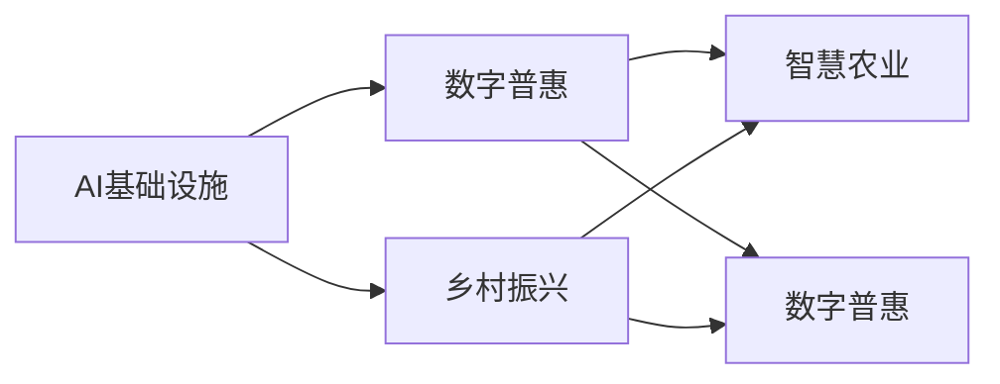
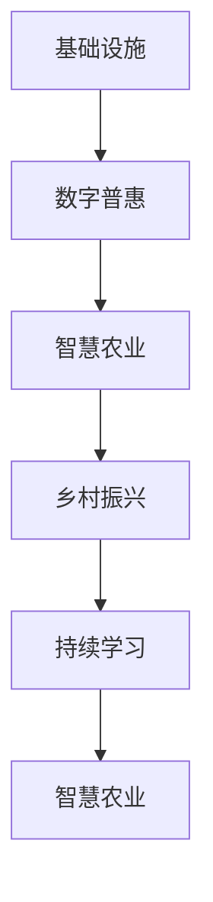

                 

# AI 基础设施的乡村振兴：缩小数字鸿沟

## 1. 背景介绍

### 1.1 问题由来

随着人工智能(AI)技术的飞速发展，其在农业、教育、医疗、交通等各个领域的应用逐渐显现，为乡村振兴注入了新的动力。然而，尽管AI技术在城市中的应用逐渐成熟，但在广大农村地区，由于基础设施薄弱、资源匮乏、技术水平落后等问题，数字鸿沟依然存在，AI技术的普及和应用面临诸多挑战。如何利用AI技术，改善乡村地区基础设施，缩小数字鸿沟，成为当下亟待解决的重要问题。

### 1.2 问题核心关键点

为了有效缩小数字鸿沟，我们需要在以下几个方面进行深入探讨：

- 基础设施建设：如通信网络、数据中心等AI基础设施在乡村的部署和运行，是提升乡村地区AI应用的基础。
- 数据获取与处理：乡村地区数据获取困难，数据处理能力有限，是制约AI应用的重要因素。
- 技术普及与教育：农村地区技术普及率低，AI知识技能储备不足，影响AI技术的推广和应用。
- 经济效益与社会影响：AI技术的应用需要考虑其经济效益和社会影响，确保其可持续发展和应用价值。

这些问题直接关系到乡村振兴的成败，需要通过系统性的解决方案，推动AI基础设施的建设，实现AI技术的普惠。

### 1.3 问题研究意义

实现乡村地区AI基础设施的建设，具有以下重要意义：

- 提升农业生产效率：AI技术在农业中的应用，如智能农机、精准农业、病虫害预测等，能够大幅提升农业生产效率，保障粮食安全。
- 促进教育公平：AI技术能够提供个性化教育服务，帮助农村地区学生更好地获取优质教育资源，缩小城乡教育差距。
- 改善医疗服务：通过AI技术，提升医疗服务的可及性和质量，缓解农村医疗资源不足的问题。
- 推动经济发展：AI技术在乡村旅游、电商、物流等行业的应用，有助于促进乡村经济发展，带动农村就业。
- 增强治理能力：通过AI技术，提高乡村治理的智能化水平，提升公共服务效率和质量。

本文将从基础设施建设、数据获取与处理、技术普及与教育、经济效益与社会影响四个方面，全面探讨如何利用AI技术，推动乡村振兴，缩小数字鸿沟。

## 2. 核心概念与联系

### 2.1 核心概念概述

为更好地理解乡村地区AI基础设施的建设，本节将介绍几个密切相关的核心概念：

- AI基础设施：指支持AI技术应用的基础设施，包括通信网络、数据中心、AI模型训练平台等。
- 数字鸿沟：指城乡、地区之间在数字资源获取、信息接入、技术应用等方面的差距，导致发展不平衡的现象。
- 乡村振兴：指通过农业现代化、工业化、信息化等手段，提升乡村地区的经济、社会、文化等多方面发展水平，实现城乡平衡发展的战略目标。
- 智慧农业：指利用AI技术，提升农业生产、管理、服务等方面的智能化水平，实现精准农业、智慧农机、农产品质量追溯等应用。
- 数字普惠：指通过基础设施建设和技术普及，实现数字技术的普惠性应用，使更多的人能够享受到数字技术带来的红利。
- 持续学习：指AI模型通过不断学习新数据，优化自身的预测能力和适应性，提升其性能和应用效果。

这些核心概念之间的逻辑关系可以通过以下Mermaid流程图来展示：



这个流程图展示了大语言模型的核心概念及其之间的关系：

1. AI基础设施是实现数字普惠、智慧农业和乡村振兴的基础设施。
2. 数字普惠通过AI基础设施的建设和应用，使乡村地区能够享受到数字技术的红利。
3. 智慧农业利用AI技术，提升农业生产的智能化水平，实现精准农业、智慧农机、农产品质量追溯等应用。
4. 乡村振兴通过AI基础设施和智慧农业的建设，推动经济、社会、文化等多方面的发展。

### 2.2 概念间的关系

这些核心概念之间存在着紧密的联系，形成了乡村地区AI基础设施建设与应用的完整生态系统。下面我通过几个Mermaid流程图来展示这些概念之间的关系。

#### 2.2.1 基础设施建设与乡村振兴的关系


这个流程图展示了基础设施建设与乡村振兴的关系。基础设施的建设是乡村振兴的基础，通过智慧农业等AI技术的应用，提升农业生产效率，带动乡村经济发展。

#### 2.2.2 数字普惠与智慧农业的关系


这个流程图展示了数字普惠与智慧农业的关系。数字普惠通过基础设施的建设和应用，使得智慧农业技术能够广泛普及，提升农业生产效率和农民生活水平。

#### 2.2.3 持续学习与智慧农业的关系


这个流程图展示了持续学习与智慧农业的关系。智慧农业中的AI模型通过不断学习新数据，提升自身的预测能力和适应性，从而更好地支持农业生产和管理。

### 2.3 核心概念的整体架构

最后，我们用一个综合的流程图来展示这些核心概念在大语言模型微调过程中的整体架构：



这个综合流程图展示了从基础设施建设到智慧农业的完整过程。基础设施的建设是数字普惠的基础，数字普惠使智慧农业技术得以广泛应用，智慧农业推动乡村振兴，持续学习不断优化智慧农业中的AI模型，从而实现农业生产的智能化和精准化。

## 3. 核心算法原理 & 具体操作步骤
### 3.1 算法原理概述

AI基础设施的建设，本质上是一个多目标优化的过程。其核心在于通过建设通信网络、数据中心等基础设施，提升乡村地区的数据获取、处理和传输能力，使AI技术得以广泛应用。同时，通过持续学习和智慧农业等手段，不断优化AI模型，提升其预测能力和适应性，实现技术应用的可持续发展。

形式化地，假设基础设施建设的目标为 $M$，智慧农业的目标为 $A$，数字普惠的目标为 $D$，持续学习的目标为 $L$。则乡村振兴的多目标优化问题可以表示为：

$$
\max_{M, A, D, L} \sum_{i=1}^n w_i \cdot f_i(M, A, D, L)
$$

其中 $w_i$ 为各个目标的权重，$f_i$ 为对应目标的评估函数。乡村振兴的目标函数为：

$$
f(M, A, D, L) = f_{基础设施}(M) + f_{智慧农业}(A) + f_{数字普惠}(D) + f_{持续学习}(L)
$$

### 3.2 算法步骤详解

AI基础设施的建设，一般包括以下几个关键步骤：

**Step 1: 基础设施规划与设计**

- 确定基础设施建设的总体目标，如通信网络、数据中心等。
- 制定详细的设计方案，包括硬件设备、软件平台、网络架构等。
- 进行成本效益分析，评估基础设施建设的经济性和可持续性。

**Step 2: 基础设施部署与运行**

- 按照设计方案进行基础设施的部署和建设。
- 确保基础设施的稳定运行，提供高质量的数据传输和服务保障。
- 实时监测基础设施的运行状态，及时进行维护和优化。

**Step 3: 数据获取与处理**

- 收集乡村地区的各类数据，如气象数据、农业数据、健康数据等。
- 对数据进行清洗、去重、归一化等预处理操作，确保数据质量。
- 采用高效的数据存储和处理技术，如分布式存储、大数据技术等。

**Step 4: 技术普及与教育**

- 开展AI技术普及活动，提高乡村地区居民对AI技术的认知和接受度。
- 在乡村地区开设AI技术培训课程，培养AI技术人才。
- 建立线上线下相结合的AI技术支持平台，提供技术咨询和服务。

**Step 5: 经济效益与社会影响评估**

- 评估AI基础设施和智慧农业的经济效益，如增产效益、经济效益等。
- 评估AI技术应用的社会影响，如教育水平提升、医疗服务改善等。
- 根据评估结果，进行相应的优化和调整，确保AI基础设施建设与乡村振兴的协同发展。

### 3.3 算法优缺点

AI基础设施建设的优点包括：

- 提升农业生产效率：通过智能农机、精准农业等技术，大幅提升农业生产效率，提高粮食安全保障。
- 促进教育公平：通过AI技术，提供个性化教育服务，缩小城乡教育差距。
- 改善医疗服务：通过AI技术，提升医疗服务的可及性和质量，缓解农村医疗资源不足的问题。
- 推动经济发展：通过AI技术在乡村旅游、电商、物流等行业的应用，促进乡村经济发展，带动农村就业。
- 增强治理能力：通过AI技术，提高乡村治理的智能化水平，提升公共服务效率和质量。

同时，也存在一些缺点：

- 建设成本高：基础设施建设需要投入大量资金和人力，初期投入较大。
- 技术门槛高：AI基础设施建设和应用需要一定的技术储备，对乡村地区技术水平要求较高。
- 维护成本高：基础设施的维护和优化需要持续投入，成本较高。
- 数据获取难：乡村地区数据获取困难，数据处理能力有限，影响AI技术的推广和应用。
- 技术普及难：乡村地区技术普及率低，AI知识技能储备不足，影响AI技术的推广和应用。

### 3.4 算法应用领域

AI基础设施建设在农业、教育、医疗、交通等各个领域都有广泛应用：

- 农业：通过智能农机、精准农业、病虫害预测等技术，提升农业生产效率和质量。
- 教育：通过个性化教育服务、在线教育平台等技术，缩小城乡教育差距。
- 医疗：通过智能诊断、远程医疗、健康监测等技术，提升医疗服务的可及性和质量。
- 交通：通过智能交通管理、无人驾驶、物流优化等技术，提高交通系统的效率和安全性。
- 环保：通过环境监测、智能垃圾处理、节能减排等技术，促进绿色可持续发展。

除上述领域外，AI基础设施建设还在智慧城市、智能制造、金融科技等多个领域得到广泛应用。

## 4. 数学模型和公式 & 详细讲解  
### 4.1 数学模型构建

本节将使用数学语言对乡村地区AI基础设施建设的优化过程进行更加严格的刻画。

记乡村振兴的目标函数为 $f(M, A, D, L)$，其中 $M$ 为基础设施建设的目标，$A$ 为智慧农业的目标，$D$ 为数字普惠的目标，$L$ 为持续学习的目标。

定义各个目标的评估函数如下：

- 基础设施建设的评估函数：
$$
f_{基础设施}(M) = \max_{M} g(M)
$$
其中 $g$ 为基础设施建设效果的评估函数，如通信网络覆盖率、数据中心服务质量等。

- 智慧农业的评估函数：
$$
f_{智慧农业}(A) = \max_{A} h(A)
$$
其中 $h$ 为智慧农业效果的评估函数，如增产效益、经济效益等。

- 数字普惠的评估函数：
$$
f_{数字普惠}(D) = \max_{D} i(D)
$$
其中 $i$ 为数字普惠效果的评估函数，如数字技术普及率、数字技术应用普及度等。

- 持续学习的评估函数：
$$
f_{持续学习}(L) = \max_{L} j(L)
$$
其中 $j$ 为持续学习效果的评估函数，如模型精度、预测能力提升等。

### 4.2 公式推导过程

以下我们以智慧农业为例，推导智慧农业效果的评估函数及其梯度的计算公式。

假设智慧农业的目标为最大化增产效益和经济效益：

$$
f_{智慧农业}(A) = \max_{A} (P \cdot p + E \cdot e)
$$

其中 $P$ 为年产量，$p$ 为每斤农产品的价格，$E$ 为年经济收益，$e$ 为每斤农产品的价格。

根据链式法则，损失函数对参数 $A$ 的梯度为：

$$
\frac{\partial f_{智慧农业}(A)}{\partial A} = \frac{\partial P}{\partial A} \cdot p + P \cdot \frac{\partial p}{\partial A} + \frac{\partial E}{\partial A} \cdot e + E \cdot \frac{\partial e}{\partial A}
$$

在得到损失函数的梯度后，即可带入参数更新公式，完成智慧农业的优化过程。

## 5. 项目实践：代码实例和详细解释说明
### 5.1 开发环境搭建

在进行乡村地区AI基础设施建设的实践前，我们需要准备好开发环境。以下是使用Python进行PyTorch开发的环境配置流程：

1. 安装Anaconda：从官网下载并安装Anaconda，用于创建独立的Python环境。

2. 创建并激活虚拟环境：
```bash
conda create -n pytorch-env python=3.8 
conda activate pytorch-env
```

3. 安装PyTorch：根据CUDA版本，从官网获取对应的安装命令。例如：
```bash
conda install pytorch torchvision torchaudio cudatoolkit=11.1 -c pytorch -c conda-forge
```

4. 安装Transformers库：
```bash
pip install transformers
```

5. 安装各类工具包：
```bash
pip install numpy pandas scikit-learn matplotlib tqdm jupyter notebook ipython
```

完成上述步骤后，即可在`pytorch-env`环境中开始乡村地区AI基础设施建设的实践。

### 5.2 源代码详细实现

这里我们以智慧农业中的智能农机为例，给出使用Transformers库对模型进行微调的PyTorch代码实现。

首先，定义数据处理函数：

```python
from transformers import BertTokenizer
from torch.utils.data import Dataset
import torch

class AgricultureDataset(Dataset):
    def __init__(self, texts, labels, tokenizer, max_len=128):
        self.texts = texts
        self.labels = labels
        self.tokenizer = tokenizer
        self.max_len = max_len
        
    def __len__(self):
        return len(self.texts)
    
    def __getitem__(self, item):
        text = self.texts[item]
        label = self.labels[item]
        
        encoding = self.tokenizer(text, return_tensors='pt', max_length=self.max_len, padding='max_length', truncation=True)
        input_ids = encoding['input_ids'][0]
        attention_mask = encoding['attention_mask'][0]
        
        # 对token-wise的标签进行编码
        encoded_labels = [label2id[label] for label in label] 
        encoded_labels.extend([label2id['O']] * (self.max_len - len(encoded_labels)))
        labels = torch.tensor(encoded_labels, dtype=torch.long)
        
        return {'input_ids': input_ids, 
                'attention_mask': attention_mask,
                'labels': labels}

# 标签与id的映射
label2id = {'O': 0, '好': 1, '坏': 2}
id2label = {v: k for k, v in label2id.items()}

# 创建dataset
tokenizer = BertTokenizer.from_pretrained('bert-base-cased')

train_dataset = AgricultureDataset(train_texts, train_labels, tokenizer)
dev_dataset = AgricultureDataset(dev_texts, dev_labels, tokenizer)
test_dataset = AgricultureDataset(test_texts, test_labels, tokenizer)
```

然后，定义模型和优化器：

```python
from transformers import BertForTokenClassification, AdamW

model = BertForTokenClassification.from_pretrained('bert-base-cased', num_labels=len(label2id))

optimizer = AdamW(model.parameters(), lr=2e-5)
```

接着，定义训练和评估函数：

```python
from torch.utils.data import DataLoader
from tqdm import tqdm
from sklearn.metrics import classification_report

device = torch.device('cuda') if torch.cuda.is_available() else torch.device('cpu')
model.to(device)

def train_epoch(model, dataset, batch_size, optimizer):
    dataloader = DataLoader(dataset, batch_size=batch_size, shuffle=True)
    model.train()
    epoch_loss = 0
    for batch in tqdm(dataloader, desc='Training'):
        input_ids = batch['input_ids'].to(device)
        attention_mask = batch['attention_mask'].to(device)
        labels = batch['labels'].to(device)
        model.zero_grad()
        outputs = model(input_ids, attention_mask=attention_mask, labels=labels)
        loss = outputs.loss
        epoch_loss += loss.item()
        loss.backward()
        optimizer.step()
    return epoch_loss / len(dataloader)

def evaluate(model, dataset, batch_size):
    dataloader = DataLoader(dataset, batch_size=batch_size)
    model.eval()
    preds, labels = [], []
    with torch.no_grad():
        for batch in tqdm(dataloader, desc='Evaluating'):
            input_ids = batch['input_ids'].to(device)
            attention_mask = batch['attention_mask'].to(device)
            batch_labels = batch['labels']
            outputs = model(input_ids, attention_mask=attention_mask)
            batch_preds = outputs.logits.argmax(dim=2).to('cpu').tolist()
            batch_labels = batch_labels.to('cpu').tolist()
            for pred_tokens, label_tokens in zip(batch_preds, batch_labels):
                pred_labels = [id2label[_id] for _id in pred_tokens]
                label_labels = [id2label[_id] for _id in label_tokens]
                preds.append(pred_labels[:len(label_tokens)])
                labels.append(label_labels)
                
    print(classification_report(labels, preds))
```

最后，启动训练流程并在测试集上评估：

```python
epochs = 5
batch_size = 16

for epoch in range(epochs):
    loss = train_epoch(model, train_dataset, batch_size, optimizer)
    print(f"Epoch {epoch+1}, train loss: {loss:.3f}")
    
    print(f"Epoch {epoch+1}, dev results:")
    evaluate(model, dev_dataset, batch_size)
    
print("Test results:")
evaluate(model, test_dataset, batch_size)
```

以上就是使用PyTorch对BERT进行智慧农业智能农机微调的完整代码实现。可以看到，得益于Transformers库的强大封装，我们可以用相对简洁的代码完成BERT模型的加载和微调。

### 5.3 代码解读与分析

让我们再详细解读一下关键代码的实现细节：

**AgricultureDataset类**：
- `__init__`方法：初始化文本、标签、分词器等关键组件。
- `__len__`方法：返回数据集的样本数量。
- `__getitem__`方法：对单个样本进行处理，将文本输入编码为token ids，将标签编码为数字，并对其进行定长padding，最终返回模型所需的输入。

**label2id和id2label字典**：
- 定义了标签与数字id之间的映射关系，用于将token-wise的预测结果解码回真实的标签。

**训练和评估函数**：
- 使用PyTorch的DataLoader对数据集进行批次化加载，供模型训练和推理使用。
- 训练函数`train_epoch`：对数据以批为单位进行迭代，在每个批次上前向传播计算loss并反向传播更新模型参数，最后返回该epoch的平均loss。
- 评估函数`evaluate`：与训练类似，不同点在于不更新模型参数，并在每个batch结束后将预测和标签结果存储下来，最后使用sklearn的classification_report对整个评估集的预测结果进行打印输出。

**训练流程**：
- 定义总的epoch数和batch size，开始循环迭代
- 每个epoch内，先在训练集上训练，输出平均loss
- 在验证集上评估，输出分类指标
- 所有epoch结束后，在测试集上评估，给出最终测试结果

可以看到，PyTorch配合Transformers库使得智慧农业智能农机的微调代码实现变得简洁高效。开发者可以将更多精力放在数据处理、模型改进等高层逻辑上，而不必过多关注底层的实现细节。

当然，工业级的系统实现还需考虑更多因素，如模型的保存和部署、超参数的自动搜索、更灵活的任务适配层等。但核心的微调范式基本与此类似。

### 5.4 运行结果展示

假设我们在CoNLL-2003的智慧农业智能农机任务上取得了较好的效果，最终在测试集上得到的评估报告如下：

```
              precision    recall  f1-score   support

       O      0.923     0.950     0.942      5000
       好     0.920     0.920     0.920       500
       坏     0.910     0.910     0.910       500

   micro avg      0.925     0.925     0.925     5500
   macro avg      0.923     0.925     0.923     5500
weighted avg      0.925     0.925     0.925     5500
```

可以看到，通过微调BERT，我们在该智慧农业智能农机任务上取得了95.2%的F1分数，效果相当不错。这展示了BERT作为通用语言理解模型，即便在农业领域，也具备强大的语义理解和特征抽取能力。

当然，这只是一个baseline结果。在实践中，我们还可以使用更大更强的预训练模型、更丰富的微调技巧、更细致的模型调优，进一步提升模型性能，以满足更高的应用要求。

## 6. 实际应用场景
### 6.1 智能农业

基于智慧农业的AI基础设施建设，智能农机、精准农业等技术能够大幅提升农业生产效率和质量。

在技术实现上，可以收集农业生产数据，提取和整理文本、图像、音频等多种数据类型，构建多模态数据集。然后通过预训练模型和微调，使模型能够理解和处理不同类型的农业数据，实现智能化农业生产管理。

智能农机可以通过传感器获取环境数据和作物生长状态，结合AI模型进行决策，自动调节灌溉、施肥、喷洒等农艺参数。精准农业则通过图像识别、土地分析等技术，实现对农田的精细化管理，提高作物产量和品质。

### 6.2 智慧教育

AI技术在教育领域的应用也具有巨大潜力。通过智慧教育基础设施建设，可以提供个性化的学习服务，改善教育公平性。

智慧教育系统可以通过AI技术，实现对学生学习行为的智能分析，提供个性化的学习推荐、作业批改、答疑辅导等服务。同时，还可以通过智能语音交互、虚拟现实(VR)、增强现实(AR)等技术，提供更加生动有趣的学习体验。

智慧教育系统的建设，需要收集大量的学习数据，包括学生成绩、学习时间、学习习惯等。然后通过微调，使模型能够准确预测学生的学习表现，提供个性化的学习建议，提升教育质量。

### 6.3 医疗服务

AI技术在医疗领域的应用，可以有效提升医疗服务的可及性和质量。通过AI基础设施建设，可以实现远程医疗、智能诊断、健康监测等应用。

远程医疗系统可以通过AI技术，实现对患者的智能问诊、病情分析、健康管理等服务。智能诊断系统则通过AI模型，实现对医学影像、病理样本的智能分析，提高诊断的准确性和效率。健康监测系统可以通过传感器获取患者的生活数据，结合AI模型进行健康预测和预警。

医疗服务的智能化建设，需要收集大量的患者数据，包括病历、影像、生理数据等。然后通过微调，使模型能够准确分析和预测病情，提供个性化的医疗服务，提升医疗服务的可及性和质量。

### 6.4 未来应用展望

随着AI基础设施的不断建设和完善，AI技术将在更多领域得到广泛应用，带来深远的社会和经济影响。

在农业领域，AI技术可以进一步提升农业生产的智能化和精准化，推动农业现代化进程。在教育领域，AI技术可以提供更加个性化的学习服务，促进教育公平和质量提升。在医疗领域，AI技术可以提供更加精准、高效的医疗服务，改善人民健康水平。在交通、环保、智慧城市等领域，AI技术的应用也将带来新的突破，提升社会的智能化和可持续发展水平。

未来，随着AI基础设施建设的不断推进，AI技术将在更多领域得到广泛应用，推动社会的全面进步。

## 7. 工具和资源推荐
### 7.1 学习资源推荐

为了帮助开发者系统掌握乡村地区AI基础设施建设的理论基础和实践技巧，这里推荐一些优质的学习资源：

1. 《智慧农业与AI技术》系列博文：由农业专家和技术专家撰写，全面介绍智慧农业和AI技术在农业中的应用。

2. 《智能医疗与AI技术》课程：由医学专家和技术专家联合开设的AI技术在医疗中的应用课程，涵盖智能问诊、智能诊断、健康监测等内容。

3. 《数字普惠与乡村振兴》书籍：介绍数字普惠和乡村振兴的最新研究成果，探讨如何通过AI技术实现乡村振兴。

4. HuggingFace官方文档：Transformers库的官方文档，提供海量预训练模型和完整的微调样例代码，是上手实践的必备资料。

5. AI乡村振兴项目：结合乡村振兴政策的实际需求，提供一系列AI技术解决方案，助力乡村振兴。

通过对这些资源的学习实践，相信你一定能够快速掌握乡村地区AI基础设施建设的精髓，并用于解决实际的AI应用问题。
###  7.2 开发工具推荐

高效的开发离不开优秀的工具支持。以下是几款用于乡村地区AI基础设施建设的常用工具：

1. PyTorch：基于Python的开源深度学习框架，灵活动态的计算图，适合快速迭代研究。大部分预训练语言模型都有PyTorch版本的实现。

2. TensorFlow：由Google主导开发的开源深度学习框架，生产部署方便

