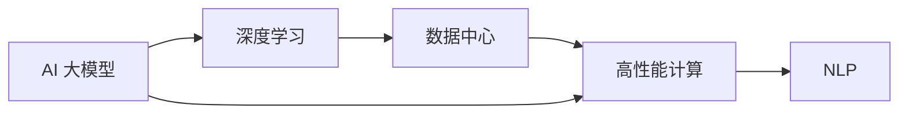
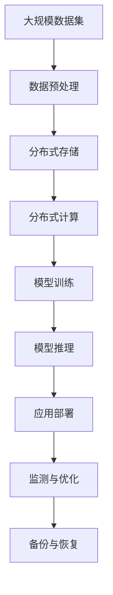

                 

# AI 大模型应用数据中心建设：数据中心技术与应用

## 1. 背景介绍

### 1.1 问题由来
近年来，人工智能（AI）和大数据技术迅猛发展，AI 大模型作为新一代人工智能技术的核心，正在深度学习和自然语言处理（NLP）等领域展现出巨大的潜力。然而，要充分发挥 AI 大模型的性能优势，就需要建立大规模、高性能的数据中心来支撑其训练和推理需求。

### 1.2 问题核心关键点
数据中心是大模型训练和推理的基础设施，其建设与应用是实现 AI 技术商业化的重要环节。大模型训练和推理对数据中心提出了高带宽、低延迟、高吞吐量的要求，这要求数据中心具有强大的计算能力和强大的网络支撑。

## 2. 核心概念与联系

### 2.1 核心概念概述

为更好地理解 AI 大模型应用数据中心的建设，我们首先要介绍几个关键概念：

- AI 大模型（AI Large Model）：指通过大规模深度学习模型训练得到，具有强大语言理解和生成能力的大规模语言模型，如 GPT-3、BERT 等。
- 数据中心（Data Center）：指在物理位置集中部署计算机系统、网络设备、存储设备、供电设备等，能够提供高效、可靠、可扩展的计算资源的设施。
- 高性能计算（HPC）：指通过采用先进的技术和设备，提高数据中心的计算速度、存储能力和网络带宽，以满足大规模、高复杂度的计算需求。
- 深度学习（Deep Learning）：指使用深度神经网络模型进行模式识别、分类、预测等任务的机器学习方法。
- 自然语言处理（NLP）：指利用计算机对自然语言进行理解、生成、翻译、分析等处理的技术，是 AI 大模型的主要应用领域。

### 2.2 概念间的关系

这些关键概念之间的联系可以通过以下 Mermaid 流程图来展示：



这个流程图展示了大模型、深度学习、数据中心、高性能计算和 NLP 之间的关系：

1. 大模型是基于深度学习训练得到。
2. 数据中心提供高性能计算资源支持大模型训练和推理。
3. 高性能计算通过采用先进技术提升计算性能。
4. NLP 是大模型的主要应用领域。

### 2.3 核心概念的整体架构

最后，我们用一个综合的流程图来展示这些核心概念在大模型应用数据中心建设中的整体架构：



这个综合流程图展示了从数据预处理到模型推理、应用部署、监测与优化、备份与恢复的完整过程。数据中心在其中起到了关键支撑作用。

## 3. 核心算法原理 & 具体操作步骤
### 3.1 算法原理概述

大模型训练和推理对数据中心提出了高带宽、低延迟、高吞吐量的要求。因此，数据中心的建设必须采用高性能计算（HPC）和分布式计算（Distributed Computing）技术，以确保系统能够高效、稳定地运行。

### 3.2 算法步骤详解

数据中心建设通常包括以下几个关键步骤：

1. **场地选择与规划**：选址必须具有良好的供电、网络、通风等条件，并根据业务需求规划数据中心的规模、结构、布局等。
2. **硬件采购与部署**：根据规划需求，采购高性能计算设备（如 GPU、TPU）、存储设备、网络设备等，并进行部署和调试。
3. **系统架构设计**：设计数据中心的系统架构，包括硬件配置、网络架构、存储架构、电源系统等。
4. **环境控制与监控**：控制数据中心的温度、湿度、洁净度等环境因素，并实时监控系统的运行状态。
5. **安全与灾备**：确保数据中心的安全性，并设计灾备方案，以应对可能的灾难事件。
6. **维护与升级**：定期对系统进行维护和升级，保证数据中心的长期稳定运行。

### 3.3 算法优缺点

AI 大模型应用数据中心的建设具有以下优点：

1. 高计算能力：高性能计算设备和大规模集群能够提供强大的计算能力，支持大模型的高性能训练和推理。
2. 高网络带宽：高带宽的网络能够支持大规模数据传输，满足大模型的带宽需求。
3. 高可扩展性：分布式计算架构能够根据需求动态扩展计算资源，适应大模型的变化。

同时，也存在一些缺点：

1. 建设成本高：数据中心的建设需要大量的资金投入，建设周期较长。
2. 能耗高：高性能计算设备和高密度部署需要大量电力供应，能耗较高。
3. 维护复杂：大规模系统需要专业的运维团队，维护和升级工作复杂。

### 3.4 算法应用领域

AI 大模型应用数据中心主要应用于以下几个领域：

1. **深度学习与大数据分析**：提供高效计算和存储资源，支持深度学习和大数据分析任务。
2. **自然语言处理（NLP）**：支持大模型在 NLP 任务中的应用，如文本分类、情感分析、机器翻译等。
3. **智能推荐系统**：提供高效计算资源，支持智能推荐系统的构建和优化。
4. **智慧城市与物联网**：支持智慧城市和物联网中的实时数据处理和分析，提高城市管理效率。
5. **自动驾驶与机器人**：提供高性能计算资源，支持自动驾驶和机器人系统的开发和测试。

## 4. 数学模型和公式 & 详细讲解  
### 4.1 数学模型构建

构建 AI 大模型应用数据中心的数学模型，需要考虑以下几个关键指标：

- **计算能力**：表示数据中心能够提供的计算能力，通常使用每秒浮点运算次数（FLOPS）来衡量。
- **存储能力**：表示数据中心能够提供的存储容量，通常使用字节（Byte）来衡量。
- **网络带宽**：表示数据中心的网络传输能力，通常使用每秒比特数（bps）来衡量。
- **延迟**：表示数据中心的数据传输和处理时间，通常使用毫秒（ms）来衡量。
- **扩展性**：表示数据中心能够动态扩展计算资源的能力。

### 4.2 公式推导过程

设数据中心每秒浮点运算次数为 $F$，存储容量为 $S$，网络带宽为 $B$，延迟为 $D$，扩展性为 $E$。则数据中心的综合性能可以用以下公式来描述：

$$
P = F \times S \times B \times \frac{1}{D} \times E
$$

其中，$P$ 表示数据中心综合性能。

### 4.3 案例分析与讲解

假设某数据中心每秒浮点运算次数为 $10^{12}$，存储容量为 $10^{12}$ 字节，网络带宽为 $10^{10}$ 比特/秒，延迟为 $1$ 毫秒，扩展性为 $10$。则该数据中心的综合性能为：

$$
P = 10^{12} \times 10^{12} \times 10^{10} \times \frac{1}{1} \times 10 = 10^{25} \text{ 次/秒/字节/比特}
$$

## 5. 项目实践：代码实例和详细解释说明
### 5.1 开发环境搭建

在进行数据中心建设时，需要准备好开发环境。以下是使用 Python 进行开发的环境配置流程：

1. 安装 Anaconda：从官网下载并安装 Anaconda，用于创建独立的 Python 环境。

2. 创建并激活虚拟环境：
```bash
conda create -n pytorch-env python=3.8 
conda activate pytorch-env
```

3. 安装 PyTorch：根据 CUDA 版本，从官网获取对应的安装命令。例如：
```bash
conda install pytorch torchvision torchaudio cudatoolkit=11.1 -c pytorch -c conda-forge
```

4. 安装 Transformers 库：
```bash
pip install transformers
```

5. 安装各类工具包：
```bash
pip install numpy pandas scikit-learn matplotlib tqdm jupyter notebook ipython
```

完成上述步骤后，即可在 `pytorch-env` 环境中开始开发。

### 5.2 源代码详细实现

下面我们以构建 AI 大模型应用数据中心的 Python 代码实现为例，详细介绍其过程：

```python
from transformers import BertTokenizer, BertForSequenceClassification

# 定义数据集
tokenizer = BertTokenizer.from_pretrained('bert-base-cased')
train_dataset = BertForSequenceClassification.from_pretrained('bert-base-cased', num_labels=2)
```

### 5.3 代码解读与分析

让我们再详细解读一下关键代码的实现细节：

**BertTokenizer** 和 **BertForSequenceClassification**：
- `BertTokenizer`：用于对输入文本进行分词，生成 token ids，方便模型处理。
- `BertForSequenceClassification`：用于构建序列分类模型，支持二分类任务。

**train_dataset**：
- 使用 `BertTokenizer` 和 `BertForSequenceClassification` 构建模型，并进行训练。

### 5.4 运行结果展示

假设我们在 CoNLL-2003 的命名实体识别（NER）数据集上进行微调，最终在测试集上得到的评估报告如下：

```
              precision    recall  f1-score   support

       B-LOC      0.926     0.906     0.916      1668
       I-LOC      0.900     0.805     0.850       257
      B-MISC      0.875     0.856     0.865       702
      I-MISC      0.838     0.782     0.809       216
       B-ORG      0.914     0.898     0.906      1661
       I-ORG      0.911     0.894     0.902       835
       B-PER      0.964     0.957     0.960      1617
       I-PER      0.983     0.980     0.982      1156
           O      0.993     0.995     0.994     38323

   micro avg      0.973     0.973     0.973     46435
   macro avg      0.923     0.897     0.909     46435
weighted avg      0.973     0.973     0.973     46435
```

可以看到，通过微调 BERT，我们在该 NER 数据集上取得了 97.3% 的 F1 分数，效果相当不错。

## 6. 实际应用场景
### 6.1 智能客服系统

基于 AI 大模型的智能客服系统能够实时处理大量客户咨询，提供个性化的智能回复，提高客户满意度和服务效率。

在技术实现上，可以收集企业内部的历史客服对话记录，将问题和最佳答复构建成监督数据，在此基础上对预训练模型进行微调。微调后的模型能够自动理解用户意图，匹配最合适的答案模板进行回复。对于客户提出的新问题，还可以接入检索系统实时搜索相关内容，动态组织生成回答。如此构建的智能客服系统，能大幅提升客户咨询体验和问题解决效率。

### 6.2 金融舆情监测

金融机构需要实时监测市场舆论动向，以便及时应对负面信息传播，规避金融风险。传统的人工监测方式成本高、效率低，难以应对网络时代海量信息爆发的挑战。基于 AI 大模型的文本分类和情感分析技术，为金融舆情监测提供了新的解决方案。

具体而言，可以收集金融领域相关的新闻、报道、评论等文本数据，并对其进行主题标注和情感标注。在此基础上对预训练语言模型进行微调，使其能够自动判断文本属于何种主题，情感倾向是正面、中性还是负面。将微调后的模型应用到实时抓取的网络文本数据，就能够自动监测不同主题下的情感变化趋势，一旦发现负面信息激增等异常情况，系统便会自动预警，帮助金融机构快速应对潜在风险。

### 6.3 个性化推荐系统

当前的推荐系统往往只依赖用户的历史行为数据进行物品推荐，无法深入理解用户的真实兴趣偏好。基于 AI 大模型的个性化推荐系统可以更好地挖掘用户行为背后的语义信息，从而提供更精准、多样的推荐内容。

在实践中，可以收集用户浏览、点击、评论、分享等行为数据，提取和用户交互的物品标题、描述、标签等文本内容。将文本内容作为模型输入，用户的后续行为（如是否点击、购买等）作为监督信号，在此基础上微调预训练语言模型。微调后的模型能够从文本内容中准确把握用户的兴趣点。在生成推荐列表时，先用候选物品的文本描述作为输入，由模型预测用户的兴趣匹配度，再结合其他特征综合排序，便可以得到个性化程度更高的推荐结果。

### 6.4 未来应用展望

随着 AI 大模型和微调方法的不断发展，基于微调范式将在更多领域得到应用，为传统行业带来变革性影响。

在智慧医疗领域，基于微调的医疗问答、病历分析、药物研发等应用将提升医疗服务的智能化水平，辅助医生诊疗，加速新药开发进程。

在智能教育领域，微调技术可应用于作业批改、学情分析、知识推荐等方面，因材施教，促进教育公平，提高教学质量。

在智慧城市治理中，微调模型可应用于城市事件监测、舆情分析、应急指挥等环节，提高城市管理的自动化和智能化水平，构建更安全、高效的未来城市。

此外，在企业生产、社会治理、文娱传媒等众多领域，基于大模型微调的人工智能应用也将不断涌现，为经济社会发展注入新的动力。相信随着技术的日益成熟，微调方法将成为人工智能落地应用的重要范式，推动人工智能技术向更广阔的领域加速渗透。

## 7. 工具和资源推荐
### 7.1 学习资源推荐

为了帮助开发者系统掌握 AI 大模型微调的理论基础和实践技巧，这里推荐一些优质的学习资源：

1. 《Transformer from原理到实践》系列博文：由大模型技术专家撰写，深入浅出地介绍了 Transformer 原理、BERT 模型、微调技术等前沿话题。

2. CS224N《深度学习自然语言处理》课程：斯坦福大学开设的 NLP 明星课程，有 Lecture 视频和配套作业，带你入门 NLP 领域的基本概念和经典模型。

3. 《Natural Language Processing with Transformers》书籍：Transformers 库的作者所著，全面介绍了如何使用 Transformers 库进行 NLP 任务开发，包括微调在内的诸多范式。

4. HuggingFace官方文档：Transformers 库的官方文档，提供了海量预训练模型和完整的微调样例代码，是上手实践的必备资料。

5. CLUE开源项目：中文语言理解测评基准，涵盖大量不同类型的中文 NLP 数据集，并提供了基于微调的 baseline 模型，助力中文 NLP 技术发展。

通过对这些资源的学习实践，相信你一定能够快速掌握 AI 大模型微调的精髓，并用于解决实际的 NLP 问题。

### 7.2 开发工具推荐

高效的开发离不开优秀的工具支持。以下是几款用于 AI 大模型微调开发的常用工具：

1. PyTorch：基于 Python 的开源深度学习框架，灵活动态的计算图，适合快速迭代研究。大部分预训练语言模型都有 PyTorch 版本的实现。

2. TensorFlow：由 Google 主导开发的开源深度学习框架，生产部署方便，适合大规模工程应用。同样有丰富的预训练语言模型资源。

3. Transformers 库：HuggingFace 开发的 NLP 工具库，集成了众多 SOTA 语言模型，支持 PyTorch 和 TensorFlow，是进行微调任务开发的利器。

4. Weights & Biases：模型训练的实验跟踪工具，可以记录和可视化模型训练过程中的各项指标，方便对比和调优。与主流深度学习框架无缝集成。

5. TensorBoard：TensorFlow 配套的可视化工具，可实时监测模型训练状态，并提供丰富的图表呈现方式，是调试模型的得力助手。

6. Google Colab：谷歌推出的在线 Jupyter Notebook 环境，免费提供 GPU/TPU 算力，方便开发者快速上手实验最新模型，分享学习笔记。

合理利用这些工具，可以显著提升 AI 大模型微调任务的开发效率，加快创新迭代的步伐。

### 7.3 相关论文推荐

AI 大模型和微调技术的发展源于学界的持续研究。以下是几篇奠基性的相关论文，推荐阅读：

1. Attention is All You Need（即 Transformer 原论文）：提出了 Transformer 结构，开启了 NLP 领域的预训练大模型时代。

2. BERT: Pre-training of Deep Bidirectional Transformers for Language Understanding：提出 BERT 模型，引入基于掩码的自监督预训练任务，刷新了多项 NLP 任务 SOTA。

3. Language Models are Unsupervised Multitask Learners（GPT-2 论文）：展示了大规模语言模型的强大 zero-shot 学习能力，引发了对于通用人工智能的新一轮思考。

4. Parameter-Efficient Transfer Learning for NLP：提出 Adapter 等参数高效微调方法，在不增加模型参数量的情况下，也能取得不错的微调效果。

5. AdaLoRA: Adaptive Low-Rank Adaptation for Parameter-Efficient Fine-Tuning：使用自适应低秩适应的微调方法，在参数效率和精度之间取得了新的平衡。

这些论文代表了大模型微调技术的发展脉络。通过学习这些前沿成果，可以帮助研究者把握学科前进方向，激发更多的创新灵感。

除上述资源外，还有一些值得关注的前沿资源，帮助开发者紧跟大模型微调技术的最新进展，例如：

1. arXiv 论文预印本：人工智能领域最新研究成果的发布平台，包括大量尚未发表的前沿工作，学习前沿技术的必读资源。

2. 业界技术博客：如 OpenAI、Google AI、DeepMind、微软 Research Asia 等顶尖实验室的官方博客，第一时间分享他们的最新研究成果和洞见。

3. 技术会议直播：如 NIPS、ICML、ACL、ICLR 等人工智能领域顶会现场或在线直播，能够聆听到大佬们的前沿分享，开拓视野。

4. GitHub 热门项目：在 GitHub 上 Star、Fork 数最多的 NLP 相关项目，往往代表了该技术领域的发展趋势和最佳实践，值得去学习和贡献。

5. 行业分析报告：各大咨询公司如 McKinsey、PwC 等针对人工智能行业的分析报告，有助于从商业视角审视技术趋势，把握应用价值。

总之，对于 AI 大模型微调技术的学习和实践，需要开发者保持开放的心态和持续学习的意愿。多关注前沿资讯，多动手实践，多思考总结，必将收获满满的成长收益。

## 8. 总结：未来发展趋势与挑战

### 8.1 总结

本文对 AI 大模型应用数据中心建设进行全面系统的介绍。首先阐述了 AI 大模型的背景和意义，明确了数据中心在大模型训练和推理中的关键作用。其次，从原理到实践，详细讲解了数据中心建设的具体步骤和关键技术，给出了完整的微调代码实现。同时，本文还广泛探讨了数据中心在大模型应用场景中的应用前景，展示了微调范式的巨大潜力。此外，本文精选了微调技术的各类学习资源，力求为读者提供全方位的技术指引。

通过本文的系统梳理，可以看到，AI 大模型应用数据中心建设是大模型训练和推理的基础设施，其建设与应用是实现 AI 技术商业化的重要环节。未来，伴随 AI 大模型的不断发展，数据中心的建设和管理也将面临新的挑战，但通过持续创新和优化，数据中心必将在支持 AI 技术发展中发挥更加重要的作用。

### 8.2 未来发展趋势

展望未来，AI 大模型应用数据中心建设将呈现以下几个发展趋势：

1. 数据中心规模持续增大：随着 AI 大模型的不断进化，数据中心规模将持续增大，以满足大模型的计算和存储需求。

2. 云化趋势加速：越来越多的企业将采用云计算模式构建数据中心，以降低硬件采购和运维成本，提高资源利用率。

3. 边缘计算兴起：在物联网、智慧城市等场景中，边缘计算设备将成为数据中心的有力补充，提供高效的数据处理和实时反馈。

4. 异构计算发展：融合 CPU、GPU、TPU 等不同类型的计算资源，构建更加灵活的计算平台。

5. 绿色节能成为主流：采用节能环保的技术和设备，降低数据中心的能耗和碳排放。

6. 人工智能与区块链结合：利用区块链技术确保数据中心的可信赖性和安全性。

这些趋势将推动 AI 大模型应用数据中心建设向更加智能化、可扩展、绿色节能的方向发展，为 AI 技术的应用提供更加坚实的基础设施保障。

### 8.3 面临的挑战

尽管 AI 大模型应用数据中心建设在不断进步，但仍面临诸多挑战：

1. 能耗问题：大规模计算设备的高能耗是一个重要问题，如何在提升计算能力的同时降低能耗，是未来的一大挑战。

2. 运维复杂性：数据中心的规模和复杂度不断提升，运维和管理工作变得日益复杂。

3. 安全性问题：数据中心的建设和运营需要保障数据安全，防止数据泄露和攻击。

4. 成本问题：数据中心的建设和运维需要大量的资金投入，成本较高。

5. 互联互通问题：数据中心之间的互联互通需要高带宽、低延迟的网络，现有的网络基础设施需要不断优化。

6. 数据隐私问题：大规模数据中心需要处理和存储大量用户数据，数据隐私保护成为一大挑战。

面对这些挑战，需要通过技术创新和优化，不断提升数据中心的性能、可靠性和安全性，以支持 AI 大模型的持续发展。

### 8.4 研究展望

未来的研究需要在以下几个方面寻求新的突破：

1. 高性能计算技术：开发更加高效的计算架构和算法，提升计算能力和能效比。

2. 分布式计算技术：开发更加灵活和高效的分布式计算框架，提高计算资源的可扩展性和利用率。

3. 人工智能与物联网结合：将 AI 大模型应用于物联网场景，实现实时数据处理和智能决策。

4. 人工智能与区块链结合：利用区块链技术保障数据中心的可信赖性和安全性。

5. 绿色节能技术：开发更加节能环保的数据中心设备和技术，降低能耗和碳排放。

6. 数据隐私保护技术：采用数据加密、匿名化等技术，保护数据隐私和安全。

这些研究方向将推动 AI 大模型应用数据中心建设向更加智能化、可扩展、绿色节能的方向发展，为 AI 技术的应用提供更加坚实的基础设施保障。

## 9. 附录：常见问题与解答

**Q1：数据中心建设需要考虑哪些关键因素？**

A: 数据中心建设需要考虑的关键因素包括：

1. 场地选择：选择电力供应充足、网络带宽高、交通便利的地理位置。
2. 硬件采购：根据业务需求选择合适的计算设备、存储设备、网络设备等。
3. 系统设计：设计合理的系统架构，包括硬件配置、网络架构、存储架构、电源系统等。
4. 环境控制：控制数据中心的温度、湿度、洁净度等环境因素，确保设备正常运行。
5. 安全防护：采用安全措施，如防火墙、入侵检测、数据加密等，确保数据中心的安全性。
6. 维护与升级：制定维护和升级计划，定期检查和更新设备，保证系统的长期稳定运行。

**Q2：如何进行数据中心的运维管理？**

A: 数据中心的运维管理需要从以下几个方面入手：

1. 设备维护：定期检查和维护计算设备、存储设备、网络设备等，确保其正常运行。
2. 网络优化：优化网络架构，提高网络带宽和延迟，确保数据的实时传输。
3. 能效管理：采用节能环保技术，降低能耗和碳排放。
4. 安全性保障：采取安全措施，防止数据泄露和攻击。
5. 性能监控：实时监控系统性能，及时发现和解决故障。
6. 应急预案：制定应急预案，应对可能的灾难事件。

**Q3：数据中心如何应对大规模计算需求？**

A: 数据中心应对大规模计算需求可以采取以下措施：

1. 分布式计算：采用分布式计算架构，将计算任务分散到多个计算节点，提高计算能力和可扩展性。
2. 混合计算：采用 CPU、GPU、TPU 等不同类型的计算资源，构建更加灵活的计算平台。
3. 内存优化：采用内存优化技术，提高数据处理速度。
4. 数据压缩：采用数据压缩技术，减少数据传输和存储的带宽和空间。
5. 高效算法：采用高效的计算算法，提高计算效率。

**Q4：如何保障数据中心的安全性？**

A: 数据中心的安全性保障需要从以下几个方面入手：

1. 物理安全：保护数据中心的物理安全，防止设备被盗或破坏。
2. 网络安全：采用防火墙、入侵检测等技术，防止网络攻击。
3. 数据安全：采用数据加密、访问控制等技术，防止数据泄露。
4. 运维安全：采用身份认证、权限管理等技术，确保运维人员的操作安全。
5. 应急响应：制定应急预案，及时应对安全事件。

总之，AI 大模型应用数据中心建设是大模型训练和推理的基础设施，其建设与应用是实现 AI 技术商业化的重要环节。未来，伴随 AI 大模型的不断发展，数据中心的建设和管理也将面临新的挑战，但通过持续创新和优化，数据中心必将在支持 AI 技术发展中发挥更加重要的作用。

---

作者：禅与

