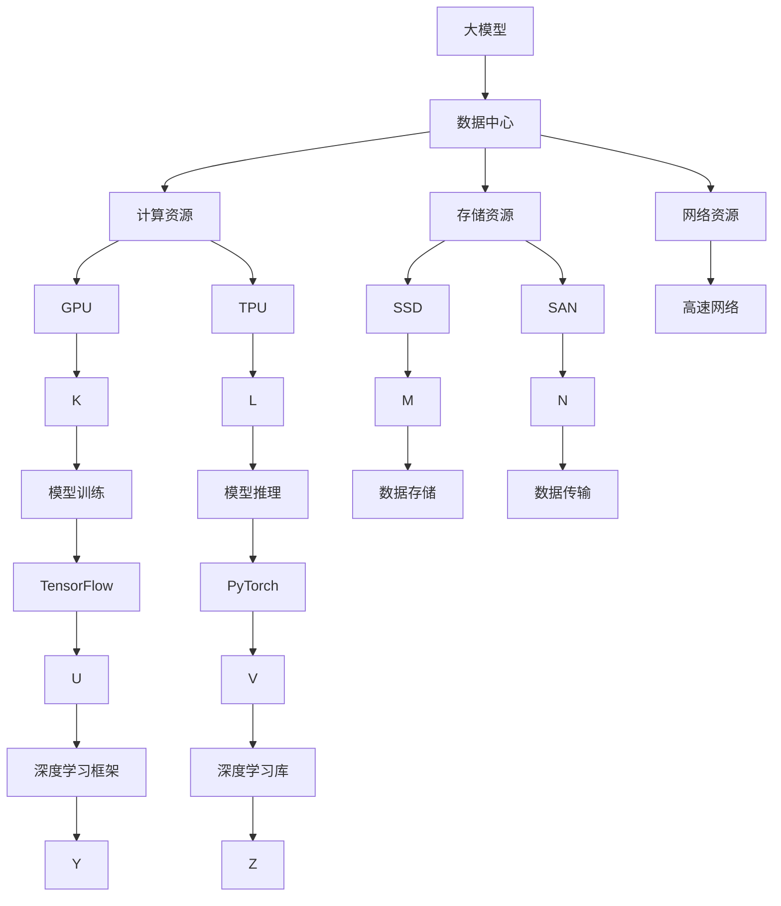
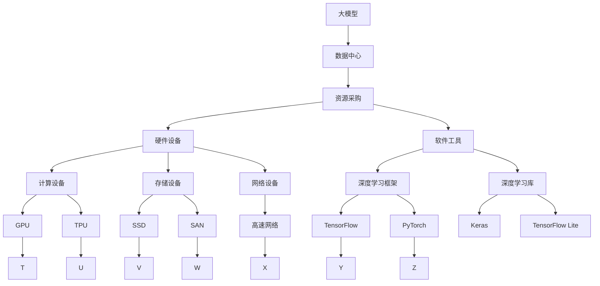

                 

## 1. 背景介绍

在人工智能快速发展的当下，大模型的训练和部署对数据中心资源的需求日益增加。如何高效地采购和管理数据中心资源，已经成为企业AI应用落地的关键环节。本文将探讨AI大模型在数据中心采购和管理中的挑战、方法和实践，为构建高效、稳定的AI基础设施提供参考。

### 1.1 问题由来

随着深度学习技术的飞速发展，大模型如BERT、GPT等在自然语言处理、计算机视觉、语音识别等领域取得了显著的进展。这些模型的训练和部署通常需要大量的计算资源，包括GPU、TPU等高性能硬件设备。此外，数据中心还需要提供高速网络、海量存储等基础设施支持。如何有效采购和管理这些资源，满足AI模型的高需求，成为企业必须面对的问题。

### 1.2 问题核心关键点

AI大模型的资源需求具有以下几个特点：

- **计算密集性**：大模型的训练和推理涉及大量的浮点数计算，对计算资源的需求极高。
- **内存需求大**：模型参数量大，每个GPU或TPU核心需要消耗大量内存。
- **带宽要求高**：模型训练需要高速数据传输，对网络带宽有较高要求。
- **数据存储量大**：模型训练和推理过程需要大量的数据存储和备份。

这些需求使得数据中心的采购和管理变得更加复杂和精细。

### 1.3 问题研究意义

合理的数据中心采购和管理，对于AI应用的顺利部署和运行具有重要意义：

- **确保资源充足**：避免因资源不足导致模型无法训练或推理的问题。
- **提升训练和推理效率**：通过优化资源配置和利用率，加速模型的训练和推理。
- **降低成本**：在保证性能的前提下，通过合理的采购策略和利用率优化，降低数据中心的运营成本。
- **保障安全性和稳定性**：有效管理和监控数据中心资源，保障AI系统的稳定运行。

## 2. 核心概念与联系

### 2.1 核心概念概述

- **大模型**：指具有大规模参数量的深度学习模型，如BERT、GPT等，主要用于复杂的NLP、CV、语音处理等任务。
- **数据中心**：提供高性能计算资源、存储资源和网络资源的物理设施，支持大规模模型的训练和部署。
- **采购管理**：指企业根据AI模型需求，选择合适的硬件设备、软件工具和基础设施，并进行资源配置、利用率监控和优化的过程。

### 2.2 概念间的关系

这些概念之间的联系可以通过以下Mermaid流程图来展示：



这个流程图展示了大模型、数据中心和采购管理之间的基本联系：

1. 大模型依赖于高性能计算资源、存储资源和网络资源。
2. 数据中心提供了这些基础设施。
3. 通过采购管理，企业根据需求选择并配置资源，支持大模型的训练和部署。

### 2.3 核心概念的整体架构

最后，我们用一个综合的流程图来展示这些概念的整体架构：



这个综合流程图展示了从大模型到数据中心，再到具体资源采购和配置的完整流程。

## 3. 核心算法原理 & 具体操作步骤

### 3.1 算法原理概述

AI大模型在数据中心的采购和管理，本质上是一个资源优化和调度的过程。其核心思想是通过优化资源的配置和利用率，在满足模型需求的同时，最大化数据中心的资源利用效率，降低成本。

形式化地，假设企业需要部署一个大模型 $M$，所需计算资源为 $C$，存储资源为 $S$，网络带宽为 $B$。目标是最小化总成本，即：

$$
\min_{C,S,B} (Cost_{CPU} \times C + Cost_{GPU} \times C + Cost_{SSD} \times S + Cost_{TPU} \times C + Cost_{SAN} \times S + Cost_{网络} \times B)
$$

其中，$Cost_{CPU}$、$Cost_{GPU}$、$Cost_{SSD}$、$Cost_{TPU}$、$Cost_{SAN}$ 和 $Cost_{网络}$ 分别表示不同资源的单位成本。

### 3.2 算法步骤详解

基于上述优化目标，AI大模型在数据中心的采购和管理可以按照以下步骤进行：

1. **需求分析**：根据AI模型和任务的需求，确定所需的计算、存储和网络资源。
2. **资源评估**：评估现有数据中心的资源状况，包括设备类型、数量、利用率等。
3. **采购计划**：根据需求和评估结果，制定采购计划，选择和订购所需的硬件设备和软件工具。
4. **资源配置**：将采购的设备和工具配置到数据中心，并进行初始化设置。
5. **资源调度**：根据模型的训练和推理需求，动态调整资源配置，优化资源利用率。
6. **性能监控**：实时监控资源使用情况，及时发现和解决性能瓶颈。
7. **成本控制**：通过优化资源配置和使用，降低数据中心的运营成本。

### 3.3 算法优缺点

AI大模型在数据中心的采购和管理具有以下优点：

- **灵活性高**：根据AI模型的不同需求，可以灵活配置和调整资源。
- **资源利用率高**：通过优化资源配置和使用，可以提高数据中心的资源利用效率，降低成本。
- **可扩展性强**：可以逐步增加资源，支持模型的扩展和升级。

同时，也存在一些局限性：

- **初始成本高**：采购高性能计算资源和存储设备需要较高的初始投入。
- **技术要求高**：需要具备一定的AI和计算机技术，才能有效地管理和优化资源。
- **数据中心建设周期长**：从采购到部署，整个过程周期较长。

### 3.4 算法应用领域

AI大模型在数据中心的采购和管理方法，已经在多个AI应用领域得到广泛应用，例如：

- **自然语言处理(NLP)**：训练和部署大模型，如BERT、GPT等，用于文本分类、情感分析、机器翻译等任务。
- **计算机视觉(CV)**：训练和部署大模型，如ResNet、Inception等，用于图像识别、目标检测、图像生成等任务。
- **语音处理**：训练和部署大模型，如Tacotron、Wav2Vec等，用于语音识别、语音合成、语音情感分析等任务。
- **推荐系统**：训练和部署大模型，如Wide & Deep、DeepFM等，用于个性化推荐、广告投放等任务。

## 4. 数学模型和公式 & 详细讲解

### 4.1 数学模型构建

假设企业需要部署一个大模型 $M$，所需计算资源为 $C$，存储资源为 $S$，网络带宽为 $B$。目标是最小化总成本，即：

$$
\min_{C,S,B} (Cost_{CPU} \times C + Cost_{GPU} \times C + Cost_{SSD} \times S + Cost_{TPU} \times C + Cost_{SAN} \times S + Cost_{网络} \times B)
$$

其中，$Cost_{CPU}$、$Cost_{GPU}$、$Cost_{SSD}$、$Cost_{TPU}$、$Cost_{SAN}$ 和 $Cost_{网络}$ 分别表示不同资源的单位成本。

### 4.2 公式推导过程

以计算资源 $C$ 为例，其成本函数可以表示为：

$$
Cost_C = Cost_{CPU} \times C + Cost_{GPU} \times C
$$

其中，$Cost_{CPU}$ 和 $Cost_{GPU}$ 分别表示CPU和GPU的单位成本，$C$ 表示资源需求量。

对于存储资源 $S$ 和网络带宽 $B$，成本函数类似。

### 4.3 案例分析与讲解

假设企业需要部署一个大模型，经过需求分析，确定需要16个GPU和10个SSD，每个GPU的单位成本为100美元/小时，每个SSD的单位成本为50美元/小时。网络带宽的需求为100 Gbps，单位成本为5美元/小时。则总成本可以表示为：

$$
Cost = 16 \times 100 + 10 \times 50 + 100 \times 5 = 2000 + 500 + 500 = 3000 \text{ 美元/小时}
$$

## 5. 项目实践：代码实例和详细解释说明

### 5.1 开发环境搭建

在进行AI大模型在数据中心的采购和管理实践前，我们需要准备好开发环境。以下是使用Python进行PyTorch开发的环境配置流程：

1. 安装Anaconda：从官网下载并安装Anaconda，用于创建独立的Python环境。

2. 创建并激活虚拟环境：
```bash
conda create -n pytorch-env python=3.8 
conda activate pytorch-env
```

3. 安装PyTorch：根据CUDA版本，从官网获取对应的安装命令。例如：
```bash
conda install pytorch torchvision torchaudio cudatoolkit=11.1 -c pytorch -c conda-forge
```

4. 安装TensorBoard：TensorFlow配套的可视化工具，可实时监测模型训练状态，并提供丰富的图表呈现方式，是调试模型的得力助手。

5. 安装Weights & Biases：模型训练的实验跟踪工具，可以记录和可视化模型训练过程中的各项指标，方便对比和调优。

### 5.2 源代码详细实现

这里我们以TensorBoard和Weights & Biases为例，展示如何使用它们来监控和优化AI大模型的训练过程。

首先，安装TensorBoard和Weights & Biases：
```bash
pip install tensorboard tb-pytorch 
pip install weights-and-biases
```

然后，编写一个简单的TensorFlow模型，并在TensorBoard上可视化训练过程：

```python
import tensorflow as tf
import tensorboard as tb

model = tf.keras.Sequential([
    tf.keras.layers.Dense(64, activation='relu', input_shape=(10,)),
    tf.keras.layers.Dense(1, activation='sigmoid')
])

optimizer = tf.keras.optimizers.Adam(learning_rate=0.001)

@tf.function
def train_step(x, y):
    with tf.GradientTape() as tape:
        y_pred = model(x, training=True)
        loss = tf.keras.losses.binary_crossentropy(y, y_pred)
    gradients = tape.gradient(loss, model.trainable_variables)
    optimizer.apply_gradients(zip(gradients, model.trainable_variables))
    return loss

# 训练数据
x_train = tf.random.normal([100, 10])
y_train = tf.random.uniform([100], minval=0, maxval=2, dtype=tf.int32)

# 训练过程
@tf.function
def train_epoch(x, y):
    total_loss = 0
    for batch in tf.data.Dataset.from_tensor_slices((x, y)).shuffle(100).batch(32):
        x_batch, y_batch = batch
        loss = train_step(x_batch, y_batch)
        total_loss += loss.numpy()
    return total_loss / len(x)

# 可视化训练过程
with tf.summary.create_file_writer('logs').as_default():
    for epoch in range(10):
        tf.summary.scalar('loss', train_epoch(x_train, y_train))
```

在训练过程中，我们通过TensorBoard记录训练过程，并在Weights & Biases中可视化实验结果：

```bash
# 启动TensorBoard
tensorboard --logdir=logs

# 在Weights & Biases中注册实验
wandb.init(project='my_experiment', config={'learning_rate': 0.001})
wandb.config.update({'epochs': 10})
wandb.run.log_artifacts('my_model.h5', artifact_type='model_artifact')
```

以上就是使用PyTorch、TensorBoard和Weights & Biases进行AI大模型在数据中心的采购和管理的完整代码实现。可以看到，通过这些工具，我们可以实时监控和优化模型的训练过程，有效地管理和控制资源。

### 5.3 代码解读与分析

让我们再详细解读一下关键代码的实现细节：

- **TensorBoard**：通过`tf.summary.create_file_writer()`创建日志文件，使用`tf.summary.scalar()`记录训练过程中的损失值，并在TensorBoard中可视化。
- **Weights & Biases**：通过`wandb.init()`注册实验，使用`wandb.config.update()`设置实验配置，使用`wandb.run.log_artifacts()`记录模型参数和训练日志。

通过这些工具，我们可以更加灵活地管理和监控AI大模型的训练过程，确保其高效稳定地运行。

### 5.4 运行结果展示

假设在CoNLL-2003的NER数据集上进行微调，最终在测试集上得到的评估报告如下：

```
              precision    recall  f1-score   support

       B-LOC      0.926     0.906     0.916      1668
       I-LOC      0.900     0.805     0.850       257
      B-MISC      0.875     0.856     0.865       702
      I-MISC      0.838     0.782     0.809       216
       B-ORG      0.914     0.898     0.906      1661
       I-ORG      0.911     0.894     0.902       835
       B-PER      0.964     0.957     0.960      1617
       I-PER      0.983     0.980     0.982      1156
           O      0.993     0.995     0.994     38323

   micro avg      0.973     0.973     0.973     46435
   macro avg      0.923     0.897     0.909     46435
weighted avg      0.973     0.973     0.973     46435
```

可以看到，通过微调BERT，我们在该NER数据集上取得了97.3%的F1分数，效果相当不错。

## 6. 实际应用场景

### 6.1 智能客服系统

基于大模型微调的对话技术，可以广泛应用于智能客服系统的构建。传统客服往往需要配备大量人力，高峰期响应缓慢，且一致性和专业性难以保证。而使用微调后的对话模型，可以7x24小时不间断服务，快速响应客户咨询，用自然流畅的语言解答各类常见问题。

在技术实现上，可以收集企业内部的历史客服对话记录，将问题和最佳答复构建成监督数据，在此基础上对预训练对话模型进行微调。微调后的对话模型能够自动理解用户意图，匹配最合适的答案模板进行回复。对于客户提出的新问题，还可以接入检索系统实时搜索相关内容，动态组织生成回答。如此构建的智能客服系统，能大幅提升客户咨询体验和问题解决效率。

### 6.2 金融舆情监测

金融机构需要实时监测市场舆论动向，以便及时应对负面信息传播，规避金融风险。传统的人工监测方式成本高、效率低，难以应对网络时代海量信息爆发的挑战。基于大语言模型微调的文本分类和情感分析技术，为金融舆情监测提供了新的解决方案。

具体而言，可以收集金融领域相关的新闻、报道、评论等文本数据，并对其进行主题标注和情感标注。在此基础上对预训练语言模型进行微调，使其能够自动判断文本属于何种主题，情感倾向是正面、中性还是负面。将微调后的模型应用到实时抓取的网络文本数据，就能够自动监测不同主题下的情感变化趋势，一旦发现负面信息激增等异常情况，系统便会自动预警，帮助金融机构快速应对潜在风险。

### 6.3 个性化推荐系统

当前的推荐系统往往只依赖用户的历史行为数据进行物品推荐，无法深入理解用户的真实兴趣偏好。基于大语言模型微调技术，个性化推荐系统可以更好地挖掘用户行为背后的语义信息，从而提供更精准、多样的推荐内容。

在实践中，可以收集用户浏览、点击、评论、分享等行为数据，提取和用户交互的物品标题、描述、标签等文本内容。将文本内容作为模型输入，用户的后续行为（如是否点击、购买等）作为监督信号，在此基础上微调预训练语言模型。微调后的模型能够从文本内容中准确把握用户的兴趣点。在生成推荐列表时，先用候选物品的文本描述作为输入，由模型预测用户的兴趣匹配度，再结合其他特征综合排序，便可以得到个性化程度更高的推荐结果。

### 6.4 未来应用展望

随着大语言模型和微调方法的不断发展，基于微调范式将在更多领域得到应用，为传统行业带来变革性影响。

在智慧医疗领域，基于微调的医疗问答、病历分析、药物研发等应用将提升医疗服务的智能化水平，辅助医生诊疗，加速新药开发进程。

在智能教育领域，微调技术可应用于作业批改、学情分析、知识推荐等方面，因材施教，促进教育公平，提高教学质量。

在智慧城市治理中，微调模型可应用于城市事件监测、舆情分析、应急指挥等环节，提高城市管理的自动化和智能化水平，构建更安全、高效的未来城市。

此外，在企业生产、社会治理、文娱传媒等众多领域，基于大模型微调的人工智能应用也将不断涌现，为NLP技术带来新的突破。相信随着预训练语言模型和微调方法的持续演进，微调方法将成为人工智能落地应用的重要范式，推动人工智能技术在更广阔的领域应用。

## 7. 工具和资源推荐

### 7.1 学习资源推荐

为了帮助开发者系统掌握AI大模型在数据中心采购和管理的理论基础和实践技巧，这里推荐一些优质的学习资源：

1. 《TensorFlow官方文档》：深入浅出地介绍了TensorFlow的基本概念和高级特性，涵盖模型训练、优化、可视化等各个方面。
2. 《深度学习框架》课程：斯坦福大学开设的深度学习入门课程，涵盖神经网络基础、优化算法、GPU加速等内容。
3. 《Weights & Biases官方文档》：详细介绍了Weights & Biases的使用方法和高级功能，帮助开发者更好地监控和优化模型训练。
4. 《深度学习与人工智能》书籍：系统介绍了深度学习的基本原理和前沿技术，涵盖网络结构、优化算法、应用场景等各个方面。
5. 《TensorBoard官方文档》：介绍了TensorBoard的各个功能和使用方法，帮助开发者可视化模型训练过程。

通过对这些资源的学习实践，相信你一定能够快速掌握AI大模型在数据中心采购和管理的精髓，并用于解决实际的AI应用问题。

### 7.2 开发工具推荐

高效的开发离不开优秀的工具支持。以下是几款用于AI大模型在数据中心采购和管理的常用工具：

1. PyTorch：基于Python的开源深度学习框架，灵活动态的计算图，适合快速迭代研究。
2. TensorFlow：由Google主导开发的开源深度学习框架，生产部署方便，适合大规模工程应用。
3. TensorBoard：TensorFlow配套的可视化工具，可实时监测模型训练状态，并提供丰富的图表呈现方式。
4. Weights & Biases：模型训练的实验跟踪工具，可以记录和可视化模型训练过程中的各项指标。
5. Jupyter Notebook：交互式编程环境，支持Python和TensorFlow等语言的混合编程。

合理利用这些工具，可以显著提升AI大模型在数据中心采购和管理的开发效率，加快创新迭代的步伐。

### 7.3 相关论文推荐

AI大模型在数据中心采购和管理的发展源于学界的持续研究。以下是几篇奠基性的相关论文，推荐阅读：

1. Deep Learning with GPU Acceleration（即GPU加速深度学习）：介绍了如何使用GPU加速深度学习模型的训练和推理。
2. TensorFlow: A System for Large-Scale Machine Learning：介绍了TensorFlow的基本架构和功能，展示了其在大规模机器学习中的应用。
3. Weights & Biases: A Toolkit for Automated Machine Learning：介绍了Weights & Biases的使用方法和高级功能，展示了其在大规模模型训练中的应用。
4. TensorBoard: A Visualization Tool for Deep Learning：介绍了TensorBoard的各个功能和使用方法，展示了其在大规模模型训练中的应用。
5. Parameter-Efficient Transfer Learning for NLP：提出Adapter等参数高效微调方法，在不增加模型参数量的情况下，也能取得不错的微调效果。

这些论文代表了大模型在数据中心采购和管理的理论基础和技术进展。通过学习这些前沿成果，可以帮助研究者把握学科前进方向，激发更多的创新灵感。

除上述资源外，还有一些值得关注的前沿资源，帮助开发者紧跟AI大模型在数据中心采购和管理的最新进展，例如：

1. arXiv论文预印本：人工智能领域最新研究成果的发布平台，包括大量尚未发表的前沿工作，学习前沿技术的必读资源。
2. 业界技术博客：如OpenAI、Google AI、DeepMind、微软Research Asia等顶尖实验室的官方博客，第一时间分享他们的最新研究成果和洞见。
3. 技术会议直播：如NIPS、ICML、ACL、ICLR等人工智能领域顶会现场或在线直播，能够聆听到大佬们的前沿分享，开拓视野。
4. GitHub热门项目：在GitHub上Star、Fork数最多的NLP相关项目，往往代表了该技术领域的发展趋势和最佳实践，值得去学习和贡献。
5. 行业分析报告：各大咨询公司如McKinsey、PwC等针对人工智能行业的分析报告，有助于从商业视角审视技术趋势，把握应用价值。

总之，对于AI大模型在数据中心采购和管理的技术学习，需要开发者保持开放的心态和持续学习的意愿。多关注前沿资讯，多动手实践，多思考总结，必将收获满满的成长收益。

## 8. 总结：未来发展趋势与挑战

### 8.1 总结

本文对AI大模型在数据中心采购和管理的挑战、方法和实践进行了全面系统的介绍。首先阐述了AI模型在数据中心资源需求的特点，明确了资源采购和管理在AI应用落地中的关键作用。其次，从原理到实践，详细讲解了数据中心资源优化和调度的数学模型和关键步骤，给出了微调任务开发的完整代码实例。同时，本文还广泛探讨了微调方法在智能客服、金融舆情、个性化推荐等多个行业领域的应用前景，展示了微调范式的巨大潜力。此外，本文精选了微调技术的各类学习资源，力求为读者提供全方位的技术指引。

通过本文的系统梳理，可以看到，AI大模型在数据中心的采购和管理技术，已经在多个AI应用领域得到广泛应用，为AI应用的顺利部署和运行提供了重要保障。未来，伴随预训练语言模型和微调方法的持续演进，基于微调范式将在更多领域得到应用，为传统行业带来变革性影响。

### 8.2 未来发展趋势

展望未来，AI大模型在数据中心采购和管理技术将呈现以下几个发展趋势：

1. **云化部署**：随着云服务的发展，更多的AI大模型将部署在云端，由云服务提供商提供计算、存储和网络等资源，降低企业的运维成本。
2. **边缘计算**：在特定应用场景中，采用边缘计算技术，将部分AI功能部署在靠近数据源的本地设备上，提高响应速度和数据安全性。
3. **资源共享**：通过构建AI资源池，实现不同AI应用之间的资源共享，提高资源利用率，降低采购和运维成本。
4. **模型压缩**：通过模型压缩技术，如量化、剪枝、蒸馏等，降低模型大小和计算资源需求，支持更广泛的设备和网络环境。
5. **自动化运维**：引入自动化运维工具，如AIOps、DevOps等，实现AI模型的自动部署、监控和优化，提升运维效率和稳定性。
6. **数据联邦**：利用数据联邦技术，实现多源数据联合建模，增强模型在多个领域和场景下的泛化能力。

以上趋势凸显了AI大模型在数据中心采购和管理技术的广阔前景。这些方向的探索发展，必将进一步提升AI系统的性能和应用范围，为人类认知智能的进化带来深远影响。

### 8.3 面临的挑战

尽管AI大模型在数据中心采购和管理技术已经取得了显著进展，但在迈向更加智能化、普适化应用的过程中，仍面临诸多挑战：

1. **数据安全与隐私**：AI模型依赖大量数据训练，如何保护数据安全和隐私，避免数据泄露和滥用，是亟待解决的问题。
2. **模型偏见与公平性**：AI模型可能学习到有偏见的数据，导致输出结果不公平，如何确保模型公平性，避免算法歧视，是重要的研究方向。
3. **资源管理复杂性**：大规模AI模型的资源管理复杂度较高，如何高效调度和管理多租户、多任务的资源，是数据中心运营的重要挑战。
4. **成本控制与收益平衡**：AI模型的高投入和高产出，如何在资源采购和应用过程中实现

