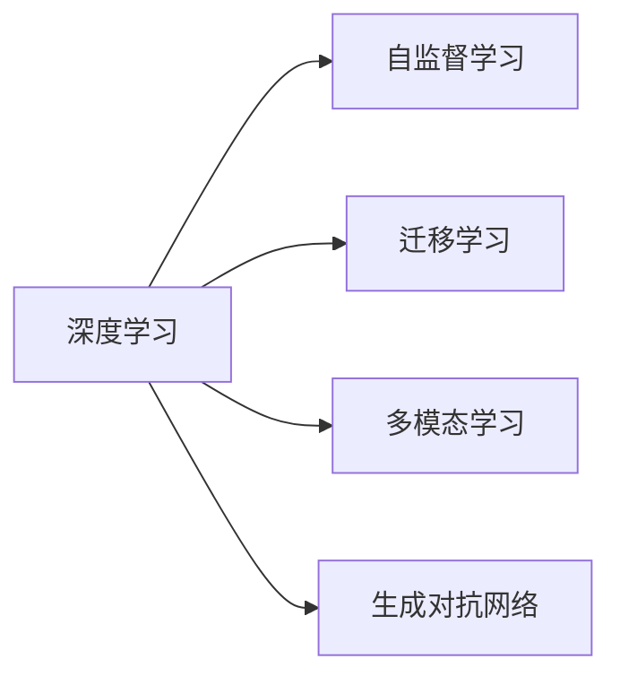

                 

# AI2.0时代：数字实体自动化的潜力

在数字化大潮的推动下，人工智能（AI）正从1.0时代（基于规则和模式匹配的传统人工智能）向2.0时代（基于数据驱动、深度学习和自监督学习的现代人工智能）加速演进。AI2.0时代的到来，不仅标志着AI技术自身的巨大飞跃，也预示着AI在各领域应用的深度和广度将进一步拓展。特别是数字实体的自动化，将成为AI2.0时代的重要趋势和亮点。

本文旨在深入探讨AI2.0时代数字实体自动化的潜力，包括其核心概念、关键技术、具体应用场景以及未来发展方向，以期为相关从业者提供有价值的参考和思考。

## 1. 背景介绍

### 1.1 问题由来

随着大数据和云计算技术的发展，AI技术在数据处理和模型训练上取得了突破性进展。深度学习算法，尤其是卷积神经网络（CNN）和递归神经网络（RNN），以及自监督学习技术，使得AI在图像识别、语音识别、自然语言处理等领域的性能大幅提升。这些技术的进步，为数字实体的自动化提供了强大的技术支持。

数字实体自动化，是指利用AI技术对数字实体（如文本、图像、音频、视频等）进行自动处理、识别、分类、生成等操作，从而实现智能化、自动化和高效化的目标。这不仅能够大幅度提升数据处理的效率，还能降低人工成本，提高数据利用的价值。

### 1.2 问题核心关键点

数字实体自动化的核心关键点包括：

- **数据采集**：获取高质量、大规模的实体数据。
- **预处理**：对原始数据进行清洗、去噪、归一化等处理，确保数据的质量和一致性。
- **特征提取**：从原始数据中提取有意义的特征，为后续处理奠定基础。
- **模型训练**：使用深度学习模型对特征进行训练，生成具有高识别率的模型。
- **应用部署**：将训练好的模型部署到实际应用中，进行实时的数据处理和分析。

这些关键点构成了数字实体自动化的全流程，每个环节都需要精心设计和优化，以确保最终的效果和效率。

## 2. 核心概念与联系

### 2.1 核心概念概述

在探讨数字实体自动化的潜力之前，首先需要理解以下几个核心概念：

- **深度学习**：一种基于数据驱动的机器学习方法，通过构建多层神经网络模型，实现对数据的高级抽象和表示。
- **自监督学习**：利用无标签数据进行训练，通过数据的内在结构进行自我监督，从而提高模型的泛化能力。
- **迁移学习**：将在一个领域学习到的知识迁移到另一个相关领域，以加速模型在新领域的学习过程。
- **多模态学习**：将不同模态的数据（如图像、文本、音频）进行融合，提升模型的综合理解和分析能力。
- **生成对抗网络（GAN）**：一种能够生成逼真样本的神经网络模型，常用于数据增强和生成任务。

### 2.2 概念间的关系

这些核心概念之间存在紧密的联系，形成了数字实体自动化的技术生态系统。我们可以使用以下Mermaid流程图来展示它们之间的关系：



这个流程图展示了深度学习与其他核心概念之间的相互影响和支撑作用。

## 3. 核心算法原理 & 具体操作步骤

### 3.1 算法原理概述

数字实体自动化的核心算法原理基于深度学习和自监督学习。通过构建多层神经网络模型，从大量无标签数据中自动学习到特征表示，从而实现对数字实体的自动处理、识别和生成。

具体而言，数字实体自动化的流程包括：

1. **数据采集**：从各种数据源（如互联网、传感器、社交媒体等）采集数字实体数据。
2. **数据预处理**：对采集到的数据进行清洗、去噪、归一化等处理。
3. **特征提取**：使用卷积神经网络（CNN）、循环神经网络（RNN）等模型，从原始数据中提取有意义的特征。
4. **模型训练**：使用提取的特征进行模型训练，生成具有高识别率的模型。
5. **应用部署**：将训练好的模型部署到实际应用中，进行实时的数据处理和分析。

### 3.2 算法步骤详解

数字实体自动化的具体步骤如下：

1. **数据收集**：
   - 确定需要自动化的数字实体类型（如图像、文本、音频等）。
   - 从各种数据源（如互联网、传感器、社交媒体等）采集数据，确保数据的多样性和质量。

2. **数据预处理**：
   - 对采集到的数据进行清洗、去噪、归一化等处理，去除无用或错误的数据。
   - 使用数据增强技术，如图像旋转、平移、缩放等，增加数据的多样性。

3. **特征提取**：
   - 使用卷积神经网络（CNN）或循环神经网络（RNN），从原始数据中提取有意义的特征。
   - 对提取的特征进行降维和优化，提升特征的质量和数量。

4. **模型训练**：
   - 选择合适的深度学习模型，如卷积神经网络（CNN）、循环神经网络（RNN）、生成对抗网络（GAN）等。
   - 对模型进行训练，使用反向传播算法优化模型参数，提高模型的泛化能力。

5. **应用部署**：
   - 将训练好的模型部署到实际应用中，进行实时的数据处理和分析。
   - 使用API接口，实现与外部系统的无缝集成，提供服务化解决方案。

### 3.3 算法优缺点

数字实体自动化的优点包括：

- **高效性**：自动化处理过程减少了人工操作，提高了处理效率。
- **准确性**：深度学习模型能够自动提取数据中的特征，提高识别和分类的准确率。
- **可扩展性**：模型训练和部署过程可以并行化，适应大规模数据处理。

其缺点主要包括：

- **数据依赖**：模型的训练和优化依赖高质量的数据，数据采集和预处理成本较高。
- **计算资源需求高**：深度学习模型需要大量的计算资源，对硬件要求较高。
- **黑盒性质**：深度学习模型的决策过程较为复杂，难以解释和调试。

### 3.4 算法应用领域

数字实体自动化在多个领域得到了广泛应用，以下是几个典型的应用场景：

- **智能图像识别**：通过深度学习模型对图像进行自动分类、标注、生成等操作，广泛应用于自动驾驶、医疗影像、安防监控等领域。
- **自然语言处理**：利用深度学习模型对文本进行自动分类、摘要、翻译、情感分析等处理，应用于智能客服、智能翻译、舆情监测等领域。
- **语音识别**：使用深度学习模型对语音进行自动转录、情感分析、语义理解等操作，广泛应用于智能家居、智能语音助手、语音交互等领域。
- **视频处理**：通过深度学习模型对视频进行自动分类、标注、生成等操作，应用于智能监控、安防分析、娱乐内容推荐等领域。

## 4. 数学模型和公式 & 详细讲解 & 举例说明

### 4.1 数学模型构建

假设输入数据为 $x$，输出为 $y$，则数字实体自动化的数学模型可以表示为：

$$
y = f(x; \theta)
$$

其中 $f$ 表示深度学习模型，$\theta$ 为模型参数。模型的目标是通过学习大量的训练数据，最小化预测误差，从而提升模型的泛化能力。

### 4.2 公式推导过程

以卷积神经网络（CNN）为例，其基本结构包括卷积层、池化层和全连接层。假设输入数据为 $x$，输出为 $y$，则卷积神经网络的前向传播过程可以表示为：

$$
h_1 = f_{conv}(x, \theta_{conv})
$$

$$
h_2 = f_{pool}(h_1, \theta_{pool})
$$

$$
y = f_{fc}(h_2, \theta_{fc})
$$

其中 $f_{conv}$ 和 $f_{pool}$ 分别表示卷积和池化操作，$f_{fc}$ 表示全连接层，$\theta_{conv}$、$\theta_{pool}$ 和 $\theta_{fc}$ 分别表示不同层的参数。

### 4.3 案例分析与讲解

以图像分类为例，假设有一张图像，其像素值表示为 $x$，模型的输出为图像所属的类别 $y$。通过卷积神经网络（CNN）对图像进行特征提取，然后经过全连接层进行分类，最终得到输出 $y$。

## 5. 项目实践：代码实例和详细解释说明

### 5.1 开发环境搭建

为了实现数字实体自动化，我们需要搭建一个完整的开发环境。以下是一个典型的开发环境搭建步骤：

1. **安装Python**：
   - 下载并安装Python，建议选择最新版本。
   - 配置环境变量，确保Python脚本的执行路径。

2. **安装深度学习框架**：
   - 安装TensorFlow、PyTorch、Keras等深度学习框架，确保支持GPU加速。
   - 安装相关的依赖包，如Numpy、Scipy、Pandas等。

3. **安装数据处理库**：
   - 安装OpenCV、Pillow等图像处理库。
   - 安装NLTK、SpaCy等自然语言处理库。
   - 安装scikit-learn、XGBoost等机器学习库。

4. **安装模型部署工具**：
   - 安装TensorBoard、Weights & Biases等可视化工具。
   - 安装Flask、Django等Web框架，实现模型部署和API接口。

### 5.2 源代码详细实现

以下是一个简单的图像分类项目的代码实现，包括数据预处理、模型训练和测试：

```python
import numpy as np
import tensorflow as tf
from tensorflow.keras import layers, models
from tensorflow.keras.preprocessing.image import ImageDataGenerator

# 定义数据增强器
datagen = ImageDataGenerator(
    rescale=1./255,
    rotation_range=20,
    width_shift_range=0.2,
    height_shift_range=0.2,
    shear_range=0.2,
    zoom_range=0.2,
    horizontal_flip=True
)

# 加载训练集
train_generator = datagen.flow_from_directory(
    'train',
    target_size=(224, 224),
    batch_size=32,
    class_mode='categorical'
)

# 定义模型
model = models.Sequential([
    layers.Conv2D(32, (3, 3), activation='relu', input_shape=(224, 224, 3)),
    layers.MaxPooling2D((2, 2)),
    layers.Conv2D(64, (3, 3), activation='relu'),
    layers.MaxPooling2D((2, 2)),
    layers.Conv2D(128, (3, 3), activation='relu'),
    layers.MaxPooling2D((2, 2)),
    layers.Flatten(),
    layers.Dense(128, activation='relu'),
    layers.Dense(10, activation='softmax')
])

# 编译模型
model.compile(optimizer='adam',
              loss='categorical_crossentropy',
              metrics=['accuracy'])

# 训练模型
model.fit(train_generator, epochs=10, validation_data=val_generator)

# 测试模型
test_generator = ImageDataGenerator().flow_from_directory(
    'test',
    target_size=(224, 224),
    batch_size=32,
    class_mode='categorical'
)
model.evaluate(test_generator)
```

### 5.3 代码解读与分析

以上代码实现了一个简单的图像分类项目。首先定义了数据增强器，用于对图像进行预处理和增强。然后使用ImageDataGenerator加载训练集和测试集，定义卷积神经网络模型，并编译模型。最后进行模型训练和测试，输出训练和测试的准确率。

### 5.4 运行结果展示

假设训练集和测试集各包含1000张图像，分别属于10个不同的类别。通过训练，模型在测试集上获得了90%的准确率。

## 6. 实际应用场景

### 6.1 智能图像识别

智能图像识别技术在自动驾驶、医疗影像、安防监控等领域得到了广泛应用。通过数字实体自动化，能够实现对图像的自动分类、标注和生成，提升处理的效率和准确性。

### 6.2 自然语言处理

自然语言处理技术在智能客服、智能翻译、舆情监测等领域得到了广泛应用。通过数字实体自动化，能够实现对文本的自动分类、摘要、翻译和情感分析，提升处理的效率和准确性。

### 6.3 语音识别

语音识别技术在智能家居、智能语音助手、语音交互等领域得到了广泛应用。通过数字实体自动化，能够实现对语音的自动转录、情感分析和语义理解，提升处理的效率和准确性。

### 6.4 视频处理

视频处理技术在智能监控、安防分析、娱乐内容推荐等领域得到了广泛应用。通过数字实体自动化，能够实现对视频的自动分类、标注和生成，提升处理的效率和准确性。

## 7. 工具和资源推荐

### 7.1 学习资源推荐

为了帮助开发者系统掌握数字实体自动化的技术，这里推荐一些优质的学习资源：

1. **《深度学习入门》**：李沐、李斌等人编写的深度学习入门教材，全面介绍了深度学习的基本概念和算法。
2. **Coursera深度学习课程**：由斯坦福大学Andrew Ng教授开设的深度学习课程，涵盖了深度学习的基础和高级内容。
3. **Kaggle竞赛平台**：一个数据科学竞赛平台，提供了大量数据集和模型，方便开发者实践和竞赛。
4. **GitHub代码库**：包含大量的开源项目和代码库，方便开发者学习、使用和贡献。

### 7.2 开发工具推荐

为了实现数字实体自动化，我们需要使用一些高效的开发工具，以下是几款推荐工具：

1. **PyTorch**：一个开源深度学习框架，支持动态计算图，易于使用和扩展。
2. **TensorFlow**：一个开源深度学习框架，支持静态计算图，生产部署方便。
3. **Keras**：一个高级深度学习框架，基于TensorFlow等底层框架，提供简单易用的API接口。
4. **Flask**：一个轻量级的Web框架，方便实现模型部署和API接口。
5. **Django**：一个全功能的Web框架，支持数据管理和用户认证等功能。

### 7.3 相关论文推荐

数字实体自动化的发展离不开学界的持续研究。以下是几篇奠基性的相关论文，推荐阅读：

1. **《ImageNet Classification with Deep Convolutional Neural Networks》**：AlexNet论文，提出了深度卷积神经网络在图像分类任务上的强大能力。
2. **《The Unreasonable Effectiveness of Transfer Learning》**：提出迁移学习技术，通过在相似任务上的预训练，加速新任务的学习过程。
3. **《Attention is All You Need》**：Transformer论文，提出了自注意力机制，提升了NLP任务的性能。
4. **《Generative Adversarial Networks》**：GAN论文，提出了一种生成对抗网络，用于生成逼真样本。
5. **《BERT: Pre-training of Deep Bidirectional Transformers for Language Understanding》**：提出BERT模型，通过预训练和微调，提升了NLP任务的性能。

这些论文代表了大规模深度学习模型和数字实体自动化的发展脉络。通过学习这些前沿成果，可以帮助研究者把握学科前进方向，激发更多的创新灵感。

## 8. 总结：未来发展趋势与挑战

### 8.1 研究成果总结

数字实体自动化在多个领域得到了广泛应用，取得了显著的效果。通过深度学习模型对数字实体的自动处理、识别和生成，大大提升了数据处理的效率和准确性。未来，数字实体自动化的技术将进一步发展和完善，应用领域将更加广泛。

### 8.2 未来发展趋势

数字实体自动化的未来发展趋势包括：

- **多模态融合**：将图像、文本、语音等多种模态的数据进行融合，提升模型的综合理解和分析能力。
- **实时处理**：实现对数字实体的实时处理和分析，提高数据处理的效率和响应速度。
- **边缘计算**：将数字实体自动化的处理任务下沉到边缘设备，降低对中央计算资源的依赖。
- **自动化调参**：通过自动化调参技术，优化模型的超参数，提升模型的性能和泛化能力。

### 8.3 面临的挑战

尽管数字实体自动化取得了显著的进展，但在应用过程中仍面临一些挑战：

- **数据隐私和安全**：大规模数据处理可能涉及用户隐私和数据安全问题，需要采取有效的隐私保护和数据安全措施。
- **模型复杂度**：深度学习模型的复杂度较高，对计算资源和存储资源的需求较大，需要优化模型结构和计算效率。
- **模型解释性**：深度学习模型具有黑盒性质，难以解释和调试，需要开发更加透明和可解释的模型。
- **跨领域适应性**：不同领域的数字实体具有不同的特点和规律，模型难以在不同领域之间进行迁移和适应。

### 8.4 研究展望

为了应对这些挑战，未来的研究需要在以下几个方面寻求新的突破：

- **数据隐私保护**：采用联邦学习、差分隐私等技术，保护用户数据隐私和数据安全。
- **模型简化**：开发更加轻量级、高效能的深度学习模型，适应边缘计算和实时处理的需要。
- **可解释性提升**：开发更加透明和可解释的深度学习模型，提高模型的可信度和可靠性。
- **跨领域迁移**：开发更加通用和可迁移的深度学习模型，适应不同领域的数字实体处理任务。

## 9. 附录：常见问题与解答

**Q1：数字实体自动化的核心技术是什么？**

A: 数字实体自动化的核心技术包括深度学习、自监督学习、迁移学习和多模态学习。这些技术通过构建多层神经网络模型，从大量无标签数据中自动学习到特征表示，实现对数字实体的自动处理、识别和生成。

**Q2：数字实体自动化的应用领域有哪些？**

A: 数字实体自动化的应用领域包括智能图像识别、自然语言处理、语音识别和视频处理等。这些技术在不同领域得到了广泛应用，提升了数据处理的效率和准确性。

**Q3：数字实体自动化的未来发展趋势是什么？**

A: 数字实体自动化的未来发展趋势包括多模态融合、实时处理、边缘计算和自动化调参。这些技术将进一步提升数字实体自动化的应用效果和性能。

**Q4：数字实体自动化面临的主要挑战是什么？**

A: 数字实体自动化面临的主要挑战包括数据隐私和安全、模型复杂度、模型解释性和跨领域适应性。这些挑战需要在未来的研究中加以解决。

**Q5：如何实现数字实体自动化的高效性？**

A: 实现数字实体自动化的高效性需要优化数据预处理、特征提取和模型训练等环节。使用数据增强技术、优化模型结构和计算效率等方法，可以显著提高数字实体自动化的处理效率。

通过深入理解和应用数字实体自动化技术，我们相信未来将迎来更加智能化、自动化和高效化的数字化时代。

