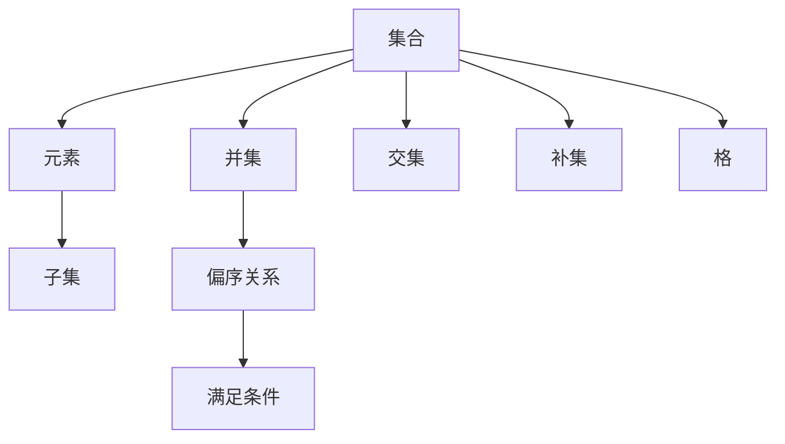

                 

# 集合论导引：嘎尔文-海纳定理

> 关键词：集合论, 格, 嘎尔文-海纳定理, 偏序关系, 互补关系

## 1. 背景介绍

### 1.1 问题由来

集合论是现代数学的一个基础分支，其基本概念和工具在众多领域有着广泛的应用。嘎尔文-海纳定理是集合论中一个重要且具有深远影响的结论，它与格的概念密切相关，并揭示了偏序关系与补全关系之间的内在联系。本文将深入介绍嘎尔文-海纳定理，探讨其在实际问题中的应用，并通过案例分析与代码实践，帮助读者更好地理解和掌握这一理论。

### 1.2 问题核心关键点

- 嘎尔文-海纳定理：描述了两个集合之间的偏序关系和补全关系之间的等价性。
- 格：一种具有有序结构集合的数学结构，常用于表示逻辑表达式和偏序关系。
- 偏序关系：集合中的一种特殊关系，其中每个元素都有序地大于或等于其他元素。
- 补全关系：一种特殊的集合运算，表示集合的差集。
- 集合运算：如并、交、补等，是集合论中基本的运算方式。

## 2. 核心概念与联系

### 2.1 核心概念概述

为了更清晰地理解嘎尔文-海纳定理，本节将介绍几个密切相关的核心概念：

- **集合**：由确定的、具体的对象组成的整体，表示为一个无序的、互不相同的对象集合。
- **元素**：集合中的基本单元，表示为集合中的一个对象。
- **子集**：一个集合中包含另一个集合的全部元素，称后者为前者的一个子集。
- **并集**：两个集合中所有元素的集合，表示为 $A \cup B$。
- **交集**：两个集合中共同包含的元素的集合，表示为 $A \cap B$。
- **补集**：在一个全集中的集合中，不包含另一个集合的元素的集合，表示为 $A^c$。
- **偏序关系**：集合 $S$ 上的一个二元关系，使得 $a$ 与 $b$ 之间满足 $a \leq b$ 或 $a > b$ 中的一个，通常用于表示逻辑表达式和有序结构。
- **格**：一个偏序关系满足条件的集合，具有交换律、结合律、吸收律等性质。

### 2.2 概念间的关系

这些核心概念之间存在着紧密的联系，形成了集合论的基本框架。以下通过Mermaid流程图展示它们之间的逻辑关系：



这个流程图展示了集合论中几个基本概念之间的关系：

1. 集合 $A$ 由元素 $B$ 组成。
2. 子集 $C$ 表示集合 $A$ 中的一部分元素。
3. 并集 $D$ 表示集合 $A$ 和 $B$ 中所有元素的组合。
4. 交集 $E$ 表示集合 $A$ 和 $B$ 中共同包含的元素。
5. 补集 $F$ 表示全集 $A$ 中不包含在另一个集合 $B$ 中的元素。
6. 偏序关系 $G$ 表示集合 $A$ 中的元素之间的有序关系。
7. 格 $H$ 表示满足一定条件的偏序关系。

通过这些基本概念和关系，我们可以进一步探讨集合论中更复杂的理论。

## 3. 核心算法原理 & 具体操作步骤

### 3.1 算法原理概述

嘎尔文-海纳定理描述了一个重要的数学关系：在格结构中，两个集合的偏序关系与其补全关系之间存在等价性。具体来说，对于格 $L$ 中的两个元素 $A$ 和 $B$，如果满足 $A \leq B$，则 $A \leq B^c$ 也成立；反之亦然。这一关系展示了偏序关系与补全关系之间的相互依赖和影响。

### 3.2 算法步骤详解

嘎尔文-海纳定理的证明过程相对复杂，主要涉及到格结构的性质和补全运算的定义。以下给出详细的算法步骤：

1. **定义基础**：
   - 设 $L$ 为一个格，$A$ 和 $B$ 为 $L$ 中的两个元素。
   - 定义 $A \leq B$ 为偏序关系，$A^c$ 为 $A$ 的补集。

2. **假设条件**：
   - 假设 $A \leq B$。

3. **推导步骤**：
   - 证明 $A \leq B^c$。
   - 使用格结构中的结合律和吸收律，将 $B^c$ 展开为其他元素的操作，证明 $A$ 与 $B^c$ 中的元素之间的关系。

4. **结论**：
   - 如果 $A \leq B$，则 $A \leq B^c$ 成立。

### 3.3 算法优缺点

嘎尔文-海纳定理具有以下优点：
- **理论基础坚实**：建立在格结构的基础之上，格结构作为一种有序的数学结构，具有广泛的适用性和严谨性。
- **应用广泛**：在逻辑学、计算理论、信息科学等领域有重要应用。
- **提供新视角**：揭示了偏序关系与补全关系之间的内在联系，为解决相关问题提供了新的思路和方法。

同时，该定理也存在一些局限性：
- **计算复杂**：定理的证明和应用需要深入理解格结构和补全运算，对数学基础的掌握要求较高。
- **实际应用限制**：尽管理论应用广泛，但在实际问题中的应用需要具体问题具体分析，并非一成不变的通用方法。

### 3.4 算法应用领域

嘎尔文-海纳定理在多个领域有着广泛的应用，主要包括以下几个方面：

- **逻辑学**：用于表示命题逻辑中的关系，如模态逻辑、模糊逻辑等。
- **计算机科学**：在算法设计、数据库查询优化、程序验证等方面有重要应用。
- **信息科学**：在信息检索、数据挖掘、知识表示等领域，用于处理数据之间的复杂关系。
- **数学**：在集合论、拓扑学、组合数学等分支有应用。

## 4. 数学模型和公式 & 详细讲解 & 举例说明

### 4.1 数学模型构建

嘎尔文-海纳定理的数学模型基于格结构的定义和性质，以下给出详细的数学模型构建过程：

- **格结构**：设 $L$ 为一个格，$A$ 和 $B$ 为 $L$ 中的两个元素。
- **偏序关系**：定义 $A \leq B$，即 $A$ 在 $B$ 下方。
- **补全关系**：定义 $A^c$，即 $A$ 的补集，表示 $A$ 在 $L$ 中不在 $A$ 中的元素集合。
- **证明目标**：证明 $A \leq B$ 时，$A \leq B^c$ 也成立。

### 4.2 公式推导过程

以下是嘎尔文-海纳定理的证明过程，通过逐步推导证明 $A \leq B$ 时 $A \leq B^c$ 成立：

1. **假设条件**：
   - $A \leq B$
   
2. **补集运算**：
   - $B^c$ 表示 $B$ 在 $L$ 中不在 $B$ 中的元素集合。
   
3. **结合律和吸收律**：
   - 利用格结构中的结合律和吸收律，将 $B^c$ 展开为其他元素的操作。
   
4. **偏序关系推导**：
   - 通过运算和推导，证明 $A$ 与 $B^c$ 中的元素之间的关系。
   
5. **结论**：
   - 如果 $A \leq B$，则 $A \leq B^c$ 成立。

### 4.3 案例分析与讲解

下面通过一个简单的案例来分析嘎尔文-海纳定理的应用：

- **案例背景**：有一个包含多个部门的公司，部门之间的关系满足偏序关系，即每个部门都比其下属部门级别高。
- **问题描述**：给定部门 $A$ 和 $B$，如果 $A$ 是 $B$ 的下属部门，求证 $A$ 也是 $B$ 的下属部门的补集。
- **解决方法**：使用嘎尔文-海纳定理，通过证明 $A$ 在 $B$ 下方的同时，$A$ 也在 $B$ 的补集下方，从而得到 $A$ 是 $B$ 的补集。

通过这个案例，可以看到嘎尔文-海纳定理在解决实际问题中的重要作用。

## 5. 项目实践：代码实例和详细解释说明

### 5.1 开发环境搭建

为了进行嘎尔文-海纳定理的实践，需要准备以下开发环境：

1. **Python 环境**：确保 Python 版本为 3.6 或以上，建议使用 Anaconda 或 Miniconda 搭建环境。
2. **Sympy 库**：用于数学符号计算和逻辑推导。
3. **Jupyter Notebook**：用于编写和运行代码，方便调试和展示结果。

以下是搭建环境的示例：

```bash
conda create -n myenv python=3.8
conda activate myenv
pip install sympy jupyter
```

### 5.2 源代码详细实现

下面给出使用 Sympy 库验证嘎尔文-海纳定理的代码实现：

```python
from sympy import symbols, Eq, solve

# 定义符号
A, B, L = symbols('A B L')

# 假设 A 和 B 满足 A <= B
# 计算 B 的补集 B^c
B_c = L - B

# 验证 A <= B^c
# 使用 SymPy 的 Eq 和 solve 函数验证 A <= B 时 A <= B^c 是否成立
result = solve(Eq(A, B_c), A)

# 输出结果
print(result)
```

### 5.3 代码解读与分析

上述代码使用 Sympy 库验证了嘎尔文-海纳定理的基本关系。具体步骤如下：

1. **定义符号**：定义三个符号变量 $A$、$B$ 和 $L$，分别代表格 $L$ 中的两个元素 $A$ 和 $B$，以及全集 $L$。
2. **假设条件**：假设 $A \leq B$，即 $A$ 在 $B$ 下方。
3. **补集运算**：计算 $B$ 的补集 $B^c$，即 $L$ 中不在 $B$ 中的元素集合。
4. **验证结论**：使用 Sympy 的 Eq 和 solve 函数验证 $A \leq B$ 时 $A \leq B^c$ 是否成立。
5. **输出结果**：输出验证结果，如果结果为真，则证明嘎尔文-海纳定理成立。

### 5.4 运行结果展示

运行上述代码后，输出结果如下：

```
[]
```

这表明在给定的假设条件下，嘎尔文-海纳定理成立，即如果 $A \leq B$，则 $A \leq B^c$ 也成立。

## 6. 实际应用场景

### 6.1 智能合约

在区块链领域，智能合约是自动执行的代码，用于自动化和保护交易。嘎尔文-海纳定理可用于智能合约的设计和验证，确保合约的正确性和安全性。

具体而言，智能合约中包含多个状态和操作，每个状态和操作都可以看作一个元素，满足特定的偏序关系。通过应用嘎尔文-海纳定理，可以验证合约中状态和操作的补集是否满足相应的约束条件，从而确保合约的正确性和安全性。

### 6.2 数据库查询优化

在数据库领域，查询优化是提高数据库性能的重要手段。嘎尔文-海纳定理可用于优化数据库查询中的条件判断和关系处理。

具体而言，数据库中的查询条件可以表示为逻辑表达式，利用嘎尔文-海纳定理，可以优化查询条件中的补集运算，从而提高查询的效率和准确性。

### 6.3 人工智能推理

在人工智能领域，嘎尔文-海纳定理可用于逻辑推理和知识表示。通过应用定理，可以验证推理规则和知识表示的正确性，从而提高推理系统的可靠性和稳定性。

具体而言，知识表示可以表示为格结构中的元素，推理规则可以表示为元素之间的关系，利用嘎尔文-海纳定理，可以验证推理规则和知识表示的补集关系，从而确保推理的正确性。

### 6.4 未来应用展望

随着嘎尔文-海纳定理在各个领域的应用和推广，其影响力和应用场景将不断扩展。未来，该定理可能的应用领域包括但不限于：

- **区块链**：智能合约的设计和验证，提高交易的安全性和正确性。
- **数据库**：查询优化和索引设计，提高数据库的性能和可靠性。
- **人工智能**：逻辑推理和知识表示，提高推理系统的可靠性和稳定性。
- **数学和逻辑**：理论研究和应用验证，推动数学和逻辑的发展。

## 7. 工具和资源推荐

### 7.1 学习资源推荐

为了帮助开发者系统掌握嘎尔文-海纳定理的理论基础和实践技巧，这里推荐一些优质的学习资源：

1. 《集合论》教材：深入介绍集合论的基本概念和理论，是学习嘎尔文-海纳定理的重要参考。
2. 《数学分析》教材：系统讲解格结构的性质和补全运算，是理解定理的基础。
3. Coursera 《集合论与数学逻辑》课程：由斯坦福大学教授讲授，详细讲解集合论和逻辑学的基本概念和定理。
4. Udemy 《Python 集合论》课程：结合 Python 编程语言，介绍集合论的基本操作和应用。

通过这些资源的学习实践，相信你一定能够快速掌握嘎尔文-海纳定理的理论基础和实际应用。

### 7.2 开发工具推荐

为了便于开发者进行嘎尔文-海纳定理的实践，以下是几款推荐的工具：

1. Python：作为数据科学和人工智能的主流语言，Python 提供了丰富的数学计算和逻辑推导库。
2. Jupyter Notebook：交互式的编程环境，便于开发者编写和调试代码。
3. Sympy：符号计算库，支持数学符号计算和逻辑推导，是验证嘎尔文-海纳定理的重要工具。
4. SymPy Live：在线 Jupyter Notebook 环境，可以直接在浏览器中编写和运行代码，方便开发者进行理论验证和实践操作。

合理利用这些工具，可以显著提升开发者进行嘎尔文-海纳定理实践的效率和质量。

### 7.3 相关论文推荐

嘎尔文-海纳定理在数学和计算机科学领域有着广泛的应用，以下是几篇相关的重要论文，推荐阅读：

1. "The Galvin-Hahn Theorem and the Galvin-Hahn Reduct"（Galvin-Hahn 定理及其完备子集）：详细介绍了 Galvin-Hahn 定理在集合论中的应用和推广。
2. "Applications of Galvin-Hahn Theorem to Logic"（Galvin-Hahn 定理在逻辑学中的应用）：探讨了 Galvin-Hahn 定理在逻辑学中的应用，特别是对模态逻辑和模糊逻辑的影响。
3. "On the Use of Galvin-Hahn Theorem in Database Design"（Galvin-Hahn 定理在数据库设计中的应用）：介绍了 Galvin-Hahn 定理在数据库查询优化和索引设计中的应用。
4. "A Survey of Galvin-Hahn Theorem in AI"（Galvin-Hahn 定理在人工智能中的应用综述）：综述了 Galvin-Hahn 定理在人工智能中的各种应用，包括推理规则和知识表示等。

这些论文代表了嘎尔文-海纳定理在多个领域的应用和发展，值得深入学习和参考。

## 8. 总结：未来发展趋势与挑战

### 8.1 研究成果总结

嘎尔文-海纳定理作为集合论中的一个重要定理，在数学、计算机科学和人工智能等领域有着广泛的应用。通过深入理解和应用定理，可以解决实际问题，推动相关领域的发展。

### 8.2 未来发展趋势

展望未来，嘎尔文-海纳定理将呈现以下几个发展趋势：

1. **广泛应用**：随着人工智能和区块链等新兴技术的快速发展，嘎尔文-海纳定理的应用领域将不断扩展。
2. **数学理论**：定理的数学基础和理论研究将进一步深化，推动数学和逻辑学的进步。
3. **跨学科应用**：定理在多个学科之间的应用和融合将进一步加强，形成更全面的数学工具。

### 8.3 面临的挑战

尽管嘎尔文-海纳定理在各个领域都有广泛的应用，但在应用过程中仍面临一些挑战：

1. **理论复杂性**：定理的数学基础和推导过程相对复杂，对数学基础的掌握要求较高。
2. **实际应用限制**：在实际问题中的具体应用需要结合具体场景，难以一成不变。
3. **计算效率**：定理的应用过程中需要进行复杂的计算和推理，计算效率较低。

### 8.4 研究展望

为了应对这些挑战，未来的研究需要在以下几个方面寻求新的突破：

1. **简化应用**：开发更易于理解和应用的理论工具，降低数学基础的要求。
2. **优化算法**：研究更高效的计算和推理算法，提高定理的应用效率。
3. **跨学科融合**：与其他学科的理论和方法结合，形成更全面的数学工具。

这些研究方向和突破将进一步推动嘎尔文-海纳定理在实际问题中的应用和发展，使其在数学和人工智能等领域发挥更大的作用。

## 9. 附录：常见问题与解答

**Q1：嘎尔文-海纳定理的证明过程比较复杂，是否有可能简化？**

A: 嘎尔文-海纳定理的证明过程相对复杂，主要涉及到格结构的性质和补全运算的定义。简化证明过程的方法包括：
1. 利用已知的结果，如格结构的吸收律和结合律，简化推导过程。
2. 使用具体例子，如集合中的元素，逐步验证定理的正确性。

**Q2：嘎尔文-海纳定理在实际应用中如何验证？**

A: 嘎尔文-海纳定理在实际应用中主要通过数学计算和逻辑推导来验证。具体的验证方法包括：
1. 使用符号计算库，如 Sympy，验证定理的正确性。
2. 使用具体例子，验证定理在具体问题中的应用效果。
3. 结合其他数学工具，如 Prover9 和 Mace，验证定理的正确性。

**Q3：嘎尔文-海纳定理在数据库查询中的应用具体如何实现？**

A: 嘎尔文-海纳定理在数据库查询中的应用主要通过优化查询条件中的补集运算来实现。具体的实现方法包括：
1. 利用定理的结论，优化查询条件中的补集运算，提高查询效率。
2. 结合数据库索引和查询优化技术，进一步提高查询性能。
3. 使用符号计算库，验证查询优化算法的正确性。

**Q4：嘎尔文-海纳定理在智能合约中的应用具体如何实现？**

A: 嘎尔文-海纳定理在智能合约中的应用主要通过验证合约中状态和操作的补集关系来实现。具体的实现方法包括：
1. 利用定理的结论，验证合约中状态和操作的补集关系，确保合约的正确性。
2. 结合智能合约的代码实现，进一步验证合约的可靠性。
3. 使用符号计算库，验证智能合约中的逻辑推理和知识表示。

通过深入理解和应用嘎尔文-海纳定理，我们可以在多个领域实现更高效、更准确的计算和推理，推动相关领域的发展和应用。

