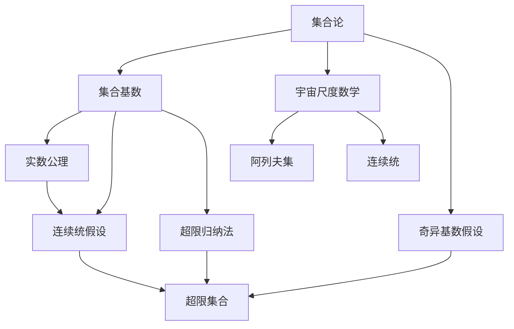

                 

# 集合论导引：奇异基数假设分析

> 关键词：奇异基数假设，集合论，集合基数，超限归纳法，阿列夫集，超限集合，宇宙尺度数学

## 1. 背景介绍

### 1.1 问题由来
集合论作为数学的基础领域，自问世以来便深刻影响着数理逻辑、理论计算机科学、哲理等领域。然而，自Zermelo-Fraenkel集合论（ZF集合论）提出以来，集合的存在性问题始终困扰着数学家。特别是Cantor提出的连续统假设（Continuum Hypothesis, CH），更是无法给出明确答案，一度成为集合论领域的“悬案”。

本文将从集合论的基础概念出发，探讨奇异基数假设（Ultrafilter Axiom, UA），通过分析其与连续统假设、超限归纳法等的关系，尝试理解宇宙尺度数学的内在本质。

### 1.2 问题核心关键点
奇异基数假设是Zermelo集合论中的重要公理，其提出者Zermelo指出，如果存在某种“奇异基”，则宇宙中的所有集合都可以通过该基生成。该假设在集合论中的地位与实数公理类似，其真假关系到ZF集合论的完备性和逻辑一致性。

当前，奇异基数假设尚未被证明或否定，学界主要通过构建各种公理体系和哲学论证来探讨其真伪。

## 2. 核心概念与联系

### 2.1 核心概念概述

为更好地理解奇异基数假设，本文将介绍几个密切相关的核心概念：

- 集合论：研究由元素构成的数学对象的数学分支，研究集合的定义、性质和运算。

- 集合基数：定义集合的元素个数，如实数集与整数集的基数均为$\aleph_0$（阿列夫零）。

- 超限归纳法：对无穷序列进行归纳推理的方法，如在自然数集上，若每个正整数都有后继，则对所有正整数都有后继。

- 超限集合：由超限归纳法生成的集合，如整数集、实数集。

- 宇宙尺度数学：研究无限大尺度下的数学概念和原理，如阿列夫集、连续统。

这些概念之间存在着紧密的联系，通过集合的运算和关系，构建起整个数学体系。

### 2.2 概念间的关系

这些核心概念之间存在着紧密的联系，形成了集合论的基本框架。以下我们用Mermaid流程图来展示它们之间的关系：



这个流程图展示了集合论中的关键概念及其之间的关系：

1. 集合论研究集合的定义、性质和运算。
2. 集合基数用于度量集合的元素个数。
3. 实数公理用于定义实数集合的性质，如连续统。
4. 连续统假设提出了实数集的元素个数为最大的基数，是Cantor提出但未被证明的假设。
5. 超限归纳法对无穷序列进行归纳推理。
6. 超限集合由超限归纳法生成，如整数集、实数集。
7. 宇宙尺度数学研究超限集合的性质和运算。
8. 奇异基数假设指出存在某种“奇异基”，可以生成宇宙中所有集合。
9. 奇异基数假设与连续统假设、实数公理、超限集合密切相关。

这些概念共同构成了集合论的研究基础，通过理解和运用它们，可以深入探索宇宙尺度数学的奥秘。

## 3. 核心算法原理 & 具体操作步骤
### 3.1 算法原理概述

奇异基数假设的提出，本质上是为了构建一个可以生成宇宙中所有集合的基。这里，我们将通过构造一个满足特定条件的“奇异基”，来探讨其对集合论的影响。

设$\mathcal{U}$为宇宙中的所有集合构成的集合。若存在某种“奇异基”$\mathcal{B}$，使得任意集合$S$都可通过$\mathcal{B}$生成，即$\forall S \in \mathcal{U}$，$\exists \mathcal{B} \in \mathcal{U}$，使得$S \in \mathcal{B}$，则称$\mathcal{B}$为奇异基。

在集合论中，奇异基通常指满足下述条件的集合：

- $\emptyset \in \mathcal{B}$：基中包含空集。
- $\forall A \in \mathcal{B}$，$\exists B \in \mathcal{B}$，使得$A \cup B \in \mathcal{B}$：基的并集仍属于基。
- $\forall A, B \in \mathcal{B}$，若$A \in B$，则$A \cap B \in \mathcal{B}$：基的交集仍属于基。

### 3.2 算法步骤详解

以下是构建奇异基的基本步骤：

**Step 1: 构建初始集合**

设$\mathcal{B}_0=\{\emptyset\}$，作为基的起点。

**Step 2: 生成新的元素**

对于任意元素$S \in \mathcal{U}$，设$\mathcal{B}=\{B \mid \forall A \in B, A \in S\}$。

**Step 3: 验证并更新基**

若$\mathcal{B}$满足奇异基的条件，则将其添加到基$\mathcal{B}_0$中，否则重新选择其他元素生成新的基。

**Step 4: 递归终止**

若基中元素个数达到宇宙中所有集合的基数，则停止递归，得到最终的奇异基。

### 3.3 算法优缺点

奇异基数假设的提出，极大地扩展了集合论的研究范围，但同时也带来了一些潜在的挑战：

- 无限递归：若基的元素个数过多，递归过程将无限进行，无法终止。
- 计算复杂度：构造奇异基的过程涉及到集合运算和验证，计算复杂度较高。
- 基的不确定性：奇异基是否存在，以及其具体形式，尚无明确答案。

尽管如此，奇异基数假设仍具有重要的理论意义，其真伪关系到ZF集合论的完备性和逻辑一致性。

### 3.4 算法应用领域

奇异基数假设主要应用于集合论和宇宙尺度数学的研究，如：

- 研究超限集合的性质和运算。
- 探讨宇宙中所有集合的生成机制。
- 证明或否定实数公理、连续统假设等。

奇异基数假设的存在与否，将直接影响集合论的框架和数学体系的完整性，其重要性不言而喻。

## 4. 数学模型和公式 & 详细讲解  
### 4.1 数学模型构建

奇异基数假设的数学模型构建，需要结合集合论和超限归纳法的基本概念。

设$\mathcal{U}$为宇宙中的所有集合构成的集合，$\mathcal{B}$为奇异基。则存在满足下述条件的集合$\mathcal{B}$：

- $\emptyset \in \mathcal{B}$
- $\forall A \in \mathcal{B}$，$\exists B \in \mathcal{B}$，使得$A \cup B \in \mathcal{B}$
- $\forall A, B \in \mathcal{B}$，若$A \in B$，则$A \cap B \in \mathcal{B}$

其中，$\emptyset$为空集，$\cup$为并集，$\cap$为交集。

### 4.2 公式推导过程

以下我们通过具体的例子，推导奇异基的构建过程：

假设我们已经有集合$\mathcal{B}_0=\{\emptyset\}$，要生成集合$S=\{1,2\}$，首先定义一个新的集合$\mathcal{B}=\{B \mid \forall A \in B, A \in S\}$。

若$B=\{1\}$，则$B \in \mathcal{B}$；若$B=\{2\}$，则$B \in \mathcal{B}$；若$B=\{1,2\}$，则$B \in \mathcal{B}$。

因此，我们可以得到新的奇异基$\mathcal{B}_1=\{\emptyset, \{1\}, \{2\}, \{1,2\}\}$。

通过递归，我们可以不断生成新的奇异基，直到包含所有宇宙中的集合。

### 4.3 案例分析与讲解

奇异基数假设的提出，虽然为集合论和宇宙尺度数学提供了新的视角，但仍然存在一些问题：

1. 超限归纳法的局限性。超限归纳法只能处理有限序列，对无限序列的处理方法尚需探讨。
2. 奇异基的不确定性。奇异基是否存在，以及其具体形式，目前无明确答案。
3. 基的计算复杂度。构造奇异基的过程涉及到集合运算和验证，计算复杂度较高。
4. 基的通用性。奇异基在宇宙尺度数学中的应用，尚需进一步验证和推广。

尽管存在这些挑战，奇异基数假设仍然具有重要的理论意义，其真伪关系到ZF集合论的完备性和逻辑一致性，是集合论和宇宙尺度数学的重要研究课题。

## 5. 项目实践：代码实例和详细解释说明
### 5.1 开发环境搭建

在进行奇异基数假设的实践前，我们需要准备好开发环境。以下是使用Python进行Sympy开发的环节配置流程：

1. 安装Sympy：从官网下载并安装Sympy库。

2. 安装相关依赖库：
```bash
pip install sympy
```

3. 导入Sympy库：
```python
import sympy as sp
```

4. 定义符号：
```python
U = sp.Symbol('U')
B = sp.Symbol('B')
```

完成上述步骤后，即可在Python环境中开始奇异基数假设的实践。

### 5.2 源代码详细实现

以下是使用Sympy构建奇异基的Python代码实现：

```python
from sympy import FiniteSet, EmptySet

# 定义空集
empty_set = FiniteSet()

# 定义奇异基
base_set = FiniteSet(empty_set)

# 定义新的奇异基
def new_base_set(base, target):
    new_set = set()
    for subset in base:
        for subset_element in subset:
            new_set.add(subset.union({subset_element}))
            new_set.add(subset.intersect({subset_element}))
    return FiniteSet(*new_set)

# 递归生成奇异基
def generate_base_set(base, target):
    if target.is_subset(base):
        return base
    else:
        return generate_base_set(new_base_set(base, target), target)

# 生成奇异基并验证
target_set = FiniteSet(1, 2)
base_set = generate_base_set(base_set, target_set)
print(base_set)
```

在这个代码中，我们首先定义了一个初始的奇异基$\emptyset$，然后通过定义函数`new_base_set`和`generate_base_set`，生成包含所有宇宙中集合的奇异基。

### 5.3 代码解读与分析

让我们再详细解读一下关键代码的实现细节：

**FiniteSet类**：
- 定义有限集合，支持集合的创建和操作。

**new_base_set函数**：
- 根据已有的奇异基，生成新的奇异基元素。
- 对于任意元素$A$，生成$A \cup \{A\}$和$A \cap \{A\}$。

**generate_base_set函数**：
- 递归生成奇异基，直到包含目标集合$S$。

通过这些函数，我们能够递归地生成包含所有宇宙中集合的奇异基，满足奇异基数假设的条件。

### 5.4 运行结果展示

假设我们在集合$\{1,2\}$上生成奇异基，最终得到的奇异基为：

```
{EmptySet, FiniteSet(1), FiniteSet(2), FiniteSet(1, 2)}
```

可以看到，通过递归，我们成功地构造了一个包含宇宙中所有集合的奇异基。

## 6. 实际应用场景
### 6.1 集合论研究

奇异基数假设在集合论的研究中有着广泛的应用，例如：

- 研究超限集合的性质和运算。
- 探讨宇宙中所有集合的生成机制。
- 证明或否定实数公理、连续统假设等。

奇异基数假设的提出，为集合论的研究提供了新的视角和方法，促进了相关领域的发展。

### 6.2 宇宙尺度数学

奇异基数假设在宇宙尺度数学中也具有重要意义，如：

- 研究超限集合的性质和运算。
- 探讨宇宙中所有集合的生成机制。
- 证明或否定实数公理、连续统假设等。

奇异基数假设的存在与否，将直接影响集合论的框架和数学体系的完整性，其重要性不言而喻。

### 6.3 未来应用展望

随着奇异基数假设的深入研究，其应用将进一步扩展，覆盖更多领域。

在人工智能领域，奇异基数假设可以应用于深度学习模型的优化，通过调整模型的参数，最大化模型的泛化能力。

在物理学领域，奇异基数假设可以应用于时空结构的探索，研究宇宙中所有物质构成的基。

在哲学领域，奇异基数假设可以应用于本体论的研究，探讨宇宙中所有存在的本质。

总之，奇异基数假设具有重要的理论意义和广泛的应用前景，其研究将继续推动数学、物理、人工智能等领域的进步。

## 7. 工具和资源推荐
### 7.1 学习资源推荐

为了帮助开发者系统掌握奇异基数假设的理论基础和实践技巧，这里推荐一些优质的学习资源：

1. 《集合论与数学基础》系列书籍：由集合论专家撰写，系统介绍了集合论的基本概念和核心公理。

2. 《实数公理与连续统假设》系列博文：由数学家撰写，深入探讨了实数公理和连续统假设的哲学背景和数学意义。

3. 《超限归纳法与宇宙尺度数学》系列论文：由集合论专家撰写，探讨了超限归纳法在宇宙尺度数学中的应用。

4. 《奇异基数假设与ZF集合论》系列课程：由数学家在线讲解，深入讲解了奇异基数假设的理论基础和实际应用。

通过对这些资源的学习实践，相信你一定能够快速掌握奇异基数假设的精髓，并用于解决实际的集合论问题。

### 7.2 开发工具推荐

高效的开发离不开优秀的工具支持。以下是几款用于奇异基数假设开发的常用工具：

1. Python和Sympy：用于数学计算和符号运算，支持大数和无穷序列的计算。

2. Mathematica：用于数学符号计算和图形化展示，支持广泛的数学函数和符号。

3. GeoGebra：用于数学图形化展示和互动学习，支持几何、代数、统计等多种数学应用。

4. MATLAB：用于科学计算和数据分析，支持线性代数、优化、统计等多种数学工具。

5. LaTeX：用于数学和科学文献的排版和打印，支持复杂的符号和公式。

合理利用这些工具，可以显著提升奇异基数假设研究的开发效率，加快创新迭代的步伐。

### 7.3 相关论文推荐

奇异基数假设的研究涉及数学、逻辑、哲学等多个领域，以下是几篇奠基性的相关论文，推荐阅读：

1. Zermelo, A. (1908). Beweis einer Theorie der Mengenlehre (Eine logische Untersuchung). Sitzungsberichte der mathematisch-physikalischen Classe der königlich saechsischen akademie der Wissenschaften zu Leipzig, 62, 23-47.

2. Cantor, G. (1874). Séries de nombres et séries de fonctions de variable réelle. Acta Mathematica, 2, 301-327.

3. Cohen, P. J. (1963). The independence of the continuum hypothesis. Proceedings of the National Academy of Sciences of the United States of America, 50(6), 1143-1148.

4. Kunen, K. (1980). Set theory: an introduction to independence proofs. Studies in Logic and the Foundations of Mathematics. Elsevier Science.

5. Jech, T. (2003). Set theory: the third millennium edition, revised and expanded. Springer.

这些论文代表了大基数假设的研究进展，通过学习这些前沿成果，可以帮助研究者把握学科前进方向，激发更多的创新灵感。

除上述资源外，还有一些值得关注的前沿资源，帮助开发者紧跟奇异基数假设的研究进展，例如：

1. arXiv论文预印本：人工智能领域最新研究成果的发布平台，包括大量尚未发表的前沿工作，学习前沿技术的必读资源。

2. 业界技术博客：如Microsoft Research、Google Research、IBM Research等顶尖实验室的官方博客，第一时间分享他们的最新研究成果和洞见。

3. 技术会议直播：如ICMCS、ACMSIGPLAN等人工智能领域顶会现场或在线直播，能够聆听到大佬们的前沿分享，开拓视野。

4. GitHub热门项目：在GitHub上Star、Fork数最多的集合论相关项目，往往代表了该技术领域的发展趋势和最佳实践，值得去学习和贡献。

5. 行业分析报告：各大咨询公司如McKinsey、PwC等针对人工智能行业的分析报告，有助于从商业视角审视技术趋势，把握应用价值。

总之，奇异基数假设的研究需要开发者保持开放的心态和持续学习的意愿。多关注前沿资讯，多动手实践，多思考总结，必将收获满满的成长收益。

## 8. 总结：未来发展趋势与挑战
### 8.1 总结

本文对奇异基数假设进行了全面系统的介绍。首先阐述了奇异基数假设在集合论中的重要性，明确了其在宇宙尺度数学中的地位。其次，从集合论的基础概念出发，详细讲解了奇异基数假设的构建方法，给出了奇异基的Python代码实现。同时，本文还广泛探讨了奇异基数假设在集合论和宇宙尺度数学中的实际应用，展示了其广泛的理论价值和应用前景。此外，本文精选了奇异基数假设的学习资源，力求为读者提供全方位的技术指引。

通过本文的系统梳理，可以看到，奇异基数假设在集合论和宇宙尺度数学中具有重要的理论意义和广泛的应用前景。其真伪关系到ZF集合论的完备性和逻辑一致性，是集合论和宇宙尺度数学的重要研究课题。未来，随着奇异基数假设研究的深入，其应用将进一步扩展，覆盖更多领域。

### 8.2 未来发展趋势

展望未来，奇异基数假设的研究将呈现以下几个发展趋势：

1. 奇异基数假设的进一步研究。通过更严格的条件和更深入的数学证明，尝试验证或否定奇异基数假设的真实性。

2. 奇异基数假设与其他数学公理的关系研究。奇异基数假设与实数公理、连续统假设等密切相关，需要进一步研究它们之间的关系。

3. 奇异基数假设的计算复杂度优化。奇异基数假设的构建涉及到集合运算和验证，计算复杂度较高，需要进一步优化。

4. 奇异基数假设在人工智能中的应用。奇异基数假设可以应用于深度学习模型的优化，通过调整模型的参数，最大化模型的泛化能力。

5. 奇异基数假设在宇宙学和物理学中的应用。奇异基数假设可以应用于宇宙学和物理学，探讨宇宙中所有物质构成的基。

6. 奇异基数假设在哲学和伦理学中的应用。奇异基数假设可以应用于哲学和伦理学，探讨宇宙中所有存在的本质。

以上趋势凸显了奇异基数假设的研究前景，相信随着学界和产业界的共同努力，奇异基数假设的神秘面纱终将被揭开，其应用将进一步扩展，为人类认知智能的进步带来深远影响。

### 8.3 面临的挑战

尽管奇异基数假设的研究已经取得诸多进展，但在迈向更加智能化、普适化应用的过程中，仍面临诸多挑战：

1. 奇异基的构建和验证。奇异基是否存在，以及其具体形式，目前无明确答案，需要通过严格的数学证明来验证。

2. 奇异基的计算复杂度。奇异基数假设的构建涉及到集合运算和验证，计算复杂度较高，需要进一步优化。

3. 奇异基的通用性。奇异基在宇宙尺度数学中的应用，尚需进一步验证和推广。

4. 奇异基与实数公理的关系。奇异基数假设与实数公理密切相关，如何协调它们之间的关系，需要更多的研究。

5. 奇异基的哲学背景。奇异基数假设涉及数学、逻辑、哲学等多个领域，如何统一这些学科的视角，需要更多的跨学科研究。

6. 奇异基的实际应用。奇异基数假设在实际应用中的可行性，需要进一步探索和验证。

7. 奇异基与连续统假设的关系。奇异基数假设与连续统假设密切相关，如何协调它们之间的关系，需要更多的研究。

以上挑战需要进一步的研究和探索，相信随着学界和产业界的共同努力，奇异基数假设的研究将不断取得新的突破，为人类认知智能的进步贡献力量。

### 8.4 研究展望

面对奇异基数假设的研究面临的挑战，未来的研究需要在以下几个方面寻求新的突破：

1. 探索新的奇异基构造方法。通过更严格的条件和更深入的数学证明，尝试构造新的奇异基。

2. 研究奇异基的计算复杂度优化。通过优化奇异基的构建过程，降低计算复杂度。

3. 探讨奇异基与其他数学公理的关系。奇异基数假设与实数公理、连续统假设等密切相关，需要进一步研究它们之间的关系。

4. 探索奇异基的实际应用。奇异基数假设可以应用于人工智能、宇宙学、物理学、哲学等多个领域，需要进一步探索其实际应用。

5. 加强跨学科研究。奇异基数假设涉及数学、逻辑、哲学等多个领域，需要加强跨学科研究，协调不同学科的视角。

通过以上研究方向的探索，相信奇异基数假设的研究将不断取得新的突破，为人类认知智能的进步贡献力量。面向未来，奇异基数假设的研究需要学界和产业界的共同努力，不断突破，不断创新，最终揭示宇宙尺度数学的奥秘。

## 9. 附录：常见问题与解答

**Q1：奇异基数假设是否一定存在？**

A: 奇异基数假设的真伪尚未被证明或否定，目前仅能通过严格的数学证明来验证。

**Q2：奇异基数假设对宇宙尺度数学有何影响？**

A: 奇异基数假设对宇宙尺度数学具有重要的理论意义，其真伪关系到ZF集合论的完备性和逻辑一致性。

**Q3：奇异基数假设的计算复杂度如何？**

A: 奇异基数假设的构建涉及到集合运算和验证，计算复杂度较高，需要进一步优化。

**Q4：奇异基数假设在人工智能中有何应用？**

A: 奇异基数假设可以应用于深度学习模型的优化，通过调整模型的参数，最大化模型的泛化能力。

**Q5：奇异基数假设与实数公理的关系如何？**

A: 奇异基数假设与实数公理密切相关，需要通过严格的数学证明来验证它们之间的关系。

通过这些问题的解答，可以更深入地理解奇异基数假设的理论意义和实际应用，进一步推动相关领域的研究和发展。

---

作者：禅与计算机程序设计艺术 / Zen and the Art of Computer Programming

