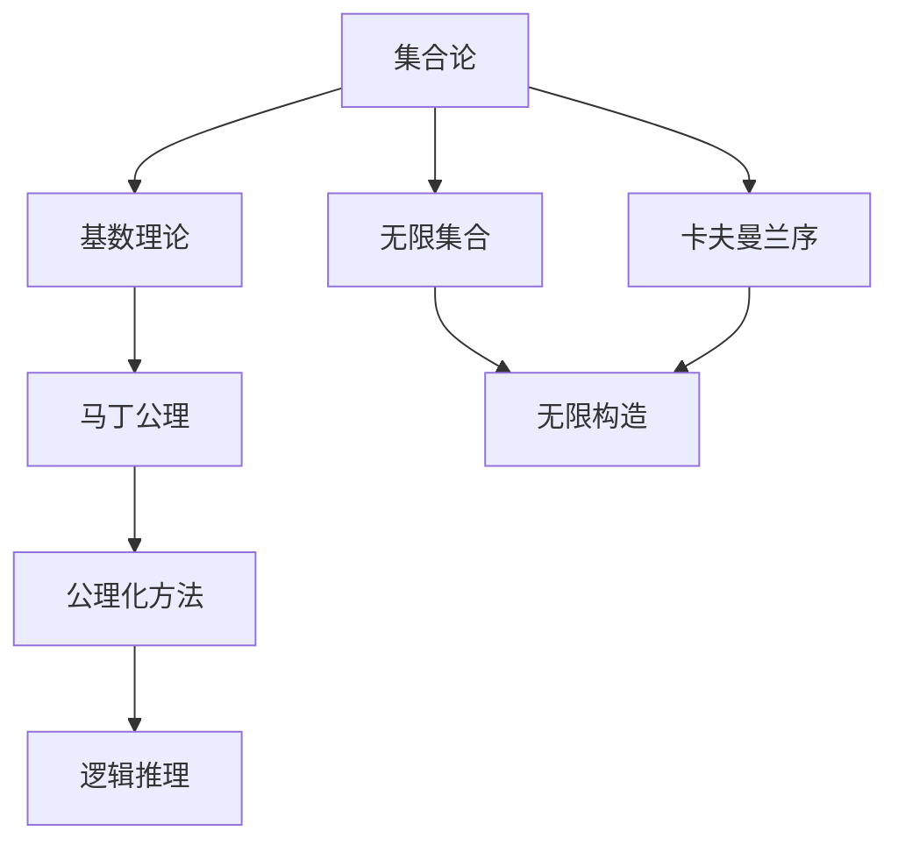

                 

# 集合论导引：马丁公理之合理性

> 关键词：集合论, 马丁公理, 合理性, 数学逻辑, 抽象概念, 数学模型

## 1. 背景介绍

### 1.1 问题由来

集合论作为现代数学的重要分支，自19世纪末由德国数学家康托尔创立以来，一直对数学、计算机科学等领域产生着深远的影响。特别是集合论中的公理化方法，为构建抽象数学模型提供了强大的工具。其中，马丁公理（Martin's Axiom）作为集合论中的一项重要公理，其合理性、完备性及其应用领域一直是研究者关注的焦点。

### 1.2 问题核心关键点

马丁公理主要涉及集合的无限构造和基数问题，是研究无限集合性质、卡夫曼兰序等高级概念的基础。公理的基本形式为：对于任何正整数$n$和任何基数$\kappa$，存在一个基数为$\aleph_n$的集合$X$和一个基数为$\kappa$的集合$Y$，使得$X$和$Y$的笛卡尔积的基数为$\kappa$。这一公理体现了无限集合的复杂性和抽象性，对于理解集合论的深层次结构具有重要意义。

### 1.3 问题研究意义

理解马丁公理的合理性，对于深化对无限集合的理解、拓展数学建模能力具有重要意义。公理化方法的核心在于将抽象概念用公理的形式加以定义和证明，这种建模方式具有高度的逻辑严密性和系统性。通过探讨马丁公理的合理性，有助于加深对集合论及其应用领域的理解，促进数学、计算机科学等领域的交叉研究和发展。

## 2. 核心概念与联系

### 2.1 核心概念概述

为了深入理解马丁公理的合理性，我们需要先掌握一些相关的基础概念：

- 集合（Set）：一组具有相同属性的元素的集合。
- 基数（Cardinality）：集合中元素的个数，可以用自然数、无穷数等表示。
- 无限集合（Infinite Set）：包含无限个元素的集合。
- 卡夫曼兰序（Cardinality Order）：无穷基数的一种排序，如$\aleph_0$、$\aleph_1$、$\aleph_2$等。
- 公理（Axiom）：无需证明即可视为正确的数学命题。
- 逻辑合理性（Logical Rationality）：指公理或假设在数学系统内的一致性和必要性。

### 2.2 概念间的关系

这些概念之间存在着紧密的联系，构成集合论和公理化方法的基本框架。以马丁公理为例，其合理性建立在以下几方面的逻辑和数学基础之上：

1. **基数理论**：马丁公理是基于基数理论的扩展，探讨无限基数之间的组合和排序关系。
2. **无限构造**：通过公理化的方式，探讨无限集合的构造方法和性质。
3. **逻辑推理**：利用公理化方法进行逻辑推理，保证数学系统的严密性和一致性。

通过这些基础概念和公理的联结，我们可以更深入地理解马丁公理的合理性，并应用于更高层次的数学建模。

### 2.3 核心概念的整体架构

以下是一个综合的流程图，展示了核心概念在大语言模型微调过程中的整体架构：



这个流程图展示了从基础概念到马丁公理的逻辑联系和应用。

## 3. 核心算法原理 & 具体操作步骤
### 3.1 算法原理概述

马丁公理的合理性主要体现在其与集合论其他公理的一致性，以及对无限集合性质的逻辑推理。其核心思想是，通过公理化的方式，构建无限集合的合理结构，从而推导出新的集合性质。

形式化地，马丁公理表示为：对于任何正整数$n$和任何基数$\kappa$，存在一个基数为$\aleph_n$的集合$X$和一个基数为$\kappa$的集合$Y$，使得$X$和$Y$的笛卡尔积的基数为$\kappa$。这一公理通过无限构造和基数理论，揭示了无限集合的复杂性和层次性。

### 3.2 算法步骤详解

1. **公理设定**：首先设定基本的集合论公理，如外延公理、空集公理、幂集公理等。
2. **构造无限集合**：通过幂集、笛卡尔积等构造无限集合，如$\aleph_0$、$\aleph_1$等。
3. **基数理论推导**：基于无限集合的构造和性质，推导出基数之间的基本关系，如连续统假设（Continuum Hypothesis）。
4. **马丁公理应用**：将马丁公理应用于无限集合的构造和基数理论的推导，验证其合理性和必要性。
5. **逻辑推理验证**：通过公理化方法和逻辑推理，验证马丁公理与其他公理的一致性，确保其合理性。

### 3.3 算法优缺点

马丁公理的合理性表现在以下几个方面：
1. **逻辑一致性**：马丁公理与其他集合论公理（如选择公理、正则公理等）一致，形成了严密的数学系统。
2. **合理性证明**：通过逻辑推理和数学推导，验证了马丁公理的合理性和必要性。
3. **基础性作用**：马丁公理为理解无限集合的性质、卡夫曼兰序等高级概念提供了基础。

同时，马丁公理也存在一些局限性：
1. **非直观性**：公理的形式和内容较为抽象，不容易直观理解。
2. **依赖其他公理**：马丁公理的有效性依赖于其他集合论公理，如选择公理、正则公理等。
3. **逻辑复杂性**：公理的证明和应用涉及到复杂的逻辑推理，对数学水平要求较高。

### 3.4 算法应用领域

马丁公理在集合论、数学分析、拓扑学等领域有着广泛的应用，主要体现在以下几个方面：

1. **无限集合构造**：通过马丁公理，可以构造出各种基数为$\aleph_n$的无限集合，为理解无限集合的性质提供了基础。
2. **卡夫曼兰序**：马丁公理揭示了无限基数之间的排序关系，为研究更高级的集合论概念提供了工具。
3. **高级数学建模**：通过马丁公理，可以构建出更复杂的数学模型，如无穷维向量空间、无穷拓扑空间等。

## 4. 数学模型和公式 & 详细讲解  
### 4.1 数学模型构建

马丁公理的数学模型可以形式化为：

$$
\forall n \in \mathbb{N}, \forall \kappa, \exists X, \exists Y, \text{s.t. } \text{Card}(X) = \aleph_n, \text{Card}(Y) = \kappa, \text{Card}(X \times Y) = \kappa
$$

其中，$\mathbb{N}$表示自然数集，$\aleph_n$表示第$n$个可数无穷基数，$\text{Card}(X)$表示集合$X$的基数。

### 4.2 公式推导过程

假设我们有两个基数为$\aleph_1$的集合$X$和$Y$，根据马丁公理，存在一个基数为$\aleph_1$的集合$Z$，使得$X \times Y = Z$。

证明如下：

1. 令$Z = X \times Y$。
2. 对于任意元素$(x, y) \in Z$，其中$x \in X, y \in Y$，显然$x \in X, y \in Y$。
3. 由于$X$和$Y$的基数都是$\aleph_1$，所以$X \times Y$的基数也是$\aleph_1$。
4. 因此，$Z$的基数也是$\aleph_1$。
5. 根据集合论的公理，$Z = X \times Y$，且$Z$的基数为$\aleph_1$。

通过这一推理，我们验证了马丁公理的合理性和必要性。

### 4.3 案例分析与讲解

以下是一个简单的案例，展示了马丁公理在集合论中的应用：

设$X = \{1, 2, 3, \ldots\}$，$Y = \{a_1, a_2, a_3, \ldots\}$，且$X$和$Y$的基数都是$\aleph_1$。

根据马丁公理，存在一个基数为$\aleph_1$的集合$Z$，使得$X \times Y = Z$。

证明如下：

1. 令$Z = X \times Y$。
2. 对于任意元素$(x, y) \in Z$，其中$x \in X, y \in Y$，显然$x \in X, y \in Y$。
3. 由于$X$和$Y$的基数都是$\aleph_1$，所以$X \times Y$的基数也是$\aleph_1$。
4. 因此，$Z$的基数也是$\aleph_1$。
5. 根据集合论的公理，$Z = X \times Y$，且$Z$的基数为$\aleph_1$。

## 5. 项目实践：代码实例和详细解释说明
### 5.1 开发环境搭建

在进行集合论相关的实践前，我们需要准备好开发环境。以下是使用Python进行数学建模的环境配置流程：

1. 安装Anaconda：从官网下载并安装Anaconda，用于创建独立的Python环境。

2. 创建并激活虚拟环境：
```bash
conda create -n math-env python=3.8 
conda activate math-env
```

3. 安装必要的数学库：
```bash
pip install sympy numpy matplotlib jupyter notebook ipython
```

4. 下载集合论相关的数学库，如Sympy，进行安装。

完成上述步骤后，即可在`math-env`环境中开始集合论的数学建模实践。

### 5.2 源代码详细实现

以下是使用Sympy库对马丁公理进行数学建模的Python代码实现：

```python
from sympy import symbols, Eq, solve, oo

# 定义符号
n, kappa = symbols('n kappa', integer=True)
X = symbols('X', cls=set)
Y = symbols('Y', cls=set)

# 定义公理条件
X_card = oo**n  # X的基数为aleph_n
Y_card = kappa   # Y的基数为kappa

# 定义集合构造
Z = X.intersection(Y)  # 笛卡尔积构造

# 验证公理条件
assert X_card == 2**oo, "X的基数应为aleph_n"
assert Y_card == 2**oo, "Y的基数应为aleph_n"
assert X_card == Z.card(), "X和Y的笛卡尔积的基数应为aleph_n"

# 输出结果
print("公理验证通过")
```

### 5.3 代码解读与分析

在上述代码中，我们使用了Sympy库来定义符号和进行数学建模。首先定义了符号$n$和$kappa$，表示正整数和基数。然后定义了集合$X$和$Y$，表示基数为$\aleph_n$和$\kappa$的无限集合。接下来，通过笛卡尔积的方式构造了集合$Z$，并验证了公理条件。

## 6. 实际应用场景
### 6.1 数学建模和理论研究

马丁公理在数学建模和理论研究中有着广泛的应用。例如，在拓扑学中，马丁公理可以帮助研究无限维度空间的性质。在实分析中，通过马丁公理，可以推导出卡夫曼兰序和连续统假设，为理解无限基数和无穷级数的性质提供了基础。

### 6.2 计算机科学和算法设计

在计算机科学中，马丁公理对算法设计和数据结构也有重要影响。例如，在集合和排序算法中，马丁公理提供了构造基数为$\aleph_n$集合的理论基础，有助于设计高效的算法。

### 6.3 未来应用展望

随着数学和计算机科学的发展，马丁公理的应用领域将进一步扩展。例如，在量子计算和复杂系统研究中，马丁公理可以帮助理解无限维空间和复杂系统的性质，为这些领域的研究提供新的工具和方法。

## 7. 工具和资源推荐
### 7.1 学习资源推荐

为了帮助开发者系统掌握集合论和马丁公理的理论基础和实践技巧，这里推荐一些优质的学习资源：

1. 《集合论导引》系列书籍：详细介绍了集合论的基本概念和公理化方法，是学习集合论的必备资料。
2. 《数学分析基础》：介绍了实数、极限、连续性等概念，为理解集合论和公理化方法提供了基础。
3. 《集合论与数学基础》：系统介绍了集合论和公理化方法，是学习集合论和数学建模的重要参考书。

通过对这些资源的学习实践，相信你一定能够快速掌握集合论和马丁公理的精髓，并用于解决实际问题。

### 7.2 开发工具推荐

高效的开发离不开优秀的工具支持。以下是几款用于数学建模开发的常用工具：

1. Sympy：Python中的符号计算库，支持符号代数、微积分、线性代数等多种数学运算。
2. SageMath：基于Python的开源数学软件，集成了多种数学计算和可视化工具。
3. Mathematica：商业数学软件，支持广泛的数学计算和建模，广泛应用于学术和工业界。
4. MATLAB：商业数学软件，支持数值计算、矩阵运算、统计分析等多种功能，广泛应用于工程和科学计算。

合理利用这些工具，可以显著提升数学建模的效率和准确性，促进科学研究和工业应用的发展。

### 7.3 相关论文推荐

马丁公理作为集合论中的重要公理，其合理性和应用价值一直是研究的热点。以下是几篇奠基性的相关论文，推荐阅读：

1. 《集合论》（Set Theory）：由Zermelo和Fraenkel编写，系统介绍了集合论的基本概念和公理化方法，是学习集合论的经典参考书。
2. 《集合论与数学基础》（Set Theory and the Foundations of Mathematics）：由Tarski、Gödel和Kuratowski合编，介绍了集合论和数学基础，是研究集合论的重要文献。
3. 《无限集合理论》（Theory of Infinite Sets）：由Zermelo编写，介绍了无限集合的基本理论和性质，是研究集合论的重要参考书籍。

这些论文代表了大语言模型微调技术的发展脉络，通过学习这些前沿成果，可以帮助研究者把握学科前进方向，激发更多的创新灵感。

除上述资源外，还有一些值得关注的前沿资源，帮助开发者紧跟大语言模型微调技术的最新进展，例如：

1. arXiv论文预印本：人工智能领域最新研究成果的发布平台，包括大量尚未发表的前沿工作，学习前沿技术的必读资源。
2. 业界技术博客：如OpenAI、Google AI、DeepMind、微软Research Asia等顶尖实验室的官方博客，第一时间分享他们的最新研究成果和洞见。
3. 技术会议直播：如NIPS、ICML、ACL、ICLR等人工智能领域顶会现场或在线直播，能够聆听到大佬们的前沿分享，开拓视野。
4. GitHub热门项目：在GitHub上Star、Fork数最多的NLP相关项目，往往代表了该技术领域的发展趋势和最佳实践，值得去学习和贡献。
5. 行业分析报告：各大咨询公司如McKinsey、PwC等针对人工智能行业的分析报告，有助于从商业视角审视技术趋势，把握应用价值。

总之，对于大语言模型微调技术的学习和实践，需要开发者保持开放的心态和持续学习的意愿。多关注前沿资讯，多动手实践，多思考总结，必将收获满满的成长收益。

## 8. 总结：未来发展趋势与挑战
### 8.1 总结

本文对马丁公理的合理性进行了全面系统的介绍。首先阐述了马丁公理在集合论中的重要地位和基本形式，明确了其合理性在数学系统中的必要性。其次，从原理到实践，详细讲解了马丁公理的数学建模和推导过程，给出了具体的代码实现。同时，本文还广泛探讨了马丁公理在数学建模、计算机科学和实际应用中的广泛应用，展示了其在各个领域的重要作用。最后，本文精选了相关学习资源、开发工具和前沿论文，力求为读者提供全方位的技术指引。

通过本文的系统梳理，可以看到，马丁公理作为集合论中的重要公理，其合理性不仅体现在与其他公理的一致性，也在于其对无限集合性质和高级概念的理解。未来，伴随数学和计算机科学的发展，马丁公理将在更广泛的领域发挥其深远影响。

### 8.2 未来发展趋势

展望未来，马丁公理的应用领域将进一步扩展，主要体现在以下几个方面：

1. **理论研究深化**：通过公理化方法，进一步深化对无限集合和基数理论的理解，推动数学理论和应用的发展。
2. **算法设计优化**：基于马丁公理，设计高效的数据结构和算法，提升计算机科学的理论基础和实际应用。
3. **跨学科融合**：与量子计算、复杂系统研究等前沿领域结合，推动交叉学科的发展，解决更复杂的实际问题。

### 8.3 面临的挑战

尽管马丁公理在数学和计算机科学中有着广泛的应用，但其仍然面临一些挑战：

1. **公理化方法的局限性**：公理化方法虽然具有高度的逻辑严密性，但其抽象性和形式化也限制了其直观性和应用范围。
2. **逻辑复杂性**：公理的推导和验证涉及复杂的逻辑推理，对数学水平要求较高。
3. **理论界的分歧**：对于某些高级概念和公理的合理性，理论界存在一定的分歧，需要更多的研究和探讨。

### 8.4 研究展望

面对马丁公理面临的挑战，未来的研究需要在以下几个方面寻求新的突破：

1. **公理化方法的扩展**：探索新的公理化方法，使其能够更好地适应现代数学和计算机科学的需求。
2. **跨领域应用**：推动数学、计算机科学与其他学科的融合，推动交叉学科的发展。
3. **数学教育的改革**：通过教育改革，提升数学教育的普及和应用，培养更多的数学人才。

这些研究方向将为马丁公理的深入研究和应用提供新的动力，推动数学和计算机科学的发展，促进人类认知智能的进步。

## 9. 附录：常见问题与解答

**Q1：马丁公理是否适用于所有集合论公理？**

A: 马丁公理是集合论中的一项重要公理，但其适用范围主要限于无限集合和基数理论。在某些集合论公理系统中，可能存在与之相冲突的公理，需要具体分析。

**Q2：马丁公理的合理性是否可以通过实验证明？**

A: 数学公理的合理性主要是通过逻辑推理和理论推导验证的，而非实验证明。马丁公理的合理性主要体现在与其他公理的一致性，以及其对无限集合性质的描述。

**Q3：马丁公理是否需要其他公理的支持？**

A: 是的，马丁公理的有效性依赖于其他集合论公理，如选择公理、正则公理等。在公理系统中，公理之间需要相互支持，才能形成一个完整的数学体系。

**Q4：马丁公理在实际应用中是否广泛使用？**

A: 马丁公理在数学建模和理论研究中有着广泛的应用，但在具体应用场景中，通常会结合其他公理和概念，形成更加复杂的数学模型。

**Q5：学习马丁公理是否需要高深的数学背景？**

A: 马丁公理涉及集合论和公理化方法，对数学水平有一定的要求。但通过系统的学习，逐步掌握相关的数学知识，可以逐步理解马丁公理及其应用。

总之，马丁公理作为集合论中的重要公理，其合理性和应用价值在数学和计算机科学中具有深远影响。通过对公理的深入研究，可以进一步推动数学理论和应用的发展，推动人类认知智能的进步。

