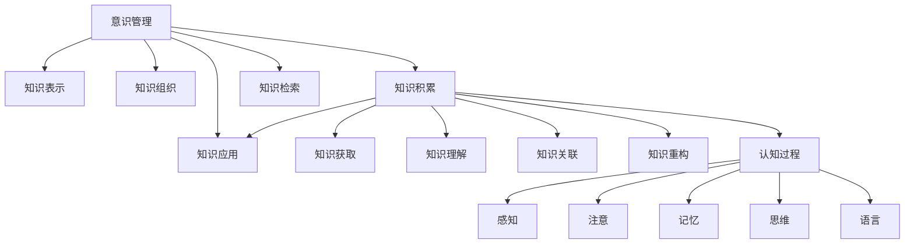

# 知识积累在意识管理中的作用

## 1. 背景介绍

### 1.1 问题的由来

在当今信息时代,我们被海量的信息所包围。每天都有大量的新知识、新技术、新理论不断涌现。如何有效地管理和利用这些知识,已经成为一个亟待解决的问题。意识管理作为一种新兴的认知技术,旨在通过系统化的方法来组织和管理个人的知识结构,从而提高个人的学习效率和创造力。

### 1.2 研究现状

目前,意识管理的研究主要集中在以下几个方面:

1. 知识表示和组织方法
2. 个人知识管理系统的设计和实现
3. 知识积累对认知过程的影响
4. 意识管理在教育、工作等领域的应用

研究人员已经提出了多种知识表示模型,如概念地图、主题地图、知识图谱等。同时,也有一些个人知识管理工具被开发出来,如 Roam Research、Obsidian、Logseq 等。但是,如何将知识有效地积累到个人的意识结构中,并发挥其作用,仍然是一个亟待深入研究的课题。

### 1.3 研究意义

知识积累在意识管理中发挥着至关重要的作用。有效的知识积累不仅能够提高个人的学习效率,还能够促进创新思维的产生。通过研究知识积累在意识管理中的作用,我们可以更好地理解人类的认知过程,并设计出更加人性化的个人知识管理系统。同时,这也将为教育、工作等领域带来新的思路和方法。

### 1.4 本文结构

本文将从以下几个方面深入探讨知识积累在意识管理中的作用:

1. 核心概念与联系
2. 知识积累的核心算法原理和具体操作步骤
3. 知识积累的数学模型和公式
4. 知识积累在意识管理中的项目实践
5. 知识积累在实际应用场景中的作用
6. 相关工具和资源推荐
7. 知识积累在意识管理中的未来发展趋势和挑战

## 2. 核心概念与联系

在探讨知识积累在意识管理中的作用之前,我们需要先了解一些核心概念及其之间的联系。

### 2.1 意识管理

意识管理(Mind Management)是一种新兴的认知技术,旨在通过系统化的方法来组织和管理个人的知识结构。它包括以下几个核心概念:

1. **知识表示**:将个人的知识以可视化的形式表示出来,如概念地图、主题地图、知识图谱等。
2. **知识组织**:根据一定的原则和方法,将知识进行有序的组织和分类。
3. **知识积累**:不断地将新知识融入到已有的知识结构中,形成更加完整和系统化的知识体系。
4. **知识检索**:能够快速地从个人的知识库中检索到所需的知识。
5. **知识应用**:将积累的知识应用到实际的问题解决和创新思维中。

### 2.2 知识积累

知识积累是指将新获得的知识融入到已有的知识结构中,形成更加完整和系统化的知识体系。它是意识管理中最为核心的环节,也是本文探讨的重点。

知识积累包括以下几个关键步骤:

1. **知识获取**:通过学习、阅读、观察等方式获取新知识。
2. **知识理解**:对新获得的知识进行深入的理解和消化。
3. **知识关联**:将新知识与已有的知识结构进行关联和融合。
4. **知识重构**:根据新知识的融入,对已有的知识结构进行必要的重构和调整。
5. **知识应用**:将积累的知识应用到实际的问题解决和创新思维中。

### 2.3 认知过程

认知过程是指人类获取、加工、存储和应用信息的过程。它包括以下几个主要环节:

1. **感知**:通过视觉、听觉等感官接收外界信息。
2. **注意**:将注意力集中在特定的信息上。
3. **记忆**:将信息编码并存储在大脑中。
4. **思维**:对存储的信息进行加工和运算,形成新的认知结果。
5. **语言**:将认知结果转化为语言表达出来。

知识积累过程与认知过程密切相关,它们相互影响、相互促进。有效的知识积累能够优化认知过程,提高个人的学习效率和创造力。

### 2.4 概念关联图

为了更好地理解上述核心概念之间的关系,我们可以绘制一个概念关联图:

从上图中可以看出,知识积累是意识管理的核心环节,它与认知过程密切相关,并且对知识应用、知识表示、知识组织等其他环节也有重要影响。

## 3. 核心算法原理 & 具体操作步骤

### 3.1 算法原理概述

知识积累的核心算法原理可以概括为以下几个方面:

1. **知识表示**:将个人的知识以可视化的形式表示出来,如概念地图、主题地图、知识图谱等。这有利于知识的组织和关联。

2. **语义关联**:通过自然语言处理和知识图谱技术,自动发现新知识与已有知识之间的语义关联关系。

3. **知识融合**:将新知识与已有知识进行融合,形成更加完整和系统化的知识体系。

4. **知识重构**:根据新知识的融入,对已有的知识结构进行必要的重构和调整,以保持知识体系的一致性和完整性。

5. **认知增强**:通过优化知识积累过程,提高个人的学习效率和创造力,实现认知增强。

### 3.2 算法步骤详解

知识积累的具体算法步骤如下:

1. **知识获取**:通过学习、阅读、观察等方式获取新知识。

2. **知识表示**:将新获得的知识以概念地图、主题地图或知识图谱的形式表示出来。

3. **语义关联发现**:使用自然语言处理和知识图谱技术,自动发现新知识与已有知识之间的语义关联关系。

4. **关联权重计算**:根据语义关联的强度,计算新知识与已有知识之间的关联权重。

5. **知识融合**:将新知识与已有知识进行融合,形成更加完整和系统化的知识体系。融合过程中,需要根据关联权重对知识进行合理的排序和组织。

6. **知识重构**:根据新知识的融入,对已有的知识结构进行必要的重构和调整,以保持知识体系的一致性和完整性。

7. **知识应用**:将积累的知识应用到实际的问题解决和创新思维中,并根据应用结果对知识体系进行反馈和优化。

8. **认知增强**:通过优化知识积累过程,提高个人的学习效率和创造力,实现认知增强。

### 3.3 算法优缺点

知识积累算法的优点包括:

1. 能够自动发现新知识与已有知识之间的关联关系,提高知识融合的效率。
2. 通过知识重构,保持了知识体系的一致性和完整性。
3. 将知识以可视化的形式表示,有利于知识的组织和理解。
4. 实现了认知增强,提高了个人的学习效率和创造力。

但是,该算法也存在一些缺点:

1. 依赖于自然语言处理和知识图谱技术的准确性,存在一定的误差。
2. 知识融合和重构过程可能会引入一些噪声和错误。
3. 对于一些抽象或隐喻性的知识,语义关联发现可能会存在困难。
4. 算法的计算复杂度较高,对计算资源的要求较大。

### 3.4 算法应用领域

知识积累算法可以应用于以下领域:

1. **个人知识管理**:帮助个人有效地管理和积累知识,提高学习效率和创造力。
2. **教育领域**:优化教学过程,提高学生的学习效果。
3. **企业知识管理**:建立企业知识库,促进知识共享和创新。
4. **智能助手**:作为智能助手系统的核心算法,实现知识积累和问答功能。
5. **科研领域**:帮助研究人员发现新的研究方向和创新点。

## 4. 数学模型和公式 & 详细讲解 & 举例说明

### 4.1 数学模型构建

为了更好地描述和分析知识积累过程,我们可以构建一个数学模型。

假设个人的知识体系可以表示为一个有向加权图 $G=(V,E,W)$,其中:

- $V$ 表示知识概念的集合,每个概念用一个节点表示。
- $E$ 表示概念之间的关联关系,用有向边表示。
- $W$ 表示概念之间关联关系的权重,用边的权重表示。

当获取新知识时,我们需要将其表示为一个新的概念节点 $v_n$,并计算它与已有概念节点之间的关联权重 $w_{nj}$。

我们定义一个关联函数 $f(v_n,v_j)$,用于计算新概念 $v_n$ 与已有概念 $v_j$ 之间的关联强度。关联函数可以基于自然语言处理和知识图谱技术,考虑概念之间的语义相似度、共现频率等因素。

$$w_{nj} = f(v_n,v_j)$$

接下来,我们需要将新概念 $v_n$ 融入到已有的知识图谱中。我们定义一个融合函数 $g(G,v_n,W_n)$,用于更新知识图谱 $G$,其中 $W_n$ 表示新概念与已有概念之间的关联权重向量。

$$G' = g(G,v_n,W_n)$$

融合函数需要考虑以下几个方面:

1. 将新概念节点 $v_n$ 添加到知识图谱中。
2. 根据关联权重 $W_n$,为新概念节点与已有概念节点之间添加有向边。
3. 对已有概念节点之间的边进行必要的调整,以保持知识图谱的一致性和完整性。

在融合过程中,我们还需要考虑知识的重要性和新颖性。我们可以定义一个重要性函数 $h(v)$,用于计算概念 $v$ 的重要性得分。重要性得分可以基于概念的中心度、频率等因素计算。

$$s_v = h(v)$$

同时,我们还可以定义一个新颖性函数 $i(v_n,G)$,用于计算新概念 $v_n$ 相对于已有知识图谱 $G$ 的新颖性得分。新颖性得分可以基于新概念与已有概念之间的关联强度计算。

$$s_n = i(v_n,G)$$

在融合过程中,我们可以根据重要性得分和新颖性得分,对概念进行排序和组织,从而优化知识体系的结构。

### 4.2 公式推导过程

下面我们详细推导上述数学模型中的一些公式。

#### 4.2.1 关联函数 $f(v_n,v_j)$

关联函数 $f(v_n,v_j)$ 用于计算新概念 $v_n$ 与已有概念 $v_j$ 之间的关联强度。我们可以将其定义为:

$$f(v_n,v_j) = \alpha \cdot \text{sim}(v_n,v_j) + \beta \cdot \text{cooc}(v_n,v_j)$$

其中:

- $\text{sim}(v_n,v_j)$ 表示新概念 $v_n$ 与已有概念 $