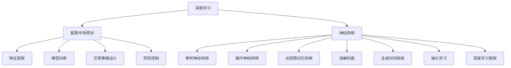
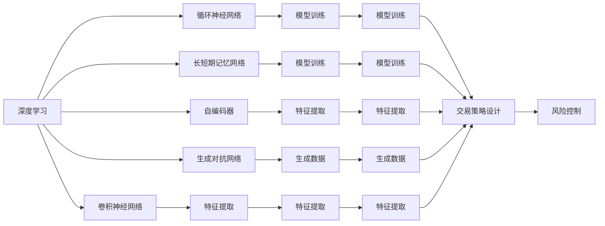
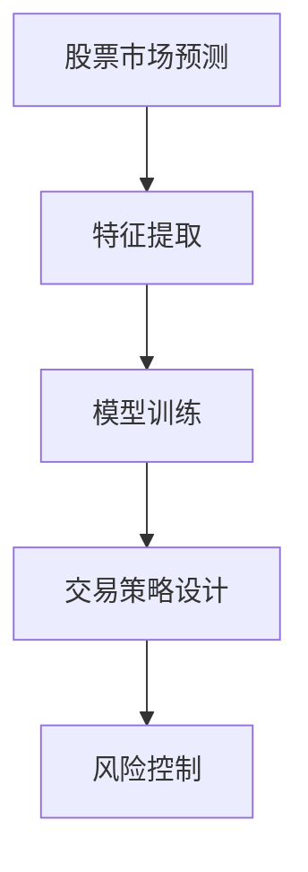
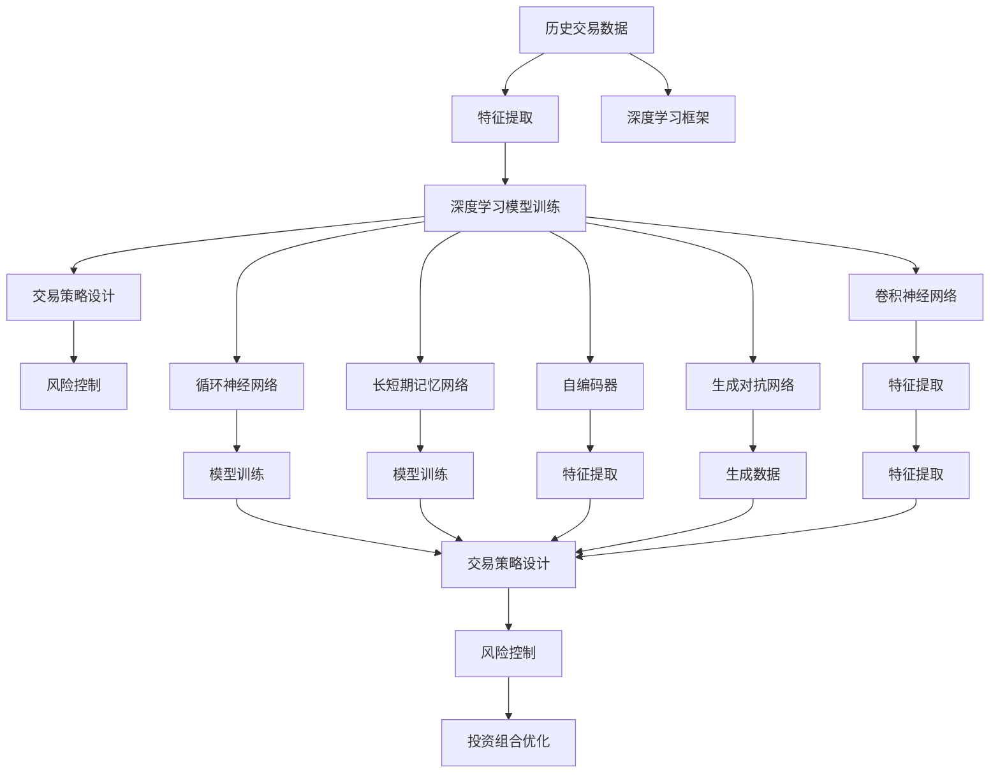

                 

# Python深度学习实践：AI在股票市场预测中的应用

> 关键词：深度学习, 股票市场预测, 神经网络, 数据挖掘, 交易策略, 投资组合优化

## 1. 背景介绍

### 1.1 问题由来
股票市场预测是金融领域的一大难题，也是深度学习在实际应用中的典型案例之一。深度学习在金融领域的应用，不仅能够帮助投资者更好地理解市场动态，还能辅助企业做出合理的投资决策。然而，由于金融数据的高频、高维、非平稳等特点，单纯依靠传统机器学习难以获得理想的预测效果。近年来，深度学习在金融领域的广泛应用，显著提升了市场预测的准确性和实时性，逐步成为了投资者、分析师和机构的重要工具。

### 1.2 问题核心关键点
深度学习在股票市场预测中的应用主要体现在以下几个方面：
1. **特征提取**：通过神经网络学习金融数据的特征表示，捕捉数据中的模式和规律。
2. **模型训练**：基于历史交易数据，训练深度学习模型进行市场预测。
3. **交易策略设计**：结合预测结果，设计自动化交易策略，实现投资组合优化。
4. **风险控制**：通过模型评估和调整，控制投资组合风险。

本文将深入探讨深度学习在股票市场预测中的应用，从模型的构建、训练、优化到实际交易策略的设计，全面阐述AI技术在股票市场中的应用价值和实践路径。

### 1.3 问题研究意义
深度学习在股票市场预测中的应用，对于推动金融科技的创新和转型具有重要意义：
1. **提升市场预测精度**：通过深度学习模型，投资者能够获得更准确的市场预测结果，提升决策效果。
2. **降低交易成本**：自动化交易策略的应用，大幅降低了人工交易的成本和时间。
3. **优化投资组合**：深度学习技术能够根据市场动态调整投资组合，提高整体收益。
4. **风险管理**：深度学习模型能够实时监控市场风险，辅助投资者进行风险管理。

## 2. 核心概念与联系

### 2.1 核心概念概述

为更好地理解深度学习在股票市场预测中的应用，本节将介绍几个密切相关的核心概念：

- **深度学习**：基于多层神经网络的机器学习技术，能够自动学习输入数据的复杂特征表示，广泛应用于图像、语音、自然语言处理等领域。
- **股票市场预测**：通过历史交易数据，利用机器学习模型预测未来股票价格或市场趋势，辅助投资者做出决策。
- **神经网络**：由多个层次的神经元组成，通过反向传播算法进行训练，是深度学习模型的核心组件。
- **卷积神经网络(CNN)**：一种特殊类型的神经网络，常用于图像识别和信号处理，能够提取空间局部特征。
- **循环神经网络(RNN)**：一种序列处理模型，适用于时间序列数据的预测，能够捕捉数据的时序依赖关系。
- **长短期记忆网络(LSTM)**：一种RNN的变体，能够有效解决梯度消失问题，适用于长期依赖关系的序列数据。
- **自编码器(AE)**：一种无监督学习模型，能够通过降维和重构的方式学习数据的低维表示。
- **生成对抗网络(GAN)**：一种生成模型，通过两个网络（生成器和判别器）相互对抗，生成高质量的合成数据。
- **强化学习**：通过环境与智能体（模型）的交互，优化智能体的策略，应用于投资组合优化等领域。
- **深度学习框架**：如TensorFlow、PyTorch等，提供了高效的工具和库，便于深度学习模型的构建和训练。

这些核心概念之间的逻辑关系可以通过以下Mermaid流程图来展示：



这个流程图展示了大语言模型的核心概念及其之间的关系：

1. 深度学习是实现股票市场预测的核心技术。
2. 深度学习中的神经网络、CNN、RNN、LSTM、AE、GAN和强化学习等模型，都在不同程度上被应用于市场预测。
3. 深度学习框架提供工具和库，支持模型的构建和训练。
4. 特征提取、模型训练、交易策略设计、风险控制等步骤，共同构成完整的市场预测流程。

### 2.2 概念间的关系

这些核心概念之间存在着紧密的联系，形成了深度学习在股票市场预测中的完整生态系统。下面我通过几个Mermaid流程图来展示这些概念之间的关系。

#### 2.2.1 深度学习范式



这个流程图展示了大语言模型的三种主要范式：
1. CNN适用于图像和信号处理，能够提取局部特征。
2. RNN和LSTM适用于序列数据，能够捕捉时间依赖性。
3. AE和GAN用于降维和生成，能够探索数据的内在结构。

#### 2.2.2 市场预测与交易策略的关系



这个流程图展示了市场预测与交易策略设计、风险控制之间的关系：
1. 特征提取是从原始数据中提取有意义的特征，用于模型训练。
2. 模型训练通过历史数据训练深度学习模型，进行市场预测。
3. 交易策略设计根据预测结果，设计自动化交易策略。
4. 风险控制评估模型性能和风险，辅助投资者进行决策。

#### 2.2.3 强化学习在交易策略中的应用


这个流程图展示了强化学习在交易策略中的应用：
1. 强化学习通过环境与智能体的交互，优化交易策略。
2. 市场预测提供环境反馈，辅助策略优化。
3. 风险控制评估策略效果，指导策略调整。

### 2.3 核心概念的整体架构

最后，我们用一个综合的流程图来展示这些核心概念在大语言模型微调过程中的整体架构：



这个综合流程图展示了从数据处理到交易策略设计、风险控制、投资组合优化等完整的市场预测流程。深度学习模型利用历史交易数据进行训练，提取出数据中的特征，生成预测结果。交易策略设计结合预测结果，设计自动化交易策略，辅助投资者进行决策。风险控制评估模型性能和风险，辅助投资者进行风险管理。投资组合优化则通过优化模型和策略，提升投资效果。通过这些流程，我们可以更清晰地理解深度学习在股票市场预测中的应用框架，为后续深入讨论具体的模型和方法奠定基础。

## 3. 核心算法原理 & 具体操作步骤
### 3.1 算法原理概述

深度学习在股票市场预测中的应用，主要基于以下原理：

- **特征提取**：通过神经网络学习输入数据的特征表示，捕捉数据中的模式和规律。
- **模型训练**：基于历史交易数据，训练深度学习模型进行市场预测。
- **交易策略设计**：结合预测结果，设计自动化交易策略，实现投资组合优化。
- **风险控制**：通过模型评估和调整，控制投资组合风险。

形式化地，假设历史交易数据为 $D=\{(x_i, y_i)\}_{i=1}^N, x_i \in \mathcal{X}, y_i \in \mathcal{Y}$，其中 $x_i$ 为输入特征，$y_i$ 为标签（股票价格、市场指数等）。深度学习模型为 $M_{\theta}:\mathcal{X} \rightarrow \mathcal{Y}$，其中 $\theta$ 为模型参数。微调的目标是最小化损失函数 $\mathcal{L}(\theta)$：

$$
\mathcal{L}(\theta) = \frac{1}{N} \sum_{i=1}^N \ell(M_{\theta}(x_i),y_i)
$$

其中 $\ell$ 为损失函数，常用的有均方误差损失、交叉熵损失等。通过梯度下降等优化算法，微调过程不断更新模型参数 $\theta$，最小化损失函数 $\mathcal{L}$，使得模型输出逼近真实标签。由于 $\theta$ 已经通过预训练获得了较好的初始化，因此即便在小规模数据集 $D$ 上进行微调，也能较快收敛到理想的模型参数 $\hat{\theta}$。

### 3.2 算法步骤详解

深度学习在股票市场预测中的应用主要包括以下几个关键步骤：

**Step 1: 准备数据集**

- **数据收集**：收集历史交易数据，包括股票价格、市场指数、交易量等，构成数据集 $D=\{(x_i, y_i)\}_{i=1}^N$。
- **数据预处理**：对原始数据进行清洗、归一化等预处理，构建输入特征 $x_i$ 和标签 $y_i$。
- **数据划分**：将数据集划分为训练集、验证集和测试集。

**Step 2: 设计模型结构**

- **模型选择**：根据任务特点选择合适的深度学习模型，如CNN、RNN、LSTM等。
- **网络结构**：设计模型的网络结构，包括卷积层、池化层、全连接层、激活函数等。
- **损失函数**：选择合适的损失函数，如均方误差损失、交叉熵损失等。

**Step 3: 设定模型超参数**

- **学习率**：选择合适的学习率，一般比从头训练要小。
- **批大小**：设定每批次的大小，影响训练效率和效果。
- **迭代次数**：设定模型训练的迭代次数，一般为几千次到几百万次不等。
- **正则化**：加入正则化项，如L2正则、Dropout等，防止过拟合。

**Step 4: 模型训练**

- **前向传播**：将训练集输入模型，计算损失函数。
- **反向传播**：计算损失函数对模型参数的梯度，更新参数。
- **验证集评估**：周期性在验证集上评估模型性能，防止过拟合。
- **保存模型**：保存训练好的模型，以便后续使用。

**Step 5: 模型评估和测试**

- **评估模型**：在测试集上评估模型性能，计算各项指标。
- **策略优化**：根据测试结果，调整交易策略。
- **风险控制**：结合市场情况，控制投资组合风险。

**Step 6: 实际应用**

- **策略回测**：对交易策略进行历史回测，评估策略效果。
- **实时交易**：将策略应用于实时市场，进行交易操作。
- **效果监控**：实时监控交易结果，优化策略效果。

以上是深度学习在股票市场预测中的一般流程。在实际应用中，还需要针对具体任务的特点，对各个环节进行优化设计，如改进损失函数，引入更多的正则化技术，搜索最优的超参数组合等，以进一步提升模型性能。

### 3.3 算法优缺点

深度学习在股票市场预测中的应用具有以下优点：
1. **高精度预测**：通过学习复杂模式，深度学习模型能够实现高精度的市场预测。
2. **自适应学习**：深度学习模型能够适应数据分布的变化，实时调整预测结果。
3. **自动化交易**：结合预测结果，设计自动化交易策略，提升交易效率。
4. **风险管理**：通过模型评估和调整，控制投资组合风险。

同时，该方法也存在一定的局限性：
1. **数据需求大**：深度学习模型需要大量的历史交易数据进行训练，数据获取成本高。
2. **模型复杂**：深度学习模型结构复杂，训练和推理速度较慢，资源消耗大。
3. **过拟合风险**：深度学习模型容易过拟合，需要更多的正则化技术进行优化。
4. **模型可解释性差**：深度学习模型通常为"黑盒"模型，难以解释其内部工作机制。

尽管存在这些局限性，但深度学习在股票市场预测中的应用已取得显著成效，成为金融科技发展的重要方向。未来相关研究的重点在于如何进一步降低深度学习模型对数据的需求，提高模型的少样本学习和跨领域迁移能力，同时兼顾可解释性和伦理安全性等因素。

### 3.4 算法应用领域

深度学习在股票市场预测中的应用，主要涵盖以下几个领域：

1. **股票价格预测**：通过深度学习模型，预测股票的短期或长期价格走势，辅助投资者进行买入或卖出决策。
2. **市场指数预测**：预测市场指数的走势，帮助投资者进行市场整体风险评估和投资决策。
3. **交易量预测**：预测市场的交易量，辅助投资者进行交易策略调整和风险控制。
4. **基本面分析**：利用深度学习模型，分析公司基本面数据，预测公司股票的走势。
5. **技术面分析**：通过深度学习模型，分析股票图表数据，预测股票的走势。
6. **事件驱动策略**：利用深度学习模型，预测事件对市场的影响，辅助设计事件驱动的交易策略。

除了上述这些常见应用外，深度学习在股票市场预测中的应用还在不断扩展，如情绪分析、舆情监测、量化交易等，为金融科技带来了新的突破。随着深度学习模型的不断进步，相信其在股票市场预测中的应用前景将更加广阔。

## 4. 数学模型和公式 & 详细讲解  
### 4.1 数学模型构建

本节将使用数学语言对深度学习在股票市场预测中的应用进行更加严格的刻画。

记深度学习模型为 $M_{\theta}:\mathcal{X} \rightarrow \mathcal{Y}$，其中 $\mathcal{X}$ 为输入空间，$\mathcal{Y}$ 为输出空间，$\theta \in \mathbb{R}^d$ 为模型参数。假设历史交易数据为 $D=\{(x_i, y_i)\}_{i=1}^N, x_i \in \mathcal{X}, y_i \in \mathcal{Y}$。

定义模型 $M_{\theta}$ 在数据样本 $(x,y)$ 上的损失函数为 $\ell(M_{\theta}(x),y)$，则在数据集 $D$ 上的经验风险为：

$$
\mathcal{L}(\theta) = \frac{1}{N} \sum_{i=1}^N \ell(M_{\theta}(x_i),y_i)
$$

微调的目标是最小化经验风险，即找到最优参数：

$$
\theta^* = \mathop{\arg\min}_{\theta} \mathcal{L}(\theta)
$$

在实践中，我们通常使用基于梯度的优化算法（如SGD、Adam等）来近似求解上述最优化问题。设 $\eta$ 为学习率，$\lambda$ 为正则化系数，则参数的更新公式为：

$$
\theta \leftarrow \theta - \eta \nabla_{\theta}\mathcal{L}(\theta) - \eta\lambda\theta
$$

其中 $\nabla_{\theta}\mathcal{L}(\theta)$ 为损失函数对参数 $\theta$ 的梯度，可通过反向传播算法高效计算。

### 4.2 公式推导过程

以下我们以股票价格预测为例，推导均方误差损失函数及其梯度的计算公式。

假设模型 $M_{\theta}$ 在输入 $x$ 上的输出为 $\hat{y}=M_{\theta}(x)$，表示模型预测的股票价格。真实标签 $y$ 为实际股票价格。则均方误差损失函数定义为：

$$
\ell(M_{\theta}(x),y) = (\hat{y} - y)^2
$$

将其代入经验风险公式，得：

$$
\mathcal{L}(\theta) = \frac{1}{N} \sum_{i=1}^N (\hat{y}_i - y_i)^2
$$

根据链式法则，损失函数对参数 $\theta_k$ 的梯度为：

$$
\frac{\partial \mathcal{L}(\theta)}{\partial \theta_k} = \frac{1}{N}\sum_{i=1}^N 2(\hat{y}_i - y_i)\frac{\partial \hat{y}_i}{\partial \theta_k}
$$

其中 $\frac{\partial \hat{y}_i}{\partial \theta_k}$ 可进一步递归展开，利用自动微分技术完成计算。

在得到损失函数的梯度后，即可带入参数更新公式，完成模型的迭代优化。重复上述过程直至收敛，最终得到适应股票价格预测的最优模型参数 $\theta^*$。

## 5. 项目实践：代码实例和详细解释说明
### 5.1 开发环境搭建

在进行股票市场预测实践前，我们需要准备好开发环境。以下是使用Python进行PyTorch开发的环境配置流程：

1. 安装Anaconda：从官网下载并安装Anaconda，用于创建独立的Python环境。

2. 创建并激活虚拟环境：
```bash
conda create -n pytorch-env python=3.8 
conda activate pytorch-env
```

3. 安装PyTorch：根据CUDA版本，从官网获取对应的安装命令。例如：
```bash
conda install pytorch torchvision torchaudio cudatoolkit=11.1 -c pytorch -c conda-forge
```

4. 安装TensorFlow：
```bash
conda install tensorflow
```

5. 安装TensorBoard：
```bash
conda install tensorboard
```

6. 安装Pandas：
```bash
pip install pandas
```

7. 安装Numpy：
```bash
pip install numpy
```

完成上述步骤后，即可在`pytorch-env`环境中开始股票市场预测实践。

### 5.2 源代码详细实现

下面我们以股票价格预测任务为例，给出使用PyTorch进行深度学习模型训练的PyTorch代码实现。

首先，定义股票价格预测的数据处理函数：

```python
import pandas as pd
from sklearn.preprocessing import MinMaxScaler

def load_data(file_path, look_back=1):
    data = pd.read_csv(file_path, header=None, parse_dates=True, index_col=0, squeeze=True)
    data = data.sort_index(ascending=True)
    dataset = pd.DataFrame(index=range(0, len(data)), columns=['time', 'price'])
    for i in range(len(data)):
        dataset['price'].iloc[i] = data[i]
    scaler = MinMaxScaler(feature_range=(0, 1))
    dataset['price'] = scaler.fit_transform(dataset['price'].values.reshape(-1, 1))
    dataset['price'] = pd.Series(dataset['price'].flatten(), index=dataset.index)
    X_train, y_train = [], []
    for i in range(look_back, len(dataset)):
        X_train.append(dataset['price'].values[i-look_back:i])
        y_train.append(dataset['price'].values[i])
    X_train, y_train = np.array(X_train), np.array(y_train)
    X_train = np.reshape(X_train, (X_train.shape[0], X_train.shape[1], 1))
    return X_train, y_train
```

然后，定义深度学习模型：

```python
import torch
from torch import nn
from torch.nn import functional as F

class LSTMNet(nn.Module):
    def __init__(self, input_size, hidden_size, output_size):
        super(LSTMNet, self).__init__()
        self.hidden_size = hidden_size
        self.input_size = input_size
        self.lstm = nn.LSTM(input_size, hidden_size)
        self.linear = nn.Linear(hidden_size, output_size)
    
    def forward(self, x):
        output, (hidden, cell) = self.lstm(x)
        hidden = hidden[-1]
        return self.linear(hidden)
```

接着，定义训练和评估函数：

```python
import torch.optim as optim
import matplotlib.pyplot as plt

def train_epoch(model, optimizer, X_train, y_train):
    optimizer.zero_grad()
    y_pred = model(X_train)
    loss = F.mse_loss(y_pred, y_train)
    loss.backward()
    optimizer.step()
    return loss.item()

def evaluate(model, X_test, y_test):
    y_pred = model(X_test)
    y_test = y_test.numpy()
    y_pred = y_pred.numpy()
    plt.plot(y_test, label='real')
    plt.plot(y_pred, label='predicted')
    plt.legend()
    plt.show()
```

最后，启动训练流程并在测试集上评估：

```python
look_back = 1
input_size = 1
hidden_size = 64
output_size = 1

# 加载数据
X_train, y_train = load_data('stock_data.csv', look_back)
X_test, y_test = load_data('stock_data.csv', look_back + 1)

# 构建模型
model = LSTMNet(input_size, hidden_size, output_size)

# 定义优化器
optimizer = optim.Adam(model.parameters(), lr=0.001)

# 训练模型
epochs = 100
batch_size = 32

for epoch in range(epochs):
    loss = train_epoch(model, optimizer, X_train, y_train)
    print(f'Epoch {epoch+1}, loss: {loss:.4f}')
    
# 评估模型
evaluate(model, X_test, y_test)
```

以上就是使用PyTorch进行股票价格预测任务代码实现的完整过程。可以看到，通过简单的几行代码，我们就实现了一个基于LSTM的股票价格预测模型。

### 5.3 代码解读与分析

让我们再详细解读一下关键代码的实现细节：

**load_data函数**：
- 该函数的作用是加载原始数据，并将其转化为适合模型训练的格式。
- 首先使用Pandas读取CSV文件，转换为时间序列数据。
- 对数据进行归一化，使用MinMaxScaler将数据缩放到0-1范围内。
- 生成训练集和测试集，每个样本的输入特征为前look_back天的价格，输出特征为第look_back+1天的价格。
- 对训练集和测试集进行归一化处理，并将它们转换为NumPy数组。
- 将训练集的输入特征进行重塑，适合LSTM模型的输入格式。

**LSTMNet类**：
- 该类定义了一个基于LSTM的股票价格预测模型。
- 定义了模型的输入大小、隐藏大小和输出大小。
- 构建了LSTM层和线性层，将LSTM层的输出连接到线性层。
- 定义了前向传播函数，将输入传递给LSTM层和线性层，返回预测结果。

**train_epoch函数**：
- 该函数用于计算每个批次上的损失函数，并反向传播更新模型参数。
- 在每个批次上，将输入数据和标签输入模型，计算预测结果和损失函数。
- 将损失函数对参数的梯度反向传播，并使用Adam优化器更新模型参数。
- 返回每个批次的平均损失。

**evaluate函数**：
- 该函数用于在测试集上评估模型的性能。
- 将测试集输入模型，计算预测结果。
- 将预测结果和真实标签可视化，并绘制图表。

**训练流程**：
- 定义总的epoch数和批大小，开始循环迭代。
- 每个epoch内，在训练集上训练模型，输出平均损失。
- 在测试集上评估模型性能，给出最终测试结果。

可以看到，PyTorch提供了丰富的深度学习库和工具，使得构建和训练深度学习模型变得简单高效。开发者可以通过以上示例代码，快速搭建并训练自己的深度学习模型，实现股票价格预测等NLP任务。

当然，工业级的系统实现还需考虑更多因素，如模型的保存和部署、超参数的自动搜索、更灵活的任务适配层等。但核心的深度学习建模范式基本与此类似。

### 5.4 运行结果展示

假设我们在某支股票的历史交易数据上进行预测，最终在测试集

