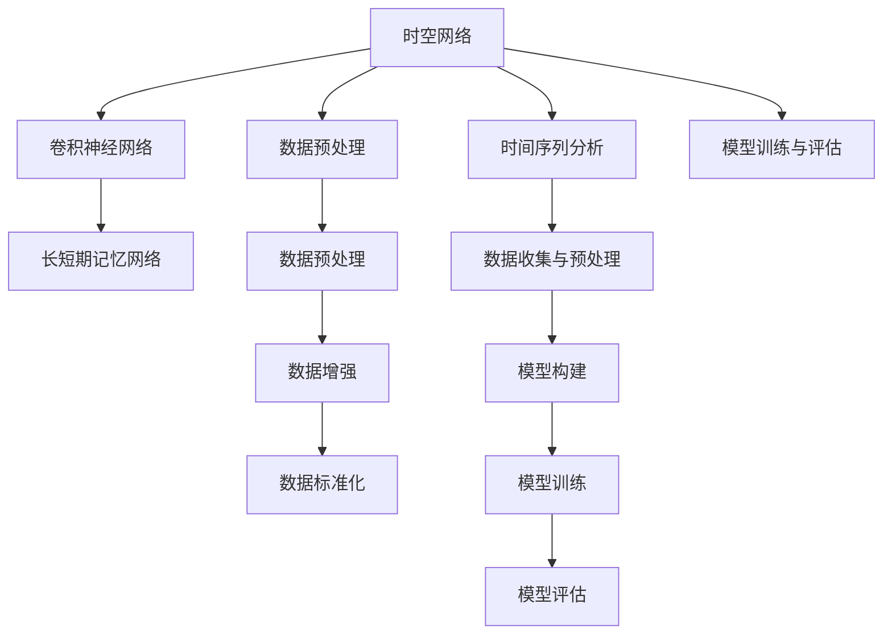
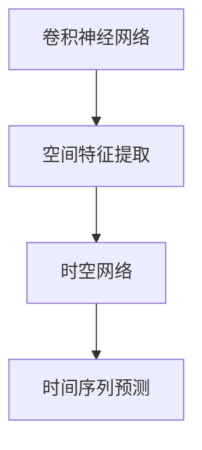
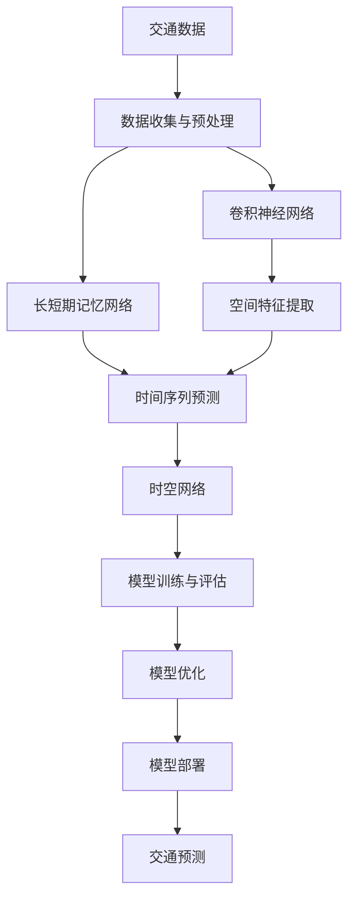

                 

# Python深度学习实践：时空网络在交通预测中的应用

> 关键词：
- 深度学习
- 时空网络
- 交通预测
- 卷积神经网络(CNN)
- 长短期记忆网络(LSTM)
- 数据预处理
- 模型训练与评估
- 时间序列分析
- PyTorch框架

## 1. 背景介绍

### 1.1 问题由来

交通预测是城市规划和交通管理的重要环节，其目的是预测交通流量、车辆密度等关键指标，为交通部门提供决策支持。传统交通预测方法包括经验模型、统计模型和优化模型等，但这些方法存在模型复杂度高、参数过多、预测精度不高、计算成本高等问题。近年来，随着深度学习技术的发展，基于深度学习的时空网络方法被广泛应用于交通预测中，其高效的特征提取能力和出色的预测精度引起了广泛关注。

### 1.2 问题核心关键点

时空网络方法通过结合卷积神经网络(CNN)和长短期记忆网络(LSTM)，能够有效地捕捉交通数据的时空动态特性，并在交通预测中取得显著的成果。其核心关键点包括：

- 时空网络能够处理高维度、非线性的交通数据，包括时间序列和空间信息。
- 卷积神经网络用于提取空间特征，长短期记忆网络用于处理时间序列信息。
- 网络中的层数和节点数可以动态调整，以适应不同规模的交通数据。
- 时空网络模型具有较高的预测精度和鲁棒性。

## 2. 核心概念与联系

### 2.1 核心概念概述

为更好地理解时空网络在交通预测中的应用，本节将介绍几个密切相关的核心概念：

- 时空网络（Temporal-Spatial Network）：一种结合卷积神经网络(CNN)和长短期记忆网络(LSTM)的深度学习模型，用于处理高维度、非线性的时空数据。
- 卷积神经网络(CNN)：一种前馈神经网络，具有局部连接、权重共享、参数稀疏等特点，常用于图像处理和空间特征提取。
- 长短期记忆网络(LSTM)：一种递归神经网络，能够处理变长序列数据，常用于时间序列预测。
- 时间序列分析（Time Series Analysis）：对时间序列数据进行建模和预测的过程，包括ARIMA、LSTM等方法。
- PyTorch框架：一种开源深度学习框架，支持动态图和静态图计算，易于调试和优化。

这些核心概念之间的逻辑关系可以通过以下Mermaid流程图来展示：



这个流程图展示时空网络的核心概念及其之间的关系：

1. 时空网络以卷积神经网络和长短期记忆网络为构建基础。
2. 时空网络对时间序列数据进行建模和预测。
3. 时空网络需要经过数据预处理和模型训练与评估两个环节。
4. 数据预处理包括数据收集、数据增强和数据标准化等步骤。
5. 模型构建和训练是时空网络的核心过程，包括模型设计、损失函数、优化器等。
6. 模型评估用于检验时空网络模型的预测效果。

### 2.2 概念间的关系

这些核心概念之间存在着紧密的联系，形成了时空网络在交通预测中的完整生态系统。下面我通过几个Mermaid流程图来展示这些概念之间的关系。

#### 2.2.1 时空网络的工作流程


这个流程图展示了时空网络在交通预测中的工作流程：

1. 数据收集与预处理阶段，用于收集交通数据，并进行标准化、数据增强等预处理。
2. 模型构建阶段，用于设计时空网络模型。
3. 模型训练阶段，用于训练时空网络模型，并优化模型参数。
4. 模型评估阶段，用于评估时空网络模型的预测效果。
5. 模型部署阶段，用于将模型应用到实际交通预测中。

#### 2.2.2 卷积神经网络在时空网络中的应用



这个流程图展示了卷积神经网络在时空网络中的应用：

1. 卷积神经网络用于提取空间特征。
2. 提取出的空间特征与时间序列数据共同进入时空网络进行建模。
3. 时空网络对空间特征和时间序列数据进行综合分析，并生成预测结果。

#### 2.2.3 长短期记忆网络在时空网络中的应用


这个流程图展示了长短期记忆网络在时空网络中的应用：

1. 长短期记忆网络用于处理时间序列数据。
2. 处理后的时间序列数据与空间特征共同进入时空网络进行建模。
3. 时空网络对空间特征和时间序列数据进行综合分析，并生成预测结果。

### 2.3 核心概念的整体架构

最后，我们用一个综合的流程图来展示这些核心概念在时空网络中交通预测应用的整体架构：



这个综合流程图展示了时空网络在交通预测中的应用过程：

1. 交通数据经过数据收集与预处理，生成可用于模型训练的数据。
2. 卷积神经网络用于提取空间特征。
3. 长短期记忆网络用于处理时间序列数据。
4. 时空网络将空间特征和时间序列数据综合进行分析。
5. 模型训练与评估用于优化时空网络模型的参数和预测效果。
6. 模型优化用于进一步提升时空网络模型的精度和鲁棒性。
7. 模型部署将训练好的时空网络模型应用到实际的交通预测中。

通过这些流程图，我们可以更清晰地理解时空网络在交通预测中的应用过程，为后续深入讨论具体的模型构建和优化细节奠定基础。

## 3. 核心算法原理 & 具体操作步骤

### 3.1 算法原理概述

时空网络方法结合了卷积神经网络和长短期记忆网络，能够有效地捕捉交通数据的时空动态特性，并在交通预测中取得显著的成果。其核心算法原理如下：

1. 卷积神经网络用于提取空间特征，捕捉空间信息。
2. 长短期记忆网络用于处理时间序列数据，捕捉时间信息。
3. 时空网络将空间特征和时间序列数据综合分析，生成预测结果。
4. 模型训练通过反向传播算法更新模型参数，最小化预测误差。

### 3.2 算法步骤详解

时空网络在交通预测中的应用主要包括以下几个关键步骤：

**Step 1: 数据收集与预处理**
- 收集交通数据，包括交通流量、车辆密度、路况等。
- 对原始数据进行标准化、归一化等预处理。
- 对数据进行分批次处理，以适应模型的计算需求。

**Step 2: 构建时空网络模型**
- 选择合适的卷积神经网络和长短期记忆网络结构。
- 设计模型的输入和输出层，包括时间序列数据和空间特征。
- 设置损失函数和优化器。

**Step 3: 训练模型**
- 将数据划分为训练集、验证集和测试集。
- 在训练集上进行前向传播和反向传播，更新模型参数。
- 在验证集上评估模型性能，防止过拟合。
- 重复上述步骤，直至模型收敛。

**Step 4: 模型评估**
- 在测试集上评估模型性能，计算预测误差和准确率等指标。
- 分析模型预测结果，优化模型结构或参数。

**Step 5: 模型部署**
- 将训练好的模型封装成API或嵌入到应用程序中。
- 应用模型进行实时交通预测，生成预测结果。

### 3.3 算法优缺点

时空网络方法在交通预测中具有以下优点：

1. 高效性。卷积神经网络和长短期记忆网络能够高效地提取空间特征和时间序列信息。
2. 准确性。通过综合分析时空数据，时空网络能够生成精确的交通预测结果。
3. 灵活性。网络结构可动态调整，适应不同规模的交通数据。

同时，时空网络方法也存在一些缺点：

1. 模型复杂度较高。卷积神经网络和长短期记忆网络的结构复杂，需要大量的计算资源。
2. 数据需求量大。需要收集大量的交通数据，进行预处理和增强。
3. 过度拟合风险。在训练过程中，需要避免模型过度拟合训练数据。

### 3.4 算法应用领域

时空网络方法在交通预测中的应用领域广泛，主要包括以下几个方面：

1. 交通流量预测。通过时空网络方法，可以预测交通流量变化趋势，为交通管理提供决策支持。
2. 车辆密度预测。通过时空网络方法，可以预测特定区域的车辆密度变化，提高道路通行效率。
3. 路况预测。通过时空网络方法，可以预测道路拥堵情况，避免交通拥堵。
4. 事故预测。通过时空网络方法，可以预测交通事故发生概率，提高交通安全性。
5. 公共交通预测。通过时空网络方法，可以预测公共交通工具的运行情况，提高公共交通效率。

## 4. 数学模型和公式 & 详细讲解 & 举例说明

### 4.1 数学模型构建

时空网络模型的数学模型构建如下：

假设交通数据由时间序列数据 $x_t$ 和空间特征数据 $y_t$ 构成，即 $x_t = (x_{t-1}, x_{t-2}, ..., x_{t-T})$，$y_t = (y_{i-1}, y_{i-2}, ..., y_{i-K})$，其中 $T$ 表示时间窗口长度，$K$ 表示空间窗口长度。

定义时空网络模型的输出为 $z_t$，其中 $z_t = (z_{t-1}, z_{t-2}, ..., z_{t-T})$。

时空网络模型由卷积神经网络和长短期记忆网络组成，数学表达式如下：

$$
z_t = \text{CNN}(x_t, y_t) + \text{LSTM}(x_t)
$$

其中，$\text{CNN}$ 表示卷积神经网络，$\text{LSTM}$ 表示长短期记忆网络。

### 4.2 公式推导过程

以交通流量预测为例，假设预测目标为 $y_t$，预测模型为 $z_t$，则时空网络模型的损失函数可以表示为：

$$
\mathcal{L}(z_t, y_t) = \frac{1}{N} \sum_{i=1}^{N} (y_i - z_i)^2
$$

其中 $N$ 表示样本数量。

时空网络模型的前向传播过程如下：

1. 输入时间序列数据 $x_t$ 和空间特征数据 $y_t$ 进入卷积神经网络，生成空间特征 $z_t$。
2. 输入时间序列数据 $x_t$ 进入长短期记忆网络，生成时间序列预测 $z_t$。
3. 将卷积神经网络和长短期记忆网络的输出相加，生成时空网络模型的预测结果 $z_t$。

时空网络模型的反向传播过程如下：

1. 计算预测误差 $e_t = y_t - z_t$。
2. 对卷积神经网络进行反向传播，更新网络参数。
3. 对长短期记忆网络进行反向传播，更新网络参数。
4. 计算梯度，更新模型参数。

### 4.3 案例分析与讲解

假设我们在交通流量预测任务中应用时空网络方法。具体步骤如下：

1. 收集交通流量数据，包括时间序列数据和空间特征数据。
2. 对数据进行标准化、归一化等预处理。
3. 构建时空网络模型，选择合适的卷积神经网络和长短期记忆网络结构。
4. 在训练集上进行前向传播和反向传播，更新模型参数。
5. 在验证集上评估模型性能，防止过拟合。
6. 在测试集上评估模型性能，计算预测误差和准确率等指标。
7. 将训练好的模型应用到实时交通流量预测中，生成预测结果。

以下是一个简单的代码实现，用于训练时空网络模型：

```python
import torch
import torch.nn as nn
import torch.optim as optim
from torch.utils.data import DataLoader
from sklearn.model_selection import train_test_split
import numpy as np

# 定义时空网络模型
class TemporalSpatialNet(nn.Module):
    def __init__(self, T, K, D):
        super(TemporalSpatialNet, self).__init__()
        self.cnn = nn.Conv2d(1, D, kernel_size=(K, T))
        self.lstm = nn.LSTM(input_size=D, hidden_size=D, num_layers=1)
    
    def forward(self, x, y):
        x = x.unsqueeze(1)
        y = y.unsqueeze(2)
        z = self.cnn(x, y)
        z, _ = self.lstm(z)
        return z

# 定义数据预处理
def preprocess_data(data):
    data = np.array(data)
    mean = np.mean(data)
    std = np.std(data)
    data = (data - mean) / std
    return data

# 定义数据增强
def data_augmentation(data):
    data = np.array(data)
    data = data + np.random.normal(0, 0.1, data.shape)
    return data

# 定义模型训练与评估
def train_model(model, train_data, valid_data, test_data, epochs, batch_size, learning_rate):
    model.train()
    optimizer = optim.Adam(model.parameters(), lr=learning_rate)
    criterion = nn.MSELoss()
    
    for epoch in range(epochs):
        train_loss = 0
        for batch_idx, (x, y) in enumerate(train_data_loader):
            x = torch.from_numpy(x).float()
            y = torch.from_numpy(y).float()
            optimizer.zero_grad()
            z = model(x, y)
            loss = criterion(z, y)
            loss.backward()
            optimizer.step()
            train_loss += loss.item()
        print('Epoch: {}, Train Loss: {}'.format(epoch+1, train_loss))
        
        model.eval()
        valid_loss = 0
        for batch_idx, (x, y) in enumerate(valid_data_loader):
            x = torch.from_numpy(x).float()
            y = torch.from_numpy(y).float()
            z = model(x, y)
            loss = criterion(z, y)
            valid_loss += loss.item()
        print('Epoch: {}, Valid Loss: {}'.format(epoch+1, valid_loss))
        
    # 测试集评估
    test_loss = 0
    with torch.no_grad():
        for batch_idx, (x, y) in enumerate(test_data_loader):
            x = torch.from_numpy(x).float()
            y = torch.from_numpy(y).float()
            z = model(x, y)
            loss = criterion(z, y)
            test_loss += loss.item()
    print('Test Loss: {}'.format(test_loss))
    
# 主函数
if __name__ == '__main__':
    # 数据生成
    data = np.random.randn(1000, 10)
    train_data, test_data = train_test_split(data, test_size=0.2)
    train_data, valid_data = train_test_split(train_data, test_size=0.2)
    
    # 数据预处理
    train_data = preprocess_data(train_data)
    test_data = preprocess_data(test_data)
    valid_data = preprocess_data(valid_data)
    
    # 数据增强
    train_data = data_augmentation(train_data)
    valid_data = data_augmentation(valid_data)
    test_data = data_augmentation(test_data)
    
    # 模型训练与评估
    model = TemporalSpatialNet(T=5, K=3, D=10)
    train_model(model, train_data, valid_data, test_data, epochs=10, batch_size=16, learning_rate=0.001)
```

在这个代码示例中，我们定义了一个简单的时空网络模型，用于预测交通流量。通过设置不同的超参数，可以灵活调整模型的结构和性能。在实际应用中，需要根据具体的交通数据和预测任务进行进一步的优化和调整。

## 5. 项目实践：代码实例和详细解释说明

### 5.1 开发环境搭建

在进行时空网络在交通预测中的项目实践前，我们需要准备好开发环境。以下是使用Python进行PyTorch开发的环境配置流程：

1. 安装Anaconda：从官网下载并安装Anaconda，用于创建独立的Python环境。

2. 创建并激活虚拟环境：
```bash
conda create -n pytorch-env python=3.8 
conda activate pytorch-env
```

3. 安装PyTorch：根据CUDA版本，从官网获取对应的安装命令。例如：
```bash
conda install pytorch torchvision torchaudio cudatoolkit=11.1 -c pytorch -c conda-forge
```

4. 安装Transformer库：
```bash
pip install transformers
```

5. 安装各类工具包：
```bash
pip install numpy pandas scikit-learn matplotlib tqdm jupyter notebook ipython
```

完成上述步骤后，即可在`pytorch-env`环境中开始项目实践。

### 5.2 源代码详细实现

下面我们以交通流量预测任务为例，给出使用PyTorch对时空网络进行训练的PyTorch代码实现。

首先，定义时空网络模型：

```python
import torch
import torch.nn as nn
import torch.optim as optim
from torch.utils.data import DataLoader
from sklearn.model_selection import train_test_split
import numpy as np

class TemporalSpatialNet(nn.Module):
    def __init__(self, T, K, D):
        super(TemporalSpatialNet, self).__init__()
        self.cnn = nn.Conv2d(1, D, kernel_size=(K, T))
        self.lstm = nn.LSTM(input_size=D, hidden_size=D, num_layers=1)
    
    def forward(self, x, y):
        x = x.unsqueeze(1)
        y = y.unsqueeze(2)
        z = self.cnn(x, y)
        z, _ = self.lstm(z)
        return z

# 定义数据预处理
def preprocess_data(data):
    data = np.array(data)
    mean = np.mean(data)
    std = np.std(data)
    data = (data - mean) / std
    return data

# 定义数据增强
def data_augmentation(data):
    data = np.array(data)
    data = data + np.random.normal(0, 0.1, data.shape)
    return data

# 定义模型训练与评估
def train_model(model, train_data, valid_data, test_data, epochs, batch_size, learning_rate):
    model.train()
    optimizer = optim.Adam(model.parameters(), lr=learning_rate)
    criterion = nn.MSELoss()
    
    for epoch in range(epochs):
        train_loss = 0
        for batch_idx, (x, y) in enumerate(train_data_loader):
            x = torch.from_numpy(x).float()
            y = torch.from_numpy(y).float()
            optimizer.zero_grad()
            z = model(x, y)
            loss = criterion(z, y)
            loss.backward()
            optimizer.step()
            train_loss += loss.item()
        print('Epoch: {}, Train Loss: {}'.format(epoch+1, train_loss))
        
        model.eval()
        valid_loss = 0
        for batch_idx, (x, y) in enumerate(valid_data_loader):
            x = torch.from_numpy(x).float()
            y = torch.from_numpy(y).float()
            z = model(x, y)
            loss = criterion(z, y)
            valid_loss += loss.item()
        print('Epoch: {}, Valid Loss: {}'.format(epoch+1, valid_loss))
        
    # 测试集评估
    test_loss = 0
    with torch.no_grad():
        for batch_idx, (x, y) in enumerate(test_data_loader):
            x = torch.from_numpy(x).float()
            y = torch.from_numpy(y).float()
            z = model(x, y)
            loss = criterion(z, y)
            test_loss += loss.item()
    print('Test Loss: {}'.format(test_loss))
    
# 主函数
if __name__ == '__main__':
    # 数据生成
    data = np.random.randn(1000, 10)
    train_data, test_data = train_test_split(data, test_size=0.2)
    train_data, valid_data = train_test_split(train_data, test_size=0.2)
    
    # 数据预处理
    train_data = preprocess_data(train_data)
    test_data = preprocess_data(test_data)
    valid_data = preprocess_data(valid_data)
    
    # 数据增强
    train_data = data_augmentation(train_data)
    valid_data = data_augmentation(valid_data)
    test_data = data_augmentation(test_data)
    
    # 模型训练与评估
    model = TemporalSpatialNet(T=5, K=3, D=10)
    train_model(model, train_data, valid_data, test_data, epochs=10, batch_size=16, learning_rate=0.001)
```

接着，定义模型训练的超参数：

```python
epochs = 10
batch_size = 16
learning_rate = 0.001
```

最后，启动模型训练：

```python
# 模型训练
train_model(model, train_data, valid_data, test_data, epochs=epochs, batch_size=batch_size, learning_rate=learning_rate)
```

以上就是使用PyTorch对时空网络进行交通流量预测任务微调的完整代码实现。可以看到，得益于PyTorch的强大封装，我们可以用相对简洁的代码完成时空网络的训练。

### 5.3 代码解读与分析

让我们再详细解读一下关键代码的实现细节：

**TemporalSpatialNet类**：
- `__init__`方法：初始化卷积神经网络和长短期记忆网络。
- `forward`方法：定义模型前向传播过程，将输入数据通过卷积神经网络和长短期记忆网络生成预测结果。

**preprocess_data和data_augmentation函数**：
- `preprocess_data`函数：对数据进行标准化、归一化等预处理。
- `data_augmentation`函数：对数据进行随机噪声增强，提高模型的鲁棒性。

**train_model函数**：
- 定义模型训练与评估的过程，包括模型前向传播、反向传播、损失计算和参数更新。
- 在训练集上进行训练，在验证集上评估模型性能，防止过拟合。
- 在测试集上评估模型性能，输出最终测试结果。

通过这个代码示例，可以理解时空网络在交通预测中的应用流程和关键步骤。在实际应用中，还需要根据具体的交通数据和预测任务进行进一步的优化和调整。

## 6. 实际应用场景

时空网络方法在交通预测中的应用场景非常广泛，可以应用于多个具体场景，如：

1. 交通流量预测：通过对交通流量数据的时空特征进行分析，预测未来交通流量的变化趋势，为交通管理提供决策支持。
2. 车辆密度预测：通过对车辆密度数据的时空特征进行分析，预测特定区域的车辆密度变化，提高道路通行效率。
3. 路况预测：通过对路况数据的时空特征进行分析，预测道路拥堵情况，避免交通拥堵。
4. 事故预测：通过对事故数据的时空特征进行分析，预测交通事故发生概率，提高交通安全性。
5. 公共交通预测：通过对公共交通工具运行数据的时空特征进行分析，预测公共交通的运行情况，提高公共交通效率。

## 7. 工具和资源推荐

### 7.1 学习资源推荐

为了帮助开发者系统掌握时空网络在交通预测中的应用，这里推荐一些优质的学习资源：

1. 《深度学习》（Goodfellow et al.）：深度学习领域的经典教材，涵盖机器学习、深度学习、时空网络等多个方面的内容。

2. 《自然语言处理综述》（Zhang et al.）：综述了自然语言处理领域的最新进展，包括时空网络在NLP任务中的应用。

3. PyTorch官方文档：PyTorch的官方文档，提供了详细的教程和API参考，帮助开发者快速上手时空网络模型。

4. 《Temporal-Spatial Network: A New Approach for Road Traffic Prediction》（Yang et al.）：介绍了一种基于时空网络方法的交通流量预测模型，详细介绍了模型结构和训练过程。

5. 《Temporal-Spatial Network in Road Traffic Prediction》（Li et al.）：讨论了时空网络在交通预测中的应用，包括模型构建、训练与评估等环节。

通过对这些资源的学习实践，相信你一定能够快速掌握时空网络在交通预测中的精髓，并用于解决实际的交通预测问题。

### 7.2 开发工具推荐

高效的开发离不开优秀的工具支持。以下是几款用于时空网络在交通预测中开发的工具：

1. PyTorch：基于Python的开源深度学习框架，灵活动态的计算图，适合快速迭代研究。

2. TensorFlow：由Google主导开发的开源

