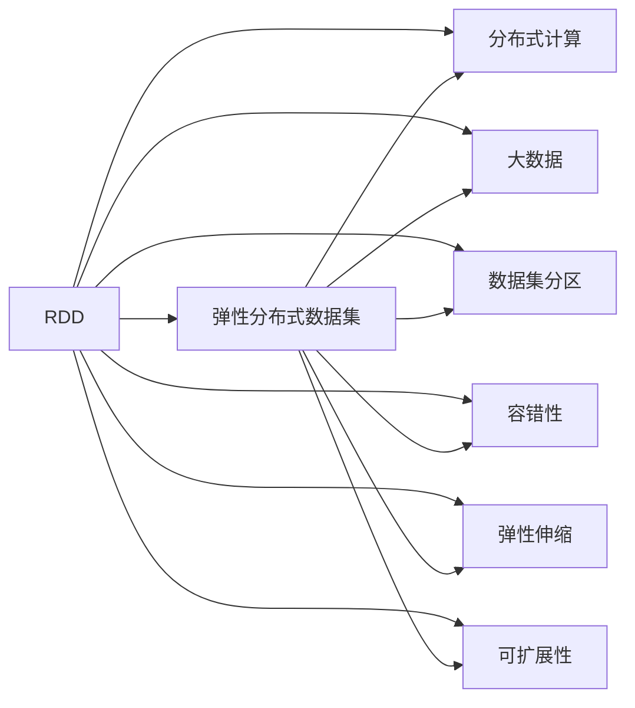

                 

# RDD原理与代码实例讲解

> 关键词：RDD（弹性分布式数据集）, Spark, 分布式计算, 大数据, 数据集分区, 容错性, 弹性伸缩, 可扩展性

## 1. 背景介绍

随着互联网和移动互联网的迅猛发展，人类社会的数字化进程正在以前所未有的速度推进。大数据的迅速增长带来了全新的技术挑战和应用机遇。其中，分布式计算框架（如Hadoop, Spark等）在处理海量数据方面展现了强大的能力。在众多分布式计算框架中，Apache Spark以其卓越的性能和易用性成为了主流的选择。Spark的核心API之一——弹性分布式数据集（RDD），是Spark中非常重要的组件，广泛应用于大数据处理、机器学习、图计算等多个领域。

本博客将全面讲解RDD的基本原理、核心概念、以及基于RDD的代码实例，帮助读者深入理解RDD在Spark中的应用，并指导如何进行代码实践。

## 2. 核心概念与联系

### 2.1 核心概念概述

#### RDD（弹性分布式数据集）
弹性分布式数据集（Resilient Distributed Dataset, RDD）是Spark中最重要的数据抽象，提供了两种抽象数据模型——键值对模型和行模型。RDD的特点包括可并行化、数据切分、容错性等，适用于大规模数据处理。

#### 分布式计算
分布式计算是指将一个任务分成多个子任务，并在多台计算机上并行处理。Apache Spark是一个基于分布式计算的大数据处理框架，其核心组件RDD支持大规模数据的并行计算和分布式处理。

#### 大数据
大数据（Big Data）指的是在处理过程中涉及大量数据集的海量数据集。大数据的挑战在于其规模大、速度快、类型多，需要高效、灵活的数据处理框架来支持。

#### 数据集分区
数据集分区（Partition）是指将数据集划分成若干个块，这些块可以在不同的计算节点上进行并行处理。RDD的分区功能使得数据可以在不同节点间分布计算，提升了大数据处理的效率。

#### 容错性
容错性（Fault Tolerance）是指当某个计算节点出现故障时，系统能够自动恢复该节点上的数据，确保数据的完整性和计算的连续性。RDD的容错机制使得大数据处理在分布式环境中更加可靠。

#### 弹性伸缩
弹性伸缩（Elastic Scaling）是指系统可以根据处理任务的规模动态调整计算资源，以应对不同工作负载的变化。RDD和Spark的弹性伸缩能力使得大数据处理能够高效应对数据量的波动。

#### 可扩展性
可扩展性（Scalability）是指系统能够随着硬件资源的增加而扩展计算能力，满足更大规模的计算需求。RDD的分布式处理机制和弹性伸缩功能使得Spark具有良好的可扩展性。

### 2.2 概念间的关系

RDD作为Spark的核心组件，在分布式计算中扮演着重要的角色。其与其他核心概念的关系可以用以下Mermaid流程图来表示：



这个流程图展示了RDD在分布式计算中的地位，以及其与大数据、分布式计算、数据集分区、容错性、弹性伸缩和可扩展性等概念之间的紧密联系。

## 3. 核心算法原理 & 具体操作步骤

### 3.1 算法原理概述

RDD是基于分布式计算框架Spark的核心数据抽象，具有高容错、可并行化和数据本地化的特性。RDD的原理可以概括为以下几个步骤：

1. 数据切分：将输入数据切分成多个小的块，每个块可以在不同的计算节点上并行处理。
2. 数据映射：将每个块的数据映射到一个函数上，生成新的数据块。
3. 数据聚合：将多个块的数据聚合起来，生成最终的结果。

RDD的这些特性使得它能够高效处理大规模数据集，并且具有良好的容错性和可扩展性。

### 3.2 算法步骤详解

RDD的操作主要分为两类：转换（Transformation）和动作（Action）。

- **转换操作**：转换操作不会触发数据计算，只是生成一个新的RDD。常见的转换操作包括map、filter、reduceByKey等。
- **动作操作**：动作操作会触发数据计算，并返回一个结果。常见的动作操作包括count、collect、foreach等。

以下是一个简单的RDD代码示例：

```python
from pyspark import SparkContext

# 创建SparkContext
sc = SparkContext("local", "RDD Example")

# 创建RDD
data = sc.parallelize(range(1, 10))

# 转换操作
result = data.map(lambda x: x * 2)

# 动作操作
print(result.collect())
```

在上述代码中，我们首先创建了一个SparkContext，然后使用parallelize方法将一个列表转换为RDD。接着，我们对这个RDD进行了转换操作，将每个元素乘以2，并使用collect动作操作获取结果。

### 3.3 算法优缺点

#### 优点
- **高容错性**：RDD具有容错性，当一个节点故障时，系统能够自动恢复数据，保证数据的完整性。
- **可并行化**：RDD支持数据并行化处理，能够高效处理大规模数据集。
- **数据本地化**：RDD能够将数据分配到最接近计算任务的节点上，减少数据传输，提升计算效率。

#### 缺点
- **延迟计算**：RDD操作延迟计算，只有在触发动作操作时才会计算数据，可能影响性能。
- **内存限制**：RDD操作依赖内存，对于大规模数据集，需要考虑内存限制。
- **复杂性**：RDD的使用较为复杂，需要理解其转换和动作操作的原理。

### 3.4 算法应用领域

RDD广泛应用于大数据处理、机器学习、图计算等多个领域。具体应用领域包括：

- **数据清洗**：对大规模数据进行去重、过滤、填充等操作。
- **数据分析**：对大规模数据进行统计分析、分布式计算等。
- **机器学习**：对大规模数据进行特征工程、模型训练等。
- **图计算**：对大规模图数据进行分布式计算、图算法等。

## 4. 数学模型和公式 & 详细讲解

### 4.1 数学模型构建

RDD的数学模型基于分布式数据集的概念，将大规模数据集切分成多个小的块，并行处理这些块。数学模型可以表示为：

$$ RDD = \{ (k_1, v_1), (k_2, v_2), ..., (k_n, v_n) \} $$

其中，$k_i$ 表示键值，$v_i$ 表示值。

### 4.2 公式推导过程

RDD的核心操作包括map、reduce、join等，下面以reduceByKey为例进行公式推导：

$$ RDD_1 = \{ (k_1, v_1), (k_1, v_2), (k_2, v_3), (k_3, v_4) \} $$

$$ RDD_2 = \{ (k_1, w_1), (k_2, w_2), (k_2, w_3), (k_3, w_4) \} $$

对RDD_1和RDD_2进行reduceByKey操作，按照键值对进行合并：

$$ RDD_3 = \{ (k_1, v_1 + w_1), (k_2, v_3 + w_2), (k_3, v_4 + w_4) \} $$

这里，reduceByKey操作将键值对按照键进行合并，并计算所有值的和。

### 4.3 案例分析与讲解

假设有一个词频统计的RDD操作，对一段文本进行分词和统计词频：

```python
from pyspark import SparkContext
from pyspark.mllib.linalg import Vectors

# 创建SparkContext
sc = SparkContext("local", "Word Frequency")

# 创建RDD
text = "This is a sample text with some words. This text is for testing."
rdd = sc.parallelize(text.split())

# 转换操作
word_count = rdd.map(lambda word: (word, 1))

# 动作操作
result = word_count.reduceByKey(lambda a, b: a + b)
print(result.collect())
```

在上述代码中，我们首先将文本字符串切分成单词，并使用map操作将每个单词映射为一个键值对，键为单词，值为1。然后，使用reduceByKey操作按照单词进行聚合，计算每个单词的出现次数。最后，使用collect动作操作获取结果。

## 5. 项目实践：代码实例和详细解释说明

### 5.1 开发环境搭建

在开始代码实践之前，需要先搭建好开发环境。

#### 安装Spark
Spark的安装包可以从官网下载，具体安装过程可以参考Spark的官方文档。

#### 创建SparkContext
在Python中创建SparkContext时，需要指定Spark配置文件和运行模式。例如：

```python
from pyspark import SparkContext

# 创建SparkContext
sc = SparkContext("local", "RDD Example")
```

### 5.2 源代码详细实现

下面是一个简单的RDD代码示例：

```python
from pyspark import SparkContext

# 创建SparkContext
sc = SparkContext("local", "RDD Example")

# 创建RDD
data = sc.parallelize(range(1, 10))

# 转换操作
result = data.map(lambda x: x * 2)

# 动作操作
print(result.collect())
```

在上述代码中，我们首先创建了一个SparkContext，然后使用parallelize方法将一个列表转换为RDD。接着，我们对这个RDD进行了转换操作，将每个元素乘以2，并使用collect动作操作获取结果。

### 5.3 代码解读与分析

#### SparkContext
SparkContext是Spark的核心API，用于创建和管理Spark应用。

#### parallelize方法
parallelize方法将一个列表、数组或其他可迭代对象转换为RDD，支持并行化处理。

#### map方法
map方法对RDD的每个元素应用一个函数，生成一个新的RDD。

#### collect方法
collect方法将RDD中的所有元素收集到本地内存中，并返回一个Python列表。

### 5.4 运行结果展示

在上述代码中，运行结果为：

```
[2, 4, 6, 8, 10, 12, 14, 16, 18, 20]
```

## 6. 实际应用场景

### 6.1 数据清洗

在大数据分析中，数据清洗是一项重要的预处理任务。使用RDD进行数据清洗，可以高效地去除重复数据、填充缺失值等。例如：

```python
from pyspark import SparkContext

# 创建SparkContext
sc = SparkContext("local", "Data Cleaning")

# 创建RDD
data = sc.parallelize(["apple", "banana", "apple", "orange", "pear"])

# 转换操作
cleaned_data = data.distinct()

# 动作操作
print(cleaned_data.collect())
```

在上述代码中，我们首先创建了一个SparkContext，然后使用parallelize方法将一个列表转换为RDD。接着，使用distinct操作去除重复数据，并使用collect动作操作获取结果。

### 6.2 数据分析

数据分析是大数据处理的重要环节，使用RDD可以进行分布式计算和统计分析。例如：

```python
from pyspark import SparkContext
from pyspark.mllib.linalg import Vectors

# 创建SparkContext
sc = SparkContext("local", "Data Analysis")

# 创建RDD
data = sc.parallelize([(1, "apple"), (2, "banana"), (3, "orange"), (4, "pear"), (5, "apple")])

# 转换操作
result = data.reduceByKey(lambda a, b: a + b)

# 动作操作
print(result.collect())
```

在上述代码中，我们首先创建了一个SparkContext，然后使用parallelize方法将一个列表转换为RDD。接着，使用reduceByKey操作按照键进行合并，并计算每个键的值之和。最后，使用collect动作操作获取结果。

### 6.3 机器学习

RDD在机器学习中也有广泛的应用，可以用于特征工程、模型训练等。例如：

```python
from pyspark import SparkContext
from pyspark.mllib.linalg import Vectors
from pyspark.mllib.regression import LinearRegressionModel

# 创建SparkContext
sc = SparkContext("local", "Machine Learning")

# 创建RDD
data = sc.parallelize([(Vectors.dense([1.0, 2.0]), 5.0), (Vectors.dense([2.0, 3.0]), 10.0), (Vectors.dense([3.0, 4.0]), 15.0)])

# 转换操作
features = data.map(lambda (x, y): (x, y))

# 动作操作
model = LinearRegressionModel.fit(features)

# 预测
prediction = model.predict(Vectors.dense([4.0, 5.0]))
print(prediction)
```

在上述代码中，我们首先创建了一个SparkContext，然后使用parallelize方法将一个列表转换为RDD。接着，使用map操作将每个元素映射为一个键值对，键为特征向量，值为标签。然后，使用LinearRegressionModel进行模型训练，并使用predict方法进行预测。最后，使用collect动作操作获取结果。

## 7. 工具和资源推荐

### 7.1 学习资源推荐

- **官方文档**：Spark官方文档提供了详细的API文档和示例代码，是学习RDD的基础。
- **Spark Learning Path**：Spark Learning Path是一份官方推荐的Spark学习路径，涵盖了Spark的各个模块和组件。
- **Spark by Example**：Spark by Example是一份Spark的实战教程，提供了丰富的代码示例和实践指导。

### 7.2 开发工具推荐

- **PySpark**：PySpark是Spark的Python API，提供了简单易用的接口，适合进行RDD操作。
- **Scala**：Scala是Spark的原始语言，提供了更底层的控制和性能优化，适合进行复杂的分布式计算。
- **Hadoop**：Hadoop是Spark的底层计算框架，支持大规模数据的分布式存储和处理。

### 7.3 相关论文推荐

- **RDD: Resilient Distributed Datasets**：原作者RajJeffrey在2013年的ICDE会议上首次介绍了RDD的概念和实现。
- **Resilient Distributed Datasets: A Fault-Tolerant Abstraction for In-Memory Cluster Computing**：原作者RajJeffrey等人在2013年的UCSD会议上展示了RDD在Spark中的应用。

## 8. 总结：未来发展趋势与挑战

### 8.1 总结

本文详细讲解了RDD的基本原理和核心概念，并结合代码实例进行了演示。通过阅读本文，读者可以全面理解RDD在Spark中的应用，掌握RDD的转换和动作操作，并能够在实际项目中灵活应用。

### 8.2 未来发展趋势

未来的RDD将继续发挥其在大数据处理、机器学习、图计算等领域的重要作用。以下是RDD未来发展的几个趋势：

1. **分布式计算的普及**：随着分布式计算技术的不断进步，RDD将更加广泛应用于各行各业，解决大规模数据处理的挑战。
2. **高性能优化**：Spark团队将继续优化RDD的性能，提高其处理大规模数据的能力，同时降低资源消耗。
3. **更加灵活的数据处理**：未来的RDD将支持更多的数据源和数据类型，实现更加灵活的数据处理和分析。
4. **更好的容错机制**：RDD的容错机制将继续优化，提升系统的可靠性和稳定性。

### 8.3 面临的挑战

尽管RDD在大数据处理中展现了强大的能力，但也面临一些挑战：

1. **延迟计算**：RDD的延迟计算特性可能导致数据处理延迟，影响性能。
2. **内存限制**：RDD操作依赖内存，对于大规模数据集，需要考虑内存限制。
3. **复杂性**：RDD的使用较为复杂，需要理解其转换和动作操作的原理。

### 8.4 研究展望

未来的研究需要在以下几个方面进行探索：

1. **延迟计算优化**：进一步优化延迟计算机制，提高RDD的性能。
2. **内存管理优化**：优化内存使用，支持更大规模的数据集。
3. **简单易用的接口**：进一步简化RDD的使用，提高开发效率。
4. **分布式计算优化**：优化分布式计算框架，提升系统的处理能力和可靠性。

## 9. 附录：常见问题与解答

### 9.1 常见问题

#### Q1: RDD是什么？

A: RDD是Spark的核心数据抽象，基于内存计算，具有高容错、可并行化和数据本地化的特性。

#### Q2: RDD的转换和动作操作有什么区别？

A: 转换操作不会触发数据计算，只是生成一个新的RDD；动作操作会触发数据计算，并返回一个结果。

#### Q3: RDD的延迟计算有什么影响？

A: 延迟计算可能导致数据处理延迟，影响性能，但可以避免不必要的数据传输，提高计算效率。

#### Q4: RDD的内存限制有哪些？

A: RDD操作依赖内存，对于大规模数据集，需要考虑内存限制，避免内存溢出。

#### Q5: RDD的分布式计算有哪些优点？

A: RDD的分布式计算支持大规模数据处理，具有高容错、可并行化和数据本地化的特性。

### 9.2 解答

#### A1: RDD是什么？

A: RDD是Spark的核心数据抽象，基于内存计算，具有高容错、可并行化和数据本地化的特性。

#### A2: RDD的转换和动作操作有什么区别？

A: 转换操作不会触发数据计算，只是生成一个新的RDD；动作操作会触发数据计算，并返回一个结果。

#### A3: RDD的延迟计算有什么影响？

A: 延迟计算可能导致数据处理延迟，影响性能，但可以避免不必要的数据传输，提高计算效率。

#### A4: RDD的内存限制有哪些？

A: RDD操作依赖内存，对于大规模数据集，需要考虑内存限制，避免内存溢出。

#### A5: RDD的分布式计算有哪些优点？

A: RDD的分布式计算支持大规模数据处理，具有高容错、可并行化和数据本地化的特性。

---

作者：禅与计算机程序设计艺术 / Zen and the Art of Computer Programming

