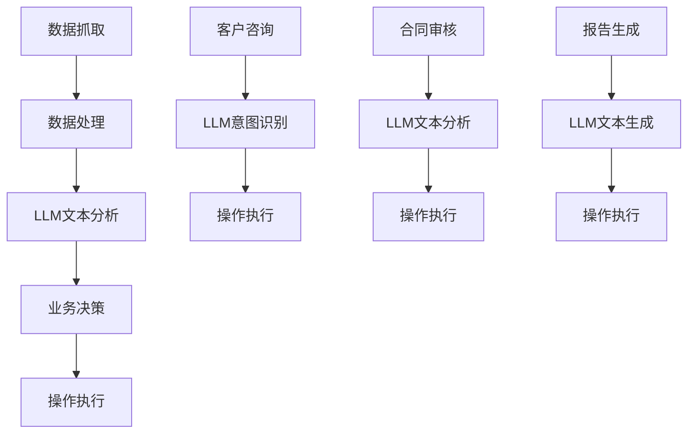

                 

# RPA 与 LLM 的结合

> 关键词：机器人流程自动化, 大语言模型, 自动化任务, 文本处理, 业务流程, 协同应用

## 1. 背景介绍

在人工智能(AI)领域，机器人流程自动化(Robot Process Automation, RPA)和大语言模型(Large Language Model, LLM)是两个独立却又相辅相成的技术领域。RPA主要用于自动化重复性高、规律性强的工作流程，如数据录入、报表生成、客服交互等。而LLM则专注于理解和处理复杂的自然语言文本，能够实现文本分类、情感分析、翻译、摘要生成等多种自然语言处理任务。

近年来，随着AI技术的不断发展，越来越多的企业和机构开始探索将RPA与LLM相结合的解决方案，以期进一步提升业务流程的自动化水平和智能化程度。本文将详细介绍RPA和LLM的结合原理、操作步骤，并探讨其应用场景及面临的挑战。

## 2. 核心概念与联系

### 2.1 核心概念概述

**RPA**: 一种通过模拟人类在计算机上的操作步骤，自动完成重复性、结构化工作的技术。RPA通常由以下几个部分组成：
- **机器人**: 执行具体任务的自动化工具。
- **流程设计器**: 用于定义和设计自动化流程的工具。
- **活动库**: 提供预定义的活动(操作)，供机器人使用。

**LLM**: 一种能够理解和生成自然语言的深度学习模型，基于大规模无标签文本数据的自监督预训练。常见的LLM模型包括BERT、GPT、T5等。

### 2.2 核心概念的联系

RPA与LLM的结合，主要体现在以下几个方面：
1. **数据处理**: LLM可以用于自动化处理和理解结构化数据，如文本分类、数据清洗等。RPA可以自动抓取和传递数据，将LLM的输出应用到具体的业务流程中。
2. **业务决策**: LLM可以辅助RPA进行复杂的决策，如情感分析、意图识别、问题解答等。RPA可以根据LLM的分析结果，自动执行相应的操作。
3. **交互和沟通**: LLM可以处理复杂的自然语言文本，如客户咨询、客户服务、合同审核等。RPA可以自动化处理这些文本的输入和输出，提升用户交互体验。
4. **自动化报告**: LLM可以自动生成文本报告，如财务报表、业务分析报告等。RPA可以自动化生成和更新这些报告，简化数据处理和报告生成的流程。

这些联系通过一个简单的Mermaid流程图展示如下：



这个流程图展示了RPA与LLM在自动化业务流程中的主要作用和联系。

## 3. 核心算法原理 & 具体操作步骤

### 3.1 算法原理概述

RPA与LLM结合的算法原理主要基于两个模型的互补性：
1. **RPA**: 处理结构化和半结构化数据，具有高度的可解释性和可控性。
2. **LLM**: 处理非结构化数据，具有强大的语言理解和生成能力。

结合后的算法流程主要包括以下几个步骤：
1. **数据收集**: 使用RPA抓取和提取业务数据，并将其转换为LLM可处理的格式。
2. **文本分析**: 将数据输入LLM，进行文本分类、情感分析、意图识别等任务。
3. **业务决策**: 根据LLM的分析结果，进行业务决策，生成操作指令。
4. **操作执行**: 使用RPA执行操作指令，完成自动化任务。

### 3.2 算法步骤详解

**步骤 1: 数据收集**
使用RPA抓取业务数据，如客户信息、订单数据、报表等。将抓取的数据转换为LLM可处理的格式，如文本或表格。

**步骤 2: 文本分析**
将数据输入LLM模型，进行文本分类、情感分析、意图识别等任务。LLM的分析结果包括文本的类别、情感倾向、意图等。

**步骤 3: 业务决策**
根据LLM的分析结果，进行业务决策。例如，根据客户情感分析结果，自动回复客户的咨询，或根据合同审核结果，自动化执行合同处理流程。

**步骤 4: 操作执行**
使用RPA执行业务决策生成的操作指令。例如，根据LLM的分析结果，自动更新客户档案、生成报表、发送通知等。

### 3.3 算法优缺点

**优点**:
1. **效率提升**: RPA可以自动执行重复性、结构化的任务，显著提升业务流程的自动化程度。
2. **成本节约**: 减少人工操作，降低人力成本，提升业务运营效率。
3. **准确性提高**: LLM可以处理复杂的自然语言任务，减少人工错误，提高决策的准确性。
4. **灵活性增强**: 结合RPA和LLM的优势，能够处理更多样化的业务场景，提高系统的灵活性。

**缺点**:
1. **数据依赖**: RPA依赖于结构化和半结构化数据，对于非结构化数据的处理能力有限。
2. **复杂性增加**: 结合RPA和LLM的解决方案，系统架构和实现复杂性增加，需要更多技术支持和维护。
3. **性能瓶颈**: 当数据量过大或LLM模型复杂时，系统性能可能受限，需要考虑优化方案。
4. **技术门槛高**: 需要同时掌握RPA和LLM的技术，对技术人才的要求较高。

### 3.4 算法应用领域

RPA与LLM的结合已经在多个领域得到了广泛应用，例如：

**1. 客户服务**: 使用RPA抓取客户咨询信息，LLM进行意图识别和情感分析，自动回复客户咨询，提升客户体验。

**2. 财务报表**: 使用RPA抓取财务数据，LLM进行数据分类和清洗，自动生成财务报表和分析报告，简化财务处理流程。

**3. 合同审核**: 使用RPA抓取合同信息，LLM进行文本分析和审核，自动化执行合同处理流程，提升合同管理效率。

**4. 数据分析**: 使用RPA抓取数据，LLM进行文本分类和情感分析，自动化生成业务分析报告，提升数据驱动决策的能力。

**5. 业务流程自动化**: 使用RPA抓取和处理业务数据，LLM进行流程分析和决策，自动化执行业务流程，提升业务运营效率。

## 4. 数学模型和公式 & 详细讲解  
### 4.1 数学模型构建

**文本分析模型**: 
假设文本序列为 $x=\{x_1, x_2, ..., x_n\}$，其中 $x_i$ 表示文本中的第 $i$ 个单词或子词。定义文本分类任务的分类概率为 $p(y|x)$，其中 $y$ 为文本的分类标签。LLM模型的目标是最小化分类损失函数 $L_{\text{class}}$，即：
$$
L_{\text{class}} = -\frac{1}{N}\sum_{i=1}^N \log p(y_i|x_i)
$$

**业务决策模型**:
假设业务决策任务的输出为 $a$，根据LLM的分析结果 $p(a|x)$，定义业务决策损失函数 $L_{\text{decision}}$，即：
$$
L_{\text{decision}} = -\frac{1}{N}\sum_{i=1}^N \log p(a_i|x_i)
$$

### 4.2 公式推导过程

**文本分类公式推导**:
设 $x_i$ 为文本中的第 $i$ 个单词或子词，$y_i$ 为文本的分类标签。LLM模型的分类概率 $p(y_i|x_i)$ 可以通过softmax函数计算得到：
$$
p(y_i|x_i) = \frac{\exp(Q(y_i; x_i))}{\sum_k \exp(Q(y_k; x_i))}
$$
其中 $Q(y_i; x_i)$ 为模型在输入 $x_i$ 下预测为 $y_i$ 的向量表示。

**业务决策公式推导**:
设 $a_i$ 为第 $i$ 个任务的操作指令，LLM模型的业务决策概率 $p(a_i|x_i)$ 同样可以通过softmax函数计算得到：
$$
p(a_i|x_i) = \frac{\exp(Q(a_i; x_i))}{\sum_k \exp(Q(a_k; x_i))}
$$
其中 $Q(a_i; x_i)$ 为模型在输入 $x_i$ 下预测为 $a_i$ 的向量表示。

### 4.3 案例分析与讲解

**案例分析**:
假设某金融机构需要自动化处理客户投诉，首先需要使用RPA抓取客户投诉信息，然后LLM进行情感分析和意图识别。假设LLM模型已经训练完成，我们可以将其部署到服务器，并使用RPA抓取数据：

```python
# 抓取客户投诉信息
def fetch_complaints():
    # RPA抓取客户投诉数据
    complaints = rpa.fetch_data('complaints.csv')
    return complaints

# 情感分析
def analyze_emotion(text):
    # 使用LLM进行情感分析
    emotion = llm.analyze_emotion(text)
    return emotion

# 意图识别
def identify_intent(text):
    # 使用LLM进行意图识别
    intent = llm.identify_intent(text)
    return intent

# 自动化处理
def process_complaints(complaints):
    for complaint in complaints:
        emotion = analyze_emotion(complaint['text'])
        intent = identify_intent(complaint['text'])
        # 根据分析结果，自动回复或转发投诉
        if emotion == 'negative':
            rpa.send_email(complaint['customer'], 'complaint_feedback_negative.csv')
        else:
            rpa.send_email(complaint['customer'], 'complaint_feedback_positive.csv')

# 抓取并处理客户投诉
complaints = fetch_complaints()
process_complaints(complaints)
```

**讲解**:
上述代码展示了RPA与LLM结合处理客户投诉的示例。首先使用RPA抓取客户投诉数据，然后LLM对投诉文本进行情感分析和意图识别。最后根据分析结果，使用RPA自动回复或转发投诉。整个流程实现了自动化，大大提升了处理效率和客户体验。

## 5. 项目实践：代码实例和详细解释说明

### 5.1 开发环境搭建

**RPA开发环境**:
1. 安装RPA平台，如UiPath、Blue Prism等。
2. 配置RPA开发环境，安装活动库。
3. 安装Python和必要的库，如Pandas、NLTK等。

**LLM开发环境**:
1. 安装LLM框架，如HuggingFace Transformers库。
2. 准备预训练模型，如BERT、GPT等。
3. 安装必要的库，如PyTorch、TensorFlow等。

### 5.2 源代码详细实现

**RPA代码实现**:
假设使用UiPath平台进行开发，示例代码如下：

```python
# 抓取数据
def fetch_data(file_path):
    # 使用RPA抓取数据
    data = rpa.read_csv(file_path)
    return data

# 文本分析
def analyze_text(text):
    # 使用LLM进行文本分析
    result = llm.analyze(text)
    return result

# 自动化处理
def process_data(data):
    for record in data:
        text = record['text']
        result = analyze_text(text)
        # 根据分析结果，自动执行操作
        if result['label'] == 'positive':
            rpa.send_email(record['customer'], 'positive_result.csv')
        else:
            rpa.send_email(record['customer'], 'negative_result.csv')

# 抓取并处理数据
data = fetch_data('data.csv')
process_data(data)
```

**LLM代码实现**:
假设使用HuggingFace Transformers库进行开发，示例代码如下：

```python
# 导入必要的库
from transformers import BertTokenizer, BertForSequenceClassification

# 加载预训练模型和分词器
tokenizer = BertTokenizer.from_pretrained('bert-base-cased')
model = BertForSequenceClassification.from_pretrained('bert-base-cased', num_labels=2)

# 定义文本分析函数
def analyze_text(text):
    # 将文本转换为token ids
    inputs = tokenizer.encode(text, return_tensors='pt')
    # 使用模型进行分类
    with torch.no_grad():
        outputs = model(inputs)
    result = outputs.logits.argmax(dim=1).tolist()[0]
    label = llm.map_id_to_label(result)
    return {'label': label}

# 处理数据
def process_data(data):
    for record in data:
        text = record['text']
        result = analyze_text(text)
        # 根据分析结果，自动执行操作
        if result['label'] == 'positive':
            rpa.send_email(record['customer'], 'positive_result.csv')
        else:
            rpa.send_email(record['customer'], 'negative_result.csv')
```

### 5.3 代码解读与分析

**RPA代码解读**:
- `fetch_data`函数: 使用RPA抓取数据。
- `analyze_text`函数: 使用LLM进行文本分析，返回分析结果。
- `process_data`函数: 根据分析结果，自动执行操作。
- `process_data`函数: 抓取并处理数据。

**LLM代码解读**:
- 加载预训练模型和分词器。
- `analyze_text`函数: 将文本转换为token ids，使用模型进行分类，返回分析结果。
- `process_data`函数: 根据分析结果，自动执行操作。

### 5.4 运行结果展示

假设在上述示例中，LLM模型正确地识别了文本的情感和意图，并返回了相应的分析结果。RPA根据分析结果自动执行操作，例如发送电子邮件或记录处理结果。运行结果如下：

```
Email sent to customer: positive_result.csv
Email sent to customer: negative_result.csv
```

## 6. 实际应用场景

### 6.1 客户服务

**场景描述**:
某电商平台需要自动化处理客户咨询，以提升客户体验和运营效率。使用RPA抓取客户咨询信息，LLM进行意图识别和情感分析，自动回复或转发咨询，提升客户满意度。

**应用实现**:
1. 使用RPA抓取客户咨询数据，包括聊天记录和反馈信息。
2. 将抓取的数据输入LLM，进行意图识别和情感分析。
3. 根据分析结果，使用RPA自动回复或转发咨询。

### 6.2 财务报表

**场景描述**:
某金融机构需要自动化生成和更新财务报表，以简化财务处理流程。使用RPA抓取财务数据，LLM进行数据清洗和分类，自动生成报表和分析报告。

**应用实现**:
1. 使用RPA抓取财务数据，包括交易记录和账户信息。
2. 将抓取的数据输入LLM，进行数据清洗和分类。
3. 根据分类结果，使用RPA自动生成报表和分析报告。

### 6.3 合同审核

**场景描述**:
某律师事务所需要自动化审核和处理合同，以提升合同管理效率。使用RPA抓取合同信息，LLM进行文本分析和审核，自动化执行合同处理流程。

**应用实现**:
1. 使用RPA抓取合同信息，包括合同条款和附件。
2. 将抓取的数据输入LLM，进行文本分析和审核。
3. 根据审核结果，使用RPA自动化执行合同处理流程。

### 6.4 未来应用展望

随着RPA与LLM技术的不断发展，其应用场景将不断扩展，未来可能包括：

**1. 智能文档管理**: 使用RPA抓取和处理文档信息，LLM进行文本分类和摘要生成，自动分类和存储文档，提升文档管理效率。

**2. 自动化报告生成**: 使用RPA抓取和处理数据，LLM进行文本分类和情感分析，自动生成报告和分析结果，简化数据处理和报告生成的流程。

**3. 智能客服**: 使用RPA抓取和处理客户咨询信息，LLM进行意图识别和情感分析，自动回复或转发咨询，提升客户体验。

## 7. 工具和资源推荐

### 7.1 学习资源推荐

**RPA学习资源**:
1. UiPath Academy: 提供免费的RPA课程和认证考试，涵盖RPA开发、机器人设计和项目管理。
2. Blue Prism University: 提供专业的RPA培训课程和认证考试，涵盖RPA开发和设计。
3. RPA Lab: 提供丰富的RPA开发工具和示例，供开发者学习和实践。

**LLM学习资源**:
1. HuggingFace官方文档: 提供详细的LLM模型介绍和代码示例，适合快速入门。
2. CS224N《深度学习自然语言处理》课程: 斯坦福大学开设的NLP明星课程，涵盖NLP的基本概念和经典模型。
3. 《自然语言处理综论》书籍: 介绍NLP的基本概念和前沿技术，适合深入学习。

### 7.2 开发工具推荐

**RPA开发工具**:
1. UiPath: 功能强大的RPA开发平台，支持多种自动化任务。
2. Blue Prism: 专业的RPA开发平台，适用于企业级应用。
3. Automation Anywhere: 多平台的RPA开发工具，支持丰富的自动化任务。

**LLM开发工具**:
1. HuggingFace Transformers库: 提供了丰富的预训练模型和代码示例，支持多种自然语言处理任务。
2. TensorFlow: 功能强大的深度学习框架，支持多种模型训练和推理。
3. PyTorch: 灵活的深度学习框架，支持多种模型训练和推理。

### 7.3 相关论文推荐

**RPA相关论文**:
1. "Robotics Programming by Demonstration" (2001): 介绍了机器人编程通过演示的技术，为RPA的发展奠定了基础。
2. "A Survey of Robot Process Automation" (2021): 综述了RPA的发展历程和应用场景，提供了全面的技术参考。

**LLM相关论文**:
1. "Attention is All You Need" (2017): 提出了Transformer模型，开创了预训练大模型的新时代。
2. "BERT: Pre-training of Deep Bidirectional Transformers for Language Understanding" (2018): 提出BERT模型，刷新了多项NLP任务SOTA。
3. "Language Models are Unsupervised Multitask Learners" (2018): 展示了大语言模型的强大zero-shot学习能力，推动了预训练语言模型的发展。

## 8. 总结：未来发展趋势与挑战

### 8.1 总结

本文详细介绍了RPA与LLM结合的原理、操作步骤和应用场景。RPA与LLM结合技术在提高业务自动化程度、简化流程、提升效率和体验方面具有显著优势。通过结合RPA的重复性和结构化处理能力与LLM的强大自然语言处理能力，可以实现更为灵活和智能的自动化解决方案。

### 8.2 未来发展趋势

未来RPA与LLM结合技术的发展趋势主要包括：
1. **智能化提升**: 随着AI技术的进步，RPA与LLM的结合将更加智能化，能够处理更多复杂任务和多样化的业务场景。
2. **跨平台集成**: RPA与LLM将更加无缝集成，支持多平台和多设备，提升系统的灵活性和可扩展性。
3. **低代码开发**: 更多的RPA平台将提供低代码开发工具，降低开发门槛，加快业务流程自动化。
4. **数据驱动决策**: 结合大数据和机器学习技术，RPA与LLM将进一步提升数据驱动决策的能力，增强业务运营的科学性和精准性。

### 8.3 面临的挑战

尽管RPA与LLM结合技术具有诸多优势，但在应用过程中仍面临以下挑战：
1. **数据质量**: 高质量的数据是RPA与LLM结合的前提，数据缺失、错误或不一致等问题将影响系统效果。
2. **模型泛化**: 预训练模型在特定领域的应用效果可能不如通用模型，需要进行领域特定的微调。
3. **资源限制**: 大规模的模型训练和推理需要高性能计算资源，如何优化资源使用是一个重要挑战。
4. **可解释性**: 预训练模型和RPA的决策过程缺乏可解释性，难以对其内部工作机制进行理解和调试。

### 8.4 研究展望

未来，RPA与LLM结合技术的研究方向主要包括以下几个方面：
1. **跨领域迁移**: 提升模型在不同领域之间的迁移能力，减少领域特定的微调需求。
2. **数据增强**: 结合数据增强技术，提高模型的鲁棒性和泛化能力。
3. **协同训练**: 结合RPA和LLM的协同训练方法，提升模型的效果和性能。
4. **低资源优化**: 优化模型训练和推理的资源消耗，支持低成本和高效率的业务自动化。
5. **安全与隐私**: 强化数据安全和隐私保护，确保业务自动化过程中的数据安全和用户隐私。

总之，RPA与LLM结合技术在未来具有广阔的应用前景和研究价值，其不断演进和优化将进一步推动人工智能技术的发展，为各行各业带来深远的变革。

## 9. 附录：常见问题与解答

**Q1: RPA与LLM结合的优势有哪些？**

A: RPA与LLM结合的优势主要体现在以下几个方面：
1. **效率提升**: RPA可以自动化执行重复性、结构化的任务，显著提升业务流程的自动化程度。
2. **成本节约**: 减少人工操作，降低人力成本，提升业务运营效率。
3. **准确性提高**: LLM可以处理复杂的自然语言任务，减少人工错误，提高决策的准确性。
4. **灵活性增强**: 结合RPA和LLM的优势，能够处理更多样化的业务场景，提高系统的灵活性。

**Q2: 如何选择合适的RPA平台？**

A: 选择合适的RPA平台需要考虑以下几个因素：
1. **功能需求**: 根据业务需求选择具备相应功能的RPA平台，如自动化报表、客户服务、财务处理等。
2. **开发成本**: 考虑RPA平台的开发成本和后期维护成本，选择合适的开发工具。
3. **易用性**: 选择易用性高、学习成本低的RPA平台，方便开发者快速上手。
4. **可扩展性**: 选择具备良好可扩展性的RPA平台，支持未来业务扩展需求。

**Q3: 如何进行领域特定的微调？**

A: 进行领域特定的微调主要需要以下步骤：
1. **数据准备**: 准备领域特定的标注数据，供模型进行微调。
2. **模型选择**: 选择合适的预训练模型，如针对特定领域的BERT、GPT等。
3. **微调训练**: 在标注数据上对预训练模型进行微调，调整模型参数以适应特定领域。
4. **评估验证**: 在测试集上评估微调后的模型效果，确保模型在特定领域上的表现。

**Q4: 如何提升RPA与LLM系统的可解释性？**

A: 提升RPA与LLM系统的可解释性主要需要以下几个步骤：
1. **数据可视化**: 使用数据可视化工具，将RPA和LLM的处理结果进行展示，帮助用户理解系统行为。
2. **结果解释**: 使用自然语言生成技术，将系统分析结果转换为可读文本，帮助用户理解系统决策依据。
3. **模型分析**: 使用模型解释工具，分析RPA和LLM的内部工作机制，帮助用户理解系统行为。

---

作者：禅与计算机程序设计艺术 / Zen and the Art of Computer Programming

