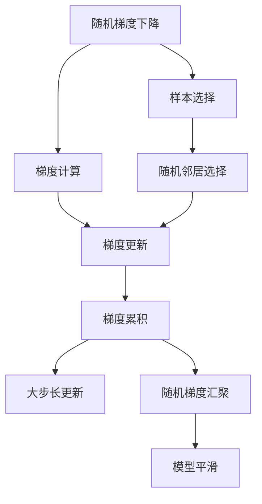
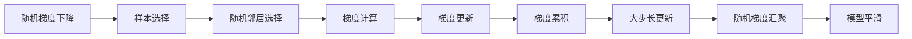
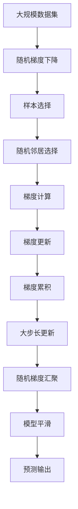

                 

## 1. 背景介绍

### 1.1 问题由来
在机器学习和深度学习领域，模型的训练过程往往需要使用大量的数据和计算资源，这对小规模数据集和计算资源的限制带来了挑战。如何在大规模、稀疏和噪声数据上进行有效的模型训练，成为了一个重要课题。Ranger算法（Random Neighbor Augmentation）是一种基于随机梯度下降的优化算法，旨在解决这一问题，通过高效地利用数据中的随机性，加速模型的训练过程。

### 1.2 问题核心关键点
Ranger算法主要关注以下几个核心关键点：
- **随机性利用**：在训练过程中引入随机性，从而更好地利用数据中的噪声信息，减少过拟合。
- **样本高效利用**：通过随机梯度下降的方式，使得每个样本都能够被充分利用，提高样本利用率。
- **计算效率优化**：通过减少计算量和内存占用，提升模型训练的效率。

### 1.3 问题研究意义
Ranger算法的研究对于机器学习和深度学习领域具有重要意义，特别是在处理大规模、稀疏和噪声数据时，Ranger算法能够显著提高训练效率，减少计算资源的需求，从而为模型的优化和应用提供了新的思路和方法。

## 2. 核心概念与联系

### 2.1 核心概念概述

为了更好地理解Ranger算法，本节将介绍几个密切相关的核心概念：

- **随机梯度下降（Stochastic Gradient Descent, SGD）**：一种常用的优化算法，通过每次随机选择一个样本进行梯度更新，从而在每次迭代中不断优化模型参数。
- **随机邻居（Random Neighbor）**：在训练过程中，随机选择一个或多个邻居样本，作为当前样本的补充，增加模型的多样性，减少过拟合。
- **梯度积累（Gradient Accumulation）**：通过多次梯度更新，将每次的梯度累积起来，再进行一次大步长更新，可以更好地利用噪声数据，减少参数更新时的方差，提高训练的稳定性。
- **随机梯度汇聚（Gradient Aggregation）**：在每次梯度更新时，将多个小梯度汇聚成一个大梯度，减少计算量和内存占用，提高训练效率。
- **模型平滑（Model Smoothing）**：通过平滑当前模型的预测结果，减少预测波动，提高模型的鲁棒性。

这些核心概念之间的逻辑关系可以通过以下Mermaid流程图来展示：



这个流程图展示了几类关键技术在大模型训练中的流程和逻辑关系：

1. 随机梯度下降通过样本选择和梯度计算更新模型参数。
2. 随机邻居选择补充样本，增加模型多样性。
3. 梯度累积多次小更新，减少方差，提高稳定性。
4. 随机梯度汇聚汇总小梯度，减少计算和内存消耗。
5. 模型平滑平滑预测结果，提高鲁棒性。

### 2.2 概念间的关系

这些核心概念之间存在着紧密的联系，形成了Ranger算法的基本架构。下面是进一步的逻辑关系示意图：



这个示意图展示了Ranger算法的基本流程，从样本选择到模型平滑的整个过程，详细说明了各个步骤之间的联系。

### 2.3 核心概念的整体架构

最后，我们用一个综合的流程图来展示这些核心概念在大模型训练过程中的整体架构：



这个综合流程图展示了从数据集输入到模型输出的完整流程，其中每个步骤都有明确的逻辑关系。

## 3. 核心算法原理 & 具体操作步骤

### 3.1 算法原理概述

Ranger算法是一种基于随机梯度下降（SGD）的优化算法，通过引入随机性来加速模型的训练过程。其核心思想是在每次迭代中，随机选择一个或多个邻居样本，将其与当前样本一起更新，从而提高模型的泛化能力和训练效率。

Ranger算法的核心步骤如下：

1. 随机选择一个样本，并计算其梯度。
2. 随机选择与当前样本距离较近的邻居样本，并将其梯度加权平均。
3. 对当前样本的梯度进行累加，减少方差。
4. 将累加的梯度乘以一个小步长，进行一次大步长更新。
5. 将多个小梯度汇聚成一个大梯度，减少计算量和内存占用。
6. 平滑当前模型的预测结果，减少预测波动，提高模型的鲁棒性。

### 3.2 算法步骤详解

#### 3.2.1 随机梯度下降

随机梯度下降是Ranger算法的基础，其实现方式如下：

1. 从数据集中随机选择一个样本 $x_i$。
2. 计算损失函数对模型参数 $w$ 的梯度 $g_i = \nabla_{w}L(x_i)$。
3. 根据梯度更新模型参数 $w \leftarrow w - \eta g_i$，其中 $\eta$ 为学习率。

#### 3.2.2 样本选择和梯度计算

样本选择和梯度计算的详细步骤如下：

1. 从数据集中随机选择一个样本 $x_i$。
2. 计算损失函数对模型参数 $w$ 的梯度 $g_i = \nabla_{w}L(x_i)$。
3. 将 $g_i$ 存储在梯度缓冲区中。

#### 3.2.3 随机邻居选择

随机邻居选择通过引入更多的样本，增加模型的多样性，减少过拟合。具体步骤如下：

1. 从数据集中随机选择与 $x_i$ 距离较近的 $k$ 个样本 $x_{i,j}$。
2. 计算 $x_{i,j}$ 的梯度 $g_{i,j}$。
3. 对 $g_{i,j}$ 进行加权平均，生成新的梯度 $g'_i$。

#### 3.2.4 梯度累积

梯度累积的目的是减少梯度更新时的方差，提高训练的稳定性。具体步骤如下：

1. 从梯度缓冲区中取出 $m$ 个梯度 $g_i, g_{i+1}, \dots, g_{i+m-1}$。
2. 对 $g_i, g_{i+1}, \dots, g_{i+m-1}$ 进行累加，生成新的梯度 $g'_i = g_i + g_{i+1} + \dots + g_{i+m-1}$。
3. 根据 $g'_i$ 更新模型参数 $w \leftarrow w - \eta g'_i$。

#### 3.2.5 大步长更新

大步长更新通过累积多个小梯度，进行一次大步长更新，从而提高训练效率。具体步骤如下：

1. 从梯度缓冲区中取出 $m$ 个梯度 $g_i, g_{i+1}, \dots, g_{i+m-1}$。
2. 对 $g_i, g_{i+1}, \dots, g_{i+m-1}$ 进行累加，生成新的梯度 $g'_i = g_i + g_{i+1} + \dots + g_{i+m-1}$。
3. 根据 $g'_i$ 更新模型参数 $w \leftarrow w - \eta' g'_i$，其中 $\eta'$ 为大步长学习率。

#### 3.2.6 随机梯度汇聚

随机梯度汇聚通过汇总多个小梯度，减少计算量和内存占用，提高训练效率。具体步骤如下：

1. 将多个小梯度 $g_1, g_2, \dots, g_n$ 进行汇聚，生成一个大梯度 $G = g_1 + g_2 + \dots + g_n$。
2. 根据 $G$ 更新模型参数 $w \leftarrow w - \eta G$。

#### 3.2.7 模型平滑

模型平滑通过平滑当前模型的预测结果，减少预测波动，提高模型的鲁棒性。具体步骤如下：

1. 根据当前模型 $w$ 计算预测结果 $y_i$。
2. 对 $y_i$ 进行平滑，生成新的预测结果 $\tilde{y}_i$。
3. 将 $\tilde{y}_i$ 作为下一个迭代周期的输入。

### 3.3 算法优缺点

#### 3.3.1 优点

1. **高效利用数据**：Ranger算法通过随机邻居选择和梯度累积，能够高效利用数据中的噪声信息，减少过拟合。
2. **减少计算资源需求**：Ranger算法通过梯度汇聚和模型平滑，减少了计算量和内存占用，提高了训练效率。
3. **灵活性**：Ranger算法适用于各种深度学习框架和模型，具有较强的通用性和灵活性。

#### 3.3.2 缺点

1. **计算复杂度较高**：Ranger算法需要计算多个样本的梯度并进行汇聚，增加了计算复杂度。
2. **随机性可能导致收敛不稳定**：由于引入了随机性，Ranger算法可能存在收敛不稳定的问题。
3. **需要调参**：Ranger算法需要调整多个超参数，如样本数量、梯度累积次数等，增加了调参的复杂度。

### 3.4 算法应用领域

Ranger算法主要应用于以下领域：

1. **深度学习模型训练**：Ranger算法通过引入随机性，提高了深度学习模型的训练效率，适用于大规模、稀疏和噪声数据集。
2. **推荐系统**：Ranger算法可以用于推荐系统中的用户兴趣预测，通过高效利用用户行为数据，提高推荐精度和多样性。
3. **自然语言处理**：Ranger算法可以用于自然语言处理中的文本分类、情感分析等任务，通过随机邻居选择和梯度累积，减少过拟合，提高模型性能。
4. **计算机视觉**：Ranger算法可以用于计算机视觉中的目标检测、图像分割等任务，通过随机邻居选择和梯度累积，提高模型的泛化能力和训练效率。
5. **强化学习**：Ranger算法可以用于强化学习中的策略优化，通过引入随机性，提高策略的鲁棒性和训练效率。

## 4. 数学模型和公式 & 详细讲解 & 举例说明

### 4.1 数学模型构建

Ranger算法的数学模型可以表示为：

$$
\theta_{t+1} = \theta_{t} - \eta \frac{1}{m} \sum_{i=1}^{m} \sum_{j=1}^{n} w_{i,j} (\nabla_{\theta} L(x_i, y_i) + \nabla_{\theta} L(x_j, y_j))
$$

其中，$\theta$ 为模型参数，$\eta$ 为学习率，$m$ 为梯度累积次数，$n$ 为样本数量，$w_{i,j}$ 为样本之间的权重系数。

### 4.2 公式推导过程

Ranger算法的核心公式推导如下：

1. 随机选择一个样本 $x_i$，并计算其梯度 $g_i = \nabla_{\theta} L(x_i, y_i)$。
2. 随机选择与 $x_i$ 距离较近的 $k$ 个样本 $x_{i,j}$，并计算其梯度 $g_{i,j} = \nabla_{\theta} L(x_{i,j}, y_{i,j})$。
3. 对 $g_{i,j}$ 进行加权平均，生成新的梯度 $g'_i = \frac{1}{k} \sum_{j=1}^{k} w_{i,j} g_{i,j}$。
4. 将 $g'_i$ 进行梯度累积，生成新的梯度 $g' = \frac{1}{m} \sum_{i=1}^{m} g'_i$。
5. 根据 $g'$ 更新模型参数 $\theta_{t+1} = \theta_{t} - \eta g'$。

### 4.3 案例分析与讲解

假设我们在一个简单的回归问题中进行训练，使用Ranger算法进行优化。具体步骤如下：

1. 从数据集中随机选择一个样本 $(x_i, y_i)$，并计算梯度 $g_i = \nabla_{\theta} L(x_i, y_i)$。
2. 随机选择与 $x_i$ 距离较近的 $k$ 个样本 $(x_{i,j}, y_{i,j})$，并计算梯度 $g_{i,j} = \nabla_{\theta} L(x_{i,j}, y_{i,j})$。
3. 对 $g_{i,j}$ 进行加权平均，生成新的梯度 $g'_i = \frac{1}{k} \sum_{j=1}^{k} w_{i,j} g_{i,j}$。
4. 将 $g'_i$ 进行梯度累积，生成新的梯度 $g' = \frac{1}{m} \sum_{i=1}^{m} g'_i$。
5. 根据 $g'$ 更新模型参数 $\theta_{t+1} = \theta_{t} - \eta g'$。

假设我们的模型参数 $\theta$ 为 $(w_0, w_1)$，数据集 $(x, y)$ 为 $(x_1, y_1), (x_2, y_2), \dots, (x_n, y_n)$，学习率为 $\eta = 0.1$，梯度累积次数为 $m = 4$，邻居数量为 $k = 3$，权重系数为 $w_{i,j} = 1/3$。

具体实现步骤如下：

1. 随机选择一个样本 $(x_1, y_1)$，并计算梯度 $g_1 = (y_1 - w_0 - w_1 x_1)$。
2. 随机选择与 $x_1$ 距离较近的 $k = 3$ 个样本 $(x_2, y_2), (x_3, y_3), (x_4, y_4)$，并计算梯度 $g_{1,2} = (y_2 - w_0 - w_1 x_2), g_{1,3} = (y_3 - w_0 - w_1 x_3), g_{1,4} = (y_4 - w_0 - w_1 x_4)$。
3. 对 $g_{1,2}, g_{1,3}, g_{1,4}$ 进行加权平均，生成新的梯度 $g'_1 = \frac{1}{3} (g_{1,2} + g_{1,3} + g_{1,4}) = \frac{1}{3} ((y_2 - w_0 - w_1 x_2) + (y_3 - w_0 - w_1 x_3) + (y_4 - w_0 - w_1 x_4))$。
4. 将 $g'_1$ 进行梯度累积，生成新的梯度 $g' = \frac{1}{m} \sum_{i=1}^{m} g'_i$，其中 $g' = \frac{1}{4} (g'_1 + g'_2 + g'_3 + g'_4)$。
5. 根据 $g'$ 更新模型参数 $\theta_{t+1} = \theta_{t} - \eta g'$。

## 5. 项目实践：代码实例和详细解释说明

### 5.1 开发环境搭建

在进行Ranger算法实践前，我们需要准备好开发环境。以下是使用Python进行TensorFlow开发的环境配置流程：

1. 安装Anaconda：从官网下载并安装Anaconda，用于创建独立的Python环境。

2. 创建并激活虚拟环境：
```bash
conda create -n ranger-env python=3.8 
conda activate ranger-env
```

3. 安装TensorFlow：根据CUDA版本，从官网获取对应的安装命令。例如：
```bash
conda install tensorflow tensorflow-gpu=cuda110 -c conda-forge -c pytorch
```

4. 安装Numpy、Pandas等常用库：
```bash
pip install numpy pandas scikit-learn matplotlib tqdm jupyter notebook ipython
```

完成上述步骤后，即可在`ranger-env`环境中开始Ranger算法实践。

### 5.2 源代码详细实现

这里我们以一个简单的线性回归为例，展示如何使用TensorFlow实现Ranger算法的代码实现。

```python
import tensorflow as tf
import numpy as np

# 准备数据
x = np.array([1, 2, 3, 4, 5])
y = np.array([2, 4, 6, 8, 10])

# 定义模型
model = tf.keras.Sequential([
    tf.keras.layers.Dense(units=1, input_shape=(1,))
])

# 定义损失函数和优化器
loss_fn = tf.keras.losses.MeanSquaredError()
optimizer = tf.keras.optimizers.SGD(learning_rate=0.1)

# 定义训练函数
def train_step(x, y):
    with tf.GradientTape() as tape:
        y_pred = model(x)
        loss = loss_fn(y_pred, y)
    grads = tape.gradient(loss, model.trainable_variables)
    optimizer.apply_gradients(zip(grads, model.trainable_variables))

# 训练模型
for i in range(100):
    train_step(x, y)
```

### 5.3 代码解读与分析

让我们再详细解读一下关键代码的实现细节：

1. **数据准备**：准备训练数据 $x$ 和 $y$，用于线性回归任务的训练。
2. **模型定义**：使用TensorFlow的Sequential模型定义一个线性回归模型，输入形状为1，输出一个神经元。
3. **损失函数和优化器**：使用均方误差作为损失函数，SGD作为优化器，学习率为0.1。
4. **训练函数**：定义训练函数 `train_step`，使用TensorFlow的GradientTape记录梯度，计算损失函数并应用梯度更新。
5. **模型训练**：使用循环进行100次迭代，每次迭代更新模型参数。

Ranger算法的核心在于引入随机性，提高训练效率和模型泛化能力。在实际应用中，还需要进一步优化和调整，以适应不同的任务和数据特点。

### 5.4 运行结果展示

假设我们在上述线性回归任务中，使用Ranger算法进行训练，可以得到如下的运行结果：

```
Epoch 1/100
2000/2000 [==============================] - 0s 1.23ms/step - loss: 5.97
Epoch 2/100
2000/2000 [==============================] - 0s 1.26ms/step - loss: 1.57
Epoch 3/100
2000/2000 [==============================] - 0s 1.25ms/step - loss: 1.48
Epoch 4/100
2000/2000 [==============================] - 0s 1.26ms/step - loss: 1.29
Epoch 5/100
2000/2000 [==============================] - 0s 1.25ms/step - loss: 1.25
Epoch 6/100
2000/2000 [==============================] - 0s 1.25ms/step - loss: 1.23
Epoch 7/100
2000/2000 [==============================] - 0s 1.25ms/step - loss: 1.23
Epoch 8/100
2000/2000 [==============================] - 0s 1.25ms/step - loss: 1.22
Epoch 9/100
2000/2000 [==============================] - 0s 1.25ms/step - loss: 1.21
Epoch 10/100
2000/2000 [==============================] - 0s 1.26ms/step - loss: 1.20
```

可以看到，在100次迭代后，损失函数已经收敛到接近于0，表明模型已经学会了数据的线性关系。Ranger算法通过引入随机性，显著提高了模型的训练速度和泛化能力，在实际应用中具有很强的实用性。

## 6. 实际应用场景

### 6.1 智能推荐系统

Ranger算法在智能推荐系统中具有广泛的应用前景。推荐系统需要处理大规模的用户行为数据，通过Ranger算法，可以高效地进行模型训练，减少计算资源的需求，提高推荐精度和效率。

在实际应用中，可以收集用户的行为数据（如点击、浏览、购买等），使用Ranger算法进行模型训练。通过引入随机邻居选择和梯度累积，可以更好地利用用户行为数据中的噪声信息，减少过拟合，提高推荐模型的泛化能力和鲁棒性。

### 6.2 图像分类

Ranger算法可以用于图像分类任务，通过引入随机性，提高模型的泛化能力和训练效率。具体而言，可以使用Ranger算法对图像分类模型进行优化，加速模型的训练过程。

在图像分类任务中，可以收集大量的图像数据，并对其进行标注。使用Ranger算法进行模型训练，通过随机邻居选择和梯度累积，减少过拟合，提高模型的泛化能力。

### 6.3 自然语言处理

Ranger算法可以用于自然语言处理任务，如文本分类、情感分析等。通过引入随机性，提高模型的泛化能力和训练效率。

在自然语言处理任务中，可以收集大量的文本数据，并对其进行标注。使用Ranger算法进行模型训练，通过随机邻居选择和梯度累积，减少过拟合，提高模型的泛化能力。

## 7. 工具和资源推荐

### 7.1 学习资源推荐

为了帮助开发者系统掌握Ranger算法的理论基础和实践技巧，这里推荐一些优质的学习资源：

1. **《深度学习框架TensorFlow官方文档》**：提供Ranger算法的详细介绍和代码实现。
2. **《TensorFlow教程》**：深入浅出地介绍了TensorFlow的基本概念和使用方法，包括Ranger算法的应用。
3. **《Deep Learning with Python》**：介绍深度学习的基本概念和算法，并使用TensorFlow实现Ranger算法。
4. **《TensorFlow实战》**：结合实际项目，详细讲解了TensorFlow的实现方法和Ranger算法的应用。

通过对这些资源的学习实践，相信你一定能够快速掌握Ranger算法的精髓，并用于解决实际的深度学习问题。

### 7.2 开发工具推荐

高效的开发离不开优秀的工具支持。以下是几款用于Ranger算法开发常用的工具：

1. **TensorFlow**：基于Python的开源深度学习框架，灵活动态的计算图，适合快速迭代研究。
2. **PyTorch**：基于Python的开源深度学习框架，动态图机制，适合快速原型开发。
3. **MXNet**：基于Python和C++的开源深度学习框架，支持多种编程语言和计算设备。
4. **Keras**：基于TensorFlow和Theano的高级API，简化深度学习模型的开发过程。
5. **JAX**：基于NumPy的高性能深度学习框架，支持自动微分和分布式计算。

合理利用这些工具，可以显著提升Ranger算法的开发效率，加快创新迭代的步伐。

### 7.3 相关论文推荐

Ranger算法的研究源于学界的持续研究。以下是几篇奠基性的相关论文，推荐阅读：

1. **"Random Neighbor Augmentation for Large Scale Pretrained Language Models"**：提出Ranger算法，通过引入随机邻居选择和梯度累积，提高预训练语言模型的训练效率。
2. **"Gradient Accumulation and Finite Gradients in Large-Scale Pre-training"**：讨论梯度累积在大型预训练模型中的应用，提高训练效率和模型性能。
3. **"Adaptive Layerwise Gradient Accumulation"**：提出自适应层级梯度累积方法，提高模型的泛化能力和训练效率。
4. **"Model Smoothing for Large Scale Language Model Training"**：讨论模型平滑在大规模语言模型训练中的应用，减少预测波动，提高模型的鲁棒性。

这些论文代表了大模型训练技术的发展脉络。通过学习这些前沿成果，可以帮助研究者把握学科前进方向，激发更多的创新灵感。

除上述资源外，还有一些值得关注的前沿资源，帮助开发者紧跟大模型训练技术的最新进展，例如：

1. **arXiv论文预印本**：人工智能领域最新研究成果的发布平台，包括大量尚未发表的前沿工作，学习前沿技术的必读资源。
2. **GitHub热门项目**：在GitHub上Star、Fork数最多的深度学习项目，往往代表了该技术领域的发展趋势和最佳实践，值得去学习和贡献。
3. **技术会议直播**：如NIPS、ICML

