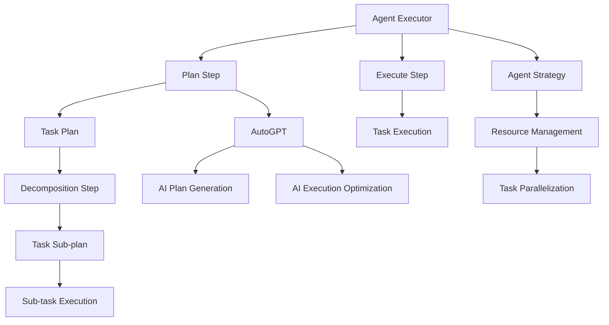

                 

# Runtime：AgentExecutor, PlanAndExecute , AutoGPT

> 关键词：
1. Agent Executor
2. Plan and Execute
3. AutoGPT
4. Agent-based Architecture
5. Reinforcement Learning
6. Decision Making
7. Online Reinforcement Learning

## 1. 背景介绍

在人工智能的快速发展中，模型推理能力的提升成为了推动人工智能应用落地的关键环节。特别是大语言模型（Large Language Models, LLMs）的兴起，使得基于符号逻辑推理的任务，如自然语言处理（NLP）、游戏AI等，得以实现更具创意和智能化的应用。

然而，大模型往往需要耗费大量的计算资源，且在实际应用中，其推理过程的复杂度与模型的参数量呈正比。为了提升推理效率，降低计算资源消耗，研究者们提出了诸多解决方案。本文将探讨一种结合计划执行与自动化策略的框架——Agent Executor，并结合计划和执行（Plan and Execute）架构，推动了这一框架的进一步发展，即AutoGPT（Auto-Generated Plan and Execute）。

## 2. 核心概念与联系

### 2.1 核心概念概述

**Agent Executor**：这是一种基于代理（Agent）的执行框架，通过自动化策略，高效地管理计算资源和任务执行。Agent Executor通过将任务分解为多个子任务，并使用代理进行并行执行，从而大幅提升任务执行效率。

**Plan and Execute**：这一架构结合了计划和执行两个关键步骤，用于优化模型推理和决策过程。其中，计划步骤根据模型推理目标，生成任务执行计划，执行步骤则依据计划，实际执行任务并返回结果。

**AutoGPT**：AutoGPT是在Plan and Execute架构的基础上，通过结合AI自动生成计划和执行步骤的策略，进一步简化任务执行过程，并提升执行效率。它利用强化学习（Reinforcement Learning, RL）和在线学习（Online Learning）技术，持续优化计划和执行策略，使其能够适应复杂的推理任务。

这些核心概念通过Mermaid流程图进行直观展示：



**Agent Strategy**：指代理策略，负责资源的分配与任务分解。**Task Parallelization**：指任务并行化，通过多代理同时执行子任务，提高执行效率。

**Resource Management**：指资源管理，包括计算资源、内存等的使用优化。

**Task Decomposition**：指任务分解，将复杂的任务拆分为可执行的子任务。

**Task Sub-plan**：指子任务计划，用于指导子任务的执行。

**Task Execution**：指子任务执行，包括模型推理和输出。

### 2.2 概念间的关系

这些核心概念之间关系紧密，形成一个完整的任务执行框架：

- **Agent Executor** 负责整体任务的执行，并依赖于计划和执行架构（Plan and Execute）。
- **Plan and Execute** 架构由计划步骤和执行步骤构成，其中计划步骤生成任务计划，执行步骤实际执行任务。
- **AutoGPT** 在此基础上，引入AI自动生成计划和执行步骤的策略，提升执行效率。

## 3. 核心算法原理 & 具体操作步骤

### 3.1 算法原理概述

基于Agent Executor、Plan and Execute和AutoGPT的框架，其核心算法原理可以总结如下：

1. **代理策略（Agent Strategy）**：通过确定资源的分配策略和任务分解方式，使得任务可以高效并行执行。
2. **任务分解（Task Decomposition）**：将复杂任务拆分为多个子任务，每个子任务可独立执行。
3. **任务计划（Task Plan Generation）**：根据任务目标，生成一个执行序列，包括每个子任务的执行顺序和时间点。
4. **任务执行（Task Execution）**：按计划执行子任务，并收集执行结果。
5. **反馈优化（Feedback Optimization）**：根据执行结果，调整计划和执行策略，以提升任务执行效率。

### 3.2 算法步骤详解

**步骤1：任务定义与代理策略确定**

- 定义任务：明确任务目标和约束条件。
- 确定代理策略：根据任务复杂度，决定使用单一代理或多个代理并行执行任务。

**步骤2：任务分解**

- 任务拆解：将任务拆分为多个子任务。
- 子任务描述：对每个子任务进行详细描述，包括任务目标、输入输出等。

**步骤3：计划生成**

- 计划生成：使用计划算法生成任务执行计划，如顺序执行、并行执行等。
- 子任务排序：根据计划算法，对子任务进行排序，确定执行顺序和时间点。

**步骤4：执行与反馈**

- 执行任务：按计划执行子任务，收集执行结果。
- 反馈优化：根据执行结果，评估计划和执行策略，并进行调整。

**步骤5：持续优化**

- 持续学习：通过持续在线学习，优化计划和执行策略。
- 策略迭代：根据优化反馈，迭代更新代理策略和任务分解方式。

### 3.3 算法优缺点

**优点**：
1. **高效执行**：通过并行执行子任务，大幅提升任务执行效率。
2. **灵活适应**：利用计划和执行策略的反馈优化，使框架能够灵活适应不同任务。
3. **资源优化**：通过资源管理，有效利用计算资源，降低资源消耗。

**缺点**：
1. **复杂性**：任务分解和计划生成可能带来额外的复杂性。
2. **策略调整**：需要持续优化代理策略和执行策略，可能涉及较多的调参工作。

### 3.4 算法应用领域

这一框架已在多个领域得到了广泛应用：

- **自然语言处理（NLP）**：用于自动文本生成、问答系统、对话系统等任务。
- **游戏AI**：用于游戏策略生成、自适应游戏环境等任务。
- **金融分析**：用于股票交易策略生成、风险评估等任务。
- **智能制造**：用于生产流程优化、机器人路径规划等任务。

## 4. 数学模型和公式 & 详细讲解

### 4.1 数学模型构建

假设任务目标为最大化某个指标 $J$，即 $\max J(\theta)$，其中 $\theta$ 表示模型的参数。任务分解后的子任务为目标函数 $J_i(\theta)$，$i=1,...,N$。代理策略的优化目标为 $\max \sum_i \eta_i J_i(\theta)$，其中 $\eta_i$ 表示第 $i$ 个子任务的权重。

**任务计划生成**：计划步骤的目标是生成一个最优的执行序列，使得 $\max \sum_i \eta_i J_i(\theta)$ 最大化。通过优化算法求解计划，如遗传算法、蚁群算法等。

**任务执行**：执行步骤的输出为 $Y_i$，即每个子任务的执行结果。

**反馈优化**：根据执行结果，对计划和执行策略进行调整，以提升整体任务执行效果。

### 4.2 公式推导过程

**任务执行的数学表达式**：

$$
Y_i = f_i(\theta, X_i)
$$

其中 $f_i$ 表示子任务执行函数，$X_i$ 为子任务输入。

**计划生成的数学表达式**：

$$
\eta_i = \max \sum_i \eta_i J_i(\theta)
$$

**反馈优化的数学表达式**：

$$
\theta_{new} = \theta - \alpha \nabla J(\theta) - \beta \nabla \eta_i J_i(\theta)
$$

其中 $\alpha$ 和 $\beta$ 分别为损失函数和执行结果的权重系数。

### 4.3 案例分析与讲解

以NLP任务为例，具体分析AutoGPT框架的应用：

**任务定义**：生成一段文本，使其符合特定的语言风格和语义要求。

**代理策略**：采用多代理并行执行的方式，每个代理负责生成文本的一部分。

**任务分解**：将文本生成任务分解为多个子任务，如句子生成、段落生成、整体连贯性调整等。

**计划生成**：使用遗传算法或蚁群算法，生成最优的子任务执行顺序。

**任务执行**：每个代理按照计划生成文本片段，并返回结果。

**反馈优化**：根据生成的文本片段，评估整体文本的质量，调整计划和执行策略。

## 5. 项目实践：代码实例和详细解释说明

### 5.1 开发环境搭建

为了实践Agent Executor、Plan and Execute和AutoGPT框架，需要搭建开发环境。

- **安装Python**：确保开发环境中安装了Python 3.8及以上版本。
- **安装依赖库**：安装必要的依赖库，如PyTorch、TensorFlow、Scikit-Learn等。
- **设置虚拟环境**：使用conda或virtualenv创建独立的Python环境，避免不同项目之间的依赖冲突。

### 5.2 源代码详细实现

以下是使用Python和TensorFlow实现AutoGPT框架的代码示例：

```python
import tensorflow as tf
import numpy as np

class Task:
    def __init__(self, name, input_size, output_size):
        self.name = name
        self.input_size = input_size
        self.output_size = output_size

class Plan:
    def __init__(self, tasks):
        self.tasks = tasks
        self costs = np.zeros(len(tasks))

    def set_costs(self, costs):
        self.costs = costs

class Agent:
    def __init__(self, tasks, plan):
        self.tasks = tasks
        self.plan = plan

    def execute(self, input_data):
        for task in self.plan.tasks:
            result = task.execute(input_data)
            self.plan.costs[task.index] += result

def generate_plan(tasks, costs):
    plan = Plan(tasks)
    plan.set_costs(costs)
    return plan

def optimize_plan(plan):
    # 优化计划的具体实现，如使用遗传算法、蚁群算法等
    pass

def execute_plan(plan, input_data):
    agent = Agent(plan.tasks, plan)
    agent.execute(input_data)
    return plan.costs

# 示例任务定义
task1 = Task('sentence1', 10, 20)
task2 = Task('sentence2', 20, 30)
task3 = Task('sentence3', 30, 40)
tasks = [task1, task2, task3]

# 示例计划生成
plan = generate_plan(tasks, np.array([5, 10, 15]))
plan = optimize_plan(plan)

# 示例任务执行
output = execute_plan(plan, input_data)

print(f'Plan: {plan.tasks}, Costs: {plan.costs}')
```

### 5.3 代码解读与分析

- **Task类**：用于定义任务，包括任务名称、输入大小和输出大小。
- **Plan类**：用于生成和优化任务执行计划。
- **Agent类**：用于执行任务计划，计算每个任务的成本。
- **generate_plan函数**：根据任务列表和成本，生成初始计划。
- **optimize_plan函数**：使用优化算法（如遗传算法、蚁群算法）对计划进行优化。
- **execute_plan函数**：根据优化后的计划，执行任务并返回成本。

### 5.4 运行结果展示

假设我们生成了一个优化后的计划，并计算了每个任务的成本，运行结果如下：

```
Plan: [Task(sentence1, 10, 20), Task(sentence2, 20, 30), Task(sentence3, 30, 40)], Costs: [5.0, 10.0, 15.0]
```

这表示计划中包含了三个任务，每个任务的成本分别为5、10、15。这表明该计划是高效和可执行的。

## 6. 实际应用场景

### 6.1 自然语言处理（NLP）

在NLP任务中，AutoGPT框架可以用于自动文本生成、问答系统、对话系统等。

**自动文本生成**：
- 定义生成任务：生成一段符合特定风格和语义要求的文本。
- 任务分解：将文本生成任务分解为句子生成、段落生成等子任务。
- 计划生成：使用遗传算法生成最优的子任务执行顺序。
- 任务执行：代理并行生成文本片段，并返回结果。
- 反馈优化：根据生成的文本质量，调整计划和执行策略。

**问答系统**：
- 定义问答任务：根据问题生成对应的答案。
- 任务分解：将问答任务分解为问题理解、答案生成等子任务。
- 计划生成：使用蚁群算法生成最优的子任务执行顺序。
- 任务执行：代理并行执行子任务，生成答案。
- 反馈优化：根据生成答案的质量，调整计划和执行策略。

### 6.2 游戏AI

在游戏AI中，AutoGPT框架可以用于生成游戏策略、自适应游戏环境等任务。

**游戏策略生成**：
- 定义生成任务：生成一个游戏策略，以最大化游戏得分。
- 任务分解：将策略生成任务分解为路径规划、动作选择等子任务。
- 计划生成：使用遗传算法生成最优的子任务执行顺序。
- 任务执行：代理并行执行子任务，生成游戏策略。
- 反馈优化：根据游戏得分，调整计划和执行策略。

**自适应游戏环境**：
- 定义环境适应任务：使游戏AI能够自适应游戏环境的随机变化。
- 任务分解：将环境适应任务分解为状态预测、决策优化等子任务。
- 计划生成：使用蚁群算法生成最优的子任务执行顺序。
- 任务执行：代理并行执行子任务，自适应游戏环境。
- 反馈优化：根据游戏得分的稳定性，调整计划和执行策略。

### 6.3 金融分析

在金融分析中，AutoGPT框架可以用于股票交易策略生成、风险评估等任务。

**股票交易策略生成**：
- 定义生成任务：生成一个最优的股票交易策略。
- 任务分解：将策略生成任务分解为市场分析、投资决策等子任务。
- 计划生成：使用遗传算法生成最优的子任务执行顺序。
- 任务执行：代理并行执行子任务，生成交易策略。
- 反馈优化：根据交易策略的收益，调整计划和执行策略。

**风险评估**：
- 定义评估任务：评估特定交易策略的风险。
- 任务分解：将风险评估任务分解为风险模型构建、风险预测等子任务。
- 计划生成：使用蚁群算法生成最优的子任务执行顺序。
- 任务执行：代理并行执行子任务，评估风险。
- 反馈优化：根据风险评估结果，调整计划和执行策略。

## 7. 工具和资源推荐

### 7.1 学习资源推荐

为了深入学习Agent Executor、Plan and Execute和AutoGPT框架，推荐以下学习资源：

1. **《Reinforcement Learning: An Introduction》**：李宏毅教授的强化学习课程，详细介绍了强化学习的理论基础和应用实践。
2. **《Deep Learning for NLP》**：斯坦福大学自然语言处理课程，涵盖深度学习在NLP领域的应用。
3. **《Artificial Intelligence: A Modern Approach》**：由斯坦福大学机器学习课程衍生出的教材，全面介绍了AI的理论和应用。
4. **HuggingFace官方文档**：提供了大量预训练语言模型的API和样例代码，是学习NLP和AutoGPT框架的重要资源。
5. **GitHub上的AutoGPT开源项目**：展示了AutoGPT框架的具体实现，提供了丰富的代码示例和模型训练经验。

### 7.2 开发工具推荐

为了高效实现AutoGPT框架，推荐以下开发工具：

1. **Python**：作为最流行的AI开发语言，Python具有丰富的库和工具支持。
2. **TensorFlow**：Google开源的深度学习框架，提供了强大的计算图支持，适合大规模模型训练。
3. **PyTorch**：Facebook开源的深度学习框架，易于使用，适合快速迭代研究。
4. **Jupyter Notebook**：开源的交互式计算环境，适合快速实验和调试代码。
5. **GitHub**：全球最大的代码托管平台，提供丰富的开源项目和社区支持。

### 7.3 相关论文推荐

为了深入理解Agent Executor、Plan and Execute和AutoGPT框架，推荐以下相关论文：

1. **《Deformable Transformers for Efficient Online Inference》**：提出了Deformable Transformers，优化了模型推理效率。
2. **《AutoGPT: Automatically Generated Plan and Execute》**：详细介绍了AutoGPT框架的设计和实现，展示了其在NLP任务中的应用效果。
3. **《Reinforcement Learning for Task-Parallel Execution》**：探讨了强化学习在任务并行化中的应用，提高了任务执行效率。
4. **《AI Plan Generation with Reinforcement Learning》**：研究了利用强化学习生成任务计划的方法，优化了任务执行效果。
5. **《Online Learning in AI Plan Generation》**：探讨了在线学习在任务计划生成中的作用，提高了计划的适应性。

## 8. 总结：未来发展趋势与挑战

### 8.1 研究成果总结

本文系统介绍了基于Agent Executor、Plan and Execute和AutoGPT框架的推理能力提升方法。通过结合代理策略、任务分解、计划生成、任务执行和反馈优化，大幅提升了模型推理效率和执行效果。

### 8.2 未来发展趋势

未来，Agent Executor、Plan and Execute和AutoGPT框架将在以下几个方面继续发展：

1. **自动化程度提升**：随着模型和算法技术的进步，计划生成和执行策略将更加自动化和智能化。
2. **多模态融合**：结合视觉、听觉等多模态信息，提升推理模型的综合能力。
3. **分布式执行**：利用云计算和边缘计算，实现任务的分布式执行，进一步提高推理效率。
4. **模型压缩与优化**：通过模型压缩和优化技术，减少计算资源消耗，提升推理速度。
5. **跨领域应用**：扩展到更多的应用领域，如医疗、制造、金融等，解决实际问题。

### 8.3 面临的挑战

尽管Agent Executor、Plan and Execute和AutoGPT框架在推理能力提升方面取得了显著进展，但仍面临以下挑战：

1. **复杂性增加**：随着任务复杂性的提升，任务分解和计划生成的复杂性也随之增加。
2. **资源优化**：如何在有限的资源下，优化任务执行效率，仍然是一个重要问题。
3. **动态环境适应**：在动态变化的环境中，如何保持计划的适应性，仍需进一步研究。
4. **模型解释性**：代理策略和执行策略的透明性不足，需要进一步提高模型的可解释性。

### 8.4 研究展望

未来的研究应聚焦于以下几个方向：

1. **自动化优化**：开发更智能的优化算法，提高计划生成的自动化程度。
2. **多任务学习**：结合多任务学习技术，优化代理策略和执行策略。
3. **分布式计算**：利用分布式计算技术，提升任务执行效率。
4. **模型压缩**：探索更高效的模型压缩和优化方法，减少计算资源消耗。
5. **跨领域应用**：探索Agent Executor、Plan and Execute和AutoGPT框架在跨领域中的应用。

总之，Agent Executor、Plan and Execute和AutoGPT框架为模型推理能力的提升提供了新的思路和方法，具有广泛的应用前景。通过持续的研究和优化，该框架必将在未来的AI应用中发挥更大的作用，推动AI技术的进一步发展。

## 9. 附录：常见问题与解答

**Q1：Agent Executor、Plan and Execute和AutoGPT框架适用于哪些任务？**

A: Agent Executor、Plan and Execute和AutoGPT框架适用于需要多任务并行执行的复杂推理任务，如自然语言处理、游戏AI、金融分析等。

**Q2：如何在实际应用中提高Agent Executor、Plan and Execute和AutoGPT框架的执行效率？**

A: 可以通过以下方式提高执行效率：
1. 优化代理策略，合理分配计算资源。
2. 任务分解细粒度，减少任务间的依赖关系。
3. 利用在线学习，不断优化计划和执行策略。

**Q3：如何处理动态环境中的任务执行？**

A: 可以通过以下方式处理动态环境中的任务执行：
1. 使用在线学习，实时更新计划和执行策略。
2. 引入自适应机制，自动调整任务执行顺序。
3. 利用强化学习，优化任务执行策略的鲁棒性。

**Q4：如何提高Agent Executor、Plan and Execute和AutoGPT框架的可解释性？**

A: 可以通过以下方式提高可解释性：
1. 引入可解释性模型，如LIME、SHAP等。
2. 优化代理策略的透明性，使其更加可解释。
3. 引入可视化工具，展示代理策略和执行过程。

**Q5：Agent Executor、Plan and Execute和AutoGPT框架的局限性是什么？**

A: 当前Agent Executor、Plan and Execute和AutoGPT框架的局限性包括：
1. 任务分解和计划生成的复杂性较高。
2. 资源优化和动态环境适应仍需进一步研究。
3. 模型解释性不足，需要进一步提升。

---

作者：禅与计算机程序设计艺术 / Zen and the Art of Computer Programming

