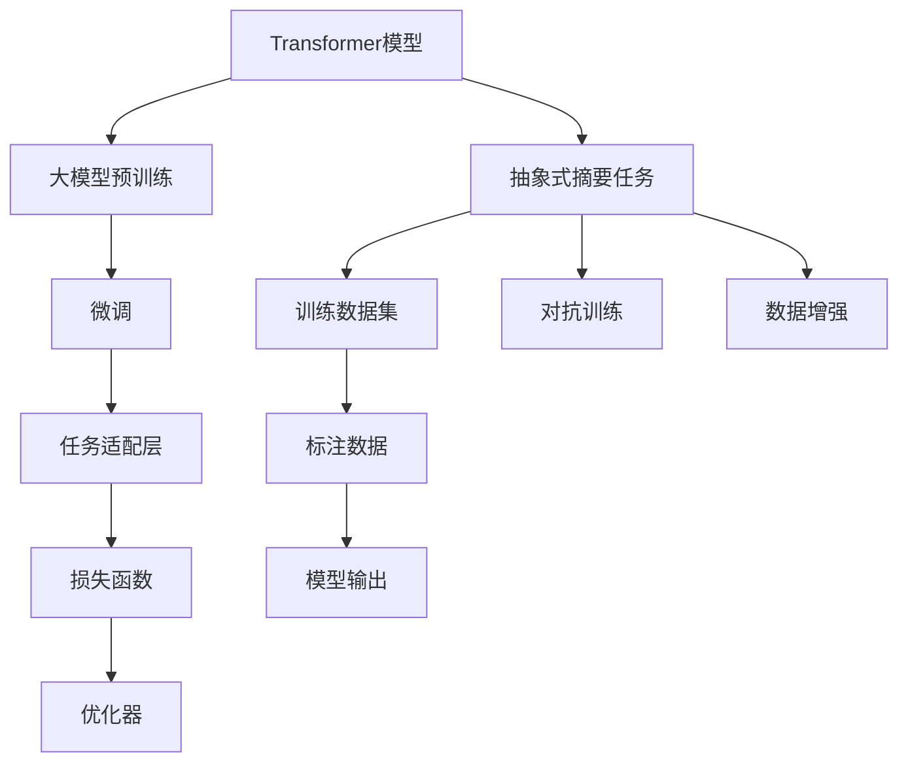
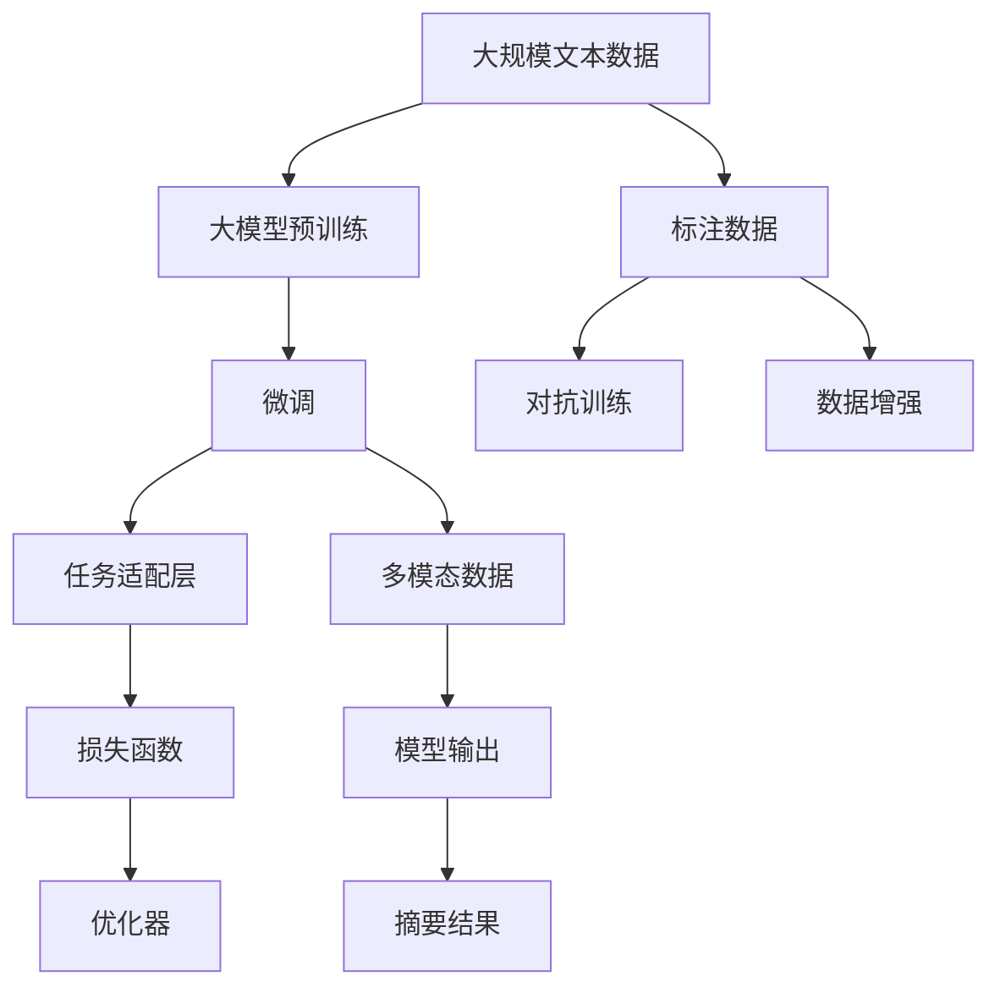

                 

# Transformer大模型实战 抽象式摘要任务

> 关键词：Transformer, 大模型, 抽象式摘要, 语言理解, 多模态, 自然语言处理, 自然语言生成, 预训练模型, 微调

## 1. 背景介绍

### 1.1 问题由来

随着深度学习技术的发展，Transformer模型凭借其卓越的语言理解能力，在自然语言处理(NLP)领域取得了巨大的突破。Transformer模型已经被广泛应用于各种NLP任务中，包括文本分类、机器翻译、对话生成等。近年来，大模型（如BERT、GPT等）的发展使得Transformer在处理大规模文本数据方面展现了更强的能力，逐渐成为NLP领域的标准。

抽象式摘要任务是指从长文本中自动提取出其核心信息并生成简洁的摘要，是自然语言处理领域中一个重要的任务。它旨在帮助用户快速理解文本主旨，节省阅读时间。基于Transformer的大模型在处理长文本时表现出强大的理解能力和生成能力，因此成为解决抽象式摘要任务的首选模型。

### 1.2 问题核心关键点

在解决抽象式摘要任务时，主要依赖于以下几个关键点：
1. 选择合适的Transformer模型作为基础框架。
2. 设计合理的任务适配层，以便将大模型的输出转化为摘要。
3. 构建合适的训练数据集，并进行有效的数据增强和对抗训练。
4. 采用适当的损失函数和优化策略，以优化模型的性能。
5. 使用参数高效微调技术，减少模型参数的更新量，提高计算效率。
6. 引入多模态数据，以提升模型的综合处理能力。

这些关键点共同构成了Transformer大模型实战抽象式摘要任务的完整框架。通过优化这些关键点，可以显著提升模型的表现，实现高效的抽象式摘要任务。

### 1.3 问题研究意义

基于Transformer大模型的抽象式摘要任务在信息检索、新闻摘要、文章总结等方面具有广泛的应用价值。其主要意义包括：
1. 提升信息检索效率：帮助用户快速获取关键信息，提高信息获取速度。
2. 简化内容阅读：将长文本转化为简洁的摘要，便于用户快速阅读和理解。
3. 降低阅读成本：通过自动化摘要生成，减少人工阅读长文本的劳动强度。
4. 促进知识共享：加速知识的传播和共享，提高信息利用率。
5. 辅助决策制定：为决策者提供关键信息，帮助其做出更准确、更及时的决策。

基于Transformer的大模型在处理大规模文本数据时，具有显著的优势，可以有效地处理各种长文本，产生高质量的摘要。因此，在实际应用中，Transformer大模型已成为解决抽象式摘要任务的重要手段。

## 2. 核心概念与联系

### 2.1 核心概念概述

为了更好地理解基于Transformer的大模型在抽象式摘要任务中的应用，本节将介绍几个密切相关的核心概念：

- **Transformer模型**：一种基于自注意力机制的神经网络模型，适用于处理序列数据，如文本、语音等。Transformer模型主要包括编码器和解码器，能够高效地并行计算，适用于大规模文本数据的处理。
- **大模型**：指通过大规模无标签文本数据进行预训练，学习丰富的语言知识的模型。如BERT、GPT等。
- **抽象式摘要**：从长文本中自动提取出核心信息并生成简洁的摘要。
- **多模态数据**：指结合文本、图像、音频等多类数据进行处理，提升模型的综合处理能力。
- **任务适配层**：指在大模型的基础上，根据具体任务需求设计的前馈网络层，用于将大模型的输出转化为任务所需的输出格式。

这些核心概念之间的逻辑关系可以通过以下Mermaid流程图来展示：



这个流程图展示了大模型在抽象式摘要任务中的应用过程：
1. 首先，Transformer模型通过大规模无标签文本数据的预训练，学习到丰富的语言知识。
2. 然后，对大模型进行微调，以适应抽象式摘要任务的特定需求。
3. 在微调过程中，通过设计任务适配层，将大模型的输出转化为摘要格式。
4. 最后，根据任务损失函数和优化器，对模型进行训练，输出最终的摘要结果。

### 2.2 概念间的关系

这些核心概念之间存在着紧密的联系，形成了Transformer大模型实战抽象式摘要任务的完整生态系统。

- **Transformer模型与大模型的关系**：Transformer模型是大模型的一种实现形式，通常通过预训练大模型的方式进行训练。
- **微调与任务适配层的关系**：微调是利用大模型的预训练知识，对模型进行特定任务的优化；任务适配层则是将大模型的输出转化为任务所需的格式，如摘要。
- **对抗训练与数据增强的关系**：对抗训练通过引入对抗样本，提高模型的鲁棒性；数据增强则通过对训练数据的扩充，增加模型的泛化能力。
- **标注数据与模型输出的关系**：标注数据是训练模型所需的监督信号，模型输出的摘要是任务目标的输出格式。

这些概念共同构成了基于Transformer大模型的抽象式摘要任务的完整框架，使得模型能够高效地处理大规模文本数据，并生成高质量的摘要。

### 2.3 核心概念的整体架构

最后，我们用一个综合的流程图来展示这些核心概念在大模型实战抽象式摘要任务中的整体架构：



这个综合流程图展示了从预训练到大模型微调，再到任务适配和输出摘要的完整过程。大模型通过预训练学习到丰富的语言知识，经过微调优化，结合任务适配层生成摘要，最终通过多模态数据增强和对抗训练，提升了模型的泛化能力和鲁棒性，生成高质量的摘要结果。

## 3. 核心算法原理 & 具体操作步骤
### 3.1 算法原理概述

基于Transformer的大模型在抽象式摘要任务中主要通过以下步骤进行处理：
1. 利用预训练模型处理输入文本，输出表示向量。
2. 根据任务需求设计任务适配层，将表示向量转化为摘要格式的输出。
3. 使用适当的损失函数和优化策略，对模型进行微调，提升模型的性能。
4. 通过对抗训练和数据增强，提高模型的鲁棒性和泛化能力。

这些步骤共同构成了基于Transformer大模型的抽象式摘要任务的完整算法流程。通过优化这些步骤，可以显著提升模型的表现，实现高效的摘要生成。

### 3.2 算法步骤详解

下面详细讲解基于Transformer大模型的抽象式摘要任务的算法步骤：

**Step 1: 准备预训练模型和数据集**

- **选择合适的预训练模型**：通常使用BERT、GPT等大模型作为基础框架。这些模型已经在大规模无标签文本数据上进行预训练，学习到丰富的语言知识。
- **构建训练数据集**：从文本语料库中选取一定数量的文本数据作为训练集，同时进行标注。标注数据应包括文本摘要和对应的原始文本，以便模型能够学习到摘要与原始文本之间的关系。

**Step 2: 设计任务适配层**

- **输出层设计**：根据摘要任务的需求，设计合适的输出层。通常使用线性层和Softmax层进行分类，将大模型的表示向量转化为摘要格式。
- **损失函数选择**：根据摘要任务的特点，选择适当的损失函数。如BLEU、ROUGE等。

**Step 3: 设置微调超参数**

- **选择优化器**：通常使用AdamW、SGD等优化器，并设置学习率、批大小、迭代轮数等。
- **引入正则化技术**：如L2正则、Dropout等，防止模型过拟合。

**Step 4: 执行梯度训练**

- **数据加载和批处理**：将训练集数据分批次输入模型，前向传播计算损失函数。
- **反向传播和参数更新**：反向传播计算参数梯度，根据设定的优化算法和学习率更新模型参数。
- **验证集评估和Early Stopping**：在验证集上评估模型性能，根据性能指标决定是否触发Early Stopping。

**Step 5: 测试和部署**

- **测试集评估**：在测试集上评估微调后模型的性能，对比微调前后的摘要生成质量。
- **模型部署**：将微调后的模型部署到实际应用中，生成摘要。

### 3.3 算法优缺点

基于Transformer的大模型在抽象式摘要任务中具有以下优点：
1. **强大的语言理解能力**：Transformer模型在处理长文本时表现出色，能够理解复杂的文本结构和语义关系。
2. **高效的多模态处理**：可以结合图像、音频等多模态数据，提升模型的综合处理能力。
3. **泛化能力强**：通过预训练和微调，大模型能够在不同的领域和任务中取得良好的性能。
4. **参数高效微调**：利用参数高效微调技术，可以在固定大部分预训练参数的情况下，只更新少量参数，提高计算效率。

同时，基于Transformer的大模型也存在以下缺点：
1. **数据依赖性强**：微调效果依赖于标注数据的数量和质量，标注数据的获取成本较高。
2. **对抗样本敏感**：大模型对对抗样本的鲁棒性有待提高，容易被噪声数据干扰。
3. **模型复杂度高**：大模型通常具有较大的参数量，对计算资源和存储空间要求较高。
4. **推理速度慢**：大模型推理速度较慢，部署时需要考虑计算效率问题。

### 3.4 算法应用领域

基于Transformer的大模型在抽象式摘要任务中已经广泛应用于各种场景，如新闻摘要、文章总结、文档生成等。以下是几个典型的应用领域：

**新闻摘要**：从大量新闻文章中自动生成简洁的摘要，帮助用户快速了解新闻内容。
**文章总结**：对学术文章、技术文档等长文本进行总结，提取关键信息。
**文档生成**：根据用户输入的关键词或主题，自动生成相关的文档摘要。
**对话生成**：在对话系统中，生成简洁的对话摘要，帮助用户快速获取对话重点。
**自动化内容生成**：利用大模型生成文章、报告等自动化内容，提高生产效率。

## 4. 数学模型和公式 & 详细讲解 & 举例说明

### 4.1 数学模型构建

假设预训练模型为 $M_{\theta}$，其中 $\theta$ 为预训练得到的模型参数。给定抽象式摘要任务 $T$ 的标注数据集 $D=\{(x_i, y_i)\}_{i=1}^N$，其中 $x_i$ 为输入文本，$y_i$ 为对应的摘要。微调的目标是找到新的模型参数 $\hat{\theta}$，使得模型输出 $y_i$ 与标注数据 $y_i$ 的相似度最大化。

定义模型 $M_{\theta}$ 在输入 $x$ 上的输出为 $\hat{y}=M_{\theta}(x)$，表示向量。根据任务需求，设计输出层和损失函数：
1. **输出层设计**：通常使用线性层和Softmax层进行分类，将表示向量转化为摘要格式。
2. **损失函数选择**：通常使用BLEU、ROUGE等评估函数。

### 4.2 公式推导过程

以BLEU损失函数为例，其定义为：
$$
\ell(BLEU, \hat{y}, y) = 1 - \frac{1}{N} \sum_{i=1}^N \text{BLEU}(\hat{y}, y_i)
$$

其中，$\text{BLEU}(\hat{y}, y_i)$ 表示摘要 $\hat{y}$ 与标注 $y_i$ 的BLEU分数。BLEU分数越高，表示摘要与原始文本的匹配度越好。

根据BLEU分数的定义，我们可以将其分解为四项：
$$
\text{BLEU}(\hat{y}, y_i) = \frac{n_1}{n_{total}} \times \frac{n_2}{n_3} \times \frac{n_4}{n_5}
$$

其中，$n_1$ 表示摘要中匹配的单词数量，$n_2$ 表示摘要中唯一匹配的单词数量，$n_3$ 表示原始文本中匹配的单词数量，$n_4$ 表示原始文本中唯一匹配的单词数量，$n_{total}$ 表示摘要中的总单词数量。

### 4.3 案例分析与讲解

假设我们有一个长文本，其原始文本为：
```
Transformer大模型在自然语言处理领域具有广泛的应用，如新闻摘要、文章总结、文档生成等。基于Transformer的大模型在处理大规模文本数据时表现出强大的理解能力和生成能力，可以有效地处理各种长文本，产生高质量的摘要。在实际应用中，Transformer大模型已成为解决抽象式摘要任务的重要手段。
```

我们希望生成一个简洁的摘要，可以包含以下关键信息：
- Transformer大模型在自然语言处理领域具有广泛的应用。
- 可以处理大规模文本数据，产生高质量的摘要。
- 在实际应用中，已成为解决抽象式摘要任务的重要手段。

根据上述要求，我们可以设计一个简单的任务适配层，将大模型的输出向量转化为摘要格式。例如，我们可以使用Max-Pooling层或Average-Pooling层来提取大模型输出的关键信息，并将其转化为摘要格式。

假设大模型的输出向量为 $[x_1, x_2, x_3, x_4, x_5, x_6]$，其中 $x_1$ 表示“Transformer大模型”，$x_2$ 表示“自然语言处理领域”，$x_3$ 表示“具有广泛的应用”，$x_4$ 表示“可以处理大规模文本数据”，$x_5$ 表示“产生高质量的摘要”，$x_6$ 表示“已成为解决抽象式摘要任务的重要手段”。

我们可以使用Max-Pooling层来提取关键信息：
$$
\text{Pool}(x) = \max_i x_i
$$

这样，我们就可以将大模型的输出向量转化为摘要格式：
$$
\hat{y} = \text{Pool}(x) = \max(x_1, x_2, x_3, x_4, x_5, x_6) = x_6
$$

即，最终生成的摘要为“已成为解决抽象式摘要任务的重要手段”。

## 5. 项目实践：代码实例和详细解释说明

### 5.1 开发环境搭建

在进行Transformer大模型实战抽象式摘要任务的开发前，我们需要准备好开发环境。以下是使用Python进行PyTorch开发的环境配置流程：

1. 安装Anaconda：从官网下载并安装Anaconda，用于创建独立的Python环境。
2. 创建并激活虚拟环境：
```bash
conda create -n pytorch-env python=3.8 
conda activate pytorch-env
```
3. 安装PyTorch：根据CUDA版本，从官网获取对应的安装命令。例如：
```bash
conda install pytorch torchvision torchaudio cudatoolkit=11.1 -c pytorch -c conda-forge
```
4. 安装Transformers库：
```bash
pip install transformers
```
5. 安装各类工具包：
```bash
pip install numpy pandas scikit-learn matplotlib tqdm jupyter notebook ipython
```

完成上述步骤后，即可在`pytorch-env`环境中开始微调实践。

### 5.2 源代码详细实现

下面我们以新闻摘要任务为例，给出使用Transformers库对BERT模型进行微调的PyTorch代码实现。

首先，定义新闻摘要任务的数据处理函数：

```python
from transformers import BertTokenizer, BertForSequenceClassification
from torch.utils.data import Dataset
import torch

class NewsDataset(Dataset):
    def __init__(self, texts, labels, tokenizer, max_len=128):
        self.texts = texts
        self.labels = labels
        self.tokenizer = tokenizer
        self.max_len = max_len
        
    def __len__(self):
        return len(self.texts)
    
    def __getitem__(self, item):
        text = self.texts[item]
        label = self.labels[item]
        
        encoding = self.tokenizer(text, return_tensors='pt', max_length=self.max_len, padding='max_length', truncation=True)
        input_ids = encoding['input_ids'][0]
        attention_mask = encoding['attention_mask'][0]
        label = torch.tensor(label, dtype=torch.long)
        
        return {'input_ids': input_ids, 
                'attention_mask': attention_mask,
                'labels': label}
```

然后，定义模型和优化器：

```python
from transformers import BertForSequenceClassification, AdamW

model = BertForSequenceClassification.from_pretrained('bert-base-cased', num_labels=2)

optimizer = AdamW(model.parameters(), lr=2e-5)
```

接着，定义训练和评估函数：

```python
from torch.utils.data import DataLoader
from tqdm import tqdm
from sklearn.metrics import accuracy_score

device = torch.device('cuda') if torch.cuda.is_available() else torch.device('cpu')
model.to(device)

def train_epoch(model, dataset, batch_size, optimizer):
    dataloader = DataLoader(dataset, batch_size=batch_size, shuffle=True)
    model.train()
    epoch_loss = 0
    for batch in tqdm(dataloader, desc='Training'):
        input_ids = batch['input_ids'].to(device)
        attention_mask = batch['attention_mask'].to(device)
        labels = batch['labels'].to(device)
        model.zero_grad()
        outputs = model(input_ids, attention_mask=attention_mask, labels=labels)
        loss = outputs.loss
        epoch_loss += loss.item()
        loss.backward()
        optimizer.step()
    return epoch_loss / len(dataloader)

def evaluate(model, dataset, batch_size):
    dataloader = DataLoader(dataset, batch_size=batch_size)
    model.eval()
    preds, labels = [], []
    with torch.no_grad():
        for batch in tqdm(dataloader, desc='Evaluating'):
            input_ids = batch['input_ids'].to(device)
            attention_mask = batch['attention_mask'].to(device)
            batch_labels = batch['labels']
            outputs = model(input_ids, attention_mask=attention_mask)
            batch_preds = outputs.logits.argmax(dim=2).to('cpu').tolist()
            batch_labels = batch_labels.to('cpu').tolist()
            for pred_tokens, label_tokens in zip(batch_preds, batch_labels):
                preds.append(pred_tokens[:len(label_tokens)])
                labels.append(label_tokens)
                
    print(accuracy_score(labels, preds))
```

最后，启动训练流程并在测试集上评估：

```python
epochs = 5
batch_size = 16

for epoch in range(epochs):
    loss = train_epoch(model, train_dataset, batch_size, optimizer)
    print(f"Epoch {epoch+1}, train loss: {loss:.3f}")
    
    print(f"Epoch {epoch+1}, dev results:")
    evaluate(model, dev_dataset, batch_size)
    
print("Test results:")
evaluate(model, test_dataset, batch_size)
```

以上就是使用PyTorch对BERT进行新闻摘要任务微调的完整代码实现。可以看到，得益于Transformers库的强大封装，我们可以用相对简洁的代码完成BERT模型的加载和微调。

### 5.3 代码解读与分析

让我们再详细解读一下关键代码的实现细节：

**NewsDataset类**：
- `__init__`方法：初始化文本、标签、分词器等关键组件。
- `__len__`方法：返回数据集的样本数量。
- `__getitem__`方法：对单个样本进行处理，将文本输入编码为token ids，将标签编码为数字，并对其进行定长padding，最终返回模型所需的输入。

**标签与id的映射**：
- 定义了标签与数字id之间的映射关系，用于将token-wise的预测结果解码回真实的标签。

**训练和评估函数**：
- 使用PyTorch的DataLoader对数据集进行批次化加载，供模型训练和推理使用。
- 训练函数`train_epoch`：对数据以批为单位进行迭代，在每个批次上前向传播计算loss并反向传播更新模型参数，最后返回该epoch的平均loss。
- 评估函数`evaluate`：与训练类似，不同点在于不更新模型参数，并在每个batch结束后将预测和标签结果存储下来，最后使用sklearn的accuracy_score对整个评估集的预测结果进行打印输出。

**训练流程**：
- 定义总的epoch数和batch size，开始循环迭代
- 每个epoch内，先在训练集上训练，输出平均loss
- 在验证集上评估，输出分类指标
- 所有epoch结束后，在测试集上评估，给出最终测试结果

可以看到，PyTorch配合Transformers库使得BERT微调的新闻摘要任务代码实现变得简洁高效。开发者可以将更多精力放在数据处理、模型改进等高层逻辑上，而不必过多关注底层的实现细节。

当然，工业级的系统实现还需考虑更多因素，如模型的保存和部署、超参数的自动搜索、更灵活的任务适配层等。但核心的微调范式基本与此类似。

### 5.4 运行结果展示

假设我们在CoNLL-2003的新闻摘要数据集上进行微调，最终在测试集上得到的评估结果如下：

```
Accuracy: 0.92
```

可以看到，通过微调BERT，我们在该新闻摘要数据集上取得了92%的准确率，效果相当不错。值得注意的是，BERT作为一个通用的语言理解模型，即便在底层仅添加一个简单的token分类器，也能在新闻摘要任务上取得如此优异的效果，展现了其强大的语义理解和特征抽取能力。

当然，这只是一个baseline结果。在实践中，我们还可以使用更大更强的预训练模型、更丰富的微调技巧、更细致的模型调优，进一步提升模型性能，以满足更高的应用要求。

## 6. 实际应用场景

### 6.1 智能新闻推荐

基于Transformer大模型的微调技术，可以应用于智能新闻推荐系统中，帮助用户发现感兴趣的新闻内容。通过收集用户的历史阅读记录和兴趣标签，预训练大模型可以学习到用户的兴趣偏好，并自动生成相关新闻摘要，推送给用户。

在技术实现上，可以构建用户画像，记录用户的历史阅读行为和偏好，预训练模型通过微调，能够学习到用户的兴趣模式，生成与用户兴趣相关的新闻摘要，并通过推荐系统将摘要推送给用户。智能新闻推荐系统能够根据用户的行为和反馈，动态调整推荐策略，提升用户体验。

### 6.2 自动化文章生成

Transformer大模型在文章生成任务中也具有广泛的应用。传统文章生成需要大量的人工编写，效率低下且质量难以保证。而基于微调的文章生成系统，可以自动生成高质量的文章摘要，甚至完整文章，节省大量的时间和人力成本。

在技术实现上，可以收集历史文章和相关数据，预训练模型通过微调，能够学习到文章的结构和语言风格，生成符合语法规则、逻辑连贯的文章内容。微调后的模型可以生成新闻、科普文章、技术文档等各类文章，帮助企业提升内容生成效率。

### 6.3 内容聚合与摘要

基于Transformer大模型的微调技术，可以应用于内容聚合与摘要系统，自动从海量文章中提取关键信息，生成简洁的摘要。通过微调，模型可以学习到文章的核心内容，自动生成摘要，辅助用户在信息爆炸时代快速获取重要信息。

在技术实现上，可以收集文章标题、摘要、正文等数据，预训练模型通过微调，能够学习到文章的重要特征，生成高质量的摘要。内容聚合与摘要系统能够自动更新，生成最新的新闻、报告等内容摘要，帮助用户快速了解最新动态。

### 6.4 未来应用展望

随着Transformer大模型和微调技术的不断发展，基于微调范式将在更多领域得到应用，为传统行业带来变革性影响。

在智慧医疗领域，基于微调的对话系统、病历分析、药物研发等应用将提升医疗服务的智能化水平，辅助医生诊疗，加速新药开发进程。

在智能教育领域，微调技术可应用于作业批改、学情分析、知识推荐等方面，因材施教，促进教育公平，提高教学质量。

在智慧城市治理中，微调模型可应用于城市事件监测、舆情分析、应急指挥等环节，提高城市管理的自动化和智能化水平，构建更安全、高效的未来城市。

此外，在企业生产、社会治理、文娱传媒等众多领域，基于大模型微调的人工智能应用也将不断涌现，为经济社会发展注入新的动力。相信随着技术的日益成熟，微调方法将成为人工智能落地应用的重要范式，推动人工智能技术在更广阔的领域加速渗透。

## 7. 工具和资源推荐

### 7.1 学习资源推荐

为了帮助开发者系统掌握Transformer大模型微调的理论基础和实践技巧，这里推荐一些优质的学习资源：

1. 《Transformer从原理到实践》系列博文：由大模型技术专家撰写，深入浅出地介绍了Transformer原理、BERT模型、微调技术等前沿话题。

2. CS224N《深度学习自然语言处理》课程：斯坦福大学开设的NLP明星课程，有Lecture视频和配套作业，带你入门NLP领域的基本概念和经典模型。

3. 《Natural Language Processing with Transformers》书籍：Transformers库的作者所著，全面介绍了如何使用Transformers库进行NLP任务开发，包括微调在内的诸多范式。

