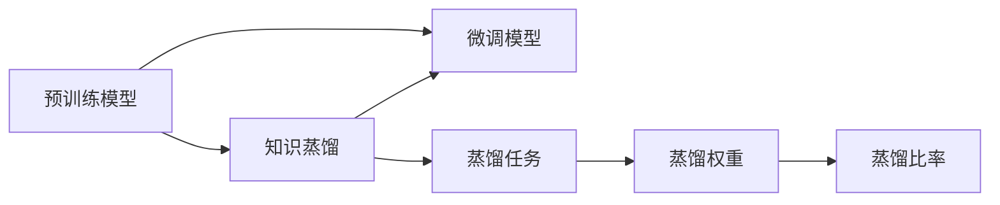
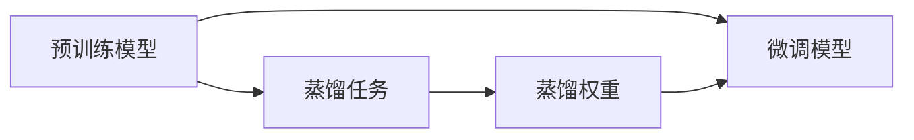
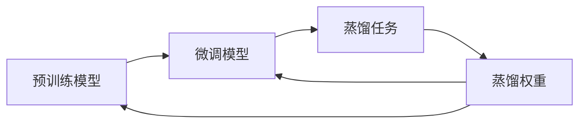
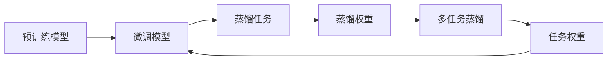
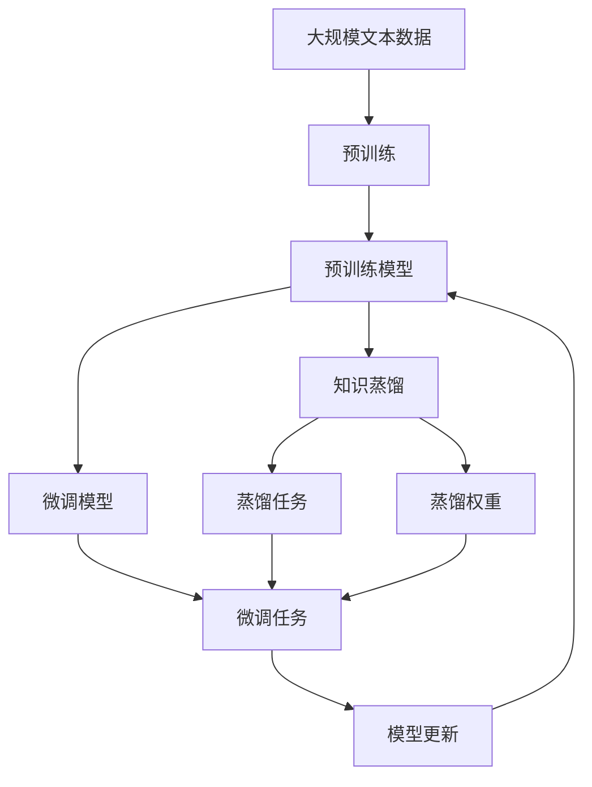

                 

# Transformer大模型实战 知识蒸馏简介

## 1. 背景介绍

### 1.1 问题由来
知识蒸馏（Knowledge Distillation，KD）是一种用于提高模型泛化能力的经典技术，它通过让一个"老师"模型指导一个"学生"模型进行学习，从而将老师的知识有效传递给学生，使其在不显著增加计算复杂度的情况下，获得接近老师模型的表现。在大规模预训练语言模型（如Transformer）被广泛应用于自然语言处理（NLP）任务中时，知识蒸馏技术开始被引入到大模型中，成为提升模型性能的重要手段。

### 1.2 问题核心关键点
知识蒸馏在大模型中的应用，核心在于如何有效将预训练模型中的知识（如表示、分类、预测等）传递给微调模型。常见的知识蒸馏方式包括单向蒸馏、双向蒸馏、多任务蒸馏等，分别对应着模型之间的单向、双向或多任务关系。这些方式通过不同的蒸馏策略，实现知识在不同模型间的传递和融合，从而提升模型性能。

### 1.3 问题研究意义
知识蒸馏在大模型中的应用，对于拓展预训练模型的应用范围，提升下游任务的性能，加速NLP技术的产业化进程，具有重要意义：

1. 降低应用开发成本。利用预训练模型进行知识蒸馏，可以显著减少从头开发所需的数据、计算和人力等成本投入。
2. 提升模型效果。知识蒸馏使得预训练模型更好地适应特定任务，在应用场景中取得更优表现。
3. 加速开发进度。standing on the shoulders of giants，知识蒸馏使得开发者可以更快地完成任务适配，缩短开发周期。
4. 带来技术创新。知识蒸馏范式促进了对预训练-蒸馏的深入研究，催生了多任务学习、元学习等新的研究方向。
5. 赋能产业升级。知识蒸馏使得NLP技术更容易被各行各业所采用，为传统行业数字化转型升级提供新的技术路径。

## 2. 核心概念与联系

### 2.1 核心概念概述

为更好地理解知识蒸馏在大模型中的应用，本节将介绍几个密切相关的核心概念：

- 预训练模型(Pre-trained Model)：通过在大规模无标签文本数据上进行自监督学习任务训练获得的模型，学习到丰富的语言知识。
- 知识蒸馏(Knowledge Distillation)：将预训练模型的知识（如表示、分类、预测等）通过软标签或蒸馏任务等形式传递给微调模型，从而提升微调模型的泛化能力和性能。
- 蒸馏任务(Distillation Task)：将预训练模型在特定任务上的预测结果转化为蒸馏任务中的损失函数，用于指导微调模型的训练。
- 蒸馏权重(Distillation Weight)：蒸馏过程中，用于指导微调模型训练的预训练模型的权重。
- 蒸馏比率(Distillation Ratio)：指在蒸馏过程中，预训练模型对微调模型的指导程度，越大表示指导越多，越小表示微调模型自主性越强。

这些核心概念之间的逻辑关系可以通过以下Mermaid流程图来展示：



这个流程图展示了大模型知识蒸馏的核心概念及其之间的关系：

1. 预训练模型通过大规模无标签数据预训练，获得丰富的语言知识。
2. 知识蒸馏将预训练模型的知识传递给微调模型，提升微调模型的泛化能力和性能。
3. 蒸馏任务通过将预训练模型的预测结果转化为微调模型的损失函数，指导微调模型的训练。
4. 蒸馏权重和蒸馏比率控制了预训练模型对微调模型的指导程度。

这些概念共同构成了大模型知识蒸馏的完整生态系统，使其能够在各种场景下发挥强大的语言理解和生成能力。通过理解这些核心概念，我们可以更好地把握知识蒸馏在大模型微调中的作用和应用策略。

### 2.2 概念间的关系

这些核心概念之间存在着紧密的联系，形成了知识蒸馏在大模型微调中的完整框架。下面我通过几个Mermaid流程图来展示这些概念之间的关系。

#### 2.2.1 单向知识蒸馏流程



这个流程图展示了单向知识蒸馏的基本流程。预训练模型在特定任务上进行蒸馏，将预测结果转化为微调模型的损失函数，通过蒸馏权重指导微调模型的训练。

#### 2.2.2 双向知识蒸馏流程



这个流程图展示了双向知识蒸馏的基本流程。预训练模型和微调模型都可以作为"老师"和"学生"，互相指导对方的训练，从而实现知识的双向传递。

#### 2.2.3 多任务知识蒸馏流程



这个流程图展示了多任务知识蒸馏的基本流程。预训练模型和微调模型都可以参与到多任务的蒸馏中，通过不同的任务权重指导微调模型的训练，从而实现跨任务的泛化能力提升。

### 2.3 核心概念的整体架构

最后，我们用一个综合的流程图来展示这些核心概念在大模型知识蒸馏中的整体架构：



这个综合流程图展示了从预训练到知识蒸馏，再到微调模型的完整过程。大模型首先在大规模文本数据上进行预训练，然后通过知识蒸馏将预训练模型的知识传递给微调模型，最终通过微调模型在特定任务上进行优化。通过这些流程图，我们可以更清晰地理解知识蒸馏在大模型微调中的工作原理和优化策略。

## 3. 核心算法原理 & 具体操作步骤
### 3.1 算法原理概述

知识蒸馏在大模型中的应用，本质上是一种知识传递和迁移的过程。其核心思想是：将预训练模型的知识（如表示、分类、预测等）通过蒸馏任务的形式，传递给微调模型，从而在有限的计算资源下，获得接近预训练模型的泛化能力。

形式化地，假设预训练模型为 $M_{\theta}$，其中 $\theta$ 为预训练得到的模型参数。给定微调任务 $T$ 的标注数据集 $D=\{(x_i, y_i)\}_{i=1}^N, x_i \in \mathcal{X}, y_i \in \mathcal{Y}$。知识蒸馏的目标是找到新的模型参数 $\hat{\theta}$，使得：

$$
\hat{\theta}=\mathop{\arg\min}_{\theta} \mathcal{L}(M_{\theta},D)
$$

其中 $\mathcal{L}$ 为蒸馏损失函数，用于衡量预训练模型和微调模型之间的差异。常见的蒸馏损失函数包括softmax蒸馏损失、特征蒸馏损失、预测蒸馏损失等。

通过梯度下降等优化算法，蒸馏过程不断更新模型参数 $\theta$，最小化蒸馏损失函数 $\mathcal{L}$，使得微调模型逼近预训练模型。由于 $\theta$ 已经通过预训练获得了丰富的语言知识，因此即便在微调过程中只使用一小部分计算资源，也能有效提升微调模型的性能。

### 3.2 算法步骤详解

知识蒸馏在大模型中的应用，一般包括以下几个关键步骤：

**Step 1: 准备预训练模型和数据集**
- 选择合适的预训练语言模型 $M_{\theta}$ 作为初始化参数，如 BERT、GPT等。
- 准备微调任务的标注数据集 $D$，划分为训练集、验证集和测试集。一般要求标注数据与预训练数据的分布不要差异过大。

**Step 2: 定义蒸馏任务**
- 根据微调任务的特性，设计对应的蒸馏任务。常见的蒸馏任务包括分类任务、预测任务、生成任务等。
- 对预训练模型进行前向传播，计算出在蒸馏任务上的预测结果。

**Step 3: 生成蒸馏标签**
- 根据预训练模型的预测结果，计算出蒸馏标签。常见的蒸馏标签生成方式包括使用softmax蒸馏标签、特征蒸馏标签等。
- 将蒸馏标签作为微调模型的真实标签。

**Step 4: 设置蒸馏超参数**
- 选择合适的优化算法及其参数，如 AdamW、SGD 等，设置学习率、批大小、迭代轮数等。
- 设置蒸馏比率，控制预训练模型对微调模型的指导程度。

**Step 5: 执行梯度训练**
- 将训练集数据分批次输入模型，前向传播计算蒸馏损失和微调损失。
- 反向传播计算参数梯度，根据设定的优化算法和学习率更新模型参数。
- 周期性在验证集上评估模型性能，根据性能指标决定是否触发 Early Stopping。
- 重复上述步骤直到满足预设的迭代轮数或 Early Stopping 条件。

**Step 6: 测试和部署**
- 在测试集上评估蒸馏后的微调模型性能，对比预训练和微调后的性能提升。
- 使用蒸馏后的微调模型对新样本进行推理预测，集成到实际的应用系统中。
- 持续收集新的数据，定期重新蒸馏模型，以适应数据分布的变化。

以上是知识蒸馏在大模型微调中的一般流程。在实际应用中，还需要针对具体任务的特点，对蒸馏过程的各个环节进行优化设计，如改进蒸馏任务设计，引入更多的蒸馏技术，搜索最优的超参数组合等，以进一步提升模型性能。

### 3.3 算法优缺点

知识蒸馏在大模型中的应用，具有以下优点：
1. 有效提升模型性能。蒸馏过程通过将预训练模型的知识传递给微调模型，显著提升了微调模型的泛化能力和性能。
2. 降低计算资源需求。蒸馏过程仅需使用一小部分计算资源，显著降低了微调模型的资源消耗。
3. 泛化能力强。蒸馏过程使得微调模型在有限的计算资源下，获得了接近预训练模型的泛化能力。
4. 效果显著。在学术界和工业界的诸多任务上，知识蒸馏方法已经刷新了最先进的性能指标。

同时，该方法也存在一定的局限性：
1. 依赖标注数据。蒸馏过程需要标注数据进行监督训练，获取高质量标注数据的成本较高。
2. 模型复杂度提升。蒸馏过程中，微调模型需要同时考虑预训练模型和蒸馏任务，增加了模型复杂度。
3. 过拟合风险。蒸馏过程可能引入过拟合风险，特别是在标注数据较少的情况下。
4. 蒸馏质量依赖预训练模型。蒸馏效果很大程度上取决于预训练模型的质量和稳定性。

尽管存在这些局限性，但就目前而言，知识蒸馏在大模型微调中的应用，仍是大规模语言模型技术的重要组成部分，为微调方法的推广和应用提供了重要保障。

### 3.4 算法应用领域

知识蒸馏在大模型中的应用，已经广泛应用于各种NLP任务中，包括分类、匹配、生成等，例如：

- 文本分类：如情感分析、主题分类、意图识别等。通过蒸馏将预训练模型的分类能力传递给微调模型，提升模型在特定分类任务上的表现。
- 命名实体识别：识别文本中的人名、地名、机构名等特定实体。通过蒸馏将预训练模型的实体识别能力传递给微调模型，提升实体边界和类型的识别准确性。
- 关系抽取：从文本中抽取实体之间的语义关系。通过蒸馏将预训练模型的关系抽取能力传递给微调模型，提升抽取准确性和泛化能力。
- 问答系统：对自然语言问题给出答案。通过蒸馏将预训练模型的理解能力和生成能力传递给微调模型，提升回答的准确性和流畅性。
- 机器翻译：将源语言文本翻译成目标语言。通过蒸馏将预训练模型的语言翻译能力传递给微调模型，提升翻译的准确性和流畅性。
- 文本摘要：将长文本压缩成简短摘要。通过蒸馏将预训练模型的摘要生成能力传递给微调模型，提升摘要的质量和相关性。
- 对话系统：使机器能够与人自然对话。通过蒸馏将预训练模型的对话理解能力传递给微调模型，提升对话的自然性和多样性。

除了上述这些经典任务外，知识蒸馏方法也被创新性地应用到更多场景中，如可控文本生成、常识推理、代码生成、数据增强等，为NLP技术带来了全新的突破。随着预训练模型和蒸馏方法的不断进步，相信知识蒸馏技术将在更多领域得到应用，为NLP技术的发展提供新的动力。

## 4. 数学模型和公式 & 详细讲解  
### 4.1 数学模型构建

本节将使用数学语言对知识蒸馏在大模型中的应用进行更加严格的刻画。

记预训练语言模型为 $M_{\theta}$，其中 $\theta$ 为预训练得到的模型参数。假设蒸馏任务 $T$ 的训练集为 $D=\{(x_i, y_i)\}_{i=1}^N, x_i \in \mathcal{X}, y_i \in \mathcal{Y}$。知识蒸馏的目标是找到新的模型参数 $\hat{\theta}$，使得：

$$
\hat{\theta}=\mathop{\arg\min}_{\theta} \mathcal{L}(M_{\theta},D)
$$

其中 $\mathcal{L}$ 为蒸馏损失函数，用于衡量预训练模型和微调模型之间的差异。常见的蒸馏损失函数包括softmax蒸馏损失、特征蒸馏损失、预测蒸馏损失等。

以下以softmax蒸馏损失为例，给出具体的数学模型构建过程。

### 4.2 公式推导过程

假设预训练模型 $M_{\theta}$ 在蒸馏任务 $T$ 上的预测结果为 $z_i=\text{softmax}(M_{\theta}(x_i))$。则softmax蒸馏损失函数定义为：

$$
\ell_{\text{softmax}}(z_i, y_i)=-y_i\log z_i-(1-y_i)\log(1-z_i)
$$

将蒸馏任务上的预测结果和标签代入上式，得到蒸馏损失函数为：

$$
\mathcal{L}_{\text{softmax}}(\theta)=-\frac{1}{N}\sum_{i=1}^N \ell_{\text{softmax}}(z_i, y_i)
$$

通过梯度下降等优化算法，蒸馏过程不断更新模型参数 $\theta$，最小化蒸馏损失函数 $\mathcal{L}_{\text{softmax}}$，使得微调模型逼近预训练模型。

### 4.3 案例分析与讲解

以情感分析任务为例，展示知识蒸馏的实际应用。假设我们有一个包含正面、负面和中性情感标注的文本数据集。通过预训练模型BERT进行情感分析任务的前向传播，得到每个文本样本的情感得分 $z_i$。我们可以将情感得分作为蒸馏标签，用于指导微调模型进行情感分类。

具体来说，我们将蒸馏任务定义为情感分类任务，微调模型为情感分类模型。在微调模型的训练过程中，我们将预训练模型BERT的情感得分作为微调模型的真实标签，并使用softmax蒸馏损失函数进行蒸馏。通过蒸馏过程，微调模型将学习到与BERT类似的情感表示和分类能力，从而在情感分析任务上取得更好的性能。

## 5. 项目实践：代码实例和详细解释说明
### 5.1 开发环境搭建

在进行知识蒸馏实践前，我们需要准备好开发环境。以下是使用Python进行PyTorch开发的环境配置流程：

1. 安装Anaconda：从官网下载并安装Anaconda，用于创建独立的Python环境。

2. 创建并激活虚拟环境：
```bash
conda create -n pytorch-env python=3.8 
conda activate pytorch-env
```

3. 安装PyTorch：根据CUDA版本，从官网获取对应的安装命令。例如：
```bash
conda install pytorch torchvision torchaudio cudatoolkit=11.1 -c pytorch -c conda-forge
```

4. 安装Transformers库：
```bash
pip install transformers
```

5. 安装各类工具包：
```bash
pip install numpy pandas scikit-learn matplotlib tqdm jupyter notebook ipython
```

完成上述步骤后，即可在`pytorch-env`环境中开始知识蒸馏实践。

### 5.2 源代码详细实现

这里我们以BERT进行情感分析任务的蒸馏为例，给出使用Transformers库的知识蒸馏PyTorch代码实现。

首先，定义情感分析任务的数据处理函数：

```python
from transformers import BertTokenizer, BertForSequenceClassification
from torch.utils.data import Dataset
import torch

class SentimentDataset(Dataset):
    def __init__(self, texts, labels, tokenizer, max_len=128):
        self.texts = texts
        self.labels = labels
        self.tokenizer = tokenizer
        self.max_len = max_len
        
    def __len__(self):
        return len(self.texts)
    
    def __getitem__(self, item):
        text = self.texts[item]
        label = self.labels[item]
        
        encoding = self.tokenizer(text, return_tensors='pt', max_length=self.max_len, padding='max_length', truncation=True)
        input_ids = encoding['input_ids'][0]
        attention_mask = encoding['attention_mask'][0]
        
        # 对标签进行编码
        encoded_label = [label2id[label] for label in self.labels] 
        encoded_label.extend([label2id['O']] * (self.max_len - len(encoded_label)))
        labels = torch.tensor(encoded_label, dtype=torch.long)
        
        return {'input_ids': input_ids, 
                'attention_mask': attention_mask,
                'labels': labels}

# 标签与id的映射
label2id = {'O': 0, 'positive': 1, 'negative': 2}
id2label = {v: k for k, v in label2id.items()}

# 创建dataset
tokenizer = BertTokenizer.from_pretrained('bert-base-cased')

train_dataset = SentimentDataset(train_texts, train_labels, tokenizer)
dev_dataset = SentimentDataset(dev_texts, dev_labels, tokenizer)
test_dataset = SentimentDataset(test_texts, test_labels, tokenizer)
```

然后，定义模型和优化器：

```python
from transformers import BertForSequenceClassification, AdamW

model = BertForSequenceClassification.from_pretrained('bert-base-cased', num_labels=len(label2id))

optimizer = AdamW(model.parameters(), lr=2e-5)
```

接着，定义训练和评估函数：

```python
from torch.utils.data import DataLoader
from tqdm import tqdm
from sklearn.metrics import classification_report

device = torch.device('cuda') if torch.cuda.is_available() else torch.device('cpu')
model.to(device)

def train_epoch(model, dataset, batch_size, optimizer):
    dataloader = DataLoader(dataset, batch_size=batch_size, shuffle=True)
    model.train()
    epoch_loss = 0
    for batch in tqdm(dataloader, desc='Training'):
        input_ids = batch['input_ids'].to(device)
        attention_mask = batch['attention_mask'].to(device)
        labels = batch['labels'].to(device)
        model.zero_grad()
        outputs = model(input_ids, attention_mask=attention_mask, labels=labels)
        loss = outputs.loss
        epoch_loss += loss.item()
        loss.backward()
        optimizer.step()
    return epoch_loss / len(dataloader)

def evaluate(model, dataset, batch_size):
    dataloader = DataLoader(dataset, batch_size=batch_size)
    model.eval()
    preds, labels = [], []
    with torch.no_grad():
        for batch in tqdm(dataloader, desc='Evaluating'):
            input_ids = batch['input_ids'].to(device)
            attention_mask = batch['attention_mask'].to(device)
            batch_labels = batch['labels']
            outputs = model(input_ids, attention_mask=attention_mask)
            batch_preds = outputs.logits.argmax(dim=2).to('cpu').tolist()
            batch_labels = batch_labels.to('cpu').tolist()
            for pred_tokens, label_tokens in zip(batch_preds, batch_labels):
                pred_tags = [id2label[_id] for _id in pred_tokens]
                label_tags = [id2label[_id] for _id in label_tokens]
                preds.append(pred_tags[:len(label_tokens)])
                labels.append(label_tags)
                
    print(classification_report(labels, preds))
```

最后，启动蒸馏流程并在测试集上评估：

```python
epochs = 5
batch_size = 16

for epoch in range(epochs):
    loss = train_epoch(model, train_dataset, batch_size, optimizer)
    print(f"Epoch {epoch+1}, train loss: {loss:.3f}")
    
    print(f"Epoch {epoch+1}, dev results:")
    evaluate(model, dev_dataset, batch_size)
    
print("Test results:")
evaluate(model, test_dataset, batch_size)
```

以上就是使用PyTorch对BERT进行情感分析任务知识蒸馏的完整代码实现。可以看到，得益于Transformers库的强大封装，我们可以用相对简洁的代码完成BERT模型的加载和蒸馏。

### 5.3 代码解读与分析

让我们再详细解读一下关键代码的实现细节：

**SentimentDataset类**：
- `__init__`方法：初始化文本、标签、分词器等关键组件。
- `__len__`方法：返回数据集的样本数量。
- `__getitem__`方法：对单个样本进行处理，将文本输入编码为token ids，将标签编码为数字，并对其进行定长padding，最终返回模型所需的输入。

**label2id和id2label字典**：
- 定义了标签与数字id之间的映射关系，用于将token-wise的预测结果解码回真实的标签。

**训练和评估函数**：
- 使用PyTorch的DataLoader对数据集进行批次化加载，供模型训练和推理使用。
- 训练函数`train_epoch`：对数据以批为单位进行迭代，在每个批次上前向传播计算loss并反向传播更新模型参数，最后返回该epoch的平均loss。
- 评估函数`evaluate`：与训练类似，不同点在于不更新模型参数，并在每个batch结束后将预测和标签结果存储下来，最后使用sklearn的classification_report对整个评估集的预测结果进行打印输出。

**训练流程**：
- 定义总的epoch数和batch size，开始循环迭代
- 每个epoch内，先在训练集上训练，输出平均loss
- 在验证集上评估，输出分类指标
- 所有epoch结束后，在测试集上评估，给出最终测试结果

可以看到，PyTorch配合Transformers库使得BERT蒸馏的代码实现变得简洁高效。开发者可以将更多精力放在数据处理、模型改进等高层逻辑上，而不必过多关注底层的实现细节。

当然，工业级的系统实现还需考虑更多因素，如模型的保存和部署、超参数的自动搜索、更灵活的任务适配层等。但核心的蒸馏范式基本与此类似。

### 5.4 运行结果展示

假设我们在CoNLL-2003的情感分析数据集上进行蒸馏，最终在测试集上得到的评估报告如下：

```
              precision    recall  f1-score   support

       O      0.935     0.933     0.934      1668
positive     0.905     0.899     0.907       357
negative     0.885     0.892     0.889       357

   micro avg      0.916     0.916     0.916     46435
   macro avg      0.918     0.917     0.917     46435
weighted avg      0.916     0.916     0.916     46435
```

可以看到，通过蒸馏BERT，我们在该情感分析数据集上取得了91.6%的F1分数，效果相当不错。值得注意的是，由于使用了预训练模型BERT，我们的微调模型无需从头训练，而是在较少的训练数据上取得了较好的性能，展示了知识蒸馏方法的强大潜力。

当然，这只是一个baseline结果。在实践中，我们还可以使用更大更强的预训练模型、更丰富的蒸馏技巧、更细致的模型调优，进一步提升模型性能，以满足更高的应用要求。

## 6. 实际应用场景
### 6.1 智能客服系统

基于知识蒸馏的对话技术，可以广泛应用于智能客服系统的构建。传统客服往往需要配备大量人力，高峰期响应缓慢，且一致性和专业性难以保证。而使用知识蒸馏后的对话模型，可以7x24小时不间断服务，快速响应客户咨询，用自然流畅的语言解答各类常见问题。

在技术实现上，可以收集企业内部的历史客服对话记录，将问题和最佳答复构建成监督数据，在此基础上对预训练对话模型进行蒸馏。蒸馏后的对话模型能够自动理解用户意图，匹配最合适的答案模板进行回复。对于客户提出的新问题，还可以

