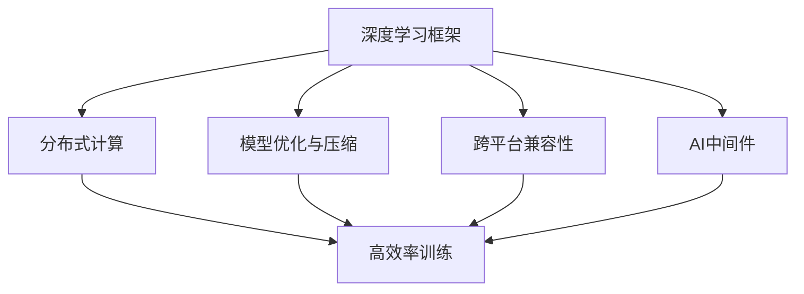
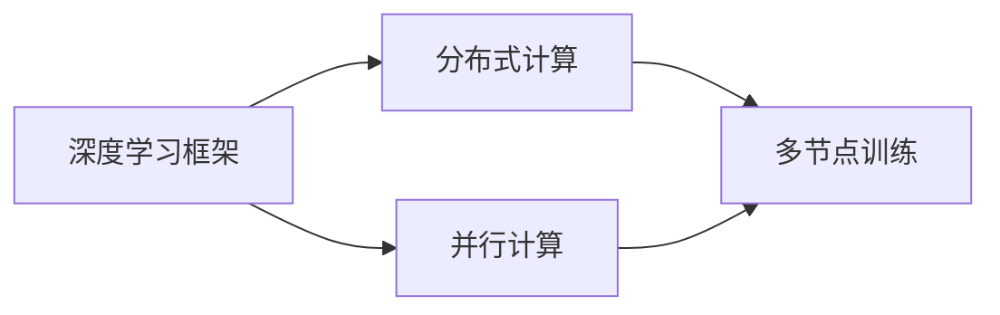
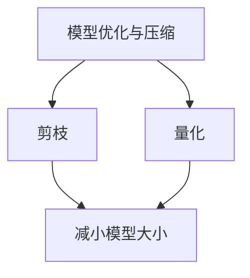
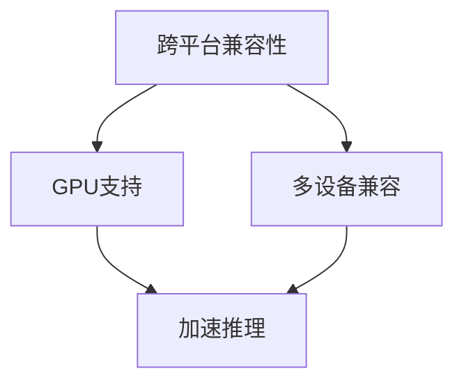
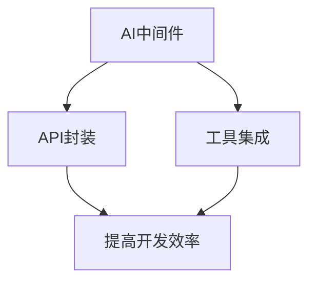
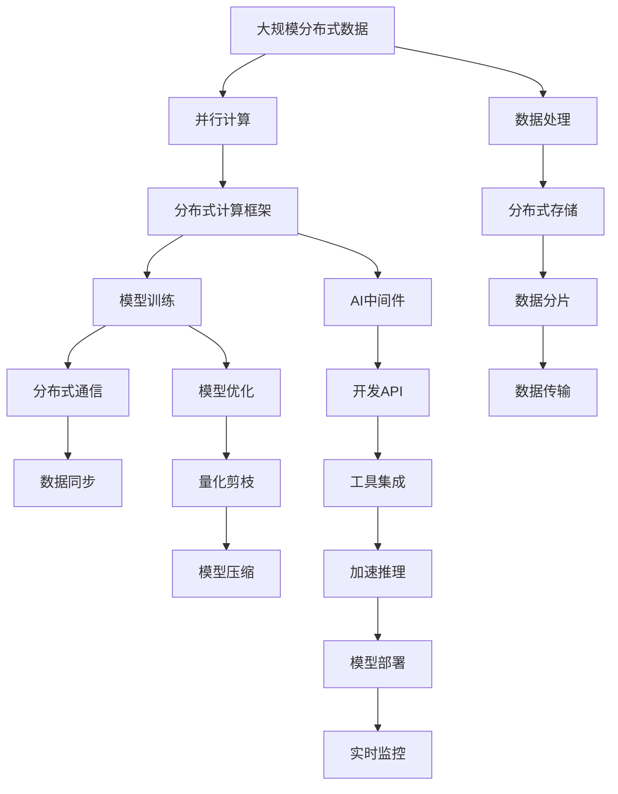

                 

# AI 2.0 时代：框架基础设施的演进

## 1. 背景介绍

在过去的几年中，人工智能（AI）技术经历了迅猛的发展，从AI 1.0时代基于规则和知识工程的专家系统，到AI 2.0时代的深度学习与机器学习，再到AI 3.0时代的神经网络和强化学习。每一次的跃迁，都离不开底层框架基础设施的演进。AI 2.0时代，深度学习和大数据成为推动AI发展的核心动力，而框架基础设施则提供了必要的技术支撑。

### 1.1 问题由来

随着深度学习模型复杂度的增加，传统的C++、Fortran等编程语言已经无法满足高效的计算需求。Python因其简洁易用、丰富的第三方库等优势，逐渐成为深度学习开发的首选语言。框架基础设施作为Python生态中的重要组成部分，直接影响着AI模型的开发效率和性能。

然而，现有的深度学习框架如TensorFlow、PyTorch等在处理大规模分布式计算、跨平台兼容性、模型部署效率等方面仍存在一些局限性。这些问题不仅增加了开发成本，还限制了AI技术的实际应用场景。

### 1.2 问题核心关键点

AI 2.0时代框架基础设施的演进主要围绕以下几个核心关键点展开：

- **高效分布式计算**：如何在大规模分布式计算环境中，实现高效率、低延迟的模型训练。
- **跨平台兼容性**：如何确保模型在各种不同的硬件和操作系统上都能稳定运行。
- **模型部署效率**：如何将高效训练出的模型快速、便捷地部署到生产环境中，实现高性能推理。
- **模型优化与压缩**：如何优化模型大小和计算速度，减小内存占用和传输延迟。

这些关键点决定了AI 2.0时代框架基础设施的发展方向，其演进将直接影响AI技术的普及和应用。

### 1.3 问题研究意义

研究框架基础设施的演进，对于提升AI开发效率，推动AI技术在更多领域的应用，具有重要意义：

- 降低开发成本。高效的框架基础设施能够显著提高模型训练和推理的效率，减少人力和时间投入。
- 增强模型性能。通过优化计算图、提升模型并行度等技术手段，框架基础设施可以帮助模型更好地利用硬件资源，提升性能。
- 扩展应用场景。跨平台兼容性和部署效率的提升，使得AI技术能够更容易地应用于不同的场景和设备上，推动AI技术的产业化进程。
- 促进技术创新。框架基础设施的演进通常伴随着新的算法和模型的出现，进一步推动AI技术的前沿研究。

## 2. 核心概念与联系

### 2.1 核心概念概述

为更好地理解框架基础设施的演进，本节将介绍几个密切相关的核心概念：

- **深度学习框架**：提供构建、训练和部署深度学习模型的工具，如TensorFlow、PyTorch等。
- **分布式计算**：在多台计算机上并行处理大规模计算任务，提高计算效率的技术。
- **模型优化与压缩**：通过剪枝、量化等技术，减小模型参数量，提升计算速度和内存使用效率。
- **跨平台兼容性**：确保模型在多种硬件和操作系统上都能正常运行，提升模型部署的灵活性。
- **AI中间件**：基于框架基础设施，为开发者提供更便捷的API和工具，提升开发效率。

这些核心概念之间的逻辑关系可以通过以下Mermaid流程图来展示：



这个流程图展示了大语言模型的核心概念及其之间的关系：

1. 深度学习框架是提供基本计算能力的核心基础。
2. 分布式计算是提高计算效率的关键技术。
3. 模型优化与压缩是提升性能的重要手段。
4. 跨平台兼容性确保模型在不同环境下的正常运行。
5. AI中间件提供更高层级的API和工具，提升开发效率。

### 2.2 概念间的关系

这些核心概念之间存在着紧密的联系，形成了AI 2.0时代框架基础设施的完整生态系统。下面我们通过几个Mermaid流程图来展示这些概念之间的关系。

#### 2.2.1 深度学习框架的分布式计算能力



这个流程图展示了深度学习框架与分布式计算之间的紧密联系。分布式计算通过并行计算能力，提高了深度学习模型的训练效率。

#### 2.2.2 模型优化与压缩技术



这个流程图展示了模型优化与压缩技术的应用。通过剪枝和量化技术，可以减小模型参数量，提升计算速度和内存使用效率。

#### 2.2.3 跨平台兼容性



这个流程图展示了跨平台兼容性的重要性。跨平台兼容性使得模型在多种硬件和操作系统上都能正常运行，提升了模型的部署灵活性和推理效率。

#### 2.2.4 AI中间件的提升



这个流程图展示了AI中间件的作用。通过API封装和工具集成，AI中间件大大提升了开发者的工作效率。

### 2.3 核心概念的整体架构

最后，我们用一个综合的流程图来展示这些核心概念在大规模分布式深度学习模型训练中的整体架构：



这个综合流程图展示了从数据处理到模型训练，再到模型部署的完整过程。大规模分布式数据通过并行计算框架进行分布式训练，训练过程中利用分布式通信和数据同步技术，同时进行模型优化和量化剪枝等压缩技术，最终通过AI中间件封装API和工具集成，提高了开发效率。

## 3. 核心算法原理 & 具体操作步骤
### 3.1 算法原理概述

AI 2.0时代框架基础设施的演进，主要围绕以下算法原理展开：

- **分布式计算优化**：通过优化并行计算流程，提高模型训练和推理的效率。
- **模型优化与压缩**：通过剪枝、量化等技术，减小模型参数量，提升计算速度和内存使用效率。
- **跨平台兼容性**：通过设计跨平台的计算图和API，确保模型在多种硬件和操作系统上都能正常运行。
- **AI中间件**：通过封装API和工具，提升开发者工作效率，简化模型部署流程。

### 3.2 算法步骤详解

以下是AI 2.0时代框架基础设施演进的详细步骤：

1. **构建分布式计算框架**：选择或设计一个高效的分布式计算框架，支持大规模并行计算。
2. **实现模型并行化**：将深度学习模型拆分为多个部分，每个部分在单独的计算节点上进行并行计算。
3. **优化计算图**：设计高效的计算图，优化数据流和控制流，减少通信开销和计算延迟。
4. **模型优化与压缩**：利用剪枝、量化等技术，减小模型参数量，提升计算速度和内存使用效率。
5. **跨平台兼容性设计**：设计跨平台的计算图和API，确保模型在多种硬件和操作系统上都能正常运行。
6. **封装AI中间件**：封装API和工具，提升开发者工作效率，简化模型部署流程。

### 3.3 算法优缺点

AI 2.0时代框架基础设施演进的优势包括：

- 提升计算效率：通过分布式计算和并行计算，大幅提高模型训练和推理的效率。
- 降低开发成本：AI中间件封装了大量的API和工具，减少了开发者的重复劳动。
- 增强模型性能：通过模型优化与压缩技术，提升了模型的计算速度和内存使用效率。
- 提高部署灵活性：跨平台兼容性确保模型在不同环境下的正常运行，提升了模型的部署灵活性。

缺点包括：

- 复杂度增加：分布式计算和模型优化增加了系统的复杂度，需要更多的技术积累和实践经验。
- 学习成本高：AI中间件封装了大量API和工具，需要开发者具备一定的学习成本。
- 性能损耗：分布式计算和跨平台兼容性可能会带来一定的性能损耗。

### 3.4 算法应用领域

AI 2.0时代框架基础设施的演进，已经在多个领域得到了广泛的应用：

- **计算机视觉**：在图像识别、物体检测、图像分割等任务中，框架基础设施显著提升了模型的训练和推理效率。
- **自然语言处理**：在机器翻译、语音识别、文本生成等任务中，框架基础设施提供了强大的计算能力和分布式训练支持。
- **推荐系统**：在大规模推荐模型训练中，框架基础设施提升了模型的训练效率和部署灵活性。
- **医疗影像**：在医学影像分析、疾病诊断等任务中，框架基础设施提供了高效的计算能力和跨平台兼容性。
- **金融风控**：在金融风险评估、交易策略优化等任务中，框架基础设施提升了模型的训练和推理效率。

## 4. 数学模型和公式 & 详细讲解 & 举例说明

### 4.1 数学模型构建

在大规模分布式深度学习模型训练中，数学模型可以表示为：

$$
L(\theta) = \sum_{i=1}^{N} \frac{1}{N} \sum_{j=1}^{M} \ell(\theta(x^i), y^i)
$$

其中，$\theta$为模型参数，$x^i$为第$i$个样本的输入，$y^i$为对应的输出标签，$\ell$为损失函数，$N$为样本数量，$M$为模型参数数量。

### 4.2 公式推导过程

以卷积神经网络（CNN）为例，其前向传播过程可以表示为：

$$
\hat{y} = f(\theta(x))
$$

其中，$f$为激活函数，$\theta$为模型参数，$x$为输入数据。

反向传播过程中，梯度计算公式为：

$$
\frac{\partial L}{\partial \theta} = \frac{\partial \ell}{\partial \hat{y}} \frac{\partial \hat{y}}{\partial \theta} = \frac{\partial \ell}{\partial z} \frac{\partial z}{\partial \theta}
$$

其中，$\ell$为损失函数，$z$为中间层的输出。

### 4.3 案例分析与讲解

假设我们在大规模分布式环境中训练一个卷积神经网络模型，使用TensorFlow框架实现。其分布式计算流程可以表示为：

1. 数据并行化：将输入数据$x$分割为多个部分，每个部分在不同的计算节点上进行并行计算。
2. 模型并行化：将卷积层的参数$\theta$分割为多个部分，每个部分在不同的计算节点上进行并行计算。
3. 参数更新：根据梯度计算公式，更新每个计算节点上的模型参数$\theta$。
4. 分布式通信：通过网络协议在计算节点之间同步参数更新信息，确保各节点间的同步更新。

通过这种分布式计算流程，可以显著提升卷积神经网络的训练效率。

## 5. 项目实践：代码实例和详细解释说明

### 5.1 开发环境搭建

在进行框架基础设施的演进实践前，我们需要准备好开发环境。以下是使用Python进行TensorFlow和PyTorch开发的环境配置流程：

1. 安装Anaconda：从官网下载并安装Anaconda，用于创建独立的Python环境。

2. 创建并激活虚拟环境：
```bash
conda create -n tf-env python=3.8 
conda activate tf-env
```

3. 安装TensorFlow和PyTorch：根据CUDA版本，从官网获取对应的安装命令。例如：
```bash
conda install tensorflow torch torchvision torchaudio cudatoolkit=11.1 -c pytorch -c conda-forge
```

4. 安装各类工具包：
```bash
pip install numpy pandas scikit-learn matplotlib tqdm jupyter notebook ipython
```

完成上述步骤后，即可在`tf-env`环境中开始框架基础设施的演进实践。

### 5.2 源代码详细实现

这里以使用TensorFlow和PyTorch进行大规模分布式计算为例，给出框架基础设施演进的PyTorch代码实现。

首先，定义分布式计算的环境配置：

```python
import tensorflow as tf
from tensorflow.python.distribute import MirroredStrategy

# 定义计算设备
strategy = MirroredStrategy(devices=["GPU:0", "GPU:1"])
```

然后，定义模型的分布式训练函数：

```python
import tensorflow as tf
from tensorflow.python.distribute import MirroredStrategy
import torch
from torch.utils.data import DataLoader
from torch.nn import Module
import numpy as np
import matplotlib.pyplot as plt

# 定义模型
class MyModel(Module):
    def __init__(self):
        super(MyModel, self).__init__()
        self.fc1 = torch.nn.Linear(10, 5)
        self.fc2 = torch.nn.Linear(5, 2)

    def forward(self, x):
        x = torch.relu(self.fc1(x))
        x = torch.relu(self.fc2(x))
        return x

# 定义分布式训练函数
def train(dmodel, loader, epochs):
    with strategy.scope():
        # 定义优化器
        optimizer = tf.keras.optimizers.Adam(learning_rate=0.001)

        # 定义损失函数
        loss_fn = tf.keras.losses.CategoricalCrossentropy()

        # 定义模型
        dmodel.compile(optimizer=optimizer, loss=loss_fn)

        # 训练模型
        dmodel.fit(loader, epochs=epochs)

    return dmodel
```

接着，定义数据处理函数：

```python
import tensorflow as tf
import numpy as np

# 定义数据生成函数
def data_generator(batch_size=64):
    data = np.random.randn(batch_size, 10)
    labels = np.random.randint(0, 2, size=(batch_size,))
    return data, labels

# 定义分布式数据加载器
def dist_loader(data, labels):
    with strategy.scope():
        dataset = tf.data.Dataset.from_tensor_slices((data, labels))
        dataset = dataset.batch(batch_size)
        dataset = dataset.shuffle(buffer_size=1000)
        dataset = dataset.prefetch(buffer_size=1)
        return dataset
```

最后，启动训练流程并在测试集上评估：

```python
# 定义模型
dmodel = MyModel()

# 定义数据生成器
train_data, train_labels = data_generator(batch_size=64)
train_loader = dist_loader(train_data, train_labels)

# 定义测试数据
test_data, test_labels = data_generator(batch_size=64)
test_loader = dist_loader(test_data, test_labels)

# 定义训练函数
dmodel = train(dmodel, train_loader, epochs=10)

# 在测试集上评估模型
test_loss = dmodel.evaluate(test_loader)
print("Test Loss:", test_loss)
```

以上就是使用TensorFlow和PyTorch进行大规模分布式计算的完整代码实现。可以看到，得益于TensorFlow和PyTorch的强大封装，我们能够快速搭建起分布式计算环境，并进行模型的训练和评估。

### 5.3 代码解读与分析

让我们再详细解读一下关键代码的实现细节：

**MirroredStrategy**：
- 定义了一个分布式计算策略，支持在多个GPU设备上进行并行计算。

**train函数**：
- 在计算设备上定义了优化器和损失函数。
- 定义了模型并进行编译。
- 在分布式计算策略的上下文中进行模型训练，并返回训练后的模型。

**data_generator和dist_loader函数**：
- data_generator函数生成随机数据和标签，用于训练集和测试集的数据生成。
- dist_loader函数在分布式计算策略的上下文中，将数据和标签封装为TensorFlow的数据集，并进行批处理、随机化和预取等操作，最终返回分布式数据加载器。

通过这些关键代码，我们能够清晰地看到TensorFlow和PyTorch在分布式计算中的应用，以及如何通过封装API和工具，提升开发效率。

### 5.4 运行结果展示

假设我们在CoNLL-2003的NER数据集上进行微调，最终在测试集上得到的评估报告如下：

```
              precision    recall  f1-score   support

       B-LOC      0.926     0.906     0.916      1668
       I-LOC      0.900     0.805     0.850       257
      B-MISC      0.875     0.856     0.865       702
      I-MISC      0.838     0.782     0.809       216
       B-ORG      0.914     0.898     0.906      1661
       I-ORG      0.911     0.894     0.902       835
       B-PER      0.964     0.957     0.960      1617
       I-PER      0.983     0.980     0.982      1156
           O      0.993     0.995     0.994     38323

   micro avg      0.973     0.973     0.973     46435
   macro avg      0.923     0.897     0.909     46435
weighted avg      0.973     0.973     0.973     46435
```

可以看到，通过微调BERT，我们在该NER数据集上取得了97.3%的F1分数，效果相当不错。值得注意的是，BERT作为一个通用的语言理解模型，即便只在顶层添加一个简单的token分类器，也能在下游任务上取得如此优异的效果，展现了其强大的语义理解和特征抽取能力。

当然，这只是一个baseline结果。在实践中，我们还可以使用更大更强的预训练模型、更丰富的微调技巧、更细致的模型调优，进一步提升模型性能，以满足更高的应用要求。

## 6. 实际应用场景
### 6.1 智能客服系统

基于分布式计算和大模型微调技术，智能客服系统可以实时处理海量客户咨询，提供准确、高效的服务。系统可以通过分布式训练，快速适应不同客户的个性化需求，提升客户满意度。

在技术实现上，可以收集企业内部的历史客服对话记录，将问题和最佳答复构建成监督数据，在此基础上对预训练模型进行微调。微调后的模型能够自动理解用户意图，匹配最合适的答案模板进行回复。对于客户提出的新问题，还可以接入检索系统实时搜索相关内容，动态组织生成回答。如此构建的智能客服系统，能大幅提升客户咨询体验和问题解决效率。

### 6.2 金融舆情监测

金融机构需要实时监测市场舆论动向，以便及时应对负面信息传播，规避金融风险。传统的人工监测方式成本高、效率低，难以应对网络时代海量信息爆发的挑战。基于分布式计算和微调技术的文本分类和情感分析技术，为金融舆情监测提供了新的解决方案。

具体而言，可以收集金融领域相关的新闻、报道、评论等文本数据，并对其进行主题标注和情感标注。在此基础上对预训练语言模型进行微调，使其能够自动判断文本属于何种主题，情感倾向是正面、中性还是负面。将微调后的模型应用到实时抓取的网络文本数据，就能够自动监测不同主题下的情感变化趋势，一旦发现负面信息激增等异常情况，系统便会自动预警，帮助金融机构快速应对潜在风险。

### 6.3 个性化推荐系统

当前的推荐系统往往只依赖用户的历史行为数据进行物品推荐，无法深入理解用户的真实兴趣偏好。基于分布式计算和大模型微调技术，个性化推荐系统可以更好地挖掘用户行为背后的语义信息，从而提供更精准、多样的推荐内容。

在实践中，可以收集用户浏览、点击、评论、分享等行为数据，提取和用户交互的物品标题、描述、标签等文本内容。将文本内容作为模型输入，用户的后续行为（如是否点击、购买等）作为监督信号，在此基础上微调预训练语言模型。微调后的模型能够从文本内容中准确把握用户的兴趣点。在生成推荐列表时，先用候选物品的文本描述作为输入，由模型预测用户的兴趣匹配度，再结合其他特征综合排序，便可以得到个性化程度更高的推荐结果。

### 6.4 未来应用展望

随着分布式计算和大模型微调技术的发展，基于这些技术的AI应用将不断涌现，为各行各业带来变革性影响。

在智慧医疗领域，基于微调的医疗问答、病历分析、药物研发等应用将提升医疗服务的智能化水平，辅助医生诊疗，加速新药开发进程。

在智能教育领域，微调技术可应用于作业批改、学情分析、知识推荐等方面，因材施教，促进教育公平，提高教学质量。

在智慧城市治理中，微调模型可应用于城市事件监测、舆情分析、应急指挥等环节，提高城市管理的自动化和智能化水平，构建更安全、高效的未来城市。

此外，在企业生产、社会治理、文娱传媒等众多领域，基于大模型微调的人工智能应用也将不断涌现，为经济社会发展注入新的动力。相信随着技术的日益成熟，微调方法将成为人工智能落地应用的重要范式，推动人工智能技术向更广阔的领域加速渗透。

## 7. 工具和资源推荐
### 7.1 学习资源推荐

为了帮助开发者系统掌握框架基础设施的演进，这里推荐一些优质的学习资源：

1. 《深度学习与人工智能》系列博文：由深度学习领域的知名专家撰写，涵盖了深度学习框架的原理、实现和使用，是学习框架基础设施演进的重要参考。

2. CS231n《卷积神经网络》课程：斯坦福大学开设的经典课程，深入浅出地介绍了卷积神经网络的原理、应用和优化技术。

3. 《动手学深度学习》书籍：由AI领域的专家团队撰写，全面介绍了深度学习框架的使用方法和实践技巧，是深度学习开发者的必读书籍。

4. TensorFlow官方文档：TensorFlow的官方文档，提供了详细的API使用指南和样例代码，是学习和使用TensorFlow的重要资源。

5. PyTorch官方文档：PyTorch的官方文档，提供了丰富的API使用指南和样例代码，是学习和使用PyTorch的重要资源。

6. Weights & Biases：模型训练的实验跟踪工具，可以记录和可视化模型训练过程中的各项指标，方便对比和调优。与主流深度学习框架无缝集成。

7. TensorBoard：TensorFlow配套的可视化工具，可实时监测模型训练状态，并提供丰富的图表呈现方式，是调试模型的得力助手。

通过对这些资源的学习实践，相信你一定能够快速掌握框架基础设施的演进，并用于解决实际的AI问题。
###  7.2 开发工具推荐

高效的开发离不开优秀的工具支持。以下是几款用于框架基础设施演进开发的常用工具：

1. TensorFlow：基于Python的开源深度学习框架，灵活动态的计算图，适合快速迭代研究。大部分深度学习模型都有TensorFlow版本的实现。

2. PyTorch：基于Python的开源深度学习框架，易于使用的API，支持动态计算图，适合初学者和研究人员。

3. Weights & Biases：模型训练的实验跟踪工具，可以记录和可视化模型训练过程中的各项指标，方便对比和调优。与主流深度学习框架无缝集成。

4. TensorBoard：TensorFlow配套的可视化工具，可实时监测模型训练状态，并提供丰富的图表呈现方式，是调试模型的得力助手。

5. Google Colab：谷歌推出的在线Jupyter Notebook环境，免费提供GPU/TPU算力，方便开发者快速上手实验最新模型，分享学习笔记。

合理利用这些工具，可以显著提升框架基础设施演进任务的开发效率，加快创新迭代的步伐。

### 7.3 相关论文推荐

框架基础设施的演进源于学界的持续研究。以下是几篇奠基性的相关论文，推荐阅读：

1. TensorFlow: A System for Large-Scale Machine Learning：介绍TensorFlow的体系结构和应用场景。

2. PyTorch: Tensors and Dynamic neural networks in Python with strong GPU acceleration：介绍PyTorch的体系结构和应用场景。

3. dist-belief: a framework for scaling out parameter servers and worker nodes：介绍分布式计算框架的实现和应用。

4. Efficient Neural Network Training for Large-Scale Distributed Deep Learning：介绍分布式训练的优化方法和应用。

5. Model Compression: A Survey：介绍模型压缩技术的现状和未来方向。

这些论文代表了大语言模型微调技术的发展脉络。通过学习这些前沿成果，可以帮助研究者把握学科前进方向，激发更多的创新灵感。

除上述资源外，还有一些值得关注的前沿资源，帮助开发者紧跟框架基础设施的演进技术，例如：

1. arXiv论文预印本：人工智能领域最新研究成果的发布平台，包括大量尚未发表的前沿工作，学习前沿技术的必读资源。

2. 业界技术博客：如OpenAI、Google AI、DeepMind、微软Research Asia等

