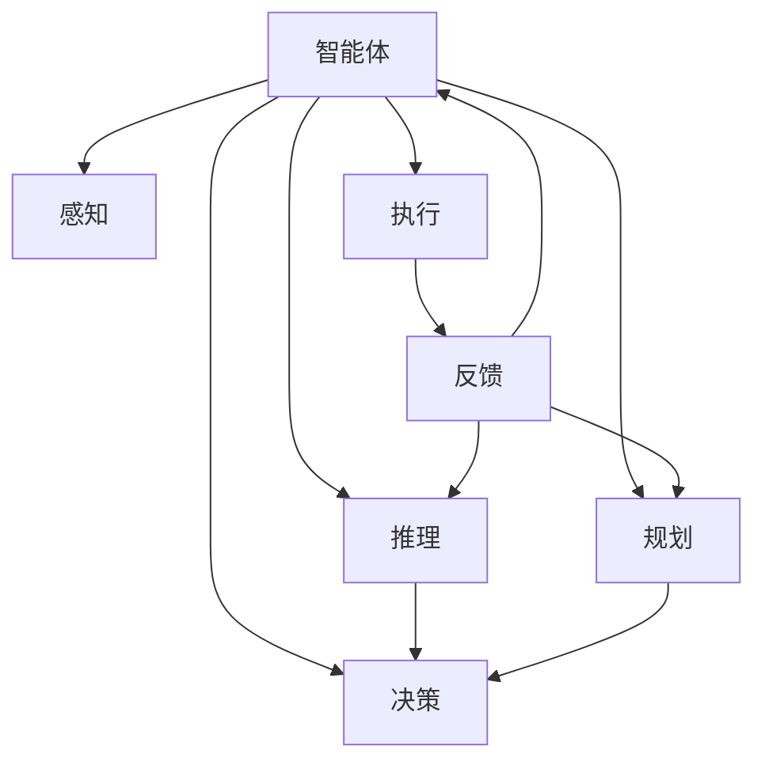
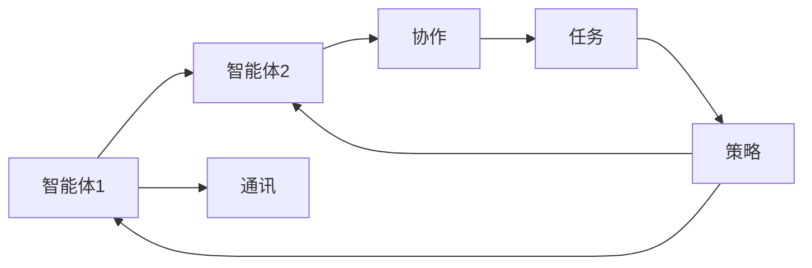
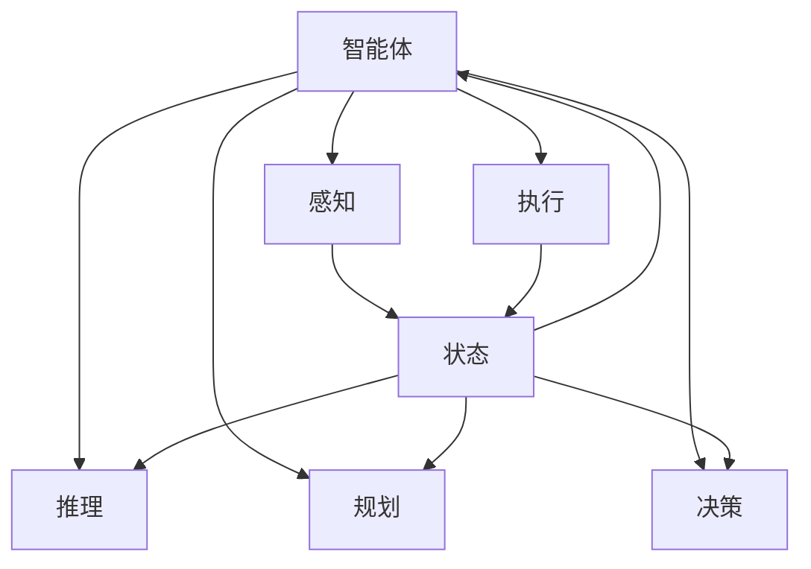

                 

# AI Agent: AI的下一个风口 智能体与未来的关系

> 关键词：智能体,AI,智能,决策,规划,自主性,协作,未来,技术,前沿

## 1. 背景介绍

### 1.1 问题由来

在过去的几十年中，人工智能（AI）技术经历了从规则系统、专家系统到机器学习、深度学习的演进。随着深度学习的兴起，AI已经能够在图像识别、语音识别、自然语言处理等领域取得优异表现。然而，AI技术在真正自主决策、规划和执行复杂任务方面，还存在一定的局限性。

如何构建具有自主性、灵活性和适应性的AI系统，成为了当前AI研究的前沿方向。而智能体（Agent）作为AI的一个重要分支，正是以自主决策和规划为核心，探索如何构建能够应对复杂、多变环境的人工智能系统。

智能体是人工智能领域的核心概念之一，代表了一种自主的、具有智能决策能力的实体。其能够感知环境、进行推理和规划、做出决策并执行任务。智能体的应用场景广泛，包括自动驾驶、智能家居、机器人、供应链优化、金融投资等。

### 1.2 问题核心关键点

智能体的核心关键点包括以下几点：

1. **自主决策能力**：智能体能够在没有人类干预的情况下，自主进行决策和规划，适应环境变化。

2. **环境感知能力**：智能体能够感知周围环境的状态和变化，获取实时信息以辅助决策。

3. **行为执行能力**：智能体能够执行预设的任务，并且在执行过程中不断调整和优化策略。

4. **学习与适应能力**：智能体能够在实践中不断学习新的知识，适应新的任务和环境。

5. **协作与交互能力**：智能体能够与其他智能体或人类进行交互，共同完成复杂的任务。

这些核心关键点构成了智能体的基础能力，同时也决定了其广泛的应用前景。智能体的发展，将为AI技术的深度应用提供新的方向和范式。

### 1.3 问题研究意义

智能体的研究具有重要的理论和实际意义：

1. **理论意义**：智能体研究涉及多智能体系统、博弈论、控制理论、机器学习等多个领域，能够丰富人工智能的理论体系，推动相关学科的发展。

2. **应用意义**：智能体技术的应用前景广阔，能够推动自动化、智能化水平，提升效率和安全性。

3. **前沿技术**：智能体的研究代表了AI技术的前沿方向，能够为未来的AI系统提供新的思路和方法。

## 2. 核心概念与联系

### 2.1 核心概念概述

为更好地理解智能体的核心概念，本节将介绍几个密切相关的核心概念：

- **智能体(Agent)**：能够感知环境、进行推理和规划、做出决策并执行任务的自主实体。
- **环境(Environment)**：智能体所处的外部环境，包括物理环境和社会环境，环境的状态和变化直接影响智能体的决策。
- **状态(State)**：智能体感知到的当前环境的状态，包括位置、速度、颜色等物理属性，以及社会属性如价格、位置等。
- **行动(Action)**：智能体为达到目标所采取的具体动作，如移动、买卖等。
- **奖励(Reward)**：智能体在执行动作后获得的反馈，用于评估动作的好坏，通常是正向或负向的数值。
- **模型(Model)**：智能体对环境的抽象表示，用于指导决策和规划。

这些核心概念之间的逻辑关系可以通过以下Mermaid流程图来展示：

```mermaid
graph TB
    A[智能体(Agent)] --> B[环境(Environment)]
    A --> C[状态(State)]
    A --> D[行动(Action)]
    A --> E[奖励(Reward)]
    A --> F[模型(Model)]
```

这个流程图展示了他核心的概念及其之间的关系：

1. 智能体与环境进行交互，感知环境的状态。
2. 根据感知到的状态，智能体进行推理和规划，采取动作。
3. 动作执行后，智能体接收奖励作为反馈，更新模型。
4. 模型不断优化，指导智能体的决策和规划。

### 2.2 概念间的关系

这些核心概念之间存在着紧密的联系，形成了智能体的完整生态系统。下面我们通过几个Mermaid流程图来展示这些概念之间的关系。

#### 2.2.1 智能体的学习范式



这个流程图展示了智能体的学习范式：

1. 智能体感知环境状态。
2. 根据感知到的状态，智能体进行推理和规划。
3. 智能体决策并执行动作。
4. 动作执行后，智能体接收反馈，更新模型。
5. 模型优化，智能体再次决策和执行。

#### 2.2.2 多智能体系统



这个流程图展示了多智能体系统的基本架构：

1. 多个智能体通过通讯进行交互。
2. 智能体之间协作完成任务。
3. 协作策略指导任务执行。
4. 每个智能体的策略基于自身的模型和反馈进行优化。

#### 2.2.3 智能体与环境的交互



这个流程图展示了智能体与环境的交互过程：

1. 智能体感知环境状态。
2. 根据感知到的状态，智能体进行推理和规划。
3. 智能体决策并执行动作。
4. 环境接收动作，更新状态。
5. 智能体再次感知新状态，更新模型。

### 2.3 核心概念的整体架构

最后，我们用一个综合的流程图来展示这些核心概念在大语言模型微调过程中的整体架构：


这个综合流程图展示了从感知到执行的完整过程。智能体首先感知环境状态，然后根据状态进行推理和规划，决策并执行动作，最后更新模型，继续感知新状态。通过这些流程，智能体能够不断适应环境变化，执行复杂任务。

## 3. 核心算法原理 & 具体操作步骤
### 3.1 算法原理概述

智能体的核心算法原理主要是基于强化学习（Reinforcement Learning, RL）和规划与决策理论。强化学习是一种通过奖励反馈（奖励机制），让智能体在环境中进行试错学习，逐步优化决策策略的方法。规划与决策理论则是研究如何设计智能体的策略，使其能够在特定环境下进行有效决策。

具体而言，智能体通过感知环境状态，采取动作，接收奖励，根据奖励和模型指导决策和规划。智能体的目标是通过不断学习，找到最优的决策策略，使得长期累积奖励最大化。

### 3.2 算法步骤详解

智能体的算法步骤主要包括以下几个关键步骤：

**Step 1: 环境定义**

首先，需要定义智能体的环境。环境可以是物理环境，如无人驾驶车辆所处的道路环境；也可以是社会环境，如金融市场的投资环境。环境的状态变量、动作空间、奖励函数需要根据具体场景进行定义。

**Step 2: 模型初始化**

初始化智能体的模型，一般使用神经网络来表示模型的参数。模型的参数将随着学习过程不断更新，用于指导智能体的决策和规划。

**Step 3: 学习过程**

智能体在环境中通过感知状态，执行动作，接收奖励，根据奖励和模型更新参数。学习过程可以是基于值函数的方法（如Q-learning），也可以是基于策略的方法（如策略梯度方法）。

**Step 4: 规划过程**

在智能体已经掌握了一定的策略后，规划过程可以帮助其找到最优的动作序列。规划过程通常包括状态空间搜索、动作序列生成、目标状态评估等步骤。

**Step 5: 执行与反馈**

智能体根据规划过程生成的动作序列，执行相应的动作，接收环境反馈。智能体接收到的奖励通常包含环境状态、动作执行结果、外部信号等。

**Step 6: 模型更新**

智能体根据反馈信息，更新模型参数。更新方式可以是基于梯度的优化方法（如Adam），也可以是基于经验的更新方法（如蒙特卡罗方法）。

**Step 7: 评估与优化**

在学习和规划的过程中，智能体需要不断地评估其策略和模型的性能，并进行优化。评估方式可以是长期累积奖励、事件成功率等指标。

### 3.3 算法优缺点

智能体的算法优点包括：

1. **自主决策**：智能体能够在没有人类干预的情况下，自主进行决策和规划，适应环境变化。

2. **环境适应性**：智能体可以通过学习，逐步适应新的环境和任务。

3. **可扩展性**：智能体的算法可以应用于多种场景，具有较好的可扩展性。

4. **多智能体协作**：智能体可以通过协作，完成更复杂的任务，具有较高的灵活性。

5. **学习效率高**：强化学习算法可以自动发现最优策略，不需要手工设计规则。

但智能体的算法也存在一些缺点：

1. **学习速度慢**：特别是在复杂环境中，智能体的学习过程可能需要较长的时间。

2. **过拟合风险**：智能体在特定环境下的模型可能存在过拟合风险，难以泛化到其他环境。

3. **环境不确定性**：环境的不确定性可能会影响智能体的决策和规划，需要额外的机制进行应对。

4. **资源消耗大**：智能体的学习过程通常需要大量的计算资源，特别是在大规模环境中。

5. **模型复杂性**：模型的复杂性可能会影响智能体的决策效率和鲁棒性。

### 3.4 算法应用领域

智能体的应用领域广泛，包括：

1. **自动驾驶**：智能体用于无人驾驶车辆的环境感知、路径规划、避障等。

2. **智能家居**：智能体用于智能家电的自动化控制、用户行为预测等。

3. **机器人**：智能体用于机器人的路径规划、动作生成、环境适应等。

4. **供应链优化**：智能体用于供应链的优化决策，如库存管理、物流调度等。

5. **金融投资**：智能体用于金融市场的投资决策，风险控制等。

6. **医疗诊断**：智能体用于医疗诊断的决策支持，如病理分析、治疗方案选择等。

## 4. 数学模型和公式 & 详细讲解 & 举例说明

### 4.1 数学模型构建

本节将使用数学语言对智能体的算法过程进行更加严格的刻画。

记智能体为 $A$，环境为 $E$，状态为 $S$，动作为 $A$，奖励为 $R$。设智能体的初始状态为 $S_0$，初始模型参数为 $\theta_0$，模型在状态 $S_t$ 下的动作策略为 $A_\theta(S_t)$。智能体在执行动作 $A_t$ 后，环境状态变为 $S_{t+1}$，并返回奖励 $R_t$。

定义智能体在状态 $S_t$ 下的累积奖励为 $G_t = \sum_{k=t}^\infty \gamma^k R_k$，其中 $\gamma \in [0,1)$ 为折扣因子，用于考虑长期奖励。智能体的目标是最小化累积奖励的期望值 $J(\theta) = \mathbb{E}[\sum_{t=0}^\infty \gamma^t R_t]$。

### 4.2 公式推导过程

下面推导智能体在状态 $S_t$ 下的动作选择策略，即选择动作 $A_t$ 的概率分布。

假设智能体在状态 $S_t$ 下，动作 $A_t$ 的策略为 $A_\theta(S_t) = \pi_\theta(A_t|S_t)$，其中 $\pi_\theta$ 为策略函数，依赖于模型参数 $\theta$。智能体的策略函数可以表示为：

$$
\pi_\theta(A_t|S_t) = \frac{\exp(\theta^T \phi(S_t, A_t))}{\sum_{a\in A} \exp(\theta^T \phi(S_t, a))}
$$

其中 $\phi(S_t, A_t)$ 为状态-动作映射函数，将状态和动作映射为向量，作为策略函数的输入。

在状态 $S_t$ 下，智能体选择动作 $A_t$ 的期望累积奖励为：

$$
J_\theta = \mathbb{E}[G_t|S_t]
$$

将累积奖励的期望值 $J_\theta$ 表示为策略函数 $\pi_\theta$ 的函数：

$$
J_\theta = \mathbb{E}[G_t|S_t] = \mathbb{E}[R_t + \gamma\mathbb{E}[G_{t+1}|S_{t+1}]|S_t]
$$

利用贝尔曼方程，可以得到：

$$
J_\theta = \mathbb{E}[R_t + \gamma\max_{a\in A} \pi_\theta(a|S_{t+1})J_\theta|S_t]
$$

因此，智能体的策略函数 $\pi_\theta$ 可以通过最大化长期累积奖励 $J_\theta$ 来优化。该过程可以通过以下公式进行优化：

$$
\theta^* = \mathop{\arg\min}_{\theta} J_\theta = \mathop{\arg\min}_{\theta} \mathbb{E}[G_t|S_t]
$$

通过求解上述最优化问题，可以确定智能体的最优策略函数 $\pi_\theta^*$。

### 4.3 案例分析与讲解

考虑一个无人驾驶车辆在城市道路中行驶的问题。智能体（无人驾驶车辆）需要在不同路况下选择不同的行驶策略，以最小化事故风险。环境（城市道路）的状态变量包括车速、车距、路障等，动作变量包括加速、减速、转向等。

智能体的状态空间为 $S = (v_1, v_2, \ldots, v_n)$，其中 $v_i$ 为第 $i$ 个状态变量。动作空间为 $A = (a_1, a_2, \ldots, a_m)$，其中 $a_j$ 为第 $j$ 个动作变量。智能体的奖励函数为 $R = r_1 + r_2$，其中 $r_1$ 为事故风险，$r_2$ 为行驶效率。折扣因子 $\gamma = 0.9$。

智能体通过感知环境状态，执行动作，接收奖励，根据奖励和模型更新参数。智能体的学习过程可以表示为：

1. 在状态 $S_t = (v_1, v_2, \ldots, v_n)$ 下，智能体选择动作 $A_t = (a_1, a_2, \ldots, a_m)$，执行动作，得到状态 $S_{t+1}$ 和奖励 $R_t$。

2. 智能体根据奖励 $R_t$ 和模型参数 $\theta$，更新策略函数 $\pi_\theta(A_t|S_t)$。

3. 重复步骤1和步骤2，直到智能体达到终止状态或最优策略收敛。

智能体的优化目标为：

$$
\theta^* = \mathop{\arg\min}_{\theta} \mathbb{E}[G_t|S_t] = \mathop{\arg\min}_{\theta} \mathbb{E}[R_t + \gamma\max_{a\in A} \pi_\theta(a|S_{t+1})G_t|S_t]
$$

通过上述优化过程，智能体可以在复杂的城市道路环境中，自主进行决策和规划，最小化事故风险，提升行驶效率。

## 5. 项目实践：代码实例和详细解释说明
### 5.1 开发环境搭建

在进行智能体项目开发前，我们需要准备好开发环境。以下是使用Python进行智能体开发的常见环境配置流程：

1. 安装Anaconda：从官网下载并安装Anaconda，用于创建独立的Python环境。

2. 创建并激活虚拟环境：
```bash
conda create -n agent-env python=3.8 
conda activate agent-env
```

3. 安装智能体开发工具包：
```bash
pip install gym gymnasium
pip install numpy pandas scikit-learn
```

4. 安装智能体环境：
```bash
pip install gym-gymnasium
pip install gym-atari
```

完成上述步骤后，即可在`agent-env`环境中开始智能体项目开发。

### 5.2 源代码详细实现

下面以基于强化学习的智能体开发为例，给出完整的代码实现。

首先，定义智能体的状态空间和动作空间：

```python
import gymnasium as gym

env = gym.make('CartPole-v1')
observation_space = env.observation_space
action_space = env.action_space
```

然后，定义智能体的策略函数：

```python
class SimpleAgent:
    def __init__(self, env):
        self.env = env
        self.model = None
        self.k = 0.5
        self.epsilon = 0.1

    def select_action(self, state):
        if self.epsilon > 0 and np.random.rand() < self.epsilon:
            return np.random.choice(self.env.action_space.n)
        else:
            return self.env.action_space.sample()

    def update_model(self, state, action, reward, next_state, done):
        self.model.fit(state, action, reward, next_state, done)
```

接下来，定义智能体的学习过程：

```python
def learn(env, agent, num_episodes=1000, discount=0.99, learning_rate=0.01, epsilon_decay=0.995, epsilon_min=0.01):
    for i in range(num_episodes):
        state = env.reset()
        total_reward = 0
        done = False
        while not done:
            action = agent.select_action(state)
            next_state, reward, done, _ = env.step(action)
            total_reward += reward
            agent.update_model(state, action, reward, next_state, done)
            state = next_state
        if i % 100 == 0:
            print(f"Episode {i}, total reward: {total_reward}")
            agent.epsilon *= epsilon_decay
            if agent.epsilon < epsilon_min:
                agent.epsilon = epsilon_min
```

最后，启动学习过程并在环境上评估：

```python
agent = SimpleAgent(env)
learn(env, agent)
env.render()
```

以上就是基于强化学习的智能体开发的完整代码实现。可以看到，通过定义智能体的状态空间和动作空间，设计策略函数，以及实现学习过程，我们可以训练一个简单的智能体，使其在环境中自主进行决策和规划。

### 5.3 代码解读与分析

让我们再详细解读一下关键代码的实现细节：

**状态空间和动作空间**：
- 使用Gymnasium库定义环境，如CartPole-v1。
- 获取环境的状态空间和动作空间，供智能体使用。

**策略函数**：
- 定义智能体的策略函数，在选取动作时，以固定概率 $\epsilon$ 选择随机动作，以 $1-\epsilon$ 概率选择根据模型预测的动作。
- 模型参数 $\theta$ 通过fit方法更新。

**学习过程**：
- 在每一集中，智能体从环境获取初始状态，执行动作，接收奖励，并根据奖励更新模型。
- 使用折扣因子 $\gamma$ 计算累积奖励，并根据累积奖励更新策略函数 $\pi_\theta$。
- 在每一集中，逐步降低探索概率 $\epsilon$，以平衡探索和利用。

**运行结果展示**：
- 智能体在环境中的运行结果，通过env.render()方法显示。

可以看到，通过定义智能体的状态空间和动作空间，设计策略函数，以及实现学习过程，我们可以训练一个简单的智能体，使其在环境中自主进行决策和规划。

当然，在工业级的系统实现中，还需要考虑更多因素，如模型的保存和部署、超参数的自动搜索、更灵活的策略设计等。但核心的智能体开发流程基本与此类似。

## 6. 实际应用场景
### 6.1 智能驾驶

智能体在智能驾驶领域的应用前景广阔。智能体能够感知车辆周围的环境状态，进行路径规划和避障，做出最优驾驶决策。智能体的应用场景包括：

1. **自动驾驶车辆**：智能体用于无人驾驶车辆的感知、决策和控制，实现自动驾驶功能。
2. **智能导航系统**：智能体用于智能导航系统的路线规划和交通状况优化。
3. **车联网**：智能体用于车联网系统中的信息交互和协同控制。

### 6.2 医疗诊断

智能体在医疗诊断领域的应用潜力巨大。智能体能够分析患者的病情数据，进行诊断和治疗方案选择，辅助医生决策。智能体的应用场景包括：

1. **病理诊断**：智能体用于病理图像的自动分析，识别病变区域。
2. **治疗方案选择**：智能体用于推荐最适合患者的治疗方案，辅助医生制定个性化治疗计划。
3. **健康监测**：智能体用于实时监测患者的健康数据，预测疾病风险。

### 6.3 金融投资

智能体在金融投资领域的应用前景广阔。智能体能够分析市场数据，进行投资决策，优化投资组合。智能体的应用场景包括：

1. **投资组合管理**：智能体用于构建和优化投资组合，实现最优资产配置。
2. **风险控制**：智能体用于实时监控市场风险，制定风险控制策略。
3. **市场预测**：智能体用于预测市场走势，辅助投资决策。

### 6.4 未来应用展望

随着智能体技术的发展，未来将在更多领域得到应用，为社会带来变革性影响。

1. **智慧城市**：智能体用于智慧城市的交通管理、环境监测、能源优化等，提升城市管理水平。
2. **智能制造**：智能体用于智能制造系统的自动化控制、生产调度、质量控制等，提升生产效率和质量。
3. **智能客服**：智能体用于智能客服系统的对话生成、问题解答、客户行为预测等，提升客户体验和服务质量。
4. **智能教育**：智能体用于智能教育系统的个性化推荐、作业批改、学习路径优化等，提升教育效果。
5. **智能农业**：智能体用于智能农业的决策支持、环境监测、生产管理等，提升农业生产效率和可持续性。

## 7. 工具和资源推荐
### 7.1 学习资源推荐

为帮助开发者系统掌握智能体的理论基础和实践技巧，这里推荐一些优质的学习资源：

1. 《Reinforcement Learning: An Introduction》书籍：作者Sutton和Barto，详细介绍了强化学习的基本概念和算法，是强化学习的入门经典。

2. 《Deep Reinforcement Learning》课程：由DeepMind团队开设，介绍了深度强化学习的最新进展和应用案例。

3. 《Programming Agents with Python》书籍：作者Shoham，介绍了如何使用Python进行智能体的设计和实现，包含丰富的代码示例。

4. 《Reinforcement Learning in Action》书籍：作者Munos、Gerencser、Cully，介绍了强化学习的实践方法和工具，包含TensorFlow等工具的代码示例。

5. 《OpenAI Gym》官方文档：Gym库的官方文档，提供了大量环境定义和智能体开发的示例代码，是智能体学习的必备资料。

通过对这些资源的学习实践，相信你一定能够快速掌握智能体的精髓，并用于解决实际的NLP问题。
### 7.2 开发工具推荐

高效的开发离不开优秀的工具支持。以下是几款用于智能体开发的工具：

1. Gymnasium：Gym库的扩展，支持更多的环境和智能体定义，便于实验和研究。

2. TensorFlow：谷歌主导的深度学习框架，生产部署方便，适合大规模工程应用。

3. PyTorch：基于Python的开源深度学习框架，灵活动态的计算图，适合快速迭代研究。

4. JAX：高性能的自动微分库，适合大规模并行计算和加速训练。

5. Ray：分布式计算框架，支持多智能体的分布式训练和推理。

6. RLlib：OpenAI开发的强化学习库，提供多种智能体算法和环境，便于开发和实验。

合理利用这些工具，可以显著提升智能体开发和研究的效率，加快创新迭代的步伐。

### 7.3 相关论文推荐

智能体的研究源于学界的持续研究。以下是几篇奠基性的相关论文，推荐阅读：

1. Learning to Play Go Using Monte Carlo Tree Search：提出的蒙特卡罗树搜索算法，是智能体领域的一个重要突破，奠定了后续搜索优化算法的基础。

2. DeepMind AlphaGo Zero：展示了大规模自监督预训练和强化学习结合的方法，实现了在复杂博弈中超越人类水平的智能体。

3. Trust Region Policy Optimization：提出了信任区域策略优化算法，一种高效的策略梯度方法，解决了策略梯度方法的收敛问题。

4. Proximal Policy Optimization：提出了一种基于梯度的策略优化算法，具有良好的收敛性和稳定性。

5. Model-Based Reinforcement Learning：介绍了模型驱动的强化学习方法，通过引入环境模型进行规划和决策优化。

6. AlphaStar：展示了大规模自监督预

