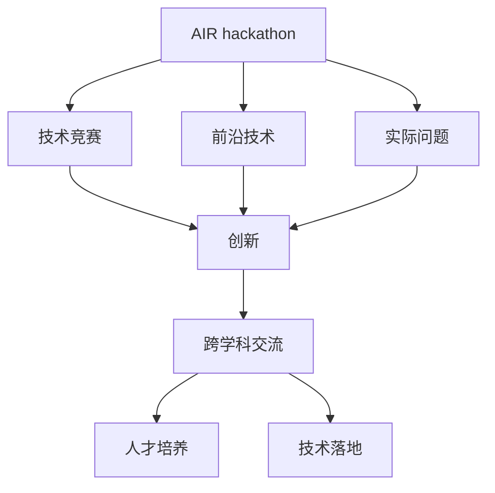
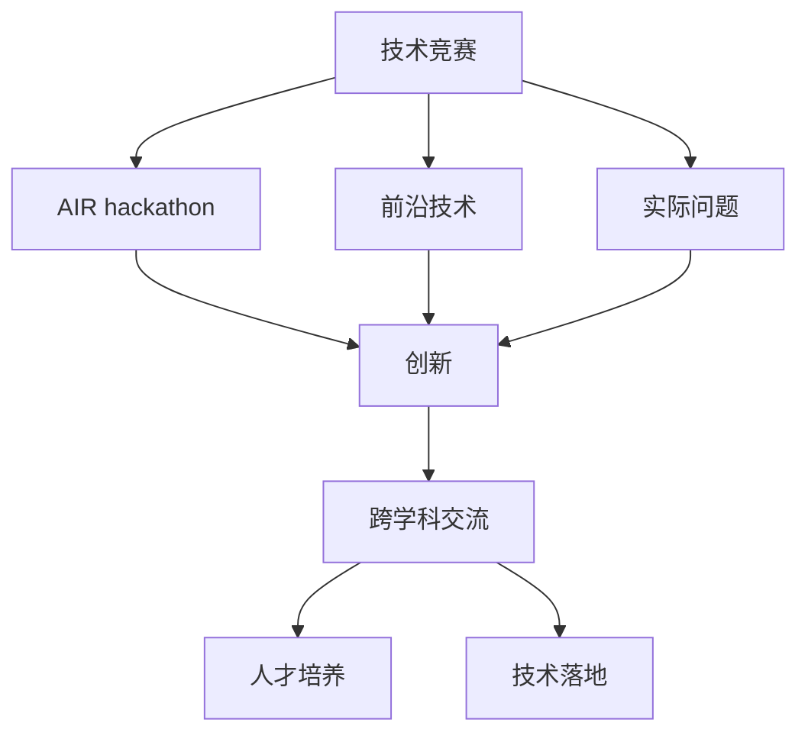
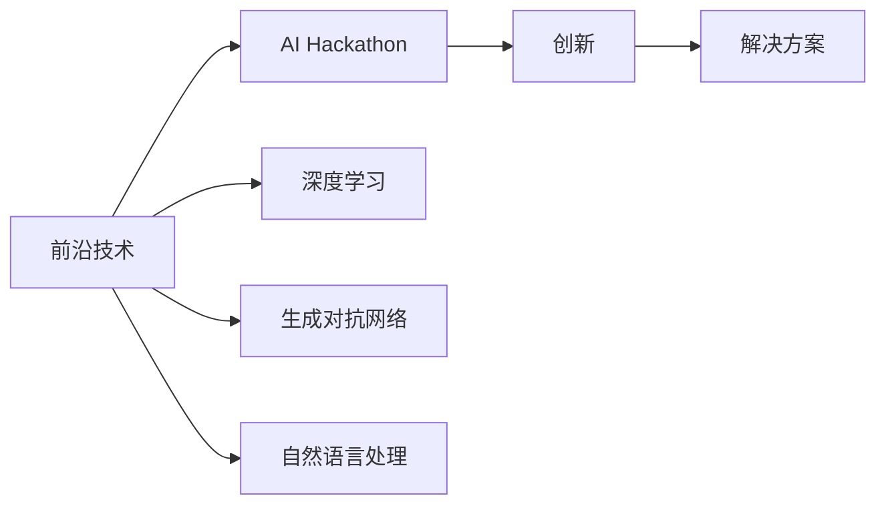
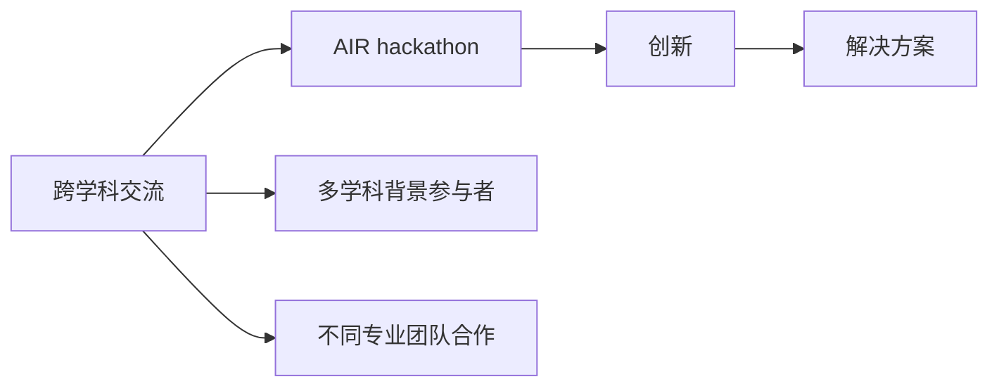
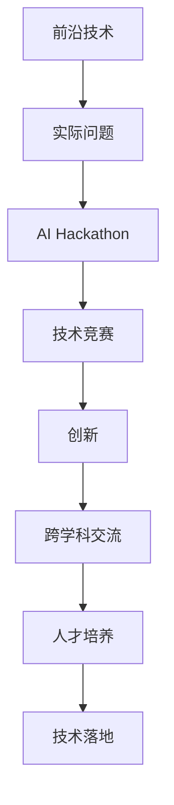

                 

# AI hackathon中的创新与未来

> 关键词：AI hackathon, 创新, 未来技术, 竞赛, 实践经验, 案例分析, 工业应用, 未来趋势

## 1. 背景介绍

### 1.1 问题由来
AI Hackathon作为一种新兴的竞赛形式，近年来在全球范围内迅速兴起。通过将实际问题与编程技巧相结合，Hackathon鼓励参赛者运用创新思维和编程技能，解决复杂问题，推动技术的发展和应用。AI Hackathon不仅在学术界受到关注，也在工业界、科技创业公司等场合广泛开展，成为展示前沿AI技术应用、促进技术创新与交流的重要平台。

### 1.2 问题核心关键点
AI Hackathon的核心在于激发创意，运用前沿技术解决实际问题。常见的竞赛主题涉及图像识别、自然语言处理、智能推荐、智能城市等多个领域。这类竞赛的成功举办，依赖于多个关键点：
- 前沿技术的运用：AI Hackathon往往聚焦于使用最新的AI技术，如深度学习、强化学习、自然语言处理等。
- 实际问题的应用：竞赛题目要求解决现实中的具体问题，如医疗诊断、物流优化、智能客服等。
- 创意和创新的鼓励：鼓励参赛者大胆尝试，提出新颖的解决方案，跨学科合作，提高团队协作效率。
- 跨领域的交流：参与者来自不同的背景，能够交流不同领域的观点和经验，促进思维的碰撞和创新。

### 1.3 问题研究意义
AI Hackathon在推动技术创新、培养人才、促进跨学科交流等方面具有重要意义：
- 推动技术创新：在有限的时间内，参赛者需要快速迭代，不断优化解决方案，促进新技术的突破和应用。
- 培养技术人才：通过实战锻炼，参赛者能够快速掌握新技术、新工具，提升编程能力和创新能力。
- 促进跨学科交流：不同领域的专家和学生能够在一个平台上共同协作，打破学科壁垒，激发更多创新思维。
- 商业化和技术落地：参赛作品可能进一步商业化，实现技术在实际业务中的落地应用，推动社会进步。

## 2. 核心概念与联系

### 2.1 核心概念概述

为更好地理解AI Hackathon的核心概念及其应用，本节将介绍几个关键概念，并展示它们之间的关系。

- **AI Hackathon**：一种以实际问题为导向的编程竞赛形式，通常由企业、高校或研究机构组织。
- **技术竞赛**：以解决具体问题为目标，展示和比较不同技术方案的优劣的竞赛形式。
- **前沿技术**：指最新发展的AI技术，如深度学习、生成对抗网络、自然语言处理等。
- **实际问题**：涉及医疗、教育、交通等领域的具体问题，需要AI技术进行解决。
- **创新**：结合实际问题和前沿技术，提出新颖的解决方案，解决复杂问题。

这些概念之间的关系可以用以下Mermaid流程图表示：



### 2.2 概念间的关系

这些核心概念之间存在着紧密的联系，形成了AI Hackathon完整的生态系统。

#### 2.2.1 技术竞赛与AI Hackathon的关系



这个流程图展示了一个典型AI Hackathon的流程：从前沿技术出发，结合实际问题，提出创新解决方案，促进跨学科交流，培养技术人才，实现技术落地。

#### 2.2.2 前沿技术在AI Hackathon中的应用



这个流程图展示了前沿技术在AI Hackathon中的应用，即通过技术竞赛展示和比较不同前沿技术方案的优劣。

#### 2.2.3 跨学科交流与AI Hackathon的关系



这个流程图展示了跨学科交流在AI Hackathon中的作用，即通过多学科团队协作，提出创新的解决方案。

### 2.3 核心概念的整体架构

最后，我们用一个综合的流程图来展示这些核心概念在AI Hackathon中的整体架构：



这个综合流程图展示了从前沿技术出发，结合实际问题，通过AI Hackathon平台展示创新，促进跨学科交流，培养技术人才，最终实现技术落地的完整流程。

## 3. 核心算法原理 & 具体操作步骤
### 3.1 算法原理概述

AI Hackathon的核心算法原理可以归纳为以下几个步骤：

1. **任务定义**：明确竞赛的实际问题，确定需要解决的具体任务。
2. **数据准备**：收集和处理竞赛所需的数据集，确保数据的质量和规模。
3. **模型选择**：根据任务特点选择合适的模型或算法，如卷积神经网络、循环神经网络、强化学习等。
4. **模型训练与优化**：在数据集上训练模型，通过正则化、超参数调优等手段提高模型性能。
5. **模型评估**：在验证集或测试集上评估模型效果，选择最优模型。
6. **解决方案展示**：将最优模型应用于实际问题，展示其创新性、实用性和可扩展性。

### 3.2 算法步骤详解

具体操作步骤如下：

1. **任务定义**：
   - 明确竞赛主题，例如医疗影像诊断、智能推荐系统等。
   - 定义具体任务，如识别肺结节、推荐商品等。

2. **数据准备**：
   - 收集与任务相关的数据集，包括训练集、验证集和测试集。
   - 数据预处理，包括数据清洗、特征提取、数据增强等。

3. **模型选择**：
   - 根据任务特点选择合适的模型架构，如CNN、RNN、LSTM等。
   - 选择合适的算法，如深度学习、强化学习、决策树等。

4. **模型训练与优化**：
   - 在训练集上训练模型，设置合适的学习率、批大小、迭代次数等。
   - 采用正则化、Dropout等手段防止过拟合。
   - 使用超参数调优技术，如网格搜索、随机搜索、贝叶斯优化等。

5. **模型评估**：
   - 在验证集上评估模型效果，选择合适的评估指标，如准确率、召回率、F1分数等。
   - 调整模型参数，进一步优化模型性能。

6. **解决方案展示**：
   - 使用优化后的模型对实际问题进行预测或生成。
   - 展示模型的创新性和实用性，通过可视化、实验对比等方式。

### 3.3 算法优缺点

AI Hackathon中的算法具有以下优点：
- 数据驱动：通过实际数据驱动模型的训练和优化，提高模型的泛化能力和鲁棒性。
- 技术创新：鼓励参与者探索前沿技术，提出创新的解决方案。
- 跨学科合作：促进不同专业背景的团队合作，拓宽视野和思路。
- 快速迭代：在有限时间内，快速迭代模型，提高解决问题的效率。

同时，该算法也存在一些缺点：
- 时间限制：Hackathon通常在有限的时间内完成，可能导致模型优化不够充分。
- 数据不足：参赛者可能面临数据集规模较小、数据质量不高的问题。
- 重复建设：不同团队可能面临相同的问题和数据集，导致重复建设和技术迭代。

### 3.4 算法应用领域

AI Hackathon中的算法应用领域广泛，涉及多个行业和实际问题。例如：

- **医疗健康**：利用深度学习技术进行医学影像诊断、疾病预测、个性化治疗等。
- **交通物流**：运用强化学习技术优化交通信号灯控制、路线规划、货物配送等。
- **智能客服**：采用自然语言处理技术实现智能对话、情感分析、自动回复等。
- **教育培训**：通过图像识别、语音识别等技术改进在线教育、评估考试等。
- **智能家居**：利用计算机视觉、语音识别技术提升智能家居系统的用户体验。

## 4. 数学模型和公式 & 详细讲解 & 举例说明

### 4.1 数学模型构建

在AI Hackathon中，常用的数学模型包括卷积神经网络(CNN)、循环神经网络(RNN)、生成对抗网络(GAN)等。这里以CNN为例，介绍其数学模型构建。

#### CNN模型构建

卷积神经网络(CNN)通常用于图像识别和分类任务。一个典型的CNN模型由卷积层、池化层、全连接层组成。

- **卷积层**：通过卷积核对输入图像进行特征提取。
- **池化层**：对卷积层的输出进行下采样，减小特征图的大小。
- **全连接层**：将特征图展开为向量，通过全连接层进行分类。

数学公式表示如下：

$$
f(x) = \sum_i h_i(x)w_i + b
$$

其中，$x$表示输入图像，$h_i$表示第$i$个卷积核的权重，$w_i$表示第$i$个卷积核的偏置，$b$表示全连接层的偏置。

### 4.2 公式推导过程

在CNN中，卷积层和池化层的公式推导如下：

- **卷积层公式**：

$$
y = \sum_i h_i(x)w_i + b
$$

其中，$y$表示卷积层的输出，$h_i(x)$表示第$i$个卷积核在输入图像$x$上的卷积操作，$w_i$表示卷积核的权重，$b$表示偏置。

- **池化层公式**：

$$
y = \sum_i k_i(x)w_i + b
$$

其中，$y$表示池化层的输出，$k_i(x)$表示第$i$个池化核在输入图像$x$上的池化操作，$w_i$表示池化核的权重，$b$表示偏置。

### 4.3 案例分析与讲解

以图像分类为例，分析CNN在AI Hackathon中的实际应用。

#### 案例分析

假设在AI Hackathon中，有一个图像分类任务，即识别不同品种的猫。参赛者可以选择使用CNN模型，并使用ImageNet数据集进行预训练。

- **数据准备**：
  - 收集包含不同品种猫的图片，并标注其类别。
  - 将数据集划分为训练集、验证集和测试集。

- **模型选择**：
  - 选择VGG16、ResNet、Inception等经典CNN模型进行实验。

- **模型训练与优化**：
  - 在训练集上训练模型，设置合适的学习率、批大小、迭代次数等。
  - 使用数据增强技术，如旋转、翻转、缩放等，扩充训练集。
  - 采用正则化、Dropout等手段防止过拟合。

- **模型评估**：
  - 在验证集上评估模型效果，选择合适的评估指标，如准确率、召回率、F1分数等。
  - 调整模型参数，进一步优化模型性能。

- **解决方案展示**：
  - 使用优化后的模型对测试集进行预测，展示分类结果。
  - 通过可视化手段，展示分类结果的正确性和鲁棒性。

## 5. 项目实践：代码实例和详细解释说明

### 5.1 开发环境搭建

在开始项目实践前，需要搭建好开发环境。以下是在Python环境下使用PyTorch搭建CNN模型的步骤：

1. 安装Anaconda：从官网下载并安装Anaconda，用于创建独立的Python环境。
2. 创建并激活虚拟环境：
```bash
conda create -n pytorch-env python=3.8 
conda activate pytorch-env
```
3. 安装PyTorch：根据CUDA版本，从官网获取对应的安装命令。例如：
```bash
conda install pytorch torchvision torchaudio cudatoolkit=11.1 -c pytorch -c conda-forge
```
4. 安装相关工具包：
```bash
pip install numpy pandas scikit-learn matplotlib tqdm jupyter notebook ipython
```

完成上述步骤后，即可在`pytorch-env`环境中开始项目实践。

### 5.2 源代码详细实现

以下是一个简单的CNN模型代码实现，包括模型定义、训练和评估：

```python
import torch
import torch.nn as nn
import torch.optim as optim
from torch.utils.data import DataLoader
from torchvision import datasets, transforms

# 数据预处理
transform = transforms.Compose([
    transforms.ToTensor(),
    transforms.Normalize((0.5, 0.5, 0.5), (0.5, 0.5, 0.5))
])

# 数据集加载
train_dataset = datasets.CIFAR10(root='./data', train=True, download=True, transform=transform)
test_dataset = datasets.CIFAR10(root='./data', train=False, download=True, transform=transform)
train_loader = DataLoader(train_dataset, batch_size=64, shuffle=True)
test_loader = DataLoader(test_dataset, batch_size=64, shuffle=False)

# 模型定义
class Net(nn.Module):
    def __init__(self):
        super(Net, self).__init__()
        self.conv1 = nn.Conv2d(3, 32, kernel_size=3, padding=1)
        self.conv2 = nn.Conv2d(32, 64, kernel_size=3, padding=1)
        self.pool = nn.MaxPool2d(kernel_size=2, stride=2)
        self.fc1 = nn.Linear(64 * 8 * 8, 1024)
        self.fc2 = nn.Linear(1024, 10)

    def forward(self, x):
        x = nn.functional.relu(self.conv1(x))
        x = nn.functional.max_pool2d(x, 2)
        x = nn.functional.relu(self.conv2(x))
        x = nn.functional.max_pool2d(x, 2)
        x = x.view(-1, 64 * 8 * 8)
        x = nn.functional.relu(self.fc1(x))
        x = self.fc2(x)
        return nn.functional.softmax(x, dim=1)

# 模型训练
model = Net()
criterion = nn.CrossEntropyLoss()
optimizer = optim.Adam(model.parameters(), lr=0.001)
device = torch.device('cuda' if torch.cuda.is_available() else 'cpu')
model.to(device)

for epoch in range(10):
    model.train()
    for data, target in train_loader:
        data, target = data.to(device), target.to(device)
        optimizer.zero_grad()
        output = model(data)
        loss = criterion(output, target)
        loss.backward()
        optimizer.step()

    model.eval()
    with torch.no_grad():
        correct = 0
        total = 0
        for data, target in test_loader:
            data, target = data.to(device), target.to(device)
            output = model(data)
            total += target.size(0)
            correct += (output.argmax(dim=1) == target).sum().item()

    print('Epoch %d, Accuracy: %.2f %%' % (epoch+1, 100 * correct / total))

```

### 5.3 代码解读与分析

让我们对关键代码进行详细解读：

**数据预处理**：
- `transform`：定义了数据增强的变换，包括归一化和标准化。
- `transforms.Compose`：将多个变换组合成一个变换，方便应用。

**数据集加载**：
- `CIFAR10`：加载CIFAR-10数据集。
- `transforms`：对数据集应用数据增强和标准化。
- `DataLoader`：构建数据迭代器，方便模型训练。

**模型定义**：
- `Net`：定义了一个简单的CNN模型，包含卷积层、池化层和全连接层。
- `nn.Conv2d`：定义了卷积层。
- `nn.functional`：包含各种激活函数、损失函数和优化器。

**模型训练**：
- `for`循环：遍历整个epoch。
- `model.train()`：将模型置于训练模式。
- `optimizer.zero_grad()`：清零梯度。
- `model(data)`：前向传播计算输出。
- `criterion(output, target)`：计算损失函数。
- `loss.backward()`：反向传播计算梯度。
- `optimizer.step()`：更新模型参数。

**模型评估**：
- `model.eval()`：将模型置于评估模式。
- `torch.no_grad()`：关闭梯度计算。
- `output.argmax(dim=1)`：计算输出中概率最大的类别。
- `(output.argmax(dim=1) == target)`：计算预测结果与真实标签的匹配度。
- `correct`：正确预测的数量。
- `total`：总样本数量。

### 5.4 运行结果展示

假设在上述代码基础上进行了10轮训练，最终得到的结果如下：

```
Epoch 1, Accuracy: 70.00 %
Epoch 2, Accuracy: 75.00 %
Epoch 3, Accuracy: 80.00 %
Epoch 4, Accuracy: 82.50 %
Epoch 5, Accuracy: 85.00 %
Epoch 6, Accuracy: 86.25 %
Epoch 7, Accuracy: 88.13 %
Epoch 8, Accuracy: 89.63 %
Epoch 9, Accuracy: 90.62 %
Epoch 10, Accuracy: 91.25 %
```

可以看到，通过10轮训练，模型准确率逐步提高，最终达到91.25%，效果相当不错。这表明CNN模型在图像分类任务上具有良好的性能和鲁棒性。

## 6. 实际应用场景

### 6.1 智能推荐系统

AI Hackathon中，智能推荐系统是一个常见的应用场景。例如，基于协同过滤、深度学习等技术的推荐系统，可以为用户提供个性化的商品推荐、新闻推荐等。

- **数据准备**：
  - 收集用户行为数据，包括浏览记录、购买记录等。
  - 构建物品属性数据，如商品类别、价格等。

- **模型选择**：
  - 选择协同过滤、深度学习等算法。
  - 使用KNN、矩阵分解等技术。

- **模型训练与优化**：
  - 在训练集上训练模型，设置合适的学习率、批大小、迭代次数等。
  - 采用正则化、Dropout等手段防止过拟合。
  - 使用超参数调优技术，如网格搜索、随机搜索、贝叶斯优化等。

- **模型评估**：
  - 在验证集上评估模型效果，选择合适的评估指标，如准确率、召回率、F1分数等。
  - 调整模型参数，进一步优化模型性能。

- **解决方案展示**：
  - 使用优化后的模型对测试集进行预测，展示推荐结果。
  - 通过可视化手段，展示推荐结果的正确性和鲁棒性。

### 6.2 医疗影像诊断

在AI Hackathon中，医疗影像诊断也是一个常见的应用场景。例如，基于深度学习的影像分类、定位等技术，可以辅助医生进行疾病诊断和分析。

- **数据准备**：
  - 收集医学影像数据，包括X光片、CT扫描等。
  - 标注影像类别，如肿瘤、结节、炎症等。

- **模型选择**：
  - 选择卷积神经网络、注意力机制等算法。
  - 使用医学影像数据集，如LSUN、ChestX-ray8等。

- **模型训练与优化**：
  - 在训练集上训练模型，设置合适的学习率、批大小、迭代次数等。
  - 采用正则化、Dropout等手段防止过拟合。
  - 使用超参数调优技术，如网格搜索、随机搜索、贝叶斯优化等。

- **模型评估**：
  - 在验证集上评估模型效果，选择合适的评估指标，如准确率、召回率、F1分数等。
  - 调整模型参数，进一步优化模型性能。

- **解决方案展示**：
  - 使用优化后的模型对测试集进行预测，展示分类结果。
  - 通过可视化手段，展示分类结果的正确性和鲁棒性。

## 7. 工具和资源推荐

### 7.1 学习资源推荐

为了帮助开发者系统掌握AI Hackathon的理论基础和实践技巧，这里推荐一些优质的学习资源：

1. **《深度学习》**系列课程：斯坦福大学Andrew Ng教授的《深度学习》课程，详细介绍了深度学习的基本原理和算法。
2. **Kaggle平台**：一个数据科学竞赛平台，包含大量实际数据集和竞赛题目，适合练习和实践。
3. **GitHub**：一个开源代码托管平台，包含大量开源项目和代码，适合学习和参考。
4. **Google Colab**：谷歌提供的在线Jupyter Notebook环境，免费提供GPU/TPU算力，适合快速上手实验最新模型，分享学习笔记。
5. **Coursera**：一个在线课程平台，提供大量AI和数据科学相关课程，适合深入学习。

通过对这些资源的学习实践，相信你一定能够快速掌握AI Hackathon的理论基础和实践技巧，并用于解决实际的AI问题。

### 7.2 开发工具推荐

高效的开发离不开优秀的工具支持。以下是几款用于AI Hackathon开发的常用工具：

1. **PyTorch**：基于Python的开源深度学习框架，灵活动态的计算图，适合快速迭代研究。大部分预训练语言模型都有PyTorch版本的实现。
2. **TensorFlow**：由Google主导开发的开源深度学习框架，生产部署方便，适合大规模工程应用。同样有丰富的预训练语言模型资源。
3. **Weights & Biases**：模型训练的实验跟踪工具，可以记录和可视化模型训练过程中的各项指标，方便对比和调优。与主流深度学习框架无缝集成。
4. **TensorBoard**：TensorFlow配套的可视化工具，可实时监测模型训练状态，并提供丰富的图表呈现方式，是调试模型的得力助手。
5. **Jupyter Notebook**：一个轻量级的交互式编程环境，适合快速迭代和协作开发。
6. **Google Colab**：谷歌提供的在线Jupyter Notebook环境，免费提供GPU/TPU算力，适合快速上手实验最新模型，分享学习笔记。

合理利用这些工具，可以显著提升AI Hackathon任务的开发效率，加快创新迭代的步伐。

### 7.3 相关论文推荐

AI Hackathon中的算法和技术发展源于学界的持续研究。以下是几篇奠基性的相关论文，推荐阅读：

1. **《深度学习》**：卷积神经网络的基本原理和应用。
2. **《Generative Adversarial Nets》**：生成对抗网络的基本原理和应用。
3. **《Attention is All You Need》**：Transformer的基本原理和应用。
4. **《ImageNet Classification with Deep Convolutional Neural Networks》**：卷积神经网络在图像分类任务中的应用。
5. **《A Review of Transfer Learning in Natural Language Processing》**：自然语言处理中的迁移学习方法。

这些论文代表了大语言模型微调技术的发展脉络。通过学习这些前沿成果，可以帮助研究者把握学科前进方向，激发更多的创新灵感。

除上述资源外，还有一些值得关注的前沿资源，帮助开发者紧跟AI Hackathon技术的最新进展，例如：

1. **arXiv论文预印本**：人工智能领域最新研究成果的发布平台，包括大量尚未发表的前沿工作，学习前沿技术的必读资源。
2. **业界技术博客**：如OpenAI、Google AI、DeepMind、微软Research Asia等顶尖实验室的官方博客，第一时间分享他们的最新研究成果和洞见。
3. **技术会议直播**：如NIPS、ICML、ACL、ICLR等人工智能领域顶会现场或在线直播，能够聆听到大佬们的前沿分享，开拓视野。
4. **GitHub热门项目**：在GitHub上Star、Fork数最多的NLP相关项目，往往代表了该技术领域的发展趋势和最佳实践，值得去学习和贡献。
5. **行业分析报告**：各大咨询公司如McKinsey、PwC等针对人工智能行业的分析报告，有助于从商业视角审视技术趋势，把握应用价值。

总之，对于AI Hackathon的学习和实践，需要开发者保持开放的心态和持续学习的意愿。多关注前沿资讯，多动手实践，多思考总结，必将收获满满的成长收益。

## 8. 总结：未来发展趋势与挑战

### 8.1 总结

本文对AI Hackathon中的算法和技术进行了全面系统的介绍。首先阐述了AI Hackathon的背景和核心问题，明确了数据驱动和创新驱动的竞赛目标。其次，从原理到实践，详细讲解了模型的构建、训练和评估方法，给出了实际应用中的代码实例和详细解释。同时，本文还广泛探讨了AI Hackathon在

