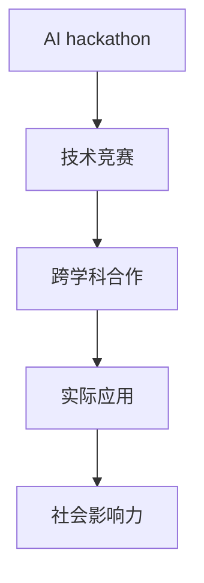

                 

# AI hackathon的规模与影响力

## 1. 背景介绍

### 1.1 问题由来

随着人工智能（AI）技术的快速发展，越来越多的人开始关注并参与到AI相关的创新活动中。AI hackathon作为一个重要的技术竞赛形式，旨在鼓励创新、促进技术交流、推动AI应用的实际落地，已经成为全球范围内科技公司、研究机构、高校等组织的重要活动之一。通过这种形式，参赛者可以展示他们在AI领域的创新能力，而企业可以发掘潜在的AI人才，推动技术的发展和应用。

### 1.2 问题核心关键点

AI hackathon的核心关键点在于：
- **创新和突破**：通过面对实际问题的挑战，推动技术创新和突破。
- **跨学科协作**：促进不同学科领域的知识和技术交流。
- **实际应用**：强调AI技术的实际应用场景和落地效果。
- **人才发掘**：发现和培养AI领域的新锐人才。
- **社会影响力**：提升社会对AI技术的认知和接受度。

### 1.3 问题研究意义

研究AI hackathon的规模与影响力，对于推动AI技术的普及应用、促进跨学科合作、发掘和培养AI人才具有重要意义：

1. **加速技术发展**：通过比赛形式，鼓励创新，促进技术的快速迭代和应用。
2. **提升产业竞争力**：企业和研究机构可以通过赛事发掘潜在的AI人才，推动产业升级。
3. **加强社会认知**：通过大规模的公众参与和媒体报道，提升社会对AI技术的认知和接受度。
4. **促进教育**：高校和培训机构可以利用AI hackathon作为教学工具，提升学生的实践能力和创新意识。
5. **探索应用场景**：赛事通常聚焦于实际问题，有助于探索和验证AI技术在不同领域的应用。

## 2. 核心概念与联系

### 2.1 核心概念概述

在讨论AI hackathon的规模与影响力之前，我们首先需要了解几个关键概念：

- **AI hackathon**：一种通过提供具体问题，鼓励跨学科团队在规定时间内使用AI技术解决问题的竞赛形式。
- **技术竞赛**：旨在通过竞赛形式，推动技术创新和应用，发掘优秀人才的活动。
- **跨学科合作**：不同学科领域的技术和知识融合，解决复杂问题。
- **实际应用**：AI技术在具体场景下的应用和验证。
- **社会影响力**：AI技术对社会认知、教育、产业等方面的影响。

这些概念之间相互联系，共同构成了AI hackathon的完整生态系统。下面通过一个Mermaid流程图来展示这些概念之间的关系：



### 2.2 概念间的关系

这些核心概念之间的关系如下：

1. **AI hackathon与技术竞赛**：AI hackathon是技术竞赛的一种形式，通过具体问题驱动技术创新。
2. **AI hackathon与跨学科合作**：AI hackathon通常涉及多个学科领域的知识和技术的融合，以解决复杂问题。
3. **AI hackathon与实际应用**：AI hackathon通过提供实际问题，探索和验证AI技术在不同领域的应用。
4. **AI hackathon与社会影响力**：通过公众参与和媒体报道，AI hackathon可以提升社会对AI技术的认知和接受度。

这些概念共同构成了AI hackathon的完整生态系统，展示了其在推动技术创新、促进跨学科合作、探索应用场景、提升社会认知等方面的重要作用。

## 3. 核心算法原理 & 具体操作步骤

### 3.1 算法原理概述

AI hackathon的核心算法原理包括：
- **问题驱动**：通过提供具体问题，驱动技术创新和应用。
- **跨学科协作**：促进不同学科领域的知识和技术融合。
- **实际应用**：强调AI技术在具体场景下的应用和验证。
- **评价机制**：通过评分标准，衡量参赛团队的表现和创新。

### 3.2 算法步骤详解

AI hackathon的主要步骤包括：

1. **问题提出**：主办方根据实际需求和热点问题提出具体挑战。
2. **团队报名**：参赛团队报名参与，通常分为学生组、专业组等不同类型。
3. **赛前培训**：提供技术支持、资源访问等，帮助团队准备比赛。
4. **比赛过程**：团队在规定时间内使用AI技术解决问题。
5. **评审评估**：由专家团队根据评分标准对团队表现进行评估。
6. **结果发布**：发布获奖团队名单，展示创新成果。

### 3.3 算法优缺点

AI hackathon的优缺点如下：

**优点**：
- **推动创新**：通过具体问题驱动技术创新和突破。
- **跨学科融合**：促进不同学科领域的知识和技术交流。
- **实际应用**：强调AI技术在具体场景下的应用和验证。
- **发掘人才**：发现和培养AI领域的新锐人才。
- **社会影响力**：提升社会对AI技术的认知和接受度。

**缺点**：
- **时间限制**：团队在规定时间内完成任务，可能难以深入研究。
- **资源依赖**：依赖主办方的技术支持和资源配置。
- **评审主观性**：评审标准和过程可能受到人为因素的影响。

### 3.4 算法应用领域

AI hackathon的应用领域广泛，包括但不限于：
- **医疗健康**：开发AI辅助诊断系统、健康管理平台等。
- **金融科技**：探索AI在金融风控、智能投顾等方面的应用。
- **智能交通**：开发智能交通管理系统、自动驾驶技术等。
- **智慧城市**：探索AI在城市管理、公共安全等方面的应用。
- **教育科技**：开发智能教育平台、个性化学习系统等。

## 4. 数学模型和公式 & 详细讲解 & 举例说明

### 4.1 数学模型构建

AI hackathon的数学模型构建通常围绕以下几个关键指标：

- **创新性**：团队提出的解决方案的创新性和突破性。
- **实用性**：解决方案在实际场景中的应用效果。
- **可行性**：解决方案的可行性和可实现性。
- **社会影响力**：解决方案对社会认知、教育、产业等方面的影响。

### 4.2 公式推导过程

假设AI hackathon的目标是为特定问题提出最优解决方案。设问题空间为 $P$，解决方案空间为 $S$，评价指标空间为 $V$。则目标函数为：

$$
\max_{s \in S} f(s) = \sum_{v \in V} w_v g_v(s)
$$

其中 $w_v$ 为评价指标 $v$ 的权重，$g_v(s)$ 为解决方案 $s$ 在评价指标 $v$ 下的得分。

### 4.3 案例分析与讲解

以医疗健康领域的AI hackathon为例，假设目标是为糖尿病患者设计一个智能健康管理系统。目标函数可以表示为：

$$
\max_{s \in S} f(s) = g_{实用}(s) + g_{创新}(s) + g_{可实现}(s) + g_{社会影响力}(s)
$$

其中 $g_{实用}(s)$ 为系统的实际应用效果，$g_{创新}(s)$ 为系统的创新性和突破性，$g_{可实现}(s)$ 为系统的可行性和可实现性，$g_{社会影响力}(s)$ 为系统对社会认知、教育、产业等方面的影响。

## 5. 项目实践：代码实例和详细解释说明

### 5.1 开发环境搭建

要参与AI hackathon，首先需要搭建开发环境，常用的开发环境包括：
- **Python**：AI开发常用的编程语言，支持丰富的AI库和框架。
- **Jupyter Notebook**：支持代码编写和数据分析的交互式开发环境。
- **Git**：版本控制工具，支持多人协作开发。
- **AWS**：提供云计算服务，支持大数据处理和模型训练。

### 5.2 源代码详细实现

以下是一个基于Python的AI hackathon项目示例代码，用于开发一个智能健康管理系统：

```python
# 引入必要的库
import pandas as pd
import numpy as np
from sklearn.model_selection import train_test_split
from sklearn.linear_model import LogisticRegression
from sklearn.metrics import accuracy_score

# 加载数据
data = pd.read_csv('diabetes.csv')

# 数据预处理
#...

# 模型训练
X_train, X_test, y_train, y_test = train_test_split(X, y, test_size=0.2, random_state=42)
model = LogisticRegression()
model.fit(X_train, y_train)

# 模型评估
y_pred = model.predict(X_test)
accuracy = accuracy_score(y_test, y_pred)
print('Accuracy:', accuracy)
```

### 5.3 代码解读与分析

上述代码展示了数据预处理、模型训练和评估的基本流程。其中，`pd.read_csv()`用于加载数据，`train_test_split()`用于划分训练集和测试集，`LogisticRegression()`用于构建逻辑回归模型，`accuracy_score()`用于计算模型精度。

## 6. 实际应用场景

### 6.1 智能医疗健康

在医疗健康领域，AI hackathon可以推动AI技术在医疗诊断、健康管理等方面的应用。例如，可以通过比赛解决以下实际问题：
- **医疗影像分析**：开发AI辅助诊断系统，提高诊断准确率。
- **个性化治疗**：根据患者数据，设计个性化治疗方案。
- **健康监测**：开发智能健康管理系统，实时监测患者健康状态。

### 6.2 金融科技

在金融科技领域，AI hackathon可以探索AI在金融风控、智能投顾等方面的应用。例如，可以通过比赛解决以下实际问题：
- **风险评估**：开发AI模型，预测贷款违约风险。
- **智能投顾**：开发智能投顾系统，为投资者提供个性化投资建议。
- **欺诈检测**：开发AI模型，识别金融欺诈行为。

### 6.3 智能交通

在智能交通领域，AI hackathon可以探索AI在交通管理、自动驾驶等方面的应用。例如，可以通过比赛解决以下实际问题：
- **交通流量预测**：开发AI模型，预测交通流量变化。
- **自动驾驶**：开发自动驾驶系统，提高驾驶安全性。
- **智能导航**：开发智能导航系统，优化行车路线。

### 6.4 未来应用展望

未来，AI hackathon的应用场景将更加广泛，涵盖更多领域和技术方向。可以预见，AI在医疗、金融、交通、教育、安全等领域将有更多的创新和突破。

## 7. 工具和资源推荐

### 7.1 学习资源推荐

为了帮助开发者掌握AI hackathon的核心技术和方法，推荐以下学习资源：
- **《Python深度学习》**：李沐著，介绍深度学习和AI竞赛的基本概念和技术。
- **Kaggle官方教程**：Kaggle提供的各种竞赛教程，涵盖数据处理、模型训练、结果评估等。
- **Coursera课程**：Coursera提供的机器学习和数据科学相关课程，帮助开发者提升技能。
- **Github项目**：GitHub上大量的AI竞赛项目，提供丰富的代码和解决方案参考。

### 7.2 开发工具推荐

为了提升AI hackathon项目的开发效率，推荐以下开发工具：
- **Jupyter Notebook**：交互式开发环境，支持代码编写和数据分析。
- **AWS**：提供云计算服务，支持大数据处理和模型训练。
- **Git**：版本控制工具，支持多人协作开发。
- **Docker**：容器化技术，支持应用部署和迁移。

### 7.3 相关论文推荐

以下是几篇经典的AI hackathon论文，推荐阅读：
- **"Deep Learning and AI Competitions: The Impact on Academia and Industry"**：研究AI竞赛对学术和产业的影响。
- **"Towards an AI Hackathon Framework"**：提出AI hackathon的框架和设计方法。
- **"AI Hackathons: A Novel Method for Research Collaboration"**：探讨AI hackathon在研究合作中的应用。

## 8. 总结：未来发展趋势与挑战

### 8.1 研究成果总结

AI hackathon已经成为推动AI技术创新和应用的重要形式，通过问题驱动、跨学科合作、实际应用等手段，发掘和培养AI人才，提升社会对AI技术的认知和接受度。

### 8.2 未来发展趋势

未来，AI hackathon将呈现以下几个发展趋势：
- **规模化发展**：随着AI技术的普及和应用，AI hackathon的规模将不断扩大，涵盖更多领域和技术方向。
- **跨界合作**：跨学科、跨领域的合作将成为AI hackathon的重要特征，推动技术和知识的融合。
- **技术突破**：通过具体问题的驱动，AI hackathon将不断推动技术创新和突破。
- **社会影响**：AI hackathon将进一步提升社会对AI技术的认知和接受度，促进AI技术在各行业的落地应用。

### 8.3 面临的挑战

尽管AI hackathon在推动AI技术创新和应用方面取得了显著成效，但仍面临以下挑战：
- **资源依赖**：依赖主办方的技术支持和资源配置，限制了参赛团队的发展。
- **时间限制**：比赛时间有限，团队难以深入研究。
- **评审主观性**：评审标准和过程可能受到人为因素的影响。

### 8.4 研究展望

未来，AI hackathon需要进一步提升参赛团队的自由度，降低资源依赖，提高评审的客观性和公正性。同时，可以引入更多的跨学科合作和实际应用场景，提升比赛的质量和影响力。

## 9. 附录：常见问题与解答

**Q1: 如何选择合适的AI hackathon项目？**

A: 选择AI hackathon项目时，需要考虑自己的兴趣和专业背景，选择与自己擅长的领域和技术相关的项目。同时，需要评估项目的实际应用价值和社会影响力。

**Q2: 在AI hackathon中，如何有效提升团队协作效率？**

A: 团队协作效率的提升需要以下几个步骤：
- **明确分工**：根据团队成员的技能和兴趣，明确分工，确保每个人都能发挥优势。
- **定期沟通**：定期召开会议，讨论项目进展和问题，及时调整策略。
- **工具支持**：使用协作工具，如Jira、Slack等，提高沟通和协作效率。

**Q3: AI hackathon中，如何评估模型的实际应用效果？**

A: 评估模型的实际应用效果需要以下几个步骤：
- **数据准备**：准备实际场景下的数据集，确保数据质量。
- **模型训练**：在数据集上训练模型，调整模型参数，确保模型性能。
- **效果评估**：使用实际场景下的数据，评估模型在实际应用中的效果，确保模型能够解决实际问题。

**Q4: 如何在AI hackathon中避免常见的问题？**

A: 在AI hackathon中，避免常见问题需要以下几个策略：
- **时间管理**：合理规划时间，确保在规定时间内完成项目。
- **数据处理**：仔细处理数据，确保数据质量和完整性。
- **模型评估**：使用合适的评价指标，评估模型性能。
- **代码优化**：优化代码，提高模型效率和可维护性。

**Q5: 如何提高AI hackathon项目的社会影响力？**

A: 提高AI hackathon项目的社会影响力需要以下几个步骤：
- **宣传推广**：通过社交媒体、博客等渠道，宣传项目成果，吸引更多关注。
- **实际应用**：将项目成果应用于实际场景，验证其应用效果。
- **合作交流**：与行业专家、企业等进行合作交流，扩大项目影响力。

---

作者：禅与计算机程序设计艺术 / Zen and the Art of Computer Programming

