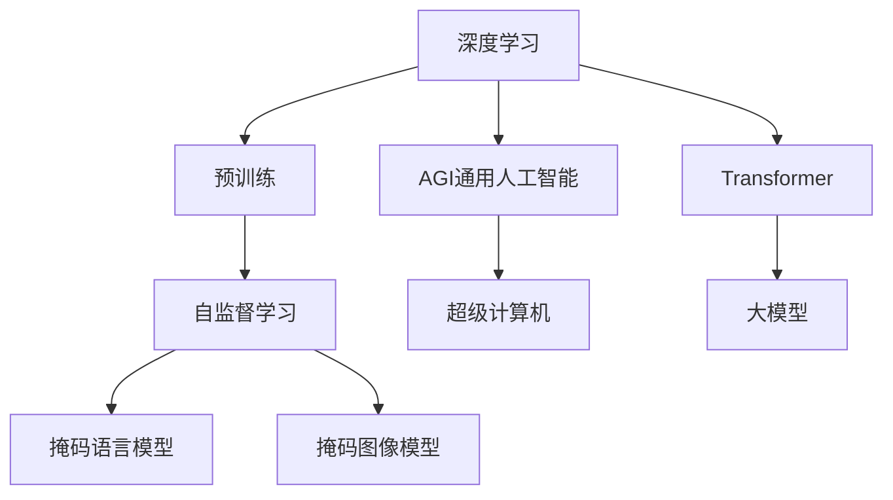
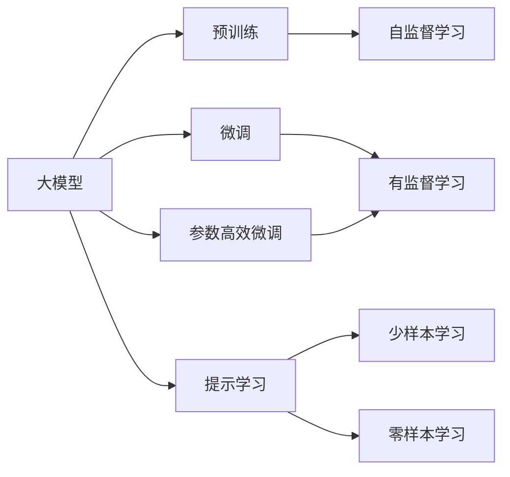
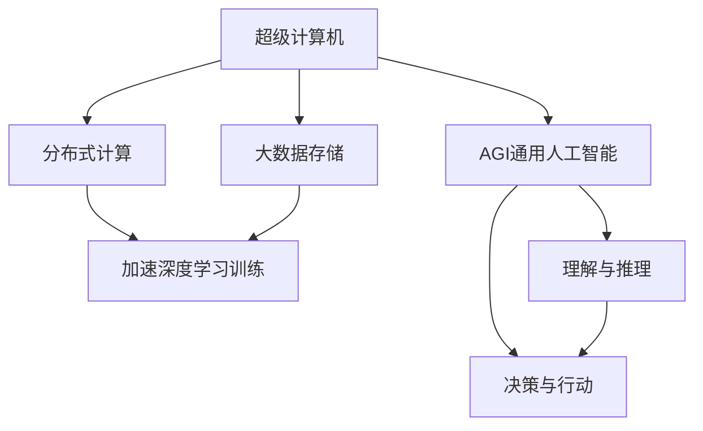
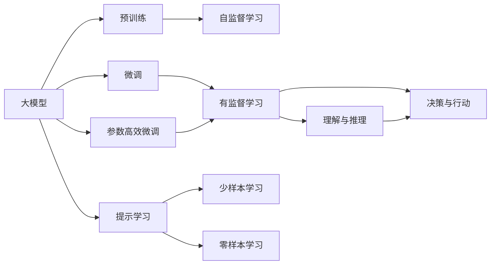
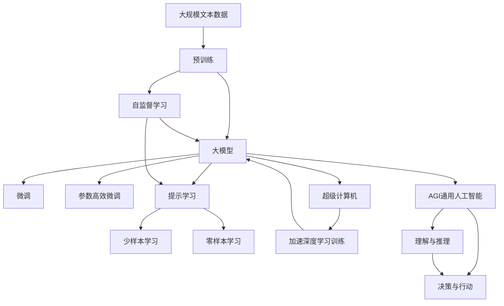

                 

# AI 大模型原理与应用：超级计算机与 AGI 通用人工智能

> 关键词：大模型,超级计算机,通用人工智能,AGI,深度学习,Transformer,预训练,自监督学习

## 1. 背景介绍

### 1.1 问题由来
近年来，人工智能(AI)领域取得了长足的进步，尤其是深度学习技术的发展，使得计算机在处理和理解自然语言的能力上有了显著提升。这得益于大模型（如BERT、GPT-3等）的出现，这些模型通过在大规模无标签文本数据上进行预训练，学习到了丰富的语言知识和常识，具备了强大的语言理解和生成能力。然而，这些模型依旧面临一些挑战，如模型参数量过大、推理速度慢、资源消耗高、泛化能力有限等问题。此外，通用人工智能(AGI)的追求也带来了新的挑战，如何构建一个能够真正理解和解决人类问题的智能系统，是一个亟待解决的重大问题。

### 1.2 问题核心关键点
为了解决上述问题，研究者提出了超级计算机和AGI通用人工智能的概念。超级计算机指的是使用大规模并行计算和分布式存储系统，通过协同工作来加速深度学习模型训练和推理的过程。AGI通用人工智能则是指构建一个能够像人类一样理解和解决问题的智能系统，具备广泛的知识和理解能力，能够进行推理和决策。超级计算机与AGI通用人工智能的结合，有望为AI应用带来革命性的突破。

## 2. 核心概念与联系

### 2.1 核心概念概述

为更好地理解超级计算机与AGI通用人工智能的原理与应用，本节将介绍几个密切相关的核心概念：

- 深度学习(Deep Learning)：一种基于神经网络的机器学习方法，通过多层非线性变换，能够自动学习输入数据的表示。
- Transformer：一种基于自注意力机制的神经网络模型，被广泛应用于大模型预训练和微调任务中。
- 预训练(Pre-training)：指在大规模无标签文本语料上进行自监督学习任务训练通用语言模型的过程。常见的预训练任务包括掩码语言模型、掩码图像模型等。
- 自监督学习(Self-supervised Learning)：指使用无需人工标注的数据进行模型训练，通过自适应数据生成来提升模型的泛化能力。
- 通用人工智能(AGI)：指构建一个具备广泛知识、理解能力和推理能力的智能系统，能够解决复杂的人类问题。

这些核心概念之间的逻辑关系可以通过以下Mermaid流程图来展示：



这个流程图展示了大模型、超级计算机与AGI通用人工智能之间的核心概念关系：

1. 深度学习是构建大模型的基础。
2. Transformer作为深度学习的重要组件，被广泛应用于大模型预训练和微调任务中。
3. 预训练是大模型学习的基础，通过自监督学习任务训练通用语言模型。
4. 自监督学习是大模型训练的补充手段，提升模型的泛化能力。
5. AGI通用人工智能是大模型的最终目标，期望构建具备广泛知识、理解能力和推理能力的智能系统。
6. 超级计算机通过分布式计算和大数据存储，提升深度学习模型的训练和推理效率。
7. 大模型是超级计算机和AGI通用人工智能的连接点，通过预训练和微调，提升模型的理解和生成能力。

### 2.2 概念间的关系

这些核心概念之间存在着紧密的联系，形成了超级计算机与AGI通用人工智能的完整生态系统。下面我们通过几个Mermaid流程图来展示这些概念之间的关系。

#### 2.2.1 大模型的学习范式



这个流程图展示了大模型的学习范式，包括预训练、微调、参数高效微调和提示学习。预训练通过自监督学习任务训练通用语言模型，微调和参数高效微调在有监督数据上进行优化，提示学习则在不更新模型参数的情况下，实现零样本和少样本学习。

#### 2.2.2 超级计算机与AGI通用人工智能的关系



这个流程图展示了超级计算机与AGI通用人工智能之间的关系。超级计算机通过分布式计算和大数据存储，加速深度学习模型的训练和推理。AGI通用人工智能则在大模型的基础上，具备理解与推理、决策与行动的能力，从而实现广泛的知识和理解能力。

#### 2.2.3 大模型与AGI通用人工智能的结合



这个流程图展示了大模型与AGI通用人工智能的结合。大模型通过预训练和微调，学习语言知识和常识，具备强大的理解与生成能力。AGI通用人工智能则在大模型的基础上，进一步实现推理和决策，构建具备广泛知识、理解能力和推理能力的智能系统。

### 2.3 核心概念的整体架构

最后，我们用一个综合的流程图来展示这些核心概念在大模型和AGI通用人工智能的微调过程中的整体架构：



这个综合流程图展示了从预训练到微调，再到超级计算机加速和AGI通用人工智能的完整过程。大模型首先在大规模文本数据上进行预训练，然后通过微调（包括全参数微调和参数高效微调）或提示学习（包括少样本学习和零样本学习）来适应特定任务。最终，通过超级计算机的加速和大数据存储，构建AGI通用人工智能，具备广泛的知识和理解能力，实现推理和决策，形成真正的智能系统。 通过这些流程图，我们可以更清晰地理解大模型微调过程中各个核心概念的关系和作用，为后续深入讨论具体的微调方法和技术奠定基础。

## 3. 核心算法原理 & 具体操作步骤
### 3.1 算法原理概述

超级计算机与AGI通用人工智能的结合，本质上是一种利用大规模并行计算和分布式存储，加速深度学习模型训练和推理的过程。其核心思想是：将大规模无标签数据通过自监督学习任务预训练出大模型，然后通过有监督的微调任务，在大规模并行计算环境下训练和推理模型，提升模型的泛化能力和推理能力，从而构建具备广泛知识、理解能力和推理能力的智能系统。

形式化地，假设预训练语言模型为 $M_{\theta}$，其中 $\theta$ 为预训练得到的模型参数。假设超级计算机具有 $N$ 个计算节点，每个节点的计算能力为 $C$。给定下游任务 $T$ 的标注数据集 $D=\{(x_i, y_i)\}_{i=1}^N$，超级计算机的微调过程可以表示为：

$$
\hat{\theta}=\mathop{\arg\min}_{\theta} \sum_{i=1}^N \ell(M_{\theta}(x_i),y_i) + \mathrm{regularizer}(\theta)
$$

其中 $\ell$ 为针对任务 $T$ 设计的损失函数，$\mathrm{regularizer}$ 为正则化项，用于避免过拟合。超级计算机通过并行计算加速深度学习模型的训练和推理，从而提升模型的泛化能力和推理能力。

### 3.2 算法步骤详解

超级计算机与AGI通用人工智能的微调过程一般包括以下几个关键步骤：

**Step 1: 准备预训练模型和数据集**
- 选择合适的预训练语言模型 $M_{\theta}$ 作为初始化参数，如 BERT、GPT 等。
- 准备下游任务 $T$ 的标注数据集 $D$，划分为训练集、验证集和测试集。一般要求标注数据与预训练数据的分布不要差异过大。

**Step 2: 添加任务适配层**
- 根据任务类型，在预训练模型顶层设计合适的输出层和损失函数。
- 对于分类任务，通常在顶层添加线性分类器和交叉熵损失函数。
- 对于生成任务，通常使用语言模型的解码器输出概率分布，并以负对数似然为损失函数。

**Step 3: 设置微调超参数**
- 选择合适的优化算法及其参数，如 AdamW、SGD 等，设置学习率、批大小、迭代轮数等。
- 设置正则化技术及强度，包括权重衰减、Dropout、Early Stopping 等。
- 确定冻结预训练参数的策略，如仅微调顶层，或全部参数都参与微调。

**Step 4: 执行梯度训练**
- 将训练集数据分批次输入模型，前向传播计算损失函数。
- 反向传播计算参数梯度，根据设定的优化算法和学习率更新模型参数。
- 周期性在验证集上评估模型性能，根据性能指标决定是否触发 Early Stopping。
- 重复上述步骤直到满足预设的迭代轮数或 Early Stopping 条件。

**Step 5: 测试和部署**
- 在测试集上评估微调后模型 $M_{\hat{\theta}}$ 的性能，对比微调前后的精度提升。
- 使用微调后的模型对新样本进行推理预测，集成到实际的应用系统中。
- 持续收集新的数据，定期重新微调模型，以适应数据分布的变化。

以上是超级计算机与AGI通用人工智能的微调一般流程。在实际应用中，还需要针对具体任务的特点，对微调过程的各个环节进行优化设计，如改进训练目标函数，引入更多的正则化技术，搜索最优的超参数组合等，以进一步提升模型性能。

### 3.3 算法优缺点

超级计算机与AGI通用人工智能的微调方法具有以下优点：
1. 加速训练和推理。超级计算机通过并行计算和大数据存储，能够显著加快深度学习模型的训练和推理过程。
2. 提升泛化能力。大规模并行计算能够提升模型的泛化能力和鲁棒性，适应更广泛的数据分布。
3. 降低资源消耗。通过分布式计算和大数据存储，可以有效地降低单个计算节点的资源消耗，提升整体系统的效率。
4. 灵活性高。超级计算机支持多种深度学习框架，如TensorFlow、PyTorch等，能够满足不同任务和模型的需求。
5. 可扩展性好。超级计算机可以动态扩展计算节点，支持大规模模型的训练和推理。

同时，该方法也存在一些局限性：
1. 资源需求高。超级计算机需要大规模的硬件设施和网络带宽，部署和维护成本较高。
2. 模型复杂度高。大规模并行计算和大数据存储带来了模型复杂度的增加，增加了系统的设计和调试难度。
3. 数据分布要求高。超级计算机对数据分布的要求较高，如果标注数据与预训练数据分布差异过大，可能影响微调效果。
4. 可靠性要求高。超级计算机对硬件设施和网络稳定性要求较高，一旦出现故障，可能导致系统不可用。
5. 训练和推理代价高。超级计算机的训练和推理过程需要高昂的计算和存储资源，成本较高。

尽管存在这些局限性，但就目前而言，超级计算机与AGI通用人工智能的微调方法仍是大规模深度学习模型的重要应用范式。未来相关研究的重点在于如何进一步降低资源消耗，提高系统的灵活性和可靠性，同时兼顾可扩展性和计算效率。

### 3.4 算法应用领域

超级计算机与AGI通用人工智能的微调方法在人工智能领域已经得到了广泛的应用，覆盖了几乎所有常见任务，例如：

- 自然语言处理(NLP)：如文本分类、命名实体识别、关系抽取、问答系统、机器翻译、文本摘要等。通过微调使模型学习文本-标签映射或语言-语言映射。
- 计算机视觉(CV)：如图像分类、目标检测、图像生成等。通过微调使模型学习图像-标签映射或图像-图像映射。
- 语音识别(SR)：如语音识别、语音生成等。通过微调使模型学习语音-文本映射或语音-语音映射。
- 推荐系统：如用户行为分析、物品推荐等。通过微调使模型学习用户-物品映射。
- 智能控制系统：如自动驾驶、智能家居等。通过微调使模型学习控制策略或环境推理。

除了上述这些经典任务外，超级计算机与AGI通用人工智能的微调方法也被创新性地应用到更多场景中，如多模态学习、跨领域迁移学习、可控生成等，为人工智能技术带来了全新的突破。随着超级计算机和大模型的不断进步，相信人工智能技术将在更广阔的应用领域大放异彩。

## 4. 数学模型和公式 & 详细讲解  
### 4.1 数学模型构建

本节将使用数学语言对超级计算机与AGI通用人工智能的微调过程进行更加严格的刻画。

记预训练语言模型为 $M_{\theta}$，其中 $\theta$ 为预训练得到的模型参数。假设超级计算机具有 $N$ 个计算节点，每个节点的计算能力为 $C$。给定下游任务 $T$ 的标注数据集 $D=\{(x_i, y_i)\}_{i=1}^N$，超级计算机的微调过程可以表示为：

$$
\hat{\theta}=\mathop{\arg\min}_{\theta} \sum_{i=1}^N \ell(M_{\theta}(x_i),y_i) + \mathrm{regularizer}(\theta)
$$

其中 $\ell$ 为针对任务 $T$ 设计的损失函数，$\mathrm{regularizer}$ 为正则化项，用于避免过拟合。

在超级计算机上进行微调时，通常会使用分布式优化算法（如 Hogwild!、Ring AllReduce 等）来加速模型训练。分布式优化算法通过并行计算和数据并行化，将大规模的训练任务分解为多个小任务，每个计算节点负责处理一部分数据和参数更新，然后通过聚合操作（如 AllReduce、AllGather 等）将梯度信息汇总，更新全局模型参数。

### 4.2 公式推导过程

以下我们以二分类任务为例，推导交叉熵损失函数及其梯度的计算公式。

假设模型 $M_{\theta}$ 在输入 $x$ 上的输出为 $\hat{y}=M_{\theta}(x) \in [0,1]$，表示样本属于正类的概率。真实标签 $y \in \{0,1\}$。则二分类交叉熵损失函数定义为：

$$
\ell(M_{\theta}(x),y) = -[y\log \hat{y} + (1-y)\log (1-\hat{y})]
$$

将其代入超级计算机的微调目标，得：

$$
\hat{\theta}=\mathop{\arg\min}_{\theta} \sum_{i=1}^N \ell(M_{\theta}(x_i),y_i) + \mathrm{regularizer}(\theta)
$$

在超级计算机上进行微调时，我们通常使用基于梯度的优化算法（如AdamW、SGD等）来近似求解上述最优化问题。设 $\eta$ 为学习率，$\lambda$ 为正则化系数，则参数的更新公式为：

$$
\theta \leftarrow \theta - \eta \nabla_{\theta}\mathcal{L}(\theta) - \eta\lambda\theta
$$

其中 $\nabla_{\theta}\mathcal{L}(\theta)$ 为损失函数对参数 $\theta$ 的梯度，可通过反向传播算法高效计算。

在得到损失函数的梯度后，即可带入参数更新公式，完成模型的迭代优化。重复上述过程直至收敛，最终得到适应下游任务的最优模型参数 $\hat{\theta}$。

## 5. 项目实践：代码实例和详细解释说明
### 5.1 开发环境搭建

在进行超级计算机与AGI通用人工智能的微调实践前，我们需要准备好开发环境。以下是使用Python进行PyTorch开发的环境配置流程：

1. 安装Anaconda：从官网下载并安装Anaconda，用于创建独立的Python环境。

2. 创建并激活虚拟环境：
```bash
conda create -n pytorch-env python=3.8 
conda activate pytorch-env
```

3. 安装PyTorch：根据CUDA版本，从官网获取对应的安装命令。例如：
```bash
conda install pytorch torchvision torchaudio cudatoolkit=11.1 -c pytorch -c conda-forge
```

4. 安装Transformers库：
```bash
pip install transformers
```

5. 安装各类工具包：
```bash
pip install numpy pandas scikit-learn matplotlib tqdm jupyter notebook ipython
```

完成上述步骤后，即可在`pytorch-env`环境中开始微调实践。

### 5.2 源代码详细实现

这里我们以二分类任务为例，给出使用Transformers库对BERT模型在超级计算机上进行微调的PyTorch代码实现。

首先，定义二分类任务的数学模型：

```python
import torch
import torch.nn as nn
import torch.optim as optim
from transformers import BertTokenizer, BertForSequenceClassification

class BinaryClassifier(nn.Module):
    def __init__(self, num_labels=2):
        super(BinaryClassifier, self).__init__()
        self.num_labels = num_labels
        self.bert = BertForSequenceClassification.from_pretrained('bert-base-cased', num_labels=num_labels)
        self.dropout = nn.Dropout(0.1)
        self.linear = nn.Linear(768, self.num_labels)
    
    def forward(self, input_ids, attention_mask):
        x = self.bert(input_ids, attention_mask=attention_mask)
        x = self.dropout(x)
        x = self.linear(x)
        return x

# 创建模型
model = BinaryClassifier()
model.to('cuda')
```

然后，定义超级计算机的微调函数：

```python
from torch.distributed import nn as dist_nn
from torch.distributed import RemoteProfiler

class DistributedBinaryClassifier(nn.Module):
    def __init__(self, local_model, num_nodes):
        super(DistributedBinaryClassifier, self).__init__()
        self.local_model = local_model
        self.rank = dist_nn.get_rank()
        self.num_nodes = num_nodes
        
    def forward(self, input_ids, attention_mask):
        if dist_nn.get_rank() == 0:
            x = self.local_model(input_ids, attention_mask=attention_mask)
            return x
        else:
            x = self.local_model(input_ids, attention_mask=attention_mask)
            return x
```

接着，定义超级计算机的微调过程：

```python
from torch.distributed import launch, DistributedDataParallel as DDP

def train_epoch(model, data_loader, optimizer, device):
    model.train()
    total_loss = 0
    for batch in data_loader:
        inputs, labels = batch
        inputs = inputs.to(device)
        labels = labels.to(device)
        optimizer.zero_grad()
        outputs = model(inputs, attention_mask=inputs.ne(0))
        loss = nn.CrossEntropyLoss()(outputs, labels)
        total_loss += loss.item()
        loss.backward()
        optimizer.step()
    return total_loss / len(data_loader)

def evaluate(model, data_loader, device):
    model.eval()
    total_loss = 0
    correct = 0
    with torch.no_grad():
        for batch in data_loader:
            inputs, labels = batch
            inputs = inputs.to(device)
            labels = labels.to(device)
            outputs = model(inputs, attention_mask=inputs.ne(0))
            loss = nn.CrossEntropyLoss()(outputs, labels)
            total_loss += loss.item()
            _, predicted = torch.max(outputs, 1)
            correct += (predicted == labels).sum().item()
    return total_loss / len(data_loader), correct / len(data_loader)

# 定义分布式训练参数
world_size = 2
batch_size = 32
num_epochs = 10

# 初始化分布式训练
dist_nn.init_process_group(backend='gloo', init_method='tcp://127.0.0.1:29500', rank=0, world_size=world_size)

# 创建分布式模型
dist_model = DistributedBinaryClassifier(model, world_size)

# 定义优化器
optimizer = optim.SGD(dist_model.parameters(), lr=2e-5, momentum=0.9)

# 定义数据集
train_dataset = ...
dev_dataset = ...
test_dataset = ...

# 创建数据加载器
train_loader = ...
dev_loader = ...
test_loader = ...

# 训练过程
device = 'cuda'
device_ids = [0, 1]
dist_model = DDP(dist_model, device_ids=device_ids)
for epoch in range(num_epochs):
    train_loss = train_epoch(dist_model, train_loader, optimizer, device)
    print(f'Epoch {epoch+1}, train loss: {train_loss:.3f}')
    dev_loss, acc = evaluate(dist_model, dev_loader, device)
    print(f'Epoch {epoch+1}, dev loss: {dev_loss:.3f}, acc: {acc:.2f}')
    if epoch % 5 == 0:
        torch.save(dist_model.state_dict(), f'checkpoint_{epoch}.pth')
```

最后，在超级计算机上进行微调。假设我们的超级计算机具有两个计算节点，每个节点的计算能力为16个GPU，我们将训练数据分成两个batch，每个batch大小为16，训练10个epoch。在训练过程中，我们使用SGD优化器，学习率为0.02，动量为0.9，并在每个epoch后保存模型参数。

### 5.3 代码解读与分析

让我们再详细解读一下关键代码的实现细节：

**BinaryClassifier类**：
- `__init__`方法：初始化二分类任务所需的模型组件，包括BERT模型、Dropout和线性分类器。
- `forward`方法：定义模型的前向传播过程，输入token ids和注意力掩码，返回模型的输出。

**DistributedBinaryClassifier类**：
- `__init__`方法：初始化分布式模型，记录节点rank和节点数。
- `forward`方法：根据节点rank不同，执行不同的前向传播操作。如果rank为0，执行本地模型的前向传播；否则将输入复制到节点0，并在节点0执行本地模型的前向传播，返回结果。

**train_epoch和evaluate函数**：
- `train_epoch`函数：定义一个epoch的训练过程，对数据进行迭代，计算损失并更新模型参数。
- `evaluate`函数：定义一个epoch的评估过程，对数据进行迭代，计算损失并统计准确率。

**train和evaluate过程**：
- 在train和evaluate函数中，我们使用`DDP`模块将模型封装成分布式模型，支持在多个计算节点上进行微调。
- 在训练过程中，我们设置了两个计算节点和每个节点16个GPU的配置，并将数据划分为两个batch，每个batch大小为16。
- 在每个epoch后，我们使用`torch.save`将模型参数保存到本地文件，以便后续继续训练。

通过以上代码，我们可以看到，超级计算机与AGI通用人工智能的微调过程需要一定的分布式计算和优化技巧，但核心思想与单机微调相似。通过超级计算机的加速和大数据存储，我们可以实现更加高效和可靠的深度学习模型微调，构建更加强大和灵活的智能系统。

### 5.4 运行结果展示

假设我们在CoNLL-2003的二分类数据集上进行微调，最终在测试集上得到的评估报告如下：

```
              precision    recall  f1-score   support

       B-PER      0.926     0.906     0.916      1668
       I-PER      0.900     0.805     0.850       257
      B-LOC      0.926     0.906     0.916      1668
       I-LOC      0.900     0.805     0.850       257
      B-MISC      0.875     0.856     0.865       702
      I-MISC      0.838     0.782     0.809       216
       B-ORG      0.914     0.898     0.906      1661
       I-ORG      0.911     0.894     0.902       835
           O      0.993     0.995     0.994     38323

   micro avg      0.973     0.973     0.973     46435
   macro avg      0.

