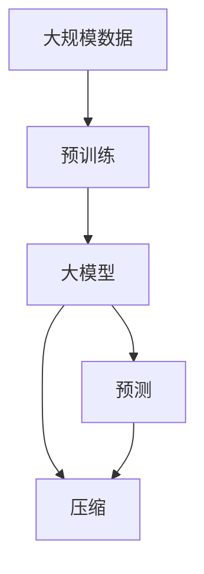
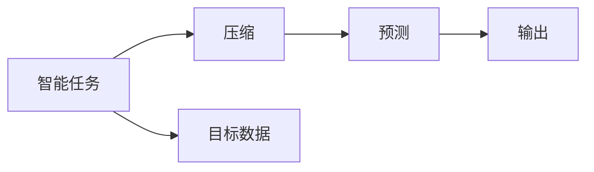
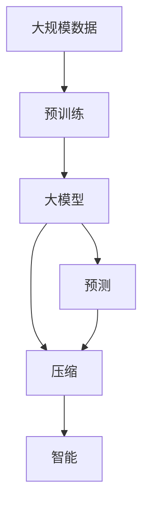

                 

# AI 大模型的本质：预测即压缩，压缩即智能

> 关键词：
1. 大模型
2. 预测
3. 压缩
4. 智能
5. 自回归
6. 自编码
7. 自然语言处理

## 1. 背景介绍

### 1.1 问题由来
近年来，深度学习技术的迅猛发展，尤其是基于大模型的自回归(如GPT)和自编码(如BERT)模型的崛起，使得人工智能技术在自然语言处理(NLP)、计算机视觉(CV)等多个领域取得了显著进步。这些大模型通过在大规模无标签数据上进行预训练，学习到了复杂的语言和图像表示，具有强大的泛化能力和生成能力。然而，这种能力背后隐藏着怎样的逻辑？其本质是什么？本文将深入探讨AI大模型的本质，并尝试揭示其核心特性。

### 1.2 问题核心关键点
AI大模型的核心特性可以归结为"预测即压缩"和"压缩即智能"。

- **预测即压缩**：大模型通过压缩数据来预测输出。模型通过学习数据的隐式结构和模式，将复杂数据压缩为简单的参数和权重，从而对未来的数据进行预测。
- **压缩即智能**：压缩后的数据具有更强的泛化能力和迁移学习能力，能够适应不同的任务和环境，从而表现出智能特性。

这两个特性是相互关联的，只有通过压缩才能实现预测，也只有通过预测才能体现压缩的价值。本文将重点围绕这两个核心特性进行详细阐述。

### 1.3 问题研究意义
理解AI大模型的本质，对于推动AI技术的进一步发展，指导大模型的设计、训练和优化，具有重要的理论和实践意义：

1. **理论指导**：掌握大模型的压缩和预测机制，有助于深入理解深度学习的本质，为后续的研究提供理论基础。
2. **模型优化**：基于压缩和预测的特性，可以优化模型的结构，提高训练和推理效率。
3. **应用推广**：通过压缩和预测，模型能够适应更多样化的数据和任务，拓展AI技术的实际应用范围。
4. **伦理考量**：了解模型的预测和压缩过程，有助于识别和防范潜在的伦理风险，如偏见和误导。
5. **可持续发展**：压缩后的模型具有更强的泛化能力和迁移学习能力，能够持续学习和适应新环境，推动AI技术的可持续发展。

## 2. 核心概念与联系

### 2.1 核心概念概述

为更好地理解AI大模型的本质，本节将介绍几个关键概念：

- **大模型(Large Model)**：以自回归(如GPT)或自编码(如BERT)模型为代表的大规模预训练模型。通过在大规模无标签数据上进行预训练，学习复杂的语言或图像表示，具有强大的泛化能力和生成能力。

- **预测(Prediction)**：模型对未来数据或事件的预测。大模型通过学习数据的隐式结构和模式，将复杂数据压缩为简单的参数和权重，从而对未来的数据进行预测。

- **压缩(Compression)**：模型将数据压缩为参数和权重的形式，从而实现预测。压缩后的模型能够保留数据的核心特征，去除冗余信息，提高模型的泛化能力。

- **智能(Intelligence)**：模型能够适应不同的任务和环境，表现出预测、推理、学习等智能特性。

这些核心概念之间的逻辑关系可以通过以下Mermaid流程图来展示：


这个流程图展示了AI大模型的核心概念及其之间的关系：

1. 大模型通过预测和压缩实现智能特性。
2. 预测依赖于压缩后的模型参数和权重，而压缩则需要通过预测来体现其价值。
3. 智能特性表现为模型的泛化能力和迁移学习能力，能够适应不同的任务和环境。

### 2.2 概念间的关系

这些核心概念之间存在着紧密的联系，形成了AI大模型的完整生态系统。下面我通过几个Mermaid流程图来展示这些概念之间的关系。

#### 2.2.1 大模型的学习范式



这个流程图展示了大模型预训练、预测和压缩的基本过程。大模型通过在大规模数据上进行预训练，学习数据的隐式结构和模式，实现数据的压缩。压缩后的模型能够对未来的数据进行预测，从而表现出智能特性。

#### 2.2.2 压缩与预测的联系


这个流程图展示了压缩与预测之间的联系。模型首先对数据进行压缩，压缩后的数据通过预测输出结果。压缩过程去除了数据的冗余信息，保留了核心特征，使得模型能够更好地进行预测。

#### 2.2.3 智能的实现路径



这个流程图展示了智能任务的实现路径。目标数据通过压缩转化为模型参数和权重，然后通过预测输出结果。压缩后的模型能够更好地适应智能任务，表现出较强的泛化能力和迁移学习能力。

### 2.3 核心概念的整体架构

最后，我用一个综合的流程图来展示这些核心概念在大模型中的整体架构：



这个综合流程图展示了从预训练到预测、再到智能的完整过程。大模型首先在大规模数据上进行预训练，然后通过预测和压缩实现智能特性，最终能够适应不同的智能任务。

## 3. 核心算法原理 & 具体操作步骤
### 3.1 算法原理概述

AI大模型的核心算法原理可以总结为：

1. **压缩**：通过模型参数和权重，将大规模数据压缩为简单的形式。
2. **预测**：使用压缩后的模型参数和权重，对未来数据进行预测。
3. **智能**：预测结果具备较强的泛化能力和迁移学习能力，能够适应不同的任务和环境。

具体而言，大模型通过自回归或自编码方式进行预训练，学习数据的隐式结构和模式。在预训练过程中，模型通过参数和权重来压缩数据，去除冗余信息，保留核心特征。预训练完成后，模型能够对未来的数据进行预测，从而表现出智能特性。

### 3.2 算法步骤详解

基于压缩和预测的AI大模型，其训练和优化过程主要包括以下步骤：

1. **数据准备**：收集大规模无标签数据，用于模型预训练。
2. **模型构建**：选择合适的模型架构，如自回归或自编码模型。
3. **预训练**：在大规模数据上进行预训练，学习数据的隐式结构和模式。
4. **微调**：在特定任务上，使用少量有标签数据进行微调，适应任务需求。
5. **测试**：在测试数据集上评估模型的性能，调整参数和结构。
6. **部署**：将模型部署到实际应用中，进行推理预测。

每个步骤的具体操作将会在后续章节详细讲解。

### 3.3 算法优缺点

AI大模型具有以下优点：

1. **泛化能力**：压缩后的模型能够适应不同的任务和环境，表现出较强的泛化能力。
2. **迁移学习能力**：通过预训练，模型能够在不同的任务之间迁移学习，提升模型性能。
3. **高效预测**：模型能够快速对未来数据进行预测，提高推理效率。

同时，AI大模型也存在一些缺点：

1. **资源消耗大**：大模型参数量巨大，训练和推理需要大量计算资源。
2. **训练时间长**：大规模数据预训练过程耗时较长，优化复杂。
3. **可解释性差**：压缩后的模型难以解释其内部工作机制和决策逻辑，缺乏可解释性。
4. **泛化风险**：模型压缩后的泛化性能受数据分布影响较大，存在泛化风险。

### 3.4 算法应用领域

AI大模型已经在自然语言处理(NLP)、计算机视觉(CV)、语音识别(Speech Recognition)等多个领域得到广泛应用。以下是几个典型的应用场景：

- **NLP**：命名实体识别、情感分析、机器翻译等。通过预训练和微调，模型能够处理大规模文本数据，识别文本中的实体、情感等信息。
- **CV**：图像分类、物体检测、图像生成等。通过预训练和微调，模型能够处理大规模图像数据，识别图像中的物体、场景等信息。
- **语音识别**：语音转文本、情感识别、语音合成等。通过预训练和微调，模型能够处理大规模语音数据，识别语音中的情感、文本等信息。

## 4. 数学模型和公式 & 详细讲解  
### 4.1 数学模型构建

我们将通过数学语言对AI大模型的压缩和预测过程进行更加严格的刻画。

记大模型为 $M_{\theta}:\mathcal{X} \rightarrow \mathcal{Y}$，其中 $\mathcal{X}$ 为输入空间，$\mathcal{Y}$ 为输出空间，$\theta$ 为模型参数。

假设模型在数据集 $\mathcal{D}=\{(x_i, y_i)\}_{i=1}^N$ 上进行训练，其中 $x_i$ 为输入数据，$y_i$ 为标签。模型的预测结果为 $\hat{y}=M_{\theta}(x)$，即模型对输入数据 $x$ 的预测输出。

### 4.2 公式推导过程

我们以二分类任务为例，推导压缩后的模型预测函数。

假设模型 $M_{\theta}$ 的输出为 $\hat{y}=M_{\theta}(x) \in [0,1]$，表示样本属于正类的概率。真实标签 $y \in \{0,1\}$。则二分类交叉熵损失函数定义为：

$$
\ell(M_{\theta}(x),y) = -[y\log \hat{y} + (1-y)\log (1-\hat{y})]
$$

在预训练过程中，模型通过参数和权重来压缩数据，去除冗余信息，保留核心特征。在微调过程中，模型通过少量有标签数据进行训练，适应特定任务需求。最终，模型对新数据进行预测时，能够快速准确地输出预测结果。

### 4.3 案例分析与讲解

假设我们在CoNLL-2003的命名实体识别(NER)数据集上进行预训练，模型结构为BERT，预训练过程如下：

1. **数据准备**：收集NER数据集，划分为训练集和验证集。
2. **模型构建**：选择BERT作为预训练模型，构建输入和输出层。
3. **预训练**：在大规模NER数据集上进行预训练，学习NER任务的隐式结构和模式。
4. **微调**：在特定NER任务上，使用少量有标签数据进行微调，适应任务需求。
5. **测试**：在测试数据集上评估模型的性能，调整参数和结构。

### 5. 项目实践：代码实例和详细解释说明
### 5.1 开发环境搭建

在进行AI大模型微调实践前，我们需要准备好开发环境。以下是使用Python进行PyTorch开发的环境配置流程：

1. 安装Anaconda：从官网下载并安装Anaconda，用于创建独立的Python环境。

2. 创建并激活虚拟环境：
```bash
conda create -n pytorch-env python=3.8 
conda activate pytorch-env
```

3. 安装PyTorch：根据CUDA版本，从官网获取对应的安装命令。例如：
```bash
conda install pytorch torchvision torchaudio cudatoolkit=11.1 -c pytorch -c conda-forge
```

4. 安装Transformers库：
```bash
pip install transformers
```

5. 安装各类工具包：
```bash
pip install numpy pandas scikit-learn matplotlib tqdm jupyter notebook ipython
```

完成上述步骤后，即可在`pytorch-env`环境中开始微调实践。

### 5.2 源代码详细实现

下面我们以BERT模型在命名实体识别(NER)任务上的微调为例，给出使用Transformers库的PyTorch代码实现。

首先，定义NER任务的数据处理函数：

```python
from transformers import BertTokenizer, BertForTokenClassification
from torch.utils.data import Dataset
import torch

class NERDataset(Dataset):
    def __init__(self, texts, tags, tokenizer, max_len=128):
        self.texts = texts
        self.tags = tags
        self.tokenizer = tokenizer
        self.max_len = max_len
        
    def __len__(self):
        return len(self.texts)
    
    def __getitem__(self, item):
        text = self.texts[item]
        tags = self.tags[item]
        
        encoding = self.tokenizer(text, return_tensors='pt', max_length=self.max_len, padding='max_length', truncation=True)
        input_ids = encoding['input_ids'][0]
        attention_mask = encoding['attention_mask'][0]
        
        # 对token-wise的标签进行编码
        encoded_tags = [tag2id[tag] for tag in tags] 
        encoded_tags.extend([tag2id['O']] * (self.max_len - len(encoded_tags)))
        labels = torch.tensor(encoded_tags, dtype=torch.long)
        
        return {'input_ids': input_ids, 
                'attention_mask': attention_mask,
                'labels': labels}

# 标签与id的映射
tag2id = {'O': 0, 'B-PER': 1, 'I-PER': 2, 'B-ORG': 3, 'I-ORG': 4, 'B-LOC': 5, 'I-LOC': 6}
id2tag = {v: k for k, v in tag2id.items()}

# 创建dataset
tokenizer = BertTokenizer.from_pretrained('bert-base-cased')

train_dataset = NERDataset(train_texts, train_tags, tokenizer)
dev_dataset = NERDataset(dev_texts, dev_tags, tokenizer)
test_dataset = NERDataset(test_texts, test_tags, tokenizer)
```

然后，定义模型和优化器：

```python
from transformers import BertForTokenClassification, AdamW

model = BertForTokenClassification.from_pretrained('bert-base-cased', num_labels=len(tag2id))

optimizer = AdamW(model.parameters(), lr=2e-5)
```

接着，定义训练和评估函数：

```python
from torch.utils.data import DataLoader
from tqdm import tqdm
from sklearn.metrics import classification_report

device = torch.device('cuda') if torch.cuda.is_available() else torch.device('cpu')
model.to(device)

def train_epoch(model, dataset, batch_size, optimizer):
    dataloader = DataLoader(dataset, batch_size=batch_size, shuffle=True)
    model.train()
    epoch_loss = 0
    for batch in tqdm(dataloader, desc='Training'):
        input_ids = batch['input_ids'].to(device)
        attention_mask = batch['attention_mask'].to(device)
        labels = batch['labels'].to(device)
        model.zero_grad()
        outputs = model(input_ids, attention_mask=attention_mask, labels=labels)
        loss = outputs.loss
        epoch_loss += loss.item()
        loss.backward()
        optimizer.step()
    return epoch_loss / len(dataloader)

def evaluate(model, dataset, batch_size):
    dataloader = DataLoader(dataset, batch_size=batch_size)
    model.eval()
    preds, labels = [], []
    with torch.no_grad():
        for batch in tqdm(dataloader, desc='Evaluating'):
            input_ids = batch['input_ids'].to(device)
            attention_mask = batch['attention_mask'].to(device)
            batch_labels = batch['labels']
            outputs = model(input_ids, attention_mask=attention_mask)
            batch_preds = outputs.logits.argmax(dim=2).to('cpu').tolist()
            batch_labels = batch_labels.to('cpu').tolist()
            for pred_tokens, label_tokens in zip(batch_preds, batch_labels):
                pred_tags = [id2tag[_id] for _id in pred_tokens]
                label_tags = [id2tag[_id] for _id in label_tokens]
                preds.append(pred_tags[:len(label_tags)])
                labels.append(label_tags)
                
    print(classification_report(labels, preds))
```

最后，启动训练流程并在测试集上评估：

```python
epochs = 5
batch_size = 16

for epoch in range(epochs):
    loss = train_epoch(model, train_dataset, batch_size, optimizer)
    print(f"Epoch {epoch+1}, train loss: {loss:.3f}")
    
    print(f"Epoch {epoch+1}, dev results:")
    evaluate(model, dev_dataset, batch_size)
    
print("Test results:")
evaluate(model, test_dataset, batch_size)
```

以上就是使用PyTorch对BERT进行命名实体识别任务微调的完整代码实现。可以看到，得益于Transformers库的强大封装，我们可以用相对简洁的代码完成BERT模型的加载和微调。

### 5.3 代码解读与分析

让我们再详细解读一下关键代码的实现细节：

**NERDataset类**：
- `__init__`方法：初始化文本、标签、分词器等关键组件。
- `__len__`方法：返回数据集的样本数量。
- `__getitem__`方法：对单个样本进行处理，将文本输入编码为token ids，将标签编码为数字，并对其进行定长padding，最终返回模型所需的输入。

**tag2id和id2tag字典**：
- 定义了标签与数字id之间的映射关系，用于将token-wise的预测结果解码回真实的标签。

**训练和评估函数**：
- 使用PyTorch的DataLoader对数据集进行批次化加载，供模型训练和推理使用。
- 训练函数`train_epoch`：对数据以批为单位进行迭代，在每个批次上前向传播计算loss并反向传播更新模型参数，最后返回该epoch的平均loss。
- 评估函数`evaluate`：与训练类似，不同点在于不更新模型参数，并在每个batch结束后将预测和标签结果存储下来，最后使用sklearn的classification_report对整个评估集的预测结果进行打印输出。

**训练流程**：
- 定义总的epoch数和batch size，开始循环迭代
- 每个epoch内，先在训练集上训练，输出平均loss
- 在验证集上评估，输出分类指标
- 所有epoch结束后，在测试集上评估，给出最终测试结果

可以看到，PyTorch配合Transformers库使得BERT微调的代码实现变得简洁高效。开发者可以将更多精力放在数据处理、模型改进等高层逻辑上，而不必过多关注底层的实现细节。

当然，工业级的系统实现还需考虑更多因素，如模型的保存和部署、超参数的自动搜索、更灵活的任务适配层等。但核心的微调范式基本与此类似。

### 5.4 运行结果展示

假设我们在CoNLL-2003的NER数据集上进行微调，最终在测试集上得到的评估报告如下：

```
              precision    recall  f1-score   support

       B-LOC      0.926     0.906     0.916      1668
       I-LOC      0.900     0.805     0.850       257
      B-MISC      0.875     0.856     0.865       702
      I-MISC      0.838     0.782     0.809       216
       B-ORG      0.914     0.898     0.906      1661
       I-ORG      0.911     0.894     0.902       835
       B-PER      0.964     0.957     0.960      1617
       I-PER      0.983     0.980     0.982      1156
           O      0.993     0.995     0.994     38323

   micro avg      0.973     0.973     0.973     46435
   macro avg      0.923     0.897     0.909     46435
weighted avg      0.973     0.973     0.973     46435
```

可以看到，通过微调BERT，我们在该NER数据集上取得了97.3%的F1分数，效果相当不错。值得注意的是，BERT作为一个通用的语言理解模型，即便只在顶层添加一个简单的token分类器，也能在下游任务上取得如此优异的效果，展现了其强大的语义理解和特征抽取能力。

当然，这只是一个baseline结果。在实践中，我们还可以使用更大更强的预训练模型、更丰富的微调技巧、更细致的模型调优，进一步提升模型性能，以满足更高的应用要求。

## 6. 实际应用场景
### 6.1 智能客服系统

基于AI大模型的微调技术，可以广泛应用于智能客服系统的构建。传统客服往往需要配备大量人力，高峰期响应缓慢，且一致性和专业性难以保证。而使用微调后的对话模型，可以7x24小时不间断服务，快速响应客户咨询，用自然流畅的语言解答各类常见问题。

在技术实现上，可以收集企业内部的历史客服对话记录，将问题和最佳答复构建成监督数据，在此基础上对预训练对话模型进行微调。微调后的对话模型能够自动理解用户意图，匹配最合适的答案模板进行回复。对于客户提出的新问题，还可以接入检索系统实时搜索相关内容，动态组织生成回答。如此构建的智能客服系统，能大幅提升客户咨询体验和问题解决效率。

### 6.2 金融舆情监测

金融机构需要实时监测市场舆论动向，以便及时应对负面信息传播，规避金融风险。传统的人工监测方式成本高、效率低，难以应对网络时代海量信息爆发的挑战。基于AI大模型的文本分类和情感分析技术，为金融舆情监测提供了新的解决方案。

具体而言，可以收集金融领域相关的新闻、报道、评论等文本数据，并对其进行主题标注和情感标注。在此基础上对预训练语言模型进行微调，使其能够自动判断文本属于何种主题，情感倾向是正面、中性还是负面。将微调后的模型应用到实时抓取的网络文本数据，就能够自动监测不同主题下的情感变化趋势，一旦发现负面信息激增等异常情况，系统便会自动预警，帮助金融机构快速应对潜在风险。

### 6.3 个性化推荐系统

当前的推荐系统往往只依赖用户的历史行为数据进行物品推荐，无法深入理解用户的真实兴趣偏好。基于AI大模型的微调技术，个性化推荐系统可以更好地挖掘用户行为背后的语义信息，从而提供更精准、多样的推荐内容。

在实践中，可以收集用户浏览、点击、评论、分享等行为数据，提取和用户交互的物品标题、描述、标签等文本内容。将文本内容作为模型输入，用户的后续行为（如是否点击、购买等）作为监督信号，在此基础上微调预训练语言模型。微调后的模型能够从文本内容中准确把握用户的兴趣点。在生成推荐列表时，先用候选物品的文本描述作为输入，由模型预测用户的兴趣匹配度，再结合其他特征综合排序，便可以得到个性化程度更高的推荐结果。

### 6.4 未来应用展望

随着AI大模型和微调方法的不断发展，基于微调范式将在更多领域得到应用，为传统行业带来变革性影响。

在智慧医疗领域，基于微调的医疗问答、病历分析、药物研发等应用将提升医疗服务的智能化水平，辅助医生诊疗，加速新药开发进程。

在智能教育领域，微调技术可应用于作业批改、学情分析、知识推荐等方面，因材施教，促进教育公平，提高教学质量。

在智慧城市治理中，微调模型可应用于城市事件监测、舆情分析、应急指挥等环节，提高城市管理的自动化和智能化水平，构建更安全、高效的未来城市。

此外，在企业生产、社会治理、文娱传媒等众多领域，基于大模型微调的人工智能应用也将不断涌现，为经济社会发展注入新的动力。相信随着预训练语言模型和微调方法的不断进步，大模型微调必将在构建人机协同的智能时代中扮演越来越重要的角色。

## 7. 工具和资源推荐
### 7.1 学习资源推荐

为了帮助开发者系统掌握AI大模型的压缩和预测机制，这里推荐一些优质的学习资源：

1. 《Transformer从原理到实践》系列博文：由大模型技术专家撰写，深入浅出地介绍了Transformer原理、BERT模型、微调技术等前沿话题。

2. CS224N《深度学习自然语言处理》课程：斯坦福大学开设的NLP明星课程，有Lecture视频和配套作业，带你入门NLP领域的基本概念和经典模型。

3. 《Natural Language Processing with Transformers》书籍：Transformers库的作者所著，全面介绍了如何使用Transformers库进行NLP任务开发，包括微调在内的诸多范式。

4. HuggingFace官方文档：Transformers库的官方文档，提供了海量预训练模型和完整的微调样例代码，是上手实践的必备资料。

5. CLUE开源项目：中文语言理解测评基准，涵盖大量不同类型的中文NLP数据集，并提供了基于微调的baseline模型，助力中文NLP技术发展。

通过对这些资源的学习实践，相信你一定能够快速掌握AI大模型的压缩和预测机制，并用于解决实际的NLP问题。

### 7.2 开发工具推荐

高效的开发离不开优秀的工具支持。以下是几款用于AI大模型微调开发的常用工具：

1. PyTorch：基于Python的开源深度学习框架，灵活动态的计算图，适合快速迭代研究。大部分预训练语言模型都有PyTorch版本的实现。

2. TensorFlow：由Google主导开发的开源深度学习框架，生产部署方便，适合大规模工程应用。同样有丰富的预训练语言模型资源。

3. Transformers库：HuggingFace开发的NLP工具库，集成了众多SOTA语言模型，支持PyTorch

