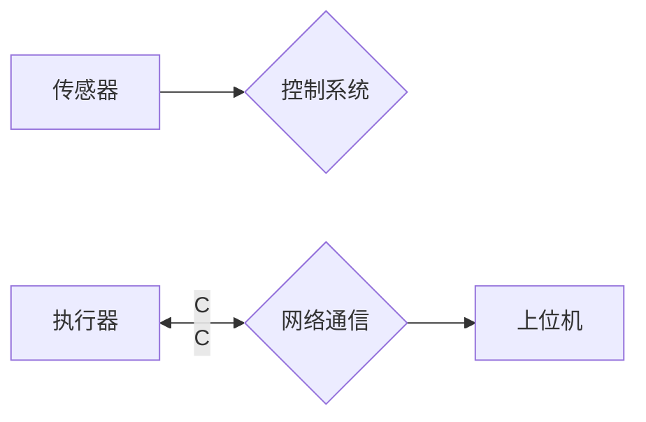

# 纺织机械自动化的历史变迁

## 1. 背景介绍

### 1.1 问题的由来

纺织业是人类最古老的产业之一，也是现代社会不可或缺的重要组成部分。自古以来，纺织生产一直是劳动密集型产业，生产效率低下且对工人的体力要求极高。随着工业革命的兴起，机械化生产逐渐取代了手工劳动，纺织机械应运而生，极大地提高了生产效率，推动了纺织业的快速发展。然而，传统的纺织机械仍然需要大量的人工操作，自动化程度低，难以满足日益增长的市场需求。因此，纺织机械自动化成为了行业发展的必然趋势。

### 1.2 研究现状

经过几十年的发展，纺织机械自动化技术已经取得了长足的进步，从最初的单机自动化发展到现在的数字化、智能化、网络化。具体来说，纺织机械自动化经历了以下几个阶段：

* **机械化阶段（18世纪 - 20世纪初）：** 这一阶段的主要标志是机械取代人力，实现了纺织生产过程中的部分自动化。例如，珍妮纺纱机、水力纺纱机、动力织布机等的发明，大大提高了纺织生产效率。
* **电气化阶段（20世纪初 - 20世纪中期）：** 随着电力技术的应用，纺织机械开始采用电动机驱动，实现了更精准、高效的控制。同时，一些简单的自动控制装置也被应用于纺织机械中。
* **自动化阶段（20世纪中期 - 20世纪末）：** 这一阶段以电子技术、控制理论的快速发展为标志，各种自动化控制系统开始应用于纺织机械中，实现了生产过程的自动控制和调节。例如，自动络筒机、自动穿经机、自动验布机等自动化设备的出现，大大提高了纺织产品的质量和生产效率。
* **数字化、智能化阶段（21世纪至今）：** 随着计算机技术、人工智能、物联网等新一代信息技术的快速发展，纺织机械自动化正朝着数字化、智能化、网络化方向发展。例如，基于机器视觉的智能检测系统、基于大数据的生产过程优化系统、基于工业互联网的远程运维系统等，正在深刻改变着纺织行业的生产模式和管理模式。

### 1.3 研究意义

纺织机械自动化的发展，对于提高纺织行业生产效率、改善产品质量、降低生产成本、提升企业竞争力具有重要意义。具体来说，纺织机械自动化具有以下几个方面的意义：

* **提高生产效率：** 自动化设备可以连续不间断地进行生产，不受人为因素的影响，从而大大提高生产效率。
* **改善产品质量：** 自动化设备可以实现高精度、高一致性的生产，有效减少人为操作带来的误差，提高产品质量。
* **降低生产成本：** 自动化设备可以减少人工成本、材料损耗和能源消耗，从而降低生产成本。
* **提升企业竞争力：** 自动化生产可以帮助企业缩短生产周期、提高产品质量、降低生产成本，从而提升企业在市场竞争中的优势。

### 1.4 本文结构

本文将从纺织机械自动化的历史变迁出发，探讨其发展历程、关键技术、应用现状以及未来趋势。

## 2. 核心概念与联系

在深入探讨纺织机械自动化的发展历程之前，我们先来了解一些核心概念及其之间的联系。

* **纺织机械：** 指用于将纤维加工成纱线、织物以及其他纺织品的机械设备，包括纺纱机械、织造机械、染整机械等。
* **自动化：** 指机器设备、系统或过程在没有人或较少人直接参与的情况下，按照预定的程序或指令自动进行运作或控制。
* **传感器：** 用于感知和测量纺织生产过程中各种物理量（如温度、湿度、压力、速度等）的装置。
* **执行器：** 用于接收控制信号并驱动纺织机械执行相应动作的装置，例如电机、气缸、液压缸等。
* **控制系统：** 用于接收传感器采集的数据，根据预设的程序或算法进行处理，并向执行器发出控制指令，从而实现对纺织机械的自动控制。
* **网络通信：** 用于实现纺织机械之间、纺织机械与控制系统之间、控制系统与上位机之间的数据交换和信息共享。

下图展示了纺织机械自动化系统中各核心概念之间的联系：



## 3. 核心算法原理 & 具体操作步骤

### 3.1 算法原理概述

纺织机械自动化涉及到多种算法，例如 PID 控制算法、模糊控制算法、神经网络算法等。其中，PID 控制算法是应用最为广泛的一种控制算法。

**PID 控制算法**

PID 控制算法是一种线性控制器，其基本原理是根据系统的实际输出值与设定值之间的偏差，利用比例、积分、微分三种控制方式对系统进行调节，使系统的输出值尽可能接近设定值。

* **比例控制（P）：**  根据当前时刻的偏差值进行控制，偏差越大，控制作用越强。
* **积分控制（I）：**  根据偏差的累积值进行控制，可以消除稳态误差。
* **微分控制（D）：**  根据偏差的变化率进行控制，可以抑制超调，提高系统的响应速度。

### 3.2 算法步骤详解

以基于 PID 控制算法的温度控制系统为例，其算法步骤如下：

1. **采集温度信号：** 使用温度传感器采集当前环境温度。
2. **计算偏差值：** 将采集到的温度值与设定温度值进行比较，得到偏差值。
3. **计算 PID 控制量：** 根据 PID 控制算法，分别计算比例、积分、微分控制量。
4. **输出控制信号：** 将计算得到的 PID 控制量叠加，得到最终的控制信号，并将其发送给执行器。
5. **执行器动作：** 执行器根据接收到的控制信号，调节加热器或冷却器的功率，从而控制环境温度。

### 3.3 算法优缺点

**优点：**

* 结构简单，易于理解和实现。
* 控制效果好，可以满足大多数控制系统的要求。
* 应用广泛，适用于各种类型的控制系统。

**缺点：**

* 参数整定困难，需要根据实际情况进行调整。
* 对非线性系统控制效果不佳。
* 抗干扰能力较差。

### 3.4 算法应用领域

PID 控制算法在纺织机械自动化中有着广泛的应用，例如：

* **温度控制：** 用于控制染整、印花等工艺过程中的温度。
* **速度控制：** 用于控制纺纱、织造等工艺过程中的速度。
* **张力控制：** 用于控制纺纱、织造等工艺过程中的张力。
* **位置控制：** 用于控制机械臂、传送带等设备的运动位置。

## 4. 数学模型和公式 & 详细讲解 & 举例说明

### 4.1 数学模型构建

以基于 PID 控制算法的温度控制系统为例，其数学模型可以表示为：

$$
\begin{aligned}
u(t) &= K_p e(t) + K_i \int_0^t e(\tau) d\tau + K_d \frac{de(t)}{dt} \
&= K_p [T_s(t) - T(t)] + K_i \int_0^t [T_s(\tau) - T(\tau)] d\tau + K_d \frac{d[T_s(t) - T(t)]}{dt}
\end{aligned}
$$

其中：

* $u(t)$ 为控制器的输出信号；
* $e(t)$ 为偏差值，即设定温度值 $T_s(t)$ 与实际温度值 $T(t)$ 之间的差值；
* $K_p$ 为比例系数；
* $K_i$ 为积分系数；
* $K_d$ 为微分系数。

### 4.2 公式推导过程

PID 控制算法的公式推导过程如下：

1. **比例控制：** 比例控制量与偏差值成正比，即：

$$
u_p(t) = K_p e(t)
$$

2. **积分控制：** 积分控制量与偏差值的积分成正比，即：

$$
u_i(t) = K_i \int_0^t e(\tau) d\tau
$$

3. **微分控制：** 微分控制量与偏差值的变化率成正比，即：

$$
u_d(t) = K_d \frac{de(t)}{dt}
$$

4. **PID 控制量：** 将比例、积分、微分控制量叠加，得到最终的 PID 控制量，即：

$$
\begin{aligned}
u(t) &= u_p(t) + u_i(t) + u_d(t) \
&= K_p e(t) + K_i \int_0^t e(\tau) d\tau + K_d \frac{de(t)}{dt}
\end{aligned}
$$

### 4.3 案例分析与讲解

假设有一台染整机，其设定温度值为 80℃，实际温度值为 75℃，比例系数 $K_p = 2$，积分系数 $K_i = 0.5$，微分系数 $K_d = 0.1$，则 PID 控制器的输出信号为：

$$
\begin{aligned}
u(t) &= 2 \times (80 - 75) + 0.5 \times \int_0^t (80 - 75) d\tau + 0.1 \times \frac{d(80 - 75)}{dt} \
&= 10 + 2.5t + 0.5 \
&= 10.5 + 2.5t
\end{aligned}
$$

这意味着 PID 控制器将输出一个线性递增的控制信号，控制加热器逐渐增加功率，使染整机的温度逐渐升高到设定温度值。

### 4.4 常见问题解答

**1. PID 参数如何整定？**

PID 参数的整定是一个比较复杂的问题，需要根据实际情况进行调整。常用的 PID 参数整定方法有：

* **经验法：** 根据经验公式或经验数据进行整定。
* **试凑法：** 通过不断尝试不同的参数组合，找到最佳的参数值。
* **Ziegler-Nichols 法：** 一种基于系统阶跃响应曲线的参数整定方法。

**2. PID 控制算法有哪些局限性？**

* 对非线性系统控制效果不佳。
* 抗干扰能力较差。
* 参数整定困难。

## 5. 项目实践：代码实例和详细解释说明

### 5.1 开发环境搭建

本案例将使用 Python 语言和 Raspberry Pi 平台，搭建一个基于 PID 控制算法的温度控制系统。

**所需硬件：**

* Raspberry Pi 4B
* DS18B20 温度传感器
* 继电器模块
* 加热器或冷却器

**所需软件：**

* Raspberry Pi OS
* Python 3
* RPi.GPIO 库
* w1thermsensor 库

### 5.2 源代码详细实现

```python
import time
from w1thermsensor import W1ThermSensor
import RPi.GPIO as GPIO

# 设置 GPIO 引脚
GPIO.setmode(GPIO.BCM)
GPIO.setup(18, GPIO.OUT)

# 初始化温度传感器
sensor = W1ThermSensor()

# 设置 PID 参数
Kp = 2
Ki = 0.5
Kd = 0.1

# 初始化 PID 变量
previous_error = 0
integral = 0

# 设置目标温度
target_temperature = 80

# 主循环
while True:
    # 读取温度值
    temperature = sensor.get_temperature()

    # 计算偏差值
    error = target_temperature - temperature

    # 计算 PID 控制量
    integral += error * time.time()
    derivative = (error - previous_error) / time.time()
    output = Kp * error + Ki * integral + Kd * derivative

    # 控制继电器
    if output > 100:
        output = 100
    elif output < 0:
        output = 0
    GPIO.output(18, GPIO.HIGH)
    time.sleep(output / 100)
    GPIO.output(18, GPIO.LOW)

    # 更新 previous_error
    previous_error = error

    # 打印温度值和控制量
    print("Temperature: {:.2f}°C, Output: {:.2f}".format(temperature, output))

    # 延时 1 秒
    time.sleep(1)
```

### 5.3 代码解读与分析

* **代码首先导入了所需的库，并设置了 GPIO 引脚和温度传感器。**
* **然后，设置了 PID 参数、初始化了 PID 变量，并设置了目标温度。**
* **在主循环中，首先读取温度传感器采集到的温度值，然后计算偏差值。**
* **接着，根据 PID 控制算法，计算比例、积分、微分控制量，并将它们叠加得到最终的控制量。**
* **然后，根据控制量控制继电器的通断时间，从而控制加热器或冷却器的功率。**
* **最后，更新 previous_error 变量，并打印温度值和控制量。**

### 5.4 运行结果展示

将代码保存为 `temperature_control.py` 文件，并使用以下命令运行程序：

```
sudo python3 temperature_control.py
```

程序运行后，将每隔 1 秒打印一次温度值和控制量。可以通过调整 PID 参数来优化控制效果。

## 6. 实际应用场景

纺织机械自动化技术已广泛应用于纺织行业的各个环节，例如：

* **纺纱：** 自动络筒机、自动接头机、自动包装机等。
* **织造：** 自动穿经机、自动投 shuttle 机、自动验布机等。
* **染整：** 自动配料系统、自动染色机、自动烘干机等。
* **印花：** 自动印花机、自动烘干机、自动卷布机等。
* **服装加工：** 自动裁剪机、自动缝纫机、自动熨烫机等。

## 6.4 未来应用展望

随着新一代信息技术的快速发展，纺织机械自动化将朝着更加智能化、网络化、柔性化的方向发展。未来，纺织机械自动化将在以下几个方面取得突破：

* **智能化：** 基于机器视觉、深度学习等人工智能技术的应用，纺织机械将具备更加智能的感知、决策和控制能力，实现生产过程的自主优化和故障自诊断。
* **网络化：** 基于工业互联网、云计算等技术的应用，纺织机械将实现互联互通，数据共享，形成智能工厂，实现生产过程的协同优化和远程运维。
* **柔性化：** 基于柔性制造、数字孪生等技术的应用，纺织机械将具备快速响应市场需求变化的能力，实现多品种、小批量的个性化定制生产。

## 7. 工具和资源推荐

### 7.1 学习资源推荐

* **《纺织机械自动化》**：介绍纺织机械自动化的基本原理、技术和应用。
* **《工业控制技术》**：介绍 PID 控制算法、模糊控制算法等工业控制技术。
* **《Python 编程入门》**：介绍 Python 编程语言的基础知识。
* **Raspberry Pi 官方网站**：提供 Raspberry Pi 相关的硬件和软件资源。

### 7.2 开发工具推荐

* **Thonny IDE**：一款适合初学者的 Python 集成开发环境。
* **Visual Studio Code**：一款功能强大的代码编辑器，支持 Python 开发。
* **PyCharm**：一款专业的 Python 集成开发环境。

### 7.3 相关论文推荐

* **"Application of Artificial Intelligence in Textile Industry"**
* **"Automation and Robotics in Textile Industry"**
* **"Industry 4.0 in Textile Industry"**

### 7.4 其他资源推荐

* **中国纺织工业联合会**
* **中国纺织机械协会**

## 8. 总结：未来发展趋势与挑战

### 8.1 研究成果总结

本文回顾了纺织机械自动化的历史变迁，介绍了其发展历程、关键技术、应用现状以及未来趋势。纺织机械自动化技术已经取得了长足的进步，并将在未来继续朝着智能化、网络化、柔性化的方向发展。

### 8.2 未来发展趋势

* **智能化：** 基于人工智能技术的应用，纺织机械将具备更加智能的感知、决策和控制能力。
* **网络化：** 基于工业互联网技术的应用，纺织机械将实现互联互通，数据共享，形成智能工厂。
* **柔性化：** 基于柔性制造技术的应用，纺织机械将具备快速响应市场需求变化的能力，实现多品种、小批量的个性化定制生产。

### 8.3 面临的挑战

* **技术挑战：** 纺织机械自动化涉及到多个学科的交叉融合，需要不断突破技术瓶颈。
* **人才挑战：** 纺织机械自动化需要大量的复合型人才，需要加强人才培养和引进。
* **成本挑战：** 纺织机械自动化的成本较高，需要不断降低成本，提高性价比。

### 8.4 研究展望

随着新技术的不断涌现，纺织机械自动化将迎来更加广阔的发展空间。未来，纺织机械自动化将更加智能化、网络化、柔性化，为纺织行业高质量发展提供强有力的支撑。

## 9. 附录：常见问题与解答

**1. 纺织机械自动化有哪些优势？**

* 提高生产效率
* 改善产品质量
* 降低生产成本
* 提升企业竞争力

**2. 纺织机械自动化有哪些应用场景？**

* 纺纱
* 织造
* 染整
* 印花
* 服装加工

**3. 纺织机械自动化未来的发展趋势是什么？**

* 智能化
* 网络化
* 柔性化

**4. 学习纺织机械自动化需要哪些基础知识？**

* 机械设计
* 电气控制
* 计算机控制
* 传感器技术

**5. 如何选择合适的纺织机械自动化设备？**

* 根据生产需求选择合适的设备类型。
* 考虑设备的性能、价格、售后服务等因素。
* 选择信誉好、实力强的设备供应商。
